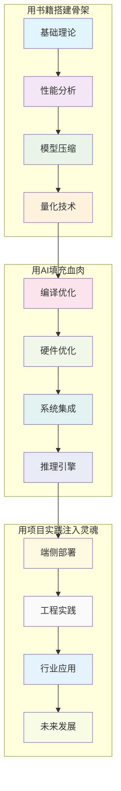

# 模型部署技术鱼骨图分析

## 概述
基于《模型部署-软硬一体优化技术》书稿内容，构建"用书籍搭建骨架，用AI填充血肉，用项目实践注入灵魂"的技术体系鱼骨图。

## 一横：12个核心技术节点的递进关系

## 一纵：各节点详细目录结构

### 1. 基础理论 📚
**章节来源**: 第1章 算力、算法与数据

#### 核心内容
- **技术演进脉络**
  - 从传统计算到智能计算的演变
  - 边缘计算的兴起与挑战
  - 大模型时代的计算瓶颈

- **核心性能指标**
  - 延迟(Latency)：响应时间优化
  - 吞吐量(Throughput)：处理能力评估
  - 功耗(Power)：能效比分析
  - 存储与内存带宽：数据流优化

- **理论基础**
  - 计算复杂度分析
  - 内存访问模式
  - 并行计算原理

### 2. 性能分析 📊
**章节来源**: 第2章 Roofline Model

#### 核心内容
- **Roofline模型理论**
  - 计算强度(Computational Intensity)
  - FLOPS与内存访问比率
  - 性能上界分析

- **硬件性能评估**
  - CPU/GPU架构分析
  - 内存层次结构优化
  - 带宽利用率计算

- **瓶颈识别方法**
  - 计算密集型 vs 内存密集型
  - 性能剖析工具使用
  - 优化方向指导

### 3. 模型压缩 🗜️
**章节来源**: Model Compression章节

#### 核心内容
- **剪枝技术(Pruning)**
  - 结构化剪枝：层级、滤波器级别
  - 非结构化剪枝：权重级别
  - 半结构化剪枝：N:M稀疏模式

- **低秩分解**
  - 矩阵分解理论
  - SVD/Tucker分解应用
  - 参数减少策略

- **敏感性分析**
  - 层级重要性评估
  - 梯度敏感性计算
  - 自适应压缩策略

### 4. 量化技术 ⚡
**章节来源**: Quantization相关章节

#### 核心内容
- **数据表示优化**
  - FP32 → FP16 → INT8 → INT4
  - 混合精度计算
  - 自定义数值格式

- **量化算法**
  - 训练后量化(PTQ)
  - 量化感知训练(QAT)
  - 动态量化策略

- **Straight Through Estimator**
  - 梯度传播机制
  - 量化误差补偿
  - 反向传播优化

### 5. 编译优化 🔧
**章节来源**: Compiler/System Optimization

#### 核心内容
- **算子融合(Operator Fusion)**
  - 计算图优化
  - 内存访问减少
  - 延迟降低策略

- **内存管理**
  - 内存池分配
  - 生命周期管理
  - 碎片化避免

- **并行服务**
  - 批处理优化
  - 流水线并行
  - 动态调度

### 6. 硬件优化 🖥️
**章节来源**: Hardware Optimization

#### 核心内容
- **专用硬件加速器**
  - NPU架构设计
  - ASIC优化策略
  - FPGA可编程加速

- **异构计算**
  - CPU+GPU协同
  - 多核并行处理
  - 负载均衡策略

- **硬件友好设计**
  - 网络架构适配
  - 计算模式优化
  - 数据流设计

### 7. 系统集成 🔗
**章节来源**: 深度学习编译器章节

#### 核心内容
- **编译器框架**
  - TVM/MLIR/XLA
  - 图优化技术
  - 代码生成策略

- **运行时优化**
  - 动态调度
  - 资源管理
  - 错误处理

- **跨平台适配**
  - 多硬件支持
  - 统一接口设计
  - 性能可移植性

### 8. 推理引擎 🚀
**章节来源**: 推理引擎相关章节

#### 核心内容
- **引擎架构设计**
  - 模块化设计
  - 插件机制
  - 扩展性考虑

- **算子支持**
  - 标准算子库
  - 自定义算子
  - Plugin集成方式

- **性能优化**
  - 内存复用
  - 计算优化
  - 并发处理

### 9. 端侧部署 📱
**章节来源**: LLM端侧大模型部署

#### 核心内容
- **移动端优化**
  - Android Gemini Nano
  - AI Core集成
  - 资源受限优化

- **边缘计算**
  - 延迟优化
  - 隐私保护
  - 离线推理

- **系统级优化**
  - 计算优化
  - 通信加速
  - 存储架构

### 10. 工程实践 🛠️
**章节来源**: 相关工作要求章节

#### 核心内容
- **技能要求**
  - SIMD编程技术
  - 系统级调优
  - 并发编程

- **工具链掌握**
  - OpenCV图像处理
  - TVM/MLIR框架
  - 高性能计算库

- **优化实践**
  - 稀疏计算
  - 异构计算
  - 编译器优化

### 11. 行业应用 🚗
**章节来源**: 自动驾驶行业大模型部署

#### 核心内容
- **自动驾驶场景**
  - 实时性要求
  - 安全性考虑
  - 多模态融合

- **行业特定优化**
  - BEV网络优化
  - Transformer加速
  - 感知算法优化

- **部署挑战**
  - 车载硬件限制
  - 功耗控制
  - 可靠性保证

### 12. 未来发展 🔮
**章节来源**: 数学公式篇及综合分析

#### 核心内容
- **理论突破**
  - 新型优化算法
  - 数学建模创新
  - 约束优化理论

- **技术趋势**
  - 新硬件架构
  - 算法创新
  - 系统级优化

- **应用前景**
  - 更广泛的部署场景
  - 更高的性能要求
  - 更智能的优化策略

## 鱼骨图总体架构

## 技术体系核心价值

### 📖 书籍搭建骨架
- **理论基础扎实**: 从基础理论到性能分析，建立完整的知识体系
- **技术路径清晰**: 模型压缩到量化技术的渐进式学习路径
- **概念体系完整**: 涵盖算力、算法、数据三大核心要素

### 🤖 AI填充血肉
- **技术实现具体**: 编译优化、硬件优化等具体技术方案
- **系统集成完善**: 从单点技术到系统级解决方案
- **工程化程度高**: 推理引擎等实际可用的技术组件

### 💡 项目实践注入灵魂
- **应用场景丰富**: 端侧部署、自动驾驶等实际应用
- **工程能力要求**: 具体的技能要求和工具链掌握
- **未来发展方向**: 技术演进趋势和创新方向

## 总结

这个鱼骨图体现了模型部署技术的完整生态系统，从理论基础到工程实践，从单点技术到系统集成，形成了一个层次分明、逻辑清晰的技术体系。每个节点都有其独特的价值和作用，共同构成了"用书籍搭建骨架，用AI填充血肉，用项目实践注入灵魂"的完整技术图谱。