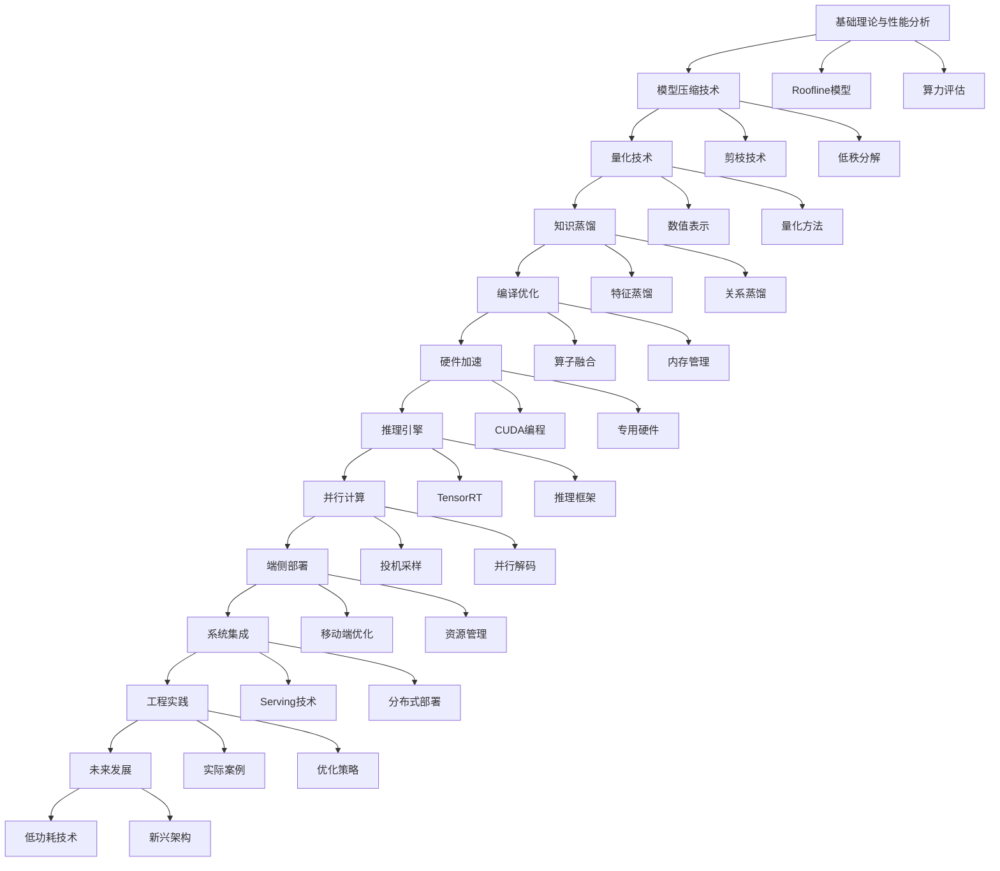

# 模型部署软硬一体优化技术体系 - 优化鱼骨图分析

## 1. 产品概述

本文档基于《模型部署-软硬一体优化技术》书稿内容，构建了一个完整的技术体系鱼骨图，体现"用书籍搭建骨架，用AI填充血肉，用项目实践注入灵魂"的理念。通过横轴12个递进技术节点和纵轴详细目录结构，形成从基础理论到实际应用的完整技术路径。

## 2. 核心特征

### 2.1 技术体系架构

**横轴递进关系：** 12个技术节点按照从理论基础到实际应用的逻辑顺序排列，每个节点都是下一个节点的技术基础。

**纵轴目录结构：** 每个技术节点下包含详细的子目录和核心技术点，形成完整的知识体系。

### 2.2 技术节点详细分析

我们的技术体系包含以下12个递进的核心技术节点：

1. **基础理论与性能分析** - 建立理论基础
2. **模型压缩技术** - 减少模型复杂度
3. **量化技术** - 降低数值精度
4. **知识蒸馏** - 知识传递优化
5. **编译优化** - 计算图优化
6. **硬件加速** - 专用硬件支持
7. **推理引擎** - 高效推理框架
8. **并行计算** - 并行处理技术
9. **端侧部署** - 移动端优化
10. **系统集成** - 服务化部署
11. **工程实践** - 实际应用案例
12. **未来发展** - 前沿技术趋势

### 2.3 页面详细设计

| 技术节点 | 核心模块 | 技术要点描述 |
|----------|----------|-------------|
| 基础理论与性能分析 | Roofline模型分析 | 计算强度分析、算力与带宽评估、性能瓶颈识别、LLM推理阶段分析(Prefill/Decode) |
| 基础理论与性能分析 | 算力评估体系 | FLOPS计算、访存量分析、带宽利用率、计算密集型vs访存密集型判断 |
| 模型压缩技术 | 剪枝技术 | 结构化剪枝、非结构化剪枝、稀疏矩阵存储、Lottery Ticket假设、激活剪枝 |
| 模型压缩技术 | 低秩分解 | 矩阵分解技术、SVD分解、Tucker分解、参数共享、权重矩阵压缩 |
| 量化技术 | 数值表示优化 | FP32→INT8转换、均匀量化、非均匀量化、对称/非对称量化 |
| 量化技术 | 量化方法 | 训练后量化(PTQ)、量化感知训练(QAT)、混合精度、STE算法 |
| 知识蒸馏 | 特征蒸馏 | 中间层特征传递、注意力图蒸馏、激活状态蒸馏、FitNets方法 |
| 知识蒸馏 | 关系蒸馏 | 样本间关系、层间关系、互学习机制、自蒸馏技术 |
| 编译优化 | 算子融合 | 线性+SiLU融合、FlashAttention、Deep-Fusion、内存访问优化 |
| 编译优化 | 内存管理 | PagedAttention、KV缓存管理、动态内存分配、工作负载卸载 |
| 硬件加速 | CUDA编程 | GPU并行计算、内存层次结构、Tensor Core利用、GEMM优化 |
| 硬件加速 | 专用硬件 | TPU架构、ASIC设计、FPGA加速、神经网络处理器 |
| 推理引擎 | TensorRT优化 | 图优化、内核融合、精度校准、动态形状处理 |
| 推理引擎 | 推理框架 | ONNX Runtime、TensorFlow Lite、PyTorch Mobile、推理服务化 |
| 并行计算 | 投机采样 | Draft模型加速、并行验证、Lookahead Decoding、非自回归Transformer |
| 并行计算 | 并行解码 | Skeleton-of-Thoughts、APAR技术、并行文本生成、迭代算法 |
| 端侧部署 | 移动端优化 | 内存受限优化、低功耗设计、模型分割、异构计算 |
| 端侧部署 | 资源管理 | 动态批处理、内存复用、算子优化、模型分区 |
| 系统集成 | Serving技术 | 连续批处理、分块预填充、负载均衡、服务编排 |
| 系统集成 | 分布式部署 | 模型并行、流水线并行、数据并行、分布式推理 |
| 工程实践 | 实际案例 | 175B模型部署、四卡Orin方案、性能调优、问题诊断 |
| 工程实践 | 优化策略 | 硬件选型、软硬协同、性能监控、故障排查 |
| 未来发展 | 低功耗技术 | 时钟门控、电源门控、多电压域、DVFS技术 |
| 未来发展 | 新兴架构 | 存算一体、光计算、量子计算、神经形态计算 |

## 3. 核心流程

### 3.1 技术演进路径

技术体系遵循从理论到实践的递进关系：

1. **理论基础阶段**：建立Roofline模型分析框架，理解计算与访存的平衡关系
2. **算法优化阶段**：通过剪枝、量化、蒸馏等技术减少模型复杂度
3. **系统优化阶段**：利用编译器和硬件加速技术提升执行效率
4. **部署优化阶段**：通过推理引擎和并行技术实现高效部署
5. **工程实践阶段**：在实际场景中验证和优化技术方案

### 3.2 技术流程图



## 4. 用户界面设计

### 4.1 设计风格

- **主色调**：深蓝色(#1E3A8A)和橙色(#F97316)，体现技术专业性和创新活力
- **辅助色**：灰色(#6B7280)用于文本，绿色(#10B981)用于成功状态
- **字体**：主标题使用18px粗体，正文使用14px常规字体
- **布局风格**：卡片式设计，清晰的层次结构
- **图标风格**：线性图标，简洁现代

### 4.2 页面设计概览

| 页面名称 | 模块名称 | UI元素 |
|----------|----------|--------|
| 鱼骨图主页 | 横轴技术节点 | 12个递进的技术卡片，每个卡片包含节点名称、核心技术点、进度指示器 |
| 鱼骨图主页 | 纵轴目录结构 | 可展开的树形结构，显示每个节点的详细子目录和技术要点 |
| 技术节点详情页 | 技术概述 | 节点介绍、核心概念、技术原理、应用场景 |
| 技术节点详情页 | 实践案例 | 代码示例、性能数据、优化效果、最佳实践 |
| 技术关系图 | 依赖关系 | 交互式技术依赖图，显示节点间的前置关系和影响关系 |
| 学习路径页 | 进度跟踪 | 学习进度条、完成状态、推荐学习顺序、难度评级 |

### 4.3 响应式设计

采用桌面优先的响应式设计，支持移动端适配：
- **桌面端**：完整的鱼骨图展示，支持鼠标悬停和点击交互
- **平板端**：简化的卡片布局，保持核心功能
- **移动端**：垂直滚动的列表视图，优化触摸操作

## 5. 技术实现架构

### 5.1 前端技术栈
- **框架**：React 18 + TypeScript
- **样式**：Tailwind CSS + Styled Components
- **图表**：D3.js + Mermaid
- **状态管理**：Zustand
- **构建工具**：Vite

### 5.2 数据结构设计

```typescript
interface TechNode {
  id: string;
  name: string;
  description: string;
  level: number;
  prerequisites: string[];
  modules: TechModule[];
  status: 'not-started' | 'in-progress' | 'completed';
}

interface TechModule {
  id: string;
  name: string;
  description: string;
  keyPoints: string[];
  practiceExamples: PracticeExample[];
}

interface PracticeExample {
  title: string;
  description: string;
  codeSnippet?: string;
  performanceData?: PerformanceMetric[];
}
```

## 6. 总结

本优化鱼骨图分析文档构建了一个完整的模型部署软硬一体优化技术体系，通过12个递进的技术节点和详细的目录结构，为学习者和实践者提供了清晰的技术路径。该体系不仅涵盖了从基础理论到前沿技术的完整知识图谱，还通过实际案例和工程实践，真正实现了"用书籍搭建骨架，用AI填充血肉，用项目实践注入灵魂"的设计理念。