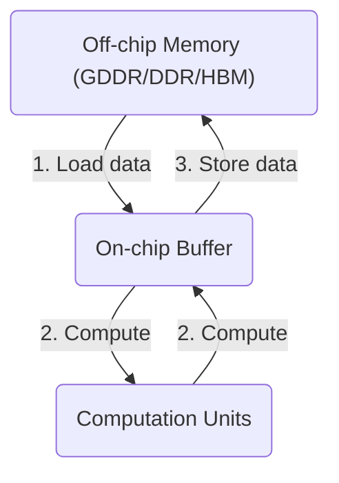

# 第2章: Roofline Model模型在芯片及硬件上的运行与分析

*   **低计算强度**（≤32 TOPS）：选 **W4A16**，在精度与速度间平衡；
    
*   **高计算强度**（≥64 MACs/Element，对应 TOPS 300+）：选 **W4A8**，充分释放芯片峰值算力；
    
*   **核心逻辑**：根据计算强度匹配量化方式的 “甜蜜区”，结合硬件特性（如 SIMD、TensorCore）选择低比特方案，通过算法 - 系统协同（如内核融合、权重打包）逼近芯片峰值性能。
    

https://www.doubao.com/thread/w7385589cb8057200

[https://www.doubao.com/thread/w7385589cb8057200: https://www.doubao.com/thread/w7385589cb8057200](https://www.doubao.com/thread/w7385589cb8057200)

## 工作量评估

1.导出onnx，分段

1.模型和部署的对接文档格式

2.Onnx 转bin

3.APP 调用5个API

4.对数-单帧比对，可视化

1.IO对齐，拿到run.sh pad 后的输入和APP 的输入对比，uint8 和fp16 输入问题

2.输出对齐，Run.sh 拿到每个网络的输出和APP dump的结果比对---写一个辅助工具

3.仿真的结果比对，数据位宽

5.离线量化混合精度量化，连接

1.单帧的混合量化；

2.Image backone int8 ，head int8 +fp16;

6.Memory bank 设计

7.Clip 对数

8.APP 调度，连接多个onnx

1.共用的feature放到flexidag\_memblk\_t

2.多batch问题

3.位宽

9.APP前后处理

## 1.逻辑python和c++比对

10.精度调优

1.Int8 跑指标

2.多帧可视化

3.在线量化

11.封装SDK，联调

## 2.0 .评估这块板子是否可以运行起来我们的网络

## 2.1 芯片选型与工具链选择

### 2.1.1 价格与需求

在将模型部署于硬件之前，选择合适的芯片是第一步。通常情况下，价格、算力以及工具链的支持程度是主要的考量因素。人们常常忽略了工具链的重要性，一个好的工具链可以大幅减少工作量。

1.  **价格与采购量**：  采购芯片时，价格会随需求量而变动，如1000片与10万片的成本差异显著。此外，公司体量、项目规模以及预期需求也是决定价格的关键因素。
    
2.  **算力需求**：  算力是另一核心标准，目前主流芯片都支持int8运算。以NVIDIA Orin为例，其算力高达254 TOPS，但实际能够有效利用的算力往往远低于这一理论值。
    

### 2.1.2 NVIDIA Orin的算力构成

Orin的算力由以下几部分组成：

*   **GPU**：基于Ampere架构的GPU，适用于深度学习、并行计算。
    
*   **CPU**：采用Arm Cortex-A78AE核心，提升了单线程性能并增强了系统稳定性。
    
*   **DLA和ISP**：用于深度学习推理的DLA和用于图像处理的ISP，增强了系统实时处理能力。
    
*   **PVA**：可编程视觉加速器，专为计算机视觉任务设计。
    
*   **安全与虚拟化技术**：支持多域安全功能，确保系统高安全性。
    

尽管这些硬件模块构成了强大的理论算力，但许多用户无法充分利用DLA和PVA模块，导致实际可用算力大约仅为40 TOPS。此外，工具链的损耗也进一步降低了实际算力利用率，通常能达到10%就已经很高了。

### 2.1.3 工具链支持的重要性

工具链的支持程度在推理优化中起到关键作用。对于自定义算子以及特殊卷积计算的支持程度，决定了模型能否充分利用硬件资源。一个强大的工具链能够显著提高模型的性能。

## 2.2 模型推理的定量分析

为了实现AI加速器的软硬件协同优化，通常需要事先确定模型在AI加速器上运行时的效率瓶颈。首先，必须明确瓶颈是出现在计算部分还是内存访问部分。只有针对具体的瓶颈进行优化，才能在性能上实现最大提升。当计算成为瓶颈时，内存访问单元会有闲置现象，此时可以通过减少模型的计算量或增加计算的并行性来提升性能；反之，当内存访问成为瓶颈时，计算单元则会出现闲置，这时候应采取减少模型参数量或增加内存带宽的方式来提升性能。只有当计算和内存访问同时成为瓶颈，即计算单元和内存单元的利用率都达到峰值，AI加速器才能发挥其全部性能。

Roofline模型是常用的性能瓶颈分析工具之一。通过计算神经网络模型的总计算量和总内存访问量，可以得出模型的平均计算强度。随后，借助特定硬件的Roofline模型，可以确定该模型在该硬件上的理论性能上限。

### Roofline模型计算方法

Roofline 模型最早由 University of California, Berkeley 的 Samuel Williams 等人提出，用于评估计算性能与硬件资源利用率之间的关系。该模型将浮点性能、计算密度和内存性能联系在一起，其中计算密度是计算量与访存量的比值，单位为 FLOPs/Byte。

在 Roofline 模型中，横坐标通常表示计算内核的性能，以浮点运算每秒（FLOP/s）为单位；纵坐标表示内存带宽，以字节每秒（Bytes/s）为单位。屋顶线代表了硬件性能的上限，由硬件的理论峰值性能和内存带宽限制所定义。如果性能点位于屋顶线以下，瓶颈可能是内存带宽；若位于屋顶线附近，瓶颈则可能是计算能力。例如，以 CPU 为例，如 Intel Xeon Gold 6000 (server)，其内存为 DDR4 - 2666，内存时钟为 2666 MHz，内存总线宽度为 8 Bytes，内存通道为 6，通过计算可得其内存带宽为 2666 MHz \* 8 Bytes \* 6 = 128GB/s。

Roofline 模型在高性能计算和计算机科学领域有广泛应用，包括性能优化、硬件评估、算法选择和性能分析等方面。通过该模型，开发者可以更好地理解计算内核的性能瓶颈，并针对性地进行优化工作，提高计算性能，合理选择硬件平台，实现最佳性能和资源利用率。

任何计算平台都会有其峰值算力（以下均用浮点计算进行说明）和峰值带宽B。峰值算力代表该硬件在理想状态下每秒可以完成的浮点计算次数的上限，峰值带宽代表了该硬件在理想状态下每秒与内存交换的数据量上限。

### Roofline 模型的关键概念

### （一）计算强度

计算强度反映了每字节内存交换所用于的浮点运算次数，它是计算量与访存量的比值。例如，在一些深度学习模型中，不同的模型会有不同的计算强度。以 VGG16 为例，其仅包含一次前向传播的计算量就达到了 15GFLOPs，访存量则是 Kernel Mem 和 Output Mem 之和再乘以四，大约是 600MB。因此 VGG16 的计算强度就是 25 FLOP/Byte。如果把模型顶端那两个硕大无比的全链接层替换为 GAP 以降低访存量，其实际计算强度可以再提升四倍以上。计算强度越大，表明内存使用效率越高。

### （二）计算量

计算量指的是输入单个样本（对于 CNN 而言就是一张图像），模型进行一次完整的前向传播所发生的浮点运算个数，是衡量模型时间复杂度的标准，单位是 FLOPS。在卷积层中，计算量的大小与卷积核的大小、输入输出通道数等因素有关。比如，在一些大型的深度学习模型中，计算量可能会非常大，这就需要强大的计算平台来支持其运行。

### （三）访存量

访存量指的是输入单个样本，模型完成一次前向传播过程中所发生的内存交换总量，是衡量模型空间复杂度的标准，单位是 Byte。在理想情况下（即不考虑片上缓存），模型的访存量就是模型各层权重参数的内存占用（Kernel Mem）与每层所输出的特征图的内存占用（Output Mem）之和。由于数据类型通常为 float32，因此需要乘以四。例如，MobileNet 的访存量只有大约 74MB，而 VGG16 的访存量则约为 600MB。

### （四）带宽

带宽是单位时间内可传输的数据量，衡量计算机硬件 memory 性能，单位是 Byte/s。以 NVIDIA Quadro RTX 6000 为例，其内存为 GDDR6，内存时钟为 1750MHz，内存时钟有效频率为 1750MHz \* 8 = 14Gbps，内存接口宽度为 48Bytes（384bits），通过计算可得其内存带宽为 14Gbps \* 48Bytes \* 1 = 672GB/s。带宽越大，在模型处于带宽瓶颈区间时，理论性能可呈线性增长。

### Roofline 模型公式与图像分析

对于神经网络模型计算任务，可以评估其计算强度  $I\_{model}= \pi\_{model}/ \beta\_{model},$

**模型的计算量** $\pi\_{model}$ **，**指针对一个输入（对于卷积神经网络模型而言，通常是一张图片），模型进行一次完整的推理过程（前向传播）中的浮点计算量。这通常可以通过神经网络模型的参数（如卷积核的大小、输入通道数和输出通道数）简单地计算得到；卷积层中的浮点计算量在前向传播中，卷积层的浮点计算量通常可以通过模型的参数，如卷积核大小、输入通道数和输出通道数，进行简单计算。例如，对于一个包含偏置项的普通卷积层，计算量的公式为：

$\pi\_{ \mathrm{conv}}=C\_{out} \times H\_{out} \times W\_{out} \times \left( C\_{in} \times K\_{h} \times K\_{w}+1 \right)$

  其中：

       • C\_out 表示输出通道数。

• C\_in 表示输入通道数。

• H\_out 和 W\_out 分别是输出特征图的高度和宽度。

• K\_h 和 K\_w 分别是卷积核的高度和宽度。

**模型的访存量** $\beta\_{model},$是指模型在一次完整推理过程中所需的内存交换量（单位为字节）。在理想情况下，不考虑 AI 加速器片上缓存较小所导致的重复访问，模型的访存量可以表示为：

模型访存量 = 参数大小 + 输出大小  也就是模型各层参数和输出特征图占用内存的总和。以一个普通的卷积层为例，其访存量可以表示为：

访存量 = 输出通道数 × (输入通道数 × 卷积核高度 × 卷积核宽度 + 1) + 输出通道数 × 输出特征图高度 × 输出特征图宽度

目前，主流的深度学习框架（如 PyTorch 和 TensorFlow）自带计算量和访存量的统计功能，因此可以轻松获得模型的计算量和访存量。

根据模型的计算量和防存量，可以快速计算出计算强度$I\_{model}$

根据硬件的算力和带宽情况，可以使用 Roofline 模型来表示给定模型计算强度$I\_{model}$下，硬件能够输出的最高算力。

如图 9.3 所示，横轴代表模型的计算强度，纵轴表示实际运行的算力。通过分析工作点在图中的位置及其与 Roofline 曲线的相对关系，设计者可以确定如何改进软硬件系统。

图中的水平线代表硬件的最大算力，垂直线代表硬件的最大带宽，曲线的拐点则代表计算强度。当模型的工作点位于曲线拐点时，表示模型能够充分利用硬件的算力和带宽。如果工作点不在拐点，则说明有资源未被充分利用。

在你上传的图片中，公式显示为：

$\[ I\_0 = \frac{\pi}{\beta} \]$

结合我们之前讨论的内容，这里的$( I\_0 )$ 应该表示模型的**计算强度（computation intensity）**，即**FLOP（浮点运算次数）/数据传输量**的比值。该比值是Roofline模型中的一个关键参数，用来判断计算是否受限于**算力（FLOPS）还是带宽（Bandwidth）**。

*   $( \pi )$ 表示硬件的最大算力（峰值FLOPS）。
    
*    $( \beta )$表示硬件的最大带宽。
    

因此，I₀ = π/β 是Roofline模型中算力受限和带宽受限的分界点。即当计算强度 I 等于 I₀ 时，系统正好处于带宽和算力均被充分利用的状态。如果计算强度 I 小于 I₀，系统受限于带宽；如果 I 大于 I₀，系统则受限于算力。

Roofline Model可以看出平均带宽需求和峰值计算能力像天花板一样是整个系统计算的能力上限，以计算强度上限Imax为界，划分出AI芯片的两个瓶颈区域，即图中橘色的内存受限区（Memory Bound）和图中蓝色的计算受限区（Compute Bound）。存储决定了下限，计算决定了上限。因为 Decoding 阶段 Token 逐个处理，使用 KV Cache 之后， Multi-Head Attention 里的矩阵乘矩阵操作全部降级为矩阵乘向量即GEMV。此外，Transformer 模型中的另一个关键组件 FFN 中主要也包含两个矩阵乘法操作，但 Token 之间不会交叉融合，也就是任何一个 Token 都可以独立计算，因此在 Decoding 阶段不用 Cache 之前的结果，但同样会出现矩阵乘矩阵操作降级为矩阵乘向量。Prefill阶段则是GEMM，即矩阵与矩阵的乘法。GEMV是访存密集型操作，性能完全取决于存储带宽

（1）当模型的计算强度 Imode 低于计算强度拐点 20，位于红色区域内时（即左侧区域），实际运行的工作点在纵轴上不会超过红色区域的 Roofline 实线，硬件输出的最高算力与实际的模型计算强度 Imode 成正比。较小的 Imode 说明该模型单位访存所能进行的计算较少，即使将峰值带宽 B 用满，也无法充分利用计算资源。此时，任务受限于访存，属于访存密集型任务，对应部分计算单元处于空闲状态。若发现实际工作点位于红色实线上，则表明当前系统已经充分利用了峰值带宽所能输出的对应算力。

（2）当模型的计算强度 Imode 高于 10，位于绿色区域内时（即右侧区域），实际运行工作点在纵轴上不会超过绿色区域的 Roofline 实线，硬件输出的最高算力为硬件本身的峰值算力 π。较高的模型计算强度 Imode 意味着在进行较少的访存时，模型就要消耗大量计算能力。因此，不需要完全占用带宽就能满足所有计算单元的数据需求，从而让计算单元被充分利用。此时，任务受限于计算，是计算密集型任务，对应访存单元处于部分空闲状态。

由上述分析可知，给定模型计算强度 Imode、硬件最大算力 π 与最大带宽 β，Roofline 算力（理想的可输出的最高算力）Perf 可以写作：

$\mathrm{Perf}=\begin{cases}\beta\times I\_{\mathrm{model}},&I\_{\mathrm{model}}<I \_{0} ( \text{访存瓶颈} )\\ \\ \qquad\qquad\pi,&I\_{\mathrm{model}}\geqslant I\_{0} ( \text{计算瓶颈} )\end{cases}$

然而，实际任务在硬件上运行时，由于访存的非理想开销、流水线中的气泡等原因，并不能达到理想可输出的最高算力，实际工作点通常无法达到 Roofline，而是位于 Roofline 之下。实际工作点离 Roofline 越近，说明软硬件状态越理想，算力越接近理论值；反之，则说明距离理论值较大，仍具有较大优化空间。

Roofline 模型是一个软硬件协同优化过程中常用的分析模型。当计算强度等于计算强度拐点 \( I\_0 \) 时，硬件可以同时以峰值算力和峰值带宽工作，计算单元和访存单元同时达到最大负载，这是最理想的工作状态。因此，我们应该进行软硬件协同设计，尽量让系统工作在这个转折点处，调整硬件的计算强度拐点 \( I\_0 \) 和模型的计算强度，使模型计算强度等于硬件的计算强度拐点 \( I\_0 \)。再通过优化硬件的控制和数据通路，使实际工作点更接近转折点。

然而，统计模型在计算访存量时往往没有考虑片上缓存有限导致的数据重复访问问题。另外，硬件的非理想特性导致性能与计算强度之间的关系并非理想的线性，这在访存瓶颈区域尤为明显。因此，Roofline 模型只能作为一个粗略的、快速的分析工具。更细粒度的分析通常需要针对硬件本身的架构进行建模，使用专门的仿真器，以进一步分析内部的性能瓶颈。然而，Roofline 模型可以快速、便捷地对整个问题进行建模，因此仍然是软硬件协同设计时的重要分析工具之一。

当前主流的架构选择是基于Transformer的解码器模型，尤其在构建大型语言模型（LLM）领域。此架构的核心设计可概括为一个嵌入层、一组连续的四个Transformer层，以及一个预测头，赵等人在2023年的研究中对此有详尽探讨，有兴趣的读者可参阅该文献以获取深度解析。

体系结构启动于输入令牌通过嵌入层的转换，这一过程赋予每个令牌以高维向量表示，即隐藏状态。随后，这些隐藏状态历经一连串的Transformer层深化处理。每一Transformer层级构成蕴含两部分：首先是掩码多头注意力（Masked Multi-Head Attention, MHA）模块，它促进了序列内部的依赖学习；继之以多层感知器（Multilayer Perceptron, MLP）组件，执行复杂的特征变换与非线性映射，增强了模型的表达能力。

经过这一系列变换后，得到的表示被导向至预测头部，该组件承担着预测接续于给定输入的下一个令牌的任务，从而在生成文本时体现连贯性和预见性。这一架构设计不仅体现了深度学习在自然语言处理中的先进实践，也展示了Transformer模型在捕捉长距离依赖和模式识别方面的卓越效能。

推理，与训练过程形成鲜明对比，是一种操作模式，在此模式下，经过充分训练的模型运用其内在化的知识库来处理新信息，而非调整内部参数。训练环节涉及模型通过大量数据迭代，以捕获语言的细微差别及上下文的深度结构，并据此优化其权重配置。相反，推理阶段则是模型部署的实践场景，此时模型接收用户提供的提示，并基于其冻结的预训练权重，进行文本理解和生成，展示对输入信息的深入理解和生成连贯、语境恰当的响应能力。

在大型语言模型（LLM）的推理框架中，这一过程细致地划分为两个核心阶段：预填充（Prefill）与解码（Decode）。预填充阶段标志着LLM推断流程的起始点，其核心在于利用输入的提示序列，通过模型的架构高效构建关键-价值（Key-Value, KV）缓存机制。此机制对于每一个变压器（Transformer）层级都是独立存在的，旨在有效捕捉并保留与后续文本生成紧密相关的上下文信息。KV缓存通过减少重复计算和增强对长距离依赖的理解，成为加速和提升生成质量的关键技术。在此阶段，模型不仅为即将到来的解码任务准备了必要的上下文环境，还通过预计算关键值对，为高效的信息检索打下了基础。

具体到技术实施上，预填充期间，多头自注意力（Multi-Head Attention, MHA）机制扮演了核心角色。它通过一组精心设计的权重矩阵（Wq, Wk, Wv, Wo），将输入的提示序列（表示为Xpre∈ℝ^n×d，其中d代表隐藏维度，n为提示序列的长度）转化为查询（queries）、键（keys）和值（values）。这一系列转换不仅促进了信息的并行处理，也确保了模型能从不同角度（即多个注意力头）全面审视输入序列，从而更加细腻地捕捉语义特征。这些计算出的键值对随后被保存至KV缓存中，为后续解码阶段提供必要且优化的信息访问路径，确保生成的文本既连贯又富有上下文适应性。这一系列复杂的前处理步骤，共同构成了LLM推理过程中不可或缺的预填充阶段，为实现高质量文本生成的高效执行铺平了道路。

在预填充阶段，多头注意力（MHA）机制会创建键值（KV）对，这些对将被存储在KV缓存中。设输入到Transformer层的向量为Xpre ∈ Rn×d，其中d表示隐藏层大小，n表示提示令牌序列的长度。MHA层中的权重由Wq、Wk、Wv和Wo表示。查询、键和值是通过以下过程计算得出的：

$\begin{split}\mathrm{Query:}&\quad\mathbf{Q}\_{ \mathrm{pre}}=\mathbf{X}\_{\mathrm{pre}}\cdot\mathbf{W}\_{\bm{q}}\\ \mathrm{Key:}&\quad\mathbf{K}\_{\mathrm{pre}}= \mathbf{X}\_{\mathrm{pre}}\cdot\mathbf{W}\_{\bm{k}}\\ \mathrm{Value:}&\quad\mathbf{V}\_{\mathrm{pre}}= \mathbf{X}\_{\mathrm{pre}}\cdot\mathbf{W}\_{\bm{v}}\end{split}$

生成的Kpre和Vpre存储在KV缓存中。MHA中的其他计算可以表示为公式1：

$\mathbf{O}\_{\mathrm{pre}}=\mathrm{softmax}\left(\frac{\mathbf{Q}\_{\mathrm{pre}} \cdot\mathbf{K}\_{\mathrm{pre}}^{T}}{\sqrt{d}}\right)\cdot\mathbf{V}\_{\mathrm{ pre}}\cdot\mathbf{W}\_{o}+\mathbf{X}\_{\mathrm{pre}}$

MHA（多头自注意力）模块的输出 $\mathbf{O}\_{\mathrm{pre}}\in\mathbb{R}^{\bm{n}\times\bm{d}}$会被送入到MLP（多层感知机）中。

MLP的输出则作为下一个Transformer层的输入。

解码阶段代表了LLM推理过程的核心。在这个解码阶段，模型利用之前准备好的KV缓存，并可能向其中添加新信息。其主要目标是生成令牌（tokens），这些令牌实质上是单词或词组的一部分。这个生成过程是逐步进行的，每一个新生成的令牌都会受到它之前已生成的令牌的影响，类似于逐词构建一个句子。

在解码阶段，多头自注意力（MHA）机制会加载先前存储的KV缓存（K缓存和V缓存）。输入是 $\begin{array}{c}{\ \ \mathrm{\ {X}\_{dec}\ \in}}\ \mathbb{R}^{1\times d}.\mathrm{}\end{array}$表示一个维度为d的单个向量。接着，会计算新的键（key）和值（value）对，并将它们连接到现有的缓存之上。

$\begin{split}\mathrm{Query:}&\quad\mathbf{Q}\_{ \mathrm{dec}}=\mathbf{X}\_{\mathrm{dec}}\cdot\mathbf{W}\_{q}\\ \mathrm{Key:}&\quad\mathbf{K}\_{\mathrm{cat}}=\left\[ \mathbf{K}\_{\mathrm{cache}},\mathbf{X}\_{\mathrm{dec}}\cdot\mathbf{W}\_{k} \right\]\\ \mathrm{Value:}&\quad\mathbf{V}\_{\mathrm{cat}}=\left\[ \mathbf{V}\_{\mathrm{cache}},\mathbf{X}\_{\mathrm{dec}}\cdot\mathbf{W}\_{v} \right\]\end{split}$

这些新计算的 Xdec · Wk 和 Xdec · Wv 然后被追加到 KV 缓存中。MHA 中的其他计算如下进行：

$\mathbf{O}\_{\mathrm{pre}}=\mathrm{softmax}\left(\frac{\mathbf{Q}\_{\mathrm{pre}} \cdot\mathbf{K}\_{\mathrm{pre}}^{T}}{\sqrt{d}}\right)\cdot\mathbf{V}\_{\mathrm{ pre}}\cdot\mathbf{W}\_{o}+\mathbf{X}\_{\mathrm{pre}}$

MHA（多头自注意力）模块的输出 $O\_{dec} \in R^{1 \times d}$被送到MLP（多层感知机）中。Transformer最后一层的输出会被送到最终的预测层，以预测下一个token。

## 2.2. Roofline Model 使用Roofline模型有两个步骤：

评估大规模语言模型（LLM）在专有硬件平台上的部署效率是一项复杂任务，它深刻依赖于对硬件特性和模型架构的深入理解。为此，我们采纳了Roofline模型作为一种先进的性能评估工具，该模型在图4中直观展示了在特定硬件环境下部署模型的潜能界限。此模型不仅是理论分析的坚固基石，也是实践应用中优化策略制定的指南。

在神经网络层的硬件执行语境下，数据流动构成了核心活动序列：从离散的内存资源（如DDR或HBM）加载至高效的片上缓冲区，随后经由处理单元进行密集计算处理，直至最终计算成果被回写至内存存储。这一连串操作要求对内存访问带宽与处理器计算能力进行综合考量，二者间的平衡直接决定了性能表现的天花板。

具体而言，Roofline模型使我们能够精准地区分并诊断两种关键性能瓶颈情境。首先，对于那些计算密集度高而内存交互相对有限的网络层，它们遭遇的是“计算瓶颈”。在此状态下，内存系统未被充分占用，表现为计算潜力未能得到完全释放。相反，若某层特征在于其对内存访问的极度依赖，而计算负担较轻，则定义为“内存瓶颈”。这种情形下，处理器资源闲置，无法达到最大利用率。

通过精细运用Roofline模型，我们不仅能够明确辨识这些性能限制类型，还能为每种特定场景设定清晰的性能上限，从而为优化模型部署策略、最大化硬件利用率及提升整体运行效率提供科学依据与实践路径。这不仅强化了我们对复杂系统交互的理解，还为实现高效能计算解决方案铺平了道路。

### Plot the Roofline:

确定目标硬件设备的峰值计算性能（每秒操作数，OPS）和峰值内存带宽（每秒字节数）。然后创建一个图表，其中y轴表示性能（OPS），x轴表示算术强度（OPS/字节）：绘制一条与峰值计算性能相等的水平线。这条线代表了硬件设备可达到的最大性能。再绘制一条从原点出发，斜率为峰值内存带宽的对角线。这条线代表系统上可用的最大内存带宽，即所谓的内存天花板线。图5展示了Nvidia A6000 GPU的Roofline model。

### Analyze performance for layers:

表1. 在Nvidia A6000 GPU的Roofline模型下对Llama-2-7b模型各层的分析。此例中，序列长度为2048，批处理大小为1。

Prefill Layer Performance Data

| Layer Name | OPs | Memory Access | Arithmetic Intensity | Max Performance | Bound |
| --- | --- | --- | --- | --- | --- |
| q\_proj | 69G | 67M | 1024 | 155T | compute |
| k\_proj | 69G | 67M | 1024 | 155T | compute |
| v\_proj | 69G | 67M | 1024 | 155T | compute |
| o\_proj | 69G | 67M | 1024 | 155T | compute |
| gate\_proj | 185G | 152M | 1215 | 155T | compute |
| up\_proj | 185G | 152M | 1215 | 155T | compute |
| down\_proj | 185G | 152M | 1215 | 155T | compute |
| qk\_matmul | 34G | 302M | 114 | 87T | memory |
| sv\_matmul | 34G | 302M | 114 | 87T | memory |
| softmax | 671M | 537M | 1.25 | 960G | memory |
| norm | 59M | 34M | 1.75 | 1T | memory |
| add | 8M | 34M | 0.25 | 192G | memory |

Decode Layer Performance Data

| Layer Name | OPs | Memory Access | Arithmetic Intensity | Max Performance | Bound |
| --- | --- | --- | --- | --- | --- |
| q\_proj | 34M | 34M | 1 | 768G | memory |
| k\_proj | 34M | 34M | 1 | 768G | memory |
| v\_proj | 34M | 34M | 1 | 768G | memory |
| o\_proj | 34M | 34M | 1 | 768G | memory |
| gate\_proj | 90M | 90M | 1 | 768G | memory |
| up\_proj | 90M | 90M | 1 | 768G | memory |
| down\_proj | 90M | 90M | 1 | 768G | memory |
| qk\_matmul | 17M | 17M | 0.99 | 762G | memory |
| sv\_matmul | 17M | 17M | 0.99 | 762G | memory |
| softmax | 328K | 262K | 1.25 | 960G | memory |
| norm | 29K | 16K | 1.75 | 1T | memory |
| add | 4K | 16K | 0.25 | 192G | memory |

通过量化分析模型各层的运算次数（操作数，OPs）与数据移动量（从内存中获取的字节数），我们可以深入评估其性能。这一过程涉及计算每层的算术强度，即每单位数据转移所执行的操作数（OPs/byte），从而精确地映射资源利用情况。借助此指标，我们能在图表上标示出各层理论上能达到的最大性能点，这些点由算术强度决定，并体现在图表的x轴上。

此分析步骤对于识别系统当前是受内存带宽限制（内存绑定）还是计算能力限制（计算绑定）至关重要。明确这一状态后，能够导向性地指明接下来的优化路径，确保针对性地解决瓶颈问题，无论是通过减少不必要的数据移动、优化内存访问模式，还是增强计算单元的效率，以此推动系统性能的全面提升。此方法融合了深度分析与策略规划，为提升模型运行效率提供了科学依据与实践指导。

资源未充分利用的情况有两种：

*   **(1) memory bound**
    

当模型的计算强度低于转折点，处于红色区域时，表明每个内存访问所需的计算工作负载较低。即使饱和了峰值带宽，也无法完全利用所有计算资源。在这种情况下，该层受到内存访问限制（内存绑定），部分计算单元可能会保持空闲。如果层是内存绑定的，可以考虑采用诸如量化、核融合和增加批次大小等优化技术来缓解内存占用。

*   **(2) compute bound**
    

相反，如果模型的计算强度高于转折点，处于绿色区域，则表明模型只需要少量的内存访问就能消耗大量计算能力。这意味着该层受到计算限制（计算绑定），部分内存单元可能保持空闲。在这种情况下，我们应该探讨启用低比特计算等策略以提高计算效率。这些方法的详细解释将在后续章节提供。

以Llama-2-7b模型在Nvidia A6000 GPU上使用Roofline模型的分析为例，表1展示了各层的分析结果。从表中我们观察到，在预填充阶段，大部分计算都是计算绑定的，导致性能较高。相比之下，在解码阶段，所有计算都是内存绑定的，导致性能远低于GPU计算单元的计算能力。在用户与大型模型交互过程中，预填充阶段仅执行一次，而解码阶段则重复进行以生成连续的输出。因此，针对解码阶段的内存绑定特性进行优化对于提升大型模型的推理性能至关重要。

### LLM-Viewer  Inference Bottleneck Analysis

在大规模语言模型（LLMs）中，存在多层Transformer结构，每层包含多种操作，并且不同的LLM模型具有不同的操作集。此外，为了计算峰值内存使用量和总推理时间，需要跟踪诸如内存占用等信息。因此，分析LLMs涉及到整个网络范围的考量。本节提出了一款强大的工具——LLM-Viewer 3，用于执行网络级分析。它使用户能够在各种硬件平台上分析LLM的性能和效率，为理解LLM推理及性能优化提供了宝贵的见解。

LLM-Viewer的工作流程如图1所示，包括以下步骤：

1.  **输入LLM模型并收集关键信息**：关于每一层的信息，如计算量、输入输出张量形状以及数据依赖关系。
    
2.  **硬件配置与Roofline模型生成**：提供硬件输入，并生成考虑到硬件计算能力和内存带宽的Roofline模型。
    
3.  **配置推理设置**：包括批量大小、提示令牌长度和生成令牌长度。
    
4.  **优化设置配置**：例如量化位宽、FlashAttention的使用、解码方法以及其他系统优化技术。
    
5.  **LLM-Viewer分析器工作**：利用Roofline模型和层信息分析每一层的性能。同时追踪各层的内存使用情况，并根据数据依赖关系计算峰值内存消耗。通过汇总所有层的结果，获得LLM的整体网络性能。
    
6.  **报告生成**：提供诸如各层及网络的最大性能、性能瓶颈和内存占用等信息的报告。从报告中可绘制出批次大小-性能、序列长度-性能等曲线，以理解不同设置如何影响性能。
    
7.  **网页查看器功能**：LLM-Viewer提供一个网页查看器，便于可视化网络架构和分析结果，方便用户调整配置，并为每一层提供丰富的数据访问。
    

此工具极大地促进了配置调整的便捷性，并为深入探索各层细节提供了广泛的数据支持。

