# 第2章: Roofline Model模型在芯片及硬件上的运行与分析


*   **低计算强度**（≤32 TOPS）：选 **W4A16**，在精度与速度间平衡；
    
*   **高计算强度**（≥64 MACs/Element，对应 TOPS 300+）：选 **W4A8**，充分释放芯片峰值算力；
    
*   **核心逻辑**：根据计算强度匹配量化方式的 “甜蜜区”，结合硬件特性（如 SIMD、TensorCore）选择低比特方案，通过算法 - 系统协同（如内核融合、权重打包）逼近芯片峰值性能。
    


https://www.doubao.com/thread/w7385589cb8057200

[https://www.doubao.com/thread/w7385589cb8057200: https://www.doubao.com/thread/w7385589cb8057200](https://www.doubao.com/thread/w7385589cb8057200)

## 工作量评估

1.导出onnx，分段

1.模型和部署的对接文档格式

2.Onnx 转bin

3.APP 调用5个API

4.对数-单帧比对，可视化

1.IO对齐，拿到run.sh pad 后的输入和APP 的输入对比，uint8 和fp16 输入问题

2.输出对齐，Run.sh 拿到每个网络的输出和APP dump的结果比对---写一个辅助工具

3.仿真的结果比对，数据位宽

5.离线量化混合精度量化，连接

1.单帧的混合量化；

2.Image backone int8 ，head int8 +fp16;

6.Memory bank 设计

7.Clip 对数

8.APP 调度，连接多个onnx

1.共用的feature放到flexidag\_memblk\_t

2.多batch问题

3.位宽

9.APP前后处理

## 1.逻辑python和c++比对

10.精度调优

1.Int8 跑指标

2.多帧可视化

3.在线量化

11.封装SDK，联调

## 2.0 .评估这块板子是否可以运行起来我们的网络

## 2.1 芯片选型与工具链选择

### 2.1.1 价格与需求

在将模型部署于硬件之前，选择合适的芯片是第一步。通常情况下，价格、算力以及工具链的支持程度是主要的考量因素。人们常常忽略了工具链的重要性，一个好的工具链可以大幅减少工作量。

1.  **价格与采购量**：  采购芯片时，价格会随需求量而变动，如1000片与10万片的成本差异显著。此外，公司体量、项目规模以及预期需求也是决定价格的关键因素。
    
2.  **算力需求**：  算力是另一核心标准，目前主流芯片都支持int8运算。以NVIDIA Orin为例，其算力高达254 TOPS，但实际能够有效利用的算力往往远低于这一理论值。
    

### 2.1.2 NVIDIA Orin的算力构成

Orin的算力由以下几部分组成：

*   **GPU**：基于Ampere架构的GPU，适用于深度学习、并行计算。
    
*   **CPU**：采用Arm Cortex-A78AE核心，提升了单线程性能并增强了系统稳定性。
    
*   **DLA和ISP**：用于深度学习推理的DLA和用于图像处理的ISP，增强了系统实时处理能力。
    
*   **PVA**：可编程视觉加速器，专为计算机视觉任务设计。
    
*   **安全与虚拟化技术**：支持多域安全功能，确保系统高安全性。
    

尽管这些硬件模块构成了强大的理论算力，但许多用户无法充分利用DLA和PVA模块，导致实际可用算力大约仅为40 TOPS。此外，工具链的损耗也进一步降低了实际算力利用率，通常能达到10%就已经很高了。

### 2.1.3 工具链支持的重要性

工具链的支持程度在推理优化中起到关键作用。对于自定义算子以及特殊卷积计算的支持程度，决定了模型能否充分利用硬件资源。一个强大的工具链能够显著提高模型的性能。

## 2.2 模型推理的定量分析

为了实现AI加速器的软硬件协同优化，通常需要事先确定模型在AI加速器上运行时的效率瓶颈。首先，必须明确瓶颈是出现在计算部分还是内存访问部分。只有针对具体的瓶颈进行优化，才能在性能上实现最大提升。当计算成为瓶颈时，内存访问单元会有闲置现象，此时可以通过减少模型的计算量或增加计算的并行性来提升性能；反之，当内存访问成为瓶颈时，计算单元则会出现闲置，这时候应采取减少模型参数量或增加内存带宽的方式来提升性能。只有当计算和内存访问同时成为瓶颈，即计算单元和内存单元的利用率都达到峰值，AI加速器才能发挥其全部性能。

Roofline模型是常用的性能瓶颈分析工具之一。通过计算神经网络模型的总计算量和总内存访问量，可以得出模型的平均计算强度。随后，借助特定硬件的Roofline模型，可以确定该模型在该硬件上的理论性能上限。

### Roofline模型计算方法

Roofline 模型最早由 University of California, Berkeley 的 Samuel Williams 等人提出，用于评估计算性能与硬件资源利用率之间的关系。该模型将浮点性能、计算密度和内存性能联系在一起，其中计算密度是计算量与访存量的比值，单位为 FLOPs/Byte。

在 Roofline 模型中，横坐标通常表示计算内核的性能，以浮点运算每秒（FLOP/s）为单位；纵坐标表示内存带宽，以字节每秒（Bytes/s）为单位。屋顶线代表了硬件性能的上限，由硬件的理论峰值性能和内存带宽限制所定义。如果性能点位于屋顶线以下，瓶颈可能是内存带宽；若位于屋顶线附近，瓶颈则可能是计算能力。例如，以 CPU 为例，如 Intel Xeon Gold 6000 (server)，其内存为 DDR4 - 2666，内存时钟为 2666 MHz，内存总线宽度为 8 Bytes，内存通道为 6，通过计算可得其内存带宽为 2666 MHz \* 8 Bytes \* 6 = 128GB/s。

Roofline 模型在高性能计算和计算机科学领域有广泛应用，包括性能优化、硬件评估、算法选择和性能分析等方面。通过该模型，开发者可以更好地理解计算内核的性能瓶颈，并针对性地进行优化工作，提高计算性能，合理选择硬件平台，实现最佳性能和资源利用率。

任何计算平台都会有其峰值算力（以下均用浮点计算进行说明）和峰值带宽B。峰值算力代表该硬件在理想状态下每秒可以完成的浮点计算次数的上限，峰值带宽代表了该硬件在理想状态下每秒与内存交换的数据量上限。

### Roofline 模型的关键概念

### （一）计算强度

计算强度反映了每字节内存交换所用于的浮点运算次数，它是计算量与访存量的比值。例如，在一些深度学习模型中，不同的模型会有不同的计算强度。以 VGG16 为例，其仅包含一次前向传播的计算量就达到了 15GFLOPs，访存量则是 Kernel Mem 和 Output Mem 之和再乘以四，大约是 600MB。因此 VGG16 的计算强度就是 25 FLOP/Byte。如果把模型顶端那两个硕大无比的全链接层替换为 GAP 以降低访存量，其实际计算强度可以再提升四倍以上。计算强度越大，表明内存使用效率越高。

### （二）计算量

计算量指的是输入单个样本（对于 CNN 而言就是一张图像），模型进行一次完整的前向传播所发生的浮点运算个数，是衡量模型时间复杂度的标准，单位是 FLOPS。在卷积层中，计算量的大小与卷积核的大小、输入输出通道数等因素有关。比如，在一些大型的深度学习模型中，计算量可能会非常大，这就需要强大的计算平台来支持其运行。

### （三）访存量

访存量指的是输入单个样本，模型完成一次前向传播过程中所发生的内存交换总量，是衡量模型空间复杂度的标准，单位是 Byte。在理想情况下（即不考虑片上缓存），模型的访存量就是模型各层权重参数的内存占用（Kernel Mem）与每层所输出的特征图的内存占用（Output Mem）之和。由于数据类型通常为 float32，因此需要乘以四。例如，MobileNet 的访存量只有大约 74MB，而 VGG16 的访存量则约为 600MB。

### （四）带宽

带宽是单位时间内可传输的数据量，衡量计算机硬件 memory 性能，单位是 Byte/s。以 NVIDIA Quadro RTX 6000 为例，其内存为 GDDR6，内存时钟为 1750MHz，内存时钟有效频率为 1750MHz \* 8 = 14Gbps，内存接口宽度为 48Bytes（384bits），通过计算可得其内存带宽为 14Gbps \* 48Bytes \* 1 = 672GB/s。带宽越大，在模型处于带宽瓶颈区间时，理论性能可呈线性增长。

### Roofline 模型公式与图像分析

对于神经网络模型计算任务，可以评估其计算强度  $I\_{model}= \pi\_{model}/ \beta\_{model},$

**模型的计算量** $\pi\_{model}$ **，**指针对一个输入（对于卷积神经网络模型而言，通常是一张图片），模型进行一次完整的推理过程（前向传播）中的浮点计算量。这通常可以通过神经网络模型的参数（如卷积核的大小、输入通道数和输出通道数）简单地计算得到；卷积层中的浮点计算量在前向传播中，卷积层的浮点计算量通常可以通过模型的参数，如卷积核大小、输入通道数和输出通道数，进行简单计算。例如，对于一个包含偏置项的普通卷积层，计算量的公式为：

$\pi\_{ \mathrm{conv}}=C\_{out} \times H\_{out} \times W\_{out} \times \left( C\_{in} \times K\_{h} \times K\_{w}+1 \right)$

  其中：

       • C\_out 表示输出通道数。

• C\_in 表示输入通道数。

• H\_out 和 W\_out 分别是输出特征图的高度和宽度。

• K\_h 和 K\_w 分别是卷积核的高度和宽度。

**模型的访存量** $\beta\_{model},$是指模型在一次完整推理过程中所需的内存交换量（单位为字节）。在理想情况下，不考虑 AI 加速器片上缓存较小所导致的重复访问，模型的访存量可以表示为：

模型访存量 = 参数大小 + 输出大小  也就是模型各层参数和输出特征图占用内存的总和。以一个普通的卷积层为例，其访存量可以表示为：

访存量 = 输出通道数 × (输入通道数 × 卷积核高度 × 卷积核宽度 + 1) + 输出通道数 × 输出特征图高度 × 输出特征图宽度

目前，主流的深度学习框架（如 PyTorch 和 TensorFlow）自带计算量和访存量的统计功能，因此可以轻松获得模型的计算量和访存量。

根据模型的计算量和防存量，可以快速计算出计算强度$I\_{model}$

根据硬件的算力和带宽情况，可以使用 Roofline 模型来表示给定模型计算强度$I\_{model}$下，硬件能够输出的最高算力。

如图 9.3 所示，横轴代表模型的计算强度，纵轴表示实际运行的算力。通过分析工作点在图中的位置及其与 Roofline 曲线的相对关系，设计者可以确定如何改进软硬件系统。

图中的水平线代表硬件的最大算力，垂直线代表硬件的最大带宽，曲线的拐点则代表计算强度。当模型的工作点位于曲线拐点时，表示模型能够充分利用硬件的算力和带宽。如果工作点不在拐点，则说明有资源未被充分利用。

在你上传的图片中，公式显示为：

$\[ I\_0 = \frac{\pi}{\beta} \]$

结合我们之前讨论的内容，这里的$( I\_0 )$ 应该表示模型的**计算强度（computation intensity）**，即**FLOP（浮点运算次数）/数据传输量**的比值。该比值是Roofline模型中的一个关键参数，用来判断计算是否受限于**算力（FLOPS）还是带宽（Bandwidth）**。

*   $( \pi )$ 表示硬件的最大算力（峰值FLOPS）。
    
*    $( \beta )$表示硬件的最大带宽。
    

因此，I₀ = π/β 是Roofline模型中算力受限和带宽受限的分界点。即当计算强度 I 等于 I₀ 时，系统正好处于带宽和算力均被充分利用的状态。如果计算强度 I 小于 I₀，系统受限于带宽；如果 I 大于 I₀，系统则受限于算力。


Roofline Model可以看出平均带宽需求和峰值计算能力像天花板一样是整个系统计算的能力上限，以计算强度上限Imax为界，划分出AI芯片的两个瓶颈区域，即图中橘色的内存受限区（Memory Bound）和图中蓝色的计算受限区（Compute Bound）。存储决定了下限，计算决定了上限。因为 Decoding 阶段 Token 逐个处理，使用 KV Cache 之后， Multi-Head Attention 里的矩阵乘矩阵操作全部降级为矩阵乘向量即GEMV。此外，Transformer 模型中的另一个关键组件 FFN 中主要也包含两个矩阵乘法操作，但 Token 之间不会交叉融合，也就是任何一个 Token 都可以独立计算，因此在 Decoding 阶段不用 Cache 之前的结果，但同样会出现矩阵乘矩阵操作降级为矩阵乘向量。Prefill阶段则是GEMM，即矩阵与矩阵的乘法。GEMV是访存密集型操作，性能完全取决于存储带宽


（1）当模型的计算强度 Imode 低于计算强度拐点 20，位于红色区域内时（即左侧区域），实际运行的工作点在纵轴上不会超过红色区域的 Roofline 实线，硬件输出的最高算力与实际的模型计算强度 Imode 成正比。较小的 Imode 说明该模型单位访存所能进行的计算较少，即使将峰值带宽 B 用满，也无法充分利用计算资源。此时，任务受限于访存，属于访存密集型任务，对应部分计算单元处于空闲状态。若发现实际工作点位于红色实线上，则表明当前系统已经充分利用了峰值带宽所能输出的对应算力。

（2）当模型的计算强度 Imode 高于 10，位于绿色区域内时（即右侧区域），实际运行工作点在纵轴上不会超过绿色区域的 Roofline 实线，硬件输出的最高算力为硬件本身的峰值算力 π。较高的模型计算强度 Imode 意味着在进行较少的访存时，模型就要消耗大量计算能力。因此，不需要完全占用带宽就能满足所有计算单元的数据需求，从而让计算单元被充分利用。此时，任务受限于计算，是计算密集型任务，对应访存单元处于部分空闲状态。

由上述分析可知，给定模型计算强度 Imode、硬件最大算力 π 与最大带宽 β，Roofline 算力（理想的可输出的最高算力）Perf 可以写作：

$\mathrm{Perf}=\begin{cases}\beta\times I\_{\mathrm{model}},&I\_{\mathrm{model}}<I \_{0} ( \text{访存瓶颈} )\\ \\ \qquad\qquad\pi,&I\_{\mathrm{model}}\geqslant I\_{0} ( \text{计算瓶颈} )\end{cases}$

然而，实际任务在硬件上运行时，由于访存的非理想开销、流水线中的气泡等原因，并不能达到理想可输出的最高算力，实际工作点通常无法达到 Roofline，而是位于 Roofline 之下。实际工作点离 Roofline 越近，说明软硬件状态越理想，算力越接近理论值；反之，则说明距离理论值较大，仍具有较大优化空间。

Roofline 模型是一个软硬件协同优化过程中常用的分析模型。当计算强度等于计算强度拐点 \( I\_0 \) 时，硬件可以同时以峰值算力和峰值带宽工作，计算单元和访存单元同时达到最大负载，这是最理想的工作状态。因此，我们应该进行软硬件协同设计，尽量让系统工作在这个转折点处，调整硬件的计算强度拐点 \( I\_0 \) 和模型的计算强度，使模型计算强度等于硬件的计算强度拐点 \( I\_0 \)。再通过优化硬件的控制和数据通路，使实际工作点更接近转折点。

然而，统计模型在计算访存量时往往没有考虑片上缓存有限导致的数据重复访问问题。另外，硬件的非理想特性导致性能与计算强度之间的关系并非理想的线性，这在访存瓶颈区域尤为明显。因此，Roofline 模型只能作为一个粗略的、快速的分析工具。更细粒度的分析通常需要针对硬件本身的架构进行建模，使用专门的仿真器，以进一步分析内部的性能瓶颈。然而，Roofline 模型可以快速、便捷地对整个问题进行建模，因此仍然是软硬件协同设计时的重要分析工具之一。


当前主流的架构选择是基于Transformer的解码器模型，尤其在构建大型语言模型（LLM）领域。此架构的核心设计可概括为一个嵌入层、一组连续的四个Transformer层，以及一个预测头，赵等人在2023年的研究中对此有详尽探讨，有兴趣的读者可参阅该文献以获取深度解析。

体系结构启动于输入令牌通过嵌入层的转换，这一过程赋予每个令牌以高维向量表示，即隐藏状态。随后，这些隐藏状态历经一连串的Transformer层深化处理。每一Transformer层级构成蕴含两部分：首先是掩码多头注意力（Masked Multi-Head Attention, MHA）模块，它促进了序列内部的依赖学习；继之以多层感知器（Multilayer Perceptron, MLP）组件，执行复杂的特征变换与非线性映射，增强了模型的表达能力。

经过这一系列变换后，得到的表示被导向至预测头部，该组件承担着预测接续于给定输入的下一个令牌的任务，从而在生成文本时体现连贯性和预见性。这一架构设计不仅体现了深度学习在自然语言处理中的先进实践，也展示了Transformer模型在捕捉长距离依赖和模式识别方面的卓越效能。

推理，与训练过程形成鲜明对比，是一种操作模式，在此模式下，经过充分训练的模型运用其内在化的知识库来处理新信息，而非调整内部参数。训练环节涉及模型通过大量数据迭代，以捕获语言的细微差别及上下文的深度结构，并据此优化其权重配置。相反，推理阶段则是模型部署的实践场景，此时模型接收用户提供的提示，并基于其冻结的预训练权重，进行文本理解和生成，展示对输入信息的深入理解和生成连贯、语境恰当的响应能力。

在大型语言模型（LLM）的推理框架中，这一过程细致地划分为两个核心阶段：预填充（Prefill）与解码（Decode）。预填充阶段标志着LLM推断流程的起始点，其核心在于利用输入的提示序列，通过模型的架构高效构建关键-价值（Key-Value, KV）缓存机制。此机制对于每一个变压器（Transformer）层级都是独立存在的，旨在有效捕捉并保留与后续文本生成紧密相关的上下文信息。KV缓存通过减少重复计算和增强对长距离依赖的理解，成为加速和提升生成质量的关键技术。在此阶段，模型不仅为即将到来的解码任务准备了必要的上下文环境，还通过预计算关键值对，为高效的信息检索打下了基础。

具体到技术实施上，预填充期间，多头自注意力（Multi-Head Attention, MHA）机制扮演了核心角色。它通过一组精心设计的权重矩阵（Wq, Wk, Wv, Wo），将输入的提示序列（表示为Xpre∈ℝ^n×d，其中d代表隐藏维度，n为提示序列的长度）转化为查询（queries）、键（keys）和值（values）。这一系列转换不仅促进了信息的并行处理，也确保了模型能从不同角度（即多个注意力头）全面审视输入序列，从而更加细腻地捕捉语义特征。这些计算出的键值对随后被保存至KV缓存中，为后续解码阶段提供必要且优化的信息访问路径，确保生成的文本既连贯又富有上下文适应性。这一系列复杂的前处理步骤，共同构成了LLM推理过程中不可或缺的预填充阶段，为实现高质量文本生成的高效执行铺平了道路。

在预填充阶段，多头注意力（MHA）机制会创建键值（KV）对，这些对将被存储在KV缓存中。设输入到Transformer层的向量为Xpre ∈ Rn×d，其中d表示隐藏层大小，n表示提示令牌序列的长度。MHA层中的权重由Wq、Wk、Wv和Wo表示。查询、键和值是通过以下过程计算得出的：

$\begin{split}\mathrm{Query:}&\quad\mathbf{Q}\_{ \mathrm{pre}}=\mathbf{X}\_{\mathrm{pre}}\cdot\mathbf{W}\_{\bm{q}}\\ \mathrm{Key:}&\quad\mathbf{K}\_{\mathrm{pre}}= \mathbf{X}\_{\mathrm{pre}}\cdot\mathbf{W}\_{\bm{k}}\\ \mathrm{Value:}&\quad\mathbf{V}\_{\mathrm{pre}}= \mathbf{X}\_{\mathrm{pre}}\cdot\mathbf{W}\_{\bm{v}}\end{split}$

生成的Kpre和Vpre存储在KV缓存中。MHA中的其他计算可以表示为公式1：

$\mathbf{O}\_{\mathrm{pre}}=\mathrm{softmax}\left(\frac{\mathbf{Q}\_{\mathrm{pre}} \cdot\mathbf{K}\_{\mathrm{pre}}^{T}}{\sqrt{d}}\right)\cdot\mathbf{V}\_{\mathrm{ pre}}\cdot\mathbf{W}\_{o}+\mathbf{X}\_{\mathrm{pre}}$

MHA（多头自注意力）模块的输出 $\mathbf{O}\_{\mathrm{pre}}\in\mathbb{R}^{\bm{n}\times\bm{d}}$会被送入到MLP（多层感知机）中。

MLP的输出则作为下一个Transformer层的输入。

解码阶段代表了LLM推理过程的核心。在这个解码阶段，模型利用之前准备好的KV缓存，并可能向其中添加新信息。其主要目标是生成令牌（tokens），这些令牌实质上是单词或词组的一部分。这个生成过程是逐步进行的，每一个新生成的令牌都会受到它之前已生成的令牌的影响，类似于逐词构建一个句子。

在解码阶段，多头自注意力（MHA）机制会加载先前存储的KV缓存（K缓存和V缓存）。输入是 $\begin{array}{c}{\ \ \mathrm{\ {X}\_{dec}\ \in}}\ \mathbb{R}^{1\times d}.\mathrm{}\end{array}$表示一个维度为d的单个向量。接着，会计算新的键（key）和值（value）对，并将它们连接到现有的缓存之上。

$\begin{split}\mathrm{Query:}&\quad\mathbf{Q}\_{ \mathrm{dec}}=\mathbf{X}\_{\mathrm{dec}}\cdot\mathbf{W}\_{q}\\ \mathrm{Key:}&\quad\mathbf{K}\_{\mathrm{cat}}=\left\[ \mathbf{K}\_{\mathrm{cache}},\mathbf{X}\_{\mathrm{dec}}\cdot\mathbf{W}\_{k} \right\]\\ \mathrm{Value:}&\quad\mathbf{V}\_{\mathrm{cat}}=\left\[ \mathbf{V}\_{\mathrm{cache}},\mathbf{X}\_{\mathrm{dec}}\cdot\mathbf{W}\_{v} \right\]\end{split}$

这些新计算的 Xdec · Wk 和 Xdec · Wv 然后被追加到 KV 缓存中。MHA 中的其他计算如下进行：

$\mathbf{O}\_{\mathrm{pre}}=\mathrm{softmax}\left(\frac{\mathbf{Q}\_{\mathrm{pre}} \cdot\mathbf{K}\_{\mathrm{pre}}^{T}}{\sqrt{d}}\right)\cdot\mathbf{V}\_{\mathrm{ pre}}\cdot\mathbf{W}\_{o}+\mathbf{X}\_{\mathrm{pre}}$

MHA（多头自注意力）模块的输出 $O\_{dec} \in R^{1 \times d}$被送到MLP（多层感知机）中。Transformer最后一层的输出会被送到最终的预测层，以预测下一个token。

## 2.2. Roofline Model 使用Roofline模型有两个步骤：


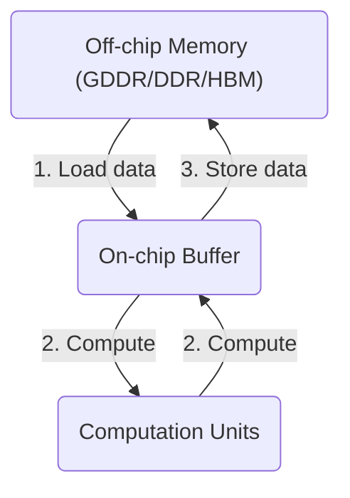

评估大规模语言模型（LLM）在专有硬件平台上的部署效率是一项复杂任务，它深刻依赖于对硬件特性和模型架构的深入理解。为此，我们采纳了Roofline模型作为一种先进的性能评估工具，该模型在图4中直观展示了在特定硬件环境下部署模型的潜能界限。此模型不仅是理论分析的坚固基石，也是实践应用中优化策略制定的指南。

在神经网络层的硬件执行语境下，数据流动构成了核心活动序列：从离散的内存资源（如DDR或HBM）加载至高效的片上缓冲区，随后经由处理单元进行密集计算处理，直至最终计算成果被回写至内存存储。这一连串操作要求对内存访问带宽与处理器计算能力进行综合考量，二者间的平衡直接决定了性能表现的天花板。

具体而言，Roofline模型使我们能够精准地区分并诊断两种关键性能瓶颈情境。首先，对于那些计算密集度高而内存交互相对有限的网络层，它们遭遇的是“计算瓶颈”。在此状态下，内存系统未被充分占用，表现为计算潜力未能得到完全释放。相反，若某层特征在于其对内存访问的极度依赖，而计算负担较轻，则定义为“内存瓶颈”。这种情形下，处理器资源闲置，无法达到最大利用率。

通过精细运用Roofline模型，我们不仅能够明确辨识这些性能限制类型，还能为每种特定场景设定清晰的性能上限，从而为优化模型部署策略、最大化硬件利用率及提升整体运行效率提供科学依据与实践路径。这不仅强化了我们对复杂系统交互的理解，还为实现高效能计算解决方案铺平了道路。

### Plot the Roofline:


确定目标硬件设备的峰值计算性能（每秒操作数，OPS）和峰值内存带宽（每秒字节数）。然后创建一个图表，其中y轴表示性能（OPS），x轴表示算术强度（OPS/字节）：绘制一条与峰值计算性能相等的水平线。这条线代表了硬件设备可达到的最大性能。再绘制一条从原点出发，斜率为峰值内存带宽的对角线。这条线代表系统上可用的最大内存带宽，即所谓的内存天花板线。图5展示了Nvidia A6000 GPU的Roofline model。

### Analyze performance for layers:

表1. 在Nvidia A6000 GPU的Roofline模型下对Llama-2-7b模型各层的分析。此例中，序列长度为2048，批处理大小为1。

Prefill Layer Performance Data

| Layer Name | OPs | Memory Access | Arithmetic Intensity | Max Performance | Bound |
| --- | --- | --- | --- | --- | --- |
| q\_proj | 69G | 67M | 1024 | 155T | compute |
| k\_proj | 69G | 67M | 1024 | 155T | compute |
| v\_proj | 69G | 67M | 1024 | 155T | compute |
| o\_proj | 69G | 67M | 1024 | 155T | compute |
| gate\_proj | 185G | 152M | 1215 | 155T | compute |
| up\_proj | 185G | 152M | 1215 | 155T | compute |
| down\_proj | 185G | 152M | 1215 | 155T | compute |
| qk\_matmul | 34G | 302M | 114 | 87T | memory |
| sv\_matmul | 34G | 302M | 114 | 87T | memory |
| softmax | 671M | 537M | 1.25 | 960G | memory |
| norm | 59M | 34M | 1.75 | 1T | memory |
| add | 8M | 34M | 0.25 | 192G | memory |

Decode Layer Performance Data

| Layer Name | OPs | Memory Access | Arithmetic Intensity | Max Performance | Bound |
| --- | --- | --- | --- | --- | --- |
| q\_proj | 34M | 34M | 1 | 768G | memory |
| k\_proj | 34M | 34M | 1 | 768G | memory |
| v\_proj | 34M | 34M | 1 | 768G | memory |
| o\_proj | 34M | 34M | 1 | 768G | memory |
| gate\_proj | 90M | 90M | 1 | 768G | memory |
| up\_proj | 90M | 90M | 1 | 768G | memory |
| down\_proj | 90M | 90M | 1 | 768G | memory |
| qk\_matmul | 17M | 17M | 0.99 | 762G | memory |
| sv\_matmul | 17M | 17M | 0.99 | 762G | memory |
| softmax | 328K | 262K | 1.25 | 960G | memory |
| norm | 29K | 16K | 1.75 | 1T | memory |
| add | 4K | 16K | 0.25 | 192G | memory |

通过量化分析模型各层的运算次数（操作数，OPs）与数据移动量（从内存中获取的字节数），我们可以深入评估其性能。这一过程涉及计算每层的算术强度，即每单位数据转移所执行的操作数（OPs/byte），从而精确地映射资源利用情况。借助此指标，我们能在图表上标示出各层理论上能达到的最大性能点，这些点由算术强度决定，并体现在图表的x轴上。

此分析步骤对于识别系统当前是受内存带宽限制（内存绑定）还是计算能力限制（计算绑定）至关重要。明确这一状态后，能够导向性地指明接下来的优化路径，确保针对性地解决瓶颈问题，无论是通过减少不必要的数据移动、优化内存访问模式，还是增强计算单元的效率，以此推动系统性能的全面提升。此方法融合了深度分析与策略规划，为提升模型运行效率提供了科学依据与实践指导。

资源未充分利用的情况有两种：

*   **(1) memory bound**
    

当模型的计算强度低于转折点，处于红色区域时，表明每个内存访问所需的计算工作负载较低。即使饱和了峰值带宽，也无法完全利用所有计算资源。在这种情况下，该层受到内存访问限制（内存绑定），部分计算单元可能会保持空闲。如果层是内存绑定的，可以考虑采用诸如量化、核融合和增加批次大小等优化技术来缓解内存占用。

*   **(2) compute bound**
    

相反，如果模型的计算强度高于转折点，处于绿色区域，则表明模型只需要少量的内存访问就能消耗大量计算能力。这意味着该层受到计算限制（计算绑定），部分内存单元可能保持空闲。在这种情况下，我们应该探讨启用低比特计算等策略以提高计算效率。这些方法的详细解释将在后续章节提供。

以Llama-2-7b模型在Nvidia A6000 GPU上使用Roofline模型的分析为例，表1展示了各层的分析结果。从表中我们观察到，在预填充阶段，大部分计算都是计算绑定的，导致性能较高。相比之下，在解码阶段，所有计算都是内存绑定的，导致性能远低于GPU计算单元的计算能力。在用户与大型模型交互过程中，预填充阶段仅执行一次，而解码阶段则重复进行以生成连续的输出。因此，针对解码阶段的内存绑定特性进行优化对于提升大型模型的推理性能至关重要。

### LLM-Viewer  Inference Bottleneck Analysis

在大规模语言模型（LLMs）中，存在多层Transformer结构，每层包含多种操作，并且不同的LLM模型具有不同的操作集。此外，为了计算峰值内存使用量和总推理时间，需要跟踪诸如内存占用等信息。因此，分析LLMs涉及到整个网络范围的考量。本节提出了一款强大的工具——LLM-Viewer 3，用于执行网络级分析。它使用户能够在各种硬件平台上分析LLM的性能和效率，为理解LLM推理及性能优化提供了宝贵的见解。

LLM-Viewer的工作流程如图1所示，包括以下步骤：

1.  **输入LLM模型并收集关键信息**：关于每一层的信息，如计算量、输入输出张量形状以及数据依赖关系。
    
2.  **硬件配置与Roofline模型生成**：提供硬件输入，并生成考虑到硬件计算能力和内存带宽的Roofline模型。
    
3.  **配置推理设置**：包括批量大小、提示令牌长度和生成令牌长度。
    
4.  **优化设置配置**：例如量化位宽、FlashAttention的使用、解码方法以及其他系统优化技术。
    
5.  **LLM-Viewer分析器工作**：利用Roofline模型和层信息分析每一层的性能。同时追踪各层的内存使用情况，并根据数据依赖关系计算峰值内存消耗。通过汇总所有层的结果，获得LLM的整体网络性能。
    
6.  **报告生成**：提供诸如各层及网络的最大性能、性能瓶颈和内存占用等信息的报告。从报告中可绘制出批次大小-性能、序列长度-性能等曲线，以理解不同设置如何影响性能。
    
7.  **网页查看器功能**：LLM-Viewer提供一个网页查看器，便于可视化网络架构和分析结果，方便用户调整配置，并为每一层提供丰富的数据访问。
    

此工具极大地促进了配置调整的便捷性，并为深入探索各层细节提供了广泛的数据支持。

# 三、Model Compression

大型语言模型（LLMs）的庞大尺寸和计算需求给实际部署带来了重大挑战，尤其是在资源受限的环境中。为了缓解这些限制，最直接的解决方案是压缩LLMs。在本节中，我们将回顾针对LLMs的神经网络压缩概念。这一探索将涵盖对已建立技术的深入审查，包括但不限于量化、剪枝、知识蒸馏和低秩分解。在每个子部分中，我们将使用LLM-Viewer来分析网络压缩对LLM推理的影响。根据我们的分析，我们将提供优化建议。

## 1. Pruning (Sec.3.2)

研究人员发现，神经网络模型往往存在过参数化现象，即模型中包含可以被去除的冗余权重。本章主要聚焦于权重剪枝方法，即识别并删除模型中的冗余权重。

从优化问题定义和求解的视角来看，模型剪枝可被视为解决优化问题。模型剪枝的问题定义是：寻找最优的模型子结构a\*和相应的权重w\*，以在特定约束条件下，最优化剪枝后模型的性能。优化空间主要包含两部分：剪枝后模型的结构空间${A(\boldsymbol{\alpha^{\*}}\in A)}$ 和剪枝后模型的权重空间 $W \left( \omega^{\*} \in W \right)$。优化目标是尽量降低剪枝所造成的任务性能损失。约束条件可能包括硬件指标（如延时、功耗）或与推理效率相关的代理指标（如参数量、计算量）。

模型剪枝要决定删除哪些权重单元，即在结构空间中找到解 $\alpha^{\*} \in A= \left \{ 0,1 \right \}^{N}$其中N表示权重单元的数量。权重单元的大小被称为“粒度”。对于卷积神经网络，模型剪枝采用的权重单元有以下5种典型的粒度。

（1）层级（Layer）粒度：如图所示，以单个卷积层为最小单元。

（2）滤波器（Filter）粒度：如图所示，以单个滤波器为最小单元。单个滤波器由多个二维的卷积核组成。删除某层的一个滤波器等价于删除对应的输出通道。

（3）形状（Shape）粒度：如图所示，在同一个滤波器中，将所有通道内相同空间位置的权重作为最小单元。

（4）通道（Channel）粒度；如图所示，以输入通道为最小单元，删除某一层的输入通道等价于删除前一层的输出通道，即删除前一层对应的滤波器。

（5）权重（Weight）粒度：如图所示，以单个权重为最小单元。权重粒度也是最细的剪枝粒度。

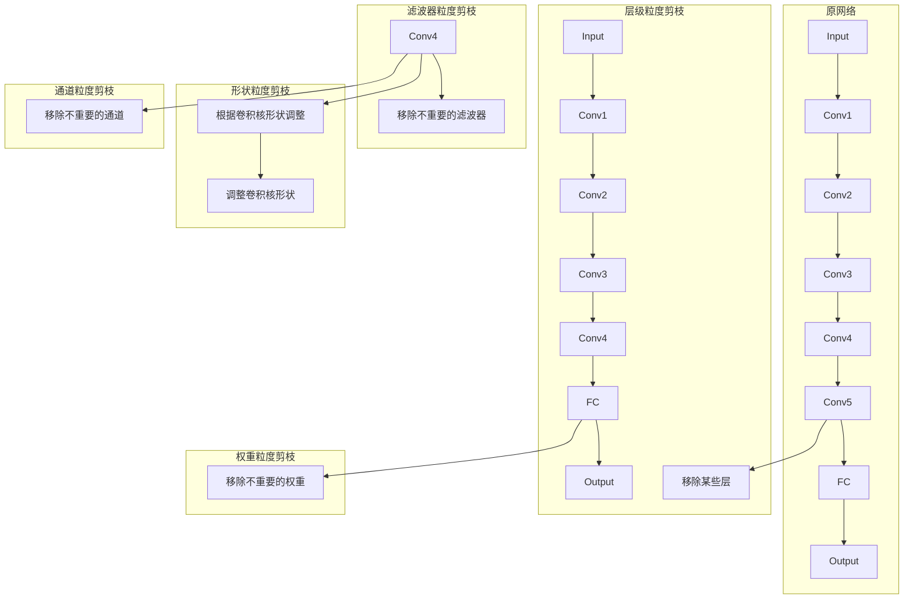

图 4.1 卷积神经网络中不同的剪枝粒度示意图

根据权重单元的粒度及其是否结构化，可以将剪枝方法的稀疏模式分为以下三类。

（1）粗粒度结构化稀疏模式：采用这类稀疏模式的剪枝方法简称〝结构化剪枝”。剪枝采用的权重单元粒度较粗，包括通道、形状、滤波器和层级等粒度。例如，常见的滤波器粒度的结构化剪枝会减少模型中各层的滤波器数量，同时相应地减少下一层的输入通道数量。与后两类稀疏模式相比，采用这类稀疏模式的剪枝方法的压缩率较低。因为其稀疏性具有结构化规律，所以通常无须专用的软硬件设计就能将其压缩率转化实际的硬件加速效果。

（2）细粒度非结构化稀疏模式：采用这类稀疏模式的剪枝方法简称“非结构化剪枝”或“稀疏剪枝”。剪枝采用的权重单元粒度权重粒度，粒度最细。与结构化剪枝相比，这类剪枝方法通常能获得较高的压缩率，大幅減少模型权重的存储需求。然而，这类稀疏模式的稀疏性不具有结构化规律，会在推理过程中引起不规则的访存与计算，使压缩率难以转化为推理加速效果。

非结构化剪枝往往需要专用的软硬件设计，以提高对非结构化数据的处理效率。

（3）细粒度结构化稀疏模式：采用这类稀疏模式的剪枝方法简称“半结构化剪枝”。剪枝采用的权重单元粒度同样为权重粒度。这类稀疏模式的核心思路是对权重进行结构化分组，并在分组内部采用非结构化稀疏模式。与细粒度非结构化稀疏模式相比，由于其结构化分组的特性，这类稀疏模式引入的访存和计算模式更规则，这使得采用这类稀疏模式的推理过程更易于在软硬件上实现高效处理。例如，NVIDIA 的安培架构 GPU 等硬件平台能支持对细粒度结构化稀疏数据的高效处理。

本章主要以卷积神经网络为例，介绍主流的模型剪枝方法。图4.2展示了模型剪枝方法研究的主要细分领域。以 LWC、Deep Compression 等为代表的早期的非结构化剪枝工作，展示出模型剪枝具有显著降低模型计算量和参数量的潜力；SSL、ThiNet、AMC 等工作关注结构化剪枝方法，并探索了基于权重正则与基于搜索的两类结构化剪枝流程。此外，低秩分解的思想与结构化剪枝有类似之处。低秩分解可被看作在张量分解后的空间进行“的杖”，删除冗余分量，得到的矩降是对原矩阵的低秩近似。这类方法的代表性工作包括BLstPmFT-CPN、Onc-ShotN等。半结构化剪枝结合了结构化剪枝和非结构化剪枝的优势，在维持较高任务性能的同时获得了更高的压缩比和加速比。它的代表性工作有 ESE、ASDNIN，DFSS等。

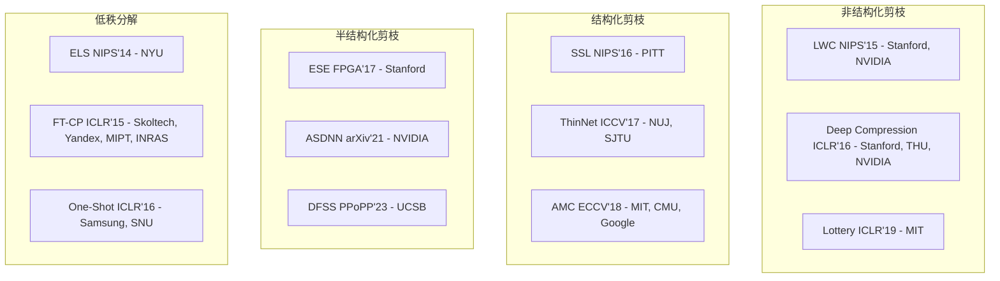

图 4.2 模型剪枝方法研究的主要细分领域

本章将按以下顺序介绍各种方法。4.2节将介绍模型敏感度分析方法，用于识别模型中的冗余结构。它们被广泛应用于各类剪枝方法中。4.3节将详细介绍结构化剪枝方法，主要包括基于权重正则的结构化剪枝方法与基于搜索的结构化剪枝方法，以及在给定资源限制的条件下的结构化剪枝方法。4.4 节将介绍近似低秩分解方法。4.5节将通过典型的例子简要介绍非结构化剪枝方法。4.6 节将介绍半结构化剪枝方法。除了权重剪枝，4.7 节将介绍针对激活值的剪枝方法。为了给读者提供直观实用的帮助，4.8 节将总结模型剪枝的经验。4.9节将给出 Group Lasso 结构化剪枝的实践案例。

### 模型敏感度分析方法

#### 层内和层间敏感度分析

为了识别模型中的冗余权重，模型剪枝方法需要对模型进行敏感度分析。敏感度分析方法评估删除某个或某些权重单元对模型任务性能的影响。具体而言，如果删除某些权重单元对模型的任务性能影响较大，那么这些单元的敏感度较高，应该被保留；反之，某些权重单元的敏感度较低，可以被删除。

然而，对所有权重单元进行敏感度分析，需要进行大量的模型任务性能测试，消耗大量资源，为了降低剪枝过程的开销，现有方法通常将结构 ∞分解为层间与层内两个维度进行敏感度分析，这样可以显著降低模型剪枝方法中敏感度分析的复杂度，提高模型剪枝的效率。

图4.3为层内和层间敏感度分析在模型剪枝中的用途。其中，图4.3（a）为待剪枝模型，它包含三个级联的卷积层及一个跳跃连接。图 4.3（b）使用层间敏感度分析确定模型各层的敏感度，依据各层的敏感度为各层分配压缩率。例如，因模型第二层的敏感度较高，所以仅删除其 20%的权重。注意，只有 4.3.2 节介绍的离散搜索剪枝显式地进行了层间敏感度分析。图4.3（c） 使用层内敏感度分析确定层内各权重单元的敏感度，并保留敏感度较高的权重单元。

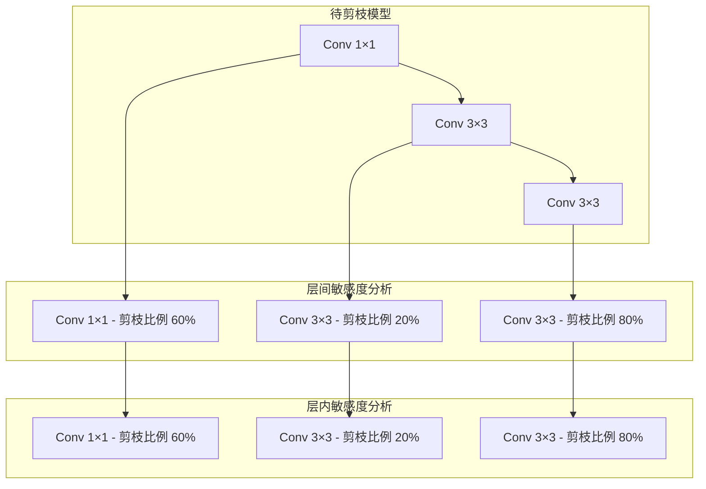

图 4.3 层内敏感度分析和层间敏感度分析

#### 层内敏感度分析指标

如图 所示，层内敏感度分析被用于评估层内各权重单元的敏感度，作为模型剪枝保留单元的依据，敏感度指标可以按照是否需要数据被划分为数据驱动和非数据驱动两类。数据驱动类敏感度指标需要使用输入数据计算，如权重二阶导数、通道激活概率、激活重建误差。非数据驱动类敏感度指标仅需要权重本身而不需要输入数据，如权重的p-范数、权重多样性、批标准化层的缩放值。上述各敏感度指标的具体细节如下。

（1）权重二阶导数：利用权重的二阶导数推导出删除各权重单元后损失函数的增量，删除使损失函数增长较小的权重单元。

（2）权重的p-范数（1-范数、2-范数等）：将权重的p范数作为敏感度指标，删除 范数较小的权重单元。

（3）权重多样性：目的是保留更具多样性的权重单元子集。通常，将各权重单元与权重单元“质心”的距离作为敏感度指标，删除距离质心较近的滤波器。例如，代表工作 FPGM931 关注滤波器粒度权重单元的多样性指标。FPGM 认为，越是靠近全体滤波器几何中心的滤波器，其功能越容易被其他滤波器代替，可以被优先剪枝。

（4）批标准化层的$gama$值：将批标准化层线性变换的放缩系数值$gama$作为敏感度指标，删除对应的放缩系数较小的权重单元。

（5）通道激活概率：利用待剪枝模型进行部分数据推理，统计每个通道的激活率（非0数据的比例）并将其作为敏感度指标，删除激活率较低的通道。

（6）激活重建误差：计算删除某权重单元后的输出与待剪枝模型输出的误差，删除误差较小的权重单元。

值得注意的是，若使用充足的数据来微调或重新训练剪枝后的模型，上述层内敏感度指标一般无明显效果差距。

表4.1总结了部分结构化剪枝工作所使用的层内敏感度指标与剪枝流程。虽然各类剪枝流程几乎均会使用一种层内敏感度指标，但是使用的方式略有不同。基于权重正则的剪枝方法、离散搜索剪枝方法、可微分搜索剪枝方法对层内敏感度指标的使用方式如下。

（1）基于权重正则的剪枝方法：在训练模型时，将层内敏感度指标作为正则项引入损失函数。在训练的过程中，正则项会将模型中部分权重置为0。

（2）离散搜索剪枝方法：迭代进行层内敏感度分析和层内剪枝。前者为每一层分配压缩率，后者根据层内敏感度指标将每一层剪枝到分配的压缩率。

（3）可微分搜索剪枝方法：通常，不预设敏感度指标，而是将每个权重单元的敏感度作为可训练参数，通过梯度下降算法训练得到权重单元的剪枝决策，即“等效敏感度”。

表4.1 部分结构化剪枝工作所使用的层内敏感度指标与剪枝流程

| 工作 | 层内敏感度指标 | 是否数据驱动 | 剪枝流程 |
| --- | --- | --- | --- |
| OBD | 权重二阶导数 | 是 | 退化的离散搜索 |
| Group Lasso | 权重1-范数 | 否 | 权重正则 |
| AMC | 权重1-范数 | 否 | 离散搜索 |
| MorphNet | 权重1-范数 | 否 | 权重正则 |
| Lebedev et. al. | 权重2-范数 | 否 | 权重正则 |
| NetAdapt | 权重2-范数 | 否 | 离散搜索 |
| FPGM | 权重多样性 | 否 | 离散搜索 |
| VCP | 批标准化的γ值 | 否 | 离散搜索 |
| DSA | 批标准化的γ值 | 否 | 可微分搜索 |
| APoZ | 通道激活概率 | 否 | 可微分搜索 |
| ThiNet | 激活重建误差 | 是 | 离散搜索 |

### (1) Structured

结构化剪枝会移除整个神经元或层，从而得到更干净、更规则的结构。经过剪枝的模型通常与传统硬件的兼容性更好，但这种简化和规则化的代价是：这种形式的剪枝可能对模型性能有更显著的影响，因为它涉及到移除更大、可能更重要的组件。LLM-Pruner 等人在大型语言模型（LLMs）的结构化剪枝方面代表了一种开创性的方法。它采用了一次性剪枝技术，该技术依赖于一阶和估计的Hessian数据，并需要随后使用LoRA进行微调以恢复权重。这项工作的优势在于，它显著降低了计算需求和内存要求，同时保持了LLMs的基本结构。Sheared Llama Xia等人提出了另一种值得注意的解决方案，通过将有针对性的结构化剪枝与动态批次加载算法相结合。首先，它通过分析预训练模型的配置，仔细地将源模型剪枝成所需的目标架构。然后，通过动态批次加载算法提高训练效率，该算法调整来自不同领域的训练数据比例。Compresso Guo等人建立了一个协作学习框架，其中LLM与一个资源高效的剪枝算法协同工作，能够将Llama-7B剪枝至5.4B参数量，同时保持原始性能不变。

结构化剪枝方法主要在层和滤波器这两个粒度上进行剪枝。与非结构化剪枝相比，结构化剪枝的压缩率通常较低。结构化剪枝的优势在于，剪枝后的 模型仍然保留了稠密的矩阵一矩阵乘法，这使得模型可以直接在支持稠密计算的高效通用处理器上运行，如GPU。因此，结构化剪枝能够更容易地将压缩率转化为实际加速，这使其在学术界和工业界都受到广泛关注。

本节将从优化问题定义和求解的角度，介绍各类常用的结构化剪枝方法。现有的工作主要分为如图4.4所示的两大类。第一类方法仅显式地优化模型权重w，非显式地优化模型架构参数 Q，如图 4.4（a）所示。这类方法不会显式地评估层间敏感度，而是在确定了权重数值之后，基于层内敏感度指标移除部分权重单元。第二类方法则同时优化模型权重c和模型架构参数c，如图 4.4（b）所示。

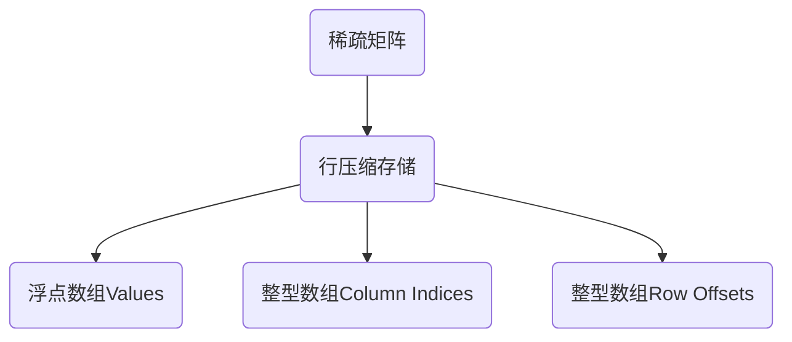
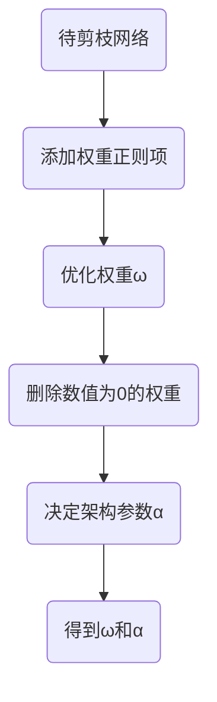
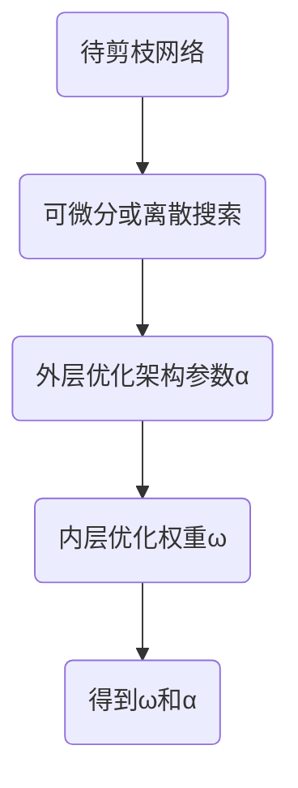

图 4.4 两类结构化剪枝流程示意图

本节的内容安排如下。4.3.1 节将介绍基于权重正则的结构化剪枝方法，这类方法非显式地建模和优化模型架构参数 ∞。4.3.2 节将介绍基于搜索的结构化剪枝方法，包括离散搜索和可微分搜索，这类方法显式地建模并优化模型架构参数 c。4.3.3 节将介绍在给定资源限制的条件下，如何运用基于权重正则和基于搜索的方法进行结构化剪枝。

#### 基于权重正则的结构化剪枝方法

权重正则方法是机器学习中常用的技术。常见的权重正则方法包括基于 1-范数的 Lassol99）和基于 2-范数的岭回归（Ridge Regression）190。其中，岭回归对于大幅值权重的惩罚力度大，对于小幅值权重的惩罚力度小，不倾向于把小幅值权重拉到0，因此难以学习稀疏分布的权重；

而 Lesso 对于不同幅值大小的权重的惩罚力度一致，因此更容易学习稀疏分布的权重。对损失函数加入权重正则项，优化模型权重w得到稀疏模型，其流程如下。

（1)训练开始前，將一个设计好的权重正则项引入损失函数，权重正则项通常根据模型的层内敏感度指标进行设计。

（2） 训练过程中，优化带有权重正则项的损失函数，权重正则项会将部分权重优化为口或接近 0。

（3）训练结束后，将等于0或接近0的权重删除，即得到剪枝后的模型。这类方法对应的优化问题如式 4.1所示。

$\boxed{\boldsymbol{\omega}^{\*}=\operatorname\*{arg min}\_{\boldsymbol{\omega} \in W}\left\[\mathcal{L}(\boldsymbol{\omega})+\lambda R(\boldsymbol{\omega}) \right\]}$

其中，L表示任务损失函数（如分类任务中常用的交叉熵损失函数），R 表示权重正则项，入表示权重正则项的加权系数，w表示模型的权重，w\* 表示训练得到的最优权重，W 表示权重空间

本节将以 Structured Sparsity Learning2（简称SSL）为例，介绍权重正则项的设计思路具体来说，SSL 引入权重正则项构造了如式4.2 所示的优化目标：

$\bm{\omega}^{\*}=\operatorname\*{arg min}\_{\bm{\omega}\in W}\left\[\mathcal{L}( \bm{\omega})+\lambda\_{\text{g}}\cdot\sum\_{l=1}^{L}R\_{\text{g}}(\bm{\omega}^{(l )})\right\]$

其中，4表示模型的权重，表示任务的损失函数，L表示模型的总层数，1表示模型的层索引，入g表示权重正则项的加权系数，Rg（.）表示正则函数。具体来说，SSL 选择将结合 1-范数和2-范数的 Group Lasso100作为正则函数Rg（.），如式4.3 和式4.4所示。

$\begin{split} R\_{\mathsf{g}}(\bm{\omega})&=\sum\_{ \bm{k}=1}^{K}||\bm{\omega^{(k)}}||\_{\mathsf{g}}\\ ||\bm{\omega^{(k)}}||\_{\mathsf{g}}&=\sqrt{\sum\_{ \bm{i}=1}^{N(\bm{\omega^{(k)}})}(\omega\_{\bm{i}}^{(k)})^{2}}\end{split}$

其中，c（）表示第k个权重组，N（c（h）表示权重组w（）中权重组的数量，K表示权重组总数。

由式4.4可知，Group Lasso 计算权重组内所有权重的2-范数；由式4.3 可知，Group Lasso 对所有权重组的2-范数求和，由于每个权重组的 2-范数都是非负数，这个求和操作等价于对所有权重组的2-范数求1-苑数。因此，Group Lasso 会鼓励部分权重组的 2-范数被训练过程置0，即这些权重组内的权重全部为0。

权重的分组方式具有很离的灵清性。针对不同的应用需求，用户可以设计更合适的权重分组策略。如图 4.5 所示，Group Lasso 可以灵活地对通道、滤波器、形状、层等不同粒度的基本单元进行剪枝。以通道和滤波器粒度的结构化剪枝为例，假设 wf9.是第1层中的第m个滤波器，c0%：是第1层中每个滤波器的第 c 个输入通道，可将 SSL 的目标函数改写为式4.5：$\bm{\omega}^{\*}=\operatorname\*{arg min}\_{\bm{\omega}}\left\[L(\bm{\omega})+ \lambda\_{n}\cdot\sum\_{l=1}^{L}\left(\sum\_{n\_{l}=1}^{N\_{l}}||\bm{\omega}\_{n\_{l},:,:,:}^{(l)}||\_{\mathsf{g}}\right)+\lambda\_{c}\cdot\sum\_{l=1}^{L}\left(\sum\_{c\_{ l}=1}^{C\_{l}}||\bm{\omega}\_{:,c\_{l},:,:}^{(l)}||\_{\mathsf{g}}\right)\right\]\qquad \text{ (4.5)}$


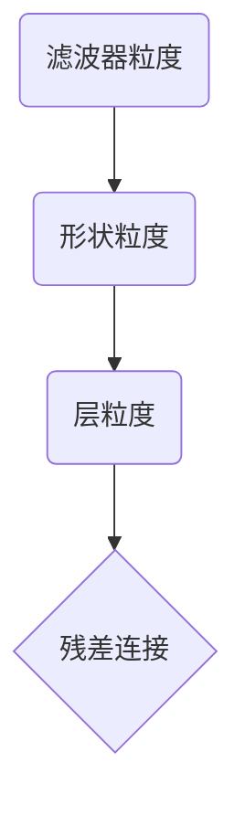

图 4.5 Group Lasso 可支持不同粒度的结构化剪枝

#### 基于搜索的结构化剪枝方法

不同于基于权重正则的结构化剪枝方法，基于搜索的结构化剪枝方法不仅优化模型权重心，而且在优化模型权重c的外层嵌套了对模型架构参数o的优化。一般来说，这个双层（Bi-Level）优化问题可表示式4.6所示形式：

$\begin{split}\bm{\alpha}^{\*}&=\operatorname\*{arg max}\_{\bm{\alpha}\in A}R(\bm{\omega}^{\*}(\bm{\alpha}),\bm{\alpha})\\ \text{s.t.}\quad\bm{\omega}^{\*}(\bm{\alpha})&= \operatorname\*{arg min}\_{\bm{\omega}\in W}\mathcal{L}(\bm{\omega},\bm{\alpha} )\\ \mathcal{F}(\bm{\alpha})&\leqslant B\_{\mathcal{F}} \end{split}\qquad\qquad\qquad\qquad\qquad\qquad$

其中，a\*表示待求解的最优架构参数，R代表任务性能指标（如分类任务的准确率），£代表任务损失函数（如分类任务的交叉熵损失函数），w\*（a）代表架构参数。最合适的权重，通过内层的权重优化问题求解得到w\*（a）=aIg min wew C（w, a）。另外，这类方法显式地优化架构参数Q，因此，优化问题加入与 a 相关的其他限制条件是非常自然的，如式4.6中的F（a） ≤B5，F（a）是一个与 a 相关的指标，可以是模型复杂度（如参数量、计算量）或实际推理性能（如延时，能耗等），Br 为该指标的资源限制。

式4.6的剪枝优化问题中 B（a）= R（w\*（a）， a）的评估过程涉及一个复杂的求解w\*的内层优化问题。因此，该优化问题难以被闭式建模并求解，它属于一个黑盒优化问题。黑盒优化问题最常见的求解方法是，采用一系列基于离散搜索的策略。此外，不少工作尝试使用可微分的代理损失函数 代替上述优化问题的B，对内层的权重优化问题进行近似或者直接将该双层优化问题转化成单层（One-Level）优化问题，并将离散的架构参数 c 松弛至连续空间品，用梯度的方式更新 a。借鉴 模型架构搜索领域的术语，这类基于梯度优化的剪枝方法可被看作一种用“可微分搜索策略”探索离散搜索空间的方法。本节将基于离散搜索策略的方法和基于可微分搜索策略的方法统称为基于搜索的方法，并举例介绍这两类方法。

基于搜索的结构化剪枝方法会显式地优化模型的架构参数c。常用的对架构进行参数化的方式有如下两种。

（1）剪枝率（Pruning Ratio）：被删除的权重数占权重总数的比例。当前的工作通常以层级为粒度分配压缩率，典型的工作有AMCI7、DSABI、ECCLOIl 等。压缩率通常仅用于层间敏感度分析。在确定了每一层的压缩率之后，通常需要利用某种层内敏感度指标来决定哪些权重应该被保留。

（2） 二值掩码（Binary Mask）：为每个权重单元分配一个二值掩码，其中，掩码为1表示

保留该权重单元；掩码为0表示删除该权重单元；典型算法有 VCPB7、BAR/1021 等。使用二值掩码可以同时进行层间和层内敏感度分析，并且可以直接根据掩码值进行剪枝，无须再根据特定的层内敏感度指标进行剪枝。

```plaintext
1:Model：已经训练好的原始模型
2: No：外层循环次数
3:N：内层循环次数
4:a：各层的压缩率配置
5:Controller：控制器，相当于剪枝操作的核心搜索策略
6: Evaluater:
评价器，负责对当前压缩率配置下的模型进行快速性能评估
7:
8: for i = 1,2,, No do
9: for j = 1,2,•••, Ni do
10:   a = controller.sample_as（）//控制器采样一个模型结构
      acc=Evaluate（a, Model） //快速评估模型结构
      Controller.fit（a, acc） //根据快速评估的结果更新控制器
    end for 
14:a =controller.decide（） //控制器决定一个模型结构
15:Model = PruneAndFinetune（Model, a） //剪枝并微调参数
16: end for
```

1.  离散搜索剪枝方法
    

算法 4.1总结了离散搜索剪枝的通用选代流程，整个流程包含两层循环，这两层循环的区别在于评估方法。其中，内层循环采用快速评估方法预测模型的性能，评估度较低：而外层循环会训练剪枝后的模型并在测试数据集上实测模型的性能，虽然评估速度较慢，但是评估精度较高。

图4.6展示了上述离散搜索剪枝的通用迭代流程。与算法 4.1 对应，可以看到内层循环采用快速评估方法，循环次数通常较多，在103量级；外层循环的评估速度较慢，循环次数较少，在10-量级。


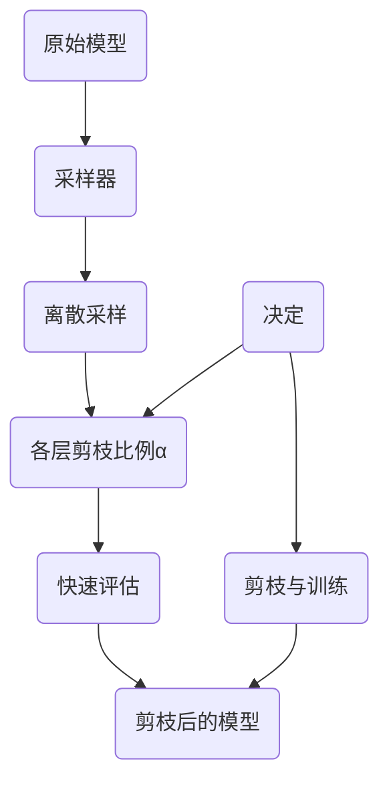

图 4.6 基于离散搜索的结构化剪枝流程示意图

表 4.2对比了典型的离散搜索剪枝方法。早期的AMC使用强化学习采样模型架构参数。另一项早期研究 NetAdapt 在每一轮迭代中采样 K个候选剪枝模型，每个候选剪枝模型均只有一个卷积层被压缩。其他研究使用启发式的局部搜索算法来搜索架构参数，如模拟退火（Simulated Annealing,SA ）和进化算法（Evolutionary Algorithm,EA），这些算法可以直接搜索多个目标并获得关于模型任务性能和压缩率的帕累托前沿。

这里以AMC为例介绍离散搜索剪枝。如图 4.7所示，AMC设计了一个控制器（DDPG），该控制器逐层采样压缩率。具体来说，控制器会接收待剪枝层的状态向量，并基于当前层的状态采样压缩率。在控制器完成所有层的压缩率采样后，就会根据层内敏感度指标对各层进行剪校。在训练阶段，AMC 会对剪枝后的模型进行快速评估并生成一个奖励信号。随后，AMC使用 DDPG105］ 强化学习算法根据奖励信号更新控制器的权重。


| Algorithm Component | AMC | NetAdapt | Auto-Compress | MetaPruning |
| --- | --- | --- | --- | --- |
| Controller.sample\_as | 使用 MLP 逐层预测 | K 个候选剪枝模型 | 模拟退火 | 进化算法 |
| Evaluate | 不微调 | 不微调 | 不微调 | 超网络 |
| Controller.fit | 强化学习 | — | 接受决定 | 种群更新 |
| Controller.decide | 使用采样器选择 α | 取最高精度的模型 | 模拟退火过程中发现的 α | 取种群中最高精度的 α |
| PruneAndFinetune | — | 剪枝后长时间微调 | ADMM 求解后微调 | — |
| Nₒ | 1 | \> 1 | \> 1 | 1 |
| Nᵢ | \> 1 | \> 1 | \> 1 | \> 1 |

表4.2 离散捜索枝方法対比

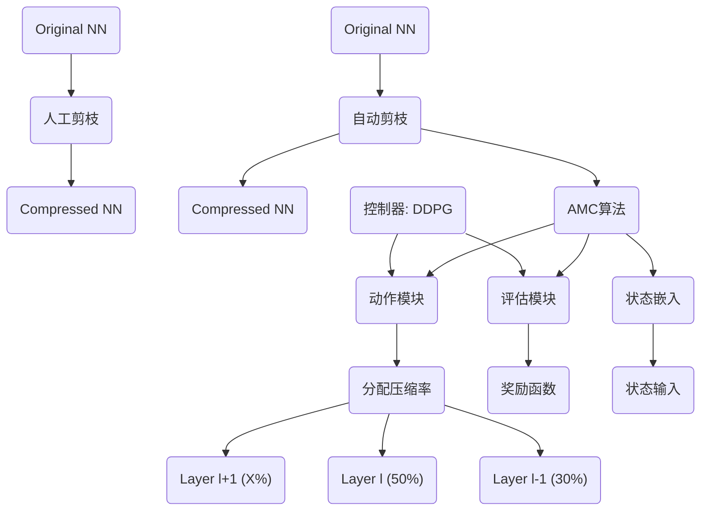

图 4.7 AMC算法的训练流程示意图

本节重点介绍 AMC对强化学习中状态空间、动作空间及奖励函数这三大组成部分的设计，它们分别对应了算法 4.1中控制器的输入、模型架构参数c的搜索空间 A、更新控制器所需的评估信息。

1）对状态空间的设计

每一层的状态向量为式4.7 所示的11维向量：

$\boldsymbol{s}\_{t}=(t,n,c,h,w,\text{stride},k,\text{FLOPs}\[t\],\text{reduced}, \text{rest},a\_{t-1})\qquad\qquad\qquad\quad$

其中，t表示当前层的层索引，n表示当前层滤波器的输出通道数，c表示当前层滤波器输入通道数，h和w表示当前层输入张量的维度，k表示当前层滤波器的大小，stride 表示当前层滤波器的步长。n×cxkxk 表示当前层中滤波器的超参数，c×w×h 表示当前层的输入张量维度，FLOPslt表示当前层的计算量，reduced 表示已经降低的总计算量，rest 表示待剪枝层中剩余的计算量，ot-1表示前一层的压缩率。在将状态向量输入控制器之前，AMIC 将所有参数归一化到（0，1\]

2）对动作空间的设计

AMC 控制器在某层所采样的动作被当作当层的压缩率。AMC 使用细粒度的动作空间，即压缩率 a E（0,1］。

3）对奖励函数的设计

AMC 针对两类场景的奖励函数设计。

（1）在资源有限的场景，如手机应用程序和自动驾驶车辆中，重点在于，在给定的资源约束下，通过剪枝提高模型的任务性能。为此，研究者构建了一个奖励函数来优化这一过程。

$R\_{err}=-Error    \left    (   4.8 \right)$

其中，Error 为错误率。可以发现，奖励函数不鼓励控制器降低模型权重，专注于保持模型的高精度。AIC通过限制动作空间大小的方式来满足资源限制。限制动作空间大小的含义为：当发现用最大的压缩率压缩后续所有层也无法满足限制条件时，AMC就会限制当前层的压缩率，使剪枝后的模型满足限制条件。

（2）保证任务性能的剪枝：常见的应用场景有图像去噪等。在这类场景中，用户关注的是，在保障任务性能不下降的前提下，尽可能减少模型的计算量和参数量。这类场景通常不会设置资源限制。AMC设计出了如下奖励函数：

$\left\{\begin{array}{l}R\_{\text{FLOPs}}=-\text{Error}\cdot\text{log(FLOPs)}\\ \\ R\_{\text{Param}}=-\text{Error}\cdot\text{log(\#Param)}\end{array}\right.\qquad \qquad\qquad\qquad\qquad\qquad$

其中，FLOPs表示模型的计算量，#Param 表示模型的参数量。一方面，这两个奖励函数均对Brror 敏感，鼓励控制器采样高精度模型；另一方面，分别将减少计算量、参数量这一目标引入奖励函数中，鼓励控制器降低硬件开销。

#### 2. 可微分搜索剪枝方法

不同于离散搜索剪枝方法，可微分搜索剪枝方法将式4.6中的双层优化问题转化成单层优化问题，并将离散的模型架构参数o放松至连续空间 进行求解。在不考虑资源限制的情况下，可以将式 4.6 的优化问题转化式 4.10的：

$\tilde{\bm{\alpha}}^{\*},\bm{\omega}^{\*}=\operatorname\*{arg min}\_{\tilde{\bm{ \alpha}}\in A,\bm{\omega}}\mathcal{L}(\tilde{\bm{\alpha}},\bm{\omega})\qquad \qquad\qquad\qquad\qquad\qquad\qquad(4.10)$

其中，该优化问题的自变量。和w分别表示模型架构参数和模型权重，其优化空间均为连续空间。因此，优化目标可微分，能够使用梯度下降算法求解。

本节以 BARI102） 为例介绍可微分搜索剪枝的基本流程。假设 hi是第1层模型的输出特征图，BAR 会为其分配一个二值掩码 21，其长度等于 h的通道数，将21与h.逐通道相乘，即可将部分通道置为0。这一过程可以写为式4.11：

$h\_{l}=h\_{l} \odot z\_{l} \left( 4.11 \right)$

具体来说，BAR 假设某一层中，每个可学习二值掩码 2 服从伯努利分布q（z④），其分布参数 ④，可以在训练模型时学习。通过梯度更新 中，模型可以学习到哪些通道应该删除，哪些应该保留。然而，从分布q（z亚）中采样的操作是不可微分的。BAR 利用重参数化技巧106，107将 z1 的采样操作转化为可微分的数学计算g（亚1，©），其输入为服从均匀分布2（0, 1）的随机变量e和待学习参数 。此时，式4.11可写作$h\_{l}=h\_{l} \odot g \left( \Phi\_{l}, \epsilon \right)$

不同于 BAR 中使用的逐通道二值掩码，还有一些工作使用压缩率a来显式参数化模型架构，例如DSABH。DSA 设计了一个方法使得损失函数对于模型各层的压缩率a可微分。具体而言，与BAR类似，DSA 为模型每层引入逐通道的二值掩码以决定每个通道保留与否。不同的是，DSA 让各层的二值掩码受控于各层的压缩率 a。DSA 的可优化参数各层压缩率a。

#### 给定资源限制的条件下的结构化剪枝方法

4.3.1 节和 4.3.2 节均未考虑剪枝优化问题中的限制条件。然而，在实际应用中，这些限制条件是普遍存在的。例如，端侧设备的计算能力和存储空间是有限的，且不同任务对推理延时的要求各异。为了适应这些实际应用中的限制条件，需要求解带有约束的剪枝优化问题。许多文献中也将优化问题的限制条件称为“资源限制”。

为了求解带有资源限制的优化问题，首先需要对资源的指标进行建模描述。常见的建模方法包括使用资源的代理指标【T，8L，95，102-104、构建资源的行为级仿真模型108,109、构造资源的统计模型00，101,204等。

本节将介绍两个具有代表性的工作，它们分别在基于权重正则和基于搜索的结构化剪枝方法中加入了对资源限制的处理。

1.给定资源限制的条件下的权重正则剪枝方法

4.3.1 节介绍了基于 Group Lasso的结构化剪枝方法 SSL。这类方法没有在求解优化问题时考虑限制条件，因此，无法可控地满足给定的资源限制。Ariel Gordon 等人提出 MorphNVet，使得基于权重正则的结构化剪枝方法也能在给定资源限制的条件下可控地进行结构化剪枝。

具体来说，MorphNet 设计了如下两个步骤。

（1）模型收缩：该步骤与 SSL 基本一致，通过求解无约束条件的剪枝优化问题，利用极重正则项将部分权重（组）置为0，并删除这些权重。

（2）模型扩展：Ariel Gordon 等人使用宽度乘数（Width Mutiplier）在不超过资源限制的前提下统一扩展所有层的宽度（通道数）。一般来说，模型收缩步骤会使实际使用的资源少于实际资源限制，这种不充分利用给定资源的现象会导致次优的剪枝结果。模型扩展步骤旨在根靠实际的资源限制，尽可能地充分利用给定资源。

NorpiNet 算法的工作流罄如算法 42所示。其中，2（w）表示损失函数，9（ww）表示故動正则项，F（表示衡量模型资源消耗的函数，0表示的校后模型各层的觉逛，日表示模的扩限生骤的鲍度系数，6表示资源限制。MorpANet 通过交替进行模型收缩和模型扩展，不前进代以生成满足發源限樹的剪枝模型。算法 42的第 1～2行对盛模型收缩步骤。在该步票中MorphNet 采用 SSL 方法训练模型，并对训练后的模型进行结构化剪枝。第3行是模型扩展步骤，该步骤搜索最大的宽度系数B，并对模型的宽度均匀扩展以适应资源限制。收缩后的模型的资源耗费通常少于资源限制，因此模型扩展步骤中的 B一般大于1。第4行将扩展后的模型重新代入第1行进行迭代搜索，以获得最佳的剪枝后模型。


| 步骤 |
| --- |
| 1. 在损失函数中引入权重正则项来训练模型 |
| 2. 删除权重中等于 0 的权重，得到模型各层的宽度 |
| 3. 搜索最大的宽度系数 β，使得 F(ω, O1:M) <= ζ |
| 4. 将模型的宽度设置为 O1:M = β · O'1:M，从第 1 行开始重复执行，直到满足资源限制 |
| 5. 返回 O1:M |

2.给定资源限制的条件下的离散搜索剪枝方法

下面以 NetAdapt为例，介绍给定资源限制的条件下的离散搜索剪枝方法。NetAdapt 以延时为资源限制，采用构造延时查找表的方式对延时进行建模。从优化问题的视角看，NetAdapt求解的剪枝优化问题如式4.12所示，支持同时引入m 个资源限制：

$\begin{split}&\max\mathrm{Acc}(\mathrm{Net})\\ &\mathrm{s.t.}\ \mathrm{Res}\_{j}(\mathrm{Net})\leqslant\mathrm{ Bud}\_{j},\quad(j=1,2,\cdots,m)\end{split}\qquad\qquad\qquad\qquad(4.12)$

其中，Acc（）表示计算准确率的函数，Res；（.）表示计算第；个资源消耗量的函数，Bud，表示第；个资源的上限。为了使求解过程更加可控、剪枝后的模型任务性能更优，Net.Adapt 采用渐进式优化策略求解式 4.12。这种策略将求解过程分解为多个步骤。在每一步中，NetAdapt 在前一步的限制条件上少量降低资源上限，直至达到目标资源上限。每一步的优化问题可用式4.13

表示：

$\begin{split}&\max\operatorname{Acc}(\operatorname{Net}\_{i})\\ &\text{s.t.} \operatorname{Res}\_{j}(\operatorname{Net}\_{i}) \leqslant\operatorname{Res}\_{j}(\operatorname{Net}\_{i-1})-\Delta R\_{i,j},(j=1,2,\cdots,m)\end{split}\qquad\qquad\qquad(4.13)\qquad$

其中，Net，表示第i 步生成的剪枝后的模型，模型当前的限制条件为 Con = Res； （Net：-1）-ARrg,ARng 表示一个较小的资源上限减少量。

NetAdapt 的工作流程如图 4.8所示，其主要包含采样模块和评估模块两大组件。第一个模块是采样模块，其主要作用是采样生成大量的候选模型，每个候选模型都是通过对模型中互不相同的一层进行剪枝生成的。第二个模块是评估模块，其主要作用是，快速评估候选模型的资源开销。为了提高评估效率，NetAdapt 预先在目标硬件上对各种超参数配置下的模型层资源消耗进行测量，并基于这些数据构建查找表，以便快速准确地评估每个候选模型的资源消耗。


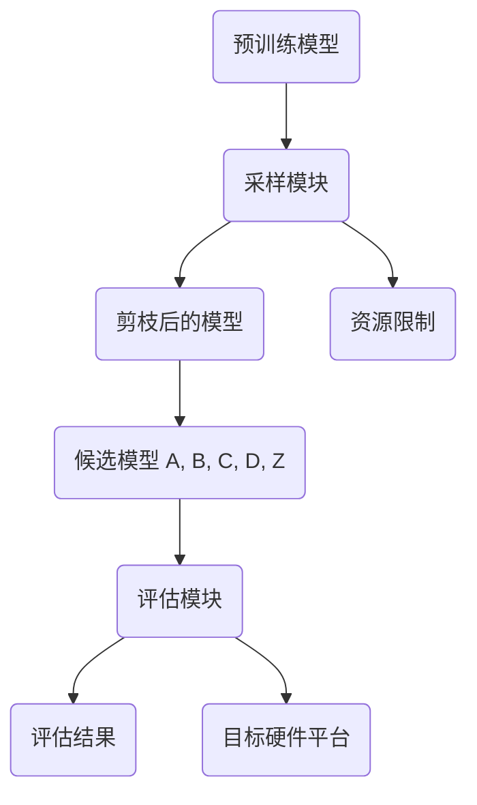


图 4.8 NetAdapt 的工作流程示意图

具体而言，算法4.3展示了 NetAdapt 算法的工作流程，其包含内外两层循环。首先是内层循环。根据第4行的渐进限制条件，第5行~第9行的内部循环会生成 K个候选模型，并且每个候选模型仅有互不相同的一层被剪枝。内层循环主要包含三个步骤：第一步，确定待剪枝层的压缩率（层间敏感度）；第二步，以 2-范数为指标确定需要剪掉哪些滤波器（层内敏感度）；第三步，使用较少的训练轮数对模型进行短时间微调。然后是外层循环。每轮外层循环均会小幅降低资源上限，如第4行所示。获得内部循环生成的 K个候选模型后，第10行的评估模块会逐个评估候选模型的性能，并从候选模型中选出一个最优的模型及其评估结果并送入下一轮循环。如第 13行所示，外层循环结束之后，会对剪枝后的模型进行较多训练轮数的长时间微调，以尽可能恢复模型的准确率。

```plaintext
1:  i = 1
2:  Res_i = TakeEmpiricalMeasurement(Net_i)
3:  while Res_i > Bud do
4:      Con = Res_i - ΔR_i
5:      for k = 1, 2, ..., K do
6:          N_Filt_k, Res_simp_k = ChooseNumFilters(Net_i, k, Con)
7:          Net_simp_k = ChooseWhichFilters(Net_i, k, N_Filt_k)
8:          Net_simp_k = ShortTermFinetune(Net_simp_k)
9:      end for
10:     Net_{i+1}, Res_{i+1} = PickHighestAccuracy(Net_simp, Res_simp)
11:     i = i + 1
12: end while
13: Net = LongTermFineTune(Net_i)
14: Return Net
```

类似于 NetAdapt, MOSP 也采用了渐进式优化策略。与 NetAdapt 不同的是，在每轮外层循环中，MOSP 都会评估模型中每一层压缩至不同通道数时任务性能（如分类准确率）和资源消耗（如延时）的变化情况。然后，MOSP 为每一层拟合两个线性系数，以近似描述其压缩通道数与任务性能影响或资源消耗降低之间的关系。接着，MOSP 构造线性规划问题，在确保满足本轮外层循环的资源消耗降低的限制下，最小化各层对任务性能影响之和（假设各层影响独立），从而求解出各层的压缩通道数。MOSP 在每轮外层循环中都可以同时对多层剪枝，比 NetAdapt 更灵活。

### (2) Unstructured

非结构化剪枝选择性地剔除模型中的个别权重或神经元，从而形成一个更为稀疏但结构上不规则的网络。这种剪枝方式在确保模型准确性方面表现出色，然而，权重分布的不规则性要求有专门的处理方法或软件优化。SparseGPT Frantar 和 Alistarh, 2023是针对大型语言模型（LLMs）的一次性剪枝方法上的重大突破。它通过将剪枝问题重新构想为一系列广泛的稀疏回归问题来应对挑战，并由新开发的求解器高效解决。值得注意的是，SparseGPT 能够仅用一台GPU在几小时内高效处理包含1750亿参数的模型，并且能够在不显著牺牲准确率或需要微调的情况下，在LLMs中诱导出高程度的稀疏性（50-60%）。为了应对SparseGPT中的重建成本挑战，Sun等人提出了Wanda，该方法通过评估每个权重的大小及其对应输入的范数来判断其重要性，显著提高了计算效率。此外，Yin等人设计了一套非均匀层次稀疏度比例，以更多关注出现异常值较多的层，从而提升剪枝性能。考虑到硬件对非结构化剪枝的支持，Flash-LLM Xia等人提出了一种非结构化稀疏矩阵乘法方法，其特点是稀疏加载和密集计算，以实现GPU Tensor Core对非结构化稀疏性的高效支持。

非结构化剪枝，又称稀疏剪枝，如图4.1所示，其剪枝粒度为单个权重。通过删除重要性校低的权重，并对剩余权重进行重训练或微调，可以在几乎不影响模型档度的情况下，显著减少裹型的存储量和计算量。非结构化剪枝是剪枝粒度最细的一种方法，具有最大的灵活性和压缩率。

与粗粒度的结构化剪枝方法相比，在相同的压缩比例下，非结构化剪枝通常能保持更高的精度。

然而，经过非结构化剪枝处理的权重矩阵变为稀疏矩阵，其非零元素的位置不规则，这种不规则性可能会对计算设备的数据访问和大规模并行计算造成不利影响。因此，针对通用平台的压缩工具链通常会优先考虑结构化剪枝方法。鉴于此，本节只简要概述非结构化剪枝的相关研究。

Deep Compression使用了基于幅值的非结构化剪枝方法，结合权值共享、模型量化和哈夫曼编码等技术，对 AlexNet 和 VGG-16 模型进行压缩。Deep Compression 在不损害模型精度的前提下，将 AlexNet 模型的参数量压缩为原来的1/35，VGG 模型的参数量压缩为原来的1/49，同时在模型运行速度和能耗方面实现了显著提升。

在模型剪枝的具体技术方面，Deep Compression 采用了一种迭代训练的非结构化剪枝方法。该方法先对模型进行正常训练，然后设定一个剪枝阈值，将所有小于该阈值的权重设置为0，这些权重不再参与后续训练。接着，对剩余的权重进行重训练和微调，以补偿剪枝带来的精度损失。这一剪枝和微调的流程会重复执行，直到达到预设的剪枝率。

假设得到的稀疏矩阵A 的大小nx n，其中非零元素的数量为a。直接存储这样的稀疏权重矩阵需要存储n×n个权重值，如图4.11所示。Han 等人采用行压缩（Compress Sparse Row，CSR.）存储格式存储稀疏矩阵。这种格式使用三个数组来表示稀疏矩阵中的非零元素及其位置。

*   浮点数组 Values：大小a，按从左到右、从上到下的顺序存储稀疏矩阵中的所有非零元素数值。
    
*   整型数组 Column Indices： 大小为 a，记录每个非零元素所在的列索引。
    
*   整型数组 Row Offsets：大小为 n+1，存储矩阵中每行第一个非零元素在Values 数组中的索引，最后一个位置记录非零元素的数量为a。
    

使用这种行压缩存储格式时，原本 nxn的稀疏矩阵仅需要三个数组共2a+n+1个元素即可存储。


图 4.11 稀疏矩阵行压缩存储格式示意图

传统的基于选代训练的剪枝方法需要先训练一个较大的模型，这样的剪枝方法开销较大。

近年来，一些研究开始探讨模型剪枝的根本性问题，提出了不先训练大模型再剪枝，而是直接确定和训练一个小模型的思路。一些剪枝相关的研究表明，剪枝后的小模型很难从头训练。 Han 等人的实验表明，从头训练剪枝后的小模型往往无法达到继承权重微调的精度。不过，稠密的大模型中仍可能存在一个可从头训练并达到同等性能的小模型。Frankle 等人在ICLR的最佳论文中提出了彩票假设（The Lottery Ticket Hypothesis）。这一假设认为，一个随机初始化的大模型包含一个子模型，如果这个子模型沿用原模型的权重初始化，则在相同迭代次数训练后可以达到原模型的测试精度。这个假设之所以被称为“彩票假设”，是因为它将随机初始化大模型权重的过程比作购买彩票。随机初始化后，每个子模型都是一张彩票，如果它能独立训练达到大模型性能，就称它赢得了“模型彩票”，这个子模型就被称“彩票子模型”。为了找到这样的彩票小模型，Frankle 等人将寻找过程分为以下4个步骤。

第1步：选定模型结构后将其随机初始化w0。此时，模型可被表示为f（5;40）。

第2步：对其进行一个迭代周期的训练，获得权重Wo。

第3步：采用基于幅值的稀疏剪枝方法，剪枝p%幅值最小的参数，相当于构造了一个掩码 。

第4步：将未剪枝的权重数值恢复到整体训练流程之前的随机初始化数值wo。

这一过程迭代执行，重复第2步~第4步，直到达到目标稀疏度，然后使用掩码 m得到彩票子模型f（；m ◎wo）。图4.12展示了寻找彩票子模型的一次迭代过程。影响是否能找到“彩票子模型”的两个重要因素是结构和权重。使用迭代的基于权重幅值的稀疏剪枝方法可以寻找到一个较佳的模型结构，而且确定彩票子模型结构后，将其权重恢复模型整体训练流程之前的随机初始化数值也非常关键（上述第4步）。然而，对于模型权重设定的问题，后续也有一些其他工作进行了分析。Frankle 等人找到了一种效果更佳的回滚（Rewind）策略。这种策略在剪枝后将权重恢复为训练过程中某轮的参数。Lin 等人则提出不需要恢复权重为初始化数值或者过程中的值，直接继承剪枝后的权重，即能获得最优性能。权重继承方案与剪枝方案和参数设定等实现细节紧密相关，其中的联系还需要进一步探索。

基于彩票假设，可以在不完全训练大模型的情况下通过一定次数的迭代找到彩票子模型，从头训练该子模型。彩票假设受到研究者关注的一个重要原因是，它提供了一种新颖的看待神经网络模型训练的角度，即训练过程可能在本质上是挖掘并训练一个大模型里的彩票子模型。

这种角度能解释一些有趣的现象，例如过参数化模型更容易训练，因为更大的模型有更多可能的子模型，更可能存在高性能的彩票子模型。

基于彩票假设的稀疏模型训练方法可以节省训练资源。这一思想自提出后，受到广泛关注，并在多种任务上得到验证，包括目标检测、图像生成、语音识别等任务。除了在训练效率上的优势，这一类稀疏训练方案还在缓解过拟合问题方面表现出了潜力。Chen 等人提出的 Robust Birds 将彩票假设的思想引入对抗训练的过程中，他们发现，提高稀疏性有利于缓解对抗训练的过拟合问题。另外，彩票假设的思想不仅限于权重粒度的剪枝方法，其同样可拓展至更结构化的剪枝方法。

### 半结构化剪枝方法

结构化剪枝方法与非结构化剪枝方法各有优势和局限性。半结构化剪枝方法旨在结合这两类方法的优点，其稀疏模式的设计结合了结构化和非结构化特性：一方面，结构化的特性使其能规则化数据访问，从而降低访存开销；另一方面，非结构化的特性使其能实现较高的压缩率。具体而言，半结构化剪枝将数据结构化地划分为具有相同结构的数据组，然后在每组内执行具有相同稀疏度的非结构化剪枝。这种方法曾被应用于 RNN模型的高效推理的软硬件协同设计。

在 NVIDIA 的安培 GPU 架构（NVIDIA Ampere GPU Architecture）中，稀疏张量核（SparseTensor Core）19 采用了半结构化稀疏方法。具体来说，该架构支持具有2:4 稀疏格式的稀疏矩阵与稠密矩阵进行矩阵乘法计算。如图 4.13（a）所示，2:4 稀疏模式 要求在矩阵一矩阵乘算子中，一个输入短阵的连续4个元素的数据组中只有2个元素非零。因此，这种稀疏模式的稀疏度为50%。这种计算模式可以通过权重剪枝产生，即将权重矩阵划分为4个元素一组的数据组，每组保留2个非零元素，并剪枝其他2个元素，而激活值则保持稠密格式。对于基于矩阵一短阵乘的全连接层、LSTM 块等，可以直接应用这种方法；对于卷积神经网络，可以通过 im2col的方式将卷积计算转换为矩阵一矩阵乘法计算，同样可以采用这种半结构化稀疏剪枝方案。

Misbra 等人 提出了一种高效的存储格式来存储2:4稀疏模式的数据。如前文所述，每个包含4 个元素的组只需要存储至多2个非零值和位置索引。如图 4.13（b）所示，这种格式使用2位来存储每个非零值的位置索引。例如，矩阵第一行的两个4元素组中非零元素的案引分别是10.3］ 和［1，21。需要注意的是，即使一个数据组中的非零值数量少于2，该压缩格式仍会存储2个值（存储零值）以保持数据结构的对齐。在执行矩阵乘法时，计算单元不仅读取非零数据矩阵，还会读取索引矩阵中的非零数据的位置索引，并根据这些位置索引从稠密矩阵中筛选相应的值进行乘累加计算，从而完成矩阵乘法。

半结构化稀疏矩阵   半结构化稀疏且压缩后的矩阵（权重）

（权重）


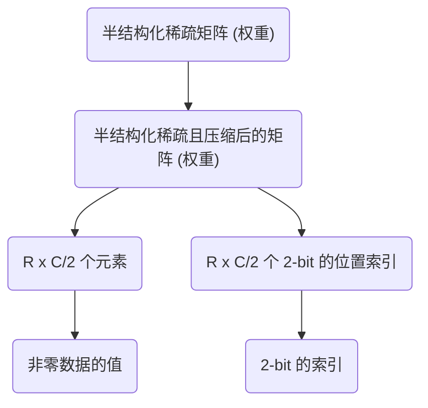

图 4.13 2:4半结构化稀疏模式及其数据的存储格式示意图

与非结构化稀疏模式相比，2:4稀疏模式及其数据的存储格式在访存和存储效率方面都更为出色。一方面，它能够消除依赖数据的不规则访存，提升带宽利用率。在传统的非结构化稀疏中，数据使用CSR、CSC或 COO 等存储格式，在稀疏矩阵一矩阵乘法（Sparse Matrix-Matrixmultiplication,SpMM）计算过程中，需要通过稀疏格式的数据内容确定矩阵值的访存地址，这将导致数据的不规则访存。相比之下，2:4 稀疏模式在矩阵的不同位置具有恒定的稀疏度，处理稠密操作矩阵时无须进行依赖数据的寻址，从而能够充分利用大带宽访存，并依靠计算单元进行小范围的索引。另一方面，2:4 稀疏模式占据的存储空间更小。它存储每个权重数据的索引仅需要2位。而在如图4.11所示的传统行压缩存储格式中，每个权重数据会带来更大的索引存储开销。例如，在2:4稀疏格式中，如果使用8位权重值，索引存储开销与非零权重值存储开销的比例为 25%，远低于行压缩存储格式中索引的相对存储开销（如果列索引使用16位，则索引存储开销可达 200%）。

半结构化剪枝方法的流程一般遵循基本的“训练一剪枝一微调”流程，即先训练一个稠密模型，再使用 2:4剪枝方法得到稀疏模型，最后对稀疏模型进行微调。针对上述 2:4 稀疏模式与压缩存储格式，Mishra等人设计了如图 4.14 所示的硬件加速单元，即稀疏张量核。该硬件加速单元相比于普通的稠密张量核增加了根据索引进行筛选的功能电路。在进行稠密计算时，相同数量的对应元素直接相乘，然后进行累加。在进行稀疏计算时，稀疏矩阵中的位置素引矩阵被用来筛选稠密矩阵中与之匹配的元素，然后对筛选出的匹配元素进行相乘和累加计算，以减少不必要的乘◎计算，使得实际所需的计算量降低为原始稠密计算的50%。而且，以上两种计算的乘法和累加电路是可以复用的。Chen 等人提出对Thansformer 模型中自注意力矩阵进行 n：m 半结构化稀疏。与对权重进行离线的n：m半结构化剪枝和稀疏编码不同，对激活进行 n：m半结构化稀疏需要在模型推理过程中高效地剪枝并稀疏编码动态计算出的激活值，因此 Chen 等人实现了采样稠密一稠密矩阵乘法（SampledDense-Dense Matrix Multiplication, SDDMM）的GPU算子，在模型推理时高效计算、剪枝并稀疏编码 Q五T矩阵。此半结构化稀疏矩阵被用于后续的按行 Soft max 和稀疏一稠密矩阵乘法，并加速对应计算。Chen 等人在 A100 GPU 上利用不同词块个数配置测试了1:2和2:4半结构化稀疏方法，相比稠密自注意力计算实现了1.38~1.86倍的加速。


图 4.14 张量核计算稠密和稀疏矩阵一矩阵乘法的流程示意图

### 4.7 针对激活值的剪枝方法

近似低秩分解、结构化剪枝、非结构化剪枝及半结构化剪枝，主要集中在对模型权重的操作上。本节将关注模型计算过程中的另一个关键部分，即激活值（Activation），探讨如何通过对激活值的剪枝提升模型的运行效率。激活值是在模型计算过程中产生的一些中间变量。有些激活值对最终结果的影响较小，因此可以跳过它们的计算。例如，在使用 ReLU作为激活函数时，会产生大量零激活值，这些零可以不继续参与权重短阵的乘法计算。这类方法被称为针对激活值的剪枝方法。

Transformer 的激活值剪枝是目前备受关注的研究领域。Thansformer 中的多头自注意力层（Multi-Heed Self-Attention, MHSA）是其核心组件之一。多头自注意力层会产生和输入与词块数 n2 的平方成正比的计算量和注意力矩阵激活值，因此针对 Transformer 的激活值剪枝是一种重要的高效设计方法。现有的 Tansformer 激活值的工作可以根据剪枝的位置是否与输入数据相关，分为动态激活值剪枝和静态激活值剪枝。

动态激活值剪枝会根据不同的动态输入删除不同位置的激活值。其基本思想是，实时地器测各个神经元的激活值，跳过对结果影响较小的神经元的计算，去除这些神经元对模型的影响从而实现剪枝的目的。Wang 等人利用自然语言中词句的“天然冗余性”，提出针对词块的剪枝方法。在注意力机制中，词块；和词块，之间的关系越强，注意力矩阵（i,j）处的值就越大。如图 4.15所示，该工作通过对注意力短阵的列进行求和，获得每一个词相对于所有词的累积重要性。对于累积重要性较低的词，会被从这一层及之后所有层的输入中删除，相当于删除了注意力矩阵对应行和列的激活值。实验表明，这种激活值剪枝方法可以将模型的计算量和访

存量減少 74%。


图 4.15 通过对注意力矩阵的列求和，判定词块的重要性并剪枝不重要的词块

与动态激活值剪枝不同，静态激活值剪枝中勇枝的激活值位置不随具体输入变化。这种勇枝方法通常在模型设计阶段就确定了剪枝的位置，并通过训练等方式使模型适应激活值的这都稀疏模式。BigBirdl24）通过预先定义的稀疏掩膜来规定注意力短阵中需要计算的元素位置，以而将注意力计算的复杂度从 O（n2）降低到 O（m））。如图4.16所示，BigBind 注意力掩膜主要由三个部分组成：随机掩膜、局部掩膜和全局掩膜。这些掩膜的设计使得稀疏的注意力能够有效地模拟原有稠密注意力模型中的重要注意力值。例如，一个词与所有词的全局注意力，或者都个词与周围词的局部注意力。同时，作者也证明了这种预先定义的稀疏注意力可以和完整附注意力一样建模所有连续的序列到序列函数，且具有“图灵完备性”。

另外，如果把每个词看作一个节点，将词与词之间的注意力看作一条边，就可以对静态稀疏注意力进行更进一步的理解和分析。原始的完整注意力相当于一个完全图，即所有节点之间的最短路径距离都是 1。稀疏注意力中的随机掩膜相当于图上的一些随机边。作者说明了O（n）条随机边就可以让图上任意两个点之间的最短路径距离变成 O（Logm）。这表示随机掩膜可以很好地保证词之间的信息流动，这和完整注意力是类似的。


图 4.16 由随机掩膜、局部掩膜和全局掩膜共同组成的 BigBird 注意力掩膜

注意力剪枝的差异不仅体现在动态性上，而且与权重剪枝类似，也表现在剪枝的基本单元粒度上。在词块粒度上的剪枝意味着跳过注意力矩阵中对应行和列的计算。例如，Chen 等人将图像的每个小块看作一个词块，决定每次注意力矩阵计算时可以删除哪些词块。注意力头粒度的剪枝使用更大粒度的剪枝单元。Wang 等人提出删除不重要的注意力头来減少 Transformer的计算量和内存开销。Hou 等人直接在层级粒度使用早停（Early Stopping）技巧，对于简单的任务，直接从某一层返回结果，跳过后面的所有计算。

### 4.8 剪枝方法的经验性选择

本节主要针对结构化剪枝方法，总结经验性规则，以帮助读者根据需求选择合适的方法，并分析剪枝结果的合理性。

#### 剪枝流程的选择

剪枝流程在算法层面存在三方面的需求，即需要保证剪枝后的模型有较高的准确率，需要满足明确的硬件资源限制，需要快速给出剪枝后的轻量化模型（剪枝方法本身的速度）。根据这三方面需求可以给出如下方法选择的建议。

（1）基于权重正则的方法：典型的方法是 SSL。4.3.1 节提到，这类方法在保持准确率的同时，难以可控地满足预先定义的硬件资源限制。然而，它们的时间开销相对较低。

（2）基于离散搜索的方法：典型的算法是 Net.Adapt30）和 AMC™T。4.3.2 节提到，这类为法能够根据预设的硬件资源限制进行精确剪枝，同时保持较高的模型准确率。但它们通常需要一个内外两层循环的迭代流程，时间开销较高。

（3）基于可微分搜索的方法：典型的算法是 BAR和 DSAB。这类方法结合了基于权重正则的方法和基于离散搜索的方法的优势，以可微分的方式进行层问敏感度分析，能够在满足资源限制的同时降低时间开销。但它们的敏感度分析的近似较为激进，评估准确度可能不足且模型准确率的波动较大，需要更精细的超参数调整。

#### 4.8.2 剪枝稀疏模式的选择

在特定硬件环境下，还需要分析硬件特性，并根据这些特性选择合适的模型剪枝方法。以下是对主流硬件环境下剪枝方法选择的建议。

（1）GPU:GPU普遍对稠密计算有良好的支持，它是为稠密的矩阵计算操作设计的。因此结构化剪枝方法通常能够较好地适配。NVIDIA 的安培架构显卡如 RTX 3090支持 N:M半结构化稀疏剪枝方法，能够在保持硬件性能的同时提供 50% 以上的较高压缩率。

（2）CPU:CPU 的指令通常是细粒度的，精确到基本的乘法和加法操作。因此，CPU 更关注剪枝方法带来的压缩率，而非关注其是否是结构化的。非结构化剪枝方法中的 Deep Com-pression和专门为CPU设计的半结构化剪枝方法都能在CPU上高效运行。

（3）专用硬件：专用硬件会使用更精细的调度、新的数据格式等方式高效地处理非结构化剪枝后的模型。例如，ESEP90|通过计算负载均衡技术缓解非结构化剪枝带来的计算单元负载不均衡，从而显著提高硬件处理速度。需要注意的是，这些专用硬件通常也支持结构化剪枝，使用时应根据模型的实际情况判断哪种剪枝方式更高效。

#### 4.8.3 关于任务性能的经验

为了分析在不降低精度的前提下，每个任务可以达到的压缩率，通常从任务类型、数据集规模和主干模型这三个维度考虑。通过控制变量的方法进行分析（固定两个维度，仅改变第三个维度），可以分别理解这三个维度对压缩率界限的影响。

（1）任务类型；不同任务上的同一模型可能具有不同的压缩率。例如，使用特定的剪枝方法对在分类任务和目标检测任务上分别训练好的 ResNet-50 模型进行压缩。分类任务的 ResNet-50模型的压缩率可能超过90%，而目标检测任务的ResNet-50 模型的压缩率可能只能达到70% 

（2）数据集规模：通常认为，训练数据规模越大，模型的压缩率越小。这是因为随着训练数据量的增加，可能会有更多模型权重被有效利用。例如，对于同一个模型，在 Imagelvet 数据集上训练通常比在 CIFAR 数据集上训练的压缩率低。

（3）主干模型：不同主干模型之间的可剪枝比例可能存在显著差异。例如，在目标检测任务中，对在 VOC 数据集上训练好的 SSD目标检测模型进行通道剪枝。当主干模型为 MobileNet时，模型的压缩率可能仅达到30%L32；而主干模型为 ResNet-50 时，模型的压缩率可能超过75%l.33l。一般来说，冗余度较高的模型更容易进行剪枝，例如 VGG比 ResNet 更容易剪枝，而ResNet 比 MobileNet 更容易剪枝。

#### 4.10 本章小结

模型剪枝是一类非常重要的模型压缩方法，旨在通过识别并删除模型中的冗余部分，以减少模型的计算和存储开销。具体来说，模型剪枝可以对神经网络的冗余权重或推理过程中的冗余激活值进行修剪，保持模型性能的同时显著提高其推理效率和资源利用率。在模型压缩的多个领域中，模型剪枝已经被广泛应用并取得了显著效果。

在这章中，分别详细介绍了不同的剪枝方法及其在模型中的应用。4.3节、4.5节和4.6节探讨了基于不同稀疏模式的权重剪枝方法。权重剪枝通过在训练后期移除不重要的权重来减少模型参数，从而达到模型简化和压缩的目的。采用稀疏模式的权重剪枝可以有效提高模型的稀疏性，同时保持模型的预测精度。

此外，低秩分解也是一种非常有前途的模型压缩技术，4.4节对此进行了详细阐述。低秩分解的核心思想是将权重矩阵进行分解，从而在结构化的低维空间中实现权重剪枝。通过这种方式，低秩分解能够在减少模型参数量的同时保持较高的模型表现。由于低秩分解本质上是在张量分解后的空间中进行的结构化剪枝，因此它可以被看作是模型剪枝的一种特殊形式。

在激活值剪枝方面，4.7节介绍了相关方法。这类剪枝方法主要针对模型在推理过程中产生的激活值，通过剪枝不重要的激活值来进一步优化模型的计算效率。激活值剪枝与权重剪枝相辅相成，能够在多个层面上提升模型的推理速度和资源利用率。

为了进一步深入了解模型剪枝和低秩分解，建议读者参考 Deng 等人撰写的综述文章，其中涵盖了这些领域的最新进展和技术细节。该综述为读者提供了全面的背景知识，帮助他们更好地掌握模型剪枝和低秩分解的核心概念及其应用。

在未来，关于模型权重和激活值剪枝的研究方向还有许多值得探索的领域。首先，对于视觉或文本 Transformer 模型，稀疏注意力机制的研究非常关键，尤其是在处理超长序列时，这一技术可以有效降低计算复杂度。其次，通过稀疏化或低秩分解来加速模型的训练过程也是一个重要的研究方向。随着模型规模的不断扩大，如何有效地加速训练过程将成为提高深度学习模型应用效率的关键。

总结而言，模型剪枝和低秩分解作为模型压缩的关键技术，已经在多个领域取得了显著进展。未来的研究将继续围绕稀疏性、低秩结构和模型加速等方面展开，推动这些技术在更广泛的应用场景中得到进一步发展。

