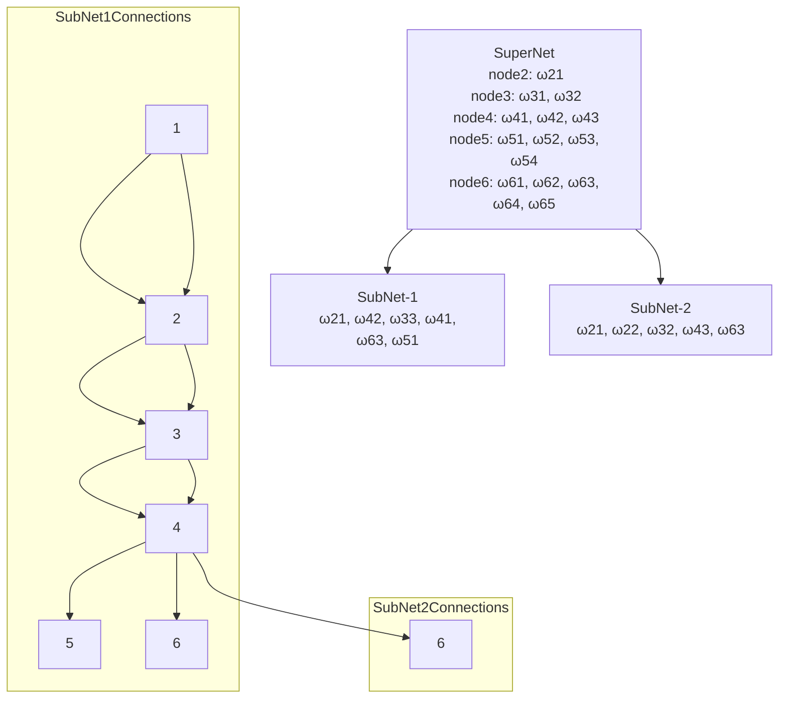

# clamp

x_int = torch. clamp(x_int, quant _min, quant_max)
## **Dequantize**
the quantized tensor
x_hat = x_int - zero_point) * scale
return x_hat
```

     图5.11适应了一个卷积层的量化感知训练前向与反向。传播过程前向传播时权重w被量化器按照指定量化格式与位宽量化，随后根据量化得到的整形值与缩放系数去量化回全精度。形式模拟量化后的权重，w一撇与同样经过模拟量化的输入激活值进行卷积。计算添加编制并应用激活函数后，当前层的输入y将再次进行模拟量化得到外一品作为下一层的输入。反向传播时，如图中跨越亮化器的紫色箭头所示损失函数对y的梯度。将于是5.30中所示的直通梯度指估计器梯度通过链式法则相乘。得到损失函数对y的梯度。需要注意的是，如图所示量化感知训练中参与训练的权重与激活值均为全精度形式。而权重与激活值的模拟量化操作即训练中对量化效应的模拟或仿真。全精度缩放的系数将被逐层积累，以尽可能减少全精度计算，实现实际加速。因为量化感知训练的流程不会用量化的整型结果做计算，而是使用模拟量化的浮点值x作计算。所以本节后文的量化操作都指代模拟量化操作。


flowchart TD  Start(\[开始\]) --> Export\[1. 导出ONNX，分段\]

```plaintext
subgraph 模型准备阶段
    Export --> Doc[2. 模型和部署的对接文档格式]
    Doc --> Convert[3. ONNX转BIN]
end

subgraph API集成阶段
    Convert --> API[4. APP调用5个API]
end

subgraph 对齐验证阶段
    API --> Log{5. 对数-单帧比对，可视化}
    Log --> IO[5.1 IO对齐]
    Log --> Output[5.2 输出对齐]
    Log --> Sim[5.3 仿真结果比对]
    
    IO --> |"比对run.sh pad后的输入和APP输入"| IOAlign[uint8和fp16输入问题]
    Output --> |"Run.sh拿到网络输出和APP比对"| OutputAlign[写一个辅助工具]
    Sim --> SimWidth[数据位宽]
end

subgraph 量化优化阶段
    IO --> Quant{6. 离线量化混合精度量化}
    Output --> Quant
    Sim --> Quant
    
    Quant --> SingleFrame[6.1 单帧的混合量化]
    Quant --> MixedPrecision[6.2 Image backbone int8, head int8+fp16]
end

subgraph 内存与调度优化
    Quant --> Memory[7. Memory bank设计]
    Memory --> Clip[7.1 Clip对数]
    
    Memory --> Schedule{8. APP调度，连接多个onnx}
    Schedule --> SharedFeature[8.1 共用feature放到flexidag_memblk_t]
    Schedule --> MultiBatch[8.2 多batch问题]
    Schedule --> BitWidth[8.3 位宽]
end

subgraph 对齐与封装阶段
    Schedule --> Process{9. APP前后处理}
    Process --> ProcessLogic[9.1 逻辑python和c++比对]
    
    Process --> Tuning{10. 精度调优}
    Tuning --> Int8Metrics[10.1 Int8跑指标]
    Tuning --> MultiFrame[10.2 多帧可视化]
    Tuning --> OnlineQuant[10.3 在线量化]
    
    Tuning --> SDK[11. 封装SDK，联调]
end

SDK --> End([完成])

classDef phase fill:#d0e8f2,stroke:#79a3b1,stroke-width:2px;
classDef process fill:#4dabf7,stroke:#339af0,stroke-width:2px,color:white;
classDef decision fill:#ffd8a8,stroke:#ffa94d,stroke-width:2px;

class 模型准备阶段,API集成阶段,对齐验证阶段,量化优化阶段,内存与调度优化,对齐与封装阶段 phase;
class Export,Doc,Convert,API,IO,Output,Sim,SingleFrame,MixedPrecision,Memory,Clip,SharedFeature,MultiBatch,BitWidth,ProcessLogic,Int8Metrics,MultiFrame,OnlineQuant,SDK process;
class Log,Quant,Schedule,Process,Tuning decision;

```


图 5.11 量化感知训练前向传播与反向传播示意图

量化感知训练流程的输入可以是随机初始化的模型，也可以是预训练后的模型。以预训练模型为起点的量化感知训练通常收敛得更快。图 5.12给出了量化感知训练的流程，一般还会用离线量化后的模型的权重进行量化，感知训练的初始化。。


图 5.12 量化感知训练的流程

深蓝色框表示必需步骤，浅蓝色框表示可选步骤，浅绿色框表示辅助技术或设置

（1）模型架构调整。在进行量化感知训练之前，可以考虑调整模型架构，使其更适应量化。一种常见的技巧是增加模型通道数，通过引入额外的计算来減少任务性能损失。在模型实际部署推理时，批标准化层通常需要被折叠。量化感知训练过程需要考虑到“批标准化层最终需被折叠”这一点，对批标准化层的统计信息累计和权重更新做特殊处理，具体策略可参考5.6.2节。

（2）過计量化器。量化感知训练中量化器的设计具有较大的灵活性。例如可以将缩放系数设置为可学习参数，通过梯度下降算法与模型权重联合优化。量化函数可以不局限于均匀量化，而是通过数据驱动的方法学习合适的量化间隔等。5.6.3节将展开介绍过化器设计方法。

（3）运行训练后量化。运行5.5节所介绍的训练后量化方法，为量化感知训练过程提供合适的量化权重和量化参数初值。

（4）运行量化感知训练。通过训练优化模型权重与量化参数。5.6.4 节将简要介绍分阶段训练的技巧。

主流的深度学习训练或推理框架（TensorFlow Lite、PyTorch、TensorRT）等）必现了简单的量化感知训练方法。MQBench 评估了量化感知训练的常用技巧并开源了同名框架，对经典的量化感知训练方法进行了良好支持。读者可根据实际需求，在这些开源框架的基础上进行扩展。

##### 5.6.2 调整模型架构的方法

针对批标准化层折叠的特殊处理

如2.2.1 节所述，批标准化层在模型推理阶段为一个线性变换，因此，为了减少计算量，找标准化层通常会被折叠进前序线性层。而量化感知训练过程需要考虑“批标准化层最终需被折叠”这一点，对批标准化层的统计信息累计和权重更新做特处理。若在量化感知训练时分别量化卷积层和批标准化层的权重、统计信息和计算结果，而在部署时将这两层的权重和统计信息折叠并量化，推理阶段的卷积计算结果会与训练阶段的卷积一批标准化层计算结果出现较大偏差。如图5.13所示，MQBench 将量化感知训练中针对批标准化层折叠的处理策略总结为以下5种。


针对批标准化层折叠的量化感知训练处理策路示意图

（1）将批标准化层的统计信息和权重折叠入卷积权重，移除批标准化层的参数表示。按照式2.12，将批标准化层折叠进前序卷积层权重，并完全移除批标准化层。需要注意的是，这种折叠方式完全移除批标准化层，可能会导致训练过程中梯度爆炸，需要谨馍设置训练超参数。

（2）将批标准化层的统计信息和权重折叠入卷积操作，在量化感知训练阶段不更新批标准化层的统计信息 A，o2，即保持浮点预训练模型的统计值，只更新7，B。Li等人发现，在搭配可学习步长量化（Learned Step size Quantization, L.SQ）方法时，即使不更新统计信息，仍可取得与更新统计信息的训练相差无几的性能。

（3）引入两次卷积，浮点卷积用于更新批标准化层的统计信息，模拟量化卷积则折叠卷积权重和批标准化层的批统计信息与权重、输出结果进入下一层。该策略由 Jacob 等人提出，在推理时需执行两次卷积操作，所以有额外开销。第一次卷积使用全精度权重，计算结果用以统计当前批的均值与方差 Ai，a2；随后，当前批上的均值与方差将先和卷积权重折叠，然后被量化，得到折叠量化后的权重Wfold。训练结束后，导出量化模型时，将滑动统计的均值与方差折叠进相邻卷积层的权重并量化得到最终权重。

（4）引入两次卷积，浮点卷积用于更新批标准化层的统计信息，模拟量化卷积则折叠卷积权重和批标准化层的滑动统计信息与权重、输出结果进入下一层。本策略的第一次卷积操作与策略（3）相同；不同之处在于第二次卷积时，本策略选择将滑动统计值折叠入卷积层，以避免批统计值的波动对训练过程带来影响；第二次卷积后，本策略使用滑动统计方差和当前批方差的比值g放缩卷积输出。

（5）显式地保留批标准化层，其基于模拟量化卷积结果更新统计信息180。无论在训练还是部署推理阶段，此策略都将批标准化层中的滑动统计信息与权重折叠入前序卷积层的权重并量化。与不再更新统计信息的策略（2）不同，此策略在训练阶段仍显式地保留卷积后的批标准化层，以更新统计信息。具体来说，如图 5.13（e）所示，由于批标准化层对前向计算结果的变换已被折叠入前序卷积层，所以其需要起到的作用仅为更新统计信息。因此，我们将卷积计算结果与系数TBD相乘，以近似抵消后续批标准化层对前向传播过程中的计算结果的作用。在推理阶段，由于，系数乘法与批标准化层对前向计算结果的作用相抵消，可直接移除该 ；系数乘法和批标准化层。此时，计算图将转变为与策略（1）一致。该策略相比策略（3）和策略（4）的优势是，统计信息是基于量化卷积结果更新的，而不是基于浮点卷积结果更新的。

MQBench 测试了上述策略并给出了一些经验，例如，不同的量化方法对批标准化层折叠策略有不同的偏好，不同的批标准化层折叠策略对训练效果和效率有不同影响等，感兴趣的读者可以阅读参考文献 以获取更多细节。

##### 5.6.3量化器设计的技巧

本节将介绍改进量化器的常用技巧，包括不改变量化函数形式，仅改变量化参数确定方法的技巧，可学习的量化参数以及使用更复杂的量化函数，例如使用非均匀可学习的量化函数随机舍入等技巧。

1. 可学习的量化参数

尽管基于均方差等准则计算出的量化参数可最小化局部量化误差或重建误差。但其全局任务性能往往是次优的。将量化参数设置为可学习变量并在量化感知训练中使用。任务损失对其梯度进行更新有希望改善全局任务性能。有人提出在激活函数中添加可学习截断阈值的方案参数化激活值截断阈值。Pact将relu函数替换为以下带有截断的激活函数。

$x\_{act} = \text{ReLU}\_{PACT}(x) = 0.5 \left( |x| - |x - \alpha| + \alpha \right) = \begin{cases} 0, & x \in (-\infty, 0) \\ x, & x \in \[0, \alpha) \\ \alpha, & x \in \[\alpha, +\infty) \end{cases}$

$激活值的输出范围被限制在 \[0, \alpha\]，范围可以近似由 2^b 中的可学习参数确定。$

与激活值量化常使用的轴承量化力度一致pact使用层内共享的阿尔法参数。阿尔法的取值越大越接近普通。R el u函数未取得限制动态范围的效果。Pact在交叉上损失函数的基础上增加了对阿尔法的L2约束项。

$= \left \{ \begin{matrix}- \frac{x}{s}+ \left\[ \frac{x}{s} \right\]&q\_{ \min}< \frac{x}{s}<q\_{ \max} \\ q\_{ \min}& \frac{x}{s} \leq q\_{ \min} \\ q\_{ \max}& \frac{x}{s} \geq q\_{ \max} \end{matrix} \right.\begin{split} x\_{\texttt{act}}=\texttt{ReLU}\_{\texttt{PACT}}(x)=0.5(|x|-|x-\alpha|+\alpha)=\begin{cases}\texttt{0},&\bm{x\in(-\infty, 0)}\\ \bm{x},&\bm{x\in\[0,\alpha)}\\ \bm{\alpha},&\bm{x\in\[\alpha,+\infty)}\end{cases}\\ \text{截断后},\ \text{激活函数的输出被限制在}\ \[0,\alpha\]\ \text{范围并被近似为}\ \texttt{2}^{b}\ \text{个可能值}\texttt{:}\\ \hat{x}=Q(x)=\left\[x\_{\texttt{act}}\cdot\frac{2^{b}-1}{\alpha}\right\]\cdot \frac{\alpha}{2^{b}-1}\\ \texttt{PACT}\ \text{认为},\ \hat{x}\ \text{相对于截断阔值}\ \alpha\ \text{的梯度可计算为}\\ \frac{\partial\hat{x}}{\partial\alpha}=\frac{\partial\hat{x}}{\partial x\_{ \texttt{act}}}\frac{\partial x\_{\texttt{act}}}{\partial\alpha}=\begin{cases} \texttt{0},&\bm{x\in(-\infty,\ \alpha)}\\ \texttt{1},&\bm{x\in\[\alpha,\ \infty)}\end{cases}\end{split}$

     Pact为激活函数增加了可学习的截断阈值。等价于自适应的调节激活值的缩放系数。Ls扣方法则更进一步的将权重与激活值的缩放。系数都作为优化变量引入训练过程。且修正了pact的梯度计算求得模拟量化的结果x等于cos。X关于缩放系数s的梯度为：

$\frac{ \partial \widehat{x}}{ \partial s}= \frac{ \partial}{ \partial s} \left\[ s \cdot{clip} \left( \left\[ \frac{x}{s} \right\];q\_{ \min},q\_{ \max} \right) \right\]$

$= \left \{ \begin{matrix}- \frac{x}{s}+ \left\[ \frac{x}{s} \right\]&q\_{ \min}< \frac{x}{s}<q\_{ \max} \\ q\_{ \min}& \frac{x}{s} \leq q\_{ \min} \\ q\_{ \max}& \frac{x}{s} \geq q\_{ \max} \end{matrix} \right.$

其中，［］舍入函数的导数为1（直通梯度估计）。直观理解此式，待量化数值越接近两个相邻量化间隔的过渡点（Transition Point ），其量化后数值越可能随着缩放系数和过渡点的微小变化而发生改变。放缩后浮点值 e跟舍入后整型值［罗］的差距越大，企关于。的梯度绝对值越大。

由式5.34 中的-3+［与图5.14（b）可见，式5.34 推导的缩放系数的梯度符合这一直观认识。


图 5.14 图中取 s=1,9min = 0, gmex =31244）

2．量化函数的没汁

本节将介绍调整量化函数的工作，包括将均匀的量化间隔替换成可学习的量化间隔LQ-Nets 、将舍入函数随机化的技巧、将量化函数软化并随着训练逐渐逼近“硬量化”的可微分软量化（Differentiable Soft Quantization, DSQ）。

量化函数非均匀化：可学习量化间隔。如5.3.2节所述，一些研究者指出，手工设计的量化格式（如均匀量化或对数量化）不能很好地适应数据的分布，量化效果不理想。为此，研究者提出量化间隔可学习的量化函数。注意，前节所述的量化参数可学习的量化函数保留了均匀量化格式，通过训练确定缩放系数、量化零点等量化参数，而这里介绍的可学习量化函数打破了均匀量化的限制。

如式 5.35 所示，n-bit 无符号量化值 q 可表示为一个包含 2 的幂次的基向量与二值编码向量 $e = \[e\_1, e\_2, \ldots, e\_n\], e\_i \in \{0, 1\}$ 的内积：

$q= \langle \left\[ \begin{matrix} 1 \\ 2 \\ \cdots \\ 2^{n-1} \end{matrix} \right\], \left\[ \begin{matrix} e\_{1} \\ e\_{2} \\ \cdots \\ e\_{n} \end{matrix} \right\] \rangle$

二值编码向量 $e$中的每个元素有两种可能的取值，携带 1-bit 信息，可表示 $\{-1, 1\}$或 $\{0, 1\}$。这两种编码的计算都可用于 $\{0, 1\}$机器数的位操作实现。读者可参考二值化神经网络工作例如 6.2 节了解如何使用 $\{0, 1\}$机器数的位操作实现逻辑上 $\{-1, 1\}$编码的计算。LQ-Nets 使用 $\{-1, 1\}$编码权重，$\{0, 1\}$编码激活值。为方便讨论，本节将权重与激活值的编码方案统一为 $\{-1, 1\}$。

LQ-Netsl使用基向量与二值编码向量的内积形式来表示量化水平，把基向量的元素从2的幂次推广为可学习的浮点数。通过量化感知训练确定基向量（表示为心）后，数值的各个量化间隔就确定了。此时，落在第1个量化间隔的 对应的量化水平 9 可表示为式 5.36：

$Q\_{LQ-Nets} \left( x,v \right)=q\_{l}=v^{T}e\_{l}, \text{如果}x \in \left( t\_{l},t\_{l+1} \right\]$

式中，l= 1,2，，20为量化间隔的编号，每一个量化间隔对应一个 n-bit 二值编码 el e｛-1，1｝”。通过判断待量化数值落入哪一个量化间隔内，得到该间隔的二值编码，进而可由基向量与二值编码计算出量化水平。量化间隔的端点 t为两个相邻量化水平的中点：女=（9-1+90）/2。图5.15 给出了2-bit 时，量化水平集合｛9｝=1.2.2n如何用可学习的基向量的元素组合而成：可学习的基向量为 =［e1，02］，共有 22=4个量化间隔，二值编码分别为［-1，一1，

［1，一1）【-1,4）【1，1，対立的量化水平91.94分別方-01-02,01-023-01+02,01+02


图 5.15 2-bit LQ-Nets 的量化水平和量化函数

总的来说，为了实现可学习、非均匀的量化函数，LQ-Nets对量化函数进行参数化的方式如下。首先，利用基向量和二值编码向量的内积来表达量化水平；然后，将基向量从固定的1，2.，2-1 向量（均匀量化）推广到可学习的向量。使用这种参数化方式（对于 no-bit仅有几个可学习参数）来实现非均匀间隔的好处是最化后问录的内积可由位操作高效实现。假设二个N 维权重向量为心 ER”，其经过 LQ-Nets最化兩数得到線码向量 eY E（-1.1｝”，1一1,2..7，其中，7w表示权重的量化位宽，辅明向藏e、中的元業为心中各权重第 个比

$Q\_{LQ-Nets} \left( \omega,v^{ \omega} \right)^{T}Q\_{LQ-Nets} \left( a,v^{a} \right)= \sum\_{i=1}^{n\_{ \omega}} \sum\_{j=1}^{n\_{a}}v\_{i}^{ \omega}v\_{j}^{a} \left( e\_{i}^{ \omega} \odot e\_{j}^{a} \right)$

舍入随机化。如果使用确定性的舍入函数，那么量化函数就是确定性的，即对于每一个待设化数值，都会唯一输出一个确定的量化值。然而，确定性量化在一些情况下是次优的。例如，在低比特训练中（可参考5.10节），反向传播的梯度会被量化至低位宽表示，若选择较低量化位宽，梯度几平总会被量化为0，导致训练失败180。与之相对，随机舍入（Stochastic Rounding）可以提升优化过程的探索性，让模型有可能逃离局部最优值。在低比特训练中，对梯度使用随机舍入尤其重要，这一点也被后续工作23 进一步验证。式5.38 给出了随机舍入的定义：$\left\[ x \right\]\_{stochastic}= \left \{ \begin{matrix} \left\[ x \right\], \text{以概率} \left\[ x \right\]-x \\ \left\[ x \right\], \text{以概率}x- \left\[ x \right\] \end{matrix} \right \}$式中，［istehastie 表示随机舍入，L」与「.1分别表示向下与向上舍入。随机舍入在量化操作中引入了随机性，待量化数值被量化到它的两个相邻量化水平的概率与其至对应格点的距离成反比。

即使待量化数值非常接近某一格点，它仍有一定概率被量化至较远的另一格点，从而避免训练陷入局部最优。需要注意的是，随机舍入要求在每次再量化时都生成相应数量的随机数，需要特殊的硬件支持并会带来额外的计算开销。

量化函数软化。如5.6.1节所述，由于舍入函数不可导，量化感知训练里常使用直通梯度估计器估计舍入函数的梯度。虽然直通梯度估计器的计算方式简单、实用性强，但由于与前向传播过程存在差距，其估计梯度与实际的数值梯度之间存在误差。尤其是在量化位宽较低时，梯度估计误差较大，可能导致优化过程不稳定。降低量化神经网络训练过程中的梯度估计误差有两种主要思路。一种思路是使用其他梯度估计器，这类方法在极端量化的二值化神经网络里更为常见，例如，将直通梯度估计器中反向的单位线性函数替换成与前向的离散量化函数更接近的非线性函数，参见 6.-4.2 节。另一种思路是将前向传播过程的量化函数软化（Soften），反向传播过程中直接使用该软化量化函数的梯度。虽然第二种方法的前后向传播过程不存在差距，但是其前向过程和真正量化的前向过程存在差距、不能得到离散的量化值。因此，会通过设计方法在训练过程中逐渐调墼量化函数的软化程度，使其在训练结束时逼近离散量化函数。这里，我们介绍的可微分软量化101 属于第二种，其提出了一种软化量化函数，将阶梯形状的离散量化函数分段替换成形状可调鳖的双曲正切函数。式5.39给出了一个量化间隔上可微分软量化函数

$\varphi(x) = s \tanh(k(x - m\_i)), \quad \text{if } x \in P\_i \\ where: \\ m\_i = l + (i + 0.5)\Delta, \quad s = \frac{1}{\tanh(0.5k\Delta)}$

式中，P。表示不同的量化间隔，ms确定各个间隔的位置，A= 当步一” 表示量化间隔的长度（Uhmax 和 vmin 为量化区间的浮点上下界）。参数。的设置保证此分段双曲正切函数在量化间隔邻接处连续且平滑。参数 k 可控制此量化函数的软化程度，k 越大，此量化函数越接近阶梯状的离散量化函数。DSQ 的整体函数形式如式5.40所示。

$Q\_{soft} \left( x \right)= \left \{ \begin{matrix} v\_{ \min},&x<v\_{ \min} \\ v\_{ \max},&x>v\_{ \max} \\ v\_{ \min}+ \Delta \left( i+ \frac{ \varphi \left( x \right)+1}{2} \right),&x \in{P}\_{i} \end{matrix} \right.$

由于 DSQ的软化量化函数处处可导，反向传播过程可直接依赖该函数的自动微分进行梯度回传，不需要梯度估计。DSQ 会使用损失函数的梯度指导k的更新，其中用到了一个可反映 DSQ量化与标准量化差距的特征变量（Characteristic Variable）作为中间变量，具体细节请读者参考文献 。如图 5.16 所示，随着 DSQ训练的推进，DSQ量化函数逐渐逼近阶梯函数的形状，因此在训练结束时将其替换成离散量化函数不会引入太大误差。


图 5.1 周期2 DSQ 的软化量化函数示意图

对于量化位宽较高的情形（如 4bit 及以上），梯度估计误差对任务性能的影响较小；对于估计误差的研究也更为丰富，感兴趣的读者可参考6.4.2 节。极端量化情形（如二值或2-bit 量化），梯度估计误差可能对任务性能产生较大影响，校正梯度

##### 常用的训练技巧

分阶段训练

从头开始使用量化感知训练一个随机初始化的模型可能会导致收敛速度较慢，并且可能无法找到较优的收敛点。为了解决这一问题，可以采用分阶酸训练的方法。这种方法设立了一些更容易优化的中间阶段，逐步实现不同程度的量化，最终得到所需的量化模型。阶段间的变化可以是位宽逐渐降低，也可以是被量化的张量类型和个数逐渐增多等。分阶段训练的技巧在训练极端量化的二值化网络时更常用，感兴趣的读者可以参考6.4.3节。在非极端量化的情况下，也可以看到分阶段训练思想的应用。例如，为了加速训练，可以从全精度模型出发，先对全精選模型应用训练后量化方法确定量化参数和量化值的初始值，然后在后续的量化感知训练中逐步更新量化参数和量化值。这种以全精度模型的训练后量化结果作为中间阶段，为量化感知训练阶段提供合适的初始量化参数的做法可以看作一种分阶段训练技巧。关于量化感知训练中量化参数初始化的讨论细节，读者可参考 Nagel等人所著的量化白皮书161。

还有一些研究工作使用知识蒸馏的技巧，在不同阶段的模型之间传递知识，例如，以全精度模型作为“老师”指导低位宽“学生”模型的训练，以改善学生模型的性能。Polino 等人提出使用知识蒸馏的方法，训练低位宽学生模型时在普通的交叉熵损失之外引入蒸馏损失项，即学生模型输出的软标签和老师模型输出的软标签的交叉熵。

#### 5.7 混合位宽量化

量化位宽是一种可配置的量化参数。早期的量化方法通常对整个模型使用相同的量化位宽。然而，神经网络模型的不同层具有不同的量化敏感度。在给定平均位宽限制的情况下，使用统一的量化位宽会导致量化后模型的性能受到对量化敏感的算子的限制。为了解决这一问题，混合位宽量化方法（也称为混合精度量化方法）对模型的不同部分使用不同的量化位宽，以权衡“性能一效率”；给对量化更敏感的层分配较高的量化位宽，以降低该层量化所带来的性能损失；同时，给对量化不敏感的层分配较低的量化位宽，以降低存储和计算需求。

TBD： 为什么混合位宽量化可以提高精度？

5.7.1基于敏感度指标的混合位宽量化

基于敏感度指标的混合位宽量化（Hessian-AWare Quantization,HAWQ） 是较早被提出的混合位宽量化方法之一。该方法认 損失函數对模型权置的 Hlesdtan 短降信息可以用于衡圍EAWQ给出了混合位宽量化问题的基本定义：以最优化“性能一效率”权衡为目标，确定模型每层的量化位宽。然而，由于位宽的优化空间巨大，如果采用简单的选代搜案方法探索该变间，且每个送代都需要训练一个量化模型，则模型量化过程会消耗大量计算资源。幸运的是，我失函数对各张量的梯度仅需要单次前向传播与反向传播就可以得到，其中包含了丰富的信息。一个直接的想法是：梯度越大的张量对量化越敏感。然而，HAWQ1280 指出，仅仅使用一阶信息并不能很好地反映量化敏感度，而由 Hessien矩阵表征的二阶信息可以更好地反映量化敏感度。具体来说，Hessian 短阵的特征值越大，损失函数曲面在当前权重取值处的曲率越大，即较小的权重量化误差可能导致更大的损失函数变化。此时，这部分权重数值需要更大的位宽表示，以避免较大损失。因此，Hessian 矩阵的特征值可以作为各张量的敏感度指标，并作为混合位宽分配的依据。然而，完全计算 Hessian 矩阵及其特征值代价过大。因此，Dong 等人在 HAWQ 中提出了一种近似算法，以快速获得 Hessian 矩阵的特征值作为量化敏感度指标，并基于该指标手工设计了位宽分配方案。与非混合位宽量化方法相比，HAWQ取得了更好的“性能一效率”权衡。

HAWQ 提出了使用 Hessian 矩阵的最大特征值来描述量化敏感度，这可以指导高效的混合位宽量化。然而，HAWQ存在三个问题：首先，它没有考虑除了最大特征值的其他 Hesian信息；然后，虽然相对敏感度可以指导位宽在不同层之间的相对大小关系，但具体的位宽设置仍需要手动分配；最后，HAWQ 没有对激活值进行混合位宽量化。为了解决这些问题，Dong等人在 HAWQ 的基础上提出了HAWQ-V2151。该工作提出使用所有 Hessian 矩阵的特征值的平均值，即平均迹（Average Trace），作为更好的敏感度指标。此外，他们提出了一种自动化位宽分配的方法，即按照式5.41 对所有满足相对大小关系的位宽分配方案计算各层的量化敏感度和量化误差的乘积之和 2，并选择最小化52的位宽配置：

$\Omega= \sum\_{i=1}^{L}Tr \left( H\_{i} \right) \cdot \left \| Q \left( W\_{i} \right)-W\_{i} \right \|\_{2}^{2}$

其中，工表示模型层数，9（0）表示難化后权事，35（社）表示该层的 Hesian 平均迹。最后，财微活信进行 Hlesten短降分析和混合位還藏代。并发现这讨于目标检测任务非常有益。

上述两个版本的 EANQ均采用深点維效系数的逐化存式。HANQ-valsn则针对全擊数证化格式（Inrteger-only）的混合位宽量化展开了研究。全整数量化格式的计算只涉及整数乘法、加法及静态位毯，对硬件更友好。为确定混合量化位究，EAW9.V3仍采用式541作为优化目标。与 EAWG.12来朋一评估射有满及相对大小关无理服防备限右器、造择最小化 ”的方樂木間

$\begin{split}&\min\_{\{\bm{b\_{i}}\}\_{\bm{i=1},\cdots,L}}\sum\_{\bm{i=1 }}^{L}\Omega\_{\bm{i}}(\bm{b\_{i}})\\ \text{s.t.}&\quad\sum\_{\bm{i=1}}^{L}M\_{\bm{i}}(\bm{b \_{i}})\leqslant\text{Model Size}\\ &\quad\sum\_{\bm{i=1}}^{L}G\_{\bm{i}}(\bm{b\_{i}})\leqslant\text{BOPS }\\ &\quad\sum\_{\bm{i=1}}^{L}Q\_{\bm{i}}(\bm{b\_{i}})\leqslant\text{Latenc }\end{split}$

5.7.2基于搜索的混合位宽量化

HAWQ 系列工作基于 Hessian 矩阵的特征值快速评估各层的敏感度，并基于各层量化误差影响独立的假设，使用各层敏感度指标计算整体优化目标，再针对此优化目标运行网格搜索或规划算法完成位宽分配。除了这类工作，也有一些工作不借助敏感度分析指标，直接使用迭代搜索的方法，针对整体模型的性能、效率等优化目标和限制来确定位宽分配。

ReLeQ来用強化学方法近端策略代化（Proximal Policy Optimization,PPO来完成混合位宽分配。其状态空间为不同的量化位宽，奖励则为量化准确率与浮点准确率的比率。与此类似，硬件感知自动量化153（Hardware-aware Automated Quantization, HAQ）也采用强化学习算法 Actor-Critic195l。 HAQ 的状态空间同样为每层的位宽，奖励函数为任务性能和硬件仿真性能的加权和。值得一提的是，HAQ针对不同硬件平台进行了实验，包括 Intel CPU、NVIDIA GPU 及智能手机等。

与其他离散搜索方法一样，以上基于强化学习的搜索方法依赖反复的迭代测试，资源消耗大。为解决这一问题，DNAS借鉴了可微分搜索相关工作，采用基于梯度的方法来优化位宽决策。后续的工作 HMQ 通过在硬件模型中添加实测硬件延时等数据，提高硬件性能建模的准确性。表5.3 展示了在 ImageNet 数据集上对 ResNet-50 进行量化时各方法的性能。采用混合位宽的量化方法比使用单一量化位宽的量化方法获得更好的性能一效率权衡。


| 工作 | 类型 | 压缩率 | 性能 |
| --- | --- | --- | --- |
| LQ-Nets | 非混合位宽 | 10.67× | 74.20% |
| HAQ | 混合位宽（自动化） | 10.57× | 75.30% |
| HAWQ | 混合位宽（人工准则） | 12.28× | 75.50% |
| HMQ | 混合位宽（自动化） | 15.70× | 75.00% |

5.8 量化方法的经验性选择

本节将介绍量化方法选型的经验。量化方法选型时，应综合考虑以下三方面的情况和需求。

（1）模型生产周期和数据获取情况：应根据此场景的情况决定使用何种量化流程。

（2） 算法性能目标的需求：应根据此场景的需求决定使用何种量化流程，并设计和决定合适的数据表示、算子与计算图调整方法。

（3）任务负载情况、硬件平台能力的情况和硬件效率目标的需求：应根据此场景的情况和需求分析效率瓶颈，并设计和决定合适的数据表示、算子与计算图调整方法。

本节的组织安排如下，5.8.1 节将介绍不同量化流程的特点和选择思路。5.8.2 节将介绍数据表示的设计和决定，从量化格式、量化参数和量化值这3个方面给出建议。5.8.3 节将介绍算子的选择与处理和计算图的调整。5.8.4 节将提供针对典型任务的前沿量化性能分析（截至2023年）供读者参考。

5.8.1量化流程的选择

量化流程的选择，即量化感知训练或训练后量化，与模型生产周期、数据获取情况、任务性能要求等应用场景的情况和需求紧密相关。

（1）量化流程的时间开销：量化感知训练方法需要执行模型训练任务，所需时间较长（数小时乃至数天）；训练后量化方法的执行速度取决于缩放系数、量化零点等量化参数的确定方法，基于统计数值的量化参数求解15］ 速度较快，仅需秒量级；而基于误差最小化准则显式优化量化参数的训练后量化方法则根据模型规模、校正数据规模，以及优化算法的不同，可能需要数分钟乃至数小时的运行时间。

（2）量化流程的数据开销：量化感知训练通常需要大量数据，在难以获得训练数据的场景下并不适用；训练后量化可分为需要校正数据与不需要校正数据（Data-free） （L55） 两种类型。前者通常需要几百至上千个训练样本以辅助量化参数的确定，而后者常借助模型中批标准化层的参数来辅助确定量化参数，因此不需要真实数据。

（3）量化模型的任务性能：一般而言，在同样位宽下，可以期待量化感知训练方法比训练后量化方法取得更高的任务性能。

5.8.2 数据表示的设计和决定

本节讨论数据表示的设计和决定经验及用什么格式表示量化后的。市值数值，如何将全精度数值转化成量化后数值？

1）量化格式的设计

（1）根据带量化张量的分布选择对称或非对称量化，格式对于数值在数轴上近似以零点为中心的对称分布的张量，如模型权重，可选择有符号的对称量化格式，对于Relu激活值等单尾分布的量化对象，可选择无符号的对称量化格式，在数据分布难以事先确定的情况下，也可尝试更一般的非对称量化格式。

（2）选择均匀或非均匀量化格式时，应充分考虑硬件平台的支持情况，均匀量化的模型更容易在通用计算平台上取得加速。而一些非均匀量化方法则需要配合定制硬件取得实际加速。

（3）采用逐张量的量化粒度，当无分支结构时，可直接将相邻各层的浮点缩放系数单独垒成模型的量化推理效率最高。而采用逐通道的量化粒度时，虽然可以带来任务性能的收益，但其在每层计算后需要进行再量化推理开销一般更大。

2） 待量化操作类型和张量类型的选择

当决定量化哪些操作类型或哪些张量类型时，需要考虑任务性能和硬件效率两类目标。在任务性能方面，通过分析给定任务和模型的数据分布，若发现某些操作类型或张量类型对量化特别敏感，可以选择不对其进行量化，例如大语言模型中的 LayerNorm 层。在硬件效率方面，应基于硬件效率目标、任务负载和硬件平台的能力，分析效率瓶颈并据此选择合适的待量化张量类型。以大语言模型的推理或训练为例，考虑不同硬件平台和工作场景：在云端大批次推理场景中，硬件平台往往工作在计算瓶颈的状态。这一场景重点关心吞吐率这一效率指标。若硬件平台有低精度计算单元，可以采用权重激活量化方案，并利用低精度计算单元来加速计算。在端侧小批次推理场景中，硬件平台往往工作在访存瓶颈的状态。由于端侧硬件平台的存储能力和带宽较小，这一场景需重点关注模型存储开销、运行峰值显存和延时等效率指标，此时可考虑使用仅权重量化方案，仅量化权重，量化推理时将权重去量化成高精度表示，再使用高精度计算单元计算。训练阶段，为了优化存储开销和训练吞吐率两个指标，可以对激活值进行低位宽量化，减少存储需求和通信开销。

3） 量化参数和量化值的决定

（1）设定位宽参数时，需要考虑任务性能和硬件效率两类目标。在任务性能方面，应避免格敏感的操作和张量的位宽设置得过低。针对此问题，混合位宽量化方法提出了多种敏感性分有技术和自动化位宽决定技术，读者可参见5.7节。在硬件效率方面，应基于硬件效率目标、任务负载和硬件平台的能力，分析效率瓶颈并据此决定采用何种位宽。例如，某些硬件平台没有4比特计算，单元这意味着无法通过将模型的权重和量化积量化值量化成四比特。已在此平台上实现计算加速。若将权重量化为四比特，将激活值量化成8bit。量化推理过程需要在权重和激活值的矩阵矩阵乘法前对权重进行去量化。乘法后对激活值再进行再量化。若将权重和激活值均量化成8bit，则量化推理过程仅需要在乘法后对激活值进行再量化。此时将权重从8bit进一步量化成斯比特虽然能。降低权重缓存开销，但会引入额外的去量化操作，这两个代价需要在决定位宽配置时进行平衡。当硬件平台处于计算瓶颈的状态，例如大批次推理场景时，将权重从8bit量化成斯比特可能不能降低时间延迟。

（2） 选取缩放系数和零点参数的决定方法时，需要考虑任务特性和模型数据外布特性。每如，对于超分辨率、图像去嗓等底层视觉任务，中间特征的准确表示对任务性能至关重要，因时可能需要采用更先进的激活值量化参数选取策略。例如，选取基于训练的量化参数策略，1kg以降低任务性能锁失。再例如、对于大语言模型，SmoothQuant对其权重和激活值的数据分布进行了分析，发现激活值中的离群数值较多，且分布在少数几个通道中，因此其采用重参化策略将激活值中的离群通道和权重中对应通道进行通道均衡。

（3）读者可由简入繁地尝试各种方法，直到取得满意的量化效果。可以先尝试图 5.8所示的训练后量化的流程（深色部分），如果不能满足应用性能的要求，再考虑引入量化值调整策略。如果仍然不能满足应用性能的要求，则考虑采用量化感知训练方法。在应用量化感知训练方法时，可以先尝试基于最值的量化参数确定方法，再尝试使用可学习的量化参数14。

5.8.3 算子的选择与处理和计算图的调整

本节讨论如何根据任务、模型和硬件平台的特点进行算子选择和处理，以及进行计算图的调整。

1. 算子的选择与处理

量化后的模型需要实际部署到目标硬件平台，因此量化仿真时就需要考虑硬件算子的支持情况，对算子进行调整或替换。常见的调整和替换规则如下。

（1） 许多专用深度学习加速硬件不支持特妹算子，因此在量化部署之前可能需要替换这些算子，并可能需要进行额外的训练。例如，双线性上采样层（BilinearUpsample） 常需要通过反卷积实現，再重新训练模型。

（2）一些复杂的激活函数，例如sigma的swish等的实现需要额外的硬件支持。例如在定制化硬件设备上可利用查找表将输入数值应设置激活后数值。若硬件无额外支持，则需要在高精度下完成非线性运算，并。在其后插入量化节点以实现模型的全定点化。此类复杂激活函数不一定能给量化模型带来性能提升，因此读者也可以尝试将其替换成rllu。等硬件友好的激活函数。

（3）在进行量化仿真时，需要考虑算子的输入/输出的量化参数的对齐情况。以常见算子为例，对于最大池化层。池化后的特征图可以使用池化前特征图的量化参数和量化值，无须对其进有再做化：然而，对于平均池化层，池化操作可能引入新的非整型值，因此可能需要在该层后插人畫化书点进行再量化，考感到平均池化操作对数值范围影响较小，一般可以选用与池化前特证图一致的量化参数做再量化A0N。眺酥连接涉及张量的逐元素相加（Element-wise Addition）或者特征拼接（Concatenation），读者应注意两个操作张量的量化参数是否一致：逐元素相加时，读者需要对并加数的量化参数，或者将加数去量化成高位宽、高精度格式，并使用高位宽、高精度的格式完成加法；类似地，特征拼接操作也需要保证所拼接的特征图量化参数一致，或者去量化成高精度、高位宽格式，再重新计算整体的量化参数1600。

（4）可以根据任务特点对算子做处理以降低量化损失。以常用的目标检测模型 YOLOv3为例，原始的 YOLOv3模型将分类结果与回归结果合并在同一个卷积层后输出，两者的数值尺度不同，直接量化会导致严重的检测性能损失。因此，可以考虑将输出卷积层拆分为两个独立卷积层并分别量化以扩散模型为例，DDPM 扩散模型中 U-Net 的跳跃连接将浅层和深层特征拼接在一起，再进行卷积计算，而这两部分特征的数值尺度不同120m，直接量化会导致较大量化误差，因此可考虑将输入的浅层和深层特征和后续卷积计算在通道维度拆分，分别进行量化计算，计算后再相加。

2. 计算图的调整

（1）为了匹配量化仿真结果和实际硬件量化推理结果，量化仿真过程需考虑到模型的后续编译和量化推理过程中的“算子融合”。算子融合是深度学习模型编译中常用的计算图优化策略，指的是将一些低计算强度的算子融合至相邻层以减少模型运行的存储开销和访存开销。例如，激活函数、批标准化层等算子常会被融合至相邻线性层。一个关于激活函数融合的例子如下，DTs 格式的权董与激活值计算后，中间结果在 32 位聚加體中积聚并存至内存中。将此策果存入内存再读出以应用激活函数会造成额外的存储和访存开销，因此许多硬件平台支持在算出中间结果后直接应用激活函数并量化至 8-bit 后再存入内存。量化仿真时应该考虑算子融合，避免在这些被碳合的算子间插人额外的量化节点。关于批标准化层融合的介绍已在 363节给出。必要时，可以调整某些算子的位置以方便后续的算子融合，减少存储开销、访存开销及再意化操作的插人。例如，若原模型中特征拼接层后有激活函数，可以考虑将激活函数移动至特征拼接层前与线性计算层融合。

（2）在量化位宽、格式与量化方法已确定，但任务性能无法满足应用需求的情况下，读者可以考患將模型加宽或加深，以骄补量化造成的任务性能越失。

5.8.4 关于任务性能的经验

本节以图像分类、目标检测与底层现觉等应用为例，讨论典型量化方法可取得的效果。需要注意的是，量化效果受应用任务、数据集、模型大小等因素影响，难以精确预测。出于任务通用性和硬件支持性的考虑，工业界常采用成熟的8-bit 量化。在这个位宽下，量化模型基本上可以达到接近全精度模型的性能）。最新的量化方法则可以取得以下效果。

1. 图像分类

相比早期的量化方法，目前的前沿方法 已经取得了显著的进步。较新的量化感知训练方法可在 ImegeNet 数据集上将模型权重和激活值量化至4-bit 并维持任务性能，甚至还在向更低的位宽挑战（在将权重与激活值均量化至 2-bit 的情况下，得到2% 以内的准确率损失）。先进的训练后量化方法可以将权重量化至4bit，同时保持激活值的全精度，在这种情况下，保持 ImageNet 的分类性能，或者在将权重与激活值均量化至4-bit 的情况下，得到约1% 的准确率损失。完全不需数据的训练后量化方法1210的性能相对受限，在5-bit 的量化位宽下仍会产生较明显的准确率损失（约2%）。

2. 目标检测

目标检测领域的量化前沿工作AQD首次将全模型（包括骨干网络、特征金字塔网络、检测头）量化至 4-bit，同时在 COCO 数据集12121上将任务性能损失控制在1%以内。AQD论文的作者 Chen 等人还展示了按模型组件的量化结果，将骨干网络与特征金字塔网络的权重与激活值量化至2-bit，保证检测头为全精度时，性能损失在1%以内。

3. 底层视觉

底层视觉模型通常通过大量计算换取微小的性能提升1218，因此模型的效率问题非常突出1214,215。底层视觉模型的量化相对困难，这可能是因为底层视觉任务要求准确保持特征值的缘故。前沿的底层视觉量化方法1210）能够在图像超分辨率任务上将模型无损地量化至8-bit（权重及激活值），但将模型量化至 4-bit 时，任务性能损失约为 3%。

5.9拓展：低比特推理硬件实现

5.9.1 定点计算的硬件效率

冯诺依曼体系结构中计算数据都需要通过保存从内存中得到。而低比特数的保存总量少，因而具有能耗优势。如图所示，以三级存储和计算d ram s ram register计算电路的典型ac可设计为例。单位数据的缓存能耗可达计算能耗的数。百倍通过量化将数据位宽降低，可以直接降低保存量，从而降低能耗。相比高位宽数据相同大小的片上s ram可以缓存更多低位宽数据，这。使得从更慢和功耗更高的低ram中访问数据的需。求大大减少具有能耗和性能的优势，此外低比特的计算效率也更高。如表所。示低。位宽定点数的计算单元相比单精度浮点数的计算单元具有功耗和面积的优势。综上所述相比于全精度数据格式的神经网络量化神经网络的效率提升大部分来自保存功耗的减少。也有一部分来自计算的优化。


| 操作 | 能耗 (MUL / pJ) | 能耗 (ADD / pJ) | 面积 (MUL / µm²) | 面积 (ADD / µm²) |  |
| --- | --- | --- | --- | --- | --- |
| 8-bit INT | 0.2 | 0.03 | 282 | 36 |  |
| 16-bit FP | 1.1 | 0.4 | 1640 | 1360 |  |
| 32-bit FP | 3.7 | 0.9 | 7700 | 4184 |  |

| 操作 | 能耗 / pJ | 相对能耗 |
| --- | --- | --- |
| 32位整数加法 | 0.1 | 1 |
| 32位浮点加法 | 0.9 | 9 |
| 32位寄存器 | 1 | 10 |
| 32位整数乘法 | 3.1 | 31 |
| 32位浮点乘法 | 3.7 | 37 |
| 32位SRAM缓存 | 5 | 50 |
| 32位DRAM内存 | 640 | 6400 |

45nm CMOS 工艺下各类操作的能耗，访存的能耗比简单算数计算的能耗高三个数量级

#### 浮点计算转定点计算的原理

1.最基本的量化方案

通过量化，可以将神经网络中原本的浮点数表示为定点数。在实际部署时，我们希望将原本的浮点计算简化为定点计算，这一过程中有两个关键细节需要考虑：

一个是如何通过定点计算得到正确的结果；

另一个是如何将位宽变大的计算结果再量化。

（1）定点数在量化神经网络中并不表示其通常意义下的整数值。例如，一个8位数，作为有符号整数时一般认为其表示-128~127 的整数，但在神经网络中，浮点变量不会总是恰好符合这个花围，因此会使用一个缩放系数，使8位数表示特定范围内的256个量化值，而不是一般意X的-128~127 这256个整數。在这种情况下，浮点數总是可以避化为一个定点数表示，但原本多个浮点数之间的浮点计算能否顺利转化成定点计算，则有一定的限制条件，需要看该浮点计算公式能否顺利通过恒等变形，转化为用定点计算得到定点输出的公式。以最简单的量化方案举例，即采取逐层的量化粒度、对称量化、采用2的幂次作为缩放系数且在量化前离线确定数据分布范围（而不是在计算中动态统计）18。对于神经网络的基本操作，矩阵乘法加偏置，浮点数的乘然后通过恒等变换得到式 5.43。

$\left. y\_{int}= \left( \omega\_{int}x\_{int}+ \frac{b}{2^{p\_{ \omega}+p\_{x}}} \right) \cdot 2^{p\_{ \omega}+p\_{x}-p\_{y}} \right.$

$y\_{int}= \left( \omega\_{int}x\_{int}+b\_{int} \right) \cdot 2^{p\_{ \omega}+p\_{x}-p\_{y}}$

式5.43解释了在实际计算中，输出结果 ？的定点数表示 ghnt 是如何计算得到的。可以看到，whnt zint 是两个输入变量的定点数表示的乘法计算，是定点计算，其结果也是定点数。在再量化之前，为了保持乘累加精度没有损失，wint@int 的位宽会比输入的 wint 和aint 更高（如果4imt和 sint 不是矩阵，则乘法结果位宽就是输入的两倍）。与之相加的2p0午。在此公式中是浮点数，实际操作中需要舍入为定点数 bint。值得注意的是，因为对6 进行舍入的缩放系数 2Pw+p=是由w 和 决定，并非匹配 bint 的分布范围而选取的最合适缩放系数，所以缩放结果 Bint = 2Pu2+pm通常会较大。为了保持精度，同时匹配 wintaeint结果的位宽，进行量化时网络中的偏置的量化结果 bint 可以采用和wint a int 结果位宽一样的位宽，而不是与量化权重wint 一样。或者，可以选择让 bnt 的有效数字与wint 一样，但附带一个移位值进行对齐（类似浮点格式）。经过上述公式变换，原浮点计算被转换为wint aint +bint 这一定点计算。

（2）定点数计算产生的结果是高位宽的，需要截取回低位宽，对应式5.43 中的“-2Pw+Pa P。”这一操作。在笔者列举的离线量化方案中，Pw,Pa.Py的值都是离线确定的。权重w 在训练后保持不变，根据一层的权重矩阵的数值范围确定其量化参数 pw是很容易理解的。对于输入心和输出z，需要明确的一个概念是在最基本的量化神经网络推理实现中，其量化参数也是推理前离线确定的，即在网络训练后（或训练中），统计一部分输入数据的分布，以此分布范围为依据确定每一层的输入 … 和输出 z的量化參數，或借助批标准化层中的统计数值确定量化参数，无须使用校正数据。进行某次量化推理时，实际的输入数据 心和输出数据 ？的范围可能与离线时统计的不完全相符，但仍然按照推理前离线确定的权重进行量化。

以短阵乘法加偏置运算为例，uan和 Tan选择 &-bit 定点数格式，两个这样的标量定点數的乘法结果应为 16-bt，为了保证矩阵乘法中聚紧加的结果不因溢出丽损失棉变，设置累加位说和 bom 的位宽为 32-bt。该 32-b1t 计算结果爾選語酸射为&加t 数才能得到論出 30m.。回顾这一公式。其揭示了浮点数表示、定点教数不、縮放系数造三者的关系，即辣糖，式5.48 中 3mt -（e0wu2mn + bimn）- 2Pu-+7e-Pn 其实已经表示了该 32-bit 的结果如何映射为&b输出，即将其左楼 （po +Pe 一P）位，然后取低8位即可。

至此，对原本的浮点矩阵乘法加偏置，才完全转換成了定点表示和定点计算：8-bit 的乘法、10ai的乘法结果在 32-bit 累加器中的果加、累加结果与 32-b元t的拉化的偏置相加、移位后被取低8位输出。

2. 带有高精度缩放和偏移的量化方案

上述例子是最基本的量化方案：以层为单位对称量化，采用2的幂次作为缩放系数，在量化推理前统计数据分布范围，离线确定量化参数。在实际应用中，这种方案能满足大部分需求。如果想进一步提高精度，可以将上述方案进行调整。GEMMLOWPI4l 是谷歌的研究人员在2017年提出的一种量化格式，改变了最基本的量化方案中“对称量化”“采用2的幂次作为缩放系数”这两个特点，引入高精度缩放系数和零点偏移，使得经过变换的浮点值范围能够更契合定点数的表示范围。以一组分布范围是 -3~2的浮点数进行3-bit 量化为例（3-bit 有符号整数表示的是-4~3这8个整数），图5.18为两个方案的对比。采用普通量化时，最符合分布范围的缩放系数为2的0次幂（不缩放），采用高精度缩放和偏移方案时，则可将浮点数乘1.4加0.2，即分布范围变成 -4～3，完全符合 3-bit 定点数的表示范围。采用这样的浮点和定点映射关系有助于降低量化误差，但只有通过类似基本量化方案的式5.43 中的公式变换，将原本的浮点计算转换成定点计算，且量化方案里引入的其他计算开销较少（或可以提前离线计算，或计算量小，或单位计算成本低）时，才能在实际部署中真正带来高效率。


带有高精度缩放和偏移的量化方案和最基本的简单量化方案的对比示意图

同样，分析矩阵乘法加偏置计算，以具有高精度缩放系数的量化格式进行表示的计算公式

$y\_{int}= \left( \omega\_{int}x\_{int}+ \frac{b}{s\_{ \omega}s\_{x}} \right) \cdot \frac{s\_{ \omega}s\_{x}}{s\_{y}}$

$y\_{int}= \left( \omega\_{int}x\_{int}+ \frac{b}{s\_{ \omega}s\_{x}} \right) \cdot \frac{s\_{ \omega}s\_{x}}{s\_{y}}$

考察这里的第2个公式，一点。这一项可以类比上面的处理方法，进行离线量化得到bm-

二，且献化为软多的位宽。此时，uaimu Pmn + On 完全是定点计算，但“产”这一项仍需要解决，此处给出两种处理方法。

第一种方法并不复杂，是一种工程实践中的有效方案，但没有明确的公开研究工作发表：保持“.swsz”必须是一个移位操作（2 的幂次）的限制，即在离线确定 Sw,8z，8y时，不能独立地按照最适合w，t，y的数据分布来选取它们，还必须满足“2gg”是2的幂次这一限制，在此限制下找最适合分布的一组缩放系数值。设 2wg =2-P，一种简单可行的方法是在输入 2 和权重

w 的缩放系数已经确定后，按式 5.45 计算输出数据y的缩放系数：

$\begin{split}\bm{s}&=\frac{\bm{y\_{\max}}}{\bm{s\_{ \omega}}\bm{s\_{x}}}\\ \bm{p}&=\text{round}\left(\log\_{2}\left(\bm{s} \right)\right)-\bm{7}\\ \bm{s\_{y}}&=\bm{s\_{\omega}}\bm{s\_{x}}\cdot\bm{2^{p} }\end{split}$

其中，3max 是离线统计中？的最大值，当进行 8-bit 有符号量化时，2的最大值和缩放系数8之间应该相差2的7次方倍，所以式中有“\_7”操作。这种方法的优势是实际的计算复杂度与最简单的基本量化策略是一样的，仅在量化参数选取中引入了一些限制条件，这种方法的劣势是不能同时选择最适合 w，z， 数据分布的缩放系数。

第二种方法即 GEMMLOWP，在离线确定量化参数时分别按照各变量的分布，分别独立地取缩放系数的最优值，优势是量化误差更低，劣势是硬件实际执行的定点计算会变得复杂。具体来说，采用这种方法，需要将 2g 这一浮点缩放系数的值进行量化，设为 SwuSa = Sint - 29，其中，Sint 作为定点数表示可以根据硬件的具体能力设置为8-bit、16-bit 或 32-bit，定点矩阵乘累加 wint aiant +bint 的结果需要与 Sint 相乘，再左移q位后截取8位，相比于原方法多出一个与 simt 相乘的操作。因此，原本的矩阵乘法加偏置计算会转化成 8-bit 的乘法、16-bit 的乘法结果在 32-bit 累加器中的累加，累加结果与 32-bit 的量化的偏置相加、再与定点的缩放系数 Sm相乘、移位后截取低 8位输出。

更复杂的情况是进一步增加偏移值的量化格式。对于具有高精度縮放系数和偏移值的格式，浮点数矩阵和其量化的定点数表示矩阵之间的对应关系是

$x=s\_{x} \left( x\_{int}-z\_{x} \right)$

其中，z 是量化输放系数，是一个浮点标限，3。是孤化要点修猪位，是一个定点数矩阵，与2a 的形状和格式都一致，其中每个元茶都相等。每于定点杯區 子。这个参数表示 如a 攝化數位半，哪个數表示其正的寒点（例如 3bt有符時長伐。因为具有临 。00不一定表示。，问體因方被表示淨点教的分布中负值区同更长，如分布在一5~2，期1001 裴示0，000表示一工，a即偏毯值）。此时，分虾矩阵乘法加偏盤计算。原本的淨点计算可以表示为

$\begin{split} s\_{y}\left(\bm{y}\_{\text{int}}-\bm{z}\_{y}\right)& =\bm{s}\_{\omega}\left(\bm{\omega}\_{\text{int}}-\bm{z}\_{\omega} \right)\cdot\bm{s}\_{x}\left(\bm{x}\_{\text{int}}-\bm{z}\_{x}\right)+\bm{b}\\ \bm{y}\_{\text{int}}&=\bm{z}\_{y}+\left(\bm{\omega}\_{ \text{int}}\bm{x}\_{\text{int}}-\bm{z}\_{\omega}\bm{x}\_{\text{int}}-\bm{\omega} \_{\text{int}}\bm{z}\_{x}+\bm{z}\_{\omega}\bm{z}\_{x}+\frac{\bm{b}}{\bm{s}\_{\omega }\bm{s}\_{x}}\right)\cdot\frac{\bm{s}\_{\omega}\bm{s}\_{x}}{\bm{s}\_{y}}\\ \bm{y}\_{\text{int}}&=\bm{z}\_{y}+\left(\bm{\omega}\_{ \text{int}}\bm{x}\_{\text{int}}-\bm{z}\_{\omega}\bm{x}\_{\text{int}}-\bm{\omega} \_{\text{int}}\bm{z}\_{x}+\bm{z}\_{\omega}\bm{z}\_{x}+\bm{b}\_{\text{int}}\right) \cdot\bm{s}\_{\text{int}}\cdot 2^{q}\end{split}$

其中，2，2，2名e利 Gamn 都可以通过离线计算得到，不用考虑计算量。对于其他运行时所需的计算，设w为m行 列的短阵，z为k行n列的矩阵，则 wmt Ceianr 为与原矩阵乘法计算量一样的定点数矩阵栗法，计算最为 monk。Zuahont 和wamu名e也是短降票法的形式，不过其中2和xe是所有元素都为相同值的矩阵，所以运行时实际需要计算的量并非矩阵乘法计算量，而是nek+mck。通过上述变换，原本矩阵乘法的 mnk 个浮点乘累加及加偏置的 mn 个浮点加法，技变换成 monk + nk + mk 个定点乘累加、5mn 个定点加法、mn 个定点乘法和移位截取。单从计算操作的数量分析来看，这种方法增加了计算量。但根据 5.9.1节介绍的定点数计算优势，低比特定点数计算的能耗比浮点计算更低。更重要的是，ASIC 中大部分能耗来自访存，而上述公式变换后得到的定点数计算方法，片外访问和存储的数据仍保持与简单量化方法同样的位宽，只增加了一部分片上计算量和一部分片上缓存的位宽。总体上，这种方法不会增加特别多的功耗。同时，因为数据分布范围更符合定点数表示范围，所以模型性能一般会比最简单的量化方案更好。

3. 分组量化方案和动态量化方案

带有高精度缩放和偏移的量化方案与最基本的量化方案都是以层为单位进行量化，离线确定量化参数，而这两点在某些应用场景下可能需要为了更高的模型任务性能而改变。

采用分组量化的动机很容易理解，在神经网络中，每层的权重和输入/输出数据都是多维张量，这些张量不同维度之间的分布并不是非常均衡的。图5.19 是神经网络训练中统计的，将激活值特征图和反向传播的误差特征图分别按通道或样本分组，每组的最大值排序后的曲线。可以看到，大部分组的最大值都没有达到整层最大值，如果以层为单位量化，大部分值的分布范得是不符合定点数表示范围的，即存在精度浪费。权重的分布情况也是如此。如果有可能实现外塑量化，即将一层的整个张量拆分为多组，对每组分别统计数值分布并决定量化参数，是否可份呢？答案是分组量化在大多数情况下都存在限制，或者会引入一定量的额外开销，需要仔与设汁。向题来自上述分析中将浮点计算转换成定点计算的公式推导，要求将短阵以，五利3作为爱体，所有元素使用相同的量化参数，而不能分组。如果分组，则同一短降中不同元教存在个同的服化参数，公式就会发生改变。分组后，原矩阵乘法等效于多个作为整体、所有元茶使用相同量化参數的小短阵乘法结果的和。若需要使用定点计算进行分组间的求和，不同分组不能独立、任意地选择缩放系数，原因在于具有不同浮点缩放系数的两个短阵求和的结果无法直接转化为量化表示的定点计算。这一情况与神经网络中常见的逐元案（Element-wise）採作商

临的量化计算问题一致。


图6.18，在神经网络训练中统计的，将激活值特征图和反向传播的误差特征图分别按通道或样本分组后，每组的最大值排序后的曲线123

两个具有不同浮点缩放系数的矩阵求和，其浮点计算公式可表达为其量化表示的计算

$x+y=s\_{x}x\_{int}+s\_{y}y\_{int}$

$=s\_{x} \left( x\_{int}+ \frac{s\_{y}}{s\_{x}}y\_{int} \right)$

其中，当 TBD 不是定点计算，所以，与 GEMIMLOWP 方法将高精度缩放系数进行量化的做法类似，需要在离线量化时，将 兰量化为 Sint × 29，其中 Sint 和q均为整数。这样，当可用Bint 和 Sint 的定点乘法计算与移位计算得到。因此，具有不同浮点缩放系数的两个矩阵求和的浮点加法计算，可以转换成相同数量的定点乘法、移位和定点加法计算。计算结果的缩放系数与 atmt 相同。在实际操作中，可以不失一般性地选择8z ＞8w，这样 当＜1，有利于保持数据精度。ResNet 等网络结构中常见的逐元素加法、GoogLeNet 等网络结构中常见的 concat 操作，都可能遇到具有不同浮点缩放系数的矩阵需要相加的问题，也可以采用式 5.48 所示的上述方式解决。在对大短阵进行分组量化而产生的“具有不同缩放系数的结果矩阵需要相加”这一场景中，可以采用类似的方式解决，不过因为分组往往会分很多组，引入的额外开销也会比两个矩阵相加更大，很难达到理想的量化神经网络的能效，需要仔细评估和设计。

此外，还有些情况可以采用动态确定量化参数的方案，即对于输入和每层的输出（由输入动态计算出），不采用离线时统计的数据分布范围，而是在推理运行时统计数据分布。在推理时，动态统计数据分布的方案通常用于输入变化敦大的情况。在这种情况下，使用离线统计

数据具有最小量化误差的定点表示，但代价较大，需要更为仔细地评估是否需要采用。一方面，有更精加球計数据我有的殺作、如来一组数報的殿大做、分站容期平。超百研彩来提在高有限：

5.9.3非均匀量化格式的计算

上述分析主要面向均匀量化，实际上，非均匀量化也可以用在实际部署中。其中，低比特浮点格式就是一种常见的非均匀量化。5.9.1 节介绍了定点计算的好处，其中，低比特定点数据能够减少占硬件功耗较大部分的访存功耗，这一点，低比特浮点格式也能做到。不过，在数据计算时，低比特浮点的计算单元要比定点计算单元更复杂。采用低比特浮点时，通常具有与常见单精度浮点格式217相同的表示映射关系1218，计算方式也基本相同，因此，此处不再赘述浮点计算单元的具体硬件实现。因为映射关系与一般的浮点格式相同，所以不需要像上述对定点格式的分析一样进行公式变换来确定如何转化为定点计算，直接计算即可。不过，低比特数据进行计算后的结果位宽会增加这一情况仍然存在，需要考虑如何将计算后的高位宽数据量化回低比特。为了保持神经网络的性能，一般不是每一个乘法或加法后都进行量化，而是在高精度累加器中，累加出矩阵乘法计算结果或部分和，然后进行再量化。为了保持这些操作尽量无损及设计的简单，很多情况下会选择单精度浮点累加器1219。这也使得浮点累加成为数据计算的主要功耗来源。还有一些工作通过分块累加的方式降低累加器所需位宽，将累加器简化为 16-bit浮点或 32-bit 定点。

还有一类非均匀量化格式具有特别的硬件实现，即二幂次量化，又称为对数量化（Logarithm Quantization），该量化格式将待量化数值表示为 2的幂次与缩放系数的乘积，量化后的定点数为2的幕数。对数量化格式可以看作一种包含1个符号位、若干个指数位、不包含尾数位的特殊浮点格式。对数量化格式的数进行乘法计算时，只需要将其定点指数表示相加。不过，当同为对数量化格式的数相加时，以及缩放系数不相等的数相乘或相加时，仍需要类似浮点格式的硬件计算单元进行操作。还有一类常见的情景是对数量化的数据与均勻量化的数据进行计算。这时，对于均匀量化的数来说，将其乘以2的开次相当于对其二进制表示进行程位，師以在硬件上可以用務位单元实现乘法器的功能，其计算结果是均匀量化格式的，可以进行正常的累加和再量化虽然对数量化本身赢的误差通常较大，但是在一些低比特场景下，由于其具有较大的表示范围，对数量化也成为一种可选的非均匀量化格式，尤其是最近的一些工作显示了这种方法在低比特训练任务上的应用潜力。

对于其他的非均匀量化方法，其量化格式与真实数值之间的对应关系复杂或没有规律，在实际计算时，无法将原本的浮点计算替换为低比特计算，而是只能将每个量化数恢到为其所表示的浮点数（或高精度定点数），然后进行高位宽的计算，计算出结果后，再通过同样的规则进行再量化，即在计算前后，对数据进行解码和编码。一般来说，可以使用码本的方式存储低比特格式与原数值之间的对应关系，在付出一定的片上存储代价的情况下，计算前的解码通常开销不大。不过，在量化时，就需要逐一比较结果属于码本中的哪个值，开销较大。因此，需要仔细权衡量化后访存减少带来的收益与计算电路变得更复杂带来的额外开销。一些情况下，还需要特设计的硬件来支持，因此，这一类非均匀量化方法在通用硬件加速器上较少被使用。

不过，这类非均匀量化方法可在一些存内计算的新兴硬件平台上较好地发挥作用，这是由于存内计算平台上的计算发生在模拟域，其计算平台在计算前需要通过数字一模拟转换器将数償转化为模拟量，计算后通过模拟一数字转换器转换回量化数值。通过将这两次转换的转换器按照非均匀量化映射函数进行设置，即可自动解码正确的数值，给出正确的计算结果，不需要添加额外电路。

##### 5.9.4 典型的计算单元和加速器架构

如5.9.2 节所述，不同的量化格式下，浮点计算转定点计算的原理不同，硬件具体执行的操作也不同，具体硬件架构也没有统一设计。下面介绍几种公开论文中的方案。

1. Angel-Eye

Angel-Eyel2221 是在 FPGA 平台上实现卷积神经网络推理加速的研究工作，是早期量化神经网络实际部署的代表性方案，其量化方案与文献一致，是以层为单位对称量化，采用2的每次作为缩放系数且在量化前离线确定数据分布范围。与文献一致，该工作的硬件结构分为控制器、输入/输出模块、计算单元阵列三大部分。其中，计算单元阵列由多个处理单元（Processing Flement, PE）构成，负責完成计算，每个FE负责卷积计算输出的一个位置。PE的内部结构如图 5.20所示，每个 “Conv” 单元负责一个通道的乘法计算。在卷积神经网络中，每个通道的卷积计算需要乘累加，多个通道的卷积结果也要累加。该工作采用“Conv”单元计算乘法，使用加法树结构将多个通道结果相加，加法树的输出结果再进行累加、加偏置、池化等操作，得到最终输出。根据前面的分析，“Conx单元输入的数据是董化数据，经过乘法计算后位宽翻倍，在加法树中累加逐渐增加位宽，最终输出结果在较大位宽的果加寄存器中累加。


2. TPU

TPU 是谷歌开发的张量处理单元（Tensor Processing Unit） 的简称，谷歌在 2015 年就开发了这种专用于神经网络任务加速的专用集成电路（Application Specific Integrated Circuit，ASIC），目前已经公开了第四代，本节以第一代和第二代为例，简要介绍其基本结构和量化方案。第一代 TPU 只支持神经网络推理，且只支持8-bit 定点数数据输入，其量化方案即前面章节外绍的 GEMMILOWP 方案。量化神经网络的计算模式可以分解成定点矩阵乘法、向量计算等操作的组合，这些计算操作及数据的读取写回被抽象成几个复杂指令，TPU 以这些指令集为目标进行设计。TPU 的整体架构如图 5.21 所示，除了控制模块、数据搬运模块、片上缓存，其主要计算功能分布在矩阵乘法单元（图中“矩阵乘法单元”）和向量计算单元（图中“激活”和“ -化/池化™）。其中，矩阵乘法单元是256 ×256 的脉动阵列结构。脉动降列是一种经典的硬件架构设计方案，其具体原理和细节本书不再赘述。脉动阵列结构进行矩阵计算时，数据从阵列的一侧依次输入，输入和部分和在阵列单元间传递，进行乘法计算和累加，最终传递到下方输出，经过累加寄存器继续累加后得到输出。对于每个计算单元乘法的输入数据为巴，比特乘法结果翻倍与更高位宽的部分和累加得到部分和结果作为输出传递出去。整个阵列得到的高精度数据还需要经过如图的成缩放系数及移位截取。


3. MSFP

MSFP 是微软提出的一种量化格式，被部署于基于 FPGA 的可配置张量加速器 Brain-wavel。MSFP 是一种分组量化方案，实际计算中定点操作和浮点操作混合，其架构图如图5.22所示。MSFP 的基本结构也是一个二维阵列，与脉动阵列不同的是，每个处理单元内计算并行度较大，可负责一对 MSFP 格式向量的内积计算。量化时，每个张量被划分为多个匹配硬件计算并行度的向量，每个向量以一个共享的指数位和各元素的符号、尾数位表示，当两个向量求内积时，尾数位和符号位进行定点乘法和累加计算，两个共享指数进行相加运算，得到结果向量的指数，然后将累加后的尾数和指数转为浮点形式进行后续累加。笔者已经介绍过神经网络进行分组量化不得不应对的一个问题是要对不同分组的乘法结果求和，本工作对此问题的解决方案是将部分和结果转为浮点格式，用浮点加法器累加向量乘法结果。值得注意的是，因为本工作采用的量化分组较为箱细，每个分组数据较少，使得离线统计的量化参数不准确，所以每次计算后还需要一个浮点转 MSFP的模块，它将根据当前这组数据的范围进行在线的动态量化。


拓展：低比特训练简介

5.10.1 应用背景

本书介绍的很多在训练阶段使用的技术，都是为了提高神经网络推理场景下的能效，而训练过程本身的能效并不在优化目标中。本章介绍的量化技术也是如此，无论是在训练中考虑量化的量化感知训练还是训练后量化，都是为了优化推理阶段。但实际上，还有一些工作关注训练过程本身的能效问题。本节将简要介绍一些低比特训练技术相关的研究。

神经网络的训练阶段相比推理阶段需要更多的资源，其能效的优化能带来可观的成本降低和环保效应。笔者已经介绍了低比特数在计算和访存中的能效优势，因此，在云端服务器中部署的低比特训练算法有希望大幅减少计算时间和能量消耗。一方面，低比特训练可以用于云端训练的能效优化：神经网络的训练需要前向和反向计算，需要在大量数据上反复迭代，相比推理任务计算量更大，对存储空间和带宽的需求也更高。而且，随着神经网络模型规模的持续增大，新兴的大模型在超大规模数据上的预训练任务需要大量的计算设备和时间，消耗大量能量，给数据中心带来较大成本。另一方面，低比特训练可用于端侧训练。在智能设备不断发展的趋势下，由于云计算网络延时的限制，带宽的成本，用户隐私的担忧，很多智能任务需要在终端具备一定的模型训练或微调能力，这部分训练任务如果与数据中心一样使用浮点数据和算法运行，將劝端侧计算设备提出极高的供能需求，进而严重影响设备成本，甚至导致部署失败。引入高能效的低比特训练方案有可能解决这些问题。

根据你提供的内容，我将其整理成关键章节，具体如下：

**5.10.2 挑战分析**

**神经网络低比特训练的挑战**

• 低比特训练比低比特推理更具挑战性。

• 目前的通用神经网络训练算法基于梯度下降，通过反向传播算法优化损失函数求解权重的导数。

• 训练过程中的梯度更新对高精度表示要求较高，如果精度不足，会导致求导方向偏离最优方向。

• 低比特训练在精度不足时，可能会收敛到次优解，难以保持模型性能。

• 研究表明，反向传播中的误差动态范围比权重激活值张量的数据动态范围更大，这使得低比特训练中量化方案对训练准确率的影响更大，增加了设计统一量化方案的难度。

**5.10.3 相关工作**

**1. 量化格式的发展**

• 训练算法中位宽的逐渐降低：最初的训练采用单精度浮点格式，后来发展到 BF16 格式（16-bit Brain Floating Point）。

• **BF16 格式特点**：与 FP32 保持相同的 8 位指数位宽，保证动态范围与 FP32 一致，同时使用 8 位有效数字来保证算法性能，并兼容 FP32 格式的累加及计算。这种格式在谷歌 TPU 和 NVIDIA GPU 中得到广泛应用。

• **进一步降低位宽**：Intel 和 IBM 的研究人员提出了 8-bit 和 4-bit 的低比特训练方案，其中 4-bit 是当前训练的最低位宽，但其量化规则不同，硬件需要专门设计。

• **定点格式的应用**：一些研究提出了低比特定点训练方案，例如共享指数格式（Flaxpoint），该格式可以通过 16-bit 定点数实现训练中的大部分计算。其他研究甚至将权重量化为 2-bit，展示了在端侧设备上低功耗训练的可能性。

**2. 训练技巧的发展**

• **梯度缩放（Gradient Scaling）**：通过自适应缩放小梯度数据，更好地使用半精度浮点格式来统一计算，减少误差。

• **权重平均（SWALPPN）**：通过在训练后期对低比特模型权重进行多组平均，提升模型的最终准确率。

• **累加缩放技术（Accumulation Scaling）**：分析了低比特训练中累加器的位宽需求，给出不同累加长度和输入位宽情况下的最低累加位宽理论公式，指导设计最低硬件需求的量化方案。

**5.11 本章小结**

**模型量化的综述**

• 本章介绍了模型量化作为模型压缩方法中的一种。

• 简述了模型量化的定义、优化问题及相关子领域的概览图。

• 详细介绍了离线量化与在线量化推理的过程，模型量化的核心概念、量化格式、量化操作及相关的参数。

• 重点讨论了训练后量化与量化感知训练两种量化流程范式。

• 除基础的量化方法外，还介绍了混合位宽量化、定点计算硬件单元及低比特训练等内容，并总结了量化方法选择与效果的经验。

**未来值得探索的方向**

1\. **理论与收敛性**：低比特训练的收敛性理论与方法改进。

2\. **低比特训练与硬件系统**：开发高效且通用的低比特训练算法和系统。

3\. **新模型与新任务**：针对新任务和模型架构调整并应用量化方法。

### (3) Q-PEFT

参数高效微调（PEFT）是大型语言模型（LLMs）中的一个重要议题。其中，低秩适应（LoRA）Hu等人；Valipour等人是一种非常流行的方法，其核心思想是将适配器权重分解为两个低秩（因此参数效率高）矩阵的乘积。LoRA声称在使用远少于完全微调所需的学习参数的同时，能够达到可比的性能表现。

除了明确的量化范式之外，针对大型语言模型效率的一个新型范式是：面向参数高效微调的量化（Q-PEFT）。这种方法将量化集成到LLMs的微调过程中，提供了一种独特而高效的方法，特别是在大型模型时代尤为重要。该范式的先驱工作，如PEQAKim等人、DFT Li等人和QLORA Dettmers等人证明了这种方法的可行性和有效性。PEQA采用双阶段过程，第一阶段将全连接层的参数矩阵量化为低比特整数矩阵，并配以标量向量；第二阶段专注于针对特定下游任务微调这些标量向量，从而实现更高效的任务特定调整。DFT利用高效的Lion优化器，该优化器仅跟踪动量并为每个参数保持一致的更新幅度，这对于稳健量化是一个固有优势；同时，它还对所有模型状态进行量化并存储为整数值，并提出了一套针对量化权重的梯度流动和参数更新方案。另一方面，QLORA引入了新数据类型、双重量化及分页优化器等概念，旨在高效节省内存同时保持LLM的微调性能。值得注意的是，QLORA使得在单个GPU上对大型模型进行微调成为可能，并在Vicuna基准测试中达到了最先进的结果，证明了其在平衡内存效率与模型性能方面的有效性。

然而，QLoRA的一个局限性在于微调期间最多只能支持4位量化；更低位的量化（如2位）可能会显著降低性能。为应对这一挑战，一些研究已进入Q-PEFT领域，探索允许更低位量化的方法。LQ-LoRA Guo等人提出了一种迭代算法，将每个预训练矩阵分解为高精度低秩组件和内存高效的量化组件。在微调期间，仅更新低秩组件，保持量化组件固定。该方法为量化组件提供了一个整数线性规划方法，允许在给定的内存预算内动态配置量化参数，如位宽和块大小。另一个值得注意的方法Loft-Q Li等人同时对LLM进行量化并为LoRA微调建立合适的低秩初始化。这一策略有效弥合了量化模型与全精度模型之间的差距，显著增强了在下游任务中的泛化能力。QA-LoRA  Xu等人利用将LLM权重量化为低比特整数的优势，促进了高效的微调阶段，并生成了一个轻量级的微调模型，绕过了通常与后训练量化（PTQ）相关的精度损失。

### 大模型量化

[https://mp.weixin.qq.com/s/RMZc-GRNktlbJw-\_uh8IZA: https://mp.weixin.qq.com/s/RMZc-GRNktlbJw-\_uh8IZA](https://mp.weixin.qq.com/s/RMZc-GRNktlbJw-_uh8IZA)

## 3. Knowledge Distillation (Sec.3.3)

知识蒸馏技术是一种促进大型模型（称为“教师”）与小型模型（称为“学生”）之间能力转移的技术，使得小型模型能够以相似的熟练度执行任务，如同大型模型一样，但减少了计算资源的需求。对于大规模语言模型（LLMs）的压缩，知识蒸馏主要有两大类别：白盒和黑盒蒸馏。在这两大类别下，研究人员已经开发了一系列针对LLMs定制的蒸馏方法，具体细节如下所述。此外，还有一项关于LLMs知识蒸馏的更详细和具体的调查研究也已开展。

### 知识蒸馏的定义和分类

利用本书第3章～第7章介绍的模型设计和压缩方法可以得到计算、访存、存储各方面开销更少的轻量化模型。虽然这些轻量化模型在推理阶段消耗了较少的资源，但使用相同的训练方法时，许多轻量化模型在算法性能上弱于大容量模型。知识蒸馏是一类用于提升模型算法性能的训练方法，其核心思想是使用一个教师模型（Teacher）指导学生模型（Student）的训练，让学生模型学习教师模型的“知识”。知识蒸馏被广泛应用于模型压缩领域。在人工或自动设计、模型压缩（剪枝、量化）得到小模型之后或过程中，使用高算法性能的大模型指导小模型训练，以提升小模型的算法性能。这种利用教师模型指导学生模型的思想早在2006年就已被使用，其用教师模型标注无标签数据以扩充数据集来训练学生模型。而 Hinton 等人于2014年对图像分类任务提出了知识蒸馏方法，利用教师模型的软标签来指导学生模型训练，取得了优异的效果。

为让知识蒸馏更好地发挥作用，研究人员在方法设计上的探索可以被分为知识来源、知识类型和知识分量三个方面（如图8.1 和图8.2所示）。知识来源指如何构建教师模型，知识类型指学习教师模型的什么映射，知识分量指学习映射里哪些分量。


图 8.1 知识蒸馏的方法框架


图 8.2 知识蒸馏相关的有代表性的工作时间轴

1.知识来源

早期方法使用“离线”预训练好的教师模型，被称为离线蒸馏。Zhang 等人 在论文“DeepMutual Learning” 中提出了互学习（Mutual Learning），即同时学习多个模型，并互相进行知识蒸馏。Zhang 等人在论文 “Be Your Own Teacher: Improve the Performance of ConvolutionalNeural Networks via Self Distillation”中提出自蒸馏（Self Distillation），让模型指导其内部子模型的训练。互学习和自蒸馏都属于“在线”蒸馏，不需要离线预训练的教师模型。根据是否有预训练模型及整体资源限制等因素，可以选择使用离线蒸馏或在线蒸馏的方法。

2. 知识类型

在知识蒸馏中，教师模型向学生模型“展示”的“知识”是输入到输出的映射。根据输入、输出的选择不同，知识可以分为多种类型。Hinton 等人让学生模型模仿教师模型最后一层的输出，这类知识称为基于响应（Prediction）的知识。Romero 等人在 FitNets 工作中让学生模型模仿教师模型的中间层特征，这类知识称为基于特征（Feature）的知识。而在RKD和FSP (Flow of Solution Procedure) 作者们提取教师模型对不同输入的多个特征，或对同一输入的多层特征之间的多元关系，作为指导学生模型训练的知识，这类知识称为基于关系（Relation）的知识。

3. 知识分量

基于特征的知识 Y（.）可以按照一定方式被分解为多个分量Y(.) =$EY(.)$ TODO。一方面，不同知识分量对任务性能的重要性可能不同。例如，在目标检测任务中，准确模仿前景物体的特征比准确模仿背景特征更重要。另一方面，轻量级模型相对大模型所欠缺的能力在不同知识分量上也会有所不同。例如，在图像转换任务中，相对于大模型，轻量级模型对高频信息的生成能力最为薄弱134。由于轻量级模型容量有限，导致拟合能力有限，学生模型可能很难完美模仿教师模型的知识。因此，为了更有效地提升特定任务的性能，不一定要让学生模型均一地学习所有知识分量，而是应该着重学习更重要的知识分量。如图8.1 左下所示，对于特定任务，需要分析并验证其特点，设计合适的知识分量分解方式（例如，空间域、时间域、频域等），并为分解后的多个分量分配合适的权重。已有工作针对多种任务采取了这种思路，取得了较好的蒸馏效果，包括 2D 目标检测1873、3D 点云目标检测137、图像转换B374|等。

本章将按照上述框架介绍知识蒸馏的主流方法：8.2 节将关注知识类型和知识分量（“学什么”），介绍基于响应、特征和关系的知识类型，并在介绍基于特征的知识类型时，简介几个针对特定任务做知识分量分解和赋权的工作。8.3 节则关注知识来源（“向谁学”），介绍选取教师模型的3类策略所对应的方法：离线蒸馏、互学习、自蒸馏。

### 知识类型和知识分量：“学什么”

#### 8.2.1 基于响应的知识

基于响应的知识指模型输入到模型最后一层的输出的映射。Hinton 等人在2014年提出的软标签蒸馏方法使用的就是基于响应的知识。图像分类模型的最后一层一般为 Softmax 层，其输出值f(x)示样本2属于各类别的概率。传统的分类模型训练目标为最小化 Ea,g~DrL（f（z），g），式中损失函数L()•衡量模型输出的预测值f（z）与真实标签（Ground-truth Label）y 的接近程度。y为独热形式，其中真实类别所对应的位置为1，其他位置为0，又被称为“硬标签（HardLabel）”。与之相对，教师模型 Softmax 层的输出则是用于指导学生模型的“软标签（SoftLabel）”。软标签中所有位置不严格为0，包含教师模型的更多隐式知识，常被称为“DarkKnowledge”。图8.3以 MINIST 手写数据集分类任务为例介绍软标签和硬标签。对于一个像“7”的手写数字“2"’，教师模型输出的软标签可能会在类别7位置处有比其他负类别更大的概率。而对于另一个更像“3” 的手写数字“2”，教师模型输出的软标签则可能会在类别3位置有更大的概率。从此例中可直观地看到，一个合理的教师模型提供的软标签比硬标签蕴含更多信息，可以给学生模型提供更丰富的知识。

如图8.4所示，分类任务中，基于响应的知识蒸馏方法先通过 Softmax函数提取教师模型秋标签 $q\_{i}^{T}= \frac{ \exp \left( z\_{i}/T \right)}{ \sum\_{j} \exp \left( z\_{j}/T \right)}$其中名是Softmax 的输入 Logits, 9 是 Softmax 在第讠类上的输出概率，工是正数，被称为 Softax 的温度（Temperature）。T越大，Softmax 输出的概率分布（软标签）越平滑、熵越大，包含更多信息以指导蒸馏训练。此软标签与数据集原有的硬标签共同指导学生模型学习，损失函数由分类损失（与硬标签对应）和蒸馏损失（与软标签对应）组成：$L= \alpha L\_{soft}+ \beta L\_{hard}$，Q,8加权超参数。


图 8.4 软标签知识蒸馏

学生模型 Softmax 层在温度为T时，第i类上的输出概率为p，蒸馏损失是p含与教师模型软标签的交叉熵$\mathcal{L}\_{soft}=- \sum\_{i=1}^{C}q\_{i}^{T} \log \left( p\_{i}^{T} \right)$；而传统分类损失是学生模型在温度工=1时的输出与硬标签y的交叉熵$\mathcal{L}\_{hard}=- \sum\_{i=1}^{C}y\_{i} \log \left( p\_{i}^{1} \right)$，其中C为类别数。

T较低时，软标签所对应的概率分布较“硬”（接近独热形式），软标签的负类别信息较少，对学生模型训练影响小。工较高时，软标签所对应的概率分布较“软”（平滑），提供教师模型在负类别上的更多预测信息，与此同时，也包含更多噪声。例如，Tang 等人1376l 发现只有少数与真实类别强相关的负类别概率对知识蒸馏有用，而其他类别的概率则是随机噪声。若这些噪声被高温工 过度放大，可能会影响训练的效果。因此，实际应用中，T的选择应权衡信息量和噪声对知识蒸馏效果的影响。T的典型取值常在［2.5,8］ 区间。

在其他计算机视觉任务中，“基于响应的知识”指代模型最后一层的输出。例如，目标检测任务的边界框偏移量、语义分割任务的输出分类图、人体姿态估计任务的位姿置信图等。

#### 基于特征的知识

1. FitNets

除了模型最后一层的输出响应，模型中间层的特征也包含着重要知识。输入到模型中间层特征的映射被称为基于特征的知识，传递基于特征的知识蒸馏方法被称为特征蒸馏。相比于基于响应的知识，基于特征的知识更灵活，适用的任务和场景更多，可以使学生模型学习不同层次的知识。Romero等人170 于 2014 年首次提出特征蒸馏方法—FitNets，并用其指导比教师模型更深、更窄、参数量更小的学生模型的训练。

如图 8.5（a）所示，FitNets 在教师模型中选择一个提示层（Hint Layer）来指导学生模型学习，在学生模型中选择一个被引导层（Guided Layer）。如图 8.5（b）所示，由于提示层与被引导层的输出特征图的空间尺寸和通道数均可能不同，FitNets 在学生模型的被引导层后加了一层卷积回归层来对齐教师模型提示层的空间尺寸和通道数。FitNets 训练学生模型和卷积回归层的参数以最小化对齐后特征图之间的平方误差：

$\mathcal{L}\_{\textsc{HT}}(\bm{\omega}\_{\text{Guided}},\bm{\omega}\_{r}) =\frac{1}{2}\left\|u\_{\textsc{h}}(x;\bm{\omega}\_{\text{Hint}})-r(v\_{ \textsc{g}}(x;\bm{\omega}\_{\text{Guided}});\bm{\omega}\_{r})\right\|^{2}\qquad \qquad\qquad\text{\text{\text{(8.1)}}}$

其中，wn 与0g分别表示教师模型与学生模型从第一层到所选择的中间层的函数，r是用于匹配尺寸的卷积回归层，其权重为wro2n与r需采用相同的非线性激活函数。

FitNets 的训练分为两个阶段，第一阶段用上述损失函数训练学生模型被引导层及之前所有层的权重 wGuided，第二阶段用基于响应的蒸馏损失（见8.2.1节）和分类损失共同训练整体学生模型（如图 8.5（c）所示）。


2. 后续扩展

式8.1的提示损失函数可看作对学生模型的一种正则化，文献中指出应恰当地选取提示层和被引导层的位置以防止过度正则化。具体来说，被引导层位置越深，给学生模型的灵活性就越小，更可能导致过度正则化。针对如何选择教师模型层和学生模型层这一问题，Jang等人1200使用元学习申常用的双层优化方法（Bi-level Optimization）来学习一个元网络（MetaNetork），并用该元网络决定教师和学生模型的各层配对权重。

另外，有研究尝试使用其他形式的特征作为知识。例如，因为梯度更大的位置为模型更加关注的区域，所以、Zagoruyko 等人将中间特征图梯度作为模型的注意力知识。Heo 等人提出以特征经过ReLU后激活与否的情况作为知识，这样可以降低对特征具体数值的关注度，而更关注特征是大于还是小于 O；Sun 等人在蒸馏 Transformer 模型时，将 Transformer 模型特有的注意力图作为重要知识进行蒸馏。

对于特定任务，不同特征分量对于任务性能的重要性不同，轻量级模型相对大模型欠缺的能力在不同知识分量上也可能不同。因此，为了提升蒸馏效果，一个常见的做法是根据任务特性将特征知识按某些维度分解，并分解后的多个分量分配合适的权重。这样，可以在对任务性能重要且对轻量级模型来说较难掌握的知识分量上加强对学生模型的监督，同时减少对其他知识分量的监督。一些例子如下。

（1）在空间维度上，不同位置的特征可能有不同的重要性。例如，在目标检测任务中，前景物体特征比背景特征更重要。对所有空间区域均匀地使用知识蒸馏可能会淹没对前景特征的重要监督信号。如图8.6所示，Wang 等人只对目标附近的特征点进行知识蒸馏，Zhang等人173则通过注意力机制自适应控制前景与背景特征蒸馏的程度。类似地，在3D 点云目标检测任务中，偏重关键点的加权蒸馏可提升知识蒸馏的效果137。


图 8.6 针对目标检测任务的空间域知识分解和赋权

（2）在频率维度上，Zhang 等人对图像转换任务中的生成对抗网络（Generative Adver-Sarial Network, GAN）进行了分析，发现相对于容量大的 GAN模型，容量较小的GAN模型主要损失的是生成高频信息的能力。因此，蒸馏过程应更注重对高频信息的知识迁移。如图8.7所示，其对教师模型生成的图像进行离散小波变换，将其分解头频率不同的条带，然后只对高频条带进行知识蒸馏。


图 8.7 针对图像转换任务的频域知识分解和赋权

（3）在时间维度上，针对视频目标检测任务，Bajestani 等人138 提出了一种只蒸馏关键帧特征的方案。这是因为视频数据帧间信息的冗余性较大，对所有视频数据进行知识蒸馏效率低下，且容易误导学生模型。

除了使用教师特征和学生特征之间的欧氏范数作为损失函数，也有工作B386,387尝试用其他损失函数来衡量教师和学生特征的差距。Tian 等人提出对比表征蒸馏方法（ContrastiveRepresentation Distillation,CRD），将教师和学生的输出特征看作随机变量，并以最大化教师和学生特征的互信息为蒸馏目标。为达到此蒸馏目标，Tiam 等人引入了一个可近似推理“某组给定的教师和学生特征对应同一输入”的概率的 Critic 模型，并以该模型与学生模型的互信息的下界作为损失函数，联合训练 Critic 模型和学生模型以最大化该互信息下界。直观上，经过上述推导所得到的CRD 损失函数把学生模型特征 fS（z：）和针对相同样本的教师模型特征f「（zs）“拉近”，和针对其他样本的教师模型特征f「（2g）， “拉远”。

3. 小结

自 FitNets 提出使用原始特征的数值作为知识后，许多后续工作着力于设计损失函数或将变换后的特征作为知识。后者包括对知识进行分量分解与赋权1873-375，3894，.39），或对特征做特定映射（B8L，382。这些方法背后的共同逻辑有以下儿点：首先，不同特征对任务性能的影响不一定一样1B373，375，384,385），即不同特征的重要性不同。其次，特征对任务性能的影响并不是独立的JB8T4，385引，即特征数值的差异不一定能用欧氏范数刻面874382.387。特征值之间的欧氏距离并不总能准确地反映任务损失的变化。因此，根据任务特点，着重监督重要的特征分量或数值区间，同时放松对不重要的特征分量或数值区间的监督，可让学生模型更有效地学习有益知识，同时保持灵活性。

#### 8.2.3 基于关系的知识

基于特征的知识指的是模型中特定层的特征或其变换，而基于关系的知识指的是多个特征之间的关系。这里的“多个特征”可能对应不同输入样本在同一层的多个特征，同一输入样本在不同层的多个特征，以及同一层不同空间位置的多个特征等等。采用这类知识定义的工作的出发点是，相比于特征数值，多个特征间的“多元”关系对任务性能更加重要，因而蒸馏过程应着重保持特征间关系，放松对特征数值本身的约束。这一思想与很多将变换后的特征作知识的工作有相似之处。本节将使用“不同输入样本的特征间关系”和“同一输入样本在不同层的特征间关系”作为两个代表性工作展开介绍。

基于关系的知识蒸馏的常见做法为先对教师和学生模型分别提取多元特征关系，将其作为知识；然后，计算教师和学生的知识差距，将其作为蒸馏损失，从而鼓励学生模型的特征关系与教师模型一致。值得注意的是，8.2.2 节介绍的使用CRD损失函数的特征蒸馏与基于关系的知识蒸馏有一定关联，不过本书仍将该工作视为使用基于特征的知识。这是因为，虽然CRD在损失函数里考虑了学生特征与教师特征的多元特征关系，但其并没有直接提取这种关系信息作为知沢。

1. 不同输入样本的特征间关系

不同输入样本特征间的关系蕴含着样本相似度知识。Paurk 等人于2019年提出的关系知识蒸馏（Relational Knowledge Distillation,RKD）利用不同输入样本的特征间关系进行知识蒸馏。如图8.8所示，输入一系列样本 21，22），教模型輸出特征，然

后提取不同輸人本特征之同的美系で＝（もった？，・・，tn）用以指学生模型。使用不同輸入样本的特征间关系作为知识的蒸馏损失函数的通用定义为

$\mathcal{L}\_{\textsc{RKD}}=\sum\_{(\bm{x}\_{1},\bm{x}\_{2},\cdots,\bm{x}\_{n})\in \mathcal{X}^{N}}\mathcal{L}(\psi(\bm{t}\_{1},\bm{t}\_{2},\cdots,\bm{t}\_{n}),\psi (\bm{s}\_{1},\bm{s}\_{2},\cdots,\bm{s}\_{n}))\hskip 56.905512pt(8.2)$

其中，是用提取特征n系的美系函数、み（なった2。・・・，tn），2（81,82，・・・，8n）分別是教

和学生模型输出特征的特征关系，是惩罚教师和学生模型所得到关系的区别的损失函数。


图 8.8 使用不同输入样本的特征间关系作为知识的蒸馏

Park 等人提出了两种关系函数4的实例。

（1）距离（Distance）度量提取特征二元组的关系。此时，蒸馏会尽量保持输入样本特征两两之间的距离，可以是欧氏距离、余弦距离190等。以欧氏距离为例，关系函数可写作 （ ）lt t l2，其中 为一个归一化因子，Park 等人将其设置为一个训练批次里所有样本对的特征距离的平均。

（2）角度（Angle）度量提取特征三元组的关系。此时，蒸馏会尽量保持三个输入样本的特征所形成的角度。关系函数可写作 A（t t 、tk）=cos t tjtk。Park等人使用Huber损失函数作为C 搭配角度度量关系函数 4A。

2. 同一输入样本在不同层的特征间关系

对于同一输入样本，不同层的特征间关系蕴含着与模型推理过程相关的知识。Yim 等人在2017年提出将这类知识用于蒸馏。如图8.9所示，Yim 等人计算两个特征图的格拉姆矩阵（Gramian Matrix）来表示层间关系，并称之为求解过程信息流（Flow of Solution Procedure，FSP）。Yim 等人在教师模型中选择多对中间层提取 FSP，并用教师模型和学生模型的求解过程信息流的平方误差（Squred L2 Norm）作为损失函数，指导学生模型训练。相比于使用特征图的绝对数值作为知识，使用特征图间的 FSP 关系作为知识具有以下优势。

（1）加速训练，在训练初期，学生模型可能没有充分训练，其深层的输入特征不够准确。此时，让学生模型模仿深层特征图可能会对其优化带来负面效果。相对地，FSP 挖掘的是层间关系，因此每一层都可以在其余层未充分训练的情况下，依赖层间关系学习。这使得在训练初期也能高效训练。

（2）提升最终性能：相比于特征蒸馏，使用 FSP 的蒸馏可以看作松弛了对学生模型的约束。若两层特征一致，则其层间关系也一致。然而，层间关系一致不一定要求两层特征一致。FSP的这种松驰约束赋予学生模型更大的灵活性，使其能够学习更多样的特征。


图8.9 使用不同层的特征间关系作为知识的蒸馏 全连接层

#### 知识来源：“向谁学”

本节将介绍教师模型的选择，即“向谁学”。根据场景需求，已有工作中存在许多种教师模型选择。教师模型可以是单个模型，也可以是多个模型的集成（Ensemble）；可以是预训练好的模型，也可以是需要和学生同时更新的模型；可以是同一个领域的模型，也可以是其他模态和数据集上训练的模型。本节将介绍离线蒸馏、互学习和自蒸馏三种蒸馏流程。本书不展开介绍使用其他领域的模型作为教师模型的跨领域蒸馏工作。

##### 离线蒸馏

知识蒸馏领域的早期工作通常采用离线蒸馏流程，即使用预训练好的教师模型。在没有预训练好的教师模型的情况下，离线蒸馏流程包含两个阶段：教师模型的预训练和学生模型的蒸馏训练。一方面，教师模型的预训练开销对于一些场景可能无法接受。另一方面，教师模型的容量会影响蒸馏效果。选择合适的教师模型架构也是离线蒸馏的一个难点。例如，Mirzadeh等人发现，给定一个学生模型，若采用容量太大的教师模型反而会损害蒸馏效果。他们提出使用一个中等大小的助教模型（Teacher Assistant）来协助大容量教师模型和小容量学生模型之间的知识传递。

##### 互学习

与两阶段的离线蒸馏流程不同，互学习的流程只包含一个阶段，即教师模型和学生模型互相蒸馏、同时学习。在互学习方法中，教师与学生的身份不再有严格的界定。互学习方法可以省去预训练开销并提升分布式训练的扩展性，因此有望加速整体训练流程。Zhang 等人1868 于 2017 年提出了深度互学习技术（Deep Mutual Learning,DML.）。如图8.10所示，模型 ◎」和 ◎2使用相同的图片作 输入，分别输出 Logits 21,22，经过 Softmax层分别输出 P、和 PP2。模型 e」的训练损失函数为Ce， =Co， + DkL（P2llpP」），模型⑥2的训练损失函数为 Lo。=Lcs + Dki（P.lIP2），其中 DxL 为KL 散度，Ccu,Kca为模型与真实标签的交叉熵。Q1和 ©2根据上述损失函数交替进行权重更新。深度互学习可被扩展到K＞2个模型的互学习上：给定 K 个模型 ©1，©2，，OK，模型 Ok 的训练损失函数为 Lek= LC。 +二11#k Dkz（p.l2x）。互学习方法能够提升模型性能的原因与模型集成有类似之处：由于每个模型的初始化权重或结构不同，它们在训练过程中能够学习到不同的特征。因此，在互学习中，每个模型能够从更多样的特征中学习，这有利于其输出更鲁棒的响应。


Anil 等人提出的 Co-distillation 方法与深度互学习类似。他们验证了该方法能够提升大规模分布式训练的扩展性，有效提高训练速度，提升训练效果。为了进一步提高各模型的多样性以提升最终性能，Chen 等人提出的多同行在线蒸馏方案（Online Knowledge Distilation withDiverse peers, OKDDip）让每个模型使用不同的权重融合其他模型的知识作为其蒸馏目标。

##### 自蒸馏

相比于离线蒸馏，上述互学习方法能省去预训练开销并利用分布式训练有效地加速训练，但其训练效率仍有提升空间。Zhang 等人提出自蒸馏方法（Be Your Own Teacher, BYor）来进一步加速训练。顾名思义，“自蒸馏”指的是选择自己作为教师模型。如图 8.11 所示，目标模型 ResNet.50 被划分为4 个残差块（ResBlock）。BYOT 将浅层的残差块1至残差块 3视为学生模块，将残差块4 利网络末端的分类层视为教师模块。为了同时使用基于响应和基于特征的知识进行蒸缩，Zhang 等人在浅层的三个残差块后各外接一个瓶硕层和分类层。学生模块之的训练损失函数为L =led +li +l，其中le为模块 外接分类层输出与真实标签的交叉熵，1m1为模块。外接分类层输出与模型最终分类层较标签的蒸缩损失为模史主外接瓶领层的输出特征与线差块4输出特征之间的L2 损失。


图 8.11 自蒸馏

此外，由于在训练过程中模型浅层受到深层特征的监督，该方案不仅能够缓解梯度消失（Gradient Vanishing）现象，还能提高模型的训练效率。在推理阶段，用户可以根据推理速度的需求选择分类层的位置：位置越深，推理速度越慢，但精度越高。

除了选择模型在不同深度上的模块进行自蒸馏，也有工作从其他维度选择自蒸馏模块。例如，快照蒸馏采用循环学习率（Cyclic Learning Rate），并在训练过程中选择上一个学习率周期的“快照”（Snapshot）指导当前训练；Lan 等人采用多个并行分支用以生成多个输出，并将其集成为知识蒸馏的目标 Logits。

8.4 本章小结

本章介绍了一类利用模型压缩提升小模型任务性能的方法—知识蒸馏。8.1 节介绍知识蒸馏的定义，并给出了知识蒸馏的方法框架。8.2节和8.3节以一些代表工作为例，介绍了在这两个维度上的方法设计。

除了被应用在模型压缩里以提升小模型的性能，知识蒸馏还被广泛应用在其他场景。

（1）用在迁移学习里以在不同领域间（如不同模态、不同数据集）迁移知识。

（2）用在持续学习里以保持原有的模型知识、避免灾难性遗忘。

（3）用在神经网络架构搜索里以提升超网络训练效果。

笔者推荐读者阅读 2021年发表的知识蒸馏综述 “Knowledge Distillation: A Survey”，以获得更全面的领域认识。

### (1) Black-box

白盒蒸馏中，教师模型的架构和权重是完全可访问的。这种透明性使得学生模型不仅能够学习教师模型的输出，还能学习其内部表示和决策过程。MiniLLM 等人批评了标准知识蒸馏目标的局限性，并提出逆卡卢斯-莱伯勒散度在捕获生成任务复杂性方面更为有效，这可以增强学生模型响应的质量和可靠性。MiniLLM还引入了单步正则化、教师混合采样和长度规范化来应对训练中的挑战，从而在标准基准上展示了强大的性能潜力。与MiniLLM相对，GKD 等人提供了一个更直接且稳定的方法。它更接近监督训练，避免了通过学生模型采样的反向传播。GKD不是使用预设定的输出序列进行训练，而是利用教师模型的概率作为指导，基于学生模型自创的序列进行训练，这显著提高了学生模型的性能。同伦蒸馏  Liang等人旨在促进学生模型在广泛的开放领域数据上与教师模型预测的一致性。它从使用教师模型的配置初始化学生模型开始，逐步减少学生模型的神经元数量以达到指定的模型复杂度。此外，Liang等人提出了一种逐层蒸馏方法，该方法涉及为教师模型和学生模型的每一层创建独特的任务感知滤波器。这些滤波器本质上是装备了任务特定头部的神经网络，旨在从各自模型的隐藏层蒸馏并捕捉预测知识。AD-KD  Wu等人通过综合梯度分析教师模型的token级推理依据，并将归因知识转移给学生模型，使学生模型能够模仿教师模型的基本推理逻辑，而不仅仅是其行为表现。

### (2) White-box

与白盒蒸馏不同，黑盒蒸馏并不需要访问教师模型的内部信息。相反，它侧重于复制教师模型的输出行为。学生模型仅从教师产生的输入-输出对中学习，而不了解其内部操作。Multitask-ICT  Huang等人引入了在上下文学习蒸馏，该方法将上下文学习的目标与语言建模的目标相结合，旨在将理解上下文示例的能力以及执行特定任务所需的知识都蒸馏到更小的模型中。LaMini-LM 等人创建了一组258万个指令，并使用GPT-3.5 Turbo来对这些指令做出响应。随后，它利用这些指令作为基础来微调一系列的学生模型。类似地，通过创建实例，Sahu等人提出了PromptMix，这是一种基于提示的两步方法，用于为文本分类生成带标签的实例。在PromptMix中，边界实例可以增强从像GPT-3.5这样的教师模型到学生模型的知识转移。与传统的单向知识蒸馏不同，Lion  Jiang等人引入了一个对抗性蒸馏框架，鼓励教师模型识别“难”的指令，并随后为学生模型生成新的“难”指令，形成一个动态的三步对抗循环。

黑盒蒸馏也被认为是将链式思考（Chain-of-Thought, CoT）提示的强大功能从更大模型转移到更小模型的有前景工具。Fu等人观察到语言模型在其多样能力之间存在权衡，并专注于将教师模型的能力从一般能力转移到增强学生模型在目标数学CoT方面的专业能力。SCOTT 等人使用对比解码以获得更好的理由监督，并采用反事实推理目标以实现忠实的蒸馏，从而产生更忠实的CoT推理。Distilling Step-by-Step  Hsieh等人介绍了一种针对较小模型的新训练方法，使用较少的数据超越大型语言模型。它在一个多任务框架中将LLM的理由作为额外的训练材料，与标准微调和蒸馏相比减少了数据需求。类似地，Li等人提出了符号CoT蒸馏，他们从教师模型获取未标记数据集实例的CoT推理，并随后训练学生模型根据这些实例预测理由和标签。为了在对话情境中促进复杂、多步骤的推理，即对话CoT推理，Chae等人利用LLMs作为不一致的教师，并通过一致性过滤器策略性地蒸馏出有价值且逻辑合理的推理。

## Factorization 低秩分解因式分解

低秩矩阵分解技术 Kishore Kumar and Schneider\]作为一种压缩深度神经网络(DNNs)的直接而有效的方法，在科学计算和机器学习领域内引起了广泛关注。近年来，如何高效地通过低秩方法压缩和加速大规模神经网络成为了研究的重点。这推动了针对DNN量身定制和优化低秩分解策略的显著进展 Schotth。

激活感知奇异值分解(Activation-aware Singular Value Decomposition, ASVD) Yuan et al., 2023是首次使用分解技术来压缩大型语言模型(LLMs)的工作。ASVD通过根据激活分布调整权重矩阵来有效管理激活异常值，从而提高了分解的准确性和效率。它还解决了不同LLM层对分解的敏感性差异问题，采用了一种迭代校准过程以实现各层最佳的特定分解。同时，LAyer-SElective Rank reduction (LASER) Sharma et al., 2023\]展示了一个令人惊讶的结果，即通常可以通过选择性地移除语言模型权重矩阵的高阶成分来显著提升其性能。除了针对LLMs的权重外，TensorGPT Xu et al., 2023还通过张量列车分解(Tensor-Train Decomposition, TTD)来压缩LLMs的嵌入层，以此将大型嵌入存储在低秩张量格式中，大幅减少了参数数量。

近似低分解方法通过张量分解并只保留少量分解后的分量来简化计算。在本节后续的内容中，有时会省略“近似”一词。低秩分解可以看作在张量分解后的空间进行结构化剪枝，删除冗余分量。其得到的等效计算矩阵是对原矩阵的低秩近似。

奇异值分解（Singular Value Decomposition,SVD）是一种常用的矩阵分解方法，它可以将一个 mxn 的矩阵A 分解以下形式：

$\boxed{\bm{A}=\bm{U}\bm{\Sigma}\bm{V}^{\top}\quad}$

其中，矩阵U是一个mxm 的方阵，包含m. 个相互正交的左奇异向量；短阵工是一个mxn的对角矩阵（除了对角线上的元素，其余元素均内0，对角线上的元素为矩阵A的奇异值）；矩阵V是一个n n的方阵，包含n个相互正交的右奇异向量。

使用截断奇异值分解（Truncated SVD）8T,LL2） 可以压缩模型。如图4.9所示，该方法只保留了最大的，个奇异值及其对应的左右奇异向量来近似表示原矩阵，其中7小于m 和n。这种近似表示方式类似于对原矩阵在分解后的空间进行“结构化剪枝”，利用奇异值作为敏感度判断依据来保留 个特征向量。截断奇异值分解的数学表达式如式4.15：

$\bm{A}\_{\bm{m}\times\bm{n}}\approx\bm{U}\_{\bm{m}\times\bm{r}}\bm{\Sigma}\_{\bm{ r}\times\bm{r}}\bm{V}\_{\bm{r}\times\bm{n}}^{\top}$

$m \left\[ \begin{matrix} n \\ \\ A \\ \\ \end{matrix} \right\]=m \left\[ \begin{matrix} n \\ \\ U \\ \\ \end{matrix} \right\] m \left\[ \begin{matrix} n \\ \\ r \\ \\ r \\ \end{matrix} \right\] n \left\[ \begin{matrix} n \\ \\ r \\ \\ \end{matrix} \right\]$

图 4.9 截断奇异值分解示意图


被断奇异𠊿分解可以直接应用于压缩金连接层的二维权重矩阵，将计算复杂度从O（nm）除低至 O（mr +7%）。此外，它也适用于卷积层权重短阵的分解B7。假设某卷积层的权重为三维矩阵 Ww E Rmxnxk，可以将其展开为二维矩阵Wn ERmx（mxk），然后使用SVD 将其分解为多个子矩阵的乘积，并只保留一部分特征向量，近似表示为W，~USVT。

上述截断奇异值分解是低积分解中最经典的方法之一。除了截断奇异值分解，还有一些常用的张量分解方法，例如 CP 分解（88 和 Tucker分解B80l，这些方法也可以用于分解并近似权重张量。这里仅对 CP 分解进行简要介绍。

矩阵的奇异值分解可被表示为多个秩为1的矩阵（对应的左右奇异向量外积得到的矩阵的加权和。而CP 分解，如图4.10所示，是奇异值分解的一种高阶扩展。它通过多个（而不是两个）一维向量的外积矩阵的加权和来分解原矩阵B87，以最小化以下表达式：

$\|\bm{W}-\bm{\alpha}\otimes\bm{\beta}\otimes\bm{\gamma}\|\_{\mathrm{F}}$

其中，Q ERm、BER”、YER\*，8表示外积操作。对于一个三维权重矩阵 W，通过交叉最小二乘法（Alternating Least Square, ALS）找到最小化式 4.16 的（Q, B,7）后，更新矩阵Wlh+I） 个 Wh- a8B8Yo重复该操作 K次后，可以得到原权重矩阵W的K秩近似

W~ZA」 Qn 8B 8Y。在实际应用中，一般需要预先设定K值阳。


图 4.10 CP 分解示意图

一些研究者采用逐层分解模型的方法进行压缩，这种方法不仅操作复杂，而且难以实现全局最优的任务性能。因此，Kim 等人 提出通过全局贝叶斯矩阵分解1431一次性确定每个层分解后的秩，随后使用 Tucker分解（39 对整个模型进行全局压缩，而不是单独对每一层进行压缩。

基于低秩分解的压缩方法也启发了一些高效结构设计的工作，如 MobileNet［621 等，详见本书第3章的介绍。

## NAS 神经网络搜索

### 神经网络架构搜索的定义和分类

神经网络模型的性能和部署效率与其模型架构密切相关。早期，专家通过人工试错的方式设计了高效的模块和一些有代表性的架构（详见第3章）。然而，对于特定的应用和硬件平台，如何选择模块、调整模块参数或设计新的模块来优化性能和效率，仍需要算法侧和硬件侧的专家经验和人工调优。为了减少对专家经验的依赖，在真实世界的多样任务和硬件平台上实现更优和更快速的架构调优，研究人员开始使用自动化算法来设计神经网络架构。

从优化问题定义和求解的视角来看，神经网络架构自动化设计的优化问题被定义如下：优化空间主要包括神经网络架构，通常，优化空间可以被进一步分解成若干种不同的决策，例如架构的层数、每一层使用的卷积核大小、不同层之间的连接方式等。优化空间可以用这些决策的集合的笛卡儿积来表示。有关优化空间和决策的详细介绍，参考7.2节。优化目标是提升神经网络架构在特定任务上的性能；而优化约束可以是对实际运行的硬件性能指标约束，例如对模型的运行延时或功耗的约束，也可以是对硬件效率相关的代理指标的约束，例如对模型的参数量或计算量的约束。该优化问题可以用公式7.1表示，其中c表示模型架构参数，A表示优化空间，w表示架构的权重，Rval表示模型的任务性能，Ctrai 表示模型在训练数据集上的损失函数，F 表示硬件相关指标的获取函数，B表示对应的硬件限制。待优化的目标函数不存在显式的函数解析式，即此优化问题是一个黑盒优化问题，因此一般考虑使用搜索的方式求解该黑盒优化问题，神经网络架构搜索（Neural Architecture Search,NAS）方法应运而生。

$\begin{array}{ll}\underset{\boldsymbol{\alpha}\in A}{\text{maximize}}&R\_{ \text{val}}(\boldsymbol{\omega}^{\*}(\boldsymbol{\alpha}),\boldsymbol{\alpha}) \\ \text{s.t.}&\boldsymbol{\omega}^{\*}(\boldsymbol{\alpha})=\underset{\boldsymbol{ \omega}}{\text{arg min}}\ \mathcal{L}\_{\text{train}}(\boldsymbol{\omega},\boldsymbol{\alpha}) \qquad\qquad\qquad\qquad\qquad\text{(7.1)}\\ &F(\boldsymbol{\alpha})\leqslant B.\end{array}$

神经网络架构搜索方法通常包含搜索空间、搜索策略和评估策略三个主要组成部分。搜索空间即优化空间，其定义了一个包含所有待探索架构的集合：搜索策略定义了在搜索空间中做探索的方式；而评估策略用于估计被探索到的架构的性能（如算法性能、时延等）。神经网络架构搜索方法的基本流程如图7.1所示，控制器按照搜索策略在搜索空间中采样架构送入评估器，评估器按照评估策略返回架构的评估性能，控制器利用该评估结果指导后续采样，选代上述过程直到获得符合要求的架构或达到预设的送代次数止。


图 7.1 神经网络架构搜索方法的基本流程

自 Zoph 等人于ICLR17 发表神经网络架构搜索领域的开山之作NASRL，相关研究工作不断涌现。图 7.2总结了神经网络架构搜索领域的几个细分研究方向的时间轴。


图 7.2 神经网络架构搜索领域的几个细分研究方向的时间轴图

神经网络架构搜索流程加速。为了加速神经网络架构搜索的流程，较早期的研究设计了高效的单次评估策略（One-shot Evaluation Strategy），并结合不同的搜索策略使用，包括基于强化学习，进化算法、梯度、预测器2r的搜索算法。沿着这些研究思路，最近的研究工作可以按照被优化的方法组件划分为以下两支。

（1）优化搜索策略，主要采用基于架构性能预测器的搜索策略，设计更先进的性能预测器的构建方式或训练方式，提升搜索策略的采样效率。7.3节将详细介绍这类基于性能预测器的神经网络架构搜索的搜索策略。

（2）优化评估策略，采用评估速度更快的单次评估策略，并对该策略进行优化改进。或设计速度更快的零次评估策略，下一章节将详细介绍单次评估策略和零次评估策略，并对这两种评估策略存在的问题以及相应的改进工作展开讨论。

搜索空间自动化设计。搜索空间的设计对神经网络架构搜索方法能否找到性能优秀的架构至关重要。在早期的神经网络架构的搜案工作中，研究者将专家设计架构的知识和经验融入搜界空间的设计中。一些研究工作指出，搜索空间设计的质量会影响神经网络搜索方法的效果。因此，验证、探索和分析现有搜索空间设计上的优劣势，适当减少一些设计先验的约束，并自动化地提取一些低维且可解释的设计规则，是目前值得研究的方向，FAIR团队的研究者于2019年在该研究方向上主导了一些有趣的研究，自此，相关的研究开始关注搜索空间的自动化缩减。7.2 节将介绍搜索空间自动化设计的工作。

神经网络架构搜索基准集。神经网络架构搜索领域涌现出许多优秀的研究工作，这些工作都从实验上证明了神经网络架构搜索方法的有效性。然而，这些工作的实验配置大多存在差异，主要表现在所使用的架构搜索空间、架构训练的超参数等方面。为了让不同的算法能公平地比较性能，同时增强算法的可复现性，各种各样的神经网络架构搜索基准集被提出。Yng等人构建了第一个基准集 NAS-Bench，该基准集基于一个微观架构搜索空间构建，其包含 4.23 × 105个架构及它们的真实性能。随后，Dong 等人基于另一个微观架构搜索空间构建了一个更小规模的基准集 NAS-Bench，该基准集包含 15625个架构及它们的真实性能。考虑到上述两个基准集所使用的搜索空间比常用的空间小得多，Siems 等人在一个包含约1018 个架构的微观架构搜索空间中构建了 NAS-Bench-301，他们实际训练了60 000个架构，并利用这些真实性能构建了一个性能预测器来预测空间中其他架构的性能。不同于上述基准集均基于微观架构搜索空间构建，Radosavovic 等人） 在非拓扑架构搜索空间 Reslvet 和ResNvext 中构建了新的基准集 NDS。其中，对应每个搜索空间的基准子集均包含 5000 个架构及它们的真实性能。

硬件感知神经网络架构搜索。2018 年起，硬件感知的神经网络架构搜索方法吸引了众多时究者的关注，不少研究工作相继开展。2019年年末，研究者开始关注并设计“算法一集译一硬件”“联合设计方法，自动化地在更大的跨层次搜案空间中深索设计方案，76节介绍几种常用的硬件感知神经网络架构瘦索方法。

前消任务场景。从神经网絲架构搜索的问题设定来看，架构的评估受到许多耦合因素的影响，包括对数据和标签的需求，以及具体的应居任务等。因此，和比于传统的充分监备下的单任务场景。研究者开始关注在更前沿的任务场景或约束条件更多的问题设定下应用神经网络架构搜索的方法。例如数据量更少，标签量更少或跨任务等场景下的神经网络架构搜索。    。

本章将按以下顺序展开：7.2节~7.4 节将介绍神经网络架构搜索方法的三个组件（搜索空间、搜索策略、评估策略）的定义、系统分类和代表性工作。7.5 节将介绍一种特殊的神经网络梁构搜索方法——可微分神经网络架构搜索。7.6 节将介绍如何针对模型最终在硬件上的部署效率进行搜索，即考虑硬件效率的神经网络架构搜索。

### 搜索空间

搜索空间是神经网络架构搜索方法的重要组成部分之一，它定义了神经网络架构搜索的搜索范围。更准确地说，搜索空间是包含所有待探索的候选神经网络架构的集合。对于神经网络架构搜索方法来说，搜索空间的设计质量会显著地影响搜索过程的效率和搜索到的架构的性能。

一方面，搜索过程的时间开销与搜索空间的规模正相关，越紧致的搜索空间需要的搜索轮次越少；另一方面，搜索空间限定了架构搜索的范围，在一定程度上决定了搜索结果的算法性能上限，规模越大的搜索空间潜力越大。因此，从搜索空间的角度来看，搜索效率与找到的神经网络模型架构的性能之间存在权衡：虽然使用规模较小的搜索空间有利于更快速地探索，但会限制搜索空间中最优架构的性能；相反，增加搜索空间的规模会增加搜索的计算开销。

搜索空间可以被表示为若干种搜索决策集合的笛卡儿积。搜索决策（Decision）定义了搜索空间中架构的可搜索参数，每种决策对应若干种选择（Choice），对每种决策确定它的选择后，就能得到一个唯一且确定的神经网络架构。以一个小规模的架构搜索空间为例，如图7.3所示，该搜索空间中的网络架构由 3个卷积层组成，其中，搜索决策分为拓扑决策和非拓扑决策。拓扑决策指的是与架构的拓扑结构有关的参数选择，在该例中，拓扑策为模型架构的第一层和最后一层之间是否存在跳跃连接（记作 do ），该决策的选择包括存在或不存在（do = ｛0, 1｝）；与之相对应地，非拓扑决策指的是架构中除了拓扑结构的参数选择，在该例子中，非拓扑决策包括每一层卷积的通道数（第i层记作dn）和卷积核大小（第；层记作di2 ），其中，通道数可选32、64或128（d1 =｛32,64, 128｝），卷积核大小可选1、3或5（di2 =｛1,3,5｝）。综上，该搜索空间S可以表示为

$S=d\_{0} \times \prod\_{i=1}^{3}d\_{i1} \times d\_{i2},$


图 7.3一个小规模的架构搜索空间的例子

目前，对搜索空间的相关研究主要分为人工设计的搜索空间和自动设计搜索空间两类。人工设计操作空间是指专家融合早期人工设计架构的经验来设计搜索空间本书。将人工设计搜索空间按其包含的搜索决策类型划分为两类。分别是拓扑架构搜索空间和非拓扑架构搜索空间。其中拓扑架构搜索空间又进一步可细分为。宏观架构搜索空间，微观架构搜索空间。和层次化架构搜索空间。人工设计搜索空间是神经网络架构搜索领域最早出现的搜索空间类型。对齐。研究较为完备，在主流神经网络架构搜索方法中占据主导地位。

自动设计搜索空间，是指基于对搜索决策的分析和子搜索空间的性能评估，通过算法自到化地设计出紧致且高性能的搜索空间。目前，该研究方向的代表性工作包括Radosavovic 等人提出的基于误差分布的搜索空间分析方法，以及半自动化设计的非拓扑搜索空间 RegNet从目前的工作来看，对搜索空间的自动化设计仍然处在半自动化阶段，设计过程仍然需要一定的专家经验指导。例如，RegNet的产生经过了人工设计和自动化验证这两个步骤的多次交替，即先由研究者提出搜索空间的缩减规则，再自动化地进行子空间的性能验证。从该角度看，搜索空间设计的自动化程度仍然有更进一步的可能。

本节将围绕上述两大类研究工作展开：7.2.1 节将详细介绍两大类（共4种）具有代表性的人工设计搜索空间，即拓扑搜索空间（宏观架构搜索空间、微观架构搜索空间、层次化架构搜索空间）和非拓扑架构搜索空间，并简要分析它们的优劣势和适配的应用场景。7.2.2 节将介绍搜索空间评估和自动化设计的研究方向，重点对Radosavovic 等人的工作展开讨论。

#### 7.2.1 人工设计搜索空间

##### 1.宏观架构搜索空间

宏观架构搜索空间是最早出现的一类搜索室间，其设计在一定程度上借鉴了早期手工设计神经网络模型的模式。传统的人工设计卷积神经网络模型通常包含多个卷积层，且具有特定的拓扑结构。因此，宏观架构搜索空间的搜索决策包括每一层的算子参数，以及层与层之间的前扑连接关系。这类搜索空间的代表是 Zoph 等人在 ICLR17 中提出的 NASRL。该搜索空间的搜索决策包括架构每一层中卷积盒的数量尺寸和步长。包括任意两层之间是否有跳跃。连接的存在，这样的决策设计使该搜索空间能覆盖多样化的架构，包括优秀的手工设计架构。例如 resnet， denseNet等等。

宏观架构搜索空间的设计融入了部分人工设计架构的先进经验，具有很高的性能潜力，但该搜索空间规模过大导致神经网络架构搜索方法的搜索速度非常慢。从相关结果来看，与当时性能最优秀的人工设计神经网络相比，在宏观架构搜索空间中搜索到了网络结构有统。同样优秀的性能。一方面。搜索空间规模和架构的层数乘指数及关系，而神经网络模型的层数通常在几十到上百层。另一方面模型层与层之间的拓扑连接方式非常多。庞大的搜索空间会导致神经网络架构搜索方法耗费大量的时间才能够找到性能最好的网络。这样巨大的计算开销使神经网络架构搜索方法难以得到广泛应用。

##### 2.微观架构搜索空间

微观架构搜索空间的出现很大程度上缓解了宏观搜索空间规模过大的问题，专家借鉴了人工设计神经网络模型堆叠可重复结构单元的设计模式，设计了一个仅包含重复单元架构的空间，即微观架构搜索空间。在微观架构搜索空间中，搜索决策仅涉及单个单元架构中算子的类型和它们之间的连接方式，因此决策的数量远少于宏观架构搜索空间中的决策数量，使得这类搜索空间的规模相对较小。微观架构搜索空间的代表工作是Zoph 等人在CVPR18 中发表的NASNet，下面以该工作为例，展开介绍微观架构搜索空间的构成。

一个完整的神经网络架构由两种不同结构的单元架构按照一定的排布方式堆叠而成，这两类单元架构分别被称为正常（Normal）单元与降采样（Reduction）单元，其中，正常单元的输入和输出特征图尺寸保持一致，降采样单元的输出特征图尺寸为输入特征图尺寸的一半。单元架构的堆叠方式一般人定义。降采样单元将整个神经网络模型划分为若干个阶段，每个阶段均包含 N个正常单元。借鉴 ResNet的跳跃连接结构，每个单元将排在前两个位置的单元的输出作为输入。需要强调的是，所有正常单元均采用相同单元架构，所有降采样单元也采用相同单元架构，这样的设计保证了搜索空间的规模不受模型层数的影响。单元架构的堆叠配置与具体的任务或数据集规模有关，例如在 NASNet 中，针对 CIFAR-10 数据集使用 N=4，针对ImageNet 数据集使用N=6。

单元架构定义了模型的最小可重复单元，通常采用有向无环图（Directed Acyclic Graph，DAG）的表示方式，图中每个节点（Node）代表一张特征图，每条边（Edge）代表一种计算操作（如卷积、池化等）。图7.4为 NASNet 单元架构的设计。该单元包含4个节点，其中1号和2号节点为输入节点，它们对应的特征图分别为前两个单元的输出。2号节点的特征图分别经过5×5 卷积操作和跳跃连接操作，在3号节点处聚合成一张新的特征图。接着，1号节点和3号节点的特征图分别经过3×3平均池化操作和3×3卷积操作，在4号节点处聚合成新的特征图，4号节点对应的特征图作为单元架构的输出。


图 7.4 NASNet 单元架构的设计

使用微观架构搜索空间可以显著降低神经网络架构搜索的成本，同时保持较高的任务性能一方面，其借鉴手工神经网络模型由可重复单元架构组成的设计模式，仅包含微型的单元架构，使本身的规模与模型层数无关，显著减小了搜索空间的大小；另一方面，其在单元架构中引入更灵活的连接方式，增加了模型拓扑结构的复杂性和多样性，使搜索空间能涵盖丰富的神经网络模型结构。例如，NASNet 在 CIFAR-10 数据集上花费2000个 GPU 小时，搜索到了准确率达 97.03% 的架构，相比于使用宏观搜索空间的 NASRL 提升了7倍的搜索效率。

微观架构搜索空间规模较小且性能优秀，是目前最常用的拓扑搜索空间。然而，微观架间搜索空间人为固定堆叠方式，且每一层的单元架构完全相同，因此在一定程度上牺牲了整体涼经网络模型结构的灵活性，以及架构的层间多样性。此外，单元架构过于复杂的拓扑结构使该搜索空间中的架构在硬件上的推理延时较长，难以满足移动端部署的需求。

##### 3. 非拓扑架构搜索空间

非拓扑（Non-topologieal）架构搜索空间的出现旨在提升神经网络模型的硬件效率。虽然微观架构搜案空间显著減少了搜索开销，但其单元架构的复杂拓扑结构在硬件上的推理速度求慢，并且每层相同的结构对模型的算法性能和时延产生了一定的负面影响。为了提升 模型的很件效率与算法性能，专家借鉴了轻量级神经网络架构的设计模式，设计了非拓扑架构搜索空间，非拓扑架构搜家空间的搜案决维包括网络每层所使用的模块类型，以及对应模块的参数（如度，瓶孤系数等），其中每层候选的模块通常为人工设计的轻畫级模块，相关介绍见第马前。

非拓扑架构搜索空间能帮助神经网络架构搜索方法。搜索到算法性能与效率同时优秀的模型架构。例如人类专家与2019年手工设计的轻量神经网络模型ShuffleNet，取得了当时最强的性能。在ImageNet的数据集上达到了74.9%的准确率推理时延为33.3毫秒。吴等人通过神经网络架构搜索方法设计的轻量神经网络fbNet同样获得了74.9%的准确率，且其推理时间延迟28.1毫秒。相比于微观架构搜索空间非拓扑架构设置空间的优势主要有以下3点：

（1） 摒弃了复杂的拓扑结构，转而使用简单的串行结构，使模型更适合硬件端的部署。

（2）大量使用深度可分离卷积代替传统卷积，减少了计算开销。

（3）不同的块可以有不同的结构，显著提升了层间多样性，实验证明，这样的设计更有利于提高架构的性能和效率。

非拓扑架构搜索空间包含大量低延时、高算法性能的模型架构，因此工业界通常使用该类型的搜索空间。特别地，在针对移动端设计轻量级架构时，非拓扑架构搜索空间占据主导地位。

##### 4.层次化架构搜索空间

层次化架构搜索空间沿用了微观架构搜索空间的设计思路，不同的是，在这类搜索空间中，单元架构的组成是层次化的，即高层次（High-level）的架构由低层次的架构（Low-level）组成。层次化架构搜索空间的代表性工作是 Linu 等人在 ICLR18 中发表的 HierNAS。

图7.5为层次化架构搜索空间中的单元架构的组成，第一层（底层）的架构是单个计算单元，如图中的o（1×1 卷积层）、og（3×3卷积层）和o号（3×3最大池化层）。第二层的架构由第一层的架构组成，如图中的oP）、o和0所示。第三层（高层）的架构以第二层的架构为基本组成单元进行构建，如图中的o（）所示。对于每一层构建的架构（如图中的Gf）和Gl），层次化架构搜索空间沿用了微观架构搜索空间中的表示形式，这样的设计使神经网络模型的拓扑结构更加多样。Liu 等人设计的层次化架构搜索空间，在单元架构的堆叠上与 Zoph 等人1275设计的微观架构搜索空间 NASNet 类似，不同点是降采样单元直接使用步长为2的卷积层代替，不再需要搜索。另外，架构的每个阶段仅包含一个正常单元（NASNet 需要堆叠两个单元）。


图 7.5 层次化架构搜索空间中单元架构的组成

层次化架构式的空间在架构中引入更多的灵活性，从堆叠重复单元架构的角度来看，层次化架构搜索空间，用更灵活的层次化设计代替了人工固定的对接方式。增加了搜索空间的多样性和复杂性，然而曾策划架构搜索空间在引入灵活性的同时，扩大了搜索空间的规模，导致搜索开销增加。此外层次化架构具有更加复杂的拓扑结构，硬件推理效率较差。

#### 7.2.2 自动设计搜索空间

人工设计搜索空间，尤其是微观架构设空间和非拓扑架构搜索空间。在神经网络架构搜索任务中取得了显著的效果，然而这类基于人工经验设计的搜索空间存在如下缺陷。

（1）空间规模依然庞大。例如，目前广泛应用的微观架构搜索空间 DARTS包含约109种网络架构。

（2）探索到的架构不具备很好的可解释性，其设计过程难以带来新的知识。

然而，要设计出紧致且可解释性强的优秀搜索空间并不容易，这需要研究者有充分的神经网络架构设计经验，也需要反复的试错和调优，这就导致搜索空间的人工设计周期长。例如，Zoph等人早在 2018年提出的 NASNet 仍然是最常用的微观架构搜索空间之一。

为了解决上述问题，研究者提出将自动化的思想应用到搜索空间的设计中，实现搜索空间的自动化设计，缩短设计周期。自动设计搜索空间是神经网络架构搜索领域中一个较为前沿的子领域，其中的开创性工作由Radosavovie 等人提出，包括首次提出了对搜索空间的准确评信方法，以及基于该评估方法设计的基于搜索决策间关系的自动化搜索空间设计流程，Lin 等人和 Chen 等人借鉴 Radosavovie 等人提出的评估方式，先后在卷积神经阿络搜索空间和 VIT 搜索空间中实现了逐搜索决策的自动化搜索空间设计流程，取得了显著的这果。本节将以上述代表性工作为例，介绍自动设计搜索空间领域的先进方法和研究成果。

##### 1. 搜索空间评估

搜索空间的性能评估是自动化搜索空间设计流理中核心的一环，评估的准确性将直接影响设计结果的好坏。传统的搜索空间性能评估方法大多利用点估计法，即用搜索空间中的算法性能最优的架构的性能作为该搜索空间的评价指标。但该评价方法容易受到搜索空间大小和架构本身大小的影响，导致评估结果出现偏差。为了缓解上述问题。有人设计了一种基于采样的误差经验分布函数。这种方法来评估搜索空间的性能。

##### 2.逐搜索决策的自动化搜索空间设计

相比于上述半自动化的设计流程，逐搜索决策的自动化搜索空间设计流程移除了设计过程中人工添加限制关系和人工判断搜索空间好坏的过程，完全由设计算法本身完成子空间的采样和评估过程。为了规范化优化问题，此类方法仅独立考虑每个搜索决策的取值，并未考虑搜索决策之间的关系。从优化问题定义和求解的视角来看，此类搜索空间设计流程与神经网络架构自动化设计有形式上的一致性，即该优化问题也包括优化空间、优化目标和优化约束。设S 表示子搜索空间，S+ 表示优化空间（最原始的搜索空间），V表示子搜索空间的性能评估，F表示相关指标（如子空间大小）的获取函数，B 表示对应的指标限制，则该优化问题可以表示如下：

$\begin{array}{ll}\underset{S\in S^{+}}{\text{maximize}}&V(S)\\ \text{s.t.}&F(S)\leqslant B\end{array}\qquad\qquad\qquad\qquad\qquad\qquad(7.4)$

Lin 等人12931 提出 MCUNet，其中首次使用全自动化的搜索空间设计流程来设计神经网络架构搜索方法的搜索空间。该工作基于 MobileNet 构建了一个包含108个子空间的超大搜索空间，每个子空间约包含 3.3×1025 个神经网络架构。为了提升自动设计流程的速度，该工作借鉴了 Radosavovie 等人提出的基于误差经验分布函数的评估方法。与此同时，作者观察到架构的算法性能与计算量呈较强的正相关关系，进而使用架构计算量作为架构性能的代理指标，进一步加速了搜索空间的性能评估速度。最终，作者通过实验证明，通过自动化设计流程得到的搜索空间能有效提升后续神经网络架构搜索方法做搜索的性能。

Chen 等人12961提出 S3NAS，首次将自动化搜索空间设计流程应用到 ViT 架构的搜索空间中。具体地，每一轮选代时，将上一轮得到的子空间按照搜索决策进行拆分（有关搜索决策的定义，见7.2 节开头部分），然后在各个决策维度上使用基于梯度的优化算法做联合优化，最后将优化后的决策合并成一个新的子空间。Chen 等人提出了一种新的搜索空间评估指标 E-TError，该指标与 Radosavovic等人提出的指标类似，均借助误差经验分布函数进行评估，并进一步将该分布的期望（分布曲线的线下面积）作为数值指标。TBD借助E-T Error,S3NAS 直接在签个便索试销输道上他開制道定收的方式进行决策们的亚新。

#### 3.基于决策间关系的自动化搜索空间设计

借助上述基于误差经验分布函数的搜索空间评估方法，有人进一步设计了一种半自动化的设计算法。成功设计了一个紧致且质量更好的搜索空间RegNet。它的核心设计思想是通过在较大的搜索空间中人为的加入一些搜索决策之间的限制关系，逐步获得较小规模的子空间，充分利用子空间的分布来评价其性能，保证子空间的整体质量更好。

     RegNet的设计流程采用逐步缩减的方式融合了人工判断和自动化设计的思想。通过在较大规模搜索空间中加入合适的参数限制保证。了在整体不影响性能的前提下，大幅缩减搜索空间的大小，得到一个紧致且质量更高的搜索空间，如下图所示，led搜索空间比其他原始搜索空间规模上降低了大约10个数量级。作者等人的工作是搜索空间设计领域一次新的尝试，其打破了传统的人工设计搜索空间的设计范式。提出了一种新颖的设计理念即采用半自动化的设计流程，并得到了一个优秀的搜索空间。


| 搜索空间名称 | 限制条件 | 搜索维度数目 | 决策组合 | 总候选架构数 |  |
| --- | --- | --- | --- | --- | --- |
| AnyNetXA | 无 | 16 | (16 × 128 × 3 × 6)^4 | ~ 1.8 × 10^18 |  |
| AnyNetXB | #NAME? | 13 | (16 × 128 × 6)^4 × 3 | ~ 6.8 × 10^16 |  |
| AnyNetXC | #NAME? | 10 | (16 × 128)^4 × 3 × 6 | ~ 3.2 × 10^14 |  |
| AnyNetXD | +wi+1 ≥ wi | 10 | (16 × 128)^4 × 3 × 6/(4!) | ~ 1.3 × 10^13 |  |
| AnyNetXE | #NAME? | 10 | (16 × 128)^4 × 3 × 6/(4!)^2 | ~ 5.5 × 10^11 |  |
| RegNet | 量化线性函数拟合 | 6 | 64^4 × 6 × 3 | ~ 3.0 × 10^8 |  |

7.2.3 总结

搜索全间作为神经网络架物搜索方法中不可或缺的部件，自 Zoph 等人于2017年提出网络架的搜索方法后，便要到了广远的关注和研究。总体上，搜索空间可以分为人工设计搜索空间和自动化搜案空间两大类，其中，人工设计搜索空间按照其包含的搜索决策，可以进一步划分为拓扑架构设置空间和非拓扑架构搜索空间。而拓扑搜索空间又可以进一步划分为宏观架构搜索空间。微观架构搜索空间和层次化收架构搜索空间，从算法研究的角度看，搜索空间的自动化设计是该研究领域的前沿方向之一仍具备充足的研究价值和。空间，从实际角度看。实际应用的角度看，人工设计的搜索空间得到了广泛的应用，特别在大多数硬件资源受限的任务场景中，为了取得任务性能和硬件开销，如延时功耗等的平衡，非拓扑架构的搜索空间，因其硬件友好的性质得到了大部分研究者的青睐。

### 搜索策略

搜索策略'定义了探索搜索空间的方式，即如何采样候选架构。其关键在于提高采样效率，即在实际评估的架构数目尽可能少的情况下，探索得到性能尽可能高的架构。搜索策略面临着深索与利用（Exploration-Exploitation）的权衡。一方面，它需要充分探索搜索空间，在一定程度上鼓励采样预期性能带有不确定性的架构，避免搜索过早地收敛到次优架构；另一方面，它需要充分利用已经掌握的架构及其性能信息，采样预期性能较高的架构，避免将过多的评估资源浪费在较差的架构上。

搜索策略的功能可以概括：根据已知的架构及其性能信息，从搜索空间中采样下一个（批）架构。具体而言，其功能可拆分为以下两点。

（1）挖掘，即根据已知信息挖掘该搜索空间中具有较高性能的架构模式。

（2）运用，即根据挖掘到的架构模式采样新架构。

基于实现上述两点功能的方式不同，研究者设计了不同的搜索策略。穷举法是最朴素并且最充分的探索搜索空间的搜索策略。然而，考虑到搜索空间的规模，穷举法的搜索开销往往是不可承受的。当前主流的搜索策略主要包含5类，分别是基于强化学习的搜索（Reinforcement Learn-ing Based Search）策略、基于进化算法的搜索（Evolutionary Search）策略 、随机搜索（Random Sampling）策略B14、基于架构性能预测器的搜索（Predictor-based Search）策略 与可微分搜索（Differentiable Search）策略。特别地，可微分搜索与基于权重共享的评估策略（见7.4.2 节）密不可分，而其他主流搜索策略则可以与评估策略解耦。

本节将围绕上述主流搜索策略展开：7.3.1 节将介绍基于强化学习的搜索策略；7.3.2 节将介绍基于进化算法的搜索策略；7.3.3 节将介绍随机搜索策略；7.3.4 节将介绍基于架构性能预测器的搜索策略。特别地，由于可微分搜索策略的独特性，7.5 节将单独对其进行介绍。

#### 基于强化学习的搜索策略

最早期的搜索策略应用强化学习算法求解神经网络架构搜索问题，这类策略被称为基于强化学习的搜索策略。这类搜索策略的核心在于利用强化学习算法挖掘具有高性能的架构模式，已生成的神经网络架构的性能分数作为奖励优化控制器，这也是与其他搜索策略最核心的区别。同时其实现运用功能的方式是使用控制器生成神经网络架构或对神经网络架构进行转换。

以NASNe搜索策略为例，其基于强化学习的搜索策略如图所示第1步应用控制器从搜索空间中以概率p采样候选架构参数阿尔法第。2步在训练集上训练该架构参数并以其在验证集上的性能作为奖励r。第3步根据p和r计算梯度更新控制器的权重，重复上述流程，直到满足迭代条件为止。


图 7.6 基于强化学习的搜索流程

这类搜索策略通常使用多层感知机或者循环神经网络来构建控制器，针对不同的搜索空间单独进行设计。例如，NASNet使用基于循环神经网络的控制器生成神经网经香积单元的架构。如7.21节所述，在 NASNet 所使用的搜索空间中，神经网络架构由卷积事元堆產而成，每个卷积单元包含 B个模块。每个模块从单元输入或之前模块的输出中选择两1状态（HNaen State）作为输入，然后选择两种操作分别应用于两个输入，最终选择一种方趟合计算结果作为输出。其控制器的具体架构如图7.7所示。控制器对每个单元架构的生成分为b个模块，每个模块有5个生成步骤，有5个不同的soft max分类器完成，对应于一个单元模块架构的离散搜索。


此类搜索策略之间的差异有以下两点。

（1）控制器架构。例如，Zoph 等人 使用循环神经网络顺序采样一个编码架构的字符串；Cai等人使用双向LSTM 将神经网络架构编码为固定长度表示，以处理变长的架构编码。

（2） 控制器优化方式。例如，Zoph 等人在 2016年的工作中使用强化策略梯度算法对控制器进行端到端优化，而在 NASNet 中使用 PPO优化控制器；Baker 等人使用Q学习方法学习一个对搜索决策的选择策略，其中搜索决策包括神经网络模型每一层使用的模块类型及对应模块的超参数。

#### 7.3.2 基于进化算法的搜索策略

基于进化算法的搜索策略通过维护一个种群（Population）来实现架构的挖掘功能。种群包含一组候选架构，搜索策略根据新采样的架构信息逐步更新并淘汰种群中较差的架构。该策略实现运用功能的方式是，从种群中按照一定规则采样部分架构作为父代（Parent），然后应用突变（Mutation）、交叉（Crossover）等操作生成一批后代架构（Child）”。

基于进化算法的搜索流程通常可以划分为两个阶段。第一阶段，从搜索空间中随机采样一定数目的神经网络架构进行评估，并作初始种群。第二阶段，对种群进行迭代。每一轮迭代可拆解为三个步骤。

（1）从种群中采样亲本：以某种方式从种群中采样一批性能较高的架构。

（2）从亲本产生后代：应用突变、交叉等操作从亲本生成一批后代架构并评估其性能。

（3）更新种群：以某种方式对种群进行更新。

最终，返回历史或种群中性能最佳的一个架构作为搜索结果。

为了更好地探索搜索空间，此类搜索策略主要有以下三方面设计。

（1）从种群中采样亲本的方式。大多数方法在产生下一代时会引入一定的随机性，从而避免种群收敛到一批次优解架构上。例如，Real 等人13L3提出竞赛选择的方式，Elsken 等人使用逆密度从多目标帕累托前沿（见7.6.3节）中采样亲本。

（2）从亲本生成后代的方式。进化算法通过突变、交叉等操作将多样性引入种群，防止种群中的个体过于相似，避免陷入局部最优。这一过程涉及架构与权重两个维度。在架构维度，例如，传统的进化算法仅使用突变产生后代架构，而CARS 同时使用突变与交叉操作。在权重维度，传统方法直接从头训练架构以获得其权重，引入了庞大的训练开销。Elsken 等人通过网络态射（Morphisms）将知识从亲本传递给后代，而Real等人1318则让后代继承其亲本中不受突变操作影响的部分的权重。

不同方法之间的差异性也主要在于上述三方面设计。

#### 7.3.3 随机搜索策略

随机搜索策略是最朴素的搜索策略之一，通常被用作各种研究工作的基准方法。顾名思义，该策略完全随机的采样架构，没有针对挖掘和运用功能做专门的设计，因此不会根据已知信息挖掘任何架构模式，随机采样架构。它往往不可避免地采用大量较差架构，采样效率较低。但从另一个角度来看，随机采样的方式也在一定程度上避免了搜索陷入局部最优的问题。典型的随机搜索策略的算法流程是，从搜索空间中随机采样并评估 C个神经网络架构，最终返回其中评估分数最高的架构作为搜索结果。

由于随机搜索的采样效率较低，Li 等人在搜索过程中应用基于权重共享的单次评估策略（见7.42节）来降低整体的搜索开销，并结合早停技巧 对随机搜索策略进行了改进。对这部分内容感兴趣的读者可以参考其原文。Li 等人提出的搜索方法在 CIFAR-10 与 PTB 数据集上可以达到甚至超过 ENAS（一种基于强化学习的搜索策略）的性能。而在 NAS-Bencd-21上，随机搜索得到的架构也被发现显著优于可微分搜索 DARTSII9| 得到的架构。

#### 7.3.4 基于架构性能预测器的搜索策略

基于架构性能预测器的搜索策略，其通过学习一个近似的架构性能预测器来实现搜索策略的挖掘功能。如图所示架构性能预测器。一般以架构表示如邻接矩阵，路径编码为输入，以预测性能分数为输出，由架构编码器与预测头两部分组成。前者将架构表示映射到连续空间中的引表征。上后者则基于银表针预测架构的性能分数。其实现运用功能的方式是利用架构性能预测分数进行快速评估，预测器通常可以在毫秒量级的时间内改出一个架构的近似性能评估结果极大地降低了整体搜索的开销。

该搜索策略的典型流程图如下所示，每轮迭代中先基于预测器的预测结果，从搜索空间中采样一定数量的架构，然后对其进行实际性能的评估。随后新采样的架构及其相应的评估结果被添加到训练架构集中以微调预测器迭代结束后返回历史中或当前预测器认为的搜索空间中的最佳架构作为搜索结果。


图7.9 基于架构性能预测器的搜索策略的典型流程

该类搜索策略可以基于采样新架构的方式分为以下两类。

（1）基于离散搜索的采样策略，如 GATES、BANANASB。这种策略以预测分数为奖励，在评估实际的架构性能之前（如图 7.9左侧框所示），进行离散搜索以找到预测分数较高的架构集合。常用的内部离散搜索方法包括穷举、随机搜索、进化算法等。

（2）基于梯度的采样策略。这种策略直接基于预测分数在连续空间对架构的表征进行梯度优化。例如，NAOP更新架构隐表征，然后使用架构解码器将更新后的架构隐表征映射到架构。Li等人 则直接对架构表征进行更新。

基于架构性能预测器的搜索策略面临的核心问题是，性能预测器需要依赖一定数量的架构及其真实性能数据进行训练，特别是在搜索初期，预测器对数据的需求更加明显。然而，获取架构的真实性能通常需要庞大的训练开销，因此在资源受限的条件下，难以获取充足的训练数据，这就导致预测器的预测精度下降，进而影响采样效率。既有研究主要从以下三个方面进行改进，以提高有限训练数据下预测器的泛化能力。

1.设计更好的架构编码器

架构性能预测器的预测能力与架构编码方式息息相关。合理的编码方式不仅可以充分提取架构表示中的有效信息，还能引入先验知识，进一步提升有限训练数据下的预测能力。如图7.10所示，现有的编码方式主要包括以下两类。


图 7.10 神经网络架构编码方式示意图

（1）不基于图的编码方式。该方式先使用特定方法将神经网络架构转换为序列27,231.321.3或者图像1B21，然后将其输入 XGBoost、多层感知机、LSTM 或者卷积神经网络中进行综码。然而，此类编码方式不能有效地编码架构的拓扑信息，只能依靠预测器的训练隐式地对拓扑管息进行建模，一种直观的情况是，不基于图的编码方式无法将同构的架构映射到相同的隐表征上、（2）基于图的编码方式。该方式应用图卷积神经网络模型编码神经网络架构，但这类鋼方式也存在不合理之处 N。相关改进工作 G-ATES1278） 和 D-VAB（380 模拟架构实际处理数最时的信息流对架构进行编码。特别地，有研究1331,3821 尝试用Transformer 编码架构。

以.Ning 等人P日提出的架构编码器 GATDS为例，其核心思想是模拟架构的信息流动过对架构进行编码。如图7.11所示，GATBS 以 DAG 为输入，模拟輸人信息（Input Infosatios通过架构处理的过程。具体而言，虛拟信息传播至每个操作（如 Conv 3 ×3）时，都会虑藥示媒作对应的可学习龍膜，以此模拟中间特征通过该损作节点的计算。最终，经过所有操作“理”后的虚拟信息即为该架构的编码。


图 7.11 神经网络架构编码器 GATES 示意图

由于 GATES模拟信息处理过程编码架构，同构架构自然可以得到同样的映射。相比于普通的图卷积神经网络模型，GATES 的设计思想使其更适合编码数据流图类型的数据，在这种设计模式下，操作被编码成了对节点传递信息的变换，而不是节点之间传递的信息本身。然而，神经网络架构不仅描述了正向传播中数据的流动与处理，还决定了模型训练时的动态学习过程。

GATES仅对前者进行了建模，没有考虑训练过程对架构性能的影响。因此，后续的改进方法TA-GATES在编码架构时进一步模拟了神经网络模型的迭代训练过程及权重随机初始化过程。感兴趣的读者可以阅读其原文。

#### 2. 改进架构性能预测器的训练过程

一些研究着眼于改进架构性能预测器的训练过程以提升预测器在有限数据下的预测能力，这类研究可以分为以下两类。

（1）改进训练损失函数。早期研究应用回归损失函数（如均方误差 MSE）最小化预测结果与真实性能间的差异。但是，性能预测的关键不在于预测结果与真实性能间的数值差异，而在于排序相关性。因此，后续研究设计了与优化目标更加贴合的排序损失函数，从而使预测器获得更高的排序相关性。此外，一些研究尝试将半监督、无监督等方法用于预测器训练。例如，SemiNAS以半监督方法训练预测器；arch2vec805） 应用无监督方法对预测器进行预训练以提升编码器的架构表征能力。

（2）引入额外信息，辅助架构性能预测器的学习。一些研究尝试引入了除架构真实性能的其他信息，进一步提高预测器的预测能力这些。信息包括单次评估指标0次评估策略以及硬件相关的指标。一方面额外信息中包含的架构排序信息可以帮助预测器获得更强的排序性能，另一方面学习拟合额外信息可以鼓励预测器提取更好的。架构表征。 D el e将这些易于获得的额外信息指标称为低保真。低保真度指标并提出了一套利用多种低保真度指标辅助预测器训练的框架。Gates加加则将0。次评估指标编码进架构表示。并在训练过程中以多任务学习的形式。同时拟合真实性能与零次评估指标。

### 7.3.5 总结

搜索策略是神经网络架构搜索系统的核心组件之一，需要在探索与利用之间进行权衡。一方面，它需要充分探索搜索空间，采样预期性能带有不确定性的架构；另一方面，它需要利用已有信息采样预期性能较高的架构。其功能可以总结根据架构及其真实性能信息从搜索空间中采样下一个（批）架构。研究者设计了不同的搜索策略以实现挖掘与运用功能。表7.2对常见的搜索策略进行了总结。

| 搜索策略 | 控制 | 运用 |
| --- | --- | --- |
| 基于强化学习的搜索 | 基于强化学习算法学习一个控制器，使用神经网络架构的性能分数来训练优化控制器 | 使用生成神经网络架构或对神经网络架构进行优化的控制器从搜索空间中采样 |
| 基于进化算法的搜索 | 维护并更新一个种群 | 从种群中采样部分架构作为亲本，并应用突变、交叉等操作生成后代架构 |
| 随机搜索 | — | — |
| 基于架构性能预测器的搜索 | 学习一个近似的架构性能预测器 | 用架构性能预测器给出的架构分数进行快速评估，并采样预测分数较高的架构 |
|  |  |  |

表7.2 不同搜索策略实现挖掘与运用功能的方式

不同的搜索策略拥有各自的特点。应结合具体的应用场景及预算选择合适的搜索策略。在一般的应用场景下，本书结合对已有方法的研究分析和工程经验，推荐读者优先考虑基于进化算法或架构性能预测器的搜索策略。在充足的开销预算下，这两种搜索策略通常都能找到搜索空间中性能优异的架构。

### 评估策略

在神经网络架构搜索的过程中，评估策略的作用是评估架构的性能表现，为搜索樂脂提供指导性信息。例如，在7.8.1节介绍的基于强化学习的搜索策略中，评估策略给出的架构性能将直接作为控制器的奖励 R；在7.32 节介绍的基于进化算法的搜索策略中，架构的性能将作为从种群中挑选优秀个体、产生后代的主要指标。在搜索过程中，若评估策略给出的架构性能并不准确，则控制器很可能偏离最优的搜索路径。换言之，评估略对架构性能评估的准确性，将直接影响最终搜索结果的性能好坏。

独立训练（Stand-alone Training）策略是最直接的评估策略，它通过完整地对模型架构进行训练和测试得到架构的性能。该评估策略具有较高的准确性，常被用来作为基准结果，但其效率非常低下，对GPU 资源和时间资源的需求量较大。对此，有研究工作设计规模较小的代理任务来减少巨大的资源开销，例如减小待训练模型大小、缩小训练数据集的规模、减少训练轮次或是通过权重继承的方式加速模型拟合B1。然而，这些研究结果表明，代理任务对独立训练策略的资源消耗优化有限，整体的评估开销依然很大，例如，NASNet将训练轮次降低为20次，但仍在 CIFAR-10 数据集上花费了2000个 GPU 小时完成搜索任务。

单次评估（One-shot Estimation）策略是一种较为高效的评估策略，相比于独立训练策略需要上千 GPU 小时来完成，单次评估策略将总训练时长降低到小时量级。单次评估策略主要有两种实现方式：一种是使用权重共享的超网络（SuperNet）'均摊模型架构的训练开销，该方式易于实现，且性能较为优秀，是目前最常用的方式；另一种是使用超网络（HyperNet）2为待评估架构直接生成权重，可以看作第一种实现方式的泛化方案。准确地生成模型权重是一个较为困难的任务，因此该方案的应用范围较小。尽管单次评估策略相比于独立训练策略有显著的效率提升，但其对架构性能的评估不够准确，一些研究1274,283，387-340 从不同角度分析了造成评估不准确的原因，并提出优化改进的方案。总体来说，单次评估策略在评估准确性和效率之间达到了很好的平衡，因此在学术界和工业界均得到了广泛使用。

零次评估（Zero-shot Estimation）策略是目前速度最快的评估策略，该策略完全或几乎不需要架构的训练，只需要对一个随机初始化的架构进行一次前向计算和一次反向梯度计算即可获取相应的评估指标，因此其对架构的评估开销仅在毫秒量级。然而，与单次评估策略相比，零次评估策略更大程度地牺牲了评估的准确性，因此，该策略目前仍处于研究阶段，还难以被应用在实际场景中。

7.4.1 独立训练策略

独立训练策略的流程如图所示，其在训练集上从头到尾训练模型架构至收敛，然后在验证数据集上对模型进行测试。最早期的工作使用了该策略，为了评估一个架构的性能研究人员将架构在 ci fa ir10数集上训练了50轮，并且整个搜索过程。中评估了上万个架构，最终消耗了48000个gpu小时才完成了搜索任务。


图 7.12 独立训练策略的流程

独立训练策略的时间开销十分庞大，最直接的原因是其在任务数据集上需要将架构从头训练至收敛。。针对这一问题，一些研究提出设计规模较小的代理任务，用代理任务的性能间接评估原始任务的性能。。具体来说，代理任务可以分为以下三种类型

（1）代理模型（Proxy Model）是指对原始模型架构按照某种规则进行缩小得到的模型，将对代理模型的评估性能用于评估原始模型。缩小后的模型更容易训练收敛，因此评估的开销得到缩减。Re al等人提出了代理模型的技巧减少。了评待评估模型包含的单元数量和网络模型每一层的输出通道数量。值得注意的是，代理模型往往会保留原始模型的拓扑结构，仅在非拓扑的维度上进行缩减。

(2)代理数据集

指对原始的任务数据集进行缩小得到的数据集，例如吴等人随机选取了ImageNet图像分类数据集中的100个类别。以此构建的一个规模较小的代理数据集进行模型架构的训练和评估。

(3)代理训练

是指通过改变原始训练的参数得到新的训练流程，例如zo pH等人采用了早停技巧，对每个架构只训练20个轮次，减了训练时长。

#### 基于权重共享的单次评估策略

基于权重共享的单次评估策略（以下简称权重共享策略）最早由 Pham 等人提出，其基本流程如图7.13所示。权重共享策略会构建一个过参数化的超网络，搜索空间中所有的架构都可以视作该超网络的子网络。将超网络在训练数据集上训练至收敛，就可以直接使用被评估架构对应的子网络模型权重进行性能测试，无须从头训练该架构。


图 7.13 基于权重共享的单次评估策略

超网络对应一个搜索空间中“最大”的模型结构。图 7.14展示了在一个包含6个节点的微观架构搜索空间（定义见7.2.1节）中构建和使用超网络的例子。其中，超网络包含了所有可能的连接方式，即任意一个搜索空间中的网络均为该超网络的子网络，权重共享机制便是通过超网络对所有可能的子网络进行权重共享。例如，图中所示的两个子网络 SubNet-1 和 SubNet-2均从该搜索空间中采样得到，它们共享了超网络的权重 w21,442,W63。


图7.14 超网络的共享权重机制

超网络的训练效果直接影响权重共享策略的准确性，下图展示了一个包含6个节点的微观架构搜索空间。中构建和使用超网络的例子，其中超网络包含了所有可能的连接方式，即任意。一个搜索空间中的网络均为该超网络的子网络。权重共享机制便是通过超网络对所有可能的子网络进行权重共享，例如图中所示的两个子网络 ne t1和ne t。2均从高该搜索空间中采样得到他们共享了超网络的权重w21，w42和w3。

尽管权重共享策略对神经网络架构搜索过程的加速效果显著，但其本身存在着准确性差的问题。准确地说，单次评估策略给出的架构性能与架构真实的性能之间排序不一致，这一问题会导致在搜索过程中可能会错误地排除优秀的架构，或是选择了性能次优的架构。相关研究通过充分的实验证明，权重共享策略的性能评估结果与真实性能间的排序相关性（以下简称评估相关性）较差，而相关性差的评估结果会使搜索路径发生偏差，导致最终搜索到的架构性能次优。接下来，本书将以两篇代表性的工作为例，展示权重共享策略存在的具体问题，分析导致问题的原因，介绍可行的改进方向和研究工作。

1. 问题与原因分析

本节以Ning 等人研究工作 EPBE 为例，展示和分析权重共享策略存在的问题。该工作在与个神经网络架构搜索基准集上验证了权重共享策略的评估质量，包括NAS-Bencl-10/e、NAS-Benci201（以下简称NB201）、NAS-Bench-301（以下简瓶NB301）， NDS- ResNetay和 NDS-Resex:200，使用7种评估指标对其进行分析，是目前分的维度最全丽的矿究工作之一。篇幅所限，本书仅选取三种具有代表性的评估指标进行介绍。为于才便或举理解。

（1）肯德尔排序相关性系数

$\sum\_{i<j}sign \left( y\_{i}-y\_{j} \right) sign \left( s\_{i}-s\_{j} \right)/ \left( \begin{matrix} M \\ 2 \end{matrix} \right)\_{0}$

（2）头部架构的评估准确率(Precision@topK,简称P@topK):

$\frac{ \left \{ i|r\_{i}<KM \wedge n\_{i}<KM \right \}}{KM}$

(3)尾部架构的评估准确率

$\frac{ \left \{ i|r\_{i}> \left( 1-K \right) M \wedge n\_{i}> \left( 1-K \right) M \right \}}{KM}$

通过对大量实验结果的观察，作者证实了权重评估策略存在严重的评估相关性差的问题，还总结了权重共享策略存在的两个关键现象。

（1）对超网络做更充分的训练能有效提升其评估相关性，但在大规模的搜索空间中相关性系数依然较低。

（2）权重共享策略对尾部架构（性能较差）的评估准确率高于对头部架构（性能较好）的评估准确率。例如，在 NB201 上P@top5% 显著低于 P@botto5%（如图7.15所示）。


图7.15 NB201 上 P@top5% 和 P@bottom5% 的对比840

针对上述问题，作者做了进一步的实验分析，从评估偏差（Bias）和评估波动（Variance）两个方面，总结了导致评估相关性差的三个原因。

（1）不合理的架构采样分布导致了评估偏差。具体来说，在超网络的训练过程中，搜索空间中的所有架构有相同的概率被采样训练。一方面，由于参数量较小的架构更容易被充分训练，在相同的采样概率下其评估性能往往比参数量大的架构更高，但通常，参数量大的架构实际性能更强大，训练不充分会导致它们被低估；另一方面，结构简单的架构通常有更多同质化架构，这些同质化的架构在训练时有非常相似的梯度更新方向，这就导致超网络的权重更新方向偏向于简单架构的方向，从而高估了简单的架构。

（2）随机地采样和训练策略导致了评估波动。一种典型的误差现象是多模型遗忘现象，即后被采样的架构，其对应在超网络上的权重更新，可能会覆盖先前被采样架构的权重更新，从而导致超网络“遗忘”了之前的权重信息。图7.16 展示了在三个神经网络架构搜索基准集上因遗忘现象导致的性能波动。其中，每一轮若干个架构会被采样并进行训练。一个架构的遗忘位被定义劣读检次内所有鄭构训熱后该察物的性能与其则酸训外局的性館之浴。对每一般特后有读果释奥构的签旅脆水平均，补到孩轮次的平均遗忘作。平均道忘信理路口超远，说時习忘现象越明递。间以看到，这一波动在超网络训练前中期尤为显著。此外，使用不同的路那系于训练，超闷络评估结果会有明显鏊昇，这同样说明随机地采样和训练策略对评估效果带来副波动。

图 7.16 权重共享策略导致的多模型遗忘现象

（3）造成评估偏差和评估波动的原因是权重共享策略共享了大量架构的权重，而这些架梅在独立训练时往往会得到差异很大的权重。

2. 改进方向和相关研究

针对上一节分析的原因，Ning 等人给出了以下三个改进权重共享评估策略的可行思路。

（1）针对评估偏差，设计更公平的架构采样策略，使得所有架构能以更合理的概率分布被采样和训练，缓解架构被高估或低估的现象。

（2）针对评估波动，采用集成的方式提高评估结果的稳定性，例如将训练超网络过程中不同轮次的结果进行集成，减小随机种子带来的评估误差。

（3）针对大量架构权重被共享导致的评估偏差和波动，适当调整超网络的权重共享程度，例如通过減小搜索空间的规模来减小共享程度，缓解多模型遗忘现象。

最新的研究工作大多关注通过调整超网络的权重，共享程度来改善共享权重策略的评估性能，本节以周等人的工作 close为例展示一个具体有效的改进方案，该工作在多个神经网络架构搜索基准集上获得了 sot a的评估相关性结果。下一行不同于以往研究认为较大的权重共享程度会导致评估性能不准确的问题，作者通过实验分析发现适当的增大共享权重能在训练前期明显的提升超网络的评估质量。如图所示超网络二比超网络1具有更大的共享程度。其评估结果的kd系数在训练前期更高。基于此，作者提出设计一种课程学习式的调整方案cos在超大网络的训练过程中动态调整超网络的权重共享程度，即在训练前期使用更大的共享，成更大的共享程度。其使评估相关性迅速增长在训练后期逐渐降低共享程度，使训练收敛时的评估相关性获得提升。




图 7.17 增大权重共享程度对评估相关性的影响

此外，作者还发现传统的权重共享模式存在问题。例如，图7.18所示的两个模型架构（a）和（b），它们是一对同质化的架构，在相同的训练环境下对应位置的计算符应当获得完全相同的权重，即（（a）架构中0到2号点之间的1×1卷积和（b）架构中0到1号点之间的1×1卷积权重相同。然而，传统的共享模式并不共享这两个计算符。为了解决该问题，作者设计了一种新型的超网络 CLOSENet。CLOSENet 将超网络的权重存储和权重分配解耦合，并设计了一个基于图架构编码器 GATES 278（详细介绍见 7.3.4节）的推理模块，为架构中的操作符合理地分配共享权重。该推理模块能根据架构中每个计算符的架构上下文信息决定权重的分配模式，通过理论和实验证明，该模块能使具有完全对称或相似的架构上下文的计算符具有相同或相似的权重。


图7,18 CLOSENet 按照架构上下文信息共享操作符的权重

#### 基于权重生成的单次评估策略

权重生成超网络最早由Ha等人SED提出,其思想是利用一个模型(超网络)生成另一个模型的权重。如因719所示,该策略构建了一个超网络,该超网络的输入为一个架构,输出为该架构各个位置的权重。基于权重生成的单次评估策略相对于权重共享策略来说应用较少,可能的原因是该类策略对搜索空间的支持不灵活、导致超网络的调练不稳定、难收敛。


Brock 等人于 2017年首次将权重生成超网络引入神经网络架构搜索算法中，并基于此提出了 SMASH 算法，实现高效的架构评估和搜索。SMASH 算法预先训练好一个权重生成超网络，在搜索的过程中，将待评估网络架构的表征输入超网络，得到该模型的权重。评估架构性能时，直接利用生成的架构权重进行测试。SMASH 算法对网络架构的表征借鉴了存储器（Memory Bank）的工作过程，但该方法仅能建模架构的一部分参数，难以表征具有复杂拓扑結构的神经网络架构。为了得到更合理的架构表征，Zhang等人1845） 提出了基于图卷积神经网络的图超网络（Ciraph Hypernetwork, GHIN），并利用GHIN进行网络架构的评估和搜索。对于随机采样或待评估的网络架构，GEN 利用多层图卷积神经网络进行前向计算，得到架构的表征，随后将架构表征输入一个共享权重的多层感知机中进行权重预测。

7.4.4 零次评估策略

零次评估测验是目前评估速度最快的一种方式。其不需要依赖训练。仅需要花费相当于神经网络模型进行一次前向计算和一次梯度反传的时间开销总和。如图所示。对于改定的架构和任务数据集。名次评估策略先对架构的权重进行随机初始化。在一些方法中，甚至仅需要进行单次前向推理。最终根据某些中间结果计算评估指标。例如对架构中所有可能可训练权重的梯度求和。目前主流的零频次评估指标可以分为以下两类。


图 7.20 零次评估策略流程

一类主流的零次评估指标是基于模型剪枝领域的权重敏感度设计的，我们将这类指标称为参数级别（Parameter-level）的零次评估指标。将模型权重、计算特征和损失函数值分别记作w，2和人，则这些指标的公式可以写为

$\begin{split}\text{plain}:\mathcal{S}(\bm{\omega})=\frac{ \partial\mathcal{L}}{\partial\bm{\omega}}\odot\bm{\omega};\quad\text{ship}: \mathcal{S}(\bm{\omega})=|\frac{\partial\mathcal{L}}{\partial\bm{\omega}} \odot\bm{\omega}|; \text{grasp}:\mathcal{S}(\bm{\omega})=-\left(H\frac{ \partial\mathcal{L}}{\partial\bm{\omega}}\right)\odot\bm{\omega}\\ \text{synflow}:\mathcal{R}=\mathbb{1}^{\mathrm{T}}(\prod\_{\bm{ \omega}\_{i}\in\bm{\omega}}|\bm{\omega}\_{i}|)\mathbb{1},\mathcal{S}(\bm{\omega} )=\frac{\partial\mathcal{R}}{\partial\bm{\omega}}\odot\bm{\omega}; \text{ fisher}:\mathcal{S}(\bm{z})=\sum\_{\bm{z}\_{i}\in\bm{z}}\left(\frac{\partial \mathcal{L}}{\partial\bm{z}\_{i}}\bm{z}\_{i}\right)^{2}\end{split}\quad \text{ (7.6)}$

将架构中所有的权重敏感度求和，作评估架构性能的零次评估指标。

另一类主流的零次评估指标是基于评估架构对输入数据分辨能力的思想设计的，我们将这类指标称为架构级别（Architecture-level）的零次评估指标。这类指标的代表是由 Mellor 等人设计的 jacov\_cov/2a5） 和relu\_logdet/285。其中，jacob\_cov 的计算公式如式7.7所示。

$S=-\sum\_{i=1}^{N}\[\log(\sigma\_{J,i}+k)+(\sigma\_{J,i}+k)^{-1}\]$

其中01.1,01.21・・，9J.N是方差短上」＝cov（J,J）的特値、J=（、0・・・・是

模型对 N 个输入数据 21，22，••，2N的雅可比矩阵。relu\_lodget 通过架构中所有的 ReLU 层对不同输入产生的激活值差异来反映架构的分辦能力，其计算公式如式7.8所示。

$\begin{split} s&=\log||\bm{K}\_{\rm H}||\\ \text{其中}\ \bm{K}\_{\rm H}&=\begin{pmatrix}N\_{\rm A}-d\_{ \rm H}(c\_{1},c\_{1})&\cdots&N\_{\rm A}-d\_{\rm H}(c\_{1},c\_{N})\\ \vdots&\ddots&\vdots\\ N\_{\rm A}-d\_{\rm H}(c\_{N},c\_{1})&\cdots&N\_{\rm A}-d\_{\rm H}(c\_{N},c\_{N})\\ \end{pmatrix}\end{split}$

其中ci是一个二值掩码，表示架构中所有的 ReLU 层对于第i个输入数据产生的激活值是否大于零，dr（ci,cs））表示两个二值掩码间的汉明距离。

尽管零次评估策略具有非常优秀的评估效率，是目前最快的评估策略，但有研究工作通过实验发现了造评估相关性难以令人满意，仅在计算资源及其受限的场景中才会考虑使用该评估策略，您等人通过大量的实验观察。总结出了零次评估策略，存在严重的评估相关性差的问题如图所示。作者总结了4个以下关键现象。


图 7.21： 零次评估策略在神经网络架构搜索基准集上的性能对比

（1）零次评估指标比直接使用架构的参数量和计算量作指标更差。

（2）同一个零次评估指标在不同搜索空间中的表现不同。例如，jacob具有较高的相关性性能，在 NB301空间却完全失去了架构排序的能力。

（3）在所有搜索空间上，架构级别的零次评估指标相比于参数级别的零次评估指标均获得更高的相关性。

（4）所有的零次评估指标对头部架构的评估准确率（P@topK）均很低。

针对上述问题和现象，作者从架构层面和计算符层面分别分析并总结了原因。

（1）从架构参数量层面上看，一些零次评估指标（包括 synflow、snip、grad

norm, fisher和 grasp）对参数量较大的架构有明显偏好。导致它们的评估性能偏高。

（2）从架构拓扑层面上看，零次评估指标对特定的拓扑结构或计算符有明显偏好。倒如。一些参数级别的零次评估指标（包括 snip、grad\_norm 和 fisher）偏向于不包含跳跃连接的线性架构，原因是它们具有很大的梯度，但这类架构通常会产生梯度爆炸的现象，实际的性能较差，可架构级别的零次评估指标（包括 jacob\_cov和 relu \_Lodget ）更偏向于卷积核大小更小的1x卷积。在实际训练中，包含更多较大卷积核（如3×3 卷积）的架构往往性能更优。

表7.3给出了部分神经网络架构搜索领域的知名工作对应的搜索策略及评估策略。


| 工作 | 搜索策略 | 评估策略 | 研究工作 | 搜索策略\_2 | 评估策略\_2 |
| --- | --- | --- | --- | --- | --- |
| ENAS\[273\] | 强化学习 | 权重共享 | DARTS\[19\] | 可微分搜索 | 权重共享 |
| NASNet\[275\] | 强化学习 | 独立从头训练 | SGAS\[346\] | 可微分搜索 | 权重共享 |
| SPOS\[342\] | 进化算法 | 权重共享 | DRNAS\[347\] | 可微分搜索 | 权重共享 |
| AmoebaNet\[276\] | 进化算法 | 独立从头训练 | SDARTS\[348\] | 可微分搜索 | 权重共享 |
| Once-for-All\[300\] | 预测器 | 权重共享 | DARTS\[349\] | 可微分搜索 | 权重共享 |
| NAO\[277\] | 预测器 | 独立从头训练 | PC-DARTS\[316\] | 可微分搜索 | 权重共享 |
| SemiNAS\[328\] | 预测器 | 独立从头训练 | RDARTS\[339\] | 可微分搜索 | 权重共享 |
| BANANAS\[315\] | 预测器 | 独立从头训练 | DARTS+PT\[350\] | 可微分搜索 | 权重共享 |
| NEPNAS\[325\] | 预测器 | 独立从头训练 | Single Path NAS\[317\] | 可微分搜索 | 权重共享 |
| GATES\[278\] | 预测器 | 独立从头训练 | Fair DARTS\[351\] | 可微分搜索 | 权重共享 |

### 可微分神经网络架构搜索

2017年，Liu 等人 首次提出可微分神经网络架构搜索（简称可微分搜索）。这类搜索算法均使用共享权重评估策略，但是其搜索策略较为特殊—基于梯度更新优化架构决策。该类搜索算法的典型流程是为每个待搜索决策分配一组架构权重，在超网络训练过程中交替优化模型权重与架构权重，并根据架构权重得到最终的搜索结果。

本节将对可微分搜索进行介绍：以 DARTS为例，7.5.1 节和7.5.2 节分别介绍可微分搜索中的连续松弛方法与优化方法；7.5.3 节介绍可微分搜索面临的坍缩问题及相应的解决方案。7.5.4 节则以 PC-DARTS110、Single-Path NAS13I7 及 ProxylessNAS 352 为例，介绍更高效的可微分搜索算法。

#### 7.5.1 连续松弛方法

DARTS 设计了由正常单元与降采样单元堆叠而成的微观架构搜索空间。以卷积神经网络搜索空间为例，降采样单元位于模型总深度1/3和 2/3的位置，其余为正常单元。每个单元可以被表示为由7个节点组成的 DAG，包含两个输入节点（来自前序两单元的输出）、4个中间节点及一个输出节点。每个节点 z（0）代表一个特征图。每条有向边（i，g）上有一个操作。（6.3）作用于 20、將结果紧加于节点。0。每个中间节点的計錦过整如式79所示。输出节点为。

中间节点的特征在通道维度的拼接

$\boxed{x^{(j)}= \sum\_{i<j}o^{(i,j)}(x^{(i)})}$

神经网络架构决策本身是腐散的，不能直接应用梯度算法在连续空间优化。因此，DART）提出将离散架构决策松驰为连绫架构参数表示。具体而言，令◎表示候选操作集合，DARTy

将节点之到 边上的操作设计成一个“混合操作”，其计算为所有候选操作计算的加权融合，如式7.10所示。

$\overline{o}^{ \left( i,j \right)} \left( x \right)= \sum\_{o \in O} \frac{ \exp \left( \alpha\_{o}^{ \left( i,j \right)} \right)}{ \sum\_{o^{ \prime} \in O} \exp \left( \alpha\_{o^{ \prime}}^{ \left( i,j \right)} \right)}o \left( x \right)$

其中，节点之与；间不同操作的融合权重由a（w.o）表示。利用这种松弛方式，搜索过程可以转化为学习一套连续的变量 a=｛a（ao）｝。搜索结束后，DARTS用对应融合权重最大的操作替换原有的混合操作 o（s），即 $\bm{o^{(i,j)}}=\operatorname\*{arg max}\_{\bm{o}\in\bm{\mathcal{O}}}\bm{\alpha \_{o}^{(i,j)}},$即可得到最终的离散架构。

##### 7.5.2 优化方法

任意神经网络模型均可表示为 A（w, a），其中A为搜索空间，40为模型的权重，a为模型对应的架构参数。DARTS将神经网络架构搜索建模为二阶优化过程，并使用梯度算法求解，如式7.11 所示，其中Ctrain、Cval分别为训练集与验证集上的损失函数，并统一使用梯度算法求解。

$\min\_{\bm{\alpha}}\mathcal{L}\_{\text{val}}\big(\bm{\omega}^{\*}( \bm{\alpha}),\bm{\alpha}\big)\newline \text{s.t.}\quad\bm{\omega}^{\*}(\bm{\alpha})=\operatorname\*{arg min}\_{\bm{\omega}}\mathcal{L}\_{\text{train}}\big(\bm{\omega},\bm{\alpha} \big)$

获得准确的 w”（c），即模型权重，需要对模型架构进行从头训练，这一过程的计算成本软高。因此，DARTS 提出一步近似方案，将模型在训练集上进行一步梯度下降后的权重作为当前架构的最优权重，并用来更獅架构参数 Q。如式7.12所示，其中 为内部一步优化的学习

$\nabla\_{\bm{\alpha}}\mathcal{L}\_{\mathrm{val}}(\bm{\omega}^{\*}(\bm{\alpha}), \bm{\alpha})\approx\nabla\_{\bm{\alpha}}\mathcal{L}\_{\mathrm{val}}(\omega-\xi \nabla\_{\omega}\mathcal{L}\_{\mathrm{train}}(\bm{\omega},\bm{\alpha}),\bm{ \alpha})\quad$

应用链式法则化简式7.12，可以得到

$\nabla\_{\bm{\alpha}}\mathcal{L}\_{\text{val}}\left(\bm{\omega}^{ \prime},\bm{\alpha}\right)-\xi\nabla^{2}\_{\bm{\alpha},\bm{\omega}}\mathcal{L}\_ {\text{train}}\left(\bm{\omega},\bm{\alpha}\right)\nabla\_{\bm{\omega}^{\prime}} \mathcal{L}\_{\text{val}}\left(\bm{\omega}^{\prime},\bm{\alpha}\right)$

I中心-e-CTaAamcia）数不接活似后的模弱故顶。第二项包食一个计算代的经换的自味问感乘积，DABTS使用有限差分近似降低其计算复杂度。具体而言，记。为一个很小的标量，

$\nabla^{2}\_{\bm{\alpha},\bm{\omega}}\mathcal{L}\_{\mathrm{train}}(\bm{\omega}, \bm{\alpha})\nabla\_{\bm{\omega}^{\prime}}\mathcal{L}\_{\mathrm{val}}(\bm{\omega} ^{\prime},\bm{\alpha})\approx\frac{\nabla\_{\bm{\alpha}}\mathcal{L}\_{\mathrm{ train}}(\bm{\omega}^{+},\bm{\alpha})-\nabla\_{\bm{\alpha}}\mathcal{L}\_{\mathrm{ train}}(\bm{\omega}^{-},\bm{\alpha})}{2\epsilon}$

#### 搜索坍缩问题

DARTS 搜索到的架构在 CIFAR-10与ImageNet 数据集上分别达到 97.24%与73.3% 的准确率，比同时期的其他搜索算法性能更好。然而，可微分搜索在 NAS-Bench-1Shot1B53、 NAS-Bench-201 等基准集上的表现不尽人意，甚至被随机采样方法超越。例如，可微分搜索在 NAS-Bench-1 Shot 上得到的架构在 CIFAR-10 数据集上的测试集准确率仅54.30%，显著劣于随机采样得到的架构（93.70%）。

出现上述结果的主要原因是可微分搜索存在严重的坍缩现象，该现象表现为，当搜索进行到某个阶段时，虽然超网络的验证损失仍在下降，但是搜索得到的架构的性能却突然变差。Liang

等人发现随着搜索的进行，DARTS 越来越倾向于选择跳跃连接操作。然而，数量过多的跳跃连接对于架构性能是有害的。因此，搜索得到的架构的测试集性能随着跳跃连接的增多而大幅下降。下面介绍几种典型的坍缩现象产生原因的假说与解决方案。

（1）权重与架构参数间的优化竞争导致后者优化不充分。Liang 等人认为坍缩现象源于权重与架构参数在二阶交替优化过程中的竞争。架构与权重在搜索初期协同优化，使搜索到的架构的性能上升。

（2）超网络优化对于菜些操作存在偏见。超网络的训练过程与架构的独立训练过程不可避免地存在差距，前者的优化对于某些操作存在偏见。参数量较少的架构的优化往往更充（见7.42 节），因此跳跃连接等无参数或参数量较少的操作易被高估。Chu等人还指出跳跃连接本身也是辅助模型优化的技巧，能在一定程度上缀解梯度消失问题，具有不公平的代化优势。为此，他们提出在搜索过程中引入辅助跳跃连接进行平衡。

（3）架构松弛使得性能评估不准确。如式7.10所示，经典的可微分搜索用连续的参数表示架构。然而，最终的架构决策却是离散的0/1表示。对连续表示的架构进行评估的结果，与离散表示的架构的结果存在较大差异，这就导致对离散架构的性能评估不准确。不准确的性能评估干扰了架构权重的优化方向，导致推导出的“最优架构”实际是次优的。

一方面，架构权重经过 Softmax归一化后的值往往距离0/1较远。直觉上，越远的距离带来的性能差距越大。为此，Chu等人在FairDARTS 中专门设计损失函数以缩小距离。与此同时，他们还发现归一化后不同候选决策的值差异较小，因此转而使用 Sigmoid 函数来打破不同候选操作之间的直接竞争。此外，经典的可微分搜索在做出架构决策时仅保留对应架构灰重值最大的操作，使得不同的架构权重值（如［0.1,0.3,0.6］ 与10.1,0.-4,0.51）之间可能没有本质区别。因此，一些研究B30.350 提出基于归一化后的架构权重做概率采样，并引入重参数化技可（Gumbel Softmax），让该采样过程可微，从而应用基于梯度的方式来优化。

另一方面，验证损失函数对架构参数并不平滑。Zela 等人发现搜索得到的架构在週成集上的性能不断下降，在验证集上的性能却不断上升，即搜索到的架构具有较差的泛化性。首们发现 Heasian 短降准 V&Cwalin 随搜索不断变大。换言之，验证损失函数对Q并不平滑。因前离拟得到最终架构的过聲引入了不可忽视的性能差距。基于以上实验观察，他们提出以H2V短眸位作为评价指标进行单件。从该角度出发，Chen 等人在 Sn0othDARTS 中提出在菜将金数品中引入坚 米干消报失雨效。Wang 人50則N在DARISHPT 中提出用去除某料行带来的性能损失度量该操作的重要性。

| 假说 | 解决方案 |
| --- | --- |
| 超网络权重与架构参数存在优化竞争 | 控制单元中的跳跃连接数目\[354\] |
| 超网络优化对某些操作存在偏见 | 在搜索过程中引入辅助跳跃连接\[349\] |
| 架构松弛使得性能评估不准确 | 使用 Sigmoid 函数替代 Softmax 函数\[351\] |
|  |  |

表7.4 总结了以上经典假说及相应的解决方案。

#### 更高效的可微分搜索算法

可微分搜索大幅提升了搜索过程的效率，但是由于需要对所有候选操作进行更新，其所需的内存开销较大。本节以 PC-DARTS、Single-Path NAS 与 ProxylessNAS 为例，简要介绍降低搜索开销的研究工作。

1. PC-DARTS

PC-DARTSB的核心思想是对于 DARTS算法提出的“混合操作”，仅使用一部分通道作为输入，剩下的通道直接通过一个跳跃连接操作，与“混合操作”的输出做通道维度的拼接。以节点 2：到zj的连接为例，定义一个将0与1分别分配给选定与屏蔽的通道的采样掩码 Si,j。被选定的通道被送入混合操作。中进行计算，而被屏蔽的通道则通过跳跃连接直接进入输出。在实践中，PC-DARTS 将所选通道的比例设置为1/K，其中 K超参数。通过改变K 值，可以在架构搜索的准确性与效率之间进行权衡。

2. Single-Path NAS

Single-Path NASBT则进一步加大了权重共享程度。Stamoulis 等人观察到，只需将外层权重置零，一个大的卷积核就可以表示小的卷积核。因此，对于两节点间不同卷积核大小的候选卷积操作，在超网络中只需用其中最大的卷积核即可表示。Single-Path NAS 将这种最大的卷积核称为超级卷积核（Super Kernel）。基于此，超网络只需优化该超级卷积核即可。此外，跳跃连接本身不需要任何权值，因此该超级卷积核也能表示跳跃连接。

3. ProxylessNAS

ProxylessNAS的核心思想是减少超网络前馈过程需要保留的候选路径数目。原始的可微分搜索基于是定义的混合操作前进行前向计算。内存开销与候选操作数目成正比。


图7.22 ProxylessNAS： 学习权重参数与架构参数

#### 考虑硬件效率的神经网络架构搜索

考虑到神经网络部署在硬件设备上的资源限制，模型必须兼顾任务性能与硬件效率。因此实际应用中的神经网络架构搜索需要综合考虑任务性能和硬件效率，这一方法被称为考虑硬件效率的神经网络架构搜索（Hardware-aware NAS）。如前文所述，神经网络架构搜索由搜索空间、搜索策略与评估策略三个组件构成。与之对应，考虑硬件效率的神经网络架构搜索有以下三个主要研究问题。

（1）考虑硬件效率的搜索空间设计。如节所述，宏观搜索空间规模过大，微观搜案空间则因层间多样性的歐乏与拓扑结构的复杂不利于程动端的部署。因此，研究者主要通过划计非拓扑架构搜索空间与层次化架构搜索空间 提升模型的任务性能与硬件效率。

（2）硬件效率加速评估。硬件指标（如延时、峰值能耗）的获取是架构评估的重要组成部分传统方法1.29，将模型实际部署在目标硬件设备上进行测试，但是成本极高。因此，可究料遠向使用代理指有P、基于套找表的线性相加m（白盒仿真，黑盒预测等方法高效地评估候选架构的硬件效率。

（3）考虑多种硬件效率目标的搜索策略。考虑硬件效率的神经网络架构搜索不仅针对单一的任务性能指标进行搜索，还需兼顾多种硬件指标。这些指标间往往存在权衔，例如任务性能写避时往往不能同时达到最优。研究者将该条件下的搜索定义为约束优化问题或者多目标优化问题，并提出了标量化、帕累托搜索（③12.302］等方法进行求解。

此外，实际应用场景中存在多种多样的硬件设备。对于不同的硬件，同一个架构的硬件效率可能是不同的，因此使用神经网络架构搜索方法得到的最优架构也可能是不同的。为此，OFA等工作提出面向多种硬件设备及约束的神经网络架构搜索方法，高效地为多种硬件及约束提供架构设计。

本节将围绕上述 4 个研究问题展开。7.6.1 节将以 MINASNET为例，介绍考虑硬件效率的搜索空间设计；7.6.2 节将介绍硬件效率指标的加速评估方法；7.6.3 节将介绍考虑多种硬件效率目标的搜索策略；7.6.4 节将以 OFA为例，介绍面向多种硬件设备及约束的神经网络架构搜索方法。

#### 7.6.1 考虑硬件效率的搜索空间设计

如7.2.1节所述，微观架构搜索空间中的架构由可重复的结构单元堆叠而成，其搜索决策仅包括单元架构的算子种类及算子之间的连接方式。这种设计方式显著减小了搜索空间的规模，并增加了模型拓扑的复杂性与多样性，因此得到了广泛的应用。

然而，微观架构搜索空间并不适合考虑硬件效率的使用场景。首先，层间多样性对于考虑硬件效率的架构设计极其重要。同样的算子或者模块在不同的模型层对于延时等硬件指标的影响不同，因此需要对不同的模型层单独进行架构设计。而微观架构搜索空间人为固定了堆叠方式，且每一层的单元架构完全相同，使得搜索得到兼顾任务性能与硬件效率的架构变得极其困难。其次，简单的拓扑结构往往更适合硬件高效的神经网络模型。微观架构搜索空间单元架构过于复杂的拓扑结构使得架构在硬件上的推理延时较长，难以满足移动端部署的需求。

针对考虑硬件效率的神经网络架构搜索，研究者设计了非拓扑架构搜索空间与层次化架构搜索空间。相关内容在 7.2.1 节进行了介绍。本节将以 MNASNET设计的层次化架构搜索空间为例，从层间多样性角度介绍考虑硬件效率的搜索空间设计。

如图7.23所示，MNASNET 的搜索空间由7个预定义的模块（Block）堆叠而成。为了鼓励层间多样性，MNASNET允许不同模块拥有不同的架构。MINASNET 分别对7个模块的架构进行搜索，使其可以根据模块的输入分辦率专门对架构进行设计，从而达到更好的性能与效率间的权衡。具体地，每个模块讠的搜索空间包含层架构的卷积类型（ConvOp）、层架构的卷积核大小（TKameaSio）、层樂 的 SEIP 系數（SBRatio）、厚架构的現医造接类型（SkFn0o）输出通道数 乃（FilteuSize）、层数目 N：（#Layers）。在 MNASNET 搜索空间中搜索得到的架构以 78ms 的延时达到了 75.2% 的 ImageNiet 准确率，优于 Zoph 等人设计的微观架构搜索空间中得到的架构性能（100ms，72.0%）。此外，在消融实验中，MNASNET将层间多样性空间的搜索结果与非层间多样性（保持所有 block 的架构相同）空间的搜索结果进行了对比。在相似的延时下，在层间多样性空间中得到的前述架构，远优于在非层间多样性空间中得到的架构（79ms,72.5%）。这体现了搜索空间的层次多样性对于考虑硬件效率的神经网络架构搜索的重要性。此外，7.2.1 节提到的 FBNet（310|非拓扑搜索空间也是考虑硬件效率的神经网络架构搜索的经典设计，其实验结果充分体现了层间多样性与拓扑简单性的意义。


图 7.23 MNASNET 搜索示意图

#### 硬件效率指标的加速评估方法

如何高效准确地获得神经网络模型在硬件设备上的效率指标是考虑硬件效率的神经网络架构搜索的关键问题之一。最朴素的方法（B0，287.203 是将候选模型实际部署在目标硬件上进行测试，以此获得最为准确的硬件性能。然而，将候选模型部署到目标硬件上进行测试的流程 往往十分烦琐且耗时。因此，研究者诉渚其他方法对硬件效率进行加速评估。本节将分别对这些方法进行介绍。

1. 使用代理指标

这类方法使用参数量、Flops.MACs 等易于获得的指标作为硬件效率的代理更配。例如，用FLOPs 代理模型延时，用参数量代理内存开销。这些代理指标的获取开销往往可以忽略不计。然而，既有研究指出，代理指标往往不能真实地反映硬件效率。例如。 Flops小的架构并不一定具有更高的计算效率。因此其延时不一定小。

2.使用查找表进行线性相加这类方法将神经网络模型视为一系列基本模块的组合。将模型的计算过程看作组成它的基本模块依次计算的过程。从而将基本模块的硬件指标之和作为整体模型的硬件指标。例如 fb let.将每个基本模块的延时相加作为整体模块的延时估计。具体而言，这一方法会先建立一张基本模块的硬件指标查找表。然后依次便利模型中的基本模块，并哪家基本模块在查找表中对应的硬件指标。然而该类方法的误差较大。在有并行计算数据搬运能力的硬件平台上（如CPU 与 GPU），由于硬件平台的调度策略，每个基本模块的硬件指标总和可能会显著偏离整体模型的硬件指标。

3. 白盒仿真

在对硬件的计算架构及计算资源全面了解的前提下，研究者可以构建对应的计算模型，模拟神经网络模型在硬件设备上的计算过程，从而估算候选架构的硬件指标。例如，FNAS将计算任务分割为若干个子任务，并建立输入数据—计算单元 —输出数据的任务依赖图。其中，每个子任务所需计算时间可以直接根据公式计算而得。根据任务依赖图、数据复用策略及子任务所需的时间，FNAS 可以直接计算得到整个任务所需的计算时间。

4.黑盒预测

黑盒方法隐式地对神经网络架构与目标硬件间的关系进行建模，从而获取候选架构在硬件设备上的预期性能。这类方法通过拟合一定量的架构一硬件性能数据，获得对未知架构的硬件性能的估计。与7.3.4 节介绍的架构性能预测器类似，这些黑盒模型通常也以架构为输入、硬件指标输出，由架构编码器与预测头两部分构成。

本节以 BRP-NASB361|为例，介绍黑盒预测器的构建方法。BRP-NAS 应用图卷积神经网络模型对架构进行编码，使用黑盒预测器对 NAS-Bench-201 中架构的延时进行快速评估。该图卷积神经网络模型包含 4个由600个隐藏单元构成的模型层，其输出的架构隐表征通过一个全连接层映射到最终的延时预测值。

具体而言，记 NAS-Bench-201 搜索空间单元架构的节点个数为 N，每个节点的特征用一个长度为 D 的独热编码向量表示，则所有节点的特征可以构成 N× D 的特征矩阵X。与此同时，单元架构中的节点连接关系可以表示为 N ×N 的邻接矩阵A。该图卷积神经网络模型第1层的前向计算关系如下：

$H^{l+1}=f \left( H^{l},A \right)= \sigma \left( AH^{l}W^{l} \right)$

其中，ET！与W分别表示第1层的输入特征与权重，。为激活函数，F=X。

#### 考虑多种硬件效率目标的搜索策略

常规的神经网络架构搜索往往仅针对单一的任务性能指标进行搜索。在搜索过程中，搜索策略以该单一的任务性能为奖励进行采样。然而，在考虑硬件效率的神经网络架构搜索中，搜索算法不仅需要考虑任务性能，还需要考虑一种或多种硬件效率指标。并且，这些指标相互之间存在权衡，难以同时达到最优。例如，任务性能较高的架构可能有着更高的计算延时。

如何在搜索过程中考虑多种目标，是考虑硬件效率的神经网络架构搜索的重要研究问题。既有方法将考虑硬件效率的神经网络架构搜索定义为约束优化问题或者多目标优化问题，以下将分别进行介绍。

约束优化问题

考虑硬件效率的神经网络架构搜索可以被定义为约束优化问题。在此定义下，架构搜索旨在求解以下方程；

$\begin{split}&\min\_{ \alpha \in A}f \left( \alpha \right), \\ & s.t.h\_{i} \left( \alpha \right) \leq c\_{i}i \in \left \{ 1,2, \cdots,k \right\} \end{split}$

为了解决上述优化问题，已有方法大致可分为两类。

（1）搜索空间剪枝。这类方法在仅采样满足所有资源约束的架构的前提下最大化任务性能，料当于对搜索空间进行了剪枝。例如，OFA1B01 在搜索过程中仅采样满足延时约束的架构。

（2）标量化。这类方法人工设计计算规则，将多种搜索目标计算为单一的标量作为奖励。其计算规则往往会对不满足约束的指标进行惩罚。

本节以 MNASNET 为例，介绍标量化的具体方法。给定架构 cx，记其在分类任务上的准确率为 ACC（a），在目标硬件上的延时为 LAT（a）。MINASNET 将架构允许的最大延时T视为硬约束，并在延时限制下最大化正确率，如式7.17所示：

$\begin{split}&\max\_{\bm{\alpha}\in A} \mathrm{ACC}(\bm{\alpha}) \\ &\mathrm{s.t.}\quad\mathrm{LAT}(\bm{\alpha})\leqslant T\end{split}$

$\begin{split}\mathrm{MNASNET}\ \text{通过在奖励中加入延时项来考虑硬件效率},&\ \ \text{其定义的优化目标如下}\colon\\ \max\_{\boldsymbol{\alpha}\in A} \mathrm{ACC}(\boldsymbol{\alpha}) \times\left\[\frac{\mathrm{LAT}(\boldsymbol{\alpha})}{T}\right\]^{\boldsymbol{ \omega}}&\qquad\qquad\qquad\qquad\qquad\qquad\qquad(7.18)\\ \text{其中}\ \boldsymbol{\omega}\ \text{是权重因子} ,\ \text{如下式所示}\colon\\ \boldsymbol{\omega}=\begin{cases}a,\quad\mathrm{LAT}(\boldsymbol{ \alpha})\leqslant T\\ b,\quad\text{其他}\end{cases}&\qquad\qquad\qquad\qquad\qquad(7.19)\end{split}$

其中a 与6 是任务特定的常量。一般而言，当采样架构的延时 LAT（a）超过约東T时，式7.18的第二项会在原有准确率的基础上施加惩罚；反之，则施加奖励。施加惩罚或奖励的力度通过a 与b进行调节。通过这样的方式，MNASNET 鼓励搜索得到的架构在拥有接近或小于T的延时的同时有较高的任务准确率。

2. 多目标优化问题

考虑硬件效率的神经网络架构搜索也可以被定义为多目标优化问题。在此定义下，式7.16中每一种硬件约束指标均被视为单独的优化目标，与任务本身的优化目标一起进行优化，如下式所示

$\min\_{ \alpha \in A} \left( f \left( \alpha \right),h\_{1} \left( \alpha \right),h\_{2} \left( \alpha \right), \cdots,h\_{k} \left( \alpha \right) \right)$

标量化方法同样可以被用于求解该多目标优化问题。本节以基于可微分搜索策略的 FBNet

为例进行介绍。FBN入o 希望TBD到的顿豆有尽可能商的准前率与尽可能低的延时。为此，BFEntg在优化超网络的损失函数中同时考虑了分类任务的交叉熵与模型延时，如式721所示。

$\boxed{\mathcal{L}(\boldsymbol{\alpha},\boldsymbol{\omega}\_{\boldsymbol{ \alpha}})=\mathrm{CE}(\boldsymbol{\alpha},\boldsymbol{\omega}\_{\boldsymbol{ \alpha}})\cdot a\mathrm{log}(\mathrm{LAT}(\boldsymbol{\alpha}))^{\beta}\quad}$

其中，第一项CE（a.4o） 表示带有权堡 w。的架构参數Q的交叉縮损失。第一项中的LAT（e）表示架构的延时。其中，系数 。控制损失函数的整体大小，系数 B调节延时项的大小。FBNet使用基于查找表的方式获得架构的延时LAT（a）。BNet先测量各个操作的耗时，然后对于每个架构 Q，其延时按照式 7.22 进行累加计算，其中bn： 第1层的第；个候选模块，0n：为第1层的第之个候选模块被选择的概率。这样，不仅可以方便快速地获得架构的延时，并且延时对于日可导

$\boxed{\text{LAT}(\bm{\alpha})=\sum\_{\bm{l}}\sum\_{\bm{i}}\theta\_{\bm{l,i}} \cdot\text{LAT}(b\_{\bm{l,i}})}$

另一种常见的求解方法是帕累托搜索（Pareto Search），用于寻找一组帕累托最优解。如前文所述，考虑硬件效率的神经网络架构搜索中，不同优化目标往往相互冲突与影响，不能同时达到最优状态。一个候选架构 a 称之为帕累托最优解，当且仅当搜索空间中不存在一个完全优于a的架构。这些帕累托最优解经过目标函数映射后构成该问题的帕累托前沿（Pareto Frontier）。

具体地，现有方法 通常使用多目标进化算法搜索帕累托前沿。多目标进化算法维护神经网络架构的种群，通过进化当前种群来改进从当前种群获得的帕累托前沿。

#### 7.6.4 面向多种硬件设备及约束的神经网络架构搜索方法

不同硬件设备对于神经网络架构的偏好不同。即使是同一台硬件设备，在不同的电池条件及负载下的最优神经网络架构也存在显著差异。如果针对实际应用场景中的每种硬件设备及约束都从头进行架构搜索，则计算开销将是巨大的。因此，学术界与工业界均需要为多种硬件及约束提供架构设计的高效神经网络架构搜索方法。本节将以 OFA为例，介绍研究者当前的探索。

OFA 的核心思想是将架构训练过程与搜索过程解耦。该方法的核心是训练一个 Once-forAll 超网络。候选架构在超网络中的性能与独立训综后的性能相当或更高。因此，如图725（@）所示，OFA 直接使用候选架构在超网络中的权重进行性能评估及最终部署，无须任何训练或微调。为进一步提高搜索效率，OBA 基于候选架构在超网络中的性能训练“架构一性館“预鸿器以快速评估任务性能，并針对目标硬件建立延时查找表以快速评估延时。接着，针对该目标更件及不同的约東条件，OFA 可使用基于进化算法的搜索策略进行快速的架构搜索及最终部署。如国 725（））所示，整套搜系流幕的复杂度从O（N）降至O（）），十分高效。

OFA 基于 MobileNet-V3构建搜索空间。该搜索空间包含以下 4个搜索维度：输入分辨率、卷积核大小、模型深度与模型宽度。整个搜索空间包含的候选架构数高达2×1019，并且每种架构还对应着 25 种不同的输入分辨率。如此庞大的搜索空间为 OFA 超网络的训练带来了极大的挑战。一种训练方案是将其训练过程视为多目标优化问题，其中每一种目标对应一个候选架构的任务性能。每次迭代时遍历所有候选架构，然后用整体目标的梯度优化超网络。然而，这种训练方法只能应用于候选架构极少的搜索空间。另一种训练方案是在每次迭代中仅采样部分候选架构进行更新。然而，作者发现，不同候选架构在超网络的训练过程中互相干扰，任务性能显著下降。

为了解决 OFA 超网络的训练问题，OFA 提出渐进收缩（Progressive Shrinking）超网络训练策略，以提高所有候选架构在超网络中的任务性能。所谓渐进收缩，指的是以渐进的方式执行从容量较大的候选架构到容量较小的候选架构的训练顺序。具体而言，在超网络训练的每次迭代中，OFA 都会采样不同分辦率的图像作为模型的输入，并从采样空间中采样候选架构进行训练，更新相应的超网络参数。在超网络训练的起始阶段，采样空间仅包含搜索空间中卷积核最大、深度最深、宽度最大的候选架构。随着训练的进行，OFA按照卷积核大小、模型深度、模型宽度的顺序逐步将容量较小的候选架构加入采样空间，并不断地微调超网络以支持这些新加入的候选模型。特别地，OFA 在训练容量较小的候选架构时会将容量最大的架构的输出作为软标签进行蒸馏学习。

渐进收缩策略使得在训练容量较小的候选架构时，容量较大的候选架构已经得到了充分训练，因此可以避免前者干扰后者的优化。与此同时，渐进收缩策略用已经充分训练的容量较大的候选架型宽度进行调整，还洲熬丁卷积核大小、模现深隆及缩入分辨率。并且在训练过程中同时教日容量较大与容提较小的候选架构，因此可以获得一个性能更强。、更加适应不同硬件平台及约束的超网络。

OFA 的搜索基于 ImageNet 数据集展开，整体流程如下。

（1）实例化并应用渐进收缩策略训练超网络至收敛。

（2）从搜索空间中随机采样 16000个候选架构（包含输入分辨率），并将其在 10000號樂证集图像上进行任务性能评估。

（3）利用上述架构---性能数据训练一个架构性能预测器。

（4）针对目标硬件建立延时查找表。

（5）利用架构性能预测器给出的任务性能评估及查找表给出的延时评估进行基于进化算法的架构搜索。

如图 7.25（c）所示，OFA 搜索得到的架构可以达到更优异的性能与延时的权衡。

表7.5 对介绍过的考虑硬件效率的神经网络架构搜索方法进行了总结，以便读者进行学习与比较。构的权重初始化容量较小的架构，加速了训练流程。与剪枝相比，渐进收缩不仅对模

| Method (方法) | Search Strategy (搜索策略) | Hardware Efficiency Evaluation (硬件效率评价方式) | Evaluation Strategy (评价策略) |
| --- | --- | --- | --- |
| MNASNET | 基于强化学习 | 实际部署测量 | 独立训练 |
| FBNet | 可微分搜索 | 查找表线性相加 | 基于权重共享的评估 |
| BRP-NAS | 基于架构性能预测器 | 黑盒预测 | 独立训练 |
| FNAS | 基于强化学习 | 白盒仿真 | 独立训练 |
| OFA | 基于进化算法 | 查找表线性相加 | 基于权重共享的评估 |

[请至钉钉文档查看「AI 听记」](https://alidocs.dingtalk.com/i/nodes/QBnd5ExVEvmOwp6yIp9ZpYobJyeZqMmz?authCode=fae0c42676fd3ea889159337c8b53889&code=fae0c42676fd3ea889159337c8b53889&iframeQuery=anchorId%3DX02m0o0pl70e54pd0p3xpf&rnd=0.1375387047660751)

7.7 本章小结

本章介绍了自动化的架构设计方法——神经网络架构搜索。神经网络架构搜索方法通常由搜索空间、搜索策略及评估策略这三个核心组件构成。如何在尽可能少的资源开销下找到性能更加优异的神经网络架构是相关研究的核心。本章分别对以上三个组件及其代表性方法进行了介绍，并在最后两节介绍了可微分搜索和考虑硬件效率的神经网络搜索方法。

针对高效，硬件相关或受限制（例如，更少的数据与标签）的神经网络架构搜索，过佳的研究已经广泛探案了通用方法。尽管这些方法仍有改进空间，但目前的技术已经成为大多数实原的累的基线，滿足这些场照的脂求。截至目前，针对单一任务的神经网络奥构搜索已经成为一种标准化的工作流程。

相关研究团队开源了各自的神经网络架构搜索框梨或工具包。例如，AutoMI.Freiburg group棉出的 NASLi、微软推出的自动机器学习工具包 NNI与神经网络架构搜索平台 Archai.清华大学 NICSBFC实验室与超星未来科技有限公司联合开发的神经网络架构搜索框樂 aw\_n88，以及谷歌推出的 PyGlove 等。面向具体的应用场景，研究者或工程师需要先根据特定領域的知识设计合适的搜索空间，然后根据相应的约束条件（如搜索开销、目标架构的预算需求等）选择合适的搜索与评估策略，并根据实际情况对具体方法进行调整。利用上述框架或工具包，研究者或工程师可以快速搭建自己的神经网络架构搜索系统。