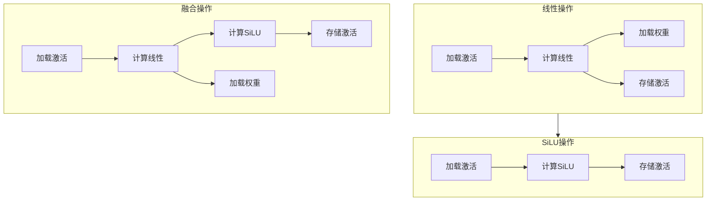
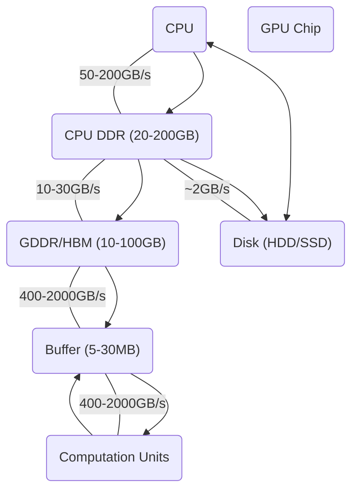

# 三、Compiler/System Optimization (Sec.5)

在对大型语言模型（LLMs）进行模型压缩和算法优化之后，接下来的步骤是在硬件设备上编译和部署它们。为了确保LLMs的有效推理，可以采用多种编译器优化技术。此外，鉴于LLMs规模的不断扩大，可能需要多个硬件设备来部署和执行，从而形成一个复杂的推理基础设施系统。因此，为了实现高效推理的系统级优化已成为一个热门话题。本节将探讨一些广泛使用的编译器优化和技术，包括运算符融合、内存管理、工作负载卸载以及并行服务。

## 1. Operator Fusion (Sec.5.1)

算子融合是深度学习框架中一种重要的编译时优化技术，旨在提升计算效率。它将计算图中直接相连的多个算子或层合并在一起，从而消除了冗余的数据移动和中间表示。例如，一个线性运算算子紧接一个SiLU（Sigmoid-weighted Linear Unit）运算算子可以融合成单一的运算算子。如图14所示，这样就避免了在每个运算算子之间存储和加载中间激活值的需求，减少了内存消耗和内存访问次数。

如图15所示，Roofline model（roofline model）表明，算子融合能增加算术强度，并在内存受限区域提高推理性能。然而，当算子已经处于计算密集型区域时，内存融合提供的益处就微乎其微了。

图14展示了线性运算符之后紧接SiLU运算符的操作融合演示。

图15. 运算融合中内存受限情况与计算受限情况的演示。

图16显示了FlashAttention在Nvidia A6000上的内存访问减少和推理时间减少情况。

尽管操作融合在很多情况下能带来显著的性能提升，但它并不适用于所有操作。对于某些操作而言，操作融合可能是不可行或无益的。具体原因包括：

1.  **操作融合要求被融合操作的中间结果不会被计算图中的其他部分所用**。如果后续操作依赖于某个中间操作的输出，那么在不引入额外复杂度或重复计算的情况下，融合就无法实现。
    
2.  **操作融合可能会增加融合后操作所需的片上缓冲区容量**。如果可用的片上缓冲区资源有限，可能就无法实现某些操作的融合。
    
3.  **一些框架或硬件架构可能对可融合的操作有限制或特定要求**，这取决于它们的实现细节。这意味着并非所有操作都能够自由地进行融合。
    

综上所述，尽管操作融合是一种有效的优化手段，但在实际应用中需要综合考虑上述因素，以确定其适用性和可行性。

一些编译工具，如TVM   Chen等人能够识别可以融合在一起的运算符并用融合运算符替换它们。然而，对于大型语言模型（LLMs），自动检测和融合运算符既不必要又复杂，因为LLMs具有固定的架构。相反，可以使用特定的融合模式来提高效率。例如，注意力机制是LLMs的一个核心组成部分。自动融合注意力机制对于编译工具来说可能是一项复杂的任务。FlashAttention  Dao, 2023, Dao等人和Flash-Decoding  Dao等人提出了将自注意力中的矩阵乘法和softmax运算融合为一个运算符的方法。这种融合技术免除了存储和加载中间注意力矩阵的需要，当序列长度或批次大小较大时，这个矩阵可能会非常大。如图16所示，将它们融合可以显著减少内存访问和推理时间。我们可以观察到prefill阶段和decode阶段之间存在差异。在decode阶段，内存访问减少与推理时间减少相当。然而，在refill阶段，推理时间的减少低于内存访问的减少。这是因为prefill阶段中的一些操作是计算密集型的，所以通过运算符融合减少内存访问带来的好处有限。

DeepSpeed推理  Aminabadi 等人引入了一种称为深度融合（Deep-Fusion）的技术。它专门融合了变换器层中的四个主要区域：QKV矩阵乘法与输入层规范化；转置与注意力操作；注意力后的层规范化与中间矩阵乘法；以及偏置添加与残差添加。xFormers  Lefaudeux 等人提供了多种融合内核，可以提升变换器的性能。这些包括融合的softmax、融合的线性层、融合的层规范化以及融合的SwiGLU。TensorRT-LLM  Vaidya 等人是另一个框架，提供了广泛的高性能融合内核。它包含了一个强大的模式匹配算法，能够检测各种大规模语言模型（LLMs）中的潜在融合机会。

除了内核融合之外，我们还可以通过进一步优化操作符的实现来增强LLM的性能。例如，FlashDecoding++  Hong等人提议使用异步softmax和带有双缓冲的扁平化GEMM优化来提高效率。

图17. 在典型的计算机体系结构中，内存系统由不同类型的内存空间组成。

图18. 不同卸载设置下的 Roofline model 

## 2. Memory Management (Sec.5.2)

当使用大型语言模型（LLM）生成响应时，每次输入和输出的令牌数量可能会有所不同。用户的输入提示长度可能变化，这会影响到预填充阶段序列的长度。此外，在解码阶段，随着令牌的生成，序列长度会逐步增加。这意味着激活的形状不像普通神经网络中那样固定。如何在张量大小变化时有效地管理内存是一个问题。PagedAttention Kwon等人通过将键值缓存（KV缓存）划分为块来高效处理这一问题。每个序列的KV缓存被分成多个块，每个块包含固定数量的令牌的键和值。为了管理这些块，使用了一个表来映射序列的逻辑块到GPU内存中的物理块。这种映射类似于CPU内存管理系统中虚拟内存的工作方式。

当图形处理器（GPU）的内存容量有限，而网络模型太大无法完全载入时，可能需要采取工作负载卸载策略，将网络存储在其他内存空间中。如图17所示，计算机系统包含多种内存类型，包括CPU的DDR内存、GPU的GDDR/HBM内存以及硬盘。然而，这些不同的内存空间具有不同的数据访问带宽。图18说明了这样一个情况：当数据被卸载到CPU的DDR内存中，并在需要时传输到GPU进行计算时，其表现优于直接在CPU上执行计算。当批次大小足够大时，算术强度显著增加，使GPU能够充分利用其计算能力，从而达到良好的性能效果。

DeepSpeed-Inference框架 Aminabadi等人引入了ZeRO-Inference技术，该技术将大型模型的权重卸载到CPU内存中。由于较大的批次大小增加了计算需求，使得计算延迟与模型权重加载的延迟重叠，因此在处理大批次时该机制表现优异，整体效率得到提升。Huggingface Accelerate工具 HuggingFace，2022\]也具备类似功能，如果GPU空间不足以存放整个模型，它能将某些模块移至CPU或磁盘上。FlexGen框架 Sheng等人提供了一种方法，可在考虑GPU、CPU和磁盘等硬件资源限制的情况下，探索不同的计算卸载方式。为了找到最高吞吐量的最佳策略，FlexGen采用基于线性规划的搜索算法。Alizadeh等人则利用了闪存相较于DRAM更大的容量优势，通过将模型参数高效地存储在闪存中，并在需要时转移到DRAM中来执行推理任务。

## 3. Parallel Serving (Sec.5.3)

并行服务处理同时到达服务器的多个用户请求。其目标之一是快速响应每个请求。为了实现这一目标，我们需要减少响应每个用户的耗时，即响应延迟。另一个需要考虑的重要因素是吞吐量，它是指服务器在规定时间内能够处理的请求数量。通过提高服务器的吞吐量能力，我们可以同时服务更多用户，从而提升整个系统的性能。增加服务器的吞吐量意味着可以更高效地服务用户，进而改善系统性能。服务系统应优化以最大化吞吐量，同时确保响应延迟保持在可接受范围内。批处理是一种基本方法，通过同时处理多个用户请求来提高吞吐量。

图19显示，在解码阶段增加批次大小显著提高了吞吐量。然而，增大批次大小可能会增加响应延迟和内存消耗。为此，已经提出了多种技术来优化批处理方法。例如，ORCA  Yu等人引入了连续批处理（也称为迭代或滚动批处理），将不同用户的推理合并。SARATHI  Agrawal等人则采用了分块预填充和解码最大化批处理。它将预填充块和解码请求组合成批次，这增加了算术强度并提升了吞吐量。同样，DeepSpeed-FastGen  和LightLLM也采用了分割与融合技术。

图19. 并行服务设置对Nvidia A6000 GPU（Llama-2-13b）的吞吐量、延迟和内存使用有影响。

## 4. Workload Offloading (Sec.5.2)