# 三、Model Compression


大型语言模型（LLMs）的庞大尺寸和计算需求给实际部署带来了重大挑战，尤其是在资源受限的环境中。为了缓解这些限制，最直接的解决方案是压缩LLMs。在本节中，我们将回顾针对LLMs的神经网络压缩概念。这一探索将涵盖对已建立技术的深入审查，包括但不限于量化、剪枝、知识蒸馏和低秩分解。在每个子部分中，我们将使用LLM-Viewer来分析网络压缩对LLM推理的影响。根据我们的分析，我们将提供优化建议。

## 1. Pruning (Sec.3.2)

研究人员发现，神经网络模型往往存在过参数化现象，即模型中包含可以被去除的冗余权重。本章主要聚焦于权重剪枝方法，即识别并删除模型中的冗余权重。

从优化问题定义和求解的视角来看，模型剪枝可被视为解决优化问题。模型剪枝的问题定义是：寻找最优的模型子结构a\*和相应的权重w\*，以在特定约束条件下，最优化剪枝后模型的性能。优化空间主要包含两部分：剪枝后模型的结构空间${A(\boldsymbol{\alpha^{\*}}\in A)}$ 和剪枝后模型的权重空间 $W \left( \omega^{\*} \in W \right)$。优化目标是尽量降低剪枝所造成的任务性能损失。约束条件可能包括硬件指标（如延时、功耗）或与推理效率相关的代理指标（如参数量、计算量）。

模型剪枝要决定删除哪些权重单元，即在结构空间中找到解 $\alpha^{\*} \in A= \left \{ 0,1 \right \}^{N}$其中N表示权重单元的数量。权重单元的大小被称为“粒度”。对于卷积神经网络，模型剪枝采用的权重单元有以下5种典型的粒度。

（1）层级（Layer）粒度：如图所示，以单个卷积层为最小单元。

（2）滤波器（Filter）粒度：如图所示，以单个滤波器为最小单元。单个滤波器由多个二维的卷积核组成。删除某层的一个滤波器等价于删除对应的输出通道。

（3）形状（Shape）粒度：如图所示，在同一个滤波器中，将所有通道内相同空间位置的权重作为最小单元。

（4）通道（Channel）粒度；如图所示，以输入通道为最小单元，删除某一层的输入通道等价于删除前一层的输出通道，即删除前一层对应的滤波器。

（5）权重（Weight）粒度：如图所示，以单个权重为最小单元。权重粒度也是最细的剪枝粒度。

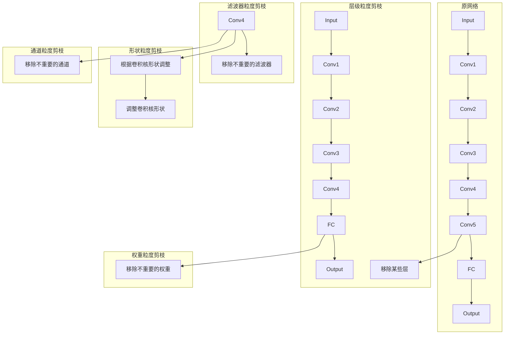

图 4.1 卷积神经网络中不同的剪枝粒度示意图

根据权重单元的粒度及其是否结构化，可以将剪枝方法的稀疏模式分为以下三类。

（1）粗粒度结构化稀疏模式：采用这类稀疏模式的剪枝方法简称〝结构化剪枝”。剪枝采用的权重单元粒度较粗，包括通道、形状、滤波器和层级等粒度。例如，常见的滤波器粒度的结构化剪枝会减少模型中各层的滤波器数量，同时相应地减少下一层的输入通道数量。与后两类稀疏模式相比，采用这类稀疏模式的剪枝方法的压缩率较低。因为其稀疏性具有结构化规律，所以通常无须专用的软硬件设计就能将其压缩率转化实际的硬件加速效果。

（2）细粒度非结构化稀疏模式：采用这类稀疏模式的剪枝方法简称“非结构化剪枝”或“稀疏剪枝”。剪枝采用的权重单元粒度权重粒度，粒度最细。与结构化剪枝相比，这类剪枝方法通常能获得较高的压缩率，大幅減少模型权重的存储需求。然而，这类稀疏模式的稀疏性不具有结构化规律，会在推理过程中引起不规则的访存与计算，使压缩率难以转化为推理加速效果。

非结构化剪枝往往需要专用的软硬件设计，以提高对非结构化数据的处理效率。

（3）细粒度结构化稀疏模式：采用这类稀疏模式的剪枝方法简称“半结构化剪枝”。剪枝采用的权重单元粒度同样为权重粒度。这类稀疏模式的核心思路是对权重进行结构化分组，并在分组内部采用非结构化稀疏模式。与细粒度非结构化稀疏模式相比，由于其结构化分组的特性，这类稀疏模式引入的访存和计算模式更规则，这使得采用这类稀疏模式的推理过程更易于在软硬件上实现高效处理。例如，NVIDIA 的安培架构 GPU 等硬件平台能支持对细粒度结构化稀疏数据的高效处理。

本章主要以卷积神经网络为例，介绍主流的模型剪枝方法。图4.2展示了模型剪枝方法研究的主要细分领域。以 LWC、Deep Compression 等为代表的早期的非结构化剪枝工作，展示出模型剪枝具有显著降低模型计算量和参数量的潜力；SSL、ThiNet、AMC 等工作关注结构化剪枝方法，并探索了基于权重正则与基于搜索的两类结构化剪枝流程。此外，低秩分解的思想与结构化剪枝有类似之处。低秩分解可被看作在张量分解后的空间进行“的杖”，删除冗余分量，得到的矩降是对原矩阵的低秩近似。这类方法的代表性工作包括BLstPmFT-CPN、Onc-ShotN等。半结构化剪枝结合了结构化剪枝和非结构化剪枝的优势，在维持较高任务性能的同时获得了更高的压缩比和加速比。它的代表性工作有 ESE、ASDNIN，DFSS等。

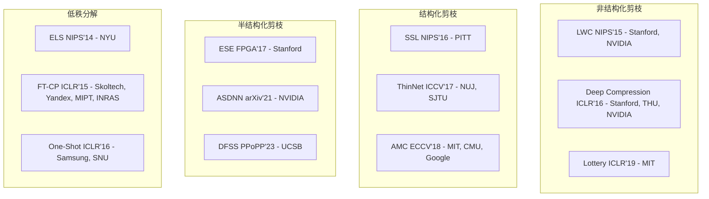

图 4.2 模型剪枝方法研究的主要细分领域

本章将按以下顺序介绍各种方法。4.2节将介绍模型敏感度分析方法，用于识别模型中的冗余结构。它们被广泛应用于各类剪枝方法中。4.3节将详细介绍结构化剪枝方法，主要包括基于权重正则的结构化剪枝方法与基于搜索的结构化剪枝方法，以及在给定资源限制的条件下的结构化剪枝方法。4.4 节将介绍近似低秩分解方法。4.5节将通过典型的例子简要介绍非结构化剪枝方法。4.6 节将介绍半结构化剪枝方法。除了权重剪枝，4.7 节将介绍针对激活值的剪枝方法。为了给读者提供直观实用的帮助，4.8 节将总结模型剪枝的经验。4.9节将给出 Group Lasso 结构化剪枝的实践案例。

### 模型敏感度分析方法

#### 层内和层间敏感度分析

为了识别模型中的冗余权重，模型剪枝方法需要对模型进行敏感度分析。敏感度分析方法评估删除某个或某些权重单元对模型任务性能的影响。具体而言，如果删除某些权重单元对模型的任务性能影响较大，那么这些单元的敏感度较高，应该被保留；反之，某些权重单元的敏感度较低，可以被删除。

然而，对所有权重单元进行敏感度分析，需要进行大量的模型任务性能测试，消耗大量资源，为了降低剪枝过程的开销，现有方法通常将结构 ∞分解为层间与层内两个维度进行敏感度分析，这样可以显著降低模型剪枝方法中敏感度分析的复杂度，提高模型剪枝的效率。

图4.3为层内和层间敏感度分析在模型剪枝中的用途。其中，图4.3（a）为待剪枝模型，它包含三个级联的卷积层及一个跳跃连接。图 4.3（b）使用层间敏感度分析确定模型各层的敏感度，依据各层的敏感度为各层分配压缩率。例如，因模型第二层的敏感度较高，所以仅删除其 20%的权重。注意，只有 4.3.2 节介绍的离散搜索剪枝显式地进行了层间敏感度分析。图4.3（c） 使用层内敏感度分析确定层内各权重单元的敏感度，并保留敏感度较高的权重单元。

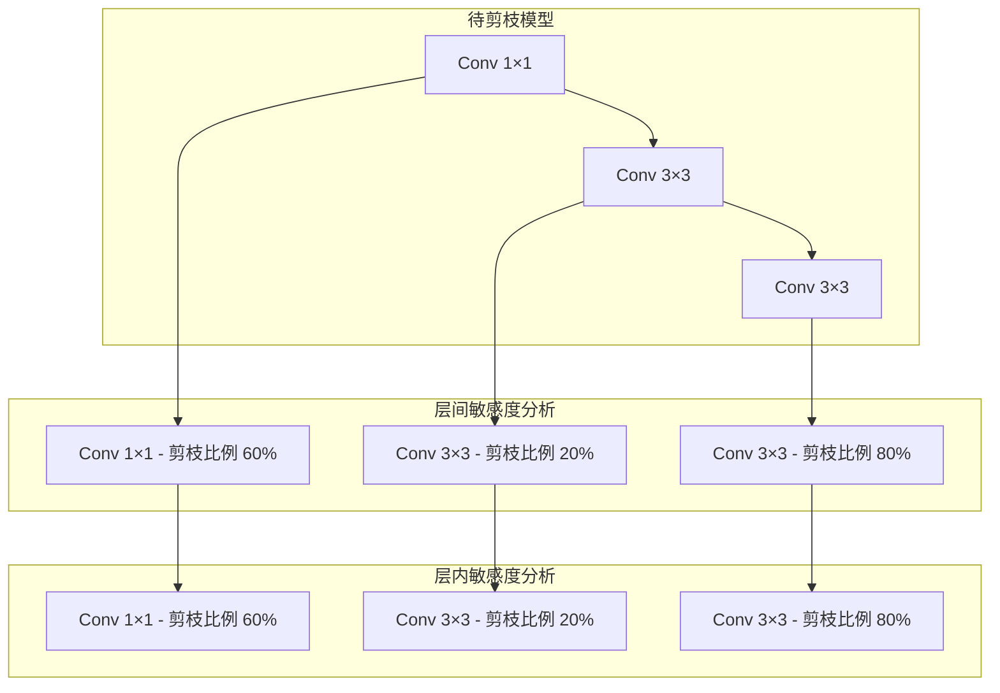

图 4.3 层内敏感度分析和层间敏感度分析

#### 层内敏感度分析指标

如图 所示，层内敏感度分析被用于评估层内各权重单元的敏感度，作为模型剪枝保留单元的依据，敏感度指标可以按照是否需要数据被划分为数据驱动和非数据驱动两类。数据驱动类敏感度指标需要使用输入数据计算，如权重二阶导数、通道激活概率、激活重建误差。非数据驱动类敏感度指标仅需要权重本身而不需要输入数据，如权重的p-范数、权重多样性、批标准化层的缩放值。上述各敏感度指标的具体细节如下。

（1）权重二阶导数：利用权重的二阶导数推导出删除各权重单元后损失函数的增量，删除使损失函数增长较小的权重单元。

（2）权重的p-范数（1-范数、2-范数等）：将权重的p范数作为敏感度指标，删除 范数较小的权重单元。

（3）权重多样性：目的是保留更具多样性的权重单元子集。通常，将各权重单元与权重单元“质心”的距离作为敏感度指标，删除距离质心较近的滤波器。例如，代表工作 FPGM931 关注滤波器粒度权重单元的多样性指标。FPGM 认为，越是靠近全体滤波器几何中心的滤波器，其功能越容易被其他滤波器代替，可以被优先剪枝。

（4）批标准化层的$gama$值：将批标准化层线性变换的放缩系数值$gama$作为敏感度指标，删除对应的放缩系数较小的权重单元。

（5）通道激活概率：利用待剪枝模型进行部分数据推理，统计每个通道的激活率（非0数据的比例）并将其作为敏感度指标，删除激活率较低的通道。

（6）激活重建误差：计算删除某权重单元后的输出与待剪枝模型输出的误差，删除误差较小的权重单元。

值得注意的是，若使用充足的数据来微调或重新训练剪枝后的模型，上述层内敏感度指标一般无明显效果差距。

表4.1总结了部分结构化剪枝工作所使用的层内敏感度指标与剪枝流程。虽然各类剪枝流程几乎均会使用一种层内敏感度指标，但是使用的方式略有不同。基于权重正则的剪枝方法、离散搜索剪枝方法、可微分搜索剪枝方法对层内敏感度指标的使用方式如下。

（1）基于权重正则的剪枝方法：在训练模型时，将层内敏感度指标作为正则项引入损失函数。在训练的过程中，正则项会将模型中部分权重置为0。

（2）离散搜索剪枝方法：迭代进行层内敏感度分析和层内剪枝。前者为每一层分配压缩率，后者根据层内敏感度指标将每一层剪枝到分配的压缩率。

（3）可微分搜索剪枝方法：通常，不预设敏感度指标，而是将每个权重单元的敏感度作为可训练参数，通过梯度下降算法训练得到权重单元的剪枝决策，即“等效敏感度”。

表4.1 部分结构化剪枝工作所使用的层内敏感度指标与剪枝流程

| 工作 | 层内敏感度指标 | 是否数据驱动 | 剪枝流程 |
| --- | --- | --- | --- |
| OBD | 权重二阶导数 | 是 | 退化的离散搜索 |
| Group Lasso | 权重1-范数 | 否 | 权重正则 |
| AMC | 权重1-范数 | 否 | 离散搜索 |
| MorphNet | 权重1-范数 | 否 | 权重正则 |
| Lebedev et. al. | 权重2-范数 | 否 | 权重正则 |
| NetAdapt | 权重2-范数 | 否 | 离散搜索 |
| FPGM | 权重多样性 | 否 | 离散搜索 |
| VCP | 批标准化的γ值 | 否 | 离散搜索 |
| DSA | 批标准化的γ值 | 否 | 可微分搜索 |
| APoZ | 通道激活概率 | 否 | 可微分搜索 |
| ThiNet | 激活重建误差 | 是 | 离散搜索 |

### (1) Structured

结构化剪枝会移除整个神经元或层，从而得到更干净、更规则的结构。经过剪枝的模型通常与传统硬件的兼容性更好，但这种简化和规则化的代价是：这种形式的剪枝可能对模型性能有更显著的影响，因为它涉及到移除更大、可能更重要的组件。LLM-Pruner 等人在大型语言模型（LLMs）的结构化剪枝方面代表了一种开创性的方法。它采用了一次性剪枝技术，该技术依赖于一阶和估计的Hessian数据，并需要随后使用LoRA进行微调以恢复权重。这项工作的优势在于，它显著降低了计算需求和内存要求，同时保持了LLMs的基本结构。Sheared Llama Xia等人提出了另一种值得注意的解决方案，通过将有针对性的结构化剪枝与动态批次加载算法相结合。首先，它通过分析预训练模型的配置，仔细地将源模型剪枝成所需的目标架构。然后，通过动态批次加载算法提高训练效率，该算法调整来自不同领域的训练数据比例。Compresso Guo等人建立了一个协作学习框架，其中LLM与一个资源高效的剪枝算法协同工作，能够将Llama-7B剪枝至5.4B参数量，同时保持原始性能不变。

结构化剪枝方法主要在层和滤波器这两个粒度上进行剪枝。与非结构化剪枝相比，结构化剪枝的压缩率通常较低。结构化剪枝的优势在于，剪枝后的 模型仍然保留了稠密的矩阵一矩阵乘法，这使得模型可以直接在支持稠密计算的高效通用处理器上运行，如GPU。因此，结构化剪枝能够更容易地将压缩率转化为实际加速，这使其在学术界和工业界都受到广泛关注。

本节将从优化问题定义和求解的角度，介绍各类常用的结构化剪枝方法。现有的工作主要分为如图4.4所示的两大类。第一类方法仅显式地优化模型权重w，非显式地优化模型架构参数 Q，如图 4.4（a）所示。这类方法不会显式地评估层间敏感度，而是在确定了权重数值之后，基于层内敏感度指标移除部分权重单元。第二类方法则同时优化模型权重c和模型架构参数c，如图 4.4（b）所示。

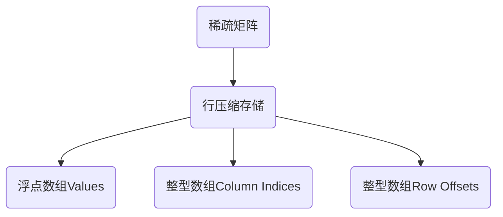
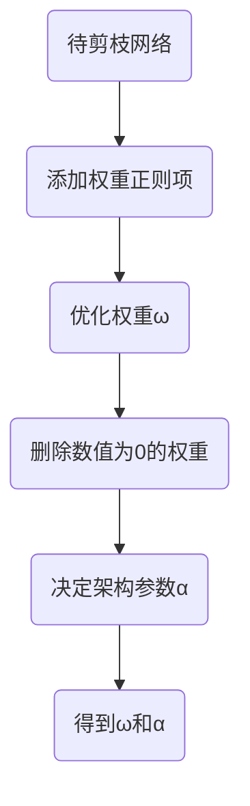
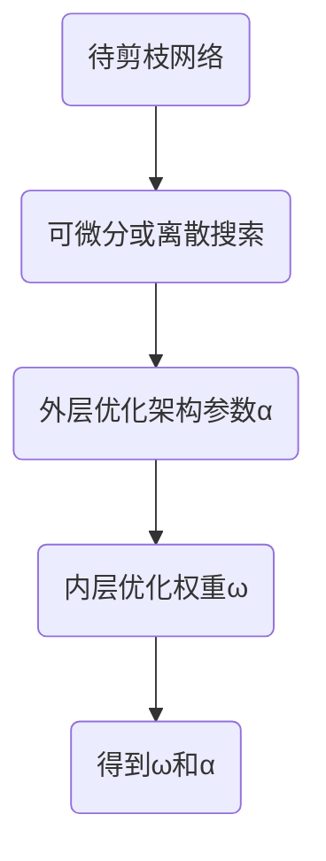

图 4.4 两类结构化剪枝流程示意图

本节的内容安排如下。4.3.1 节将介绍基于权重正则的结构化剪枝方法，这类方法非显式地建模和优化模型架构参数 ∞。4.3.2 节将介绍基于搜索的结构化剪枝方法，包括离散搜索和可微分搜索，这类方法显式地建模并优化模型架构参数 c。4.3.3 节将介绍在给定资源限制的条件下，如何运用基于权重正则和基于搜索的方法进行结构化剪枝。

#### 基于权重正则的结构化剪枝方法

权重正则方法是机器学习中常用的技术。常见的权重正则方法包括基于 1-范数的 Lassol99）和基于 2-范数的岭回归（Ridge Regression）190。其中，岭回归对于大幅值权重的惩罚力度大，对于小幅值权重的惩罚力度小，不倾向于把小幅值权重拉到0，因此难以学习稀疏分布的权重；

而 Lesso 对于不同幅值大小的权重的惩罚力度一致，因此更容易学习稀疏分布的权重。对损失函数加入权重正则项，优化模型权重w得到稀疏模型，其流程如下。

（1)训练开始前，將一个设计好的权重正则项引入损失函数，权重正则项通常根据模型的层内敏感度指标进行设计。

（2） 训练过程中，优化带有权重正则项的损失函数，权重正则项会将部分权重优化为口或接近 0。

（3）训练结束后，将等于0或接近0的权重删除，即得到剪枝后的模型。这类方法对应的优化问题如式 4.1所示。

$\boxed{\boldsymbol{\omega}^{\*}=\operatorname\*{arg min}\_{\boldsymbol{\omega} \in W}\left\[\mathcal{L}(\boldsymbol{\omega})+\lambda R(\boldsymbol{\omega}) \right\]}$

其中，L表示任务损失函数（如分类任务中常用的交叉熵损失函数），R 表示权重正则项，入表示权重正则项的加权系数，w表示模型的权重，w\* 表示训练得到的最优权重，W 表示权重空间

本节将以 Structured Sparsity Learning2（简称SSL）为例，介绍权重正则项的设计思路具体来说，SSL 引入权重正则项构造了如式4.2 所示的优化目标：

$\bm{\omega}^{\*}=\operatorname\*{arg min}\_{\bm{\omega}\in W}\left\[\mathcal{L}( \bm{\omega})+\lambda\_{\text{g}}\cdot\sum\_{l=1}^{L}R\_{\text{g}}(\bm{\omega}^{(l )})\right\]$

其中，4表示模型的权重，表示任务的损失函数，L表示模型的总层数，1表示模型的层索引，入g表示权重正则项的加权系数，Rg（.）表示正则函数。具体来说，SSL 选择将结合 1-范数和2-范数的 Group Lasso100作为正则函数Rg（.），如式4.3 和式4.4所示。

$\begin{split} R\_{\mathsf{g}}(\bm{\omega})&=\sum\_{ \bm{k}=1}^{K}||\bm{\omega^{(k)}}||\_{\mathsf{g}}\\ ||\bm{\omega^{(k)}}||\_{\mathsf{g}}&=\sqrt{\sum\_{ \bm{i}=1}^{N(\bm{\omega^{(k)}})}(\omega\_{\bm{i}}^{(k)})^{2}}\end{split}$

其中，c（）表示第k个权重组，N（c（h）表示权重组w（）中权重组的数量，K表示权重组总数。

由式4.4可知，Group Lasso 计算权重组内所有权重的2-范数；由式4.3 可知，Group Lasso 对所有权重组的2-范数求和，由于每个权重组的 2-范数都是非负数，这个求和操作等价于对所有权重组的2-范数求1-苑数。因此，Group Lasso 会鼓励部分权重组的 2-范数被训练过程置0，即这些权重组内的权重全部为0。

权重的分组方式具有很离的灵清性。针对不同的应用需求，用户可以设计更合适的权重分组策略。如图 4.5 所示，Group Lasso 可以灵活地对通道、滤波器、形状、层等不同粒度的基本单元进行剪枝。以通道和滤波器粒度的结构化剪枝为例，假设 wf9.是第1层中的第m个滤波器，c0%：是第1层中每个滤波器的第 c 个输入通道，可将 SSL 的目标函数改写为式4.5：$\bm{\omega}^{\*}=\operatorname\*{arg min}\_{\bm{\omega}}\left\[L(\bm{\omega})+ \lambda\_{n}\cdot\sum\_{l=1}^{L}\left(\sum\_{n\_{l}=1}^{N\_{l}}||\bm{\omega}\_{n\_{l},:,:,:}^{(l)}||\_{\mathsf{g}}\right)+\lambda\_{c}\cdot\sum\_{l=1}^{L}\left(\sum\_{c\_{ l}=1}^{C\_{l}}||\bm{\omega}\_{:,c\_{l},:,:}^{(l)}||\_{\mathsf{g}}\right)\right\]\qquad \text{ (4.5)}$


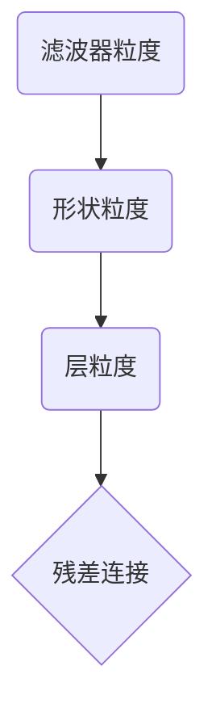

图 4.5 Group Lasso 可支持不同粒度的结构化剪枝

#### 基于搜索的结构化剪枝方法

不同于基于权重正则的结构化剪枝方法，基于搜索的结构化剪枝方法不仅优化模型权重心，而且在优化模型权重c的外层嵌套了对模型架构参数o的优化。一般来说，这个双层（Bi-Level）优化问题可表示式4.6所示形式：

$\begin{split}\bm{\alpha}^{\*}&=\operatorname\*{arg max}\_{\bm{\alpha}\in A}R(\bm{\omega}^{\*}(\bm{\alpha}),\bm{\alpha})\\ \text{s.t.}\quad\bm{\omega}^{\*}(\bm{\alpha})&= \operatorname\*{arg min}\_{\bm{\omega}\in W}\mathcal{L}(\bm{\omega},\bm{\alpha} )\\ \mathcal{F}(\bm{\alpha})&\leqslant B\_{\mathcal{F}} \end{split}\qquad\qquad\qquad\qquad\qquad\qquad$

其中，a\*表示待求解的最优架构参数，R代表任务性能指标（如分类任务的准确率），£代表任务损失函数（如分类任务的交叉熵损失函数），w\*（a）代表架构参数。最合适的权重，通过内层的权重优化问题求解得到w\*（a）=aIg min wew C（w, a）。另外，这类方法显式地优化架构参数Q，因此，优化问题加入与 a 相关的其他限制条件是非常自然的，如式4.6中的F（a） ≤B5，F（a）是一个与 a 相关的指标，可以是模型复杂度（如参数量、计算量）或实际推理性能（如延时，能耗等），Br 为该指标的资源限制。

式4.6的剪枝优化问题中 B（a）= R（w\*（a）， a）的评估过程涉及一个复杂的求解w\*的内层优化问题。因此，该优化问题难以被闭式建模并求解，它属于一个黑盒优化问题。黑盒优化问题最常见的求解方法是，采用一系列基于离散搜索的策略。此外，不少工作尝试使用可微分的代理损失函数 代替上述优化问题的B，对内层的权重优化问题进行近似或者直接将该双层优化问题转化成单层（One-Level）优化问题，并将离散的架构参数 c 松弛至连续空间品，用梯度的方式更新 a。借鉴 模型架构搜索领域的术语，这类基于梯度优化的剪枝方法可被看作一种用“可微分搜索策略”探索离散搜索空间的方法。本节将基于离散搜索策略的方法和基于可微分搜索策略的方法统称为基于搜索的方法，并举例介绍这两类方法。

基于搜索的结构化剪枝方法会显式地优化模型的架构参数c。常用的对架构进行参数化的方式有如下两种。

（1）剪枝率（Pruning Ratio）：被删除的权重数占权重总数的比例。当前的工作通常以层级为粒度分配压缩率，典型的工作有AMCI7、DSABI、ECCLOIl 等。压缩率通常仅用于层间敏感度分析。在确定了每一层的压缩率之后，通常需要利用某种层内敏感度指标来决定哪些权重应该被保留。

（2） 二值掩码（Binary Mask）：为每个权重单元分配一个二值掩码，其中，掩码为1表示

保留该权重单元；掩码为0表示删除该权重单元；典型算法有 VCPB7、BAR/1021 等。使用二值掩码可以同时进行层间和层内敏感度分析，并且可以直接根据掩码值进行剪枝，无须再根据特定的层内敏感度指标进行剪枝。

```plaintext
1:Model：已经训练好的原始模型
2: No：外层循环次数
3:N：内层循环次数
4:a：各层的压缩率配置
5:Controller：控制器，相当于剪枝操作的核心搜索策略
6: Evaluater:
评价器，负责对当前压缩率配置下的模型进行快速性能评估
7:
8: for i = 1,2,, No do
9: for j = 1,2,•••, Ni do
10:   a = controller.sample_as（）//控制器采样一个模型结构
      acc=Evaluate（a, Model） //快速评估模型结构
      Controller.fit（a, acc） //根据快速评估的结果更新控制器
    end for 
14:a =controller.decide（） //控制器决定一个模型结构
15:Model = PruneAndFinetune（Model, a） //剪枝并微调参数
16: end for
```

1.  离散搜索剪枝方法
    

算法 4.1总结了离散搜索剪枝的通用选代流程，整个流程包含两层循环，这两层循环的区别在于评估方法。其中，内层循环采用快速评估方法预测模型的性能，评估度较低：而外层循环会训练剪枝后的模型并在测试数据集上实测模型的性能，虽然评估速度较慢，但是评估精度较高。

图4.6展示了上述离散搜索剪枝的通用迭代流程。与算法 4.1 对应，可以看到内层循环采用快速评估方法，循环次数通常较多，在103量级；外层循环的评估速度较慢，循环次数较少，在10-量级。


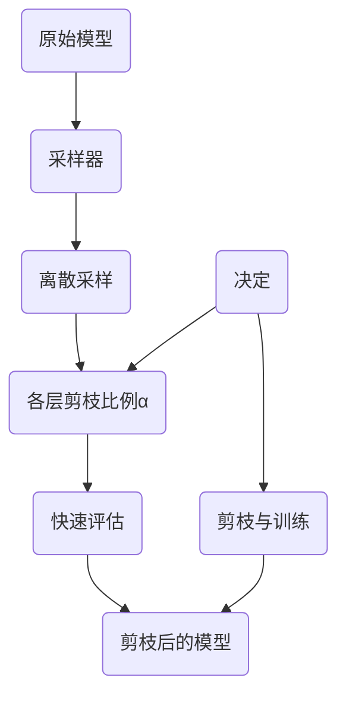

图 4.6 基于离散搜索的结构化剪枝流程示意图

表 4.2对比了典型的离散搜索剪枝方法。早期的AMC使用强化学习采样模型架构参数。另一项早期研究 NetAdapt 在每一轮迭代中采样 K个候选剪枝模型，每个候选剪枝模型均只有一个卷积层被压缩。其他研究使用启发式的局部搜索算法来搜索架构参数，如模拟退火（Simulated Annealing,SA ）和进化算法（Evolutionary Algorithm,EA），这些算法可以直接搜索多个目标并获得关于模型任务性能和压缩率的帕累托前沿。

这里以AMC为例介绍离散搜索剪枝。如图 4.7所示，AMC设计了一个控制器（DDPG），该控制器逐层采样压缩率。具体来说，控制器会接收待剪枝层的状态向量，并基于当前层的状态采样压缩率。在控制器完成所有层的压缩率采样后，就会根据层内敏感度指标对各层进行剪校。在训练阶段，AMC 会对剪枝后的模型进行快速评估并生成一个奖励信号。随后，AMC使用 DDPG105］ 强化学习算法根据奖励信号更新控制器的权重。


| Algorithm Component | AMC | NetAdapt | Auto-Compress | MetaPruning |
| --- | --- | --- | --- | --- |
| Controller.sample\_as | 使用 MLP 逐层预测 | K 个候选剪枝模型 | 模拟退火 | 进化算法 |
| Evaluate | 不微调 | 不微调 | 不微调 | 超网络 |
| Controller.fit | 强化学习 | — | 接受决定 | 种群更新 |
| Controller.decide | 使用采样器选择 α | 取最高精度的模型 | 模拟退火过程中发现的 α | 取种群中最高精度的 α |
| PruneAndFinetune | — | 剪枝后长时间微调 | ADMM 求解后微调 | — |
| Nₒ | 1 | \> 1 | \> 1 | 1 |
| Nᵢ | \> 1 | \> 1 | \> 1 | \> 1 |

表4.2 离散捜索枝方法対比

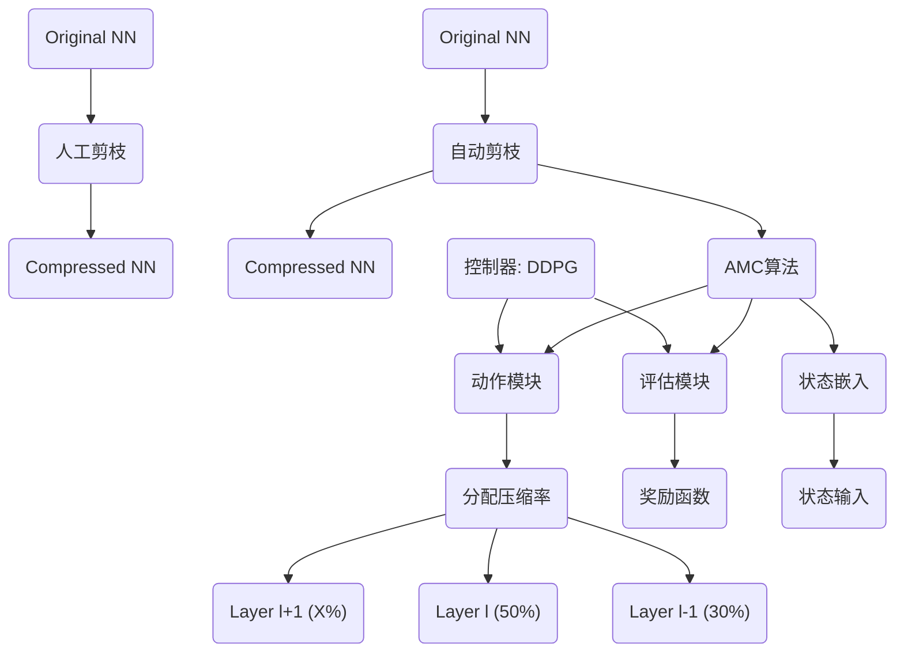

图 4.7 AMC算法的训练流程示意图

本节重点介绍 AMC对强化学习中状态空间、动作空间及奖励函数这三大组成部分的设计，它们分别对应了算法 4.1中控制器的输入、模型架构参数c的搜索空间 A、更新控制器所需的评估信息。

1）对状态空间的设计

每一层的状态向量为式4.7 所示的11维向量：

$\boldsymbol{s}\_{t}=(t,n,c,h,w,\text{stride},k,\text{FLOPs}\[t\],\text{reduced}, \text{rest},a\_{t-1})\qquad\qquad\qquad\quad$

其中，t表示当前层的层索引，n表示当前层滤波器的输出通道数，c表示当前层滤波器输入通道数，h和w表示当前层输入张量的维度，k表示当前层滤波器的大小，stride 表示当前层滤波器的步长。n×cxkxk 表示当前层中滤波器的超参数，c×w×h 表示当前层的输入张量维度，FLOPslt表示当前层的计算量，reduced 表示已经降低的总计算量，rest 表示待剪枝层中剩余的计算量，ot-1表示前一层的压缩率。在将状态向量输入控制器之前，AMIC 将所有参数归一化到（0，1\]

2）对动作空间的设计

AMC 控制器在某层所采样的动作被当作当层的压缩率。AMC 使用细粒度的动作空间，即压缩率 a E（0,1］。

3）对奖励函数的设计

AMC 针对两类场景的奖励函数设计。

（1）在资源有限的场景，如手机应用程序和自动驾驶车辆中，重点在于，在给定的资源约束下，通过剪枝提高模型的任务性能。为此，研究者构建了一个奖励函数来优化这一过程。

$R\_{err}=-Error    \left    (   4.8 \right)$

其中，Error 为错误率。可以发现，奖励函数不鼓励控制器降低模型权重，专注于保持模型的高精度。AIC通过限制动作空间大小的方式来满足资源限制。限制动作空间大小的含义为：当发现用最大的压缩率压缩后续所有层也无法满足限制条件时，AMC就会限制当前层的压缩率，使剪枝后的模型满足限制条件。

（2）保证任务性能的剪枝：常见的应用场景有图像去噪等。在这类场景中，用户关注的是，在保障任务性能不下降的前提下，尽可能减少模型的计算量和参数量。这类场景通常不会设置资源限制。AMC设计出了如下奖励函数：

$\left\{\begin{array}{l}R\_{\text{FLOPs}}=-\text{Error}\cdot\text{log(FLOPs)}\\ \\ R\_{\text{Param}}=-\text{Error}\cdot\text{log(\#Param)}\end{array}\right.\qquad \qquad\qquad\qquad\qquad\qquad$

其中，FLOPs表示模型的计算量，#Param 表示模型的参数量。一方面，这两个奖励函数均对Brror 敏感，鼓励控制器采样高精度模型；另一方面，分别将减少计算量、参数量这一目标引入奖励函数中，鼓励控制器降低硬件开销。

#### 2. 可微分搜索剪枝方法

不同于离散搜索剪枝方法，可微分搜索剪枝方法将式4.6中的双层优化问题转化成单层优化问题，并将离散的模型架构参数o放松至连续空间 进行求解。在不考虑资源限制的情况下，可以将式 4.6 的优化问题转化式 4.10的：

$\tilde{\bm{\alpha}}^{\*},\bm{\omega}^{\*}=\operatorname\*{arg min}\_{\tilde{\bm{ \alpha}}\in A,\bm{\omega}}\mathcal{L}(\tilde{\bm{\alpha}},\bm{\omega})\qquad \qquad\qquad\qquad\qquad\qquad\qquad(4.10)$

其中，该优化问题的自变量。和w分别表示模型架构参数和模型权重，其优化空间均为连续空间。因此，优化目标可微分，能够使用梯度下降算法求解。

本节以 BARI102） 为例介绍可微分搜索剪枝的基本流程。假设 hi是第1层模型的输出特征图，BAR 会为其分配一个二值掩码 21，其长度等于 h的通道数，将21与h.逐通道相乘，即可将部分通道置为0。这一过程可以写为式4.11：

$h\_{l}=h\_{l} \odot z\_{l} \left( 4.11 \right)$

具体来说，BAR 假设某一层中，每个可学习二值掩码 2 服从伯努利分布q（z④），其分布参数 ④，可以在训练模型时学习。通过梯度更新 中，模型可以学习到哪些通道应该删除，哪些应该保留。然而，从分布q（z亚）中采样的操作是不可微分的。BAR 利用重参数化技巧106，107将 z1 的采样操作转化为可微分的数学计算g（亚1，©），其输入为服从均匀分布2（0, 1）的随机变量e和待学习参数 。此时，式4.11可写作$h\_{l}=h\_{l} \odot g \left( \Phi\_{l}, \epsilon \right)$

不同于 BAR 中使用的逐通道二值掩码，还有一些工作使用压缩率a来显式参数化模型架构，例如DSABH。DSA 设计了一个方法使得损失函数对于模型各层的压缩率a可微分。具体而言，与BAR类似，DSA 为模型每层引入逐通道的二值掩码以决定每个通道保留与否。不同的是，DSA 让各层的二值掩码受控于各层的压缩率 a。DSA 的可优化参数各层压缩率a。

#### 给定资源限制的条件下的结构化剪枝方法

4.3.1 节和 4.3.2 节均未考虑剪枝优化问题中的限制条件。然而，在实际应用中，这些限制条件是普遍存在的。例如，端侧设备的计算能力和存储空间是有限的，且不同任务对推理延时的要求各异。为了适应这些实际应用中的限制条件，需要求解带有约束的剪枝优化问题。许多文献中也将优化问题的限制条件称为“资源限制”。

为了求解带有资源限制的优化问题，首先需要对资源的指标进行建模描述。常见的建模方法包括使用资源的代理指标【T，8L，95，102-104、构建资源的行为级仿真模型108,109、构造资源的统计模型00，101,204等。

本节将介绍两个具有代表性的工作，它们分别在基于权重正则和基于搜索的结构化剪枝方法中加入了对资源限制的处理。

1.给定资源限制的条件下的权重正则剪枝方法

4.3.1 节介绍了基于 Group Lasso的结构化剪枝方法 SSL。这类方法没有在求解优化问题时考虑限制条件，因此，无法可控地满足给定的资源限制。Ariel Gordon 等人提出 MorphNVet，使得基于权重正则的结构化剪枝方法也能在给定资源限制的条件下可控地进行结构化剪枝。

具体来说，MorphNet 设计了如下两个步骤。

（1）模型收缩：该步骤与 SSL 基本一致，通过求解无约束条件的剪枝优化问题，利用极重正则项将部分权重（组）置为0，并删除这些权重。

（2）模型扩展：Ariel Gordon 等人使用宽度乘数（Width Mutiplier）在不超过资源限制的前提下统一扩展所有层的宽度（通道数）。一般来说，模型收缩步骤会使实际使用的资源少于实际资源限制，这种不充分利用给定资源的现象会导致次优的剪枝结果。模型扩展步骤旨在根靠实际的资源限制，尽可能地充分利用给定资源。

NorpiNet 算法的工作流罄如算法 42所示。其中，2（w）表示损失函数，9（ww）表示故動正则项，F（表示衡量模型资源消耗的函数，0表示的校后模型各层的觉逛，日表示模的扩限生骤的鲍度系数，6表示资源限制。MorpANet 通过交替进行模型收缩和模型扩展，不前进代以生成满足發源限樹的剪枝模型。算法 42的第 1～2行对盛模型收缩步骤。在该步票中MorphNet 采用 SSL 方法训练模型，并对训练后的模型进行结构化剪枝。第3行是模型扩展步骤，该步骤搜索最大的宽度系数B，并对模型的宽度均匀扩展以适应资源限制。收缩后的模型的资源耗费通常少于资源限制，因此模型扩展步骤中的 B一般大于1。第4行将扩展后的模型重新代入第1行进行迭代搜索，以获得最佳的剪枝后模型。


| 步骤 |
| --- |
| 1. 在损失函数中引入权重正则项来训练模型 |
| 2. 删除权重中等于 0 的权重，得到模型各层的宽度 |
| 3. 搜索最大的宽度系数 β，使得 F(ω, O1:M) <= ζ |
| 4. 将模型的宽度设置为 O1:M = β · O'1:M，从第 1 行开始重复执行，直到满足资源限制 |
| 5. 返回 O1:M |

2.给定资源限制的条件下的离散搜索剪枝方法

下面以 NetAdapt为例，介绍给定资源限制的条件下的离散搜索剪枝方法。NetAdapt 以延时为资源限制，采用构造延时查找表的方式对延时进行建模。从优化问题的视角看，NetAdapt求解的剪枝优化问题如式4.12所示，支持同时引入m 个资源限制：

$\begin{split}&\max\mathrm{Acc}(\mathrm{Net})\\ &\mathrm{s.t.}\ \mathrm{Res}\_{j}(\mathrm{Net})\leqslant\mathrm{ Bud}\_{j},\quad(j=1,2,\cdots,m)\end{split}\qquad\qquad\qquad\qquad(4.12)$

其中，Acc（）表示计算准确率的函数，Res；（.）表示计算第；个资源消耗量的函数，Bud，表示第；个资源的上限。为了使求解过程更加可控、剪枝后的模型任务性能更优，Net.Adapt 采用渐进式优化策略求解式 4.12。这种策略将求解过程分解为多个步骤。在每一步中，NetAdapt 在前一步的限制条件上少量降低资源上限，直至达到目标资源上限。每一步的优化问题可用式4.13

表示：

$\begin{split}&\max\operatorname{Acc}(\operatorname{Net}\_{i})\\ &\text{s.t.} \operatorname{Res}\_{j}(\operatorname{Net}\_{i}) \leqslant\operatorname{Res}\_{j}(\operatorname{Net}\_{i-1})-\Delta R\_{i,j},(j=1,2,\cdots,m)\end{split}\qquad\qquad\qquad(4.13)\qquad$

其中，Net，表示第i 步生成的剪枝后的模型，模型当前的限制条件为 Con = Res； （Net：-1）-ARrg,ARng 表示一个较小的资源上限减少量。

NetAdapt 的工作流程如图 4.8所示，其主要包含采样模块和评估模块两大组件。第一个模块是采样模块，其主要作用是采样生成大量的候选模型，每个候选模型都是通过对模型中互不相同的一层进行剪枝生成的。第二个模块是评估模块，其主要作用是，快速评估候选模型的资源开销。为了提高评估效率，NetAdapt 预先在目标硬件上对各种超参数配置下的模型层资源消耗进行测量，并基于这些数据构建查找表，以便快速准确地评估每个候选模型的资源消耗。


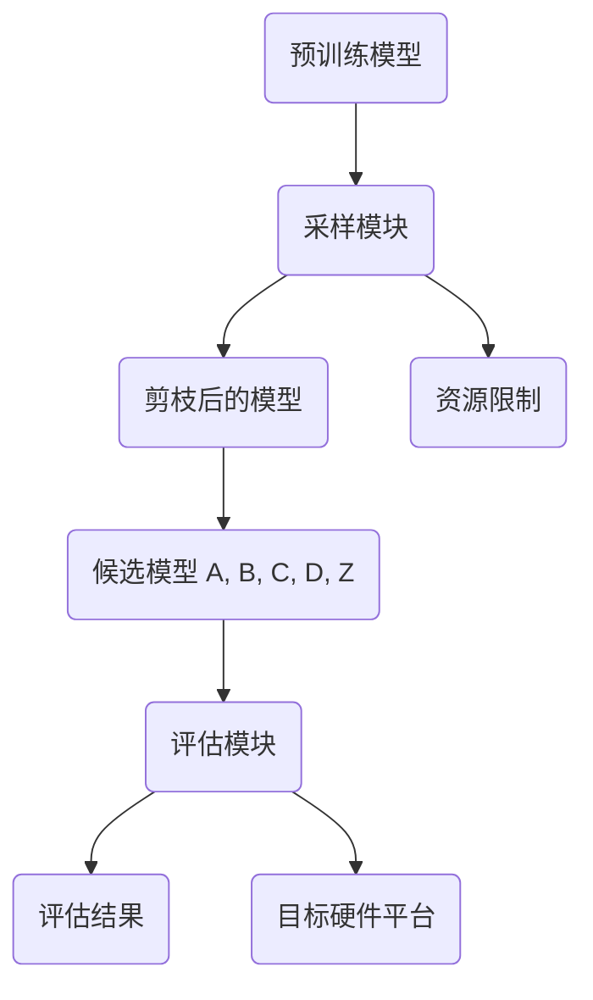


图 4.8 NetAdapt 的工作流程示意图

具体而言，算法4.3展示了 NetAdapt 算法的工作流程，其包含内外两层循环。首先是内层循环。根据第4行的渐进限制条件，第5行~第9行的内部循环会生成 K个候选模型，并且每个候选模型仅有互不相同的一层被剪枝。内层循环主要包含三个步骤：第一步，确定待剪枝层的压缩率（层间敏感度）；第二步，以 2-范数为指标确定需要剪掉哪些滤波器（层内敏感度）；第三步，使用较少的训练轮数对模型进行短时间微调。然后是外层循环。每轮外层循环均会小幅降低资源上限，如第4行所示。获得内部循环生成的 K个候选模型后，第10行的评估模块会逐个评估候选模型的性能，并从候选模型中选出一个最优的模型及其评估结果并送入下一轮循环。如第 13行所示，外层循环结束之后，会对剪枝后的模型进行较多训练轮数的长时间微调，以尽可能恢复模型的准确率。

```plaintext
1:  i = 1
2:  Res_i = TakeEmpiricalMeasurement(Net_i)
3:  while Res_i > Bud do
4:      Con = Res_i - ΔR_i
5:      for k = 1, 2, ..., K do
6:          N_Filt_k, Res_simp_k = ChooseNumFilters(Net_i, k, Con)
7:          Net_simp_k = ChooseWhichFilters(Net_i, k, N_Filt_k)
8:          Net_simp_k = ShortTermFinetune(Net_simp_k)
9:      end for
10:     Net_{i+1}, Res_{i+1} = PickHighestAccuracy(Net_simp, Res_simp)
11:     i = i + 1
12: end while
13: Net = LongTermFineTune(Net_i)
14: Return Net
```

类似于 NetAdapt, MOSP 也采用了渐进式优化策略。与 NetAdapt 不同的是，在每轮外层循环中，MOSP 都会评估模型中每一层压缩至不同通道数时任务性能（如分类准确率）和资源消耗（如延时）的变化情况。然后，MOSP 为每一层拟合两个线性系数，以近似描述其压缩通道数与任务性能影响或资源消耗降低之间的关系。接着，MOSP 构造线性规划问题，在确保满足本轮外层循环的资源消耗降低的限制下，最小化各层对任务性能影响之和（假设各层影响独立），从而求解出各层的压缩通道数。MOSP 在每轮外层循环中都可以同时对多层剪枝，比 NetAdapt 更灵活。

### (2) Unstructured

非结构化剪枝选择性地剔除模型中的个别权重或神经元，从而形成一个更为稀疏但结构上不规则的网络。这种剪枝方式在确保模型准确性方面表现出色，然而，权重分布的不规则性要求有专门的处理方法或软件优化。SparseGPT Frantar 和 Alistarh, 2023是针对大型语言模型（LLMs）的一次性剪枝方法上的重大突破。它通过将剪枝问题重新构想为一系列广泛的稀疏回归问题来应对挑战，并由新开发的求解器高效解决。值得注意的是，SparseGPT 能够仅用一台GPU在几小时内高效处理包含1750亿参数的模型，并且能够在不显著牺牲准确率或需要微调的情况下，在LLMs中诱导出高程度的稀疏性（50-60%）。为了应对SparseGPT中的重建成本挑战，Sun等人提出了Wanda，该方法通过评估每个权重的大小及其对应输入的范数来判断其重要性，显著提高了计算效率。此外，Yin等人设计了一套非均匀层次稀疏度比例，以更多关注出现异常值较多的层，从而提升剪枝性能。考虑到硬件对非结构化剪枝的支持，Flash-LLM Xia等人提出了一种非结构化稀疏矩阵乘法方法，其特点是稀疏加载和密集计算，以实现GPU Tensor Core对非结构化稀疏性的高效支持。

非结构化剪枝，又称稀疏剪枝，如图4.1所示，其剪枝粒度为单个权重。通过删除重要性校低的权重，并对剩余权重进行重训练或微调，可以在几乎不影响模型档度的情况下，显著减少裹型的存储量和计算量。非结构化剪枝是剪枝粒度最细的一种方法，具有最大的灵活性和压缩率。

与粗粒度的结构化剪枝方法相比，在相同的压缩比例下，非结构化剪枝通常能保持更高的精度。

然而，经过非结构化剪枝处理的权重矩阵变为稀疏矩阵，其非零元素的位置不规则，这种不规则性可能会对计算设备的数据访问和大规模并行计算造成不利影响。因此，针对通用平台的压缩工具链通常会优先考虑结构化剪枝方法。鉴于此，本节只简要概述非结构化剪枝的相关研究。

Deep Compression使用了基于幅值的非结构化剪枝方法，结合权值共享、模型量化和哈夫曼编码等技术，对 AlexNet 和 VGG-16 模型进行压缩。Deep Compression 在不损害模型精度的前提下，将 AlexNet 模型的参数量压缩为原来的1/35，VGG 模型的参数量压缩为原来的1/49，同时在模型运行速度和能耗方面实现了显著提升。

在模型剪枝的具体技术方面，Deep Compression 采用了一种迭代训练的非结构化剪枝方法。该方法先对模型进行正常训练，然后设定一个剪枝阈值，将所有小于该阈值的权重设置为0，这些权重不再参与后续训练。接着，对剩余的权重进行重训练和微调，以补偿剪枝带来的精度损失。这一剪枝和微调的流程会重复执行，直到达到预设的剪枝率。

假设得到的稀疏矩阵A 的大小nx n，其中非零元素的数量为a。直接存储这样的稀疏权重矩阵需要存储n×n个权重值，如图4.11所示。Han 等人采用行压缩（Compress Sparse Row，CSR.）存储格式存储稀疏矩阵。这种格式使用三个数组来表示稀疏矩阵中的非零元素及其位置。

*   浮点数组 Values：大小a，按从左到右、从上到下的顺序存储稀疏矩阵中的所有非零元素数值。
    
*   整型数组 Column Indices： 大小为 a，记录每个非零元素所在的列索引。
    
*   整型数组 Row Offsets：大小为 n+1，存储矩阵中每行第一个非零元素在Values 数组中的索引，最后一个位置记录非零元素的数量为a。
    

使用这种行压缩存储格式时，原本 nxn的稀疏矩阵仅需要三个数组共2a+n+1个元素即可存储。


图 4.11 稀疏矩阵行压缩存储格式示意图

传统的基于选代训练的剪枝方法需要先训练一个较大的模型，这样的剪枝方法开销较大。

近年来，一些研究开始探讨模型剪枝的根本性问题，提出了不先训练大模型再剪枝，而是直接确定和训练一个小模型的思路。一些剪枝相关的研究表明，剪枝后的小模型很难从头训练。 Han 等人的实验表明，从头训练剪枝后的小模型往往无法达到继承权重微调的精度。不过，稠密的大模型中仍可能存在一个可从头训练并达到同等性能的小模型。Frankle 等人在ICLR的最佳论文中提出了彩票假设（The Lottery Ticket Hypothesis）。这一假设认为，一个随机初始化的大模型包含一个子模型，如果这个子模型沿用原模型的权重初始化，则在相同迭代次数训练后可以达到原模型的测试精度。这个假设之所以被称为“彩票假设”，是因为它将随机初始化大模型权重的过程比作购买彩票。随机初始化后，每个子模型都是一张彩票，如果它能独立训练达到大模型性能，就称它赢得了“模型彩票”，这个子模型就被称“彩票子模型”。为了找到这样的彩票小模型，Frankle 等人将寻找过程分为以下4个步骤。

第1步：选定模型结构后将其随机初始化w0。此时，模型可被表示为f（5;40）。

第2步：对其进行一个迭代周期的训练，获得权重Wo。

第3步：采用基于幅值的稀疏剪枝方法，剪枝p%幅值最小的参数，相当于构造了一个掩码 。

第4步：将未剪枝的权重数值恢复到整体训练流程之前的随机初始化数值wo。

这一过程迭代执行，重复第2步~第4步，直到达到目标稀疏度，然后使用掩码 m得到彩票子模型f（；m ◎wo）。图4.12展示了寻找彩票子模型的一次迭代过程。影响是否能找到“彩票子模型”的两个重要因素是结构和权重。使用迭代的基于权重幅值的稀疏剪枝方法可以寻找到一个较佳的模型结构，而且确定彩票子模型结构后，将其权重恢复模型整体训练流程之前的随机初始化数值也非常关键（上述第4步）。然而，对于模型权重设定的问题，后续也有一些其他工作进行了分析。Frankle 等人找到了一种效果更佳的回滚（Rewind）策略。这种策略在剪枝后将权重恢复为训练过程中某轮的参数。Lin 等人则提出不需要恢复权重为初始化数值或者过程中的值，直接继承剪枝后的权重，即能获得最优性能。权重继承方案与剪枝方案和参数设定等实现细节紧密相关，其中的联系还需要进一步探索。

基于彩票假设，可以在不完全训练大模型的情况下通过一定次数的迭代找到彩票子模型，从头训练该子模型。彩票假设受到研究者关注的一个重要原因是，它提供了一种新颖的看待神经网络模型训练的角度，即训练过程可能在本质上是挖掘并训练一个大模型里的彩票子模型。

这种角度能解释一些有趣的现象，例如过参数化模型更容易训练，因为更大的模型有更多可能的子模型，更可能存在高性能的彩票子模型。

基于彩票假设的稀疏模型训练方法可以节省训练资源。这一思想自提出后，受到广泛关注，并在多种任务上得到验证，包括目标检测、图像生成、语音识别等任务。除了在训练效率上的优势，这一类稀疏训练方案还在缓解过拟合问题方面表现出了潜力。Chen 等人提出的 Robust Birds 将彩票假设的思想引入对抗训练的过程中，他们发现，提高稀疏性有利于缓解对抗训练的过拟合问题。另外，彩票假设的思想不仅限于权重粒度的剪枝方法，其同样可拓展至更结构化的剪枝方法。

### 半结构化剪枝方法

结构化剪枝方法与非结构化剪枝方法各有优势和局限性。半结构化剪枝方法旨在结合这两类方法的优点，其稀疏模式的设计结合了结构化和非结构化特性：一方面，结构化的特性使其能规则化数据访问，从而降低访存开销；另一方面，非结构化的特性使其能实现较高的压缩率。具体而言，半结构化剪枝将数据结构化地划分为具有相同结构的数据组，然后在每组内执行具有相同稀疏度的非结构化剪枝。这种方法曾被应用于 RNN模型的高效推理的软硬件协同设计。

在 NVIDIA 的安培 GPU 架构（NVIDIA Ampere GPU Architecture）中，稀疏张量核（SparseTensor Core）19 采用了半结构化稀疏方法。具体来说，该架构支持具有2:4 稀疏格式的稀疏矩阵与稠密矩阵进行矩阵乘法计算。如图 4.13（a）所示，2:4 稀疏模式 要求在矩阵一矩阵乘算子中，一个输入短阵的连续4个元素的数据组中只有2个元素非零。因此，这种稀疏模式的稀疏度为50%。这种计算模式可以通过权重剪枝产生，即将权重矩阵划分为4个元素一组的数据组，每组保留2个非零元素，并剪枝其他2个元素，而激活值则保持稠密格式。对于基于矩阵一短阵乘的全连接层、LSTM 块等，可以直接应用这种方法；对于卷积神经网络，可以通过 im2col的方式将卷积计算转换为矩阵一矩阵乘法计算，同样可以采用这种半结构化稀疏剪枝方案。

Misbra 等人 提出了一种高效的存储格式来存储2:4稀疏模式的数据。如前文所述，每个包含4 个元素的组只需要存储至多2个非零值和位置索引。如图 4.13（b）所示，这种格式使用2位来存储每个非零值的位置索引。例如，矩阵第一行的两个4元素组中非零元素的案引分别是10.3］ 和［1，21。需要注意的是，即使一个数据组中的非零值数量少于2，该压缩格式仍会存储2个值（存储零值）以保持数据结构的对齐。在执行矩阵乘法时，计算单元不仅读取非零数据矩阵，还会读取索引矩阵中的非零数据的位置索引，并根据这些位置索引从稠密矩阵中筛选相应的值进行乘累加计算，从而完成矩阵乘法。

半结构化稀疏矩阵   半结构化稀疏且压缩后的矩阵（权重）

（权重）


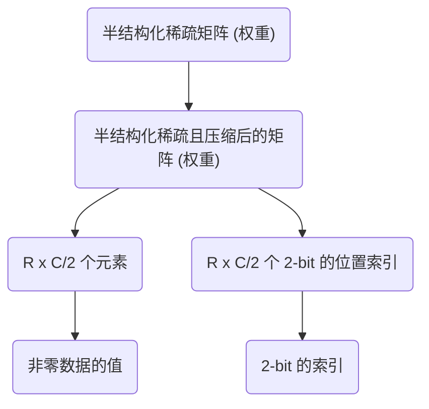

图 4.13 2:4半结构化稀疏模式及其数据的存储格式示意图

与非结构化稀疏模式相比，2:4稀疏模式及其数据的存储格式在访存和存储效率方面都更为出色。一方面，它能够消除依赖数据的不规则访存，提升带宽利用率。在传统的非结构化稀疏中，数据使用CSR、CSC或 COO 等存储格式，在稀疏矩阵一矩阵乘法（Sparse Matrix-Matrixmultiplication,SpMM）计算过程中，需要通过稀疏格式的数据内容确定矩阵值的访存地址，这将导致数据的不规则访存。相比之下，2:4 稀疏模式在矩阵的不同位置具有恒定的稀疏度，处理稠密操作矩阵时无须进行依赖数据的寻址，从而能够充分利用大带宽访存，并依靠计算单元进行小范围的索引。另一方面，2:4 稀疏模式占据的存储空间更小。它存储每个权重数据的索引仅需要2位。而在如图4.11所示的传统行压缩存储格式中，每个权重数据会带来更大的索引存储开销。例如，在2:4稀疏格式中，如果使用8位权重值，索引存储开销与非零权重值存储开销的比例为 25%，远低于行压缩存储格式中索引的相对存储开销（如果列索引使用16位，则索引存储开销可达 200%）。

半结构化剪枝方法的流程一般遵循基本的“训练一剪枝一微调”流程，即先训练一个稠密模型，再使用 2:4剪枝方法得到稀疏模型，最后对稀疏模型进行微调。针对上述 2:4 稀疏模式与压缩存储格式，Mishra等人设计了如图 4.14 所示的硬件加速单元，即稀疏张量核。该硬件加速单元相比于普通的稠密张量核增加了根据索引进行筛选的功能电路。在进行稠密计算时，相同数量的对应元素直接相乘，然后进行累加。在进行稀疏计算时，稀疏矩阵中的位置素引矩阵被用来筛选稠密矩阵中与之匹配的元素，然后对筛选出的匹配元素进行相乘和累加计算，以减少不必要的乘◎计算，使得实际所需的计算量降低为原始稠密计算的50%。而且，以上两种计算的乘法和累加电路是可以复用的。Chen 等人提出对Thansformer 模型中自注意力矩阵进行 n：m 半结构化稀疏。与对权重进行离线的n：m半结构化剪枝和稀疏编码不同，对激活进行 n：m半结构化稀疏需要在模型推理过程中高效地剪枝并稀疏编码动态计算出的激活值，因此 Chen 等人实现了采样稠密一稠密矩阵乘法（SampledDense-Dense Matrix Multiplication, SDDMM）的GPU算子，在模型推理时高效计算、剪枝并稀疏编码 Q五T矩阵。此半结构化稀疏矩阵被用于后续的按行 Soft max 和稀疏一稠密矩阵乘法，并加速对应计算。Chen 等人在 A100 GPU 上利用不同词块个数配置测试了1:2和2:4半结构化稀疏方法，相比稠密自注意力计算实现了1.38~1.86倍的加速。


图 4.14 张量核计算稠密和稀疏矩阵一矩阵乘法的流程示意图

### 4.7 针对激活值的剪枝方法

近似低秩分解、结构化剪枝、非结构化剪枝及半结构化剪枝，主要集中在对模型权重的操作上。本节将关注模型计算过程中的另一个关键部分，即激活值（Activation），探讨如何通过对激活值的剪枝提升模型的运行效率。激活值是在模型计算过程中产生的一些中间变量。有些激活值对最终结果的影响较小，因此可以跳过它们的计算。例如，在使用 ReLU作为激活函数时，会产生大量零激活值，这些零可以不继续参与权重短阵的乘法计算。这类方法被称为针对激活值的剪枝方法。

Transformer 的激活值剪枝是目前备受关注的研究领域。Thansformer 中的多头自注意力层（Multi-Heed Self-Attention, MHSA）是其核心组件之一。多头自注意力层会产生和输入与词块数 n2 的平方成正比的计算量和注意力矩阵激活值，因此针对 Transformer 的激活值剪枝是一种重要的高效设计方法。现有的 Tansformer 激活值的工作可以根据剪枝的位置是否与输入数据相关，分为动态激活值剪枝和静态激活值剪枝。

动态激活值剪枝会根据不同的动态输入删除不同位置的激活值。其基本思想是，实时地器测各个神经元的激活值，跳过对结果影响较小的神经元的计算，去除这些神经元对模型的影响从而实现剪枝的目的。Wang 等人利用自然语言中词句的“天然冗余性”，提出针对词块的剪枝方法。在注意力机制中，词块；和词块，之间的关系越强，注意力矩阵（i,j）处的值就越大。如图 4.15所示，该工作通过对注意力短阵的列进行求和，获得每一个词相对于所有词的累积重要性。对于累积重要性较低的词，会被从这一层及之后所有层的输入中删除，相当于删除了注意力矩阵对应行和列的激活值。实验表明，这种激活值剪枝方法可以将模型的计算量和访

存量減少 74%。


图 4.15 通过对注意力矩阵的列求和，判定词块的重要性并剪枝不重要的词块

与动态激活值剪枝不同，静态激活值剪枝中勇枝的激活值位置不随具体输入变化。这种勇枝方法通常在模型设计阶段就确定了剪枝的位置，并通过训练等方式使模型适应激活值的这都稀疏模式。BigBirdl24）通过预先定义的稀疏掩膜来规定注意力短阵中需要计算的元素位置，以而将注意力计算的复杂度从 O（n2）降低到 O（m））。如图4.16所示，BigBind 注意力掩膜主要由三个部分组成：随机掩膜、局部掩膜和全局掩膜。这些掩膜的设计使得稀疏的注意力能够有效地模拟原有稠密注意力模型中的重要注意力值。例如，一个词与所有词的全局注意力，或者都个词与周围词的局部注意力。同时，作者也证明了这种预先定义的稀疏注意力可以和完整附注意力一样建模所有连续的序列到序列函数，且具有“图灵完备性”。

另外，如果把每个词看作一个节点，将词与词之间的注意力看作一条边，就可以对静态稀疏注意力进行更进一步的理解和分析。原始的完整注意力相当于一个完全图，即所有节点之间的最短路径距离都是 1。稀疏注意力中的随机掩膜相当于图上的一些随机边。作者说明了O（n）条随机边就可以让图上任意两个点之间的最短路径距离变成 O（Logm）。这表示随机掩膜可以很好地保证词之间的信息流动，这和完整注意力是类似的。


图 4.16 由随机掩膜、局部掩膜和全局掩膜共同组成的 BigBird 注意力掩膜

注意力剪枝的差异不仅体现在动态性上，而且与权重剪枝类似，也表现在剪枝的基本单元粒度上。在词块粒度上的剪枝意味着跳过注意力矩阵中对应行和列的计算。例如，Chen 等人将图像的每个小块看作一个词块，决定每次注意力矩阵计算时可以删除哪些词块。注意力头粒度的剪枝使用更大粒度的剪枝单元。Wang 等人提出删除不重要的注意力头来減少 Transformer的计算量和内存开销。Hou 等人直接在层级粒度使用早停（Early Stopping）技巧，对于简单的任务，直接从某一层返回结果，跳过后面的所有计算。

### 4.8 剪枝方法的经验性选择

本节主要针对结构化剪枝方法，总结经验性规则，以帮助读者根据需求选择合适的方法，并分析剪枝结果的合理性。

#### 剪枝流程的选择

剪枝流程在算法层面存在三方面的需求，即需要保证剪枝后的模型有较高的准确率，需要满足明确的硬件资源限制，需要快速给出剪枝后的轻量化模型（剪枝方法本身的速度）。根据这三方面需求可以给出如下方法选择的建议。

（1）基于权重正则的方法：典型的方法是 SSL。4.3.1 节提到，这类方法在保持准确率的同时，难以可控地满足预先定义的硬件资源限制。然而，它们的时间开销相对较低。

（2）基于离散搜索的方法：典型的算法是 Net.Adapt30）和 AMC™T。4.3.2 节提到，这类为法能够根据预设的硬件资源限制进行精确剪枝，同时保持较高的模型准确率。但它们通常需要一个内外两层循环的迭代流程，时间开销较高。

（3）基于可微分搜索的方法：典型的算法是 BAR和 DSAB。这类方法结合了基于权重正则的方法和基于离散搜索的方法的优势，以可微分的方式进行层问敏感度分析，能够在满足资源限制的同时降低时间开销。但它们的敏感度分析的近似较为激进，评估准确度可能不足且模型准确率的波动较大，需要更精细的超参数调整。

#### 4.8.2 剪枝稀疏模式的选择

在特定硬件环境下，还需要分析硬件特性，并根据这些特性选择合适的模型剪枝方法。以下是对主流硬件环境下剪枝方法选择的建议。

（1）GPU:GPU普遍对稠密计算有良好的支持，它是为稠密的矩阵计算操作设计的。因此结构化剪枝方法通常能够较好地适配。NVIDIA 的安培架构显卡如 RTX 3090支持 N:M半结构化稀疏剪枝方法，能够在保持硬件性能的同时提供 50% 以上的较高压缩率。

（2）CPU:CPU 的指令通常是细粒度的，精确到基本的乘法和加法操作。因此，CPU 更关注剪枝方法带来的压缩率，而非关注其是否是结构化的。非结构化剪枝方法中的 Deep Com-pression和专门为CPU设计的半结构化剪枝方法都能在CPU上高效运行。

（3）专用硬件：专用硬件会使用更精细的调度、新的数据格式等方式高效地处理非结构化剪枝后的模型。例如，ESEP90|通过计算负载均衡技术缓解非结构化剪枝带来的计算单元负载不均衡，从而显著提高硬件处理速度。需要注意的是，这些专用硬件通常也支持结构化剪枝，使用时应根据模型的实际情况判断哪种剪枝方式更高效。

#### 4.8.3 关于任务性能的经验

为了分析在不降低精度的前提下，每个任务可以达到的压缩率，通常从任务类型、数据集规模和主干模型这三个维度考虑。通过控制变量的方法进行分析（固定两个维度，仅改变第三个维度），可以分别理解这三个维度对压缩率界限的影响。

（1）任务类型；不同任务上的同一模型可能具有不同的压缩率。例如，使用特定的剪枝方法对在分类任务和目标检测任务上分别训练好的 ResNet-50 模型进行压缩。分类任务的 ResNet-50模型的压缩率可能超过90%，而目标检测任务的ResNet-50 模型的压缩率可能只能达到70% 

（2）数据集规模：通常认为，训练数据规模越大，模型的压缩率越小。这是因为随着训练数据量的增加，可能会有更多模型权重被有效利用。例如，对于同一个模型，在 Imagelvet 数据集上训练通常比在 CIFAR 数据集上训练的压缩率低。

（3）主干模型：不同主干模型之间的可剪枝比例可能存在显著差异。例如，在目标检测任务中，对在 VOC 数据集上训练好的 SSD目标检测模型进行通道剪枝。当主干模型为 MobileNet时，模型的压缩率可能仅达到30%L32；而主干模型为 ResNet-50 时，模型的压缩率可能超过75%l.33l。一般来说，冗余度较高的模型更容易进行剪枝，例如 VGG比 ResNet 更容易剪枝，而ResNet 比 MobileNet 更容易剪枝。

#### 4.10 本章小结

模型剪枝是一类非常重要的模型压缩方法，旨在通过识别并删除模型中的冗余部分，以减少模型的计算和存储开销。具体来说，模型剪枝可以对神经网络的冗余权重或推理过程中的冗余激活值进行修剪，保持模型性能的同时显著提高其推理效率和资源利用率。在模型压缩的多个领域中，模型剪枝已经被广泛应用并取得了显著效果。

在这章中，分别详细介绍了不同的剪枝方法及其在模型中的应用。4.3节、4.5节和4.6节探讨了基于不同稀疏模式的权重剪枝方法。权重剪枝通过在训练后期移除不重要的权重来减少模型参数，从而达到模型简化和压缩的目的。采用稀疏模式的权重剪枝可以有效提高模型的稀疏性，同时保持模型的预测精度。

此外，低秩分解也是一种非常有前途的模型压缩技术，4.4节对此进行了详细阐述。低秩分解的核心思想是将权重矩阵进行分解，从而在结构化的低维空间中实现权重剪枝。通过这种方式，低秩分解能够在减少模型参数量的同时保持较高的模型表现。由于低秩分解本质上是在张量分解后的空间中进行的结构化剪枝，因此它可以被看作是模型剪枝的一种特殊形式。

在激活值剪枝方面，4.7节介绍了相关方法。这类剪枝方法主要针对模型在推理过程中产生的激活值，通过剪枝不重要的激活值来进一步优化模型的计算效率。激活值剪枝与权重剪枝相辅相成，能够在多个层面上提升模型的推理速度和资源利用率。

为了进一步深入了解模型剪枝和低秩分解，建议读者参考 Deng 等人撰写的综述文章，其中涵盖了这些领域的最新进展和技术细节。该综述为读者提供了全面的背景知识，帮助他们更好地掌握模型剪枝和低秩分解的核心概念及其应用。

在未来，关于模型权重和激活值剪枝的研究方向还有许多值得探索的领域。首先，对于视觉或文本 Transformer 模型，稀疏注意力机制的研究非常关键，尤其是在处理超长序列时，这一技术可以有效降低计算复杂度。其次，通过稀疏化或低秩分解来加速模型的训练过程也是一个重要的研究方向。随着模型规模的不断扩大，如何有效地加速训练过程将成为提高深度学习模型应用效率的关键。

总结而言，模型剪枝和低秩分解作为模型压缩的关键技术，已经在多个领域取得了显著进展。未来的研究将继续围绕稀疏性、低秩结构和模型加速等方面展开，推动这些技术在更广泛的应用场景中得到进一步发展。

## 2. Quantization

[https://mp.weixin.qq.com/s/dgS-yRVpGe\_w1uzbcVctXg: https://mp.weixin.qq.com/s/dgS-yRVpGe\_w1uzbcVctXg](https://mp.weixin.qq.com/s/dgS-yRVpGe_w1uzbcVctXg)

[https://newsletter.maartengrootendorst.com/p/a-visual-guide-to-quantization: https://newsletter.maartengrootendorst.com/p/a-visual-guide-to-quantization](https://newsletter.maartengrootendorst.com/p/a-visual-guide-to-quantization)

[https://www.bilibili.com/video/BV1kw4m1X7Bi/?spm\_id\_from=333.1387.collection.video\_card.click&vd\_source=c5bdb0f48617ac846848b6be17c6f732](https://www.bilibili.com/video/BV1kw4m1X7Bi/?spm_id_from=333.1387.collection.video_card.click&vd_source=c5bdb0f48617ac846848b6be17c6f732)

在众多量化技术中，post-training quantization（PTQ）是最为流行的一种。这种方法是在训练完模型之后对模型的参数（包括权重和激活值）进行量化。

**对于权重值**的量化可以采用**对称量化（symmetric quantization）**或**非对称量化（asymmetric quantization）**两种方式。

**至于激活值**，由于我们不知道其范围，因此需要通过模型的推理来获取它们的 potential distribution（译者注：指的是在不同的输入数据和模型参数下，激活值可能出现的一系列数值。了解这个分布有助于我们选择一个能够包含大部分激活值范围的量化级别，从而减少量化误差。），然后再进行量化。

激活值的量化主要有两种形式：

*   **动态量化（Dynamic Quantization）**
    
*   **静态量化（Static Quantization）**
    

[https://robot9.me/ai-model-quantization-principles-practice/: https://robot9.me/ai-model-quantization-principles-practice/](https://robot9.me/ai-model-quantization-principles-practice/)

### 模型量化的定义和分类

在深度学习模型的推理过程中，量化是一项关键的优化技术，它通过将浮点运算转换为定点运算，显著提升了推理效率并降低了计算资源的消耗。在这个过程中，理解量化的具体操作和公式尤为重要。下面，我们将详细讲解常见的量化公式、量化方法以及主动量化与被动量化的概念。

**1. 量化公式**

量化的基本公式如下：

$x\_q = \text{clip}\left( \text{round}\left( \frac{x}{\text{scale}} \right) + z, \text{min}, \text{max} \right)$

该公式可以分解为以下步骤：

• **x**：原始浮点数输入，表示我们在推理过程中需要量化的数据。

• **scale**：量化比例系数，决定了如何将浮点数缩放至量化的整数范围。它是量化过程中最关键的参数之一。

• **z**：零点（zero point），在非对称量化中用于调整量化后的整数表示。它可以使得数据分布更贴近量化的整数范围。

• **round()**：取整操作，将浮点数转换为最接近的整数，保证量化后的数据可以在定点模型中计算。

• **clip()**：截断操作，将结果限制在指定的范围内，通常是量化整数表示的最小值（min）和最大值（max），以防止数值溢出。

**公式过程**：

1\. **缩放**：首先对输入浮点数x进行缩放，将其除以scale，得到一个缩小的浮点值。

2\. **取整**：然后对缩放后的结果进行取整，转换为定点数。

3\. **零点调整**：对于非对称量化，向量z（zero\_point）会添加到取整后的值上。

4\. **截断**：最后，将得到的整数值限制在指定的范围\[min, max\]内，以防止溢出。

**2. 主动量化与被动量化**

在模型量化过程中，操作符根据是否依赖输入和输出的量化参数，可以分为主动量化算子和被动量化算子。

• **主动量化算子**：这是指那些在转换为定点算子时，必须依赖输入和输出的量化参数来进行正确计算的算子。例如，卷积（Conv）算子在转换为定点QConv时，必须使用输入和输出的scale和zero\_point等量化参数，以保证量化计算的准确性。主动量化算子在量化过程中，离不开这些量化参数。

• **被动量化算子**：与主动量化不同，被动量化算子在转换为定点算子时，不需要使用输入或输出的量化参数。这类算子的计算不会受量化参数的影响。例如，MaxPooling算子只需要选择输入中的最大值，因此它不依赖输入或输出的量化参数。

**3. 量化节点参数的选择**

量化节点的参数主要分为三类：量化方法、量化精度、量化粒度。每一类参数的选择都会对模型的量化效果产生重要影响。

**3.1 量化方法**

量化方法决定了数据如何在浮点数与定点数之间转换，主要有以下几种方式：

• **对称量化**：zero\_point为0，数据的正负两侧有相同的表示范围，适合均匀分布的数据。

$q\_x = \text{round} \left( \frac{x}{\text{scale}} \right)$

• **非对称量化**：zero\_point不为0，适用于带有偏移的数据分布。

$q\_x = \text{round} \left( \frac{x}{\text{scale}} \right) + z$

• **均匀量化**：整个数据集使用固定的scale，适用于分布较为一致的数据。

• **非均匀量化**：scale会随着输入或不同的通道进行变化，适用于数据分布不均的情况。

• **动态量化**：scale在推理过程中根据实时数据动态调整，适合实时推理场景。

• **静态量化**：scale在模型转换过程中离线计算，在推理时直接使用，适合固定硬件资源的场景。

**3.2 量化精度**

量化精度决定了量化过程中数值表示的位数，常见的选择有：

• **4-bit**：适用于对精度要求较低的层，推理速度快。

• **8-bit**：最常用的精度，能够平衡推理速度和模型精度。

• **16-bit**：提供更高精度，适用于对精度要求较高的层。

**3.3 量化粒度**

量化粒度决定了量化参数的应用范围：

• **Per-tensor量化**：整个激活层使用同一个scale，适合计算要求较低的场景。

• **Per-channel量化**：每个通道可以使用独立的scale，能够提高精度。

• **Per-block量化**：量化粒度可以进一步细化，对特定的块或区域进行独立量化，适用于复杂模型。

**4. 量化算法**

在量化公式中，各个参数（如scale、round、min、max、clip）都可以通过不同的搜索或优化策略来选择。影响量化误差的关键因素是 **scale**，它对 **rounding error** 和 **clipping error** 的影响尤为显著。以下是对相关概念的进一步解释。

**量化公式**

$x\_q = \text{clip}\left( \text{round}\left( \frac{x}{s} \right), \text{min}, \text{max} \right)$

其中：

• **x**：输入的浮点数。

• **s**（scale）：量化比例因子。

• **round**：将浮点数向最近的整数取整。

• **clip**：将取整后的值限制在给定的最小值（min）和最大值（max）之间。

**Scale（s）的计算**

**scale** 是影响量化误差的主要参数，它不仅决定了浮点数如何映射到离散的量化范围，还对 **rounding error** 和 **clipping error** 有直接影响。**scale** 的值取决于 **Threshold** 和 **Bit**（位宽），其公式为：

$s = \frac{\text{Threshold}}{2^{\text{Bit}} - 1}$

• **Threshold**：表示量化过程中的截断值，定义了量化数据的动态范围。它通常根据数据的统计分布来计算，可以使用最大值（max）、KL散度（KL Divergence）、百分位（percentile）、均方误差（MSE）、最小最大值（min-max）等方法。

• **Bit**：表示用于量化的位宽。例如，4-bit、8-bit 或 16-bit，每个比特位的增加都能提供更高的精度。

在对称量化中，**zero\_point** 为零，所以公式中只考虑 **scale** 的影响。**scale** 越小，数据的取整误差（rounding error）也越小；但是，过小的 **scale** 可能导致 **clipping error** 增大。因此，**scale** 的选择是一个需要精确权衡的过程。

**阈值（Threshold）的计算**

**Threshold** 的选择对量化误差有重要影响，常用的计算方法包括：

• **max**：取数据分布中的最大值作为阈值。

• **KL散度**：选择使量化后数据与原始数据KL散度最小的阈值。

• **Percentile**：根据数据的百分位点选择阈值，如取99.99%的数据点作为上限。

• **MSE**：通过最小化量化后数据与原始数据的均方误差（MSE）来选择阈值。

• **min-max**：根据数据的最小值和最大值来计算量化范围。

通过以上的公式与优化方法，量化中的各个参数可以根据具体的数据分布和应用需求进行搜索与调整，确保在模型精度与性能之间取得良好的平衡。

**4.1 最大最小值（Min-Max）量化**

**Min-Max量化**是最常见的非对称量化方法。它通过选择数据分布中的最小值和最大值来定义量化的上下限范围：

• **最大值（Max）**：在数据分布中取绝对值最大的数值作为阈值（Threshold）。

公式表示为：$\text{Threshold} = \max(|x|)$

这种方法简单直接，但对离群值（outliers）非常敏感，容易导致量化范围过大，从而增大量化误差。

• **最小值（Min）**：同理，数据分布中的最小值定义了量化的下限阈值。Min-Max量化的范围通过取数据的最小值和最大值，定义了从到的量化区间。

虽然该方法简单实用，但当数据分布中存在异常的大值或小值时，可能会使得量化范围过宽，从而导致量化误差加大。

**4.2 KL散度量化（Kullback-Leibler Divergence）**

**KL散度量化**是一种统计量化方法，用于测量原始数据分布与量化后数据分布的差异。通过找到使KL散度最小的量化阈值，来确保量化后的数据与原始数据之间的差异最小。

• **KL散度公式**：

$D\_{KL}(P||Q) = \sum P(x) \log \frac{P(x)}{Q(x)}$

其中， 是原始数据的概率分布， 是量化后的数据分布。KL散度用于衡量两个概率分布之间的差异，KL散度越小，两个分布越接近，量化误差也越小。

在KL散度量化中，通过对不同的阈值进行实验，找到KL散度最小的那个阈值来进行量化。虽然KL散度在衡量数据分布上的差异非常有效，但它并不总能保证模型整体量化误差最小，尤其是在处理复杂模型时。

**4.3 百分位（Percentile）量化**

**Percentile量化**是一种通过选择数据分布中的某个百分位点作为量化阈值的方法。它通过排序数据并取某个百分比的值来确定量化的上限或下限。

• **Percentile选择**：

公式表示为：

$\text{Threshold} = P\_{\text{percentile}}(x)$

例如，取99.99%的百分位点，表示选择数据分布中前99.99%最大的值作为量化的上限阈值。这样可以有效避免数据中的离群值（异常值）对量化范围的负面影响。

百分位量化特别适用于数据中存在少量离群值的情况。通过忽略这些异常值，模型可以更有效地将量化范围集中在实际的数据分布上，从而减少误差。

**4.4 均方误差（MSE）量化**

**MSE量化**通过最小化量化后数据与原始数据之间的均方误差来选择最优阈值。均方误差用于衡量量化前后数据之间的偏差，MSE越小，表示量化后的数据与原始数据越接近。

• **MSE公式**：

$\text{MSE} = \frac{1}{n} \sum\_{i=1}^{n} (x\_i - \hat{x}\_i)^2$

其中， 是原始数据， 是量化后的数据。

通过最小化MSE，可以减少量化误差，保证模型的精度。然而，MSE量化通常计算量较大，因此更适合精度要求较高的应用场景。

**4.5 综合选择量化阈值**

在实际应用中，选择量化算法时可以结合多种方法。以下是几种常见的使用场景：

• **Min-Max量化**：适用于数据分布较为对称、没有极端异常值的场景。

• **KL散度量化**：适用于需要较高精度的场景，特别是在神经网络中使用。

• **Percentile量化**：适用于数据中存在离群值的情况，通过忽略极端值减少量化误差。

• **MSE量化**：适用于对量化精度有严格要求的场景，但计算成本较高。

**5. 权重和激活量化**

在AI模型中，权重和激活的量化是实现计算优化的两个关键步骤。量化的目标是减少模型的计算复杂度和存储占用，同时尽量保持模型的推理精度。模型的计算过程可以简化为 ，其中  代表激活， 代表权重，这两者通常需要分开量化。

**5.1 激活量化**

激活量化的目标是通过对模型中神经元的激活进行量化，将其从浮点表示转换为整数表示。这有助于在硬件上加速推理过程。激活量化的关键是选择合适的量化参数（如scale、zero\_point和bit数），确保量化过程中误差最小化。

**量化参数的选择**

激活量化中的参数选择至关重要，以下是量化参数选择的关键点：

• **Scale的选择**：激活的scale决定了数据如何缩放到量化的整数范围。scale越小，rounding error越小，但也会增加clipping error。因此，scale需要在误差最小化的前提下进行精确调整。

• **Threshold的计算**：激活量化中的阈值（Threshold）通常根据激活值的分布进行选择。常用的选择方法有：

• **最大值（max）**：直接选择激活数据的最大值作为阈值。

• **百分位（percentile）**：选择激活数据中某个百分位数的值作为阈值，常用的是99.99%的百分位数。

• **KL散度（KL Divergence）**：通过计算原始数据与量化数据的KL散度，选择使散度最小的阈值。

• **最小最大值（min-max）**：选择激活数据的最小值和最大值来确定量化范围。

• **Bit数的选择**：激活量化的精度由bit数决定。常见的选择包括：

• **4-bit**：适用于对精度要求不高但追求更快推理速度的场景。

• **8-bit**：常见的量化位数，平衡了精度和推理速度。

• **16-bit**：用于对精度要求较高的场景，但推理速度较慢。

**模型激活量化的算法**

模型的激活量化通常通过以下几种方法实现：

• **Modelwise**：对整个模型使用统一的量化参数进行激活量化，这种方法简单高效，但对精度的影响较大。

• **Layerwise**：为模型中的每一层分别选择最优的量化参数。这种方法更加灵活，可以有效减少量化误差，提升模型精度，但计算复杂度更高。

激活量化的挑战在于如何最小化量化误差，尤其是在高非线性激活函数（如ReLU、Gelu等）中，需要特别关注clipping和rounding误差。通过优化scale和bit数，可以平衡精度和性能。

**5.2 权重量化**

权重量化与激活量化类似，也涉及到量化参数的选择和优化。然而，权重数据的特性与激活有所不同，通常需要采用额外的校准和优化技术来确保量化精度。

**权重量化的参数选择**

• **Scale和Bit数的选择**：与激活量化类似，权重量化也通过scale和bit数来控制量化精度。权重的scale和bit数通常通过搜索或优化算法得到，以确保模型性能不受明显影响。

**Bias Correction方法**

在权重量化中，误差常常具有方向性，这种误差会导致输出偏移，最终影响模型的精度。**Bias Correction** 是一种常用的误差校准方法，旨在修正量化过程中产生的偏移。

Bias Correction的核心思路是在量化时计算量化后权重与原始权重之间的偏移误差，然后将该误差合并到模型的偏差（Bias）中。这种校准方式可以有效减小量化引入的误差，同时不会增加推理时的计算开销。

**权重量化的优化方法**

除了Bias Correction，还有一些常用的权重量化优化方法：

• **跨层均衡量化**：跨层均衡量化通过对不同层的权重进行平衡处理，确保量化时误差最小。该方法通过在不同层间分配权重的scale来减少量化引起的累积误差。

• **SmoothQuant方法**：这是另一种用于权重量化的优化方法，旨在通过平滑化激活和权重之间的scale差异来减少量化误差。

**权重量化的应用场景**

权重量化广泛应用于深度学习模型的推理阶段，尤其是在移动设备或嵌入式系统中，权重量化可以大大降低模型的存储需求并提高推理效率。


**6. 模型量化的复杂度与成本**

在深度学习模型的推理过程中，量化是一个常见的优化步骤，用于减少计算复杂度并加速推理。在选择量化方法时，考虑模型精度、数据可用性、计算资源等因素至关重要。以下是对不同复杂度量化方法的详细介绍。

**6.1 Level 1：Data-Free量化**

**Data-Free量化** 是最简单的量化方法，只需要一个预训练模型，不需要额外的数据进行校准或优化。这类量化直接依赖模型的现有结构进行量化操作。

• **适用场景**：适用于没有数据集或数据不可用的情况下，尤其是在快速部署的场景中。

• **优点**：无需额外数据，计算复杂度低，实施简单。

• **缺点**：由于没有进行数据校准，量化误差可能较大，导致模型精度下降。

**6.2 Level 2：Light PTQ（轻量后训练量化）**

**Light PTQ** 需要一个预训练的模型和少量的校准数据。这种量化方法通过分析少量的数据，基于统计规则来确定量化参数，从而实现模型的量化。

• **适用场景**：当有少量数据可用且对精度有一定要求时，Light PTQ 是一种良好的折衷方案。

• **优点**：只需要少量校准数据，计算复杂度较低，能够减少量化误差。

• **缺点**：虽然减少了量化误差，但相比更复杂的方法，精度可能有所下降。

**6.3 Level 2+：Advanced PTQ（高级后训练量化）**

**Advanced PTQ** 在 Light PTQ 的基础上，通过加入梯度下降等优化算法进一步优化量化参数。这种方法可以根据少量数据的梯度信息，迭代优化模型的量化效果。

• **适用场景**：当数据量有限但需要更高的模型精度时，Advanced PTQ 是一种有效的解决方案。

• **优点**：提供更高的精度，适合在精度与成本之间做出折衷的场景。

• **缺点**：相比于Light PTQ，Advanced PTQ 的计算成本较高，优化过程中需要更多计算资源。

**6.4 Level 3：QAT（量化感知训练）**

**QAT量化** 是最复杂的量化方法。它需要使用完整的训练数据和标签，并在训练过程中模拟量化影响。通过将量化操作融入训练Pipeline，QAT确保模型在训练时能够适应量化带来的精度损失。

• **适用场景**：当有充足的数据和计算资源且对精度要求极高时，QAT 是最好的选择，尤其适合硬件加速器上的部署。

• **优点**：通过训练中的量化模拟，QAT 可以最大程度减少量化误差，提供接近原始浮点模型的精度。

• **缺点**：QAT 训练成本高，需要完整的数据集和大量的计算资源，训练时间也更长。

**6.5 模型量化精度恢复策略**

通常，模型的量化精度损失相对较小，可以通过 **Level 2 Light PTQ** 方法来满足性能要求。然而，若模型精度损失较大，可以采用 **Level 2+ Advanced PTQ** 甚至 **Level 3 QAT** 来恢复量化模型的精度。

• **Light PTQ**：适用于精度损失较小的模型，可通过少量数据进行统计校准。

• **Advanced PTQ**：适用于精度损失较大的情况，通过梯度下降等优化技术提升模型精度。

• **QAT**：在精度损失极大的场景下，通过量化感知训练恢复模型精度，确保模型在量化前后性能保持

### 模型量化是一类有效的模型压缩方法

可以降低模型的离线存储开销，还可以降低模型运行时的计算量、存储量和访存开销。这些开销的降低有助于提升硬件系统的性能指标，包括延时、吞吐率、能耗和功率等。简而言之，模型量化的核心思想是，以低位宽表示神经网络模型运行时涉及的各种数据，如权重、激活值和梯度，而不使用默认的32位单精度或16 位半精度浮点数表示。

通常，传统的神经网络模型采用32位单精度浮点格式进行存储和计算。IEEE 标准所定义的32位浮点格式如图 5.1所示，其中包含1个符号位（Sign），8个指数位（Exponent）及 23个尾数位（Mantissa），其表示精度较高、表示范围较大。然而，神经网络推理通常不需要如此高的精度，且数据格式和位宽对推理效率有很大影响。具体来说，模型推理的能耗或延时开销主要由以下两类操作带来。

（1）访问存储器（访存），即在存储单元和计算单元之间传输权重、激活值等数据。

（2） 计算，即实际进行乘累加、非线性等计算。


图 5.1 IEEE 标准里的 32 位浮点数

若使用8位整型格式（INT8）来表示原本用32位浮点格式（FP32）表示的数据，则不仅可以将该数据的存储开销降低75%，还可以降低访存开销。至于计算开销，整型计算相对于浮点数更简单，整型计算单元比浮点计算单元具有更小的能耗和电路面积。因此，用整型计算代替浮点计算能够降低约一个数量级的能耗与缩小两个数量级以上的电路面积，这对端侧部署及芯片设计都非常有利。对于给定的硬件平台，使用低精度格式进行计算的前提是硬件平台需要有支持该低精度格式的计算单元。

由于模型量化方法具有较好的效率提升潜力，研究者们持续开发量化方法，从量化格式设计、量化参数确定、量化值调优、针对量化的架构调整等多个维度进行设计，旨在实现硬件推理效率和量化后模型任务性能的最佳权衡。2016年至今，模型量化方法的研究已经取得了长足的进展。

从优化问题定义和求解的视角来看，模型量化方法需要求解的优化问题的定义如下。优化空间主要由量化格式（描述了低位宽数和实际表示数值的对应关系）、量化参数（量化格式中的待决定参数）、量化值（低位宽数）三类决策组成。模型量化方法需要力神经网络里每个张量（包括权重、激活值、偏置、计算中间值等）确定量化格式和量化参数， 权重确定量化值，从而得到量化模型。

特定工作可能会预设一些决策的选择，只针对余下的決策调优，即将优化空间缩减为一个较小的子室间。例如，一些工作主要关注设计量化格式、量化参数确定方法或调优量化值的校准和训练方法。优化目标是降低量化所造成的任务性能损失。特定工作可能会设计其代理目标并提出相应的求解方法，例如以量化误差（QuantizationError，数据拟合误差）或重建误差（Reconstruction Brror，激活值重建误差）作为代理目标，或将每个数据的量化误差和该数据误差的敏感度的乘累加作为代理目标。约束条件可能是直接的硬件性能指标约束，例如对推理延时或功耗的约束，也可能是和最終推理效率相关的代理约束。例如，许多工作将位宽约束作为代理约束，即要求所有权重、激活值均使用 8-bit、4-bit 位宽等。而硬件感知量化或软硬件协同设计方法则通常直接针对硬件性能指标进行方法设计。


优化问题定义和求解视角下的模型量化

从使用场景及工作流的视角来看，模型量化方法可被分为以下两种流程：训练后量化（Post-Training Quantization,PTQ）和量化感知训练（Quantization-Aware Training,QAT）。训练后量化基于已训练好的浮点模型进行量化，适用于数据量和运行时间受限的场景（要求快速完成量化或只能访问少量数据甚至无数据的场景）。量化感知训练在训练过程中模拟量化操作，通过训练让权重适应量化带来的误差。虽然量化感知训练产生的量化模型一般能达到更高的任务性能，但其量化流程需要更多的训练数据和更大的训练开销。

下图展示了量化领域的概况。首先，不少工作持续改进训练后量化与量化感知训练的具体方法。然后，学术研究持续关注如何以极低位宽（1-bit）取得较优的任务性能这一话题。BinaryConnect 、XNOR-Net、Bi-Real Net 、ReActNet 等二值化神经网络将权重与激活值量化成单比特位宽，具有加速与能耗优化的潜力。以HAQ、ReLeQ、FracBNN等工作为代表的硬件感知量化或协同设计方法，不用位宽作为硬件系统性能的代理，而是直接针对硬件系统的性能指标进行方法设计。除了关注推理效率，出于改进训练效率，包括缓解多机训练的通信压力、让训练能在端侧设备上进行等目的，研究者提出了 WAGE、MILS等一系列低比特训练算法，在训练时用低位宽格式表示权重、激活值或梯度。


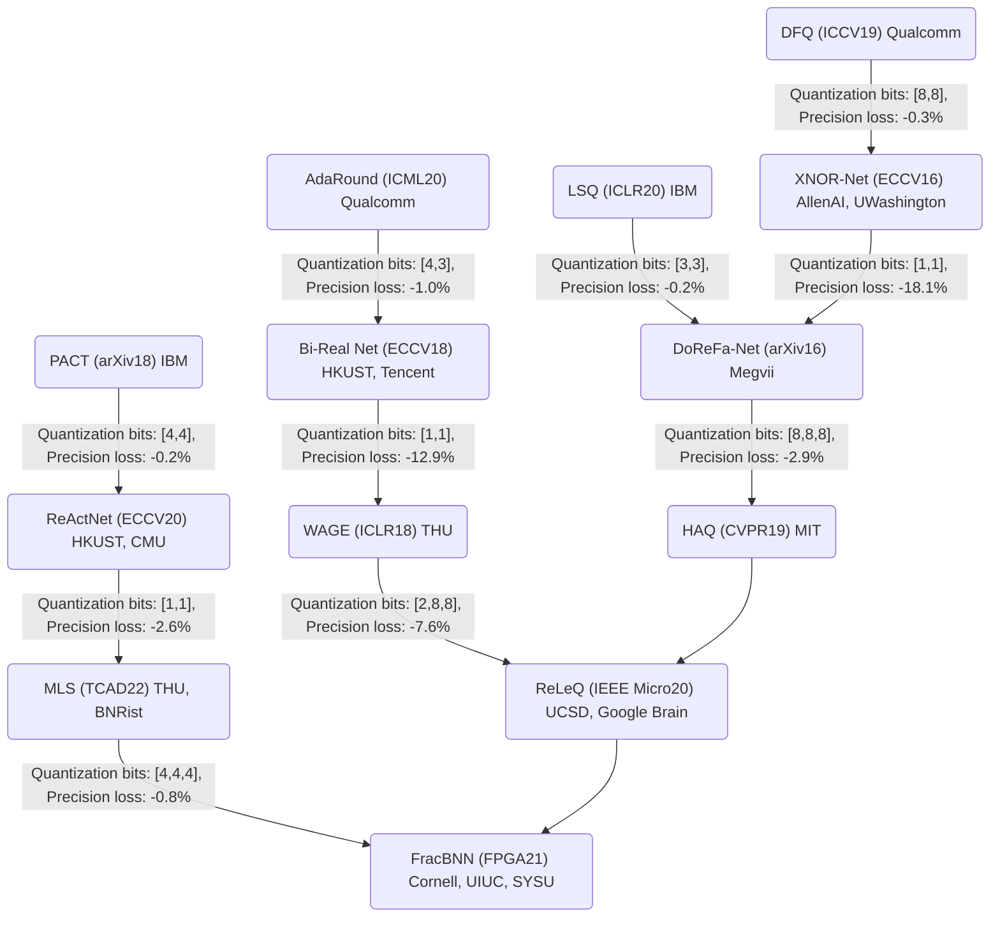

图中量化位宽［W, A，（G）］分别表示模型权重（W）、激活值（A）与梯度（G）的量化位宽

本章将按以下顺序展开：

5.2节将明晰两个量化的相关过程；

5.3 节将介绍有代表性的量化格式，其中会介绍量化参数等基本概念；“如何决定量化参数以最小化任务性能损失”是量化方法设计所需关注的重点，由于其重要性，

5.4 节将展开介绍几种重要的量化参数；

5.5 节与5.6节将详细介绍训练后量化与量化感知训练这两种流程的具体步骤和每个步骤的方法；

5.7 节将介绍混合位宽量化方法，这些工作关注寻优“量化位宽”这一类量化参数；

5.8 节将给出量化方法选择及量化效果的一些经验；

5.9节与5.10 节将介绍实现低比特计算的硬件单元，以及低比特训练的相关知识。

### 5.2 模型量化过程和量化推理过程

在讨论其他量化相关概念前，首先需要分清两个过程，即离线模型量化过程和在线量化推理过程。

（1） 模型最化过程指的是得到量化模型的最化方法运行过程。在此过程中，量化方法需要将高位宽表示的权重转换为低位宽表示的权重。若推理过程中的激活值也需要量化,且不是在量化推理过程中在线针微活值量化参数的话,量化方法还需要为激活值确定量化参数。

（2） 量化推理过程指的是从离线的模型量化过程得到量化模型后，从量化模型做推理的过程。推理过程根据是否使用低进度计算可分为两类。一类是使用低精度计算单元，一个典型流程是，两个int8输入张量进行低精度乘法后在一些张量维度相加，累加器一般需要更大位宽以防止溢出，如int32，最后累加输出需要进行再量化回到int8，另一类是使用高精度计算单元，将低位宽表示的权重或激活去量化回到高位宽表示，然后使用高精度计算单元进行计算。最后，计算结果可能需要量化回低位宽表示，如用于降低训练时激活值的存储和通信开销等。


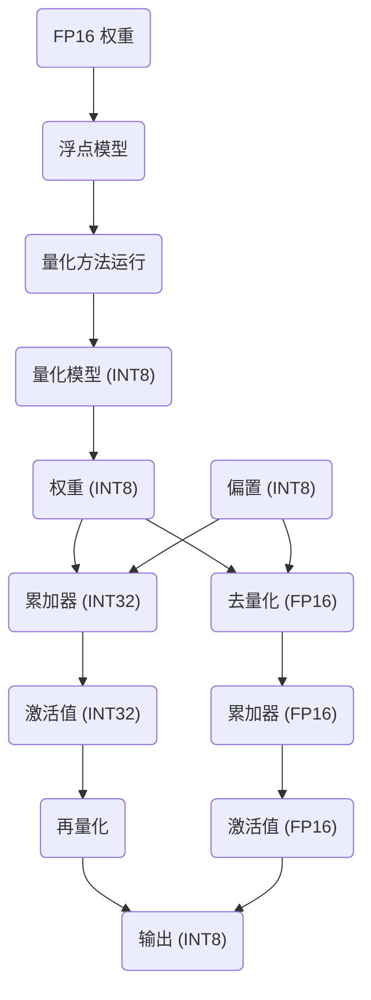

“模型量化过程”和“量化推理过程”示意图输入(INT8)

#### 5.3 量化格式和操作

一个 8-bit 机器数有256个可能取值，对应256个量化水平。量化水平指的是一个机器数取值所表示的浮点值。每个机器数取值分别表示什么浮点值取决于具体的量化格式和参数。如图5.5上半部分所示，对于均匀量化格式，相邻量化水平间的间隔是统一的；而对于非均匀量化格式，量化水平则不是等距分布的。如图5.5 下半部分所示，对于有符号对称量化格式，量化水平的分布关于。对称'；反之，对于有符号非对称量化格式，量化水平的分布关于0不对称。图中，n表示量化位宽。

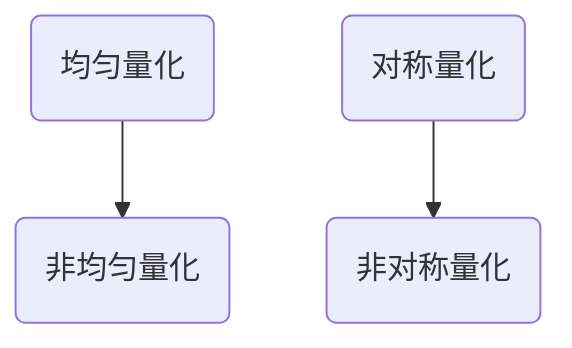

量化格式示意图

5.3.1 节将介绍均匀量化格式的量化和去量化操作，并借此引出多个重要概念。5.3.2 节将介绍包括低比特浮点格式在内的几种常见非均匀量化格式。5.3.3 节将介绍三个表示特定操作的常用名词：模拟量化操作、量化乘累加操作和再量化操作。模拟量化通常发生在模型量化过程中，而量化乘累加操作和再量化操作通常发生在量化推理过程中。

##### 5.3.1 均匀量化格式

1.  量化操作
    

式5.1 展示了以一个浮点格式的待量化（Quentize）数值 z（又称全精度数值）转換到一个均匀格式的量化值 zint 的量化操作：

$x\_{int}=clip \left( \left\[ \frac{x}{s\_{x}} \right\]+z;q\_{ \min},q\_{ \max} \right)\newline clip \left( x;a,b \right)= \begin{matrix} a&x<a \\ x&a \leq x \leq b \\ b&x>b \end{matrix}$

下面以式5.1中的均匀量化格式的量化操作为例，介绍量化格式和操作涉及的多个概念。浮点缩放系数（Scaling Factor） Sx与量化要点（Zero Point）z为待决定的的量化参数（Quantization Parameter ）。Qmin, Qmax 表示整型值的范围，该数值与量化位宽（Quantization Bit-width）和格式有关，例如在8-bit 有符号（Signed）均匀量化格式中，Qmin = -128, 9Imex = 127，在8-bit 无符号（Unsigned）均匀量化格式中，9hnin = 0, Qmax =255。clip（.）为截断函数（ClippingFunction），将超出范围的整型数据截断到范围端点。

Qmin, Qmax 对应表示的浮点数区间被称为量化区间（Quantization Range），在本章中将其记为\[Vmin,Vmax\]。

在式 5.1中，\[Vmin,Vmax\]［（Qmin -z）Sx，（Qmax -z）Sx\]。\[.\]为舍入函数（Rounding Function），常用的舍入函数包括最近舍入（Nearest Rounding） 和随机舍入（Stochastic Rounding）两种。可以看到，由于舍入函数的存在（以使用最近舍入为例），在一个子 区间内的浮点数会被映射到同一个整型值的范围，它们会被近似为同一个浮点值（量化水平，Quantization Level）。

一般将子区间长度（子区间端点之间的距离）称为量化间隔（Quantization Interval）。从式5.1中可见量化间隔为Sx。有时，量化间隔一词也用于表示子区间本身，其含义从上下文语境中应能看出。

量化格式的“均匀性”用于衡量量化区间内的所有量化间隔是否统一。所有均匀量化格式的量化操作都可以用式5.1 表示，区别在于参数的配置。例如，常见的参数配置可能有：量化零点参数，是否被规定为0，分别对应“对称”或“非对称”格式；缩放系数s为2的幂次还是浮点数（见5.5.3 节中关于此点的讨论）；量化粒度，即缩放系数和零点等量化参数的共享粒度（见5.4.1节）为“逐张量”还是“逐通道”，等等。下面将列出对称和非对称的均匀量化格式对应的量化操作。

（1）对称均匀量化。对称均匀量化里，零点参数z被规定为0。此外，量化结果分为有符号与无符号整型数两类，它决定了浮点数将被映射成哪些整型数。

当输出为 n-bit 有符号整型数时，原本的浮点数将被划分到 2的n次方个量化子区间，映射成负的2的n-1到2的n次方-1 的2的n次方种整型数。

当输出为无符号整型数时，则映射成0到2的n次方-1的2的n次方种整型数。对称均匀量化格式可以被表不为式：

$x\_{unsigned\\_int}=clip \left( \left\[ \frac{x}{s} \right\];0,2^{n}-1 \right)$

$x\_{signed\\_int}=clip \left( \left\[ \frac{x}{s} \right\];-2^{n-1},2^{n-1}-1 \right)$

（2）非对称均匀量化。如图所示，非对称均匀量化引入了一个零点参数 z以调整量化区间的位置。

$x\_{unsigned\\_int}=clip \left( \left\[ \frac{x}{s} \right\]+z;0,2^{n}-1 \right)$

$x\_{signed\\_int}=clip \left( \left\[ \frac{x}{s} \right\]+z;-2^{n-1},2^{n-1}-1 \right)$

2. 去量化操作

去量化（Dequantize）操作将量化后的表示（如式5.1中的 Xint）转换回更高位宽、更高精度的表示 （如转换回浮点数）。金为量化前数值 z的近似。去量化操作可由下面的式子表示：

$\widehat{x}=s\_{x} \cdot \left( x\_{int}-z \right) \approx x$

模型量化过程中常常需要用到去量化操作。这是因为量化方法需要计算量化后数值所代表的浮点近似值，以衡量量化带来的数值差异。5.3.3 节将介绍的模拟量化操作是一次量化与一次去量化操作的复合。量化推理过程中也可能会用到去量化操作。举例来说，当有不同量化缩放系数的张量一起参与计算时，可能需要将量化后的张量去量化，并在高位宽和高精度表示下完成计算，再重新量化回低位宽表示。

由于量化引入了误差，在式5.4中，$\widehat{x}$通常不等于x。量化误差可分为两部分：

截断误差（Clipping Error）和舎入差（Rounding Error），分別由式中的“截断”操作clip(.)与“舍入”操作［.］引入。

这两种误差存在权衡关系，在一定的量化位宽下，缩放系数参数Sx越小，量化区间就越小，落在量化区间之外需要被“截断”的数据点就越多，从而截断误差增加。与此同时，量化区间较小，量化间隔也相应较小，因此舍入误差相对较小。

换言之，在给定的量化位宽下，一个量化格式的表示范围（Representation Range，也称量化区间，即能表示的浮点数范围）和表示精度（Representation Precision，即能表示的最小浮点数差异）存在权衡关系。

5.3.2 非均匀量化格式

1. 浮点格式

5.3.1 节介绍了均匀量化格式及其相关操作，这种格式的量化区间内的所有子区间的长度（量化间隔）均相等。相反地，非均匀量化格式的量化区间内的量化间隔可能不相等。低比特浮点格式是一类非均匀量化格式，其特点是幅值较小的数之间的量化间隔较小，而幅值较大的数之间的量化同隔较大。这使得低比特浮点格式在具有较高表示范围的同时，在幅值较小的数字范围内保持较高的表示精度。在需要保持一定表示范围的情况下，8bit 以上的浮点格式通常比相同位宽的定点数格式的表示精度更高，并且其与单精度浮点格式的转换比较简单。因此，低比特浮点格式常用于需要同时兼容训练和推理的量化方法和硬件设计中100。例如，谷歌公司设计的 TPU160 在第二代以后就支持 BF16 （Brain Flostins Poit 19 bit） 格式。深慶学习常用的基础计算硬件，如NVIDIA公司的 GRU，也有许教彈品的 GFU支持 BF16 或1BEE FP16格式10。此外，一些对任务性能或通用性要求较高的推理扬紧也会采用低比特评点格式100-10。虽然浮点格式有较好的通用性和表示花图—数示稍選权飯，但浮点计鲜单兄的开销更大1阅，需要根据实际应用场景和硬件平台的需求和情况选择合适的格式。

二次幕量化，又称对数量化（Logarithm Quantization），是一种特殊的浮点格式，其只包含1个符号位和若干个指数位，不包含尾数位。它将数值量化为2的不同幂次乘以一个缩放系数。这种格式牺牲了数据表示精度，而注重取得更大的数据表示范围。对数量化格式表示的数的乘法计算可以利用移位操作实现，因此能够在通用和专用定制硬件上高效实现（详见 5.9.3 节对硬件实现的讨论）。尽管对数量化引入的舍入误差通常较大，但由于具有更大的表示范围，在一些极低比特场景下成为一种可选的非均匀量化格式。也有研究展示了对数量化格式在低比特训练上的应用潜力。

接下来，笔者总结一些常用的浮点格式信息，供读者参考。目前，通用的浮点数标准为IEEE754，该标准规定了浮点数的表示格式、特殊数值及舍入规则等。浮点数由三部分组成，即符号位、指数位和尾数位，分别由不同长度的二进制数表示。符号位通常由一位数字表示正负。指数位以二进制形式存储，将其转换为十进制后减去指数偏移值（Exponent Bias）即可得到所代表的指数大小。指数偏移值一般是

$2^{(E-1)} - 1$（E指数位的编码长度）。尾数位以二进制形式存储，按照无符号小数的方式将其转换成十进制后再加上1，即可得到所代表的尾数大小。记符号位、指数位、尾数位所转换成的十进制数分别为s、e、b，指数偏移值为 eo，则浮点格式机器数所表示的实际数值f的计算公式可以写作式 5.5：

$f= \left(-1 \right)^{s} \times \left( 1+b \right) \times 2^{e-e\_{0}}$

表5.2 常用浮点格式的位数配置、数据范围及下溢出精度

| 数据格式 | 位宽 | 符号位数 | 指数位数 | 尾数位数 | 表示范围 | 下溢出精度 |  |
| --- | --- | --- | --- | --- | --- | --- | --- |
| FP64 | 64 | 1 | 11 | 52 | −1.80×10^308 ~ 1.80×10^308 | 2.23×10^−308 |  |
| FP32 | 32 | 1 | 8 | 23 | −3.40×10^38 ~ 3.40×10^38 | 1.18×10^−38 |  |
| FP16 | 16 | 1 | 5 | 10 | −65504 ~ 65504 | 6.10×10^−5 |  |
| TF32 | 19 | 1 | 8 | 10 | −3.40×10^38 ~ 3.40×10^38 | 1.18×10^−38 |  |
| BF16 | 16 | 1 | 8 | 7 | −3.39×10^38 ~ 3.39×10^38 | 1.18×10^−38 |  |
| int8 | 8 | 1 | 0 | 7 | −128 ~ 127 | N/A |  |
| int9 | 9 | 1 | 0 | 8 | −256 ~ 255 | N/A |  |
| int16 | 16 | 1 | 0 | 15 | −32768 ~ 32767 | N/A |  |
| uint8 | 8 | 0 | 0 | 8 | 0 ~ 255 | N/A |  |

（1） FP64 代表双精度浮点数，通常用于需要高计算精度的应用。该格式在 NVIDIA GPU全系列显卡的 CUDA Core上都得到了支持。同时，在基于 Ampere 和 Hopper 架构的 NVIDIAA100 和 H100 的张量核中也增加了相应支持。

（2） FP32 代表单精度浮点数，是最常用的浮点格式。它在 NVIDIA GPU 全系列显卡的CUDA Core上得到了充分的支持，但目前还没有张量核支持单精度计算。谷歌的 TPU 也对其进行了相应的支持。

（3）FP16 代表半精度浮点数，占用的存储空间更小，可以极大地节约存储空间并加快计算速度。它被广泛应用在对计算精度要求不高但需要大量计算和存储的领域，例如深度学习。在 NVIDIA Pascal架构的 CUDA Core 上有 FP16 格式的计算单元，同时在 Volta、Turing、Ampere 和 Hopper 架构的张量核上也有相应的支持。谷歌的 TPU 也支持 FP16。

（4） TF32 是 NVIDIA Ampere 架构中引入的一种

浮点格式。其指数位采用与 FP32 相同的8位，因而具有相近的表示范围和下溢出精度，但由于尾数位减少到10位，表示精度有所降低。相比于 FP32，TF32 在保证数据范围的情况下舍弃了一定的精度，以降低位宽。对于数据范围重要性高于数据精度的深度学习任务，TF32 是有效的。NVIDIA A100 和E100的张量核支持该数据格式的计算。

（5）BF16 是一种16 位浮点格式，最初由谷歌在其 TPU 芯片中采用，并逐渐被其他芯片和处理器架构所采用。由于尾数位降低至7位，其表示精度进一步降低，但指数位保持与 FP32一致的8位，从而具有相近的表示范围。NVIDIA A100 和H100上的张量核均支持 BF16，同时也是谷歌 TPU 的主要计算格式。

2. 其他格式

为了同时获得更大的数据表示范围并保持对大多数数据的表示精度，一些方法会根据数据的具体分布来设计每个量化间隔的大小。这些方法给分布较为集中的区间分配更密的量化间隔，而为分布较分散的数据区间分配相对稀疏的量化间隔（39，140。尽管这类量化方法能有效降低量化误差，但在数字电路中对这种非均匀量化后的数据进行计算时，需要添加额外的计算电路对数据进行编解码。因此，这类非均匀量化方法在通用硬件上较少被使用。然而，在一些新兴的存内计算平台上，这类非均匀量化方法可以较好地发挥作用1Ta）。这是因为许多存内计算平台的计算发生在模拟域，其硬件架构中包括模拟一数字转换器。因此，当需要根据非均匀量化映射进行数招維解蹈时。可以通过修皮已存在的模拟一數字转换器的映射关系正确映射计鲜结果，无须添加额外的电路。

如上所述，记位宽为n，直接设计$2^{(n)}$个量化水平值或$2^{(n)} -1$ 个量化同隔大小的方式虽然能降低量化误差，降低任务性能损失，但对高效计算并不友好；为了实现对计算更友好的非均匀量化，不再直接设计量化水平或量化间隔，而是设计n个比特的每位所对应的基值大小。这种量化格式有非均匀的量化间隔根据数据设定n个基值后有希望在同样位宽下比均匀量化格式获得更低的量化误差。同时这种量化格式的计算可以借助位操作，达到更高效的实现。

#### 三种量化操作

1.  模拟量化操作
    

完整执行“量化一去量化”，将原始浮点张量 z转换成近似的浮点张量化的操作被称为模拟量化 （Simulated Quantize）操作，不少文献也用伪量化（FakeQuantize） 指代该操作。 Qs代表以s为缩放系数的模拟量化操作（也称模拟量化函数反括号），其计算可写作如下公式

$\begin{split}\widehat{x}=Q\_{s} \left( x \right)&=s \cdot \left( x\_{int}-z \right) \\ &=s \cdot \left( clip \left( \left\[ \frac{x}{s} \right\]+z;q\_{ \min},q\_{ \max} \right)-z \right) \end{split}$

该操作被称为“模拟量化”是因为它在离线的模型量化过程中“模拟”了量化对数据造成的影响。对于使用低精度整型计算单元的量化方法，图5.6（a）与图5.6（b）分别示意了量化推理过程和模型量化过程中的卷积计算。在量化推理过程中，卷积层的权重、偏置、输入、中间计算结果和输出均为整型，卷积计算为整型计算；而在模型量化过程中的卷积计算则是对量化推理过程低精度卷积计算的仿真，相关数据实际上都以高精度格式表示，卷积计算为浮点计算。**模拟量化**操作如式 5.6 所示，用于模拟量化卷积层的权重与输出（下一层的输入），以仿真量化对数据的影响。一些文献可能不会显式地引入“模拟量化”这一概念，而直接用“量化”指代模拟量化。


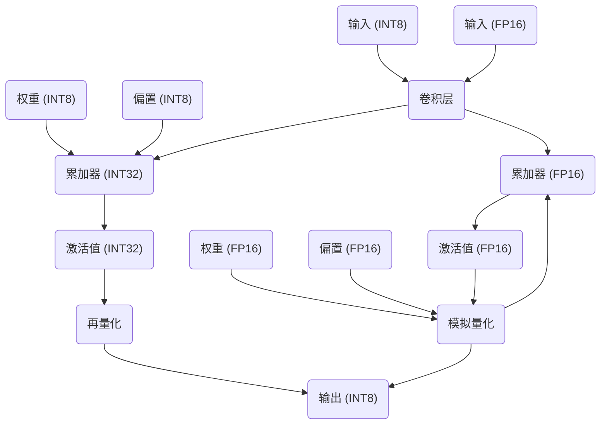

量化推理过程和模型量化过程中的卷积计算示意图

2. 量化乘累加操作

权重向量 w和输入向量 x的乘累加操作 A=b+$W^{(T)}x$。若使用量化后的表示进行权重向量计算，可以写为

$\widehat{A}=b+ \left( s\_{w} \omega\_{int} \right)^{T} \left( s\_{x}x\_{int} \right)\newline =b+s\_{w}s\_{x} \omega\_{int}^{T}x\_{int}$

$=s\_{w}s\_{x} \left( \widehat{b}+ \omega\_{int}^{T}x\_{int} \right)$

式中，b为偏置，Sw和Sx分别为权重向量 w和输入向量 x的量化缩放系数。经过改写后，原本的浮点计算转化成先进行整型乘累加，再乘以浮点缩放系数 SxSx，这减少了浮点计算量。整型乘累加后，累加器得到的中间结果是比 Wint 和 Xint位宽更高的整型数，该中间结果与整型偏置相加后，会经过一次“再量化”，得到低比特整型数。更多细节请读者参考5.9.2节。

3.再量化操作

前面曾提到，在硬件上运行定点乘累加计算时，乘法结果会经累加后再与偏置相加，得到高位宽的中间计算结果。例如，两个8-bit 数完成乘计算得到的结果是 16-bit 数，为了确保多个数累加结果不溢出，累加结果数需要更高位宽。另外，当需要一起计算的张量具有不同的缩放系数时，由于浮点缩放系数需要参与计算，计算结果将在高位宽下完成，得到高位宽的结果。

例如，由于架构中存在跳跃连接，具有不同缩放系数的张量可能需要逐元素相加；或者，当使用逐通道缩放系数时，乘累加计算也需要涉及缩放系数。如图 5.6（a）所示，我们需要将这些高位宽的中间计算结果量化回低位宽，以保证后续计算在指定位宽下进行，这一操作被称为再量化 (Requantize ).

再辨析一下“再量化”与“量化”这两个概念：通常，“再量化”指的是，量化模型实际执行时（量化推理过程中）由高位宽中间计算结果到低位宽整型数的操作；“量化”指的是，在给定浮点模型、生成量化模型的模型量化过程中，为张量（包括权重、激活值等）确定量化参数和量化值的操作。从输入和输出上看，式5.1 展示的量化操作输入为原始浮点数值，输出为该数值对应的缩放系数与低位宽整型数。而再量化操作的输入可能为高位宽整型数与对应的缩放系数，或已使用缩放系数去量化的浮点数。对于低位宽输出的量化参数，再量化操作有两种可能的处理方式：一种是已知输出的量化参数，只需计算其量化值；另一种是根据输入动态统计得到输出的量化参数（编放系数、零点），再计算其量化值，这一方式又被称为“动态量化”。

再量化操作有不同的硬件实现方式：一种方式是通过整型数的移位与截取，不涉及全精度操作（读者可参考5.92 节关于定点计算的讨论）：另一种方式如式 5.8所示，将中间高位宽计算结果转换成全精度数值 4+1后，重新量化回低位宽：

$\widehat{x}^{l+1}=s\_{w^{l}} \cdot s\_{x^{l}} \cdot x^{l+1}$

$x\_{int}^{l+1}=clip \left( \left\[ \frac{ \widehat{x}^{l+1}}{s\_{ \widehat{x}^{l+1}}} \right\]+z\_{ \widehat{x}^{l+1}};q\_{ \min},q\_{ \max} \right)$

式中,上角标l为层的编号,${x}^{l+1}$为第1层输出的高位宽计算结果,经过在量化操作后将成为 $x\_{int}^{l+1}$,即模型第l+1层的输入;

${s\_{ \widehat{x}^{l+1}}}$,$z\_{ \widehat{x}^{l+1}}$为输出的量化参数,可以在线根据${x}^{l+1}$ 动态统计，也可以在离线量化过程中确定并在线推理过程中固定。

#### 量化参数

5.3 节介绍了量化格式和量化操作，涉及缩放系数、零点位置、量化位宽等量化参数。这些参数的选择对量化模型的任务性能和推理效率起决定性作用。例如，对于量化位宽，将数值量化成核小位宽会提升推理效率，但也会带来更大的量化误差。对于缩放系数，较小的缩放系数意味省较小的表示范围（截断误差大）和较高的表示精度（舍入误差小）。由于不同位置和类型的张量的量化误差对任务性能影响不同，量化方法需要针对最终优化目标，即最大化量化模型的任务性能，合理选择各张量的缩放系數来权衡这两类量化误整。

通常，在量化模型中，多个数值会共享同一组缩放系数s和零点z，我们将共享这两个量化参数的多个数值称为一个量化组（Quantization Group），量化组的分组规则被称为量化粒度（Quantization Granularity）。最常使用的量化粒度包括逐张量量化（Per-tensor Quan-tization，或称 Tensor-wise/ Layer-wise Quantization）和逐通道量化（Per-channel Quantiza-tion，或称 Channel-wise Quantization）两类。前者对整个张量中的所有数值使用相同的量化参数；后者则将张量按通道维度切分，将切分出的每个子张量作为一个量化组。举例来说，对于形状为［Cout,Cin, Kh, Kw］的权重张量，逐通道量化意味着对应每个输出通道的权重（形状为［1,Cin, Kh, Ku］）共享同一组量化参数。除了这两类常见的粒度，还有逐通道量化（Channel-Group-wise Quantization）和更细粒度的亚通道量化（Sub-Channel-wise Quantization）的形式17。一般来说，量化粒度越小，量化带来的误差也越小，因而对任务性能造成的损失也越小。然而，使用过小的量化粒度会给模型的推理效率带来挑战。

下面将再次简介缩放系数、零点位置和量化位宽这三个重要的量化参数。5.5 节和5.6 节将展开介绍训练后量化和量化感知训练这两种量化流程中确定缩放系数和零点位置的具体方法。57 节将介绍为模型的不同部分选择量化位宽的混合位宽量化方法。

5.4.1 缩放系数

如5.3.1节所述（见式 5.4），缩放系数确定了量化区间和量化间隔，从而影响了舍入误差和载断误差这两种量化误差的平衡。量化方法应该为所有待量化的张量选择合适的缩放系数，以最小化最终的任务性能损失。图5.7展示了一个示例，说明选择合适的缩放系数以平衡两种量化提素要的总要性。为了简化说明。该示例以单个张量的量化误差（也称数据拟合均方限差（ MSE）作为最终目标，而不是任务性能损失。


图5.7 选择合适的缩放系数以平衡舍入误差和截断误差两类量化误差，以最小化数据拟合均方误差

缩放系数的选取方法可以分为以下两类。

（1）基于统计数值的方法选取一个量化组中绝对值的最大值或最大值乘以一个超参数（如0.75）作为截断阈值，并据此确定缩放系数。基于最大值的缩放系数选取方法易受到离群点影响，在训练后量化时尤为显著，因为权重不能进行训练调整。

（2）基于误差最小化准则的方法会以某种误差（如量化误差、重建误差、任务损失）的最小化为目标对缩放系数进行寻优，如最小化量化前后权重表示的均方误差176l 等。

5.5.3 节展开训练后量化流程时将介绍多种缩放系数的选取方法。在量化感知训练流程中，有一类特殊的缩放系数选取方法，即基于学习的缩放系数选取（将在 5.6.3 节介绍）。这类方法也属于基于误差最小化准则的方法，它将缩放系数作为可学习参数，并使用任务损失函数相对于缩放系数的梯度对其进行迭代更新。

5.4.2 零点位置

如5.3.1节所述（见式5.3），在“非对称均匀量化”中，“零点”指定了量化区间的中心。通过调整零点位置可以对量化区间进行平移，以最大限度地利用量化区间，降低量化的截断误差。引入零点可以显著改善数值分布均值非零的张量的量化效果。确定零点位置的方法可以通过以最小化量化误差为目标或者以最小化任务性能为目标等不同方式实现。

5.4.3 量化位宽

在神经网络模型中，不同类型的数据（权重、激活值、累加结果、偏置等）的分布和任务性能不同，关于它们的敏感度也存在差异，因此可能需要不同的量化位宽。举例来说，对于权重和激活值采用8bit量化是低比特量化推理的常见选择。而卷积计算的累加结果通常具有更大的动态范围，因此需要更高的位宽来表示。例如，当权重和激活值都使用 8-bit时，会使用24位或更高位宽的累加器。尽管在量化推理过程中会涉及使用不同位宽的数据，但通常提到的“量化位宽“指的是权重和激活值的量化位宽。权重和激活值可以使用相同的量化位宽，也可以使用不同的量化位宽。一般而言，激活值比权重具有更大的动态范围，因此需要更大的量化位宽。

除了对激活值、权重、累加结果、偏置等不同类型的数据使用不同的量化位宽，在硬件支持的前提下，还可以考虑为模型的不同部分（如不同层）选择不同的量化位宽。混合位宽量化方法将在 5.7 节介绍。

### 5.5 训练后量化

训练后量化对预训练后的模型进行量化。原始的训练后量化方法通常只需少量无标注数据，且通常不涉及耗时的权重训练过程，因而在工业界得到了非常广泛的应用。与此同时，相比于量化感知训练，训练后量化方法会对模型任务的性能造成较大影响，因此，如何优化训练后量化方法所产生的量化模型的任务性能成为研究热点。

本节将介绍训练后量化的基本流程与各步骤的常用技巧。5.5.1 节将介绍训练后量化的流程。5.5.2 节将以通道均衡与通道拆解两项技巧为例，介绍让模型更适应量化的模型重参数化技巧。5.5.3 节将介绍训练后量化中缩放系数的选取方法。5.5.4 节将介绍量化值的调整技巧，包括偏差校正与舍入函数调整。

5.5.1 训练后量化的流程

参考高通的量化白皮书“A white paper on neural network quantization” ），图5.8 给出了训练后量化方法的流程。

（1）重参数化。一个量化组内的数值动态范围可能很大且非常敏感，这样会导致，无论如何选取该量化组的量化参数（如缩放系数），都很难获得较低的量化误差。为了解决这个问题，在确定量化参数之前，可以对模型进行“重参数化”，即在保持计算等价性的情况下对模型进行一定的架构和权重变换，以调整模型的权重数值分布，使模型更适应量化。5.5.2 节将介绍一些典型方法，包括通道均衡和通道拆解。

（2）配置量化器。根据软硬件支持情况与任务性能需求配置量化器，包括选择量化格式、量化位宽等，5.8 节将介绍一些量化器配置的相关经验。

（3）确定权重量化参数。权重缩放系数的选取对求解量化问题非常关键。5.5.3 节将展开介绍具体方法。

（4）调整量化值。确定量化格式和量化参数后，可以通过类似于式5.1（该式仅对应均匀整型量化格式）的量化操作得到量化值。然而，这样得到的量化值 a int 可能需要进行校正。一方面，量化值所代表的浮点近似值 金可能与量化前的值 2 存在统计特性偏离，如均值、方差等。这种误差会逐层累积，最终可能影响任务性能。另一方面，任务损失函数受到权重间高阶关系的影响，尽管将权重量化至其最近邻整型值能最小化每个权重张量的量化误差，但未必能取得最佳任务性能。5.5.4 节将介绍用于改进量化模型性能的量化值调整技巧。

（5）确定激活值量化参数。在有少量校正数据辅助的情况下，可以基于数据的统计数值或基于误差最小化准则确定激活值的缩放系数。如果无法获取校正数据，但模型中包含批标准化层，则可以利用批标准化层中的激活值统计信息来确定缩放系数150。具体方法将在 5.5.3 节详细介绍。

目前，主流的深度学习训练或推理框架，如TensorFlowLite 、PyTorch 、 TensorRT）等均已集成训练后量化工具，读者可参考相关技术文档调用 API 实现模型的快速量化。

5.5.2 重参数化

本节将介绍两种用于提升训练后量化性能的重参数化技巧：通道均衡和通道拆解。这两种技巧都是针对逐张量量化的情况提升训练后量化性能的技巧，它们通过模型架构和权重的变换，在保持浮点模型计算等价的情况下，调整浮点权重或激活值的分布，使其对量化更为鲁棒通道均衡对相邻两层的权重通道施加变换以使各通道的权重大小分布更均匀，从而降低量化误差。通道拆解则通过复制通道并将该通道中的权重或对应输入浙办压缩权重或激活值中的离群通道的数值范围降低量化误差。

1.通道均衡

带量化张量的数值动态范围大时，会导致其进行逐张量量化时产生较大的量化误差。当数值动态范围过大时使用，如上节所述的缩放系数选取方法也无法获得足够小的量化误差。在深度可分离卷积中存在严重的通道间权衡分布不均衡的情况。下图展示了在批标准化层折叠后，mobilenetV2的第1个深度可分离卷积层的各个输出通道的权重分布情况。箱图展示了各通道权重的最大值最小值终值和上下4分位数。可以看出不同通道的取权重取值范围存在巨大差异。选择较小的缩放系数会导致取值范围较大的5、15、16、28、

29.30号通道的权重的截断误差大；而选择较大的缩放系数会导致权重的舍入误差较大。


图5.9 批标准化层折叠后，MobileNet-V2 的第一个深度可分离卷积层的各个输出通道的权重分布情况

逐通道量化（不要求通道间共享量化参数）可以有效避免上述问题，从而降低量化误差。然而，许多硬件平台仅支持逐张量量化的张量计算，因此仍有必要在保持逐张量量化的情况下给出上述问题的解决方案。通道均衡是一种解决方案。简而言之，通道均衡对某层中第i个通道的权重施加 1/8：的变换系数，同时，在该层邻层的对应通道权重上施加s；的变换系数。变换前后的浮点模型是等价的，通过设置合适的权重变换系数，可以使变換后模型的通道同权重分布更均匀。

**TBD在这里接着改**

对于许多常用的激活函数（如 ReLU、PReLU），当s>0时，以下等式成立：

$f \left( sx \right)=sf \left( x \right)$

式5.9对于任何一次齐次函数均成立。对于神经网络中连续的两层 $h=f \left( \omega^{ \left( 1 \right)}x+b^{ \left( 1 \right)} \right)$h=f（w（H）a+6（））和 $y=f \left( \omega^{ \left( 2 \right)}h+b^{ \left( 2 \right)} \right)$8=f（w（②）h+ 6（）），根据以上恒等变换，有

$\begin{split} y&=f \left( \omega^{ \left( 2 \right)}f \left( \omega^{ \left( 1 \right)}x+b^{ \left( 1 \right)} \right)+b^{ \left( 2 \right)} \right) \\ &=f \left( \omega^{ \left( 2 \right)}S \widehat{f} \left( S^{-1} \omega^{ \left( 1 \right)}x+S^{-1}b^{ \left( 1 \right)} \right)+b^{ \left( 2 \right)} \right) \\ &=f \left( \tilde{ \omega}^{ \left( 2 \right)} \widehat{f} \left( \tilde{ \omega}^{ \left( 1 \right)}x+ \tilde{b}^{ \left( 1 \right)} \right)+b^{ \left( 2 \right)} \right) \end{split}$

式中，S= diag（s） 为一对角矩阵，其中，Sw =3。 表示对第；个通道施加的变换系数。权重和偏置的变换如下：$\widetilde{ \omega}^{ \left( 2 \right)}= \omega^{ \left( 2 \right)}S, \widetilde{ \omega}^{ \left( 1 \right)}=S^{-1} \omega^{ \left( 1 \right)}, \widetilde{b}^{ \left( 1 \right)}=S^{-1}b^{ \left( 1 \right)}$在确定了模型各层的通道变换系数后，再进行逐张量量化。此技巧可以拓展到兼容任意分段线性函数f（通过调整分段端点和线性偏置，构造于满足 f（st）= sf（a）对式5.9进行扩展），读者可参考文献查看细节。

最理想的通道均衡结果是，权重各通道的数值范围都一致，此时，在通道间共享量化参数不会导致过大的量化误差Nagel 等人 统计第1层权重wl的第i个通道的数值范围计算其与整个张量的数值范围$R^{ \left( l \right)}=2 \cdot \max\_{i} \left( r\_{i}^{ \left( l \right)} \right)$具体来说，进行权重变换后，各通道的数值范围可由式5.11 计算得到

$\widetilde{r}^{ \left( l \right)}=2 \cdot \max\_{j}|S^{-1} \omega\_{ij}^{ \left( l \right)}|=S^{-1}r^{ \left( l \right)}$

$\widetilde{r}^{ \left( l+1 \right)}=2 \cdot \max\_{k} \left| \omega\_{ki}^{ \left( l+1 \right)}S \right|=r^{ \left( l+1 \right)}S$

权重张量的整体数值范 $\bm{\tilde{R}^{(l)}=2\cdot\max\_{i}(\tilde{r}\_{i}^{(l)})}$。为了使权重张量的各通道数值范围与整体数值范围可能接近，Nagel等人求解变换矩阵以最大 $\max\_{S} \sum\_{i} \widetilde{p}\_{i}^{ \left( l \right)} \widetilde{p}\_{i}^{ \left( l+1 \right)}$

$\left\{\begin{array}{l}\text{权重张量的整体数值范围}\ \bm{\tilde{R}}^{(l)}=2\cdot\max\_{i}\bigl(\bm{\tilde{r}}\_{i}^{(l)}\bigr)\_{ \circ}\ \ \text{为了使权重张量的各通道数值范围与整体数筐}\\ \text{范围尽可能搂近} ,\ \operatorname{Nagel}\ \text{等人求解变换矩阵}\ \bm{S}\ \text{以最大化}\ \underset{\bm{S}}{\max}\sum\_{i}\bm{\tilde{p}}\_{i}^{(l)}\bm{\tilde{p}}\_{i}^{(l+1 )} ,\ \ \text{其中} ,\ \bm{\tilde{p}}\_{i}^{(l)} = \frac{\tilde{r}\_{i}^{(l)}}{R^{(l)}},\\ \text{针对此目标的最优变换矩阵}\ \bm{S}\ \text{的矩阵元素满足}\ \bm{s}\_{i}=\frac{1}{\bm{r}\_{i}^{(l+1)}}\sqrt{\bm{r}\_{i}^{(l)}\bm{r}\_{i}^{(l+1)}} \_{\circ}\end{array}\right.$

当某个通道对应的通道均衡变换系数 ？？？于 1时，对应的偏置6”被放大。这会增大对应激活值通道的动态范围，导致激活值通道间的动态范围不一致，引入较大的激活值量化误差。针对此问题，Nagel等人提出以下方法，可将较大的偏置“吸收”进后一层。具体来说，若模型中的某一层激活函数f为 ReLU，对于任意输入 c 的集合 X，存在非负向量c，使得

$f \left( \omega x+b-c \right)=f \left( \omega x+b \right)-c, \forall x \in X\_{0}$

。很显然，全0向量c能够保证上述等式对任意X都成立。如果略微放松等价性要求，则该论断变为给定任意非全0的心的分布X，给定任意比例阈值0≤t＜1，存在c>0，使得对于超过 比例的a~X,

$f \left( \omega x+b-c \right)=f \left( \omega x+b \right)-c$

成立。此时，可以通过以下近似等价关系将本层偏置部分转移至相邻层：

$\begin{split}\bm{y}&=\bm{\omega}^{(2)}\bm{h}+\bm{b} ^{(2)}\\ &=\bm{\omega}^{(2)}(\bm{f}(\bm{\omega}^{(1)}\bm{x}+\bm{b}^{(1)})+ \bm{c}-\bm{c})+\bm{b}^{(2)}\\ &\approx\bm{\omega}^{(2)}(\bm{f}(\bm{\omega}^{(1)}\bm{x}+\tilde{ \bm{b}}^{(1)})+\bm{c})+\bm{b}^{(2)}\\ &=\bm{\omega}^{(2)}\tilde{\bm{h}}+\tilde{\bm{b}}^{(2)}\end{split}$

$\text{可以看到} ,\ \text{偏置的变换如下} ;\ \tilde{\bm{b}}^{(2)}=\bm{\omega}^{(2)}\bm{c}+\bm{b}^{(2)},\tilde{\bm{b}}^{(1)}= \bm{b}^{(1)}-\bm{c}\_{\circ}\ \text{变换后} ,\ \text{中间层的激活值和原}\newline \text{来的中问层激活值之问的关系为}\ \tilde{\bm{h}}\approx\bm{h}-\bm{c}\_{\circ}\ \text {Nagel}\ \text{等人提出将}\ \bm{c}\ \text{设置为}$

$\max \left( 0, \mu-3 \sigma \right)$其中u和 $\sigma$为该层激活值的均值和标准差。如果假设激活值呈正态分布，此变换可以使 99.865%的激活值（取值大于c）满足等价性。在无校正数据的情况下，Nagel等人建议使用批标准化层的偏移参和放錥参数~作为ム和の的估计。在有校正数据的情況下，可以统计激活值的分布参数以确定向量c。尽管上述偏置变换并非完全等价，即浮点模型的计算结果会发生改变，但是 Nagel等人通过实验说明，这种变换并不会显著地影响浮点模型的性能。此方法可以降低激活值量化带来的误差，从而在 ImageNet 上将激活值量化为 INT8 的 MobileNet-V2 的算法性能提升 1%。这类重参数化的技巧也被用于大语言模型的量化，如 Xiao 等人于 ICMI 2023 发表的SmoothQuant。在大语言模型中，不同权重通道的数值范围较接近；然而，某些激活值通道会出现许多大幅值的离群点，导致激活值难以被量化为 INT8。因此，SmoothQuant 对当前层第i个输出通道的权重乘以一个变换系数 si（对于输出激活值的数值范围大的离群通道，8 <1），得到更易于量化的激活值分布。与此同时，SmoothQuant 在下一层的第；个输入通道的权重上乘以变换系数 1/sto变换后，激活值分布更均匀，对量化的鲁棒性更好；虽然通道间权重分布略微变得更不均匀，但仍对量化较为鲁棒。使用通道均衡的重参数技巧，SmoothQuant 成功地将 OPT、GLM 等大语言模型的激活值和权重量化为INT8。

2. 通道拆解

如图5.9所示，待量化张量中经常存在部分通道的数值范围格外大的情况，这些通道通常被称为“离群通道”。为了处理这些离群通道，Zhao 等人提出离群通道拆解（Outlier ChannelSplitting,Ocs）方法。离群通道拆解将离群通道复制一份并折半其权重或输入激活值，从而降低离群通道的权重或缩小输入激活值的动态范围。变换后的浮点模型与变换前的功能等价，但通道间的数值范围更为均衡，对量化更为鲁棒。

具体而言，假设某一个线性层的输入为第 m个通道激活值向量公式，其中，28可为单一数值（对应全连接层）或二维特征图（对应卷积层）；用g=｛3｝｝=」表示输出，则线性层的计算可写作3=之罩」23 \*wij，其中，wzs表示连接2：和35的权重，\* 表示乘法或二维卷积。不失一般性，考虑对最后一维通道进行拆解，该层的计算可写作

$y\_{j}= \sum\_{i=1}^{m-1}x\_{i}\* \omega\_{ij}+ \left( x\_{m}\* \frac{ \omega\_{mj}}{2} \right)+ \left( x\_{m}\* \frac{ \omega\_{mj}}{2} \right)$

$\overrightarrow{或}y\_{j}= \sum\_{i=1}^{m-1}x\_{i}\* \omega\_{ij}+ \left( \frac{x\_{m}}{2}\* \omega\_{mj} \right)+ \left( \frac{x\_{m}}{2}\* \omega\_{mj} \right)$

式5.13 分别给出了拆解权重或拆解输入激活值的情况。在这两种情况下，第 m个通道都被拆

分成两个新通道。拆解函数的设计需要考虑量化效应。假设采用一个简化版的量化函数，即最近舍入函数9（z）= ［5+0.5］，如果使用最简单的拆解函数 OCS,oave（w0）=（w/）），则拆解后的两个数情在量化时会往同一个方向舍入，导致舍入误差比拆分前更大。为了解决这个问题，Zhao等人提出了如下的拆解函数 OCSoA （w0）=（品-8.3/分），使得拆分后的两个数值在量化时往不同方向會人，从而有效减少了拆解产生的额外舍入误差。

与直接截断离群通道的数值相比，离群通道拆解方法保留了离群值，但引入了额外的通道。

因此，需根据实际情况选择是否应用离散通道拆解、对几个通道应用离散通道拆解，以达到最优的性能—效率权衡。

5.5.3缩放系数的选取方法

缩放系数的选取是量化方法的关键。训练后量化不涉及对模型权重的大幅度训练调整，仅利用少量校正数据甚至无须数据，即可为所有张量选取缩放系数。本节将介绍在这种情况下可用的方法，包括基于统计数值的缩放系数选取方法和基于量化误差最小化准则的缩放系数选取方法。在确定权重的缩放系数时，这两种方法均无须校正数据的参与。而对于激活值的缩放系数，如果没有校正数据，则可考虑利用批标准化层中的参数和统计信息；如果有校正数据，则可采用基于量化误差最小化准则的缩放系数选取方法。

1. 基于统计数值的缩放系数选取方法

将一个量化组的最值作为量化区间是最简单的缩放系数的选取方法，可看作以最小化截断误差为准则，如式5.14所示。

$v\_{ \min}= \min V,v\_{ \max}= \max V$

式中，V为待量化张量的一个量化组，Vmax 与 Vmin 为量化区同的浮点数端点（如式5.1所定义）.它们被取为量化组中元素的最大和最小值；设量化为宽为n量化区间的端点可由下式转换为缩放系数。

$s= \frac{v\_{ \max}-v\_{ \min}}{2^{n}-1}$

然而这种方法容易受到数据分布中的离群值的影响，导致过大的舍入误差。在工程实践中可以考虑采用简单的启发式方法来缓解这个问题，例如将最值替换为分位数或者对最值乘以一定的系数等方式，以减少离群值对量化区间的影响，这种启发式设计隐含了权衡涉入与截断误差的思想，但不涉及针对特定优化目标的显示优化。

针对激活值量化，由于离线模型量化过程中无法访问所有激活值数据。多数量化方法会利用少数校准数据的统计信息，如均值方差等来确定量化区间，如果没有任何校准数据则可以利用批标准化层的参数来确定各个激活值通道的量化区间。

$v\_{ \min}= \min \left( \beta\_{i}- \alpha \gamma\_{i} \right)$

$v\_{ \max}= \max \left( \beta\_{i}+ \alpha \gamma\_{i} \right)$

$\beta$和$\gamma$分别为 标准化层中对应第i个通道的偏移参数和放缩参数阿尔法是一个可调系数，用于调整量化区间的长度，从而平衡截断误差与舍入误差，有人将阿尔法默认设置为6。

2.基于量化误差最小化准则的缩放系数选取方法

量化误差最小化是最常见的缩放系数求解准则，该准则要求模拟量化前后张量的数值尽可能接近，并据此确定缩放系数：

$\operatorname\*{arg min}\_{s} \left \| V-Q\_{s} \left( V \right) \right \|\_{norm}^{2}$

式中，$Q\_{s}$表示缩放系数为s的模拟量化函数（如式5.6所定义），II.llnorm是某个范数函数。

例如，当该范数为 Frobenius 范数时，式5.17表示最常用的目标函数，即均方误差。常用的求解方法包括网格搜索法（Grid Search Method）、黄金分割法（Golden Section Method）及解析计算求解法。这些方法被广泛应用，不同实现之间的差别在于采用的目标函数和求解方法不同。

早期工作图 将缩放系数限定为2的幂次，并通过离散搜索找到满足式5.17 的最优缩放系数。然而，将缩放系数限制为 2的幂次可能导致次优的任务性能。因此，许多后续方法放宽了缩放系数s的限制，使其能够取任意浮点数。

张量的量化误差仅是全局任务性能的一个较大差距的代理目标，因此基于该准则的缩放系数选取有时会被作为一些复杂量化方案的子过程（Sub-procedure ）。例如，Nahshan 等人提出了一种联合优化多层缩放系数的方法 LAPQ （Loss Aware Post-training Quantization）。首先，LAPQ通过分层优化获得各层缩放系数的初始值，再联合优化这些缩放系数。具体而言，该方法包括以下步骤：第一步，基于量化误差最小化准则，计算最小化量化误差的不同 p范数时各层的缩放系数：第二步，利用一个二次曲线f（p）拟合量化误差的p范数最小化所得到的整体任务损失，然后，利用拟合曲线确定能最小化整体任务损失函数的p值，得到各层对应的缩放系数，第三生，LAPQ 使用第二步得到的各层缩效系数作为初始值，采用 Powel的方法10） 联合优化各层缩放系数，以减小整体任务性能损失。

常用的目标函数均方误差在处理量化误差时会平等地对待张量中的各个元素。当不同元案的量化误差对任务性能的影响程度不同时，可能导致次优的任务性能。例如，当对分类网络的最后一层激活值求解量化参数时，相比于最小化张量的醛体量化误差，保持张量中最大值的排序更为重要。如果使用均方误差作为目标函数来求解缩放系数，则可能会显著降低任务性能。在这种情况下，可以考虑将目标函数替换为交叉熵损失函数，其中，H（）代表交叉熵函数，o代表 Softmax 函数。

3. 基于量化误差最小化准则的解析计算求解法

Banner 等人提出了基于解析计算的缩放系数选取方案 ACIQ（Analyticel Clipping forInteger Quantization）1249。ACIQ 假设待量化数据服从高斯或拉普拉斯分布，基于量化误差最小化准则对缩放系数进行解析求解。

若一个待量化张量里的每个元素独立同分布地服从 Laplace（0,6）分布，则可以通过下述推导求得将其对称均匀量化至 M-bit 时的最优缩放系数。设量化区间为［-c,Q］，等分成2M个长度为=器 的量化间隔。如图 5.10所示，落入某个量化间隔的数值被近似为该间隔的中点值，即对i€［0,24-1，取值在区间$\left\[- \alpha+i \cdot \Delta,- \alpha+ \left( i+1 \right) \cdot \Delta \right\]$］的数值模拟量化后的量化水平为$q\_{i}=- \alpha+ \left( 2i+1 \right) \frac{ \Delta}{2}^{1}$


图5.10 ACIQ 中的量化间隔、量化水平、对概率密度函数的分段线性近似

原始数值与其模拟量化数值之间的均方量化误差的期望为

$\begin{split}\mathbb{E}\[(\bm{X}-\bm{Q}(\bm{X}))^{2}\]=& \int\_{-\infty}^{-\alpha}f(x)\cdot(x+\alpha)^{2}\mathrm{d}x+\sum\_{i=0}^{2^{M}-1 }\int\_{-\alpha+i\Delta}^{-\alpha+(i+1)\Delta}f(x)\cdot(x-q\_{i})^{2}\mathrm{d}x \\ &+\int\_{\alpha}^{\infty}f(x)\cdot(x-\alpha)^{2}\mathrm{d}x\end{split}$

式518右侧第一项和第三项表示截断误差，第二项表示舍入误差，$f(x)$ 为原始数值的概率密度函数。ACIQ 通过以Qi为分段点的分段线性函数近似$f(x)$，将${\alpha}$式 5.18 近似为

$\mathop{\mathbb{E}}\[(\bm{X}-\bm{Q}(\bm{X}))^{2}\]\approx 2\cdot b^{2}\cdot \mathrm{e}^{-\frac{\alpha}{b}}+\frac{2\cdot\alpha^{3}}{3}\cdot\sum\_{i=0}^{2^{M }-1}f(q\_{i})=2\cdot b^{2}\cdot\mathrm{e}^{-\frac{\alpha}{b}}+\frac{\alpha^{2} }{3\cdot 2^{2^{M}}}$

令该式关于 的偏导数为0，即可求出如式 5.20所示的最优 a\* 应满足的关系，从而求出缩放系数：

$\left. \frac{ \partial E \left\[ \left( X-Q \left( X \right) \right)^{2} \right\]}{ \partial \alpha} \right|\_{ \alpha= \alpha^{\*}}= \frac{2 \alpha^{\*}}{3 \cdot 2^{2^{M}}}-2be^{- \frac{ \alpha^{\*}}{b}}=0$

5.5.4 量化值调整

本节将介绍在训练后量化中用于优化量化值的两种方法：**偏差校正与舍入调整**。这两类方法都是在确定了权重缩放系数的前提下，对权重或偏置的量化值进行离线微调，以实现更优的任务性能。这两种方法都发生在模型量化过程中，不会增加实际量化推理过程的开销。就数据需求而言，偏差校正方法可以在没有数据的情况下进行，而舍入调整方法则需要少量数据。

量化前后的数值分布在统计意义上不可避免地存在偏离，而这种偏离的累积会导致最终任务性能的下降。基于这个分析，偏差校正通过调整权重或偏置的量化值，保证权重或激活值的分布特性不发生偏移，以期改善最终任务的性能。

舍入调整的相关研究指出，单个权重粒度上的舍入误差最小化（将权重量化至其最近的整数值）忽略了权重之间的高阶关系，这可能导致任务性能次优。因此，舍入调整方法在权重的舍入函数中引入可调整偏置，或为权重的舍入提供更多可行的整数选项，以基于最小化任务性能损失或其近似的准则选取具体的舍入值。

1.偏差校正

对权重偏差的校正。量化前后的权重在均值和方差上存在偏差，用${ \omega}\_{c}$和TBD。表示通道c中权重及其模拟量化后的权重，则该现象可描述为$E \left( \omega\_{c} \right) \neq E \left( \widehat{ \omega}\_{c} \right),|| \omega\_{c}-E \left( \omega\_{c} \right)||\_{2} \neq$$| \widehat{ \omega}\_{c}- E \left( \widehat{ \omega}\_{c} \right)| |\_{2}$。 Banner 等人在ACIQ 方法里逐通道计算校正常数 Me 与5：

$\mu\_{c}=E \left( \omega\_{c} \right)-E \left( \widehat{ \omega}\_{c} \right)$

$\xi\_{c}= \frac{ \left \| \omega\_{c}-E \left( \omega\_{c} \right) \right \|\_{2}}{ \left \| \widehat{ \omega}\_{c}-E \left( \widehat{ \omega}\_{c} \right) \right \|\_{2}}$

随后，可对量化后的权重进行变换 $\omega \leftarrow \xi\_{c} \left( \omega+ \mu\_{c} \right), \forall \omega \in \widehat{ \omega}\_{c},$以补偿权重量化产生的偏差。

对激活值偏差的校正。量化前后模型一层的输出激活值的均值存在偏差，$\text{即}E \left\[ \omega x \right\] \Rightarrow E \left\[ \widehat{ \omega}x \right\]$

${E} \left\[ \widehat{y} \right\]={E} \left\[ \widehat{ \omega}x \right\]={E} \left\[ \left( \omega+ \Delta \omega \right) x \right\]={E} \left\[ \omega x \right\]+{E} \left\[ \Delta \omega x \right\]$

不相等。一些研究156，18.，187 指出，可以通过调整偏置来校正激活值的偏差。激活值的校正一般基于局部重建误差最小化的原则，并要一些校正数据的辅助项。Aw 为一个常值向量，因此回Awa）=AwE（对。当Aw卫（对］不为零时，输出激活值的均值就会存在偏差。为了校正这一偏差，可以将该项从输出中减去，得到 gcor，其均值为Elscord=四jca-Aw四（ag=\_a。这个校正项与偏置的形状相同，因此可以将其合并到原偏置中。

校正项可使用少量校正数据逐层进行计算。当无校正数据时，Nagel 等人利用当前层之前的批标准化层的偏移参数 日 和缩放参数 估计该批标准化层的输出aPxo的分布，即认岁aPe 的第c个通道 202 的元素均服从正态分布N（8.，7），其中，B。和%是8和 的第c个通道的元素。这样，可以估计出当前层输入 z=ReLU（apne）的第c个通道 2。的期望值

$\boxed{\begin{aligned} \mathbb{E} \left\[ x\_{c} \right\]=\mathbb{E} \left\[ ReLU \left( x\_{c}^{pre} \right) \right\]= \gamma\_{c}p\_{N} \left(- \frac{ \beta\_{c}}{ \gamma\_{c}} \right)+ \beta\_{c} \left\[ 1- \Phi \left(- \frac{ \beta\_{c}}{ \gamma\_{c}} \right) \right\] \end{aligned}}$

式中，更（）为标准正态分布的累积分布函数，Pv（.）为标准正态分布的概率密度函数。

2. 舍入调整

确定放缩系数后，根据式 5.1，量化函数将缩放后的数值舍入至一个整型值。最简单、常用的舍入函数为最近舍入，即将浮点数值舍入到最接近的整数。然而，受到权重间高阶关系的影响，对每个权重独立进行最近舍入可能不能最优化任务性能，甚至难以最优化局部重建误差。针对此问题，一系列工作对舍入函数进行改进，允许数值被舍入至近邻的若干整数，并针对重建误差或任务性能最小化的目标决定具体舍入值。

AdaRound 对模型的所有层进行顺序处理，逐层根据少量数据的重建误差决定每个权重应该向上还是向下舍入。在 AdaFound 的基础上，AdaQuant 扩展了舍入值的优化空间，允许权重被量化至其相邻的若干整数，而不仅限于最接近的两个整数；块重建量化方法（Block Reconstruction Quantization, BRECQ） 改变了代化同題的折解粒度，将“逐层”最小化重建误差改为“逐块（多层）”最小化重建误差。

这里先借助 AdaRound中的例子说明将每个权重独立进行最近舍入为何不能最优化任务性能。以权重向量w表示模型的所有权重，Xy表示模型的输入和输出对权重施加微小干扰w则任务损失函数l括号xyw的变化可写为下式 ：

$\begin{split}\mathbb{E}\[\mathcal{L}(\bm{x},\bm{y},\bm{\omega}+ \triangle\bm{\omega})-\mathcal{L}(\bm{x},\bm{y},\bm{\omega})\]& \overset{(a)}{\approx}\mathbb{E}\left\[\triangle\bm{\omega}^{ \mathrm{T}}\cdot\nabla\_{\bm{w}}\mathcal{L}(\bm{x},\bm{y},\bm{\omega})+\frac{1} {2}\triangle\bm{\omega}^{\mathrm{T}}\cdot\nabla\_{\bm{w}}^{2}\mathcal{L}(\bm{x},\bm{y},\bm{\omega})\cdot\triangle\bm{\omega}\right\]\\ &=\triangle\bm{\omega}^{\mathrm{T}}\cdot\bm{g}^{(\bm{\omega})}+ \frac{1}{2}\triangle\bm{\omega}^{\mathrm{T}}\cdot\bm{H}^{(\bm{\omega})}\cdot \triangle\bm{\omega}\hskip 72.27pt\text{}\end{split}$

式中的近似（a）为二阶系制级数限开，在扰动较小的情況下，可取得良好的近似效果；gCc）和\[(0) = EVEC(2, 2,4)0

如果模型已经训练收敛到局部最优，则认为式5.28中的一阶项可以忽略不计。权重间高阶互相作用对任务损失的影响由H（w）刻画。考虑一个简单的两权重的例子：AwT=［Lw）Aw2），

B= 0.5 1，则可近似认为权重批动产生的任务损失与 AwT.E（w）.2w = 2af +成正比。可以看出，若不考虑权重间的高阶关系（认为HI（w）中非对角项为0），该式只余有Aw？与Aw号两项，则意味着损失仅与权重扰动的大小相关。此时，对每个权重独立进行最近舍入产生的损失最小。然而，若考虑权重间的高阶关系，对每个权重独立进行最近舍入忽略 Aw1，w2项的影响（忽略了FI（w）中非对角元素的影响），则可能导致次优的损失。

Nagel 等人通过泰勒展开和对 Hessian 矩阵的近似，将优化目标从全局任务损失最小化转换成逐层局部重建误差最小化，并提出量化值舍入调整方法 AdaRound。这里省略其对全局任务损失函数的近似推导，感兴趣的读者可查看参考文献［146］。针对逐层重建误差这一优化目标，AdaRound 需要求解的优化问题可以形式化为

$\begin{split}\underset{\bm{v}}{\arg\min}&\parallel \bm{\omega x-\tilde{\omega}x}\parallel\_{\mathrm{F}}^{2}\\ \text{s.t.}& \bm{\tilde{\omega}=s\cdot clip}\left( \left\lfloor\frac{\bm{\omega}}{s}\right\rfloor+\bm{v},q\_{\min},q\_{\max}\right),\bm{v}\in\{0,1\}^{\mathrm{size}(\bm{\omega})}\end{split}$

式中，1• 表示 Frobenius 范数，w 和 分别为原始权重和经过模拟量化后的权重，L」为向下取整函数，s为缩放系数。可以看到，AdaRound 的优化空间为离散空间｛0,1｝sie（w），即为每个权重决定该向下取整（2=0）还是向上取整（2=1）。 求解此优化问题，AdaRound 将待优化的离散变量 松弛到连续空间［0, 1jspe（w），并将变量替换为无约束变量V，满足 =h（V），其中h（）为任意值域为10, 1］的可微函数（Nogel 等人选用修正的 Sigmoid 函数）。这样，AdaRound将离散优化问题转化为无约束连续优化问题；

$arg \min\_{V} \left \| \omega x- \widetilde{ \omega}x \right \|\_{F}^{2}+ \lambda f\_{reg} \left( V \right)$

$s.t. \omega=s \cdot clip \left( \left \lfloor \frac{ \omega}{s} \right \rfloor+h \left( V \right),q\_{ \min},q\_{ \max} \right)$

其中，V 为无约束的连续优化变量，正则项 frog（V）的作用是将h（Ys）的取值推向0或1。

式5.25 未考虑前层量化对输入 z引入的激活值量化误差与激活函数的影响。考虑这两个因茶后，AiaR.oind 所采用的优化目标可以写作：

$\boxed{ \begin{matrix} arg \min \left \| f\_{a} \left( \omega x \right)-f\_{a} \left( \tilde{ \omega} \widehat{x} \right) \right \|\_{F}^{2}+ \lambda f\_{reg} \left( V \right) \\ V \end{matrix}}$

其中，主 表示前层依次量化后当前层的输入，f。表示激活函数。AdaBound 使用少量无桥多（（Label-free） 数据，顺序逐层使用 Adam 优化器求解式 5.26 中的优化问题，为每个权重决定舍入。

后续工作 AdaQuantlL50l扩大了AdaRound 中权重舍入的优化空间，不再限制数值只能後舍入为最接近的两个整数，并将缩放系数纳入优化空间：

$\left( s\_{ \omega\_{l}}^{\*},s\_{x\_{l}}^{\*},V\_{l}^{\*} \right)= \underset{s\_{ \omega\_{l}},s\_{x\_{l}},V\_{l}}{arg \min} \parallel \omega\_{l}x\_{l}-Q\_{s\_{ \omega\_{l}}} \left( \omega\_{l}+V\_{l} \right) \cdot Q\_{s\_{x\_{l}}} \left( \widehat{x}\_{l} \right) \parallel^{2}$

式中，Sw,8z分别表示权重与激活值对应的缩放系数，下标！表示层编号，Qs（）代表缩放系数为s的模拟量化函数，金：为经过非线性函数的前一层输出激活值 立1=fa（Q8w1-1（WL-1+V-i

与式5.24对比，可以看到，AdaQuant 引入的辅助参数 V 是加到w上的无约束连续变量，而不是加到L”」上的离散变量~ €｛0,1｝sue（w）。AdaQuant 的优化空间扩展了权重舍入的可能性，同时引入了缩放系数，有望实现更优的任务性能。

AdaRound 与 AdaQuant 均将整体优化问题按层分解并顺序求解每层的重建误差最小化问题，忽略了不同层权重之间的高阶关系。Li等人14T 认为，在量化位宽较低，即Aw较大的情况下，这种方法并不适用。他们提出增大每个子优化问题的粒度。然而，考虑到训练后量化流程中校正数据较少的情况，如果将粒度扩大到整体模型（直接重建整体模型的输出），则可能会导致求解结果过拟合校正数据集，降低泛化能力。因此，Li等人提出的 BRECQ 方法按照模型中多层组成的块（如 ResNet 中的 Bottleneck 块）来拆解并求解优化问题。BRECQ 的每个子优化问题的优化目标如式 5.28 所示。

$\operatorname\*{arg min}\_{\bm{V}}\ \ \mathbb{E}\left\[ \triangle\bm{z}^{(l),T}diag \left( \left( \frac{ \partial \mathcal{L}}{ \partial\bm{z}\_{1}^{(l)}} \right)^{2}, \cdots, \left( \frac{ \partial \mathcal{L}}{ \partial\bm{z}\_{a}^{(l)}} \right)^{2} \right) \triangle \bm{z}^{(l)} \right\]+ \lambda f\_{reg} \left( \bm{V} \right)$

其中，Az（） 表示网络第1层的重建误差，1为每个重建块中最后一层的标号。权重舍入函数引舍入调整方法为待量化权重引入额外优化变量，允许权重被量化至其近邻的若干整数，然后利用少量数据、针对激活值直建误差在小花围内调整拟匪的最化位。这些方法在训练后量化流整中引入了权重优化过程，可以看作训练后量化和發化感知训练两类方法的销合。从方法对数据的需求角度考虑，如果将无须數握的训练后量化方法与爾要大薑训练数据的最化感知训练方法视为“数据得求光滨”的两个端点，则需要少盤校正数据的训练后量化令人调繁方法可视为此“光谱”上的一种中间情形。

3.1.1 A Use Case of LLM-Viewer:Roofline Analysis for Quantization

在这里，我们将展示如何使用我们的LLM-Viewer（第2.3节）来分析LLM部署中的瓶颈。在LLMs中，张量由权重和激活组成，其中激活包括临时激活和KV缓存。

（1）LLM的权重必须存储在内存中。例如，具有130亿个权重的Llama-13b Touvron等人在FP16格式下占用大约26GB的内存。

（2）临时激活是在推理过程中产生的。例如，每个变换器层的输入需要保留在内存中，直到执行残差相加。

（3）对于自回归LLMs，为了生成后续的令牌，将键和值激活（KV缓存）存储在内存中是必要的。

我们利用LLM-Viewer从计算、内存消耗和内存访问三个角度分析量化对这些张量的影响。

#### Computation

最新的计算设备，如NVIDIA的GPU，通常支持FP32、FP16和INT8等数据类型进行计算。硬件设备在处理位宽较小的数据时，一般表现得更出色。例如，NVIDIA的A6000 GPU在使用FP16时的运算速度能够达到155 TOP/s，而使用INT8时则提升至310 TOP/s，性能翻倍。在Roofline模型中，当启用量化以实现更快的计算时，屋顶线的高度增加，表明对于计算密集型层的性能有所提升。如图6所示，使用INT8计算时最大性能得到了提高。然而，为了利用INT8的计算能力，所有输入操作数必须都是INT8格式。因此，如果只有权重被量化为INT8，而激活值仍保持在FP16格式，那么INT8的计算能力就无法得到利用。相反，INT8权重需要转换为FP16以便与FP16激活值相乘。此外，当张量被量化为硬件不支持的位宽时，它们需要转换为更高位宽进行计算。例如，NVIDIA的H100 GPU不支持INT4计算。因此，如果权重或激活值被量化为INT4，就需要转换为更高位宽，如INT8或FP16，以便进行计算。


图6. 展示了Nvidia A6000 GPU在不同计算数据类型下的 Roofline 模型。

#### Memory Consumption:

量化不同张量后内存消耗的减少程度各异，如图7-4所示。值得注意的是，临时激活的内存使用相对较低，尤其是在解码阶段。这可以归因于它们生命周期较短，一旦完成其用途即可释放其内存。另一方面，分配给KV缓存的内存表现不同。它必须保留到生成完整答案的整个过程结束，这涉及到多次通过网络进行推断。而且，随着批量大小的增加和输入序列变长，KV缓存的内存消耗也会增加。这是因为模型需要存储更多的键值（KV）对以支持其操作。


图7展示了不同量化设置下Llama-2-13b的相对内存消耗。Tmp Act表示临时激活。

#### Memory Access:

在大型语言模型（LLM）中对张量进行量化可以显著减少内存访问需求，使得相同计算量所需的数据字节数减少。这种算术强度的提升符合 Roofline 模型，导致三种情况：

(1) 量化后，算术强度仍然处于内存受限范围内。随着算术强度的提高，每单位计算的数据访问平均值降低，减轻了数据内存访问的压力。因此，理论性能得到增强。这在内存受限的解码阶段特别能大幅提高性能。

(2) 算术强度由内存受限转变为计算受限。这种转变同样减少了对数据内存访问的压力，从而提高了理论性能。

(3) 无论量化前还是量化后，算术强度都保持在计算受限范围内。在这种情况下，不会有性能上的改进。例如，这种情况可能发生在计算受限的预填充阶段，或者解码阶段批处理大小较大时。

如图8所示，当批处理大小较小时，网络中的层在量化前后都是内存受限的。因此，量化可以提升性能并减少网络的推理时间。然而，当批处理大小较大时，将网络权重从4位压缩到2位或1位并不会减少推理时间。这是因为此时网络已经是计算受限的，量化权重变得无效。与前一场景类似，在预填充阶段系统表现也可能出现饱和效应。如图9所示，当序列长度相对较短时，预填充阶段是内存受限的。在这种情况下，通过量化可以减少网络的内存访问需求，从而提升性能。但是，随着序列长度增加，预填充阶段变得更加计算受限。因此，当预填充阶段因长序列而已经是计算受限时，量化权重可能不会带来显著的性能提升。


图8展示了在不同量化设置下，Llama-2-13b模型解码阶段的推理时间。（序列长度=1024）

### (1) QAT

5.6量化感知训练

在一些任务和模型上，应用训练后量化方法难以取得优秀的任务性能，尤其是在面对较低位宽的情况下，例如4-bit、2-bit 等。为了解决这个问题，可以考虑采用量化感知训练方法。量化感知训练通过在训练过程中模拟量化操作，让权重适应量化带来的误差，从而获得更好的任务性能。

本节将介绍量化感知训练的流程与常用技巧：5.6.1 节将介绍量化感知训练的基础与流程；5.6.2 节将介绍针对量化感知训练调整模型架构的方法；5.6.3节将介绍量化感知训练中量化器设计的技巧；5.6.4 节将介绍常用的训练技巧。

transformer模型适合做PTQ吗？

A：对于 QAT和PTQ 两种量化，不同模型的量化友好性是不同的，不能一概而论的，但整体来说， QAT是相对精度更有保障，必须要说明的是，Transformer类型的模型既可以使用PTQ，也可以使用QAT（量化感知训练），具体取决于多种因素：

数据方面： 如果没有足够的带标签数据用于进一步训练，因为PTQ仅执行小型统计数据收集来确定量化参数，无需带标签的数据，所以PTQ更合适

精度方面： 通常情况下，PTQ可能会导致一定的精度下降，虽然一些改进的方法可以提升精度，但总体上在复杂的Transformer模型上可能仍不如QAT。

模型规模和计算资源方面： PTQ不需要重新训练模型，在计算资源和时间消耗上相对QAT较少，对部署时间比较急迫情况下PTQ更有优势，而QAT需要进行重新训练，计算成本和算法复杂性较高，需要计算资源和时间也更多。

量化难度方面：Transformer模型中Softmax、GELU等特殊函数激活值分布复杂，传统PTQ方法通过量化参数变得困难，可能导致较大量化误差。

#### 5.6.1 基础与流程

为了在训练中考虑量化带来的影响，量化感知训练在模型前向传播过程中显式地对权重与激活值调用模拟量化函数 Qs（.）（如式5.6 所示）。神经网络模型通常使用梯度反传和梯度更新进行训练，因此需要定义模拟量化函数的梯度反传操作。以最常使用的最近舍入函数为例，该函数的导数为一系列冲激函数，在数轴上取值几乎处处为0，这会阻断梯度的反向传播，不利于训练。为了解决这一问题，研究者使用直通梯度估计器（Straight Through Estimator, STE），如式5.29所示，反向传播过程中认为量化器中舍入函数的导数处处为1。

$\frac{\partial\[x\]}{\partial x} =1\qquad\qquad\qquad\qquad\qquad\qquad\qquad\qquad\qquad\text {(5.29)}\newline \text{此时} ,\ \text{模拟量化函数}\ Q\_{s}(\cdot)\ \text{的输出}\ \hat{x}\ \text{关于输入}\ x\ \text{的梯度如式}\ 5.30\ \text{所示}\_{\circ}\newline \frac{\partial\hat{x}}{\partial x} =\frac{\partial Q\_{s}(x)}{\partial x}=s\cdot\frac{\partial x\_{ \mathrm{int}}}{\partial x}=s\cdot\frac{\partial}{\partial x}\mathrm{clip}\left( \left\[\frac{x}{s}\right\];q\_{\mathrm{min}},q\_{\mathrm{max}}\right)\newline \qquad\qquad\qquad\qquad\qquad\qquad=\begin{cases}s\cdot\dfrac{ \partial\[x/s\]}{\partial(x/s)} \dfrac{\partial(x/s)}{\partial x}&v\_{\mathrm{ min}}\leqslant x\leqslant v\_{\mathrm{max}}\\ s\cdot\dfrac{\partial q\_{\mathrm{min}}}{\partial x}&x<v\_{\mathrm{min}}\\ s\cdot\dfrac{\partial q\_{\mathrm{max}}}{\partial x}&x>v\_{\mathrm{max}}\\ \end{cases}\qquad\qquad\qquad\qquad\qquad\qquad\qquad\qquad\qquad\qquad\qquad\newline =\begin{cases}1&v\_{\mathrm{min}}\leqslant x\leqslant v\_{\mathrm{ max}}\\ 0&\text{否则}\end{cases}$

$\begin{array}{l}\text{筒便起见},\ \text{假设式}\ 5.30\ \text{对称量化}\ \left( z=0 \right),\ \text{此时有}\ q\_{\min}=v\_{\min}/s, q\_{\max}=v\_{\max}/s\_{\circ}\\ \text{如下代码给出了使用直通梯度估计器} ,\ \text{最近舍人的模拟量化函数的}\ \mathrm{PyTorch}\ \text{实现}\_{\circ}\\ \hline\end{array}$

```plaintext
det simulated quantize(x, scale, zero_point, quant_min, quant_max) 
输入：
x：待量化张量。
scale：输入张量x对应的缩放系数。
zero_point：输入张量x对应的零点。
quant_min：定点数值的最小值，对应式中的q_min。
quant_max ：定点数值的最大值，对应式中的q_max。
中间变量：
x.int：量化后整型形式的x（仍以浮点格式仿真）。
返回：
x_hat：模拟量化后的x。
## **Quantize** the input tensor
x = x / scale + zero_point