# 模型部署-软硬一体优化技术-书稿【概念连接关系】

# 算法工程优化--Efficient Inference of LLM

1.computer -use broswer-use 太慢，大模型推理 ，多模态和超长文本云端推理太慢，怎么修改架构来解决

# 第1章 算力、算法与数据：智能设备的高效部署

在人工智能和数字经济的时代，数据、算法和算力已成为推动创新的三大核心要素。其中，算力作为数字经济的物理载体，承载着算法实现与落地的计算需求。在实际应用中，数据通过硬件设备生成，并通过深度学习等算法挖掘其价值，最终形成部署于计算机系统的解决方案，帮助解决社会中的实际问题。

本书旨在为产品经理、硬件工程师、算法工程师、项目经理、数据科学家、技术VP及企业创始人等技术从业者，尤其是接触到算法但缺乏深入理解的人士，提供从算法设计到实际部署的全面指南，确保项目的顺利实施。

## .1 从二维到三维的技术进化与数据扩展

随着物联网、智能设备和自动驾驶技术的快速发展，数据的生成和使用从传统的二维行为数据向三维环境交互数据扩展。举例来说，智能手机通常记录二维的行为数据，而智能网联汽车则能够捕捉到三维空间下更加复杂和丰富的交互数据。这类高维数据的市场价值远超以往，驱动了对更复杂算法的需求。

这些算法通过建模现实问题，提取和分析数据，并使用计算机进行实时计算，为各种人类需求提供预测和优化方案。尤其在自动驾驶等场景中，神经网络模型不仅要求高效运行，还需保持较高的预测精度，在资源受限的设备上确保实时性与可靠性。

## 1.2 边缘计算的挑战与解决方案

在多年实践中，无论企业规模大小，从初创公司到跨国企业，模型部署一直是核心挑战之一。在边缘计算场景中，模型必须在资源有限的设备上高效运行，并满足实时性和能耗的要求。虽然大规模模型的推理计算通常依赖云计算平台，但随着技术发展，越来越多的模型被优化可以在边缘设备上运行，从而提高数据处理效率并降低延迟。

本书将总结笔者在模型部署和优化方面的实战经验，讨论如何通过量化、剪枝等技术将大规模模型压缩至能够在低功耗、低存储的边缘设备上运行。无论是通过编译器优化，还是通过硬件层面的优化，本书将提供系统的解决方案，帮助读者掌握高效部署模型的策略。

## 1.3 大模型的兴起与算力瓶颈

随着大型语言模型（如LLaMA-2-70B）的崛起，存储和计算需求急剧增加。例如，LLaMA-2-70B拥有700亿半精度参数，存储需求高达140GB，并且需要多块高性能GPU支持以实现高效推理。然而，即便硬件升级可以提升算力，推理过程中的低计算利用率依然暴露了性能瓶颈。这凸显了模型压缩和高效推理算法的重要性，能够在降低计算资源消耗的同时保持性能。

## 1.4 设备部署中的核心性能指标

在智能设备的部署过程中，硬件性能的核心指标包括延时、吞吐量、功耗、能耗和存储。这些指标直接影响用户体验和设备的可用性。通过针对不同场景设计AI算法，并对模型进行优化，设备性能可以得到有效提升。例如，针对计算密集型任务，可以通过模型剪枝和量化等手段减少工作负载，提升计算效率。

1.  **延时（Latency）**：决定设备的响应速度，直接影响系统的实时性和用户体验。
    
2.  **吞吐量（Throughput）**：决定设备能同时处理多少任务，对高并发场景尤为重要。
    
3.  **功耗（Power）**：影响设备的持续工作时间，特别在移动设备和物联网设备中尤为关键。
    
4.  **能耗（Energy）**：反映设备在执行特定任务时的能源效率。
    
5.  **存储（Storage）**：影响系统能加载和运行多大规模的模型。
    
6.  **内存带宽与IO（****Memory Bandwidth and I/O）**：内存带宽对处理器与内存间数据传输速度至关重要，而I/O效率影响着外部存储与系统内存数据交换的速率。优化内存管理及I/O操作能显著缩减延迟，增强系统整体性能。
    

通过剪枝、低比特量化等技术，设备能够在降低精度损失的情况下显著提升性能。例如，对VGG-16模型进行4/8位混合量化，仅损失0.4%的精度，却大幅提升了硬件加速器的峰值性能。

## 1.5 模型压缩技术与硬件利用率优化

在模型部署过程中，数据表示压缩和模型结构压缩是两个有效的策略来减少计算负载并提高硬件利用率。量化技术通过使用低比特数据格式表示模型权重与激活值，减少计算复杂度并降低能耗；剪枝则通过删除冗余参数，降低模型复杂度，提升运行效率。

第一层，把模型跑通

第二层，把单个模型跑好，性能优化

第三层，多个模型任务调度，系统稳定性，性能和高并发

### 1.5.1 数据表示压缩

量化技术能有效降低计算复杂度，如低精度运算可以减少延迟并降低内存访问的开销。

### 1.5.2 模型结构压缩

剪枝、低秩分解和动态推理等技术能够通过减少冗余计算，优化模型性能，并在保持精度的前提下降低硬件资源消耗。

## 1.6 硬件与软件的协同优化

高效部署不仅依赖于硬件，还需要软硬件的协同优化。通过FPGA和ASIC等专用硬件设计，可以根据神经网络的特性进行定制化优化；而在软件层面，编译器优化、算子调度等技术则提升硬件利用率。例如，某些编译优化工具能够将神经网络计算流图高效地映射到硬件平台，从而提高计算效率。

## 1.7 低功耗设计与高效计算

超低功耗技术在物联网和可穿戴设备中尤为重要。通过采用先进的半导体工艺、低电压操作以及智能任务调度等手段，设备能够在延长电池寿命的同时，满足实时计算需求。例如，某些设备甚至通过能量收集技术，如太阳能和振动能量收集器，实现自给自足。

## 1.8 未来展望

智能设备的高效部署是算法、硬件和软件结合的系统工程。后续章节将继续探讨如何通过系统优化策略，将AI算法成功部署到不同硬件设备中，实现产品智能化升级。

# 第2章: Roofline Model模型在芯片及硬件上的运行与分析


*   **低计算强度**（≤32 TOPS）：选 **W4A16**，在精度与速度间平衡；
    
*   **高计算强度**（≥64 MACs/Element，对应 TOPS 300+）：选 **W4A8**，充分释放芯片峰值算力；
    
*   **核心逻辑**：根据计算强度匹配量化方式的 “甜蜜区”，结合硬件特性（如 SIMD、TensorCore）选择低比特方案，通过算法 - 系统协同（如内核融合、权重打包）逼近芯片峰值性能。
    


https://www.doubao.com/thread/w7385589cb8057200

[https://www.doubao.com/thread/w7385589cb8057200: https://www.doubao.com/thread/w7385589cb8057200](https://www.doubao.com/thread/w7385589cb8057200)

## 工作量评估

1.导出onnx，分段

1.模型和部署的对接文档格式

2.Onnx 转bin

3.APP 调用5个API

4.对数-单帧比对，可视化

1.IO对齐，拿到run.sh pad 后的输入和APP 的输入对比，uint8 和fp16 输入问题

2.输出对齐，Run.sh 拿到每个网络的输出和APP dump的结果比对---写一个辅助工具

3.仿真的结果比对，数据位宽

5.离线量化混合精度量化，连接

1.单帧的混合量化；

2.Image backone int8 ，head int8 +fp16;

6.Memory bank 设计

7.Clip 对数

8.APP 调度，连接多个onnx

1.共用的feature放到flexidag\_memblk\_t

2.多batch问题

3.位宽

9.APP前后处理

## 1.逻辑python和c++比对

10.精度调优

1.Int8 跑指标

2.多帧可视化

3.在线量化

11.封装SDK，联调

## 2.0 .评估这块板子是否可以运行起来我们的网络

## 2.1 芯片选型与工具链选择

### 2.1.1 价格与需求

在将模型部署于硬件之前，选择合适的芯片是第一步。通常情况下，价格、算力以及工具链的支持程度是主要的考量因素。人们常常忽略了工具链的重要性，一个好的工具链可以大幅减少工作量。

1.  **价格与采购量**：  采购芯片时，价格会随需求量而变动，如1000片与10万片的成本差异显著。此外，公司体量、项目规模以及预期需求也是决定价格的关键因素。
    
2.  **算力需求**：  算力是另一核心标准，目前主流芯片都支持int8运算。以NVIDIA Orin为例，其算力高达254 TOPS，但实际能够有效利用的算力往往远低于这一理论值。
    

### 2.1.2 NVIDIA Orin的算力构成

Orin的算力由以下几部分组成：

*   **GPU**：基于Ampere架构的GPU，适用于深度学习、并行计算。
    
*   **CPU**：采用Arm Cortex-A78AE核心，提升了单线程性能并增强了系统稳定性。
    
*   **DLA和ISP**：用于深度学习推理的DLA和用于图像处理的ISP，增强了系统实时处理能力。
    
*   **PVA**：可编程视觉加速器，专为计算机视觉任务设计。
    
*   **安全与虚拟化技术**：支持多域安全功能，确保系统高安全性。
    

尽管这些硬件模块构成了强大的理论算力，但许多用户无法充分利用DLA和PVA模块，导致实际可用算力大约仅为40 TOPS。此外，工具链的损耗也进一步降低了实际算力利用率，通常能达到10%就已经很高了。

### 2.1.3 工具链支持的重要性

工具链的支持程度在推理优化中起到关键作用。对于自定义算子以及特殊卷积计算的支持程度，决定了模型能否充分利用硬件资源。一个强大的工具链能够显著提高模型的性能。

## 2.2 模型推理的定量分析

为了实现AI加速器的软硬件协同优化，通常需要事先确定模型在AI加速器上运行时的效率瓶颈。首先，必须明确瓶颈是出现在计算部分还是内存访问部分。只有针对具体的瓶颈进行优化，才能在性能上实现最大提升。当计算成为瓶颈时，内存访问单元会有闲置现象，此时可以通过减少模型的计算量或增加计算的并行性来提升性能；反之，当内存访问成为瓶颈时，计算单元则会出现闲置，这时候应采取减少模型参数量或增加内存带宽的方式来提升性能。只有当计算和内存访问同时成为瓶颈，即计算单元和内存单元的利用率都达到峰值，AI加速器才能发挥其全部性能。

Roofline模型是常用的性能瓶颈分析工具之一。通过计算神经网络模型的总计算量和总内存访问量，可以得出模型的平均计算强度。随后，借助特定硬件的Roofline模型，可以确定该模型在该硬件上的理论性能上限。

### Roofline模型计算方法

Roofline 模型最早由 University of California, Berkeley 的 Samuel Williams 等人提出，用于评估计算性能与硬件资源利用率之间的关系。该模型将浮点性能、计算密度和内存性能联系在一起，其中计算密度是计算量与访存量的比值，单位为 FLOPs/Byte。

在 Roofline 模型中，横坐标通常表示计算内核的性能，以浮点运算每秒（FLOP/s）为单位；纵坐标表示内存带宽，以字节每秒（Bytes/s）为单位。屋顶线代表了硬件性能的上限，由硬件的理论峰值性能和内存带宽限制所定义。如果性能点位于屋顶线以下，瓶颈可能是内存带宽；若位于屋顶线附近，瓶颈则可能是计算能力。例如，以 CPU 为例，如 Intel Xeon Gold 6000 (server)，其内存为 DDR4 - 2666，内存时钟为 2666 MHz，内存总线宽度为 8 Bytes，内存通道为 6，通过计算可得其内存带宽为 2666 MHz \* 8 Bytes \* 6 = 128GB/s。

Roofline 模型在高性能计算和计算机科学领域有广泛应用，包括性能优化、硬件评估、算法选择和性能分析等方面。通过该模型，开发者可以更好地理解计算内核的性能瓶颈，并针对性地进行优化工作，提高计算性能，合理选择硬件平台，实现最佳性能和资源利用率。

任何计算平台都会有其峰值算力（以下均用浮点计算进行说明）和峰值带宽B。峰值算力代表该硬件在理想状态下每秒可以完成的浮点计算次数的上限，峰值带宽代表了该硬件在理想状态下每秒与内存交换的数据量上限。

### Roofline 模型的关键概念

### （一）计算强度

计算强度反映了每字节内存交换所用于的浮点运算次数，它是计算量与访存量的比值。例如，在一些深度学习模型中，不同的模型会有不同的计算强度。以 VGG16 为例，其仅包含一次前向传播的计算量就达到了 15GFLOPs，访存量则是 Kernel Mem 和 Output Mem 之和再乘以四，大约是 600MB。因此 VGG16 的计算强度就是 25 FLOP/Byte。如果把模型顶端那两个硕大无比的全链接层替换为 GAP 以降低访存量，其实际计算强度可以再提升四倍以上。计算强度越大，表明内存使用效率越高。

### （二）计算量

计算量指的是输入单个样本（对于 CNN 而言就是一张图像），模型进行一次完整的前向传播所发生的浮点运算个数，是衡量模型时间复杂度的标准，单位是 FLOPS。在卷积层中，计算量的大小与卷积核的大小、输入输出通道数等因素有关。比如，在一些大型的深度学习模型中，计算量可能会非常大，这就需要强大的计算平台来支持其运行。

### （三）访存量

访存量指的是输入单个样本，模型完成一次前向传播过程中所发生的内存交换总量，是衡量模型空间复杂度的标准，单位是 Byte。在理想情况下（即不考虑片上缓存），模型的访存量就是模型各层权重参数的内存占用（Kernel Mem）与每层所输出的特征图的内存占用（Output Mem）之和。由于数据类型通常为 float32，因此需要乘以四。例如，MobileNet 的访存量只有大约 74MB，而 VGG16 的访存量则约为 600MB。

### （四）带宽

带宽是单位时间内可传输的数据量，衡量计算机硬件 memory 性能，单位是 Byte/s。以 NVIDIA Quadro RTX 6000 为例，其内存为 GDDR6，内存时钟为 1750MHz，内存时钟有效频率为 1750MHz \* 8 = 14Gbps，内存接口宽度为 48Bytes（384bits），通过计算可得其内存带宽为 14Gbps \* 48Bytes \* 1 = 672GB/s。带宽越大，在模型处于带宽瓶颈区间时，理论性能可呈线性增长。

### Roofline 模型公式与图像分析

对于神经网络模型计算任务，可以评估其计算强度  $I\_{model}= \pi\_{model}/ \beta\_{model},$

**模型的计算量** $\pi\_{model}$ **，**指针对一个输入（对于卷积神经网络模型而言，通常是一张图片），模型进行一次完整的推理过程（前向传播）中的浮点计算量。这通常可以通过神经网络模型的参数（如卷积核的大小、输入通道数和输出通道数）简单地计算得到；卷积层中的浮点计算量在前向传播中，卷积层的浮点计算量通常可以通过模型的参数，如卷积核大小、输入通道数和输出通道数，进行简单计算。例如，对于一个包含偏置项的普通卷积层，计算量的公式为：

$\pi\_{ \mathrm{conv}}=C\_{out} \times H\_{out} \times W\_{out} \times \left( C\_{in} \times K\_{h} \times K\_{w}+1 \right)$

  其中：

       • C\_out 表示输出通道数。

• C\_in 表示输入通道数。

• H\_out 和 W\_out 分别是输出特征图的高度和宽度。

• K\_h 和 K\_w 分别是卷积核的高度和宽度。

**模型的访存量** $\beta\_{model},$是指模型在一次完整推理过程中所需的内存交换量（单位为字节）。在理想情况下，不考虑 AI 加速器片上缓存较小所导致的重复访问，模型的访存量可以表示为：

模型访存量 = 参数大小 + 输出大小  也就是模型各层参数和输出特征图占用内存的总和。以一个普通的卷积层为例，其访存量可以表示为：

访存量 = 输出通道数 × (输入通道数 × 卷积核高度 × 卷积核宽度 + 1) + 输出通道数 × 输出特征图高度 × 输出特征图宽度

目前，主流的深度学习框架（如 PyTorch 和 TensorFlow）自带计算量和访存量的统计功能，因此可以轻松获得模型的计算量和访存量。

根据模型的计算量和防存量，可以快速计算出计算强度$I\_{model}$

根据硬件的算力和带宽情况，可以使用 Roofline 模型来表示给定模型计算强度$I\_{model}$下，硬件能够输出的最高算力。

如图 9.3 所示，横轴代表模型的计算强度，纵轴表示实际运行的算力。通过分析工作点在图中的位置及其与 Roofline 曲线的相对关系，设计者可以确定如何改进软硬件系统。

图中的水平线代表硬件的最大算力，垂直线代表硬件的最大带宽，曲线的拐点则代表计算强度。当模型的工作点位于曲线拐点时，表示模型能够充分利用硬件的算力和带宽。如果工作点不在拐点，则说明有资源未被充分利用。

在你上传的图片中，公式显示为：

$\[ I\_0 = \frac{\pi}{\beta} \]$

结合我们之前讨论的内容，这里的$( I\_0 )$ 应该表示模型的**计算强度（computation intensity）**，即**FLOP（浮点运算次数）/数据传输量**的比值。该比值是Roofline模型中的一个关键参数，用来判断计算是否受限于**算力（FLOPS）还是带宽（Bandwidth）**。

*   $( \pi )$ 表示硬件的最大算力（峰值FLOPS）。
    
*    $( \beta )$表示硬件的最大带宽。
    

因此，I₀ = π/β 是Roofline模型中算力受限和带宽受限的分界点。即当计算强度 I 等于 I₀ 时，系统正好处于带宽和算力均被充分利用的状态。如果计算强度 I 小于 I₀，系统受限于带宽；如果 I 大于 I₀，系统则受限于算力。


Roofline Model可以看出平均带宽需求和峰值计算能力像天花板一样是整个系统计算的能力上限，以计算强度上限Imax为界，划分出AI芯片的两个瓶颈区域，即图中橘色的内存受限区（Memory Bound）和图中蓝色的计算受限区（Compute Bound）。存储决定了下限，计算决定了上限。因为 Decoding 阶段 Token 逐个处理，使用 KV Cache 之后， Multi-Head Attention 里的矩阵乘矩阵操作全部降级为矩阵乘向量即GEMV。此外，Transformer 模型中的另一个关键组件 FFN 中主要也包含两个矩阵乘法操作，但 Token 之间不会交叉融合，也就是任何一个 Token 都可以独立计算，因此在 Decoding 阶段不用 Cache 之前的结果，但同样会出现矩阵乘矩阵操作降级为矩阵乘向量。Prefill阶段则是GEMM，即矩阵与矩阵的乘法。GEMV是访存密集型操作，性能完全取决于存储带宽


（1）当模型的计算强度 Imode 低于计算强度拐点 20，位于红色区域内时（即左侧区域），实际运行的工作点在纵轴上不会超过红色区域的 Roofline 实线，硬件输出的最高算力与实际的模型计算强度 Imode 成正比。较小的 Imode 说明该模型单位访存所能进行的计算较少，即使将峰值带宽 B 用满，也无法充分利用计算资源。此时，任务受限于访存，属于访存密集型任务，对应部分计算单元处于空闲状态。若发现实际工作点位于红色实线上，则表明当前系统已经充分利用了峰值带宽所能输出的对应算力。

（2）当模型的计算强度 Imode 高于 10，位于绿色区域内时（即右侧区域），实际运行工作点在纵轴上不会超过绿色区域的 Roofline 实线，硬件输出的最高算力为硬件本身的峰值算力 π。较高的模型计算强度 Imode 意味着在进行较少的访存时，模型就要消耗大量计算能力。因此，不需要完全占用带宽就能满足所有计算单元的数据需求，从而让计算单元被充分利用。此时，任务受限于计算，是计算密集型任务，对应访存单元处于部分空闲状态。

由上述分析可知，给定模型计算强度 Imode、硬件最大算力 π 与最大带宽 β，Roofline 算力（理想的可输出的最高算力）Perf 可以写作：

$\mathrm{Perf}=\begin{cases}\beta\times I\_{\mathrm{model}},&I\_{\mathrm{model}}<I \_{0} ( \text{访存瓶颈} )\\ \\ \qquad\qquad\pi,&I\_{\mathrm{model}}\geqslant I\_{0} ( \text{计算瓶颈} )\end{cases}$

然而，实际任务在硬件上运行时，由于访存的非理想开销、流水线中的气泡等原因，并不能达到理想可输出的最高算力，实际工作点通常无法达到 Roofline，而是位于 Roofline 之下。实际工作点离 Roofline 越近，说明软硬件状态越理想，算力越接近理论值；反之，则说明距离理论值较大，仍具有较大优化空间。

Roofline 模型是一个软硬件协同优化过程中常用的分析模型。当计算强度等于计算强度拐点 \( I\_0 \) 时，硬件可以同时以峰值算力和峰值带宽工作，计算单元和访存单元同时达到最大负载，这是最理想的工作状态。因此，我们应该进行软硬件协同设计，尽量让系统工作在这个转折点处，调整硬件的计算强度拐点 \( I\_0 \) 和模型的计算强度，使模型计算强度等于硬件的计算强度拐点 \( I\_0 \)。再通过优化硬件的控制和数据通路，使实际工作点更接近转折点。

然而，统计模型在计算访存量时往往没有考虑片上缓存有限导致的数据重复访问问题。另外，硬件的非理想特性导致性能与计算强度之间的关系并非理想的线性，这在访存瓶颈区域尤为明显。因此，Roofline 模型只能作为一个粗略的、快速的分析工具。更细粒度的分析通常需要针对硬件本身的架构进行建模，使用专门的仿真器，以进一步分析内部的性能瓶颈。然而，Roofline 模型可以快速、便捷地对整个问题进行建模，因此仍然是软硬件协同设计时的重要分析工具之一。


当前主流的架构选择是基于Transformer的解码器模型，尤其在构建大型语言模型（LLM）领域。此架构的核心设计可概括为一个嵌入层、一组连续的四个Transformer层，以及一个预测头，赵等人在2023年的研究中对此有详尽探讨，有兴趣的读者可参阅该文献以获取深度解析。

体系结构启动于输入令牌通过嵌入层的转换，这一过程赋予每个令牌以高维向量表示，即隐藏状态。随后，这些隐藏状态历经一连串的Transformer层深化处理。每一Transformer层级构成蕴含两部分：首先是掩码多头注意力（Masked Multi-Head Attention, MHA）模块，它促进了序列内部的依赖学习；继之以多层感知器（Multilayer Perceptron, MLP）组件，执行复杂的特征变换与非线性映射，增强了模型的表达能力。

经过这一系列变换后，得到的表示被导向至预测头部，该组件承担着预测接续于给定输入的下一个令牌的任务，从而在生成文本时体现连贯性和预见性。这一架构设计不仅体现了深度学习在自然语言处理中的先进实践，也展示了Transformer模型在捕捉长距离依赖和模式识别方面的卓越效能。

推理，与训练过程形成鲜明对比，是一种操作模式，在此模式下，经过充分训练的模型运用其内在化的知识库来处理新信息，而非调整内部参数。训练环节涉及模型通过大量数据迭代，以捕获语言的细微差别及上下文的深度结构，并据此优化其权重配置。相反，推理阶段则是模型部署的实践场景，此时模型接收用户提供的提示，并基于其冻结的预训练权重，进行文本理解和生成，展示对输入信息的深入理解和生成连贯、语境恰当的响应能力。

在大型语言模型（LLM）的推理框架中，这一过程细致地划分为两个核心阶段：预填充（Prefill）与解码（Decode）。预填充阶段标志着LLM推断流程的起始点，其核心在于利用输入的提示序列，通过模型的架构高效构建关键-价值（Key-Value, KV）缓存机制。此机制对于每一个变压器（Transformer）层级都是独立存在的，旨在有效捕捉并保留与后续文本生成紧密相关的上下文信息。KV缓存通过减少重复计算和增强对长距离依赖的理解，成为加速和提升生成质量的关键技术。在此阶段，模型不仅为即将到来的解码任务准备了必要的上下文环境，还通过预计算关键值对，为高效的信息检索打下了基础。

具体到技术实施上，预填充期间，多头自注意力（Multi-Head Attention, MHA）机制扮演了核心角色。它通过一组精心设计的权重矩阵（Wq, Wk, Wv, Wo），将输入的提示序列（表示为Xpre∈ℝ^n×d，其中d代表隐藏维度，n为提示序列的长度）转化为查询（queries）、键（keys）和值（values）。这一系列转换不仅促进了信息的并行处理，也确保了模型能从不同角度（即多个注意力头）全面审视输入序列，从而更加细腻地捕捉语义特征。这些计算出的键值对随后被保存至KV缓存中，为后续解码阶段提供必要且优化的信息访问路径，确保生成的文本既连贯又富有上下文适应性。这一系列复杂的前处理步骤，共同构成了LLM推理过程中不可或缺的预填充阶段，为实现高质量文本生成的高效执行铺平了道路。

在预填充阶段，多头注意力（MHA）机制会创建键值（KV）对，这些对将被存储在KV缓存中。设输入到Transformer层的向量为Xpre ∈ Rn×d，其中d表示隐藏层大小，n表示提示令牌序列的长度。MHA层中的权重由Wq、Wk、Wv和Wo表示。查询、键和值是通过以下过程计算得出的：

$\begin{split}\mathrm{Query:}&\quad\mathbf{Q}\_{ \mathrm{pre}}=\mathbf{X}\_{\mathrm{pre}}\cdot\mathbf{W}\_{\bm{q}}\\ \mathrm{Key:}&\quad\mathbf{K}\_{\mathrm{pre}}= \mathbf{X}\_{\mathrm{pre}}\cdot\mathbf{W}\_{\bm{k}}\\ \mathrm{Value:}&\quad\mathbf{V}\_{\mathrm{pre}}= \mathbf{X}\_{\mathrm{pre}}\cdot\mathbf{W}\_{\bm{v}}\end{split}$

生成的Kpre和Vpre存储在KV缓存中。MHA中的其他计算可以表示为公式1：

$\mathbf{O}\_{\mathrm{pre}}=\mathrm{softmax}\left(\frac{\mathbf{Q}\_{\mathrm{pre}} \cdot\mathbf{K}\_{\mathrm{pre}}^{T}}{\sqrt{d}}\right)\cdot\mathbf{V}\_{\mathrm{ pre}}\cdot\mathbf{W}\_{o}+\mathbf{X}\_{\mathrm{pre}}$

MHA（多头自注意力）模块的输出 $\mathbf{O}\_{\mathrm{pre}}\in\mathbb{R}^{\bm{n}\times\bm{d}}$会被送入到MLP（多层感知机）中。

MLP的输出则作为下一个Transformer层的输入。

解码阶段代表了LLM推理过程的核心。在这个解码阶段，模型利用之前准备好的KV缓存，并可能向其中添加新信息。其主要目标是生成令牌（tokens），这些令牌实质上是单词或词组的一部分。这个生成过程是逐步进行的，每一个新生成的令牌都会受到它之前已生成的令牌的影响，类似于逐词构建一个句子。

在解码阶段，多头自注意力（MHA）机制会加载先前存储的KV缓存（K缓存和V缓存）。输入是 $\begin{array}{c}{\ \ \mathrm{\ {X}\_{dec}\ \in}}\ \mathbb{R}^{1\times d}.\mathrm{}\end{array}$表示一个维度为d的单个向量。接着，会计算新的键（key）和值（value）对，并将它们连接到现有的缓存之上。

$\begin{split}\mathrm{Query:}&\quad\mathbf{Q}\_{ \mathrm{dec}}=\mathbf{X}\_{\mathrm{dec}}\cdot\mathbf{W}\_{q}\\ \mathrm{Key:}&\quad\mathbf{K}\_{\mathrm{cat}}=\left\[ \mathbf{K}\_{\mathrm{cache}},\mathbf{X}\_{\mathrm{dec}}\cdot\mathbf{W}\_{k} \right\]\\ \mathrm{Value:}&\quad\mathbf{V}\_{\mathrm{cat}}=\left\[ \mathbf{V}\_{\mathrm{cache}},\mathbf{X}\_{\mathrm{dec}}\cdot\mathbf{W}\_{v} \right\]\end{split}$

这些新计算的 Xdec · Wk 和 Xdec · Wv 然后被追加到 KV 缓存中。MHA 中的其他计算如下进行：

$\mathbf{O}\_{\mathrm{pre}}=\mathrm{softmax}\left(\frac{\mathbf{Q}\_{\mathrm{pre}} \cdot\mathbf{K}\_{\mathrm{pre}}^{T}}{\sqrt{d}}\right)\cdot\mathbf{V}\_{\mathrm{ pre}}\cdot\mathbf{W}\_{o}+\mathbf{X}\_{\mathrm{pre}}$

MHA（多头自注意力）模块的输出 $O\_{dec} \in R^{1 \times d}$被送到MLP（多层感知机）中。Transformer最后一层的输出会被送到最终的预测层，以预测下一个token。

## 2.2. Roofline Model 使用Roofline模型有两个步骤：


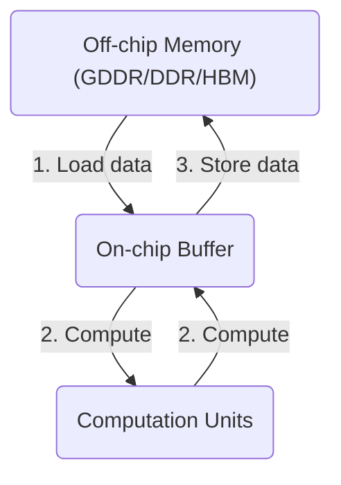

评估大规模语言模型（LLM）在专有硬件平台上的部署效率是一项复杂任务，它深刻依赖于对硬件特性和模型架构的深入理解。为此，我们采纳了Roofline模型作为一种先进的性能评估工具，该模型在图4中直观展示了在特定硬件环境下部署模型的潜能界限。此模型不仅是理论分析的坚固基石，也是实践应用中优化策略制定的指南。

在神经网络层的硬件执行语境下，数据流动构成了核心活动序列：从离散的内存资源（如DDR或HBM）加载至高效的片上缓冲区，随后经由处理单元进行密集计算处理，直至最终计算成果被回写至内存存储。这一连串操作要求对内存访问带宽与处理器计算能力进行综合考量，二者间的平衡直接决定了性能表现的天花板。

具体而言，Roofline模型使我们能够精准地区分并诊断两种关键性能瓶颈情境。首先，对于那些计算密集度高而内存交互相对有限的网络层，它们遭遇的是“计算瓶颈”。在此状态下，内存系统未被充分占用，表现为计算潜力未能得到完全释放。相反，若某层特征在于其对内存访问的极度依赖，而计算负担较轻，则定义为“内存瓶颈”。这种情形下，处理器资源闲置，无法达到最大利用率。

通过精细运用Roofline模型，我们不仅能够明确辨识这些性能限制类型，还能为每种特定场景设定清晰的性能上限，从而为优化模型部署策略、最大化硬件利用率及提升整体运行效率提供科学依据与实践路径。这不仅强化了我们对复杂系统交互的理解，还为实现高效能计算解决方案铺平了道路。

### Plot the Roofline:


确定目标硬件设备的峰值计算性能（每秒操作数，OPS）和峰值内存带宽（每秒字节数）。然后创建一个图表，其中y轴表示性能（OPS），x轴表示算术强度（OPS/字节）：绘制一条与峰值计算性能相等的水平线。这条线代表了硬件设备可达到的最大性能。再绘制一条从原点出发，斜率为峰值内存带宽的对角线。这条线代表系统上可用的最大内存带宽，即所谓的内存天花板线。图5展示了Nvidia A6000 GPU的Roofline model。

### Analyze performance for layers:

表1. 在Nvidia A6000 GPU的Roofline模型下对Llama-2-7b模型各层的分析。此例中，序列长度为2048，批处理大小为1。

Prefill Layer Performance Data

| Layer Name | OPs | Memory Access | Arithmetic Intensity | Max Performance | Bound |
| --- | --- | --- | --- | --- | --- |
| q\_proj | 69G | 67M | 1024 | 155T | compute |
| k\_proj | 69G | 67M | 1024 | 155T | compute |
| v\_proj | 69G | 67M | 1024 | 155T | compute |
| o\_proj | 69G | 67M | 1024 | 155T | compute |
| gate\_proj | 185G | 152M | 1215 | 155T | compute |
| up\_proj | 185G | 152M | 1215 | 155T | compute |
| down\_proj | 185G | 152M | 1215 | 155T | compute |
| qk\_matmul | 34G | 302M | 114 | 87T | memory |
| sv\_matmul | 34G | 302M | 114 | 87T | memory |
| softmax | 671M | 537M | 1.25 | 960G | memory |
| norm | 59M | 34M | 1.75 | 1T | memory |
| add | 8M | 34M | 0.25 | 192G | memory |

Decode Layer Performance Data

| Layer Name | OPs | Memory Access | Arithmetic Intensity | Max Performance | Bound |
| --- | --- | --- | --- | --- | --- |
| q\_proj | 34M | 34M | 1 | 768G | memory |
| k\_proj | 34M | 34M | 1 | 768G | memory |
| v\_proj | 34M | 34M | 1 | 768G | memory |
| o\_proj | 34M | 34M | 1 | 768G | memory |
| gate\_proj | 90M | 90M | 1 | 768G | memory |
| up\_proj | 90M | 90M | 1 | 768G | memory |
| down\_proj | 90M | 90M | 1 | 768G | memory |
| qk\_matmul | 17M | 17M | 0.99 | 762G | memory |
| sv\_matmul | 17M | 17M | 0.99 | 762G | memory |
| softmax | 328K | 262K | 1.25 | 960G | memory |
| norm | 29K | 16K | 1.75 | 1T | memory |
| add | 4K | 16K | 0.25 | 192G | memory |

通过量化分析模型各层的运算次数（操作数，OPs）与数据移动量（从内存中获取的字节数），我们可以深入评估其性能。这一过程涉及计算每层的算术强度，即每单位数据转移所执行的操作数（OPs/byte），从而精确地映射资源利用情况。借助此指标，我们能在图表上标示出各层理论上能达到的最大性能点，这些点由算术强度决定，并体现在图表的x轴上。

此分析步骤对于识别系统当前是受内存带宽限制（内存绑定）还是计算能力限制（计算绑定）至关重要。明确这一状态后，能够导向性地指明接下来的优化路径，确保针对性地解决瓶颈问题，无论是通过减少不必要的数据移动、优化内存访问模式，还是增强计算单元的效率，以此推动系统性能的全面提升。此方法融合了深度分析与策略规划，为提升模型运行效率提供了科学依据与实践指导。

资源未充分利用的情况有两种：

*   **(1) memory bound**
    

当模型的计算强度低于转折点，处于红色区域时，表明每个内存访问所需的计算工作负载较低。即使饱和了峰值带宽，也无法完全利用所有计算资源。在这种情况下，该层受到内存访问限制（内存绑定），部分计算单元可能会保持空闲。如果层是内存绑定的，可以考虑采用诸如量化、核融合和增加批次大小等优化技术来缓解内存占用。

*   **(2) compute bound**
    

相反，如果模型的计算强度高于转折点，处于绿色区域，则表明模型只需要少量的内存访问就能消耗大量计算能力。这意味着该层受到计算限制（计算绑定），部分内存单元可能保持空闲。在这种情况下，我们应该探讨启用低比特计算等策略以提高计算效率。这些方法的详细解释将在后续章节提供。

以Llama-2-7b模型在Nvidia A6000 GPU上使用Roofline模型的分析为例，表1展示了各层的分析结果。从表中我们观察到，在预填充阶段，大部分计算都是计算绑定的，导致性能较高。相比之下，在解码阶段，所有计算都是内存绑定的，导致性能远低于GPU计算单元的计算能力。在用户与大型模型交互过程中，预填充阶段仅执行一次，而解码阶段则重复进行以生成连续的输出。因此，针对解码阶段的内存绑定特性进行优化对于提升大型模型的推理性能至关重要。

### LLM-Viewer  Inference Bottleneck Analysis

在大规模语言模型（LLMs）中，存在多层Transformer结构，每层包含多种操作，并且不同的LLM模型具有不同的操作集。此外，为了计算峰值内存使用量和总推理时间，需要跟踪诸如内存占用等信息。因此，分析LLMs涉及到整个网络范围的考量。本节提出了一款强大的工具——LLM-Viewer 3，用于执行网络级分析。它使用户能够在各种硬件平台上分析LLM的性能和效率，为理解LLM推理及性能优化提供了宝贵的见解。

LLM-Viewer的工作流程如图1所示，包括以下步骤：

1.  **输入LLM模型并收集关键信息**：关于每一层的信息，如计算量、输入输出张量形状以及数据依赖关系。
    
2.  **硬件配置与Roofline模型生成**：提供硬件输入，并生成考虑到硬件计算能力和内存带宽的Roofline模型。
    
3.  **配置推理设置**：包括批量大小、提示令牌长度和生成令牌长度。
    
4.  **优化设置配置**：例如量化位宽、FlashAttention的使用、解码方法以及其他系统优化技术。
    
5.  **LLM-Viewer分析器工作**：利用Roofline模型和层信息分析每一层的性能。同时追踪各层的内存使用情况，并根据数据依赖关系计算峰值内存消耗。通过汇总所有层的结果，获得LLM的整体网络性能。
    
6.  **报告生成**：提供诸如各层及网络的最大性能、性能瓶颈和内存占用等信息的报告。从报告中可绘制出批次大小-性能、序列长度-性能等曲线，以理解不同设置如何影响性能。
    
7.  **网页查看器功能**：LLM-Viewer提供一个网页查看器，便于可视化网络架构和分析结果，方便用户调整配置，并为每一层提供丰富的数据访问。
    

此工具极大地促进了配置调整的便捷性，并为深入探索各层细节提供了广泛的数据支持。

# 三、Model Compression

大型语言模型（LLMs）的庞大尺寸和计算需求给实际部署带来了重大挑战，尤其是在资源受限的环境中。为了缓解这些限制，最直接的解决方案是压缩LLMs。在本节中，我们将回顾针对LLMs的神经网络压缩概念。这一探索将涵盖对已建立技术的深入审查，包括但不限于量化、剪枝、知识蒸馏和低秩分解。在每个子部分中，我们将使用LLM-Viewer来分析网络压缩对LLM推理的影响。根据我们的分析，我们将提供优化建议。

## 1. Pruning (Sec.3.2)

研究人员发现，神经网络模型往往存在过参数化现象，即模型中包含可以被去除的冗余权重。本章主要聚焦于权重剪枝方法，即识别并删除模型中的冗余权重。

从优化问题定义和求解的视角来看，模型剪枝可被视为解决优化问题。模型剪枝的问题定义是：寻找最优的模型子结构a\*和相应的权重w\*，以在特定约束条件下，最优化剪枝后模型的性能。优化空间主要包含两部分：剪枝后模型的结构空间${A(\boldsymbol{\alpha^{\*}}\in A)}$ 和剪枝后模型的权重空间 $W \left( \omega^{\*} \in W \right)$。优化目标是尽量降低剪枝所造成的任务性能损失。约束条件可能包括硬件指标（如延时、功耗）或与推理效率相关的代理指标（如参数量、计算量）。

模型剪枝要决定删除哪些权重单元，即在结构空间中找到解 $\alpha^{\*} \in A= \left \{ 0,1 \right \}^{N}$其中N表示权重单元的数量。权重单元的大小被称为“粒度”。对于卷积神经网络，模型剪枝采用的权重单元有以下5种典型的粒度。

（1）层级（Layer）粒度：如图所示，以单个卷积层为最小单元。

（2）滤波器（Filter）粒度：如图所示，以单个滤波器为最小单元。单个滤波器由多个二维的卷积核组成。删除某层的一个滤波器等价于删除对应的输出通道。

（3）形状（Shape）粒度：如图所示，在同一个滤波器中，将所有通道内相同空间位置的权重作为最小单元。

（4）通道（Channel）粒度；如图所示，以输入通道为最小单元，删除某一层的输入通道等价于删除前一层的输出通道，即删除前一层对应的滤波器。

（5）权重（Weight）粒度：如图所示，以单个权重为最小单元。权重粒度也是最细的剪枝粒度。

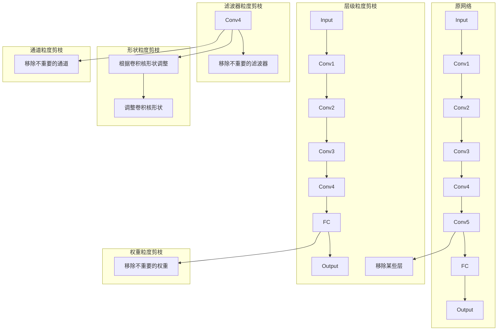

图 4.1 卷积神经网络中不同的剪枝粒度示意图

根据权重单元的粒度及其是否结构化，可以将剪枝方法的稀疏模式分为以下三类。

（1）粗粒度结构化稀疏模式：采用这类稀疏模式的剪枝方法简称〝结构化剪枝”。剪枝采用的权重单元粒度较粗，包括通道、形状、滤波器和层级等粒度。例如，常见的滤波器粒度的结构化剪枝会减少模型中各层的滤波器数量，同时相应地减少下一层的输入通道数量。与后两类稀疏模式相比，采用这类稀疏模式的剪枝方法的压缩率较低。因为其稀疏性具有结构化规律，所以通常无须专用的软硬件设计就能将其压缩率转化实际的硬件加速效果。

（2）细粒度非结构化稀疏模式：采用这类稀疏模式的剪枝方法简称“非结构化剪枝”或“稀疏剪枝”。剪枝采用的权重单元粒度权重粒度，粒度最细。与结构化剪枝相比，这类剪枝方法通常能获得较高的压缩率，大幅減少模型权重的存储需求。然而，这类稀疏模式的稀疏性不具有结构化规律，会在推理过程中引起不规则的访存与计算，使压缩率难以转化为推理加速效果。

非结构化剪枝往往需要专用的软硬件设计，以提高对非结构化数据的处理效率。

（3）细粒度结构化稀疏模式：采用这类稀疏模式的剪枝方法简称“半结构化剪枝”。剪枝采用的权重单元粒度同样为权重粒度。这类稀疏模式的核心思路是对权重进行结构化分组，并在分组内部采用非结构化稀疏模式。与细粒度非结构化稀疏模式相比，由于其结构化分组的特性，这类稀疏模式引入的访存和计算模式更规则，这使得采用这类稀疏模式的推理过程更易于在软硬件上实现高效处理。例如，NVIDIA 的安培架构 GPU 等硬件平台能支持对细粒度结构化稀疏数据的高效处理。

本章主要以卷积神经网络为例，介绍主流的模型剪枝方法。图4.2展示了模型剪枝方法研究的主要细分领域。以 LWC、Deep Compression 等为代表的早期的非结构化剪枝工作，展示出模型剪枝具有显著降低模型计算量和参数量的潜力；SSL、ThiNet、AMC 等工作关注结构化剪枝方法，并探索了基于权重正则与基于搜索的两类结构化剪枝流程。此外，低秩分解的思想与结构化剪枝有类似之处。低秩分解可被看作在张量分解后的空间进行“的杖”，删除冗余分量，得到的矩降是对原矩阵的低秩近似。这类方法的代表性工作包括BLstPmFT-CPN、Onc-ShotN等。半结构化剪枝结合了结构化剪枝和非结构化剪枝的优势，在维持较高任务性能的同时获得了更高的压缩比和加速比。它的代表性工作有 ESE、ASDNIN，DFSS等。

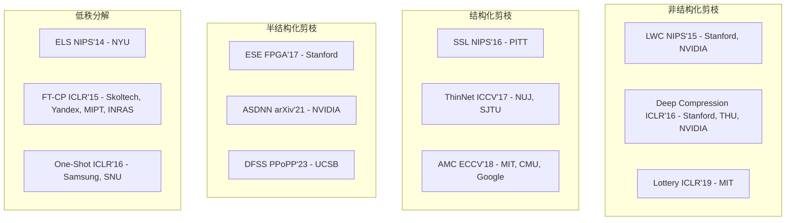

图 4.2 模型剪枝方法研究的主要细分领域

本章将按以下顺序介绍各种方法。4.2节将介绍模型敏感度分析方法，用于识别模型中的冗余结构。它们被广泛应用于各类剪枝方法中。4.3节将详细介绍结构化剪枝方法，主要包括基于权重正则的结构化剪枝方法与基于搜索的结构化剪枝方法，以及在给定资源限制的条件下的结构化剪枝方法。4.4 节将介绍近似低秩分解方法。4.5节将通过典型的例子简要介绍非结构化剪枝方法。4.6 节将介绍半结构化剪枝方法。除了权重剪枝，4.7 节将介绍针对激活值的剪枝方法。为了给读者提供直观实用的帮助，4.8 节将总结模型剪枝的经验。4.9节将给出 Group Lasso 结构化剪枝的实践案例。

### 模型敏感度分析方法

#### 层内和层间敏感度分析

为了识别模型中的冗余权重，模型剪枝方法需要对模型进行敏感度分析。敏感度分析方法评估删除某个或某些权重单元对模型任务性能的影响。具体而言，如果删除某些权重单元对模型的任务性能影响较大，那么这些单元的敏感度较高，应该被保留；反之，某些权重单元的敏感度较低，可以被删除。

然而，对所有权重单元进行敏感度分析，需要进行大量的模型任务性能测试，消耗大量资源，为了降低剪枝过程的开销，现有方法通常将结构 ∞分解为层间与层内两个维度进行敏感度分析，这样可以显著降低模型剪枝方法中敏感度分析的复杂度，提高模型剪枝的效率。

图4.3为层内和层间敏感度分析在模型剪枝中的用途。其中，图4.3（a）为待剪枝模型，它包含三个级联的卷积层及一个跳跃连接。图 4.3（b）使用层间敏感度分析确定模型各层的敏感度，依据各层的敏感度为各层分配压缩率。例如，因模型第二层的敏感度较高，所以仅删除其 20%的权重。注意，只有 4.3.2 节介绍的离散搜索剪枝显式地进行了层间敏感度分析。图4.3（c） 使用层内敏感度分析确定层内各权重单元的敏感度，并保留敏感度较高的权重单元。

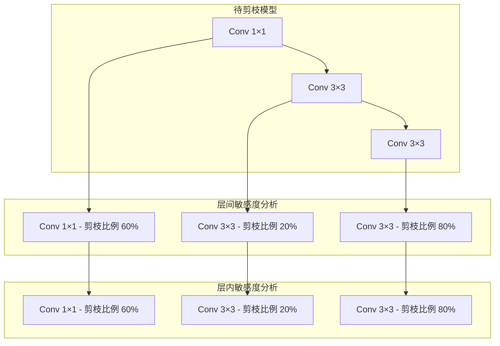

图 4.3 层内敏感度分析和层间敏感度分析

#### 层内敏感度分析指标

如图 所示，层内敏感度分析被用于评估层内各权重单元的敏感度，作为模型剪枝保留单元的依据，敏感度指标可以按照是否需要数据被划分为数据驱动和非数据驱动两类。数据驱动类敏感度指标需要使用输入数据计算，如权重二阶导数、通道激活概率、激活重建误差。非数据驱动类敏感度指标仅需要权重本身而不需要输入数据，如权重的p-范数、权重多样性、批标准化层的缩放值。上述各敏感度指标的具体细节如下。

（1）权重二阶导数：利用权重的二阶导数推导出删除各权重单元后损失函数的增量，删除使损失函数增长较小的权重单元。

（2）权重的p-范数（1-范数、2-范数等）：将权重的p范数作为敏感度指标，删除 范数较小的权重单元。

（3）权重多样性：目的是保留更具多样性的权重单元子集。通常，将各权重单元与权重单元“质心”的距离作为敏感度指标，删除距离质心较近的滤波器。例如，代表工作 FPGM931 关注滤波器粒度权重单元的多样性指标。FPGM 认为，越是靠近全体滤波器几何中心的滤波器，其功能越容易被其他滤波器代替，可以被优先剪枝。

（4）批标准化层的$gama$值：将批标准化层线性变换的放缩系数值$gama$作为敏感度指标，删除对应的放缩系数较小的权重单元。

（5）通道激活概率：利用待剪枝模型进行部分数据推理，统计每个通道的激活率（非0数据的比例）并将其作为敏感度指标，删除激活率较低的通道。

（6）激活重建误差：计算删除某权重单元后的输出与待剪枝模型输出的误差，删除误差较小的权重单元。

值得注意的是，若使用充足的数据来微调或重新训练剪枝后的模型，上述层内敏感度指标一般无明显效果差距。

表4.1总结了部分结构化剪枝工作所使用的层内敏感度指标与剪枝流程。虽然各类剪枝流程几乎均会使用一种层内敏感度指标，但是使用的方式略有不同。基于权重正则的剪枝方法、离散搜索剪枝方法、可微分搜索剪枝方法对层内敏感度指标的使用方式如下。

（1）基于权重正则的剪枝方法：在训练模型时，将层内敏感度指标作为正则项引入损失函数。在训练的过程中，正则项会将模型中部分权重置为0。

（2）离散搜索剪枝方法：迭代进行层内敏感度分析和层内剪枝。前者为每一层分配压缩率，后者根据层内敏感度指标将每一层剪枝到分配的压缩率。

（3）可微分搜索剪枝方法：通常，不预设敏感度指标，而是将每个权重单元的敏感度作为可训练参数，通过梯度下降算法训练得到权重单元的剪枝决策，即“等效敏感度”。

表4.1 部分结构化剪枝工作所使用的层内敏感度指标与剪枝流程

| 工作 | 层内敏感度指标 | 是否数据驱动 | 剪枝流程 |
| --- | --- | --- | --- |
| OBD | 权重二阶导数 | 是 | 退化的离散搜索 |
| Group Lasso | 权重1-范数 | 否 | 权重正则 |
| AMC | 权重1-范数 | 否 | 离散搜索 |
| MorphNet | 权重1-范数 | 否 | 权重正则 |
| Lebedev et. al. | 权重2-范数 | 否 | 权重正则 |
| NetAdapt | 权重2-范数 | 否 | 离散搜索 |
| FPGM | 权重多样性 | 否 | 离散搜索 |
| VCP | 批标准化的γ值 | 否 | 离散搜索 |
| DSA | 批标准化的γ值 | 否 | 可微分搜索 |
| APoZ | 通道激活概率 | 否 | 可微分搜索 |
| ThiNet | 激活重建误差 | 是 | 离散搜索 |

### (1) Structured

结构化剪枝会移除整个神经元或层，从而得到更干净、更规则的结构。经过剪枝的模型通常与传统硬件的兼容性更好，但这种简化和规则化的代价是：这种形式的剪枝可能对模型性能有更显著的影响，因为它涉及到移除更大、可能更重要的组件。LLM-Pruner 等人在大型语言模型（LLMs）的结构化剪枝方面代表了一种开创性的方法。它采用了一次性剪枝技术，该技术依赖于一阶和估计的Hessian数据，并需要随后使用LoRA进行微调以恢复权重。这项工作的优势在于，它显著降低了计算需求和内存要求，同时保持了LLMs的基本结构。Sheared Llama Xia等人提出了另一种值得注意的解决方案，通过将有针对性的结构化剪枝与动态批次加载算法相结合。首先，它通过分析预训练模型的配置，仔细地将源模型剪枝成所需的目标架构。然后，通过动态批次加载算法提高训练效率，该算法调整来自不同领域的训练数据比例。Compresso Guo等人建立了一个协作学习框架，其中LLM与一个资源高效的剪枝算法协同工作，能够将Llama-7B剪枝至5.4B参数量，同时保持原始性能不变。

结构化剪枝方法主要在层和滤波器这两个粒度上进行剪枝。与非结构化剪枝相比，结构化剪枝的压缩率通常较低。结构化剪枝的优势在于，剪枝后的 模型仍然保留了稠密的矩阵一矩阵乘法，这使得模型可以直接在支持稠密计算的高效通用处理器上运行，如GPU。因此，结构化剪枝能够更容易地将压缩率转化为实际加速，这使其在学术界和工业界都受到广泛关注。

本节将从优化问题定义和求解的角度，介绍各类常用的结构化剪枝方法。现有的工作主要分为如图4.4所示的两大类。第一类方法仅显式地优化模型权重w，非显式地优化模型架构参数 Q，如图 4.4（a）所示。这类方法不会显式地评估层间敏感度，而是在确定了权重数值之后，基于层内敏感度指标移除部分权重单元。第二类方法则同时优化模型权重c和模型架构参数c，如图 4.4（b）所示。

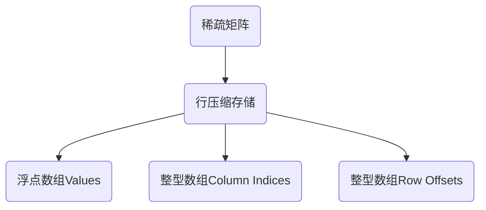
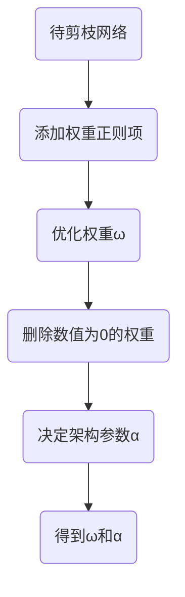
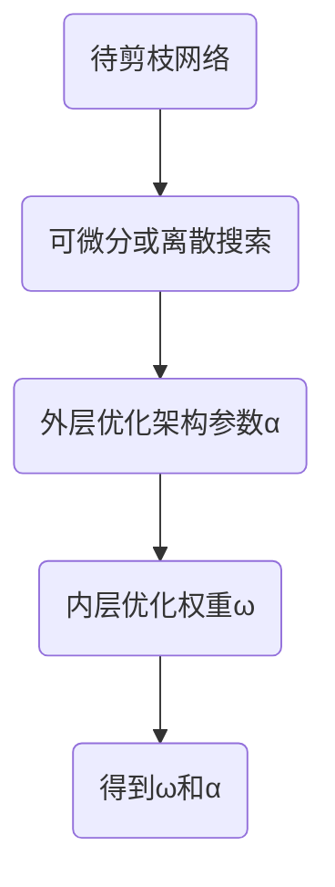

图 4.4 两类结构化剪枝流程示意图

本节的内容安排如下。4.3.1 节将介绍基于权重正则的结构化剪枝方法，这类方法非显式地建模和优化模型架构参数 ∞。4.3.2 节将介绍基于搜索的结构化剪枝方法，包括离散搜索和可微分搜索，这类方法显式地建模并优化模型架构参数 c。4.3.3 节将介绍在给定资源限制的条件下，如何运用基于权重正则和基于搜索的方法进行结构化剪枝。

#### 基于权重正则的结构化剪枝方法

权重正则方法是机器学习中常用的技术。常见的权重正则方法包括基于 1-范数的 Lassol99）和基于 2-范数的岭回归（Ridge Regression）190。其中，岭回归对于大幅值权重的惩罚力度大，对于小幅值权重的惩罚力度小，不倾向于把小幅值权重拉到0，因此难以学习稀疏分布的权重；

而 Lesso 对于不同幅值大小的权重的惩罚力度一致，因此更容易学习稀疏分布的权重。对损失函数加入权重正则项，优化模型权重w得到稀疏模型，其流程如下。

（1)训练开始前，將一个设计好的权重正则项引入损失函数，权重正则项通常根据模型的层内敏感度指标进行设计。

（2） 训练过程中，优化带有权重正则项的损失函数，权重正则项会将部分权重优化为口或接近 0。

（3）训练结束后，将等于0或接近0的权重删除，即得到剪枝后的模型。这类方法对应的优化问题如式 4.1所示。

$\boxed{\boldsymbol{\omega}^{\*}=\operatorname\*{arg min}\_{\boldsymbol{\omega} \in W}\left\[\mathcal{L}(\boldsymbol{\omega})+\lambda R(\boldsymbol{\omega}) \right\]}$

其中，L表示任务损失函数（如分类任务中常用的交叉熵损失函数），R 表示权重正则项，入表示权重正则项的加权系数，w表示模型的权重，w\* 表示训练得到的最优权重，W 表示权重空间

本节将以 Structured Sparsity Learning2（简称SSL）为例，介绍权重正则项的设计思路具体来说，SSL 引入权重正则项构造了如式4.2 所示的优化目标：

$\bm{\omega}^{\*}=\operatorname\*{arg min}\_{\bm{\omega}\in W}\left\[\mathcal{L}( \bm{\omega})+\lambda\_{\text{g}}\cdot\sum\_{l=1}^{L}R\_{\text{g}}(\bm{\omega}^{(l )})\right\]$

其中，4表示模型的权重，表示任务的损失函数，L表示模型的总层数，1表示模型的层索引，入g表示权重正则项的加权系数，Rg（.）表示正则函数。具体来说，SSL 选择将结合 1-范数和2-范数的 Group Lasso100作为正则函数Rg（.），如式4.3 和式4.4所示。

$\begin{split} R\_{\mathsf{g}}(\bm{\omega})&=\sum\_{ \bm{k}=1}^{K}||\bm{\omega^{(k)}}||\_{\mathsf{g}}\\ ||\bm{\omega^{(k)}}||\_{\mathsf{g}}&=\sqrt{\sum\_{ \bm{i}=1}^{N(\bm{\omega^{(k)}})}(\omega\_{\bm{i}}^{(k)})^{2}}\end{split}$

其中，c（）表示第k个权重组，N（c（h）表示权重组w（）中权重组的数量，K表示权重组总数。

由式4.4可知，Group Lasso 计算权重组内所有权重的2-范数；由式4.3 可知，Group Lasso 对所有权重组的2-范数求和，由于每个权重组的 2-范数都是非负数，这个求和操作等价于对所有权重组的2-范数求1-苑数。因此，Group Lasso 会鼓励部分权重组的 2-范数被训练过程置0，即这些权重组内的权重全部为0。

权重的分组方式具有很离的灵清性。针对不同的应用需求，用户可以设计更合适的权重分组策略。如图 4.5 所示，Group Lasso 可以灵活地对通道、滤波器、形状、层等不同粒度的基本单元进行剪枝。以通道和滤波器粒度的结构化剪枝为例，假设 wf9.是第1层中的第m个滤波器，c0%：是第1层中每个滤波器的第 c 个输入通道，可将 SSL 的目标函数改写为式4.5：$\bm{\omega}^{\*}=\operatorname\*{arg min}\_{\bm{\omega}}\left\[L(\bm{\omega})+ \lambda\_{n}\cdot\sum\_{l=1}^{L}\left(\sum\_{n\_{l}=1}^{N\_{l}}||\bm{\omega}\_{n\_{l},:,:,:}^{(l)}||\_{\mathsf{g}}\right)+\lambda\_{c}\cdot\sum\_{l=1}^{L}\left(\sum\_{c\_{ l}=1}^{C\_{l}}||\bm{\omega}\_{:,c\_{l},:,:}^{(l)}||\_{\mathsf{g}}\right)\right\]\qquad \text{ (4.5)}$


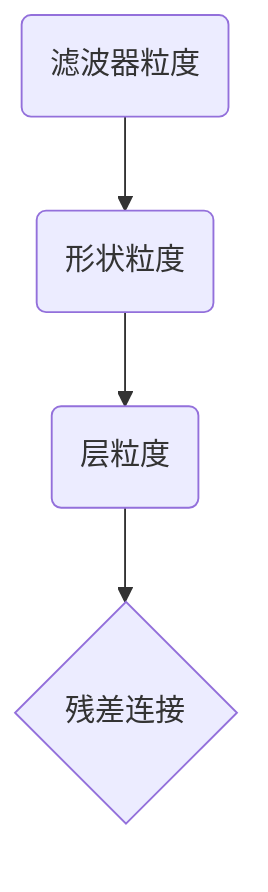

图 4.5 Group Lasso 可支持不同粒度的结构化剪枝

#### 基于搜索的结构化剪枝方法

不同于基于权重正则的结构化剪枝方法，基于搜索的结构化剪枝方法不仅优化模型权重心，而且在优化模型权重c的外层嵌套了对模型架构参数o的优化。一般来说，这个双层（Bi-Level）优化问题可表示式4.6所示形式：

$\begin{split}\bm{\alpha}^{\*}&=\operatorname\*{arg max}\_{\bm{\alpha}\in A}R(\bm{\omega}^{\*}(\bm{\alpha}),\bm{\alpha})\\ \text{s.t.}\quad\bm{\omega}^{\*}(\bm{\alpha})&= \operatorname\*{arg min}\_{\bm{\omega}\in W}\mathcal{L}(\bm{\omega},\bm{\alpha} )\\ \mathcal{F}(\bm{\alpha})&\leqslant B\_{\mathcal{F}} \end{split}\qquad\qquad\qquad\qquad\qquad\qquad$

其中，a\*表示待求解的最优架构参数，R代表任务性能指标（如分类任务的准确率），£代表任务损失函数（如分类任务的交叉熵损失函数），w\*（a）代表架构参数。最合适的权重，通过内层的权重优化问题求解得到w\*（a）=aIg min wew C（w, a）。另外，这类方法显式地优化架构参数Q，因此，优化问题加入与 a 相关的其他限制条件是非常自然的，如式4.6中的F（a） ≤B5，F（a）是一个与 a 相关的指标，可以是模型复杂度（如参数量、计算量）或实际推理性能（如延时，能耗等），Br 为该指标的资源限制。

式4.6的剪枝优化问题中 B（a）= R（w\*（a）， a）的评估过程涉及一个复杂的求解w\*的内层优化问题。因此，该优化问题难以被闭式建模并求解，它属于一个黑盒优化问题。黑盒优化问题最常见的求解方法是，采用一系列基于离散搜索的策略。此外，不少工作尝试使用可微分的代理损失函数 代替上述优化问题的B，对内层的权重优化问题进行近似或者直接将该双层优化问题转化成单层（One-Level）优化问题，并将离散的架构参数 c 松弛至连续空间品，用梯度的方式更新 a。借鉴 模型架构搜索领域的术语，这类基于梯度优化的剪枝方法可被看作一种用“可微分搜索策略”探索离散搜索空间的方法。本节将基于离散搜索策略的方法和基于可微分搜索策略的方法统称为基于搜索的方法，并举例介绍这两类方法。

基于搜索的结构化剪枝方法会显式地优化模型的架构参数c。常用的对架构进行参数化的方式有如下两种。

（1）剪枝率（Pruning Ratio）：被删除的权重数占权重总数的比例。当前的工作通常以层级为粒度分配压缩率，典型的工作有AMCI7、DSABI、ECCLOIl 等。压缩率通常仅用于层间敏感度分析。在确定了每一层的压缩率之后，通常需要利用某种层内敏感度指标来决定哪些权重应该被保留。

（2） 二值掩码（Binary Mask）：为每个权重单元分配一个二值掩码，其中，掩码为1表示

保留该权重单元；掩码为0表示删除该权重单元；典型算法有 VCPB7、BAR/1021 等。使用二值掩码可以同时进行层间和层内敏感度分析，并且可以直接根据掩码值进行剪枝，无须再根据特定的层内敏感度指标进行剪枝。

```plaintext
1:Model：已经训练好的原始模型
2: No：外层循环次数
3:N：内层循环次数
4:a：各层的压缩率配置
5:Controller：控制器，相当于剪枝操作的核心搜索策略
6: Evaluater:
评价器，负责对当前压缩率配置下的模型进行快速性能评估
7:
8: for i = 1,2,, No do
9: for j = 1,2,•••, Ni do
10:   a = controller.sample_as（）//控制器采样一个模型结构
      acc=Evaluate（a, Model） //快速评估模型结构
      Controller.fit（a, acc） //根据快速评估的结果更新控制器
    end for 
14:a =controller.decide（） //控制器决定一个模型结构
15:Model = PruneAndFinetune（Model, a） //剪枝并微调参数
16: end for
```

1.  离散搜索剪枝方法
    

算法 4.1总结了离散搜索剪枝的通用选代流程，整个流程包含两层循环，这两层循环的区别在于评估方法。其中，内层循环采用快速评估方法预测模型的性能，评估度较低：而外层循环会训练剪枝后的模型并在测试数据集上实测模型的性能，虽然评估速度较慢，但是评估精度较高。

图4.6展示了上述离散搜索剪枝的通用迭代流程。与算法 4.1 对应，可以看到内层循环采用快速评估方法，循环次数通常较多，在103量级；外层循环的评估速度较慢，循环次数较少，在10-量级。


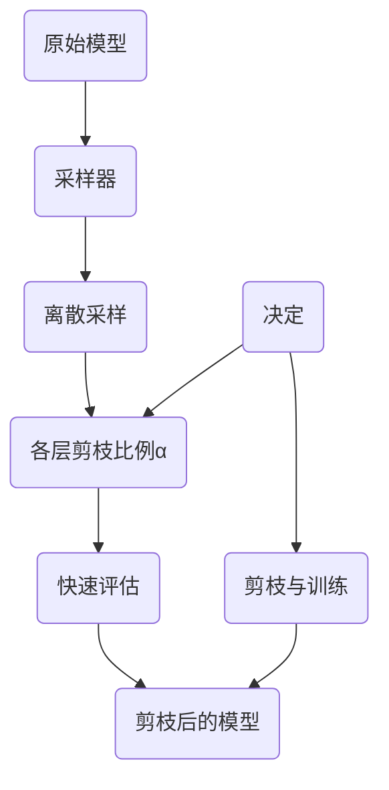

图 4.6 基于离散搜索的结构化剪枝流程示意图

表 4.2对比了典型的离散搜索剪枝方法。早期的AMC使用强化学习采样模型架构参数。另一项早期研究 NetAdapt 在每一轮迭代中采样 K个候选剪枝模型，每个候选剪枝模型均只有一个卷积层被压缩。其他研究使用启发式的局部搜索算法来搜索架构参数，如模拟退火（Simulated Annealing,SA ）和进化算法（Evolutionary Algorithm,EA），这些算法可以直接搜索多个目标并获得关于模型任务性能和压缩率的帕累托前沿。

这里以AMC为例介绍离散搜索剪枝。如图 4.7所示，AMC设计了一个控制器（DDPG），该控制器逐层采样压缩率。具体来说，控制器会接收待剪枝层的状态向量，并基于当前层的状态采样压缩率。在控制器完成所有层的压缩率采样后，就会根据层内敏感度指标对各层进行剪校。在训练阶段，AMC 会对剪枝后的模型进行快速评估并生成一个奖励信号。随后，AMC使用 DDPG105］ 强化学习算法根据奖励信号更新控制器的权重。


| Algorithm Component | AMC | NetAdapt | Auto-Compress | MetaPruning |
| --- | --- | --- | --- | --- |
| Controller.sample\_as | 使用 MLP 逐层预测 | K 个候选剪枝模型 | 模拟退火 | 进化算法 |
| Evaluate | 不微调 | 不微调 | 不微调 | 超网络 |
| Controller.fit | 强化学习 | — | 接受决定 | 种群更新 |
| Controller.decide | 使用采样器选择 α | 取最高精度的模型 | 模拟退火过程中发现的 α | 取种群中最高精度的 α |
| PruneAndFinetune | — | 剪枝后长时间微调 | ADMM 求解后微调 | — |
| Nₒ | 1 | \> 1 | \> 1 | 1 |
| Nᵢ | \> 1 | \> 1 | \> 1 | \> 1 |

表4.2 离散捜索枝方法対比

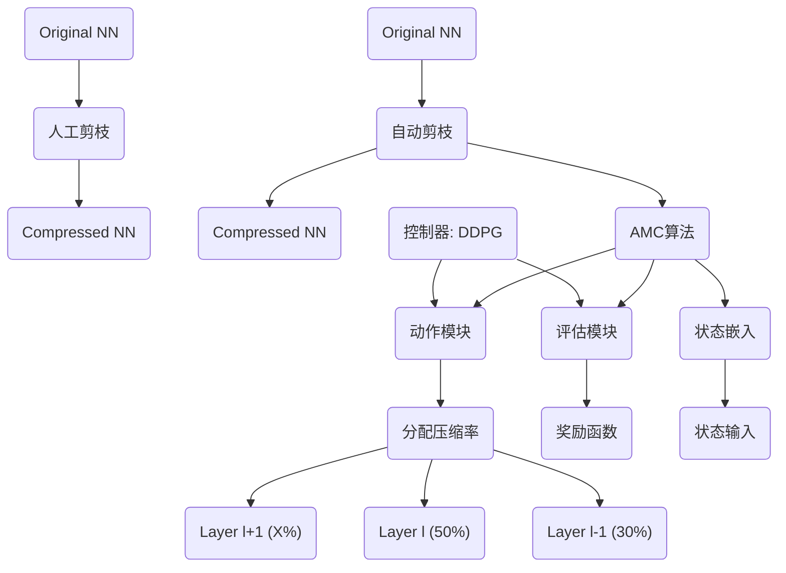

图 4.7 AMC算法的训练流程示意图

本节重点介绍 AMC对强化学习中状态空间、动作空间及奖励函数这三大组成部分的设计，它们分别对应了算法 4.1中控制器的输入、模型架构参数c的搜索空间 A、更新控制器所需的评估信息。

1）对状态空间的设计

每一层的状态向量为式4.7 所示的11维向量：

$\boldsymbol{s}\_{t}=(t,n,c,h,w,\text{stride},k,\text{FLOPs}\[t\],\text{reduced}, \text{rest},a\_{t-1})\qquad\qquad\qquad\quad$

其中，t表示当前层的层索引，n表示当前层滤波器的输出通道数，c表示当前层滤波器输入通道数，h和w表示当前层输入张量的维度，k表示当前层滤波器的大小，stride 表示当前层滤波器的步长。n×cxkxk 表示当前层中滤波器的超参数，c×w×h 表示当前层的输入张量维度，FLOPslt表示当前层的计算量，reduced 表示已经降低的总计算量，rest 表示待剪枝层中剩余的计算量，ot-1表示前一层的压缩率。在将状态向量输入控制器之前，AMIC 将所有参数归一化到（0，1\]

2）对动作空间的设计

AMC 控制器在某层所采样的动作被当作当层的压缩率。AMC 使用细粒度的动作空间，即压缩率 a E（0,1］。

3）对奖励函数的设计

AMC 针对两类场景的奖励函数设计。

（1）在资源有限的场景，如手机应用程序和自动驾驶车辆中，重点在于，在给定的资源约束下，通过剪枝提高模型的任务性能。为此，研究者构建了一个奖励函数来优化这一过程。

$R\_{err}=-Error    \left    (   4.8 \right)$

其中，Error 为错误率。可以发现，奖励函数不鼓励控制器降低模型权重，专注于保持模型的高精度。AIC通过限制动作空间大小的方式来满足资源限制。限制动作空间大小的含义为：当发现用最大的压缩率压缩后续所有层也无法满足限制条件时，AMC就会限制当前层的压缩率，使剪枝后的模型满足限制条件。

（2）保证任务性能的剪枝：常见的应用场景有图像去噪等。在这类场景中，用户关注的是，在保障任务性能不下降的前提下，尽可能减少模型的计算量和参数量。这类场景通常不会设置资源限制。AMC设计出了如下奖励函数：

$\left\{\begin{array}{l}R\_{\text{FLOPs}}=-\text{Error}\cdot\text{log(FLOPs)}\\ \\ R\_{\text{Param}}=-\text{Error}\cdot\text{log(\#Param)}\end{array}\right.\qquad \qquad\qquad\qquad\qquad\qquad$

其中，FLOPs表示模型的计算量，#Param 表示模型的参数量。一方面，这两个奖励函数均对Brror 敏感，鼓励控制器采样高精度模型；另一方面，分别将减少计算量、参数量这一目标引入奖励函数中，鼓励控制器降低硬件开销。

#### 2. 可微分搜索剪枝方法

不同于离散搜索剪枝方法，可微分搜索剪枝方法将式4.6中的双层优化问题转化成单层优化问题，并将离散的模型架构参数o放松至连续空间 进行求解。在不考虑资源限制的情况下，可以将式 4.6 的优化问题转化式 4.10的：

$\tilde{\bm{\alpha}}^{\*},\bm{\omega}^{\*}=\operatorname\*{arg min}\_{\tilde{\bm{ \alpha}}\in A,\bm{\omega}}\mathcal{L}(\tilde{\bm{\alpha}},\bm{\omega})\qquad \qquad\qquad\qquad\qquad\qquad\qquad(4.10)$

其中，该优化问题的自变量。和w分别表示模型架构参数和模型权重，其优化空间均为连续空间。因此，优化目标可微分，能够使用梯度下降算法求解。

本节以 BARI102） 为例介绍可微分搜索剪枝的基本流程。假设 hi是第1层模型的输出特征图，BAR 会为其分配一个二值掩码 21，其长度等于 h的通道数，将21与h.逐通道相乘，即可将部分通道置为0。这一过程可以写为式4.11：

$h\_{l}=h\_{l} \odot z\_{l} \left( 4.11 \right)$

具体来说，BAR 假设某一层中，每个可学习二值掩码 2 服从伯努利分布q（z④），其分布参数 ④，可以在训练模型时学习。通过梯度更新 中，模型可以学习到哪些通道应该删除，哪些应该保留。然而，从分布q（z亚）中采样的操作是不可微分的。BAR 利用重参数化技巧106，107将 z1 的采样操作转化为可微分的数学计算g（亚1，©），其输入为服从均匀分布2（0, 1）的随机变量e和待学习参数 。此时，式4.11可写作$h\_{l}=h\_{l} \odot g \left( \Phi\_{l}, \epsilon \right)$

不同于 BAR 中使用的逐通道二值掩码，还有一些工作使用压缩率a来显式参数化模型架构，例如DSABH。DSA 设计了一个方法使得损失函数对于模型各层的压缩率a可微分。具体而言，与BAR类似，DSA 为模型每层引入逐通道的二值掩码以决定每个通道保留与否。不同的是，DSA 让各层的二值掩码受控于各层的压缩率 a。DSA 的可优化参数各层压缩率a。

#### 给定资源限制的条件下的结构化剪枝方法

4.3.1 节和 4.3.2 节均未考虑剪枝优化问题中的限制条件。然而，在实际应用中，这些限制条件是普遍存在的。例如，端侧设备的计算能力和存储空间是有限的，且不同任务对推理延时的要求各异。为了适应这些实际应用中的限制条件，需要求解带有约束的剪枝优化问题。许多文献中也将优化问题的限制条件称为“资源限制”。

为了求解带有资源限制的优化问题，首先需要对资源的指标进行建模描述。常见的建模方法包括使用资源的代理指标【T，8L，95，102-104、构建资源的行为级仿真模型108,109、构造资源的统计模型00，101,204等。

本节将介绍两个具有代表性的工作，它们分别在基于权重正则和基于搜索的结构化剪枝方法中加入了对资源限制的处理。

1.给定资源限制的条件下的权重正则剪枝方法

4.3.1 节介绍了基于 Group Lasso的结构化剪枝方法 SSL。这类方法没有在求解优化问题时考虑限制条件，因此，无法可控地满足给定的资源限制。Ariel Gordon 等人提出 MorphNVet，使得基于权重正则的结构化剪枝方法也能在给定资源限制的条件下可控地进行结构化剪枝。

具体来说，MorphNet 设计了如下两个步骤。

（1）模型收缩：该步骤与 SSL 基本一致，通过求解无约束条件的剪枝优化问题，利用极重正则项将部分权重（组）置为0，并删除这些权重。

（2）模型扩展：Ariel Gordon 等人使用宽度乘数（Width Mutiplier）在不超过资源限制的前提下统一扩展所有层的宽度（通道数）。一般来说，模型收缩步骤会使实际使用的资源少于实际资源限制，这种不充分利用给定资源的现象会导致次优的剪枝结果。模型扩展步骤旨在根靠实际的资源限制，尽可能地充分利用给定资源。

NorpiNet 算法的工作流罄如算法 42所示。其中，2（w）表示损失函数，9（ww）表示故動正则项，F（表示衡量模型资源消耗的函数，0表示的校后模型各层的觉逛，日表示模的扩限生骤的鲍度系数，6表示资源限制。MorpANet 通过交替进行模型收缩和模型扩展，不前进代以生成满足發源限樹的剪枝模型。算法 42的第 1～2行对盛模型收缩步骤。在该步票中MorphNet 采用 SSL 方法训练模型，并对训练后的模型进行结构化剪枝。第3行是模型扩展步骤，该步骤搜索最大的宽度系数B，并对模型的宽度均匀扩展以适应资源限制。收缩后的模型的资源耗费通常少于资源限制，因此模型扩展步骤中的 B一般大于1。第4行将扩展后的模型重新代入第1行进行迭代搜索，以获得最佳的剪枝后模型。


| 步骤 |
| --- |
| 1. 在损失函数中引入权重正则项来训练模型 |
| 2. 删除权重中等于 0 的权重，得到模型各层的宽度 |
| 3. 搜索最大的宽度系数 β，使得 F(ω, O1:M) <= ζ |
| 4. 将模型的宽度设置为 O1:M = β · O'1:M，从第 1 行开始重复执行，直到满足资源限制 |
| 5. 返回 O1:M |

2.给定资源限制的条件下的离散搜索剪枝方法

下面以 NetAdapt为例，介绍给定资源限制的条件下的离散搜索剪枝方法。NetAdapt 以延时为资源限制，采用构造延时查找表的方式对延时进行建模。从优化问题的视角看，NetAdapt求解的剪枝优化问题如式4.12所示，支持同时引入m 个资源限制：

$\begin{split}&\max\mathrm{Acc}(\mathrm{Net})\\ &\mathrm{s.t.}\ \mathrm{Res}\_{j}(\mathrm{Net})\leqslant\mathrm{ Bud}\_{j},\quad(j=1,2,\cdots,m)\end{split}\qquad\qquad\qquad\qquad(4.12)$

其中，Acc（）表示计算准确率的函数，Res；（.）表示计算第；个资源消耗量的函数，Bud，表示第；个资源的上限。为了使求解过程更加可控、剪枝后的模型任务性能更优，Net.Adapt 采用渐进式优化策略求解式 4.12。这种策略将求解过程分解为多个步骤。在每一步中，NetAdapt 在前一步的限制条件上少量降低资源上限，直至达到目标资源上限。每一步的优化问题可用式4.13

表示：

$\begin{split}&\max\operatorname{Acc}(\operatorname{Net}\_{i})\\ &\text{s.t.} \operatorname{Res}\_{j}(\operatorname{Net}\_{i}) \leqslant\operatorname{Res}\_{j}(\operatorname{Net}\_{i-1})-\Delta R\_{i,j},(j=1,2,\cdots,m)\end{split}\qquad\qquad\qquad(4.13)\qquad$

其中，Net，表示第i 步生成的剪枝后的模型，模型当前的限制条件为 Con = Res； （Net：-1）-ARrg,ARng 表示一个较小的资源上限减少量。

NetAdapt 的工作流程如图 4.8所示，其主要包含采样模块和评估模块两大组件。第一个模块是采样模块，其主要作用是采样生成大量的候选模型，每个候选模型都是通过对模型中互不相同的一层进行剪枝生成的。第二个模块是评估模块，其主要作用是，快速评估候选模型的资源开销。为了提高评估效率，NetAdapt 预先在目标硬件上对各种超参数配置下的模型层资源消耗进行测量，并基于这些数据构建查找表，以便快速准确地评估每个候选模型的资源消耗。


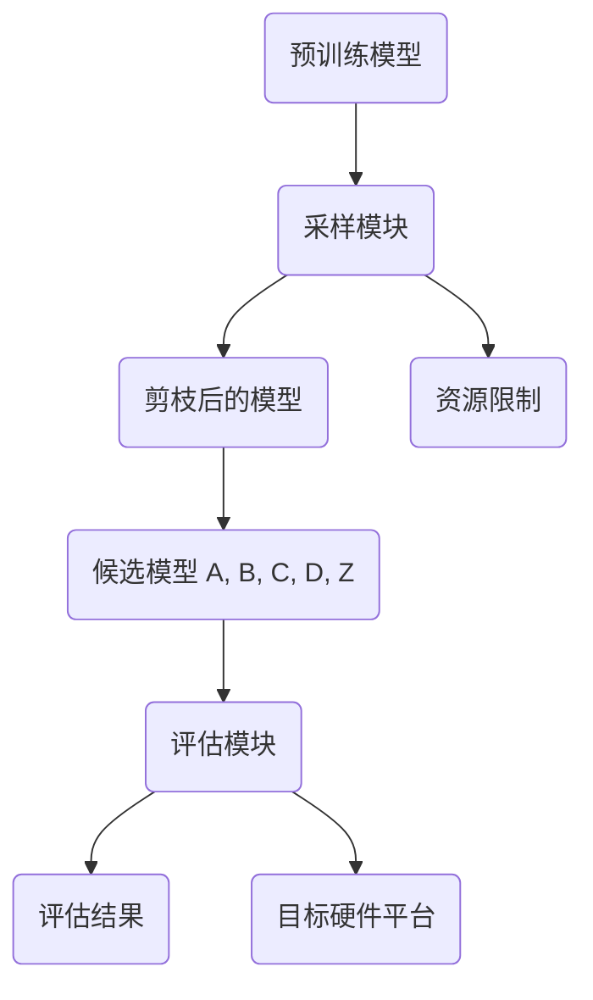


图 4.8 NetAdapt 的工作流程示意图

具体而言，算法4.3展示了 NetAdapt 算法的工作流程，其包含内外两层循环。首先是内层循环。根据第4行的渐进限制条件，第5行~第9行的内部循环会生成 K个候选模型，并且每个候选模型仅有互不相同的一层被剪枝。内层循环主要包含三个步骤：第一步，确定待剪枝层的压缩率（层间敏感度）；第二步，以 2-范数为指标确定需要剪掉哪些滤波器（层内敏感度）；第三步，使用较少的训练轮数对模型进行短时间微调。然后是外层循环。每轮外层循环均会小幅降低资源上限，如第4行所示。获得内部循环生成的 K个候选模型后，第10行的评估模块会逐个评估候选模型的性能，并从候选模型中选出一个最优的模型及其评估结果并送入下一轮循环。如第 13行所示，外层循环结束之后，会对剪枝后的模型进行较多训练轮数的长时间微调，以尽可能恢复模型的准确率。

```plaintext
1:  i = 1
2:  Res_i = TakeEmpiricalMeasurement(Net_i)
3:  while Res_i > Bud do
4:      Con = Res_i - ΔR_i
5:      for k = 1, 2, ..., K do
6:          N_Filt_k, Res_simp_k = ChooseNumFilters(Net_i, k, Con)
7:          Net_simp_k = ChooseWhichFilters(Net_i, k, N_Filt_k)
8:          Net_simp_k = ShortTermFinetune(Net_simp_k)
9:      end for
10:     Net_{i+1}, Res_{i+1} = PickHighestAccuracy(Net_simp, Res_simp)
11:     i = i + 1
12: end while
13: Net = LongTermFineTune(Net_i)
14: Return Net
```

类似于 NetAdapt, MOSP 也采用了渐进式优化策略。与 NetAdapt 不同的是，在每轮外层循环中，MOSP 都会评估模型中每一层压缩至不同通道数时任务性能（如分类准确率）和资源消耗（如延时）的变化情况。然后，MOSP 为每一层拟合两个线性系数，以近似描述其压缩通道数与任务性能影响或资源消耗降低之间的关系。接着，MOSP 构造线性规划问题，在确保满足本轮外层循环的资源消耗降低的限制下，最小化各层对任务性能影响之和（假设各层影响独立），从而求解出各层的压缩通道数。MOSP 在每轮外层循环中都可以同时对多层剪枝，比 NetAdapt 更灵活。

### (2) Unstructured

非结构化剪枝选择性地剔除模型中的个别权重或神经元，从而形成一个更为稀疏但结构上不规则的网络。这种剪枝方式在确保模型准确性方面表现出色，然而，权重分布的不规则性要求有专门的处理方法或软件优化。SparseGPT Frantar 和 Alistarh, 2023是针对大型语言模型（LLMs）的一次性剪枝方法上的重大突破。它通过将剪枝问题重新构想为一系列广泛的稀疏回归问题来应对挑战，并由新开发的求解器高效解决。值得注意的是，SparseGPT 能够仅用一台GPU在几小时内高效处理包含1750亿参数的模型，并且能够在不显著牺牲准确率或需要微调的情况下，在LLMs中诱导出高程度的稀疏性（50-60%）。为了应对SparseGPT中的重建成本挑战，Sun等人提出了Wanda，该方法通过评估每个权重的大小及其对应输入的范数来判断其重要性，显著提高了计算效率。此外，Yin等人设计了一套非均匀层次稀疏度比例，以更多关注出现异常值较多的层，从而提升剪枝性能。考虑到硬件对非结构化剪枝的支持，Flash-LLM Xia等人提出了一种非结构化稀疏矩阵乘法方法，其特点是稀疏加载和密集计算，以实现GPU Tensor Core对非结构化稀疏性的高效支持。

非结构化剪枝，又称稀疏剪枝，如图4.1所示，其剪枝粒度为单个权重。通过删除重要性校低的权重，并对剩余权重进行重训练或微调，可以在几乎不影响模型档度的情况下，显著减少裹型的存储量和计算量。非结构化剪枝是剪枝粒度最细的一种方法，具有最大的灵活性和压缩率。

与粗粒度的结构化剪枝方法相比，在相同的压缩比例下，非结构化剪枝通常能保持更高的精度。

然而，经过非结构化剪枝处理的权重矩阵变为稀疏矩阵，其非零元素的位置不规则，这种不规则性可能会对计算设备的数据访问和大规模并行计算造成不利影响。因此，针对通用平台的压缩工具链通常会优先考虑结构化剪枝方法。鉴于此，本节只简要概述非结构化剪枝的相关研究。

Deep Compression使用了基于幅值的非结构化剪枝方法，结合权值共享、模型量化和哈夫曼编码等技术，对 AlexNet 和 VGG-16 模型进行压缩。Deep Compression 在不损害模型精度的前提下，将 AlexNet 模型的参数量压缩为原来的1/35，VGG 模型的参数量压缩为原来的1/49，同时在模型运行速度和能耗方面实现了显著提升。

在模型剪枝的具体技术方面，Deep Compression 采用了一种迭代训练的非结构化剪枝方法。该方法先对模型进行正常训练，然后设定一个剪枝阈值，将所有小于该阈值的权重设置为0，这些权重不再参与后续训练。接着，对剩余的权重进行重训练和微调，以补偿剪枝带来的精度损失。这一剪枝和微调的流程会重复执行，直到达到预设的剪枝率。

假设得到的稀疏矩阵A 的大小nx n，其中非零元素的数量为a。直接存储这样的稀疏权重矩阵需要存储n×n个权重值，如图4.11所示。Han 等人采用行压缩（Compress Sparse Row，CSR.）存储格式存储稀疏矩阵。这种格式使用三个数组来表示稀疏矩阵中的非零元素及其位置。

*   浮点数组 Values：大小a，按从左到右、从上到下的顺序存储稀疏矩阵中的所有非零元素数值。
    
*   整型数组 Column Indices： 大小为 a，记录每个非零元素所在的列索引。
    
*   整型数组 Row Offsets：大小为 n+1，存储矩阵中每行第一个非零元素在Values 数组中的索引，最后一个位置记录非零元素的数量为a。
    

使用这种行压缩存储格式时，原本 nxn的稀疏矩阵仅需要三个数组共2a+n+1个元素即可存储。


图 4.11 稀疏矩阵行压缩存储格式示意图

传统的基于选代训练的剪枝方法需要先训练一个较大的模型，这样的剪枝方法开销较大。

近年来，一些研究开始探讨模型剪枝的根本性问题，提出了不先训练大模型再剪枝，而是直接确定和训练一个小模型的思路。一些剪枝相关的研究表明，剪枝后的小模型很难从头训练。 Han 等人的实验表明，从头训练剪枝后的小模型往往无法达到继承权重微调的精度。不过，稠密的大模型中仍可能存在一个可从头训练并达到同等性能的小模型。Frankle 等人在ICLR的最佳论文中提出了彩票假设（The Lottery Ticket Hypothesis）。这一假设认为，一个随机初始化的大模型包含一个子模型，如果这个子模型沿用原模型的权重初始化，则在相同迭代次数训练后可以达到原模型的测试精度。这个假设之所以被称为“彩票假设”，是因为它将随机初始化大模型权重的过程比作购买彩票。随机初始化后，每个子模型都是一张彩票，如果它能独立训练达到大模型性能，就称它赢得了“模型彩票”，这个子模型就被称“彩票子模型”。为了找到这样的彩票小模型，Frankle 等人将寻找过程分为以下4个步骤。

第1步：选定模型结构后将其随机初始化w0。此时，模型可被表示为f（5;40）。

第2步：对其进行一个迭代周期的训练，获得权重Wo。

第3步：采用基于幅值的稀疏剪枝方法，剪枝p%幅值最小的参数，相当于构造了一个掩码 。

第4步：将未剪枝的权重数值恢复到整体训练流程之前的随机初始化数值wo。

这一过程迭代执行，重复第2步~第4步，直到达到目标稀疏度，然后使用掩码 m得到彩票子模型f（；m ◎wo）。图4.12展示了寻找彩票子模型的一次迭代过程。影响是否能找到“彩票子模型”的两个重要因素是结构和权重。使用迭代的基于权重幅值的稀疏剪枝方法可以寻找到一个较佳的模型结构，而且确定彩票子模型结构后，将其权重恢复模型整体训练流程之前的随机初始化数值也非常关键（上述第4步）。然而，对于模型权重设定的问题，后续也有一些其他工作进行了分析。Frankle 等人找到了一种效果更佳的回滚（Rewind）策略。这种策略在剪枝后将权重恢复为训练过程中某轮的参数。Lin 等人则提出不需要恢复权重为初始化数值或者过程中的值，直接继承剪枝后的权重，即能获得最优性能。权重继承方案与剪枝方案和参数设定等实现细节紧密相关，其中的联系还需要进一步探索。

基于彩票假设，可以在不完全训练大模型的情况下通过一定次数的迭代找到彩票子模型，从头训练该子模型。彩票假设受到研究者关注的一个重要原因是，它提供了一种新颖的看待神经网络模型训练的角度，即训练过程可能在本质上是挖掘并训练一个大模型里的彩票子模型。

这种角度能解释一些有趣的现象，例如过参数化模型更容易训练，因为更大的模型有更多可能的子模型，更可能存在高性能的彩票子模型。

基于彩票假设的稀疏模型训练方法可以节省训练资源。这一思想自提出后，受到广泛关注，并在多种任务上得到验证，包括目标检测、图像生成、语音识别等任务。除了在训练效率上的优势，这一类稀疏训练方案还在缓解过拟合问题方面表现出了潜力。Chen 等人提出的 Robust Birds 将彩票假设的思想引入对抗训练的过程中，他们发现，提高稀疏性有利于缓解对抗训练的过拟合问题。另外，彩票假设的思想不仅限于权重粒度的剪枝方法，其同样可拓展至更结构化的剪枝方法。

### 半结构化剪枝方法

结构化剪枝方法与非结构化剪枝方法各有优势和局限性。半结构化剪枝方法旨在结合这两类方法的优点，其稀疏模式的设计结合了结构化和非结构化特性：一方面，结构化的特性使其能规则化数据访问，从而降低访存开销；另一方面，非结构化的特性使其能实现较高的压缩率。具体而言，半结构化剪枝将数据结构化地划分为具有相同结构的数据组，然后在每组内执行具有相同稀疏度的非结构化剪枝。这种方法曾被应用于 RNN模型的高效推理的软硬件协同设计。

在 NVIDIA 的安培 GPU 架构（NVIDIA Ampere GPU Architecture）中，稀疏张量核（SparseTensor Core）19 采用了半结构化稀疏方法。具体来说，该架构支持具有2:4 稀疏格式的稀疏矩阵与稠密矩阵进行矩阵乘法计算。如图 4.13（a）所示，2:4 稀疏模式 要求在矩阵一矩阵乘算子中，一个输入短阵的连续4个元素的数据组中只有2个元素非零。因此，这种稀疏模式的稀疏度为50%。这种计算模式可以通过权重剪枝产生，即将权重矩阵划分为4个元素一组的数据组，每组保留2个非零元素，并剪枝其他2个元素，而激活值则保持稠密格式。对于基于矩阵一短阵乘的全连接层、LSTM 块等，可以直接应用这种方法；对于卷积神经网络，可以通过 im2col的方式将卷积计算转换为矩阵一矩阵乘法计算，同样可以采用这种半结构化稀疏剪枝方案。

Misbra 等人 提出了一种高效的存储格式来存储2:4稀疏模式的数据。如前文所述，每个包含4 个元素的组只需要存储至多2个非零值和位置索引。如图 4.13（b）所示，这种格式使用2位来存储每个非零值的位置索引。例如，矩阵第一行的两个4元素组中非零元素的案引分别是10.3］ 和［1，21。需要注意的是，即使一个数据组中的非零值数量少于2，该压缩格式仍会存储2个值（存储零值）以保持数据结构的对齐。在执行矩阵乘法时，计算单元不仅读取非零数据矩阵，还会读取索引矩阵中的非零数据的位置索引，并根据这些位置索引从稠密矩阵中筛选相应的值进行乘累加计算，从而完成矩阵乘法。

半结构化稀疏矩阵   半结构化稀疏且压缩后的矩阵（权重）

（权重）


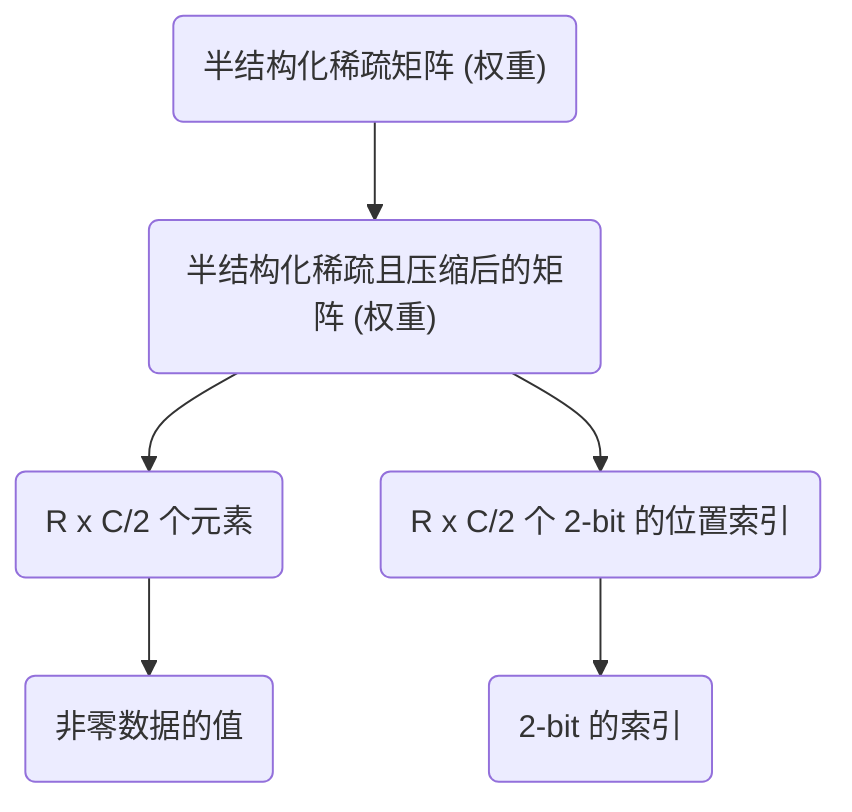

图 4.13 2:4半结构化稀疏模式及其数据的存储格式示意图

与非结构化稀疏模式相比，2:4稀疏模式及其数据的存储格式在访存和存储效率方面都更为出色。一方面，它能够消除依赖数据的不规则访存，提升带宽利用率。在传统的非结构化稀疏中，数据使用CSR、CSC或 COO 等存储格式，在稀疏矩阵一矩阵乘法（Sparse Matrix-Matrixmultiplication,SpMM）计算过程中，需要通过稀疏格式的数据内容确定矩阵值的访存地址，这将导致数据的不规则访存。相比之下，2:4 稀疏模式在矩阵的不同位置具有恒定的稀疏度，处理稠密操作矩阵时无须进行依赖数据的寻址，从而能够充分利用大带宽访存，并依靠计算单元进行小范围的索引。另一方面，2:4 稀疏模式占据的存储空间更小。它存储每个权重数据的索引仅需要2位。而在如图4.11所示的传统行压缩存储格式中，每个权重数据会带来更大的索引存储开销。例如，在2:4稀疏格式中，如果使用8位权重值，索引存储开销与非零权重值存储开销的比例为 25%，远低于行压缩存储格式中索引的相对存储开销（如果列索引使用16位，则索引存储开销可达 200%）。

半结构化剪枝方法的流程一般遵循基本的“训练一剪枝一微调”流程，即先训练一个稠密模型，再使用 2:4剪枝方法得到稀疏模型，最后对稀疏模型进行微调。针对上述 2:4 稀疏模式与压缩存储格式，Mishra等人设计了如图 4.14 所示的硬件加速单元，即稀疏张量核。该硬件加速单元相比于普通的稠密张量核增加了根据索引进行筛选的功能电路。在进行稠密计算时，相同数量的对应元素直接相乘，然后进行累加。在进行稀疏计算时，稀疏矩阵中的位置素引矩阵被用来筛选稠密矩阵中与之匹配的元素，然后对筛选出的匹配元素进行相乘和累加计算，以减少不必要的乘◎计算，使得实际所需的计算量降低为原始稠密计算的50%。而且，以上两种计算的乘法和累加电路是可以复用的。Chen 等人提出对Thansformer 模型中自注意力矩阵进行 n：m 半结构化稀疏。与对权重进行离线的n：m半结构化剪枝和稀疏编码不同，对激活进行 n：m半结构化稀疏需要在模型推理过程中高效地剪枝并稀疏编码动态计算出的激活值，因此 Chen 等人实现了采样稠密一稠密矩阵乘法（SampledDense-Dense Matrix Multiplication, SDDMM）的GPU算子，在模型推理时高效计算、剪枝并稀疏编码 Q五T矩阵。此半结构化稀疏矩阵被用于后续的按行 Soft max 和稀疏一稠密矩阵乘法，并加速对应计算。Chen 等人在 A100 GPU 上利用不同词块个数配置测试了1:2和2:4半结构化稀疏方法，相比稠密自注意力计算实现了1.38~1.86倍的加速。


图 4.14 张量核计算稠密和稀疏矩阵一矩阵乘法的流程示意图

### 4.7 针对激活值的剪枝方法

近似低秩分解、结构化剪枝、非结构化剪枝及半结构化剪枝，主要集中在对模型权重的操作上。本节将关注模型计算过程中的另一个关键部分，即激活值（Activation），探讨如何通过对激活值的剪枝提升模型的运行效率。激活值是在模型计算过程中产生的一些中间变量。有些激活值对最终结果的影响较小，因此可以跳过它们的计算。例如，在使用 ReLU作为激活函数时，会产生大量零激活值，这些零可以不继续参与权重短阵的乘法计算。这类方法被称为针对激活值的剪枝方法。

Transformer 的激活值剪枝是目前备受关注的研究领域。Thansformer 中的多头自注意力层（Multi-Heed Self-Attention, MHSA）是其核心组件之一。多头自注意力层会产生和输入与词块数 n2 的平方成正比的计算量和注意力矩阵激活值，因此针对 Transformer 的激活值剪枝是一种重要的高效设计方法。现有的 Tansformer 激活值的工作可以根据剪枝的位置是否与输入数据相关，分为动态激活值剪枝和静态激活值剪枝。

动态激活值剪枝会根据不同的动态输入删除不同位置的激活值。其基本思想是，实时地器测各个神经元的激活值，跳过对结果影响较小的神经元的计算，去除这些神经元对模型的影响从而实现剪枝的目的。Wang 等人利用自然语言中词句的“天然冗余性”，提出针对词块的剪枝方法。在注意力机制中，词块；和词块，之间的关系越强，注意力矩阵（i,j）处的值就越大。如图 4.15所示，该工作通过对注意力短阵的列进行求和，获得每一个词相对于所有词的累积重要性。对于累积重要性较低的词，会被从这一层及之后所有层的输入中删除，相当于删除了注意力矩阵对应行和列的激活值。实验表明，这种激活值剪枝方法可以将模型的计算量和访

存量減少 74%。


图 4.15 通过对注意力矩阵的列求和，判定词块的重要性并剪枝不重要的词块

与动态激活值剪枝不同，静态激活值剪枝中勇枝的激活值位置不随具体输入变化。这种勇枝方法通常在模型设计阶段就确定了剪枝的位置，并通过训练等方式使模型适应激活值的这都稀疏模式。BigBirdl24）通过预先定义的稀疏掩膜来规定注意力短阵中需要计算的元素位置，以而将注意力计算的复杂度从 O（n2）降低到 O（m））。如图4.16所示，BigBind 注意力掩膜主要由三个部分组成：随机掩膜、局部掩膜和全局掩膜。这些掩膜的设计使得稀疏的注意力能够有效地模拟原有稠密注意力模型中的重要注意力值。例如，一个词与所有词的全局注意力，或者都个词与周围词的局部注意力。同时，作者也证明了这种预先定义的稀疏注意力可以和完整附注意力一样建模所有连续的序列到序列函数，且具有“图灵完备性”。

另外，如果把每个词看作一个节点，将词与词之间的注意力看作一条边，就可以对静态稀疏注意力进行更进一步的理解和分析。原始的完整注意力相当于一个完全图，即所有节点之间的最短路径距离都是 1。稀疏注意力中的随机掩膜相当于图上的一些随机边。作者说明了O（n）条随机边就可以让图上任意两个点之间的最短路径距离变成 O（Logm）。这表示随机掩膜可以很好地保证词之间的信息流动，这和完整注意力是类似的。


图 4.16 由随机掩膜、局部掩膜和全局掩膜共同组成的 BigBird 注意力掩膜

注意力剪枝的差异不仅体现在动态性上，而且与权重剪枝类似，也表现在剪枝的基本单元粒度上。在词块粒度上的剪枝意味着跳过注意力矩阵中对应行和列的计算。例如，Chen 等人将图像的每个小块看作一个词块，决定每次注意力矩阵计算时可以删除哪些词块。注意力头粒度的剪枝使用更大粒度的剪枝单元。Wang 等人提出删除不重要的注意力头来減少 Transformer的计算量和内存开销。Hou 等人直接在层级粒度使用早停（Early Stopping）技巧，对于简单的任务，直接从某一层返回结果，跳过后面的所有计算。

### 4.8 剪枝方法的经验性选择

本节主要针对结构化剪枝方法，总结经验性规则，以帮助读者根据需求选择合适的方法，并分析剪枝结果的合理性。

#### 剪枝流程的选择

剪枝流程在算法层面存在三方面的需求，即需要保证剪枝后的模型有较高的准确率，需要满足明确的硬件资源限制，需要快速给出剪枝后的轻量化模型（剪枝方法本身的速度）。根据这三方面需求可以给出如下方法选择的建议。

（1）基于权重正则的方法：典型的方法是 SSL。4.3.1 节提到，这类方法在保持准确率的同时，难以可控地满足预先定义的硬件资源限制。然而，它们的时间开销相对较低。

（2）基于离散搜索的方法：典型的算法是 Net.Adapt30）和 AMC™T。4.3.2 节提到，这类为法能够根据预设的硬件资源限制进行精确剪枝，同时保持较高的模型准确率。但它们通常需要一个内外两层循环的迭代流程，时间开销较高。

（3）基于可微分搜索的方法：典型的算法是 BAR和 DSAB。这类方法结合了基于权重正则的方法和基于离散搜索的方法的优势，以可微分的方式进行层问敏感度分析，能够在满足资源限制的同时降低时间开销。但它们的敏感度分析的近似较为激进，评估准确度可能不足且模型准确率的波动较大，需要更精细的超参数调整。

#### 4.8.2 剪枝稀疏模式的选择

在特定硬件环境下，还需要分析硬件特性，并根据这些特性选择合适的模型剪枝方法。以下是对主流硬件环境下剪枝方法选择的建议。

（1）GPU:GPU普遍对稠密计算有良好的支持，它是为稠密的矩阵计算操作设计的。因此结构化剪枝方法通常能够较好地适配。NVIDIA 的安培架构显卡如 RTX 3090支持 N:M半结构化稀疏剪枝方法，能够在保持硬件性能的同时提供 50% 以上的较高压缩率。

（2）CPU:CPU 的指令通常是细粒度的，精确到基本的乘法和加法操作。因此，CPU 更关注剪枝方法带来的压缩率，而非关注其是否是结构化的。非结构化剪枝方法中的 Deep Com-pression和专门为CPU设计的半结构化剪枝方法都能在CPU上高效运行。

（3）专用硬件：专用硬件会使用更精细的调度、新的数据格式等方式高效地处理非结构化剪枝后的模型。例如，ESEP90|通过计算负载均衡技术缓解非结构化剪枝带来的计算单元负载不均衡，从而显著提高硬件处理速度。需要注意的是，这些专用硬件通常也支持结构化剪枝，使用时应根据模型的实际情况判断哪种剪枝方式更高效。

#### 4.8.3 关于任务性能的经验

为了分析在不降低精度的前提下，每个任务可以达到的压缩率，通常从任务类型、数据集规模和主干模型这三个维度考虑。通过控制变量的方法进行分析（固定两个维度，仅改变第三个维度），可以分别理解这三个维度对压缩率界限的影响。

（1）任务类型；不同任务上的同一模型可能具有不同的压缩率。例如，使用特定的剪枝方法对在分类任务和目标检测任务上分别训练好的 ResNet-50 模型进行压缩。分类任务的 ResNet-50模型的压缩率可能超过90%，而目标检测任务的ResNet-50 模型的压缩率可能只能达到70% 

（2）数据集规模：通常认为，训练数据规模越大，模型的压缩率越小。这是因为随着训练数据量的增加，可能会有更多模型权重被有效利用。例如，对于同一个模型，在 Imagelvet 数据集上训练通常比在 CIFAR 数据集上训练的压缩率低。

（3）主干模型：不同主干模型之间的可剪枝比例可能存在显著差异。例如，在目标检测任务中，对在 VOC 数据集上训练好的 SSD目标检测模型进行通道剪枝。当主干模型为 MobileNet时，模型的压缩率可能仅达到30%L32；而主干模型为 ResNet-50 时，模型的压缩率可能超过75%l.33l。一般来说，冗余度较高的模型更容易进行剪枝，例如 VGG比 ResNet 更容易剪枝，而ResNet 比 MobileNet 更容易剪枝。

#### 4.10 本章小结

模型剪枝是一类非常重要的模型压缩方法，旨在通过识别并删除模型中的冗余部分，以减少模型的计算和存储开销。具体来说，模型剪枝可以对神经网络的冗余权重或推理过程中的冗余激活值进行修剪，保持模型性能的同时显著提高其推理效率和资源利用率。在模型压缩的多个领域中，模型剪枝已经被广泛应用并取得了显著效果。

在这章中，分别详细介绍了不同的剪枝方法及其在模型中的应用。4.3节、4.5节和4.6节探讨了基于不同稀疏模式的权重剪枝方法。权重剪枝通过在训练后期移除不重要的权重来减少模型参数，从而达到模型简化和压缩的目的。采用稀疏模式的权重剪枝可以有效提高模型的稀疏性，同时保持模型的预测精度。

此外，低秩分解也是一种非常有前途的模型压缩技术，4.4节对此进行了详细阐述。低秩分解的核心思想是将权重矩阵进行分解，从而在结构化的低维空间中实现权重剪枝。通过这种方式，低秩分解能够在减少模型参数量的同时保持较高的模型表现。由于低秩分解本质上是在张量分解后的空间中进行的结构化剪枝，因此它可以被看作是模型剪枝的一种特殊形式。

在激活值剪枝方面，4.7节介绍了相关方法。这类剪枝方法主要针对模型在推理过程中产生的激活值，通过剪枝不重要的激活值来进一步优化模型的计算效率。激活值剪枝与权重剪枝相辅相成，能够在多个层面上提升模型的推理速度和资源利用率。

为了进一步深入了解模型剪枝和低秩分解，建议读者参考 Deng 等人撰写的综述文章，其中涵盖了这些领域的最新进展和技术细节。该综述为读者提供了全面的背景知识，帮助他们更好地掌握模型剪枝和低秩分解的核心概念及其应用。

在未来，关于模型权重和激活值剪枝的研究方向还有许多值得探索的领域。首先，对于视觉或文本 Transformer 模型，稀疏注意力机制的研究非常关键，尤其是在处理超长序列时，这一技术可以有效降低计算复杂度。其次，通过稀疏化或低秩分解来加速模型的训练过程也是一个重要的研究方向。随着模型规模的不断扩大，如何有效地加速训练过程将成为提高深度学习模型应用效率的关键。

总结而言，模型剪枝和低秩分解作为模型压缩的关键技术，已经在多个领域取得了显著进展。未来的研究将继续围绕稀疏性、低秩结构和模型加速等方面展开，推动这些技术在更广泛的应用场景中得到进一步发展。

## 2. Quantization

[https://mp.weixin.qq.com/s/dgS-yRVpGe\_w1uzbcVctXg: https://mp.weixin.qq.com/s/dgS-yRVpGe\_w1uzbcVctXg](https://mp.weixin.qq.com/s/dgS-yRVpGe_w1uzbcVctXg)

[https://newsletter.maartengrootendorst.com/p/a-visual-guide-to-quantization: https://newsletter.maartengrootendorst.com/p/a-visual-guide-to-quantization](https://newsletter.maartengrootendorst.com/p/a-visual-guide-to-quantization)

[https://www.bilibili.com/video/BV1kw4m1X7Bi/?spm\_id\_from=333.1387.collection.video\_card.click&vd\_source=c5bdb0f48617ac846848b6be17c6f732](https://www.bilibili.com/video/BV1kw4m1X7Bi/?spm_id_from=333.1387.collection.video_card.click&vd_source=c5bdb0f48617ac846848b6be17c6f732)

在众多量化技术中，post-training quantization（PTQ）是最为流行的一种。这种方法是在训练完模型之后对模型的参数（包括权重和激活值）进行量化。

**对于权重值**的量化可以采用**对称量化（symmetric quantization）**或**非对称量化（asymmetric quantization）**两种方式。

**至于激活值**，由于我们不知道其范围，因此需要通过模型的推理来获取它们的 potential distribution（译者注：指的是在不同的输入数据和模型参数下，激活值可能出现的一系列数值。了解这个分布有助于我们选择一个能够包含大部分激活值范围的量化级别，从而减少量化误差。），然后再进行量化。

激活值的量化主要有两种形式：

*   **动态量化（Dynamic Quantization）**
    
*   **静态量化（Static Quantization）**
    

[https://robot9.me/ai-model-quantization-principles-practice/: https://robot9.me/ai-model-quantization-principles-practice/](https://robot9.me/ai-model-quantization-principles-practice/)

### 模型量化的定义和分类

在深度学习模型的推理过程中，量化是一项关键的优化技术，它通过将浮点运算转换为定点运算，显著提升了推理效率并降低了计算资源的消耗。在这个过程中，理解量化的具体操作和公式尤为重要。下面，我们将详细讲解常见的量化公式、量化方法以及主动量化与被动量化的概念。

**1. 量化公式**

量化的基本公式如下：

$x\_q = \text{clip}\left( \text{round}\left( \frac{x}{\text{scale}} \right) + z, \text{min}, \text{max} \right)$

该公式可以分解为以下步骤：

• **x**：原始浮点数输入，表示我们在推理过程中需要量化的数据。

• **scale**：量化比例系数，决定了如何将浮点数缩放至量化的整数范围。它是量化过程中最关键的参数之一。

• **z**：零点（zero point），在非对称量化中用于调整量化后的整数表示。它可以使得数据分布更贴近量化的整数范围。

• **round()**：取整操作，将浮点数转换为最接近的整数，保证量化后的数据可以在定点模型中计算。

• **clip()**：截断操作，将结果限制在指定的范围内，通常是量化整数表示的最小值（min）和最大值（max），以防止数值溢出。

**公式过程**：

1\. **缩放**：首先对输入浮点数x进行缩放，将其除以scale，得到一个缩小的浮点值。

2\. **取整**：然后对缩放后的结果进行取整，转换为定点数。

3\. **零点调整**：对于非对称量化，向量z（zero\_point）会添加到取整后的值上。

4\. **截断**：最后，将得到的整数值限制在指定的范围\[min, max\]内，以防止溢出。

**2. 主动量化与被动量化**

在模型量化过程中，操作符根据是否依赖输入和输出的量化参数，可以分为主动量化算子和被动量化算子。

• **主动量化算子**：这是指那些在转换为定点算子时，必须依赖输入和输出的量化参数来进行正确计算的算子。例如，卷积（Conv）算子在转换为定点QConv时，必须使用输入和输出的scale和zero\_point等量化参数，以保证量化计算的准确性。主动量化算子在量化过程中，离不开这些量化参数。

• **被动量化算子**：与主动量化不同，被动量化算子在转换为定点算子时，不需要使用输入或输出的量化参数。这类算子的计算不会受量化参数的影响。例如，MaxPooling算子只需要选择输入中的最大值，因此它不依赖输入或输出的量化参数。

**3. 量化节点参数的选择**

量化节点的参数主要分为三类：量化方法、量化精度、量化粒度。每一类参数的选择都会对模型的量化效果产生重要影响。

**3.1 量化方法**

量化方法决定了数据如何在浮点数与定点数之间转换，主要有以下几种方式：

• **对称量化**：zero\_point为0，数据的正负两侧有相同的表示范围，适合均匀分布的数据。

$q\_x = \text{round} \left( \frac{x}{\text{scale}} \right)$

• **非对称量化**：zero\_point不为0，适用于带有偏移的数据分布。

$q\_x = \text{round} \left( \frac{x}{\text{scale}} \right) + z$

• **均匀量化**：整个数据集使用固定的scale，适用于分布较为一致的数据。

• **非均匀量化**：scale会随着输入或不同的通道进行变化，适用于数据分布不均的情况。

• **动态量化**：scale在推理过程中根据实时数据动态调整，适合实时推理场景。

• **静态量化**：scale在模型转换过程中离线计算，在推理时直接使用，适合固定硬件资源的场景。

**3.2 量化精度**

量化精度决定了量化过程中数值表示的位数，常见的选择有：

• **4-bit**：适用于对精度要求较低的层，推理速度快。

• **8-bit**：最常用的精度，能够平衡推理速度和模型精度。

• **16-bit**：提供更高精度，适用于对精度要求较高的层。

**3.3 量化粒度**

量化粒度决定了量化参数的应用范围：

• **Per-tensor量化**：整个激活层使用同一个scale，适合计算要求较低的场景。

• **Per-channel量化**：每个通道可以使用独立的scale，能够提高精度。

• **Per-block量化**：量化粒度可以进一步细化，对特定的块或区域进行独立量化，适用于复杂模型。

**4. 量化算法**

在量化公式中，各个参数（如scale、round、min、max、clip）都可以通过不同的搜索或优化策略来选择。影响量化误差的关键因素是 **scale**，它对 **rounding error** 和 **clipping error** 的影响尤为显著。以下是对相关概念的进一步解释。

**量化公式**

$x\_q = \text{clip}\left( \text{round}\left( \frac{x}{s} \right), \text{min}, \text{max} \right)$

其中：

• **x**：输入的浮点数。

• **s**（scale）：量化比例因子。

• **round**：将浮点数向最近的整数取整。

• **clip**：将取整后的值限制在给定的最小值（min）和最大值（max）之间。

**Scale（s）的计算**

**scale** 是影响量化误差的主要参数，它不仅决定了浮点数如何映射到离散的量化范围，还对 **rounding error** 和 **clipping error** 有直接影响。**scale** 的值取决于 **Threshold** 和 **Bit**（位宽），其公式为：

$s = \frac{\text{Threshold}}{2^{\text{Bit}} - 1}$

• **Threshold**：表示量化过程中的截断值，定义了量化数据的动态范围。它通常根据数据的统计分布来计算，可以使用最大值（max）、KL散度（KL Divergence）、百分位（percentile）、均方误差（MSE）、最小最大值（min-max）等方法。

• **Bit**：表示用于量化的位宽。例如，4-bit、8-bit 或 16-bit，每个比特位的增加都能提供更高的精度。

在对称量化中，**zero\_point** 为零，所以公式中只考虑 **scale** 的影响。**scale** 越小，数据的取整误差（rounding error）也越小；但是，过小的 **scale** 可能导致 **clipping error** 增大。因此，**scale** 的选择是一个需要精确权衡的过程。

**阈值（Threshold）的计算**

**Threshold** 的选择对量化误差有重要影响，常用的计算方法包括：

• **max**：取数据分布中的最大值作为阈值。

• **KL散度**：选择使量化后数据与原始数据KL散度最小的阈值。

• **Percentile**：根据数据的百分位点选择阈值，如取99.99%的数据点作为上限。

• **MSE**：通过最小化量化后数据与原始数据的均方误差（MSE）来选择阈值。

• **min-max**：根据数据的最小值和最大值来计算量化范围。

通过以上的公式与优化方法，量化中的各个参数可以根据具体的数据分布和应用需求进行搜索与调整，确保在模型精度与性能之间取得良好的平衡。

**4.1 最大最小值（Min-Max）量化**

**Min-Max量化**是最常见的非对称量化方法。它通过选择数据分布中的最小值和最大值来定义量化的上下限范围：

• **最大值（Max）**：在数据分布中取绝对值最大的数值作为阈值（Threshold）。

公式表示为：$\text{Threshold} = \max(|x|)$

这种方法简单直接，但对离群值（outliers）非常敏感，容易导致量化范围过大，从而增大量化误差。

• **最小值（Min）**：同理，数据分布中的最小值定义了量化的下限阈值。Min-Max量化的范围通过取数据的最小值和最大值，定义了从到的量化区间。

虽然该方法简单实用，但当数据分布中存在异常的大值或小值时，可能会使得量化范围过宽，从而导致量化误差加大。

**4.2 KL散度量化（Kullback-Leibler Divergence）**

**KL散度量化**是一种统计量化方法，用于测量原始数据分布与量化后数据分布的差异。通过找到使KL散度最小的量化阈值，来确保量化后的数据与原始数据之间的差异最小。

• **KL散度公式**：

$D\_{KL}(P||Q) = \sum P(x) \log \frac{P(x)}{Q(x)}$

其中， 是原始数据的概率分布， 是量化后的数据分布。KL散度用于衡量两个概率分布之间的差异，KL散度越小，两个分布越接近，量化误差也越小。

在KL散度量化中，通过对不同的阈值进行实验，找到KL散度最小的那个阈值来进行量化。虽然KL散度在衡量数据分布上的差异非常有效，但它并不总能保证模型整体量化误差最小，尤其是在处理复杂模型时。

**4.3 百分位（Percentile）量化**

**Percentile量化**是一种通过选择数据分布中的某个百分位点作为量化阈值的方法。它通过排序数据并取某个百分比的值来确定量化的上限或下限。

• **Percentile选择**：

公式表示为：

$\text{Threshold} = P\_{\text{percentile}}(x)$

例如，取99.99%的百分位点，表示选择数据分布中前99.99%最大的值作为量化的上限阈值。这样可以有效避免数据中的离群值（异常值）对量化范围的负面影响。

百分位量化特别适用于数据中存在少量离群值的情况。通过忽略这些异常值，模型可以更有效地将量化范围集中在实际的数据分布上，从而减少误差。

**4.4 均方误差（MSE）量化**

**MSE量化**通过最小化量化后数据与原始数据之间的均方误差来选择最优阈值。均方误差用于衡量量化前后数据之间的偏差，MSE越小，表示量化后的数据与原始数据越接近。

• **MSE公式**：

$\text{MSE} = \frac{1}{n} \sum\_{i=1}^{n} (x\_i - \hat{x}\_i)^2$

其中， 是原始数据， 是量化后的数据。

通过最小化MSE，可以减少量化误差，保证模型的精度。然而，MSE量化通常计算量较大，因此更适合精度要求较高的应用场景。

**4.5 综合选择量化阈值**

在实际应用中，选择量化算法时可以结合多种方法。以下是几种常见的使用场景：

• **Min-Max量化**：适用于数据分布较为对称、没有极端异常值的场景。

• **KL散度量化**：适用于需要较高精度的场景，特别是在神经网络中使用。

• **Percentile量化**：适用于数据中存在离群值的情况，通过忽略极端值减少量化误差。

• **MSE量化**：适用于对量化精度有严格要求的场景，但计算成本较高。

**5. 权重和激活量化**

在AI模型中，权重和激活的量化是实现计算优化的两个关键步骤。量化的目标是减少模型的计算复杂度和存储占用，同时尽量保持模型的推理精度。模型的计算过程可以简化为 ，其中  代表激活， 代表权重，这两者通常需要分开量化。

**5.1 激活量化**

激活量化的目标是通过对模型中神经元的激活进行量化，将其从浮点表示转换为整数表示。这有助于在硬件上加速推理过程。激活量化的关键是选择合适的量化参数（如scale、zero\_point和bit数），确保量化过程中误差最小化。

**量化参数的选择**

激活量化中的参数选择至关重要，以下是量化参数选择的关键点：

• **Scale的选择**：激活的scale决定了数据如何缩放到量化的整数范围。scale越小，rounding error越小，但也会增加clipping error。因此，scale需要在误差最小化的前提下进行精确调整。

• **Threshold的计算**：激活量化中的阈值（Threshold）通常根据激活值的分布进行选择。常用的选择方法有：

• **最大值（max）**：直接选择激活数据的最大值作为阈值。

• **百分位（percentile）**：选择激活数据中某个百分位数的值作为阈值，常用的是99.99%的百分位数。

• **KL散度（KL Divergence）**：通过计算原始数据与量化数据的KL散度，选择使散度最小的阈值。

• **最小最大值（min-max）**：选择激活数据的最小值和最大值来确定量化范围。

• **Bit数的选择**：激活量化的精度由bit数决定。常见的选择包括：

• **4-bit**：适用于对精度要求不高但追求更快推理速度的场景。

• **8-bit**：常见的量化位数，平衡了精度和推理速度。

• **16-bit**：用于对精度要求较高的场景，但推理速度较慢。

**模型激活量化的算法**

模型的激活量化通常通过以下几种方法实现：

• **Modelwise**：对整个模型使用统一的量化参数进行激活量化，这种方法简单高效，但对精度的影响较大。

• **Layerwise**：为模型中的每一层分别选择最优的量化参数。这种方法更加灵活，可以有效减少量化误差，提升模型精度，但计算复杂度更高。

激活量化的挑战在于如何最小化量化误差，尤其是在高非线性激活函数（如ReLU、Gelu等）中，需要特别关注clipping和rounding误差。通过优化scale和bit数，可以平衡精度和性能。

**5.2 权重量化**

权重量化与激活量化类似，也涉及到量化参数的选择和优化。然而，权重数据的特性与激活有所不同，通常需要采用额外的校准和优化技术来确保量化精度。

**权重量化的参数选择**

• **Scale和Bit数的选择**：与激活量化类似，权重量化也通过scale和bit数来控制量化精度。权重的scale和bit数通常通过搜索或优化算法得到，以确保模型性能不受明显影响。

**Bias Correction方法**

在权重量化中，误差常常具有方向性，这种误差会导致输出偏移，最终影响模型的精度。**Bias Correction** 是一种常用的误差校准方法，旨在修正量化过程中产生的偏移。

Bias Correction的核心思路是在量化时计算量化后权重与原始权重之间的偏移误差，然后将该误差合并到模型的偏差（Bias）中。这种校准方式可以有效减小量化引入的误差，同时不会增加推理时的计算开销。

**权重量化的优化方法**

除了Bias Correction，还有一些常用的权重量化优化方法：

• **跨层均衡量化**：跨层均衡量化通过对不同层的权重进行平衡处理，确保量化时误差最小。该方法通过在不同层间分配权重的scale来减少量化引起的累积误差。

• **SmoothQuant方法**：这是另一种用于权重量化的优化方法，旨在通过平滑化激活和权重之间的scale差异来减少量化误差。

**权重量化的应用场景**

权重量化广泛应用于深度学习模型的推理阶段，尤其是在移动设备或嵌入式系统中，权重量化可以大大降低模型的存储需求并提高推理效率。


**6. 模型量化的复杂度与成本**

在深度学习模型的推理过程中，量化是一个常见的优化步骤，用于减少计算复杂度并加速推理。在选择量化方法时，考虑模型精度、数据可用性、计算资源等因素至关重要。以下是对不同复杂度量化方法的详细介绍。

**6.1 Level 1：Data-Free量化**

**Data-Free量化** 是最简单的量化方法，只需要一个预训练模型，不需要额外的数据进行校准或优化。这类量化直接依赖模型的现有结构进行量化操作。

• **适用场景**：适用于没有数据集或数据不可用的情况下，尤其是在快速部署的场景中。

• **优点**：无需额外数据，计算复杂度低，实施简单。

• **缺点**：由于没有进行数据校准，量化误差可能较大，导致模型精度下降。

**6.2 Level 2：Light PTQ（轻量后训练量化）**

**Light PTQ** 需要一个预训练的模型和少量的校准数据。这种量化方法通过分析少量的数据，基于统计规则来确定量化参数，从而实现模型的量化。

• **适用场景**：当有少量数据可用且对精度有一定要求时，Light PTQ 是一种良好的折衷方案。

• **优点**：只需要少量校准数据，计算复杂度较低，能够减少量化误差。

• **缺点**：虽然减少了量化误差，但相比更复杂的方法，精度可能有所下降。

**6.3 Level 2+：Advanced PTQ（高级后训练量化）**

**Advanced PTQ** 在 Light PTQ 的基础上，通过加入梯度下降等优化算法进一步优化量化参数。这种方法可以根据少量数据的梯度信息，迭代优化模型的量化效果。

• **适用场景**：当数据量有限但需要更高的模型精度时，Advanced PTQ 是一种有效的解决方案。

• **优点**：提供更高的精度，适合在精度与成本之间做出折衷的场景。

• **缺点**：相比于Light PTQ，Advanced PTQ 的计算成本较高，优化过程中需要更多计算资源。

**6.4 Level 3：QAT（量化感知训练）**

**QAT量化** 是最复杂的量化方法。它需要使用完整的训练数据和标签，并在训练过程中模拟量化影响。通过将量化操作融入训练Pipeline，QAT确保模型在训练时能够适应量化带来的精度损失。

• **适用场景**：当有充足的数据和计算资源且对精度要求极高时，QAT 是最好的选择，尤其适合硬件加速器上的部署。

• **优点**：通过训练中的量化模拟，QAT 可以最大程度减少量化误差，提供接近原始浮点模型的精度。

• **缺点**：QAT 训练成本高，需要完整的数据集和大量的计算资源，训练时间也更长。

**6.5 模型量化精度恢复策略**

通常，模型的量化精度损失相对较小，可以通过 **Level 2 Light PTQ** 方法来满足性能要求。然而，若模型精度损失较大，可以采用 **Level 2+ Advanced PTQ** 甚至 **Level 3 QAT** 来恢复量化模型的精度。

• **Light PTQ**：适用于精度损失较小的模型，可通过少量数据进行统计校准。

• **Advanced PTQ**：适用于精度损失较大的情况，通过梯度下降等优化技术提升模型精度。

• **QAT**：在精度损失极大的场景下，通过量化感知训练恢复模型精度，确保模型在量化前后性能保持

### 模型量化是一类有效的模型压缩方法

可以降低模型的离线存储开销，还可以降低模型运行时的计算量、存储量和访存开销。这些开销的降低有助于提升硬件系统的性能指标，包括延时、吞吐率、能耗和功率等。简而言之，模型量化的核心思想是，以低位宽表示神经网络模型运行时涉及的各种数据，如权重、激活值和梯度，而不使用默认的32位单精度或16 位半精度浮点数表示。

通常，传统的神经网络模型采用32位单精度浮点格式进行存储和计算。IEEE 标准所定义的32位浮点格式如图 5.1所示，其中包含1个符号位（Sign），8个指数位（Exponent）及 23个尾数位（Mantissa），其表示精度较高、表示范围较大。然而，神经网络推理通常不需要如此高的精度，且数据格式和位宽对推理效率有很大影响。具体来说，模型推理的能耗或延时开销主要由以下两类操作带来。

（1）访问存储器（访存），即在存储单元和计算单元之间传输权重、激活值等数据。

（2） 计算，即实际进行乘累加、非线性等计算。


图 5.1 IEEE 标准里的 32 位浮点数

若使用8位整型格式（INT8）来表示原本用32位浮点格式（FP32）表示的数据，则不仅可以将该数据的存储开销降低75%，还可以降低访存开销。至于计算开销，整型计算相对于浮点数更简单，整型计算单元比浮点计算单元具有更小的能耗和电路面积。因此，用整型计算代替浮点计算能够降低约一个数量级的能耗与缩小两个数量级以上的电路面积，这对端侧部署及芯片设计都非常有利。对于给定的硬件平台，使用低精度格式进行计算的前提是硬件平台需要有支持该低精度格式的计算单元。

由于模型量化方法具有较好的效率提升潜力，研究者们持续开发量化方法，从量化格式设计、量化参数确定、量化值调优、针对量化的架构调整等多个维度进行设计，旨在实现硬件推理效率和量化后模型任务性能的最佳权衡。2016年至今，模型量化方法的研究已经取得了长足的进展。

从优化问题定义和求解的视角来看，模型量化方法需要求解的优化问题的定义如下。优化空间主要由量化格式（描述了低位宽数和实际表示数值的对应关系）、量化参数（量化格式中的待决定参数）、量化值（低位宽数）三类决策组成。模型量化方法需要力神经网络里每个张量（包括权重、激活值、偏置、计算中间值等）确定量化格式和量化参数， 权重确定量化值，从而得到量化模型。

特定工作可能会预设一些决策的选择，只针对余下的決策调优，即将优化空间缩减为一个较小的子室间。例如，一些工作主要关注设计量化格式、量化参数确定方法或调优量化值的校准和训练方法。优化目标是降低量化所造成的任务性能损失。特定工作可能会设计其代理目标并提出相应的求解方法，例如以量化误差（QuantizationError，数据拟合误差）或重建误差（Reconstruction Brror，激活值重建误差）作为代理目标，或将每个数据的量化误差和该数据误差的敏感度的乘累加作为代理目标。约束条件可能是直接的硬件性能指标约束，例如对推理延时或功耗的约束，也可能是和最終推理效率相关的代理约束。例如，许多工作将位宽约束作为代理约束，即要求所有权重、激活值均使用 8-bit、4-bit 位宽等。而硬件感知量化或软硬件协同设计方法则通常直接针对硬件性能指标进行方法设计。


优化问题定义和求解视角下的模型量化

从使用场景及工作流的视角来看，模型量化方法可被分为以下两种流程：训练后量化（Post-Training Quantization,PTQ）和量化感知训练（Quantization-Aware Training,QAT）。训练后量化基于已训练好的浮点模型进行量化，适用于数据量和运行时间受限的场景（要求快速完成量化或只能访问少量数据甚至无数据的场景）。量化感知训练在训练过程中模拟量化操作，通过训练让权重适应量化带来的误差。虽然量化感知训练产生的量化模型一般能达到更高的任务性能，但其量化流程需要更多的训练数据和更大的训练开销。

下图展示了量化领域的概况。首先，不少工作持续改进训练后量化与量化感知训练的具体方法。然后，学术研究持续关注如何以极低位宽（1-bit）取得较优的任务性能这一话题。BinaryConnect 、XNOR-Net、Bi-Real Net 、ReActNet 等二值化神经网络将权重与激活值量化成单比特位宽，具有加速与能耗优化的潜力。以HAQ、ReLeQ、FracBNN等工作为代表的硬件感知量化或协同设计方法，不用位宽作为硬件系统性能的代理，而是直接针对硬件系统的性能指标进行方法设计。除了关注推理效率，出于改进训练效率，包括缓解多机训练的通信压力、让训练能在端侧设备上进行等目的，研究者提出了 WAGE、MILS等一系列低比特训练算法，在训练时用低位宽格式表示权重、激活值或梯度。


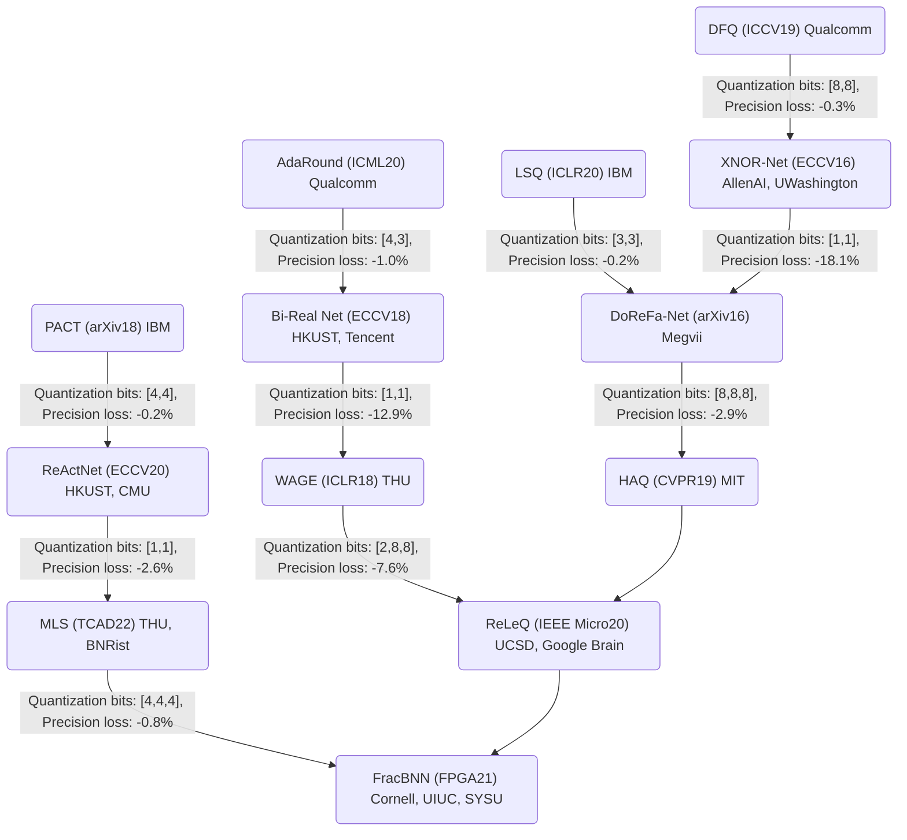

图中量化位宽［W, A，（G）］分别表示模型权重（W）、激活值（A）与梯度（G）的量化位宽

本章将按以下顺序展开：

5.2节将明晰两个量化的相关过程；

5.3 节将介绍有代表性的量化格式，其中会介绍量化参数等基本概念；“如何决定量化参数以最小化任务性能损失”是量化方法设计所需关注的重点，由于其重要性，

5.4 节将展开介绍几种重要的量化参数；

5.5 节与5.6节将详细介绍训练后量化与量化感知训练这两种流程的具体步骤和每个步骤的方法；

5.7 节将介绍混合位宽量化方法，这些工作关注寻优“量化位宽”这一类量化参数；

5.8 节将给出量化方法选择及量化效果的一些经验；

5.9节与5.10 节将介绍实现低比特计算的硬件单元，以及低比特训练的相关知识。

### 5.2 模型量化过程和量化推理过程

在讨论其他量化相关概念前，首先需要分清两个过程，即离线模型量化过程和在线量化推理过程。

（1） 模型最化过程指的是得到量化模型的最化方法运行过程。在此过程中，量化方法需要将高位宽表示的权重转换为低位宽表示的权重。若推理过程中的激活值也需要量化,且不是在量化推理过程中在线针微活值量化参数的话,量化方法还需要为激活值确定量化参数。

（2） 量化推理过程指的是从离线的模型量化过程得到量化模型后，从量化模型做推理的过程。推理过程根据是否使用低进度计算可分为两类。一类是使用低精度计算单元，一个典型流程是，两个int8输入张量进行低精度乘法后在一些张量维度相加，累加器一般需要更大位宽以防止溢出，如int32，最后累加输出需要进行再量化回到int8，另一类是使用高精度计算单元，将低位宽表示的权重或激活去量化回到高位宽表示，然后使用高精度计算单元进行计算。最后，计算结果可能需要量化回低位宽表示，如用于降低训练时激活值的存储和通信开销等。


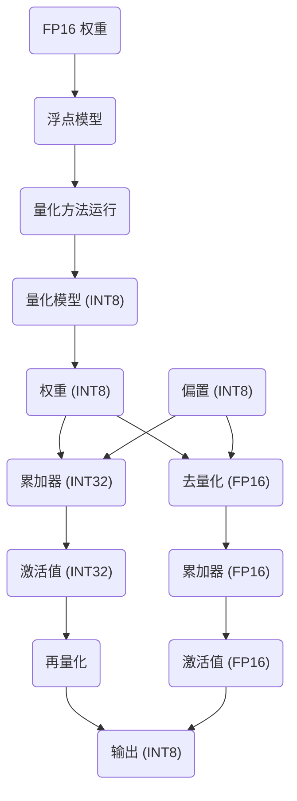

“模型量化过程”和“量化推理过程”示意图输入(INT8)

#### 5.3 量化格式和操作

一个 8-bit 机器数有256个可能取值，对应256个量化水平。量化水平指的是一个机器数取值所表示的浮点值。每个机器数取值分别表示什么浮点值取决于具体的量化格式和参数。如图5.5上半部分所示，对于均匀量化格式，相邻量化水平间的间隔是统一的；而对于非均匀量化格式，量化水平则不是等距分布的。如图5.5 下半部分所示，对于有符号对称量化格式，量化水平的分布关于。对称'；反之，对于有符号非对称量化格式，量化水平的分布关于0不对称。图中，n表示量化位宽。

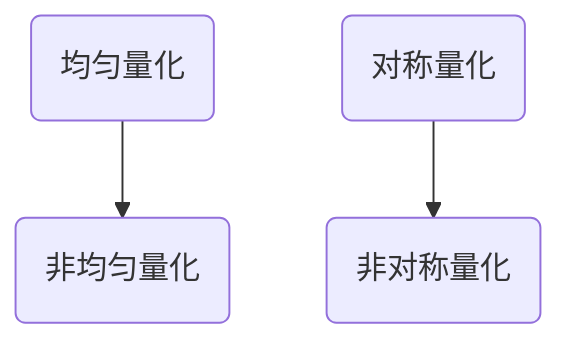

量化格式示意图

5.3.1 节将介绍均匀量化格式的量化和去量化操作，并借此引出多个重要概念。5.3.2 节将介绍包括低比特浮点格式在内的几种常见非均匀量化格式。5.3.3 节将介绍三个表示特定操作的常用名词：模拟量化操作、量化乘累加操作和再量化操作。模拟量化通常发生在模型量化过程中，而量化乘累加操作和再量化操作通常发生在量化推理过程中。

##### 5.3.1 均匀量化格式

1.  量化操作
    

式5.1 展示了以一个浮点格式的待量化（Quentize）数值 z（又称全精度数值）转換到一个均匀格式的量化值 zint 的量化操作：

$x\_{int}=clip \left( \left\[ \frac{x}{s\_{x}} \right\]+z;q\_{ \min},q\_{ \max} \right)\newline clip \left( x;a,b \right)= \begin{matrix} a&x<a \\ x&a \leq x \leq b \\ b&x>b \end{matrix}$

下面以式5.1中的均匀量化格式的量化操作为例，介绍量化格式和操作涉及的多个概念。浮点缩放系数（Scaling Factor） Sx与量化要点（Zero Point）z为待决定的的量化参数（Quantization Parameter ）。Qmin, Qmax 表示整型值的范围，该数值与量化位宽（Quantization Bit-width）和格式有关，例如在8-bit 有符号（Signed）均匀量化格式中，Qmin = -128, 9Imex = 127，在8-bit 无符号（Unsigned）均匀量化格式中，9hnin = 0, Qmax =255。clip（.）为截断函数（ClippingFunction），将超出范围的整型数据截断到范围端点。

Qmin, Qmax 对应表示的浮点数区间被称为量化区间（Quantization Range），在本章中将其记为\[Vmin,Vmax\]。

在式 5.1中，\[Vmin,Vmax\]［（Qmin -z）Sx，（Qmax -z）Sx\]。\[.\]为舍入函数（Rounding Function），常用的舍入函数包括最近舍入（Nearest Rounding） 和随机舍入（Stochastic Rounding）两种。可以看到，由于舍入函数的存在（以使用最近舍入为例），在一个子 区间内的浮点数会被映射到同一个整型值的范围，它们会被近似为同一个浮点值（量化水平，Quantization Level）。

一般将子区间长度（子区间端点之间的距离）称为量化间隔（Quantization Interval）。从式5.1中可见量化间隔为Sx。有时，量化间隔一词也用于表示子区间本身，其含义从上下文语境中应能看出。

量化格式的“均匀性”用于衡量量化区间内的所有量化间隔是否统一。所有均匀量化格式的量化操作都可以用式5.1 表示，区别在于参数的配置。例如，常见的参数配置可能有：量化零点参数，是否被规定为0，分别对应“对称”或“非对称”格式；缩放系数s为2的幂次还是浮点数（见5.5.3 节中关于此点的讨论）；量化粒度，即缩放系数和零点等量化参数的共享粒度（见5.4.1节）为“逐张量”还是“逐通道”，等等。下面将列出对称和非对称的均匀量化格式对应的量化操作。

（1）对称均匀量化。对称均匀量化里，零点参数z被规定为0。此外，量化结果分为有符号与无符号整型数两类，它决定了浮点数将被映射成哪些整型数。

当输出为 n-bit 有符号整型数时，原本的浮点数将被划分到 2的n次方个量化子区间，映射成负的2的n-1到2的n次方-1 的2的n次方种整型数。

当输出为无符号整型数时，则映射成0到2的n次方-1的2的n次方种整型数。对称均匀量化格式可以被表不为式：

$x\_{unsigned\\_int}=clip \left( \left\[ \frac{x}{s} \right\];0,2^{n}-1 \right)$

$x\_{signed\\_int}=clip \left( \left\[ \frac{x}{s} \right\];-2^{n-1},2^{n-1}-1 \right)$

（2）非对称均匀量化。如图所示，非对称均匀量化引入了一个零点参数 z以调整量化区间的位置。

$x\_{unsigned\\_int}=clip \left( \left\[ \frac{x}{s} \right\]+z;0,2^{n}-1 \right)$

$x\_{signed\\_int}=clip \left( \left\[ \frac{x}{s} \right\]+z;-2^{n-1},2^{n-1}-1 \right)$

2. 去量化操作

去量化（Dequantize）操作将量化后的表示（如式5.1中的 Xint）转换回更高位宽、更高精度的表示 （如转换回浮点数）。金为量化前数值 z的近似。去量化操作可由下面的式子表示：

$\widehat{x}=s\_{x} \cdot \left( x\_{int}-z \right) \approx x$

模型量化过程中常常需要用到去量化操作。这是因为量化方法需要计算量化后数值所代表的浮点近似值，以衡量量化带来的数值差异。5.3.3 节将介绍的模拟量化操作是一次量化与一次去量化操作的复合。量化推理过程中也可能会用到去量化操作。举例来说，当有不同量化缩放系数的张量一起参与计算时，可能需要将量化后的张量去量化，并在高位宽和高精度表示下完成计算，再重新量化回低位宽表示。

由于量化引入了误差，在式5.4中，$\widehat{x}$通常不等于x。量化误差可分为两部分：

截断误差（Clipping Error）和舎入差（Rounding Error），分別由式中的“截断”操作clip(.)与“舍入”操作［.］引入。

这两种误差存在权衡关系，在一定的量化位宽下，缩放系数参数Sx越小，量化区间就越小，落在量化区间之外需要被“截断”的数据点就越多，从而截断误差增加。与此同时，量化区间较小，量化间隔也相应较小，因此舍入误差相对较小。

换言之，在给定的量化位宽下，一个量化格式的表示范围（Representation Range，也称量化区间，即能表示的浮点数范围）和表示精度（Representation Precision，即能表示的最小浮点数差异）存在权衡关系。

5.3.2 非均匀量化格式

1. 浮点格式

5.3.1 节介绍了均匀量化格式及其相关操作，这种格式的量化区间内的所有子区间的长度（量化间隔）均相等。相反地，非均匀量化格式的量化区间内的量化间隔可能不相等。低比特浮点格式是一类非均匀量化格式，其特点是幅值较小的数之间的量化间隔较小，而幅值较大的数之间的量化同隔较大。这使得低比特浮点格式在具有较高表示范围的同时，在幅值较小的数字范围内保持较高的表示精度。在需要保持一定表示范围的情况下，8bit 以上的浮点格式通常比相同位宽的定点数格式的表示精度更高，并且其与单精度浮点格式的转换比较简单。因此，低比特浮点格式常用于需要同时兼容训练和推理的量化方法和硬件设计中100。例如，谷歌公司设计的 TPU160 在第二代以后就支持 BF16 （Brain Flostins Poit 19 bit） 格式。深慶学习常用的基础计算硬件，如NVIDIA公司的 GRU，也有许教彈品的 GFU支持 BF16 或1BEE FP16格式10。此外，一些对任务性能或通用性要求较高的推理扬紧也会采用低比特评点格式100-10。虽然浮点格式有较好的通用性和表示花图—数示稍選权飯，但浮点计鲜单兄的开销更大1阅，需要根据实际应用场景和硬件平台的需求和情况选择合适的格式。

二次幕量化，又称对数量化（Logarithm Quantization），是一种特殊的浮点格式，其只包含1个符号位和若干个指数位，不包含尾数位。它将数值量化为2的不同幂次乘以一个缩放系数。这种格式牺牲了数据表示精度，而注重取得更大的数据表示范围。对数量化格式表示的数的乘法计算可以利用移位操作实现，因此能够在通用和专用定制硬件上高效实现（详见 5.9.3 节对硬件实现的讨论）。尽管对数量化引入的舍入误差通常较大，但由于具有更大的表示范围，在一些极低比特场景下成为一种可选的非均匀量化格式。也有研究展示了对数量化格式在低比特训练上的应用潜力。

接下来，笔者总结一些常用的浮点格式信息，供读者参考。目前，通用的浮点数标准为IEEE754，该标准规定了浮点数的表示格式、特殊数值及舍入规则等。浮点数由三部分组成，即符号位、指数位和尾数位，分别由不同长度的二进制数表示。符号位通常由一位数字表示正负。指数位以二进制形式存储，将其转换为十进制后减去指数偏移值（Exponent Bias）即可得到所代表的指数大小。指数偏移值一般是

$2^{(E-1)} - 1$（E指数位的编码长度）。尾数位以二进制形式存储，按照无符号小数的方式将其转换成十进制后再加上1，即可得到所代表的尾数大小。记符号位、指数位、尾数位所转换成的十进制数分别为s、e、b，指数偏移值为 eo，则浮点格式机器数所表示的实际数值f的计算公式可以写作式 5.5：

$f= \left(-1 \right)^{s} \times \left( 1+b \right) \times 2^{e-e\_{0}}$

表5.2 常用浮点格式的位数配置、数据范围及下溢出精度

| 数据格式 | 位宽 | 符号位数 | 指数位数 | 尾数位数 | 表示范围 | 下溢出精度 |  |
| --- | --- | --- | --- | --- | --- | --- | --- |
| FP64 | 64 | 1 | 11 | 52 | −1.80×10^308 ~ 1.80×10^308 | 2.23×10^−308 |  |
| FP32 | 32 | 1 | 8 | 23 | −3.40×10^38 ~ 3.40×10^38 | 1.18×10^−38 |  |
| FP16 | 16 | 1 | 5 | 10 | −65504 ~ 65504 | 6.10×10^−5 |  |
| TF32 | 19 | 1 | 8 | 10 | −3.40×10^38 ~ 3.40×10^38 | 1.18×10^−38 |  |
| BF16 | 16 | 1 | 8 | 7 | −3.39×10^38 ~ 3.39×10^38 | 1.18×10^−38 |  |
| int8 | 8 | 1 | 0 | 7 | −128 ~ 127 | N/A |  |
| int9 | 9 | 1 | 0 | 8 | −256 ~ 255 | N/A |  |
| int16 | 16 | 1 | 0 | 15 | −32768 ~ 32767 | N/A |  |
| uint8 | 8 | 0 | 0 | 8 | 0 ~ 255 | N/A |  |

（1） FP64 代表双精度浮点数，通常用于需要高计算精度的应用。该格式在 NVIDIA GPU全系列显卡的 CUDA Core上都得到了支持。同时，在基于 Ampere 和 Hopper 架构的 NVIDIAA100 和 H100 的张量核中也增加了相应支持。

（2） FP32 代表单精度浮点数，是最常用的浮点格式。它在 NVIDIA GPU 全系列显卡的CUDA Core上得到了充分的支持，但目前还没有张量核支持单精度计算。谷歌的 TPU 也对其进行了相应的支持。

（3）FP16 代表半精度浮点数，占用的存储空间更小，可以极大地节约存储空间并加快计算速度。它被广泛应用在对计算精度要求不高但需要大量计算和存储的领域，例如深度学习。在 NVIDIA Pascal架构的 CUDA Core 上有 FP16 格式的计算单元，同时在 Volta、Turing、Ampere 和 Hopper 架构的张量核上也有相应的支持。谷歌的 TPU 也支持 FP16。

（4） TF32 是 NVIDIA Ampere 架构中引入的一种

浮点格式。其指数位采用与 FP32 相同的8位，因而具有相近的表示范围和下溢出精度，但由于尾数位减少到10位，表示精度有所降低。相比于 FP32，TF32 在保证数据范围的情况下舍弃了一定的精度，以降低位宽。对于数据范围重要性高于数据精度的深度学习任务，TF32 是有效的。NVIDIA A100 和E100的张量核支持该数据格式的计算。

（5）BF16 是一种16 位浮点格式，最初由谷歌在其 TPU 芯片中采用，并逐渐被其他芯片和处理器架构所采用。由于尾数位降低至7位，其表示精度进一步降低，但指数位保持与 FP32一致的8位，从而具有相近的表示范围。NVIDIA A100 和H100上的张量核均支持 BF16，同时也是谷歌 TPU 的主要计算格式。

2. 其他格式

为了同时获得更大的数据表示范围并保持对大多数数据的表示精度，一些方法会根据数据的具体分布来设计每个量化间隔的大小。这些方法给分布较为集中的区间分配更密的量化间隔，而为分布较分散的数据区间分配相对稀疏的量化间隔（39，140。尽管这类量化方法能有效降低量化误差，但在数字电路中对这种非均匀量化后的数据进行计算时，需要添加额外的计算电路对数据进行编解码。因此，这类非均匀量化方法在通用硬件上较少被使用。然而，在一些新兴的存内计算平台上，这类非均匀量化方法可以较好地发挥作用1Ta）。这是因为许多存内计算平台的计算发生在模拟域，其硬件架构中包括模拟一数字转换器。因此，当需要根据非均匀量化映射进行数招維解蹈时。可以通过修皮已存在的模拟一數字转换器的映射关系正确映射计鲜结果，无须添加额外的电路。

如上所述，记位宽为n，直接设计$2^{(n)}$个量化水平值或$2^{(n)} -1$ 个量化同隔大小的方式虽然能降低量化误差，降低任务性能损失，但对高效计算并不友好；为了实现对计算更友好的非均匀量化，不再直接设计量化水平或量化间隔，而是设计n个比特的每位所对应的基值大小。这种量化格式有非均匀的量化间隔根据数据设定n个基值后有希望在同样位宽下比均匀量化格式获得更低的量化误差。同时这种量化格式的计算可以借助位操作，达到更高效的实现。

#### 三种量化操作

1.  模拟量化操作
    

完整执行“量化一去量化”，将原始浮点张量 z转换成近似的浮点张量化的操作被称为模拟量化 （Simulated Quantize）操作，不少文献也用伪量化（FakeQuantize） 指代该操作。 Qs代表以s为缩放系数的模拟量化操作（也称模拟量化函数反括号），其计算可写作如下公式

$\begin{split}\widehat{x}=Q\_{s} \left( x \right)&=s \cdot \left( x\_{int}-z \right) \\ &=s \cdot \left( clip \left( \left\[ \frac{x}{s} \right\]+z;q\_{ \min},q\_{ \max} \right)-z \right) \end{split}$

该操作被称为“模拟量化”是因为它在离线的模型量化过程中“模拟”了量化对数据造成的影响。对于使用低精度整型计算单元的量化方法，图5.6（a）与图5.6（b）分别示意了量化推理过程和模型量化过程中的卷积计算。在量化推理过程中，卷积层的权重、偏置、输入、中间计算结果和输出均为整型，卷积计算为整型计算；而在模型量化过程中的卷积计算则是对量化推理过程低精度卷积计算的仿真，相关数据实际上都以高精度格式表示，卷积计算为浮点计算。**模拟量化**操作如式 5.6 所示，用于模拟量化卷积层的权重与输出（下一层的输入），以仿真量化对数据的影响。一些文献可能不会显式地引入“模拟量化”这一概念，而直接用“量化”指代模拟量化。


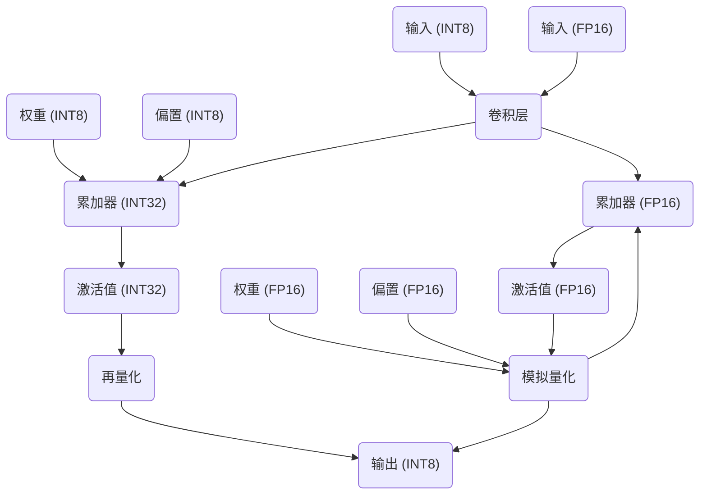

量化推理过程和模型量化过程中的卷积计算示意图

2. 量化乘累加操作

权重向量 w和输入向量 x的乘累加操作 A=b+$W^{(T)}x$。若使用量化后的表示进行权重向量计算，可以写为

$\widehat{A}=b+ \left( s\_{w} \omega\_{int} \right)^{T} \left( s\_{x}x\_{int} \right)\newline =b+s\_{w}s\_{x} \omega\_{int}^{T}x\_{int}$

$=s\_{w}s\_{x} \left( \widehat{b}+ \omega\_{int}^{T}x\_{int} \right)$

式中，b为偏置，Sw和Sx分别为权重向量 w和输入向量 x的量化缩放系数。经过改写后，原本的浮点计算转化成先进行整型乘累加，再乘以浮点缩放系数 SxSx，这减少了浮点计算量。整型乘累加后，累加器得到的中间结果是比 Wint 和 Xint位宽更高的整型数，该中间结果与整型偏置相加后，会经过一次“再量化”，得到低比特整型数。更多细节请读者参考5.9.2节。

3.再量化操作

前面曾提到，在硬件上运行定点乘累加计算时，乘法结果会经累加后再与偏置相加，得到高位宽的中间计算结果。例如，两个8-bit 数完成乘计算得到的结果是 16-bit 数，为了确保多个数累加结果不溢出，累加结果数需要更高位宽。另外，当需要一起计算的张量具有不同的缩放系数时，由于浮点缩放系数需要参与计算，计算结果将在高位宽下完成，得到高位宽的结果。

例如，由于架构中存在跳跃连接，具有不同缩放系数的张量可能需要逐元素相加；或者，当使用逐通道缩放系数时，乘累加计算也需要涉及缩放系数。如图 5.6（a）所示，我们需要将这些高位宽的中间计算结果量化回低位宽，以保证后续计算在指定位宽下进行，这一操作被称为再量化 (Requantize ).

再辨析一下“再量化”与“量化”这两个概念：通常，“再量化”指的是，量化模型实际执行时（量化推理过程中）由高位宽中间计算结果到低位宽整型数的操作；“量化”指的是，在给定浮点模型、生成量化模型的模型量化过程中，为张量（包括权重、激活值等）确定量化参数和量化值的操作。从输入和输出上看，式5.1 展示的量化操作输入为原始浮点数值，输出为该数值对应的缩放系数与低位宽整型数。而再量化操作的输入可能为高位宽整型数与对应的缩放系数，或已使用缩放系数去量化的浮点数。对于低位宽输出的量化参数，再量化操作有两种可能的处理方式：一种是已知输出的量化参数，只需计算其量化值；另一种是根据输入动态统计得到输出的量化参数（编放系数、零点），再计算其量化值，这一方式又被称为“动态量化”。

再量化操作有不同的硬件实现方式：一种方式是通过整型数的移位与截取，不涉及全精度操作（读者可参考5.92 节关于定点计算的讨论）：另一种方式如式 5.8所示，将中间高位宽计算结果转换成全精度数值 4+1后，重新量化回低位宽：

$\widehat{x}^{l+1}=s\_{w^{l}} \cdot s\_{x^{l}} \cdot x^{l+1}$

$x\_{int}^{l+1}=clip \left( \left\[ \frac{ \widehat{x}^{l+1}}{s\_{ \widehat{x}^{l+1}}} \right\]+z\_{ \widehat{x}^{l+1}};q\_{ \min},q\_{ \max} \right)$

式中,上角标l为层的编号,${x}^{l+1}$为第1层输出的高位宽计算结果,经过在量化操作后将成为 $x\_{int}^{l+1}$,即模型第l+1层的输入;

${s\_{ \widehat{x}^{l+1}}}$,$z\_{ \widehat{x}^{l+1}}$为输出的量化参数,可以在线根据${x}^{l+1}$ 动态统计，也可以在离线量化过程中确定并在线推理过程中固定。

#### 量化参数

5.3 节介绍了量化格式和量化操作，涉及缩放系数、零点位置、量化位宽等量化参数。这些参数的选择对量化模型的任务性能和推理效率起决定性作用。例如，对于量化位宽，将数值量化成核小位宽会提升推理效率，但也会带来更大的量化误差。对于缩放系数，较小的缩放系数意味省较小的表示范围（截断误差大）和较高的表示精度（舍入误差小）。由于不同位置和类型的张量的量化误差对任务性能影响不同，量化方法需要针对最终优化目标，即最大化量化模型的任务性能，合理选择各张量的缩放系數来权衡这两类量化误整。

通常，在量化模型中，多个数值会共享同一组缩放系数s和零点z，我们将共享这两个量化参数的多个数值称为一个量化组（Quantization Group），量化组的分组规则被称为量化粒度（Quantization Granularity）。最常使用的量化粒度包括逐张量量化（Per-tensor Quan-tization，或称 Tensor-wise/ Layer-wise Quantization）和逐通道量化（Per-channel Quantiza-tion，或称 Channel-wise Quantization）两类。前者对整个张量中的所有数值使用相同的量化参数；后者则将张量按通道维度切分，将切分出的每个子张量作为一个量化组。举例来说，对于形状为［Cout,Cin, Kh, Kw］的权重张量，逐通道量化意味着对应每个输出通道的权重（形状为［1,Cin, Kh, Ku］）共享同一组量化参数。除了这两类常见的粒度，还有逐通道量化（Channel-Group-wise Quantization）和更细粒度的亚通道量化（Sub-Channel-wise Quantization）的形式17。一般来说，量化粒度越小，量化带来的误差也越小，因而对任务性能造成的损失也越小。然而，使用过小的量化粒度会给模型的推理效率带来挑战。

下面将再次简介缩放系数、零点位置和量化位宽这三个重要的量化参数。5.5 节和5.6 节将展开介绍训练后量化和量化感知训练这两种量化流程中确定缩放系数和零点位置的具体方法。57 节将介绍为模型的不同部分选择量化位宽的混合位宽量化方法。

5.4.1 缩放系数

如5.3.1节所述（见式 5.4），缩放系数确定了量化区间和量化间隔，从而影响了舍入误差和载断误差这两种量化误差的平衡。量化方法应该为所有待量化的张量选择合适的缩放系数，以最小化最终的任务性能损失。图5.7展示了一个示例，说明选择合适的缩放系数以平衡两种量化提素要的总要性。为了简化说明。该示例以单个张量的量化误差（也称数据拟合均方限差（ MSE）作为最终目标，而不是任务性能损失。


图5.7 选择合适的缩放系数以平衡舍入误差和截断误差两类量化误差，以最小化数据拟合均方误差

缩放系数的选取方法可以分为以下两类。

（1）基于统计数值的方法选取一个量化组中绝对值的最大值或最大值乘以一个超参数（如0.75）作为截断阈值，并据此确定缩放系数。基于最大值的缩放系数选取方法易受到离群点影响，在训练后量化时尤为显著，因为权重不能进行训练调整。

（2）基于误差最小化准则的方法会以某种误差（如量化误差、重建误差、任务损失）的最小化为目标对缩放系数进行寻优，如最小化量化前后权重表示的均方误差176l 等。

5.5.3 节展开训练后量化流程时将介绍多种缩放系数的选取方法。在量化感知训练流程中，有一类特殊的缩放系数选取方法，即基于学习的缩放系数选取（将在 5.6.3 节介绍）。这类方法也属于基于误差最小化准则的方法，它将缩放系数作为可学习参数，并使用任务损失函数相对于缩放系数的梯度对其进行迭代更新。

5.4.2 零点位置

如5.3.1节所述（见式5.3），在“非对称均匀量化”中，“零点”指定了量化区间的中心。通过调整零点位置可以对量化区间进行平移，以最大限度地利用量化区间，降低量化的截断误差。引入零点可以显著改善数值分布均值非零的张量的量化效果。确定零点位置的方法可以通过以最小化量化误差为目标或者以最小化任务性能为目标等不同方式实现。

5.4.3 量化位宽

在神经网络模型中，不同类型的数据（权重、激活值、累加结果、偏置等）的分布和任务性能不同，关于它们的敏感度也存在差异，因此可能需要不同的量化位宽。举例来说，对于权重和激活值采用8bit量化是低比特量化推理的常见选择。而卷积计算的累加结果通常具有更大的动态范围，因此需要更高的位宽来表示。例如，当权重和激活值都使用 8-bit时，会使用24位或更高位宽的累加器。尽管在量化推理过程中会涉及使用不同位宽的数据，但通常提到的“量化位宽“指的是权重和激活值的量化位宽。权重和激活值可以使用相同的量化位宽，也可以使用不同的量化位宽。一般而言，激活值比权重具有更大的动态范围，因此需要更大的量化位宽。

除了对激活值、权重、累加结果、偏置等不同类型的数据使用不同的量化位宽，在硬件支持的前提下，还可以考虑为模型的不同部分（如不同层）选择不同的量化位宽。混合位宽量化方法将在 5.7 节介绍。

### 5.5 训练后量化

训练后量化对预训练后的模型进行量化。原始的训练后量化方法通常只需少量无标注数据，且通常不涉及耗时的权重训练过程，因而在工业界得到了非常广泛的应用。与此同时，相比于量化感知训练，训练后量化方法会对模型任务的性能造成较大影响，因此，如何优化训练后量化方法所产生的量化模型的任务性能成为研究热点。

本节将介绍训练后量化的基本流程与各步骤的常用技巧。5.5.1 节将介绍训练后量化的流程。5.5.2 节将以通道均衡与通道拆解两项技巧为例，介绍让模型更适应量化的模型重参数化技巧。5.5.3 节将介绍训练后量化中缩放系数的选取方法。5.5.4 节将介绍量化值的调整技巧，包括偏差校正与舍入函数调整。

5.5.1 训练后量化的流程

参考高通的量化白皮书“A white paper on neural network quantization” ），图5.8 给出了训练后量化方法的流程。

（1）重参数化。一个量化组内的数值动态范围可能很大且非常敏感，这样会导致，无论如何选取该量化组的量化参数（如缩放系数），都很难获得较低的量化误差。为了解决这个问题，在确定量化参数之前，可以对模型进行“重参数化”，即在保持计算等价性的情况下对模型进行一定的架构和权重变换，以调整模型的权重数值分布，使模型更适应量化。5.5.2 节将介绍一些典型方法，包括通道均衡和通道拆解。

（2）配置量化器。根据软硬件支持情况与任务性能需求配置量化器，包括选择量化格式、量化位宽等，5.8 节将介绍一些量化器配置的相关经验。

（3）确定权重量化参数。权重缩放系数的选取对求解量化问题非常关键。5.5.3 节将展开介绍具体方法。

（4）调整量化值。确定量化格式和量化参数后，可以通过类似于式5.1（该式仅对应均匀整型量化格式）的量化操作得到量化值。然而，这样得到的量化值 a int 可能需要进行校正。一方面，量化值所代表的浮点近似值 金可能与量化前的值 2 存在统计特性偏离，如均值、方差等。这种误差会逐层累积，最终可能影响任务性能。另一方面，任务损失函数受到权重间高阶关系的影响，尽管将权重量化至其最近邻整型值能最小化每个权重张量的量化误差，但未必能取得最佳任务性能。5.5.4 节将介绍用于改进量化模型性能的量化值调整技巧。

（5）确定激活值量化参数。在有少量校正数据辅助的情况下，可以基于数据的统计数值或基于误差最小化准则确定激活值的缩放系数。如果无法获取校正数据，但模型中包含批标准化层，则可以利用批标准化层中的激活值统计信息来确定缩放系数150。具体方法将在 5.5.3 节详细介绍。

目前，主流的深度学习训练或推理框架，如TensorFlowLite 、PyTorch 、 TensorRT）等均已集成训练后量化工具，读者可参考相关技术文档调用 API 实现模型的快速量化。

5.5.2 重参数化

本节将介绍两种用于提升训练后量化性能的重参数化技巧：通道均衡和通道拆解。这两种技巧都是针对逐张量量化的情况提升训练后量化性能的技巧，它们通过模型架构和权重的变换，在保持浮点模型计算等价的情况下，调整浮点权重或激活值的分布，使其对量化更为鲁棒通道均衡对相邻两层的权重通道施加变换以使各通道的权重大小分布更均匀，从而降低量化误差。通道拆解则通过复制通道并将该通道中的权重或对应输入浙办压缩权重或激活值中的离群通道的数值范围降低量化误差。

1.通道均衡

带量化张量的数值动态范围大时，会导致其进行逐张量量化时产生较大的量化误差。当数值动态范围过大时使用，如上节所述的缩放系数选取方法也无法获得足够小的量化误差。在深度可分离卷积中存在严重的通道间权衡分布不均衡的情况。下图展示了在批标准化层折叠后，mobilenetV2的第1个深度可分离卷积层的各个输出通道的权重分布情况。箱图展示了各通道权重的最大值最小值终值和上下4分位数。可以看出不同通道的取权重取值范围存在巨大差异。选择较小的缩放系数会导致取值范围较大的5、15、16、28、

29.30号通道的权重的截断误差大；而选择较大的缩放系数会导致权重的舍入误差较大。


图5.9 批标准化层折叠后，MobileNet-V2 的第一个深度可分离卷积层的各个输出通道的权重分布情况

逐通道量化（不要求通道间共享量化参数）可以有效避免上述问题，从而降低量化误差。然而，许多硬件平台仅支持逐张量量化的张量计算，因此仍有必要在保持逐张量量化的情况下给出上述问题的解决方案。通道均衡是一种解决方案。简而言之，通道均衡对某层中第i个通道的权重施加 1/8：的变换系数，同时，在该层邻层的对应通道权重上施加s；的变换系数。变换前后的浮点模型是等价的，通过设置合适的权重变换系数，可以使变換后模型的通道同权重分布更均匀。

**TBD在这里接着改**

对于许多常用的激活函数（如 ReLU、PReLU），当s>0时，以下等式成立：

$f \left( sx \right)=sf \left( x \right)$

式5.9对于任何一次齐次函数均成立。对于神经网络中连续的两层 $h=f \left( \omega^{ \left( 1 \right)}x+b^{ \left( 1 \right)} \right)$h=f（w（H）a+6（））和 $y=f \left( \omega^{ \left( 2 \right)}h+b^{ \left( 2 \right)} \right)$8=f（w（②）h+ 6（）），根据以上恒等变换，有

$\begin{split} y&=f \left( \omega^{ \left( 2 \right)}f \left( \omega^{ \left( 1 \right)}x+b^{ \left( 1 \right)} \right)+b^{ \left( 2 \right)} \right) \\ &=f \left( \omega^{ \left( 2 \right)}S \widehat{f} \left( S^{-1} \omega^{ \left( 1 \right)}x+S^{-1}b^{ \left( 1 \right)} \right)+b^{ \left( 2 \right)} \right) \\ &=f \left( \tilde{ \omega}^{ \left( 2 \right)} \widehat{f} \left( \tilde{ \omega}^{ \left( 1 \right)}x+ \tilde{b}^{ \left( 1 \right)} \right)+b^{ \left( 2 \right)} \right) \end{split}$

式中，S= diag（s） 为一对角矩阵，其中，Sw =3。 表示对第；个通道施加的变换系数。权重和偏置的变换如下：$\widetilde{ \omega}^{ \left( 2 \right)}= \omega^{ \left( 2 \right)}S, \widetilde{ \omega}^{ \left( 1 \right)}=S^{-1} \omega^{ \left( 1 \right)}, \widetilde{b}^{ \left( 1 \right)}=S^{-1}b^{ \left( 1 \right)}$在确定了模型各层的通道变换系数后，再进行逐张量量化。此技巧可以拓展到兼容任意分段线性函数f（通过调整分段端点和线性偏置，构造于满足 f（st）= sf（a）对式5.9进行扩展），读者可参考文献查看细节。

最理想的通道均衡结果是，权重各通道的数值范围都一致，此时，在通道间共享量化参数不会导致过大的量化误差Nagel 等人 统计第1层权重wl的第i个通道的数值范围计算其与整个张量的数值范围$R^{ \left( l \right)}=2 \cdot \max\_{i} \left( r\_{i}^{ \left( l \right)} \right)$具体来说，进行权重变换后，各通道的数值范围可由式5.11 计算得到

$\widetilde{r}^{ \left( l \right)}=2 \cdot \max\_{j}|S^{-1} \omega\_{ij}^{ \left( l \right)}|=S^{-1}r^{ \left( l \right)}$

$\widetilde{r}^{ \left( l+1 \right)}=2 \cdot \max\_{k} \left| \omega\_{ki}^{ \left( l+1 \right)}S \right|=r^{ \left( l+1 \right)}S$

权重张量的整体数值范 $\bm{\tilde{R}^{(l)}=2\cdot\max\_{i}(\tilde{r}\_{i}^{(l)})}$。为了使权重张量的各通道数值范围与整体数值范围可能接近，Nagel等人求解变换矩阵以最大 $\max\_{S} \sum\_{i} \widetilde{p}\_{i}^{ \left( l \right)} \widetilde{p}\_{i}^{ \left( l+1 \right)}$

$\left\{\begin{array}{l}\text{权重张量的整体数值范围}\ \bm{\tilde{R}}^{(l)}=2\cdot\max\_{i}\bigl(\bm{\tilde{r}}\_{i}^{(l)}\bigr)\_{ \circ}\ \ \text{为了使权重张量的各通道数值范围与整体数筐}\\ \text{范围尽可能搂近} ,\ \operatorname{Nagel}\ \text{等人求解变换矩阵}\ \bm{S}\ \text{以最大化}\ \underset{\bm{S}}{\max}\sum\_{i}\bm{\tilde{p}}\_{i}^{(l)}\bm{\tilde{p}}\_{i}^{(l+1 )} ,\ \ \text{其中} ,\ \bm{\tilde{p}}\_{i}^{(l)} = \frac{\tilde{r}\_{i}^{(l)}}{R^{(l)}},\\ \text{针对此目标的最优变换矩阵}\ \bm{S}\ \text{的矩阵元素满足}\ \bm{s}\_{i}=\frac{1}{\bm{r}\_{i}^{(l+1)}}\sqrt{\bm{r}\_{i}^{(l)}\bm{r}\_{i}^{(l+1)}} \_{\circ}\end{array}\right.$

当某个通道对应的通道均衡变换系数 ？？？于 1时，对应的偏置6”被放大。这会增大对应激活值通道的动态范围，导致激活值通道间的动态范围不一致，引入较大的激活值量化误差。针对此问题，Nagel等人提出以下方法，可将较大的偏置“吸收”进后一层。具体来说，若模型中的某一层激活函数f为 ReLU，对于任意输入 c 的集合 X，存在非负向量c，使得

$f \left( \omega x+b-c \right)=f \left( \omega x+b \right)-c, \forall x \in X\_{0}$

。很显然，全0向量c能够保证上述等式对任意X都成立。如果略微放松等价性要求，则该论断变为给定任意非全0的心的分布X，给定任意比例阈值0≤t＜1，存在c>0，使得对于超过 比例的a~X,

$f \left( \omega x+b-c \right)=f \left( \omega x+b \right)-c$

成立。此时，可以通过以下近似等价关系将本层偏置部分转移至相邻层：

$\begin{split}\bm{y}&=\bm{\omega}^{(2)}\bm{h}+\bm{b} ^{(2)}\\ &=\bm{\omega}^{(2)}(\bm{f}(\bm{\omega}^{(1)}\bm{x}+\bm{b}^{(1)})+ \bm{c}-\bm{c})+\bm{b}^{(2)}\\ &\approx\bm{\omega}^{(2)}(\bm{f}(\bm{\omega}^{(1)}\bm{x}+\tilde{ \bm{b}}^{(1)})+\bm{c})+\bm{b}^{(2)}\\ &=\bm{\omega}^{(2)}\tilde{\bm{h}}+\tilde{\bm{b}}^{(2)}\end{split}$

$\text{可以看到} ,\ \text{偏置的变换如下} ;\ \tilde{\bm{b}}^{(2)}=\bm{\omega}^{(2)}\bm{c}+\bm{b}^{(2)},\tilde{\bm{b}}^{(1)}= \bm{b}^{(1)}-\bm{c}\_{\circ}\ \text{变换后} ,\ \text{中间层的激活值和原}\newline \text{来的中问层激活值之问的关系为}\ \tilde{\bm{h}}\approx\bm{h}-\bm{c}\_{\circ}\ \text {Nagel}\ \text{等人提出将}\ \bm{c}\ \text{设置为}$

$\max \left( 0, \mu-3 \sigma \right)$其中u和 $\sigma$为该层激活值的均值和标准差。如果假设激活值呈正态分布，此变换可以使 99.865%的激活值（取值大于c）满足等价性。在无校正数据的情况下，Nagel等人建议使用批标准化层的偏移参和放錥参数~作为ム和の的估计。在有校正数据的情況下，可以统计激活值的分布参数以确定向量c。尽管上述偏置变换并非完全等价，即浮点模型的计算结果会发生改变，但是 Nagel等人通过实验说明，这种变换并不会显著地影响浮点模型的性能。此方法可以降低激活值量化带来的误差，从而在 ImageNet 上将激活值量化为 INT8 的 MobileNet-V2 的算法性能提升 1%。这类重参数化的技巧也被用于大语言模型的量化，如 Xiao 等人于 ICMI 2023 发表的SmoothQuant。在大语言模型中，不同权重通道的数值范围较接近；然而，某些激活值通道会出现许多大幅值的离群点，导致激活值难以被量化为 INT8。因此，SmoothQuant 对当前层第i个输出通道的权重乘以一个变换系数 si（对于输出激活值的数值范围大的离群通道，8 <1），得到更易于量化的激活值分布。与此同时，SmoothQuant 在下一层的第；个输入通道的权重上乘以变换系数 1/sto变换后，激活值分布更均匀，对量化的鲁棒性更好；虽然通道间权重分布略微变得更不均匀，但仍对量化较为鲁棒。使用通道均衡的重参数技巧，SmoothQuant 成功地将 OPT、GLM 等大语言模型的激活值和权重量化为INT8。

2. 通道拆解

如图5.9所示，待量化张量中经常存在部分通道的数值范围格外大的情况，这些通道通常被称为“离群通道”。为了处理这些离群通道，Zhao 等人提出离群通道拆解（Outlier ChannelSplitting,Ocs）方法。离群通道拆解将离群通道复制一份并折半其权重或输入激活值，从而降低离群通道的权重或缩小输入激活值的动态范围。变换后的浮点模型与变换前的功能等价，但通道间的数值范围更为均衡，对量化更为鲁棒。

具体而言，假设某一个线性层的输入为第 m个通道激活值向量公式，其中，28可为单一数值（对应全连接层）或二维特征图（对应卷积层）；用g=｛3｝｝=」表示输出，则线性层的计算可写作3=之罩」23 \*wij，其中，wzs表示连接2：和35的权重，\* 表示乘法或二维卷积。不失一般性，考虑对最后一维通道进行拆解，该层的计算可写作

$y\_{j}= \sum\_{i=1}^{m-1}x\_{i}\* \omega\_{ij}+ \left( x\_{m}\* \frac{ \omega\_{mj}}{2} \right)+ \left( x\_{m}\* \frac{ \omega\_{mj}}{2} \right)$

$\overrightarrow{或}y\_{j}= \sum\_{i=1}^{m-1}x\_{i}\* \omega\_{ij}+ \left( \frac{x\_{m}}{2}\* \omega\_{mj} \right)+ \left( \frac{x\_{m}}{2}\* \omega\_{mj} \right)$

式5.13 分别给出了拆解权重或拆解输入激活值的情况。在这两种情况下，第 m个通道都被拆

分成两个新通道。拆解函数的设计需要考虑量化效应。假设采用一个简化版的量化函数，即最近舍入函数9（z）= ［5+0.5］，如果使用最简单的拆解函数 OCS,oave（w0）=（w/）），则拆解后的两个数情在量化时会往同一个方向舍入，导致舍入误差比拆分前更大。为了解决这个问题，Zhao等人提出了如下的拆解函数 OCSoA （w0）=（品-8.3/分），使得拆分后的两个数值在量化时往不同方向會人，从而有效减少了拆解产生的额外舍入误差。

与直接截断离群通道的数值相比，离群通道拆解方法保留了离群值，但引入了额外的通道。

因此，需根据实际情况选择是否应用离散通道拆解、对几个通道应用离散通道拆解，以达到最优的性能—效率权衡。

5.5.3缩放系数的选取方法

缩放系数的选取是量化方法的关键。训练后量化不涉及对模型权重的大幅度训练调整，仅利用少量校正数据甚至无须数据，即可为所有张量选取缩放系数。本节将介绍在这种情况下可用的方法，包括基于统计数值的缩放系数选取方法和基于量化误差最小化准则的缩放系数选取方法。在确定权重的缩放系数时，这两种方法均无须校正数据的参与。而对于激活值的缩放系数，如果没有校正数据，则可考虑利用批标准化层中的参数和统计信息；如果有校正数据，则可采用基于量化误差最小化准则的缩放系数选取方法。

1. 基于统计数值的缩放系数选取方法

将一个量化组的最值作为量化区间是最简单的缩放系数的选取方法，可看作以最小化截断误差为准则，如式5.14所示。

$v\_{ \min}= \min V,v\_{ \max}= \max V$

式中，V为待量化张量的一个量化组，Vmax 与 Vmin 为量化区同的浮点数端点（如式5.1所定义）.它们被取为量化组中元素的最大和最小值；设量化为宽为n量化区间的端点可由下式转换为缩放系数。

$s= \frac{v\_{ \max}-v\_{ \min}}{2^{n}-1}$

然而这种方法容易受到数据分布中的离群值的影响，导致过大的舍入误差。在工程实践中可以考虑采用简单的启发式方法来缓解这个问题，例如将最值替换为分位数或者对最值乘以一定的系数等方式，以减少离群值对量化区间的影响，这种启发式设计隐含了权衡涉入与截断误差的思想，但不涉及针对特定优化目标的显示优化。

针对激活值量化，由于离线模型量化过程中无法访问所有激活值数据。多数量化方法会利用少数校准数据的统计信息，如均值方差等来确定量化区间，如果没有任何校准数据则可以利用批标准化层的参数来确定各个激活值通道的量化区间。

$v\_{ \min}= \min \left( \beta\_{i}- \alpha \gamma\_{i} \right)$

$v\_{ \max}= \max \left( \beta\_{i}+ \alpha \gamma\_{i} \right)$

$\beta$和$\gamma$分别为 标准化层中对应第i个通道的偏移参数和放缩参数阿尔法是一个可调系数，用于调整量化区间的长度，从而平衡截断误差与舍入误差，有人将阿尔法默认设置为6。

2.基于量化误差最小化准则的缩放系数选取方法

量化误差最小化是最常见的缩放系数求解准则，该准则要求模拟量化前后张量的数值尽可能接近，并据此确定缩放系数：

$\operatorname\*{arg min}\_{s} \left \| V-Q\_{s} \left( V \right) \right \|\_{norm}^{2}$

式中，$Q\_{s}$表示缩放系数为s的模拟量化函数（如式5.6所定义），II.llnorm是某个范数函数。

例如，当该范数为 Frobenius 范数时，式5.17表示最常用的目标函数，即均方误差。常用的求解方法包括网格搜索法（Grid Search Method）、黄金分割法（Golden Section Method）及解析计算求解法。这些方法被广泛应用，不同实现之间的差别在于采用的目标函数和求解方法不同。

早期工作图 将缩放系数限定为2的幂次，并通过离散搜索找到满足式5.17 的最优缩放系数。然而，将缩放系数限制为 2的幂次可能导致次优的任务性能。因此，许多后续方法放宽了缩放系数s的限制，使其能够取任意浮点数。

张量的量化误差仅是全局任务性能的一个较大差距的代理目标，因此基于该准则的缩放系数选取有时会被作为一些复杂量化方案的子过程（Sub-procedure ）。例如，Nahshan 等人提出了一种联合优化多层缩放系数的方法 LAPQ （Loss Aware Post-training Quantization）。首先，LAPQ通过分层优化获得各层缩放系数的初始值，再联合优化这些缩放系数。具体而言，该方法包括以下步骤：第一步，基于量化误差最小化准则，计算最小化量化误差的不同 p范数时各层的缩放系数：第二步，利用一个二次曲线f（p）拟合量化误差的p范数最小化所得到的整体任务损失，然后，利用拟合曲线确定能最小化整体任务损失函数的p值，得到各层对应的缩放系数，第三生，LAPQ 使用第二步得到的各层缩效系数作为初始值，采用 Powel的方法10） 联合优化各层缩放系数，以减小整体任务性能损失。

常用的目标函数均方误差在处理量化误差时会平等地对待张量中的各个元素。当不同元案的量化误差对任务性能的影响程度不同时，可能导致次优的任务性能。例如，当对分类网络的最后一层激活值求解量化参数时，相比于最小化张量的醛体量化误差，保持张量中最大值的排序更为重要。如果使用均方误差作为目标函数来求解缩放系数，则可能会显著降低任务性能。在这种情况下，可以考虑将目标函数替换为交叉熵损失函数，其中，H（）代表交叉熵函数，o代表 Softmax 函数。

3. 基于量化误差最小化准则的解析计算求解法

Banner 等人提出了基于解析计算的缩放系数选取方案 ACIQ（Analyticel Clipping forInteger Quantization）1249。ACIQ 假设待量化数据服从高斯或拉普拉斯分布，基于量化误差最小化准则对缩放系数进行解析求解。

若一个待量化张量里的每个元素独立同分布地服从 Laplace（0,6）分布，则可以通过下述推导求得将其对称均匀量化至 M-bit 时的最优缩放系数。设量化区间为［-c,Q］，等分成2M个长度为=器 的量化间隔。如图 5.10所示，落入某个量化间隔的数值被近似为该间隔的中点值，即对i€［0,24-1，取值在区间$\left\[- \alpha+i \cdot \Delta,- \alpha+ \left( i+1 \right) \cdot \Delta \right\]$］的数值模拟量化后的量化水平为$q\_{i}=- \alpha+ \left( 2i+1 \right) \frac{ \Delta}{2}^{1}$


图5.10 ACIQ 中的量化间隔、量化水平、对概率密度函数的分段线性近似

原始数值与其模拟量化数值之间的均方量化误差的期望为

$\begin{split}\mathbb{E}\[(\bm{X}-\bm{Q}(\bm{X}))^{2}\]=& \int\_{-\infty}^{-\alpha}f(x)\cdot(x+\alpha)^{2}\mathrm{d}x+\sum\_{i=0}^{2^{M}-1 }\int\_{-\alpha+i\Delta}^{-\alpha+(i+1)\Delta}f(x)\cdot(x-q\_{i})^{2}\mathrm{d}x \\ &+\int\_{\alpha}^{\infty}f(x)\cdot(x-\alpha)^{2}\mathrm{d}x\end{split}$

式518右侧第一项和第三项表示截断误差，第二项表示舍入误差，$f(x)$ 为原始数值的概率密度函数。ACIQ 通过以Qi为分段点的分段线性函数近似$f(x)$，将${\alpha}$式 5.18 近似为

$\mathop{\mathbb{E}}\[(\bm{X}-\bm{Q}(\bm{X}))^{2}\]\approx 2\cdot b^{2}\cdot \mathrm{e}^{-\frac{\alpha}{b}}+\frac{2\cdot\alpha^{3}}{3}\cdot\sum\_{i=0}^{2^{M }-1}f(q\_{i})=2\cdot b^{2}\cdot\mathrm{e}^{-\frac{\alpha}{b}}+\frac{\alpha^{2} }{3\cdot 2^{2^{M}}}$

令该式关于 的偏导数为0，即可求出如式 5.20所示的最优 a\* 应满足的关系，从而求出缩放系数：

$\left. \frac{ \partial E \left\[ \left( X-Q \left( X \right) \right)^{2} \right\]}{ \partial \alpha} \right|\_{ \alpha= \alpha^{\*}}= \frac{2 \alpha^{\*}}{3 \cdot 2^{2^{M}}}-2be^{- \frac{ \alpha^{\*}}{b}}=0$

5.5.4 量化值调整

本节将介绍在训练后量化中用于优化量化值的两种方法：**偏差校正与舍入调整**。这两类方法都是在确定了权重缩放系数的前提下，对权重或偏置的量化值进行离线微调，以实现更优的任务性能。这两种方法都发生在模型量化过程中，不会增加实际量化推理过程的开销。就数据需求而言，偏差校正方法可以在没有数据的情况下进行，而舍入调整方法则需要少量数据。

量化前后的数值分布在统计意义上不可避免地存在偏离，而这种偏离的累积会导致最终任务性能的下降。基于这个分析，偏差校正通过调整权重或偏置的量化值，保证权重或激活值的分布特性不发生偏移，以期改善最终任务的性能。

舍入调整的相关研究指出，单个权重粒度上的舍入误差最小化（将权重量化至其最近的整数值）忽略了权重之间的高阶关系，这可能导致任务性能次优。因此，舍入调整方法在权重的舍入函数中引入可调整偏置，或为权重的舍入提供更多可行的整数选项，以基于最小化任务性能损失或其近似的准则选取具体的舍入值。

1.偏差校正

对权重偏差的校正。量化前后的权重在均值和方差上存在偏差，用${ \omega}\_{c}$和TBD。表示通道c中权重及其模拟量化后的权重，则该现象可描述为$E \left( \omega\_{c} \right) \neq E \left( \widehat{ \omega}\_{c} \right),|| \omega\_{c}-E \left( \omega\_{c} \right)||\_{2} \neq$$| \widehat{ \omega}\_{c}- E \left( \widehat{ \omega}\_{c} \right)| |\_{2}$。 Banner 等人在ACIQ 方法里逐通道计算校正常数 Me 与5：

$\mu\_{c}=E \left( \omega\_{c} \right)-E \left( \widehat{ \omega}\_{c} \right)$

$\xi\_{c}= \frac{ \left \| \omega\_{c}-E \left( \omega\_{c} \right) \right \|\_{2}}{ \left \| \widehat{ \omega}\_{c}-E \left( \widehat{ \omega}\_{c} \right) \right \|\_{2}}$

随后，可对量化后的权重进行变换 $\omega \leftarrow \xi\_{c} \left( \omega+ \mu\_{c} \right), \forall \omega \in \widehat{ \omega}\_{c},$以补偿权重量化产生的偏差。

对激活值偏差的校正。量化前后模型一层的输出激活值的均值存在偏差，$\text{即}E \left\[ \omega x \right\] \Rightarrow E \left\[ \widehat{ \omega}x \right\]$

${E} \left\[ \widehat{y} \right\]={E} \left\[ \widehat{ \omega}x \right\]={E} \left\[ \left( \omega+ \Delta \omega \right) x \right\]={E} \left\[ \omega x \right\]+{E} \left\[ \Delta \omega x \right\]$

不相等。一些研究156，18.，187 指出，可以通过调整偏置来校正激活值的偏差。激活值的校正一般基于局部重建误差最小化的原则，并要一些校正数据的辅助项。Aw 为一个常值向量，因此回Awa）=AwE（对。当Aw卫（对］不为零时，输出激活值的均值就会存在偏差。为了校正这一偏差，可以将该项从输出中减去，得到 gcor，其均值为Elscord=四jca-Aw四（ag=\_a。这个校正项与偏置的形状相同，因此可以将其合并到原偏置中。

校正项可使用少量校正数据逐层进行计算。当无校正数据时，Nagel 等人利用当前层之前的批标准化层的偏移参数 日 和缩放参数 估计该批标准化层的输出aPxo的分布，即认岁aPe 的第c个通道 202 的元素均服从正态分布N（8.，7），其中，B。和%是8和 的第c个通道的元素。这样，可以估计出当前层输入 z=ReLU（apne）的第c个通道 2。的期望值

$\boxed{\begin{aligned} \mathbb{E} \left\[ x\_{c} \right\]=\mathbb{E} \left\[ ReLU \left( x\_{c}^{pre} \right) \right\]= \gamma\_{c}p\_{N} \left(- \frac{ \beta\_{c}}{ \gamma\_{c}} \right)+ \beta\_{c} \left\[ 1- \Phi \left(- \frac{ \beta\_{c}}{ \gamma\_{c}} \right) \right\] \end{aligned}}$

式中，更（）为标准正态分布的累积分布函数，Pv（.）为标准正态分布的概率密度函数。

2. 舍入调整

确定放缩系数后，根据式 5.1，量化函数将缩放后的数值舍入至一个整型值。最简单、常用的舍入函数为最近舍入，即将浮点数值舍入到最接近的整数。然而，受到权重间高阶关系的影响，对每个权重独立进行最近舍入可能不能最优化任务性能，甚至难以最优化局部重建误差。针对此问题，一系列工作对舍入函数进行改进，允许数值被舍入至近邻的若干整数，并针对重建误差或任务性能最小化的目标决定具体舍入值。

AdaRound 对模型的所有层进行顺序处理，逐层根据少量数据的重建误差决定每个权重应该向上还是向下舍入。在 AdaFound 的基础上，AdaQuant 扩展了舍入值的优化空间，允许权重被量化至其相邻的若干整数，而不仅限于最接近的两个整数；块重建量化方法（Block Reconstruction Quantization, BRECQ） 改变了代化同題的折解粒度，将“逐层”最小化重建误差改为“逐块（多层）”最小化重建误差。

这里先借助 AdaRound中的例子说明将每个权重独立进行最近舍入为何不能最优化任务性能。以权重向量w表示模型的所有权重，Xy表示模型的输入和输出对权重施加微小干扰w则任务损失函数l括号xyw的变化可写为下式 ：

$\begin{split}\mathbb{E}\[\mathcal{L}(\bm{x},\bm{y},\bm{\omega}+ \triangle\bm{\omega})-\mathcal{L}(\bm{x},\bm{y},\bm{\omega})\]& \overset{(a)}{\approx}\mathbb{E}\left\[\triangle\bm{\omega}^{ \mathrm{T}}\cdot\nabla\_{\bm{w}}\mathcal{L}(\bm{x},\bm{y},\bm{\omega})+\frac{1} {2}\triangle\bm{\omega}^{\mathrm{T}}\cdot\nabla\_{\bm{w}}^{2}\mathcal{L}(\bm{x},\bm{y},\bm{\omega})\cdot\triangle\bm{\omega}\right\]\\ &=\triangle\bm{\omega}^{\mathrm{T}}\cdot\bm{g}^{(\bm{\omega})}+ \frac{1}{2}\triangle\bm{\omega}^{\mathrm{T}}\cdot\bm{H}^{(\bm{\omega})}\cdot \triangle\bm{\omega}\hskip 72.27pt\text{}\end{split}$

式中的近似（a）为二阶系制级数限开，在扰动较小的情況下，可取得良好的近似效果；gCc）和\[(0) = EVEC(2, 2,4)0

如果模型已经训练收敛到局部最优，则认为式5.28中的一阶项可以忽略不计。权重间高阶互相作用对任务损失的影响由H（w）刻画。考虑一个简单的两权重的例子：AwT=［Lw）Aw2），

B= 0.5 1，则可近似认为权重批动产生的任务损失与 AwT.E（w）.2w = 2af +成正比。可以看出，若不考虑权重间的高阶关系（认为HI（w）中非对角项为0），该式只余有Aw？与Aw号两项，则意味着损失仅与权重扰动的大小相关。此时，对每个权重独立进行最近舍入产生的损失最小。然而，若考虑权重间的高阶关系，对每个权重独立进行最近舍入忽略 Aw1，w2项的影响（忽略了FI（w）中非对角元素的影响），则可能导致次优的损失。

Nagel 等人通过泰勒展开和对 Hessian 矩阵的近似，将优化目标从全局任务损失最小化转换成逐层局部重建误差最小化，并提出量化值舍入调整方法 AdaRound。这里省略其对全局任务损失函数的近似推导，感兴趣的读者可查看参考文献［146］。针对逐层重建误差这一优化目标，AdaRound 需要求解的优化问题可以形式化为

$\begin{split}\underset{\bm{v}}{\arg\min}&\parallel \bm{\omega x-\tilde{\omega}x}\parallel\_{\mathrm{F}}^{2}\\ \text{s.t.}& \bm{\tilde{\omega}=s\cdot clip}\left( \left\lfloor\frac{\bm{\omega}}{s}\right\rfloor+\bm{v},q\_{\min},q\_{\max}\right),\bm{v}\in\{0,1\}^{\mathrm{size}(\bm{\omega})}\end{split}$

式中，1• 表示 Frobenius 范数，w 和 分别为原始权重和经过模拟量化后的权重，L」为向下取整函数，s为缩放系数。可以看到，AdaRound 的优化空间为离散空间｛0,1｝sie（w），即为每个权重决定该向下取整（2=0）还是向上取整（2=1）。 求解此优化问题，AdaRound 将待优化的离散变量 松弛到连续空间［0, 1jspe（w），并将变量替换为无约束变量V，满足 =h（V），其中h（）为任意值域为10, 1］的可微函数（Nogel 等人选用修正的 Sigmoid 函数）。这样，AdaRound将离散优化问题转化为无约束连续优化问题；

$arg \min\_{V} \left \| \omega x- \widetilde{ \omega}x \right \|\_{F}^{2}+ \lambda f\_{reg} \left( V \right)$

$s.t. \omega=s \cdot clip \left( \left \lfloor \frac{ \omega}{s} \right \rfloor+h \left( V \right),q\_{ \min},q\_{ \max} \right)$

其中，V 为无约束的连续优化变量，正则项 frog（V）的作用是将h（Ys）的取值推向0或1。

式5.25 未考虑前层量化对输入 z引入的激活值量化误差与激活函数的影响。考虑这两个因茶后，AiaR.oind 所采用的优化目标可以写作：

$\boxed{ \begin{matrix} arg \min \left \| f\_{a} \left( \omega x \right)-f\_{a} \left( \tilde{ \omega} \widehat{x} \right) \right \|\_{F}^{2}+ \lambda f\_{reg} \left( V \right) \\ V \end{matrix}}$

其中，主 表示前层依次量化后当前层的输入，f。表示激活函数。AdaBound 使用少量无桥多（（Label-free） 数据，顺序逐层使用 Adam 优化器求解式 5.26 中的优化问题，为每个权重决定舍入。

后续工作 AdaQuantlL50l扩大了AdaRound 中权重舍入的优化空间，不再限制数值只能後舍入为最接近的两个整数，并将缩放系数纳入优化空间：

$\left( s\_{ \omega\_{l}}^{\*},s\_{x\_{l}}^{\*},V\_{l}^{\*} \right)= \underset{s\_{ \omega\_{l}},s\_{x\_{l}},V\_{l}}{arg \min} \parallel \omega\_{l}x\_{l}-Q\_{s\_{ \omega\_{l}}} \left( \omega\_{l}+V\_{l} \right) \cdot Q\_{s\_{x\_{l}}} \left( \widehat{x}\_{l} \right) \parallel^{2}$

式中，Sw,8z分别表示权重与激活值对应的缩放系数，下标！表示层编号，Qs（）代表缩放系数为s的模拟量化函数，金：为经过非线性函数的前一层输出激活值 立1=fa（Q8w1-1（WL-1+V-i

与式5.24对比，可以看到，AdaQuant 引入的辅助参数 V 是加到w上的无约束连续变量，而不是加到L”」上的离散变量~ €｛0,1｝sue（w）。AdaQuant 的优化空间扩展了权重舍入的可能性，同时引入了缩放系数，有望实现更优的任务性能。

AdaRound 与 AdaQuant 均将整体优化问题按层分解并顺序求解每层的重建误差最小化问题，忽略了不同层权重之间的高阶关系。Li等人14T 认为，在量化位宽较低，即Aw较大的情况下，这种方法并不适用。他们提出增大每个子优化问题的粒度。然而，考虑到训练后量化流程中校正数据较少的情况，如果将粒度扩大到整体模型（直接重建整体模型的输出），则可能会导致求解结果过拟合校正数据集，降低泛化能力。因此，Li等人提出的 BRECQ 方法按照模型中多层组成的块（如 ResNet 中的 Bottleneck 块）来拆解并求解优化问题。BRECQ 的每个子优化问题的优化目标如式 5.28 所示。

$\operatorname\*{arg min}\_{\bm{V}}\ \ \mathbb{E}\left\[ \triangle\bm{z}^{(l),T}diag \left( \left( \frac{ \partial \mathcal{L}}{ \partial\bm{z}\_{1}^{(l)}} \right)^{2}, \cdots, \left( \frac{ \partial \mathcal{L}}{ \partial\bm{z}\_{a}^{(l)}} \right)^{2} \right) \triangle \bm{z}^{(l)} \right\]+ \lambda f\_{reg} \left( \bm{V} \right)$

其中，Az（） 表示网络第1层的重建误差，1为每个重建块中最后一层的标号。权重舍入函数引舍入调整方法为待量化权重引入额外优化变量，允许权重被量化至其近邻的若干整数，然后利用少量数据、针对激活值直建误差在小花围内调整拟匪的最化位。这些方法在训练后量化流整中引入了权重优化过程，可以看作训练后量化和發化感知训练两类方法的销合。从方法对数据的需求角度考虑，如果将无须數握的训练后量化方法与爾要大薑训练数据的最化感知训练方法视为“数据得求光滨”的两个端点，则需要少盤校正数据的训练后量化令人调繁方法可视为此“光谱”上的一种中间情形。

3.1.1 A Use Case of LLM-Viewer:Roofline Analysis for Quantization

在这里，我们将展示如何使用我们的LLM-Viewer（第2.3节）来分析LLM部署中的瓶颈。在LLMs中，张量由权重和激活组成，其中激活包括临时激活和KV缓存。

（1）LLM的权重必须存储在内存中。例如，具有130亿个权重的Llama-13b Touvron等人在FP16格式下占用大约26GB的内存。

（2）临时激活是在推理过程中产生的。例如，每个变换器层的输入需要保留在内存中，直到执行残差相加。

（3）对于自回归LLMs，为了生成后续的令牌，将键和值激活（KV缓存）存储在内存中是必要的。

我们利用LLM-Viewer从计算、内存消耗和内存访问三个角度分析量化对这些张量的影响。

#### Computation

最新的计算设备，如NVIDIA的GPU，通常支持FP32、FP16和INT8等数据类型进行计算。硬件设备在处理位宽较小的数据时，一般表现得更出色。例如，NVIDIA的A6000 GPU在使用FP16时的运算速度能够达到155 TOP/s，而使用INT8时则提升至310 TOP/s，性能翻倍。在Roofline模型中，当启用量化以实现更快的计算时，屋顶线的高度增加，表明对于计算密集型层的性能有所提升。如图6所示，使用INT8计算时最大性能得到了提高。然而，为了利用INT8的计算能力，所有输入操作数必须都是INT8格式。因此，如果只有权重被量化为INT8，而激活值仍保持在FP16格式，那么INT8的计算能力就无法得到利用。相反，INT8权重需要转换为FP16以便与FP16激活值相乘。此外，当张量被量化为硬件不支持的位宽时，它们需要转换为更高位宽进行计算。例如，NVIDIA的H100 GPU不支持INT4计算。因此，如果权重或激活值被量化为INT4，就需要转换为更高位宽，如INT8或FP16，以便进行计算。


图6. 展示了Nvidia A6000 GPU在不同计算数据类型下的 Roofline 模型。

#### Memory Consumption:

量化不同张量后内存消耗的减少程度各异，如图7-4所示。值得注意的是，临时激活的内存使用相对较低，尤其是在解码阶段。这可以归因于它们生命周期较短，一旦完成其用途即可释放其内存。另一方面，分配给KV缓存的内存表现不同。它必须保留到生成完整答案的整个过程结束，这涉及到多次通过网络进行推断。而且，随着批量大小的增加和输入序列变长，KV缓存的内存消耗也会增加。这是因为模型需要存储更多的键值（KV）对以支持其操作。


图7展示了不同量化设置下Llama-2-13b的相对内存消耗。Tmp Act表示临时激活。

#### Memory Access:

在大型语言模型（LLM）中对张量进行量化可以显著减少内存访问需求，使得相同计算量所需的数据字节数减少。这种算术强度的提升符合 Roofline 模型，导致三种情况：

(1) 量化后，算术强度仍然处于内存受限范围内。随着算术强度的提高，每单位计算的数据访问平均值降低，减轻了数据内存访问的压力。因此，理论性能得到增强。这在内存受限的解码阶段特别能大幅提高性能。

(2) 算术强度由内存受限转变为计算受限。这种转变同样减少了对数据内存访问的压力，从而提高了理论性能。

(3) 无论量化前还是量化后，算术强度都保持在计算受限范围内。在这种情况下，不会有性能上的改进。例如，这种情况可能发生在计算受限的预填充阶段，或者解码阶段批处理大小较大时。

如图8所示，当批处理大小较小时，网络中的层在量化前后都是内存受限的。因此，量化可以提升性能并减少网络的推理时间。然而，当批处理大小较大时，将网络权重从4位压缩到2位或1位并不会减少推理时间。这是因为此时网络已经是计算受限的，量化权重变得无效。与前一场景类似，在预填充阶段系统表现也可能出现饱和效应。如图9所示，当序列长度相对较短时，预填充阶段是内存受限的。在这种情况下，通过量化可以减少网络的内存访问需求，从而提升性能。但是，随着序列长度增加，预填充阶段变得更加计算受限。因此，当预填充阶段因长序列而已经是计算受限时，量化权重可能不会带来显著的性能提升。


图8展示了在不同量化设置下，Llama-2-13b模型解码阶段的推理时间。（序列长度=1024）

### (1) QAT

5.6量化感知训练

在一些任务和模型上，应用训练后量化方法难以取得优秀的任务性能，尤其是在面对较低位宽的情况下，例如4-bit、2-bit 等。为了解决这个问题，可以考虑采用量化感知训练方法。量化感知训练通过在训练过程中模拟量化操作，让权重适应量化带来的误差，从而获得更好的任务性能。

本节将介绍量化感知训练的流程与常用技巧：5.6.1 节将介绍量化感知训练的基础与流程；5.6.2 节将介绍针对量化感知训练调整模型架构的方法；5.6.3节将介绍量化感知训练中量化器设计的技巧；5.6.4 节将介绍常用的训练技巧。

transformer模型适合做PTQ吗？

A：对于 QAT和PTQ 两种量化，不同模型的量化友好性是不同的，不能一概而论的，但整体来说， QAT是相对精度更有保障，必须要说明的是，Transformer类型的模型既可以使用PTQ，也可以使用QAT（量化感知训练），具体取决于多种因素：

数据方面： 如果没有足够的带标签数据用于进一步训练，因为PTQ仅执行小型统计数据收集来确定量化参数，无需带标签的数据，所以PTQ更合适

精度方面： 通常情况下，PTQ可能会导致一定的精度下降，虽然一些改进的方法可以提升精度，但总体上在复杂的Transformer模型上可能仍不如QAT。

模型规模和计算资源方面： PTQ不需要重新训练模型，在计算资源和时间消耗上相对QAT较少，对部署时间比较急迫情况下PTQ更有优势，而QAT需要进行重新训练，计算成本和算法复杂性较高，需要计算资源和时间也更多。

量化难度方面：Transformer模型中Softmax、GELU等特殊函数激活值分布复杂，传统PTQ方法通过量化参数变得困难，可能导致较大量化误差。

#### 5.6.1 基础与流程

为了在训练中考虑量化带来的影响，量化感知训练在模型前向传播过程中显式地对权重与激活值调用模拟量化函数 Qs（.）（如式5.6 所示）。神经网络模型通常使用梯度反传和梯度更新进行训练，因此需要定义模拟量化函数的梯度反传操作。以最常使用的最近舍入函数为例，该函数的导数为一系列冲激函数，在数轴上取值几乎处处为0，这会阻断梯度的反向传播，不利于训练。为了解决这一问题，研究者使用直通梯度估计器（Straight Through Estimator, STE），如式5.29所示，反向传播过程中认为量化器中舍入函数的导数处处为1。

$\frac{\partial\[x\]}{\partial x} =1\qquad\qquad\qquad\qquad\qquad\qquad\qquad\qquad\qquad\text {(5.29)}\newline \text{此时} ,\ \text{模拟量化函数}\ Q\_{s}(\cdot)\ \text{的输出}\ \hat{x}\ \text{关于输入}\ x\ \text{的梯度如式}\ 5.30\ \text{所示}\_{\circ}\newline \frac{\partial\hat{x}}{\partial x} =\frac{\partial Q\_{s}(x)}{\partial x}=s\cdot\frac{\partial x\_{ \mathrm{int}}}{\partial x}=s\cdot\frac{\partial}{\partial x}\mathrm{clip}\left( \left\[\frac{x}{s}\right\];q\_{\mathrm{min}},q\_{\mathrm{max}}\right)\newline \qquad\qquad\qquad\qquad\qquad\qquad=\begin{cases}s\cdot\dfrac{ \partial\[x/s\]}{\partial(x/s)} \dfrac{\partial(x/s)}{\partial x}&v\_{\mathrm{ min}}\leqslant x\leqslant v\_{\mathrm{max}}\\ s\cdot\dfrac{\partial q\_{\mathrm{min}}}{\partial x}&x<v\_{\mathrm{min}}\\ s\cdot\dfrac{\partial q\_{\mathrm{max}}}{\partial x}&x>v\_{\mathrm{max}}\\ \end{cases}\qquad\qquad\qquad\qquad\qquad\qquad\qquad\qquad\qquad\qquad\qquad\newline =\begin{cases}1&v\_{\mathrm{min}}\leqslant x\leqslant v\_{\mathrm{ max}}\\ 0&\text{否则}\end{cases}$

$\begin{array}{l}\text{筒便起见},\ \text{假设式}\ 5.30\ \text{对称量化}\ \left( z=0 \right),\ \text{此时有}\ q\_{\min}=v\_{\min}/s, q\_{\max}=v\_{\max}/s\_{\circ}\\ \text{如下代码给出了使用直通梯度估计器} ,\ \text{最近舍人的模拟量化函数的}\ \mathrm{PyTorch}\ \text{实现}\_{\circ}\\ \hline\end{array}$

```plaintext
det simulated quantize(x, scale, zero_point, quant_min, quant_max) 
输入：
x：待量化张量。
scale：输入张量x对应的缩放系数。
zero_point：输入张量x对应的零点。
quant_min：定点数值的最小值，对应式中的q_min。
quant_max ：定点数值的最大值，对应式中的q_max。
中间变量：
x.int：量化后整型形式的x（仍以浮点格式仿真）。
返回：
x_hat：模拟量化后的x。
## **Quantize** the input tensor
x = x / scale + zero_point
# **Straight Through Estimator (STE)** of gradients
# In the forward pass, x_int == x. round) •
# In the backward pass, the gradient with respect to
x_int is
# *directly* and *only* passed to x*,
# since the
other addition operand is detached.
x_int = (x. round() - x) .detach) + x
# clamp
x_int = torch. clamp(x_int, quant _min, quant_max)
## **Dequantize**
the quantized tensor
x_hat = x_int - zero_point) * scale
return x_hat
```

     图5.11适应了一个卷积层的量化感知训练前向与反向。传播过程前向传播时权重w被量化器按照指定量化格式与位宽量化，随后根据量化得到的整形值与缩放系数去量化回全精度。形式模拟量化后的权重，w一撇与同样经过模拟量化的输入激活值进行卷积。计算添加编制并应用激活函数后，当前层的输入y将再次进行模拟量化得到外一品作为下一层的输入。反向传播时，如图中跨越亮化器的紫色箭头所示损失函数对y的梯度。将于是5.30中所示的直通梯度指估计器梯度通过链式法则相乘。得到损失函数对y的梯度。需要注意的是，如图所示量化感知训练中参与训练的权重与激活值均为全精度形式。而权重与激活值的模拟量化操作即训练中对量化效应的模拟或仿真。全精度缩放的系数将被逐层积累，以尽可能减少全精度计算，实现实际加速。因为量化感知训练的流程不会用量化的整型结果做计算，而是使用模拟量化的浮点值x作计算。所以本节后文的量化操作都指代模拟量化操作。


flowchart TD  Start(\[开始\]) --> Export\[1. 导出ONNX，分段\]

```plaintext
subgraph 模型准备阶段
    Export --> Doc[2. 模型和部署的对接文档格式]
    Doc --> Convert[3. ONNX转BIN]
end

subgraph API集成阶段
    Convert --> API[4. APP调用5个API]
end

subgraph 对齐验证阶段
    API --> Log{5. 对数-单帧比对，可视化}
    Log --> IO[5.1 IO对齐]
    Log --> Output[5.2 输出对齐]
    Log --> Sim[5.3 仿真结果比对]
    
    IO --> |"比对run.sh pad后的输入和APP输入"| IOAlign[uint8和fp16输入问题]
    Output --> |"Run.sh拿到网络输出和APP比对"| OutputAlign[写一个辅助工具]
    Sim --> SimWidth[数据位宽]
end

subgraph 量化优化阶段
    IO --> Quant{6. 离线量化混合精度量化}
    Output --> Quant
    Sim --> Quant
    
    Quant --> SingleFrame[6.1 单帧的混合量化]
    Quant --> MixedPrecision[6.2 Image backbone int8, head int8+fp16]
end

subgraph 内存与调度优化
    Quant --> Memory[7. Memory bank设计]
    Memory --> Clip[7.1 Clip对数]
    
    Memory --> Schedule{8. APP调度，连接多个onnx}
    Schedule --> SharedFeature[8.1 共用feature放到flexidag_memblk_t]
    Schedule --> MultiBatch[8.2 多batch问题]
    Schedule --> BitWidth[8.3 位宽]
end

subgraph 对齐与封装阶段
    Schedule --> Process{9. APP前后处理}
    Process --> ProcessLogic[9.1 逻辑python和c++比对]
    
    Process --> Tuning{10. 精度调优}
    Tuning --> Int8Metrics[10.1 Int8跑指标]
    Tuning --> MultiFrame[10.2 多帧可视化]
    Tuning --> OnlineQuant[10.3 在线量化]
    
    Tuning --> SDK[11. 封装SDK，联调]
end

SDK --> End([完成])

classDef phase fill:#d0e8f2,stroke:#79a3b1,stroke-width:2px;
classDef process fill:#4dabf7,stroke:#339af0,stroke-width:2px,color:white;
classDef decision fill:#ffd8a8,stroke:#ffa94d,stroke-width:2px;

class 模型准备阶段,API集成阶段,对齐验证阶段,量化优化阶段,内存与调度优化,对齐与封装阶段 phase;
class Export,Doc,Convert,API,IO,Output,Sim,SingleFrame,MixedPrecision,Memory,Clip,SharedFeature,MultiBatch,BitWidth,ProcessLogic,Int8Metrics,MultiFrame,OnlineQuant,SDK process;
class Log,Quant,Schedule,Process,Tuning decision;

```

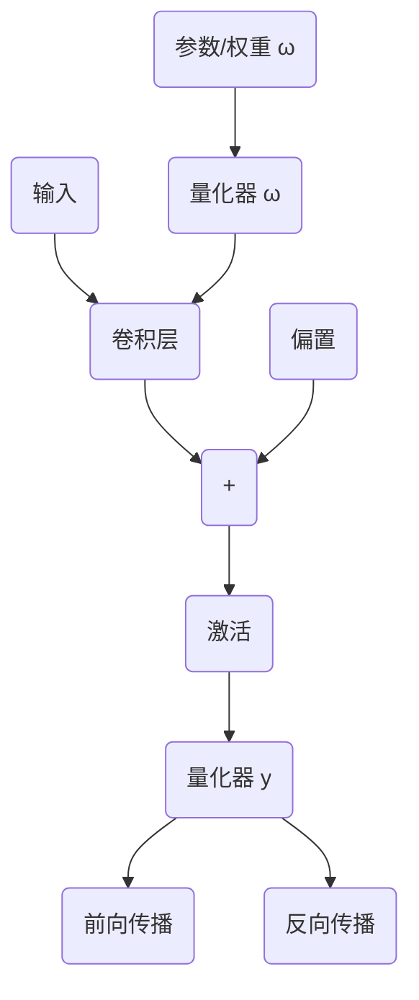

图 5.11 量化感知训练前向传播与反向传播示意图

量化感知训练流程的输入可以是随机初始化的模型，也可以是预训练后的模型。以预训练模型为起点的量化感知训练通常收敛得更快。图 5.12给出了量化感知训练的流程，一般还会用离线量化后的模型的权重进行量化，感知训练的初始化。。


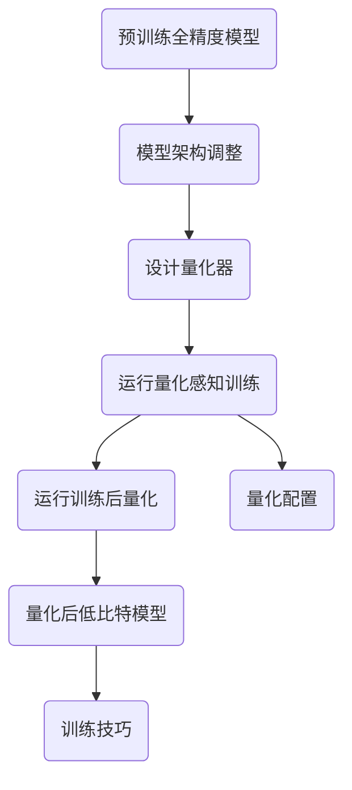

图 5.12 量化感知训练的流程

深蓝色框表示必需步骤，浅蓝色框表示可选步骤，浅绿色框表示辅助技术或设置

（1）模型架构调整。在进行量化感知训练之前，可以考虑调整模型架构，使其更适应量化。一种常见的技巧是增加模型通道数，通过引入额外的计算来減少任务性能损失。在模型实际部署推理时，批标准化层通常需要被折叠。量化感知训练过程需要考虑到“批标准化层最终需被折叠”这一点，对批标准化层的统计信息累计和权重更新做特殊处理，具体策略可参考5.6.2节。

（2）過计量化器。量化感知训练中量化器的设计具有较大的灵活性。例如可以将缩放系数设置为可学习参数，通过梯度下降算法与模型权重联合优化。量化函数可以不局限于均匀量化，而是通过数据驱动的方法学习合适的量化间隔等。5.6.3节将展开介绍过化器设计方法。

（3）运行训练后量化。运行5.5节所介绍的训练后量化方法，为量化感知训练过程提供合适的量化权重和量化参数初值。

（4）运行量化感知训练。通过训练优化模型权重与量化参数。5.6.4 节将简要介绍分阶段训练的技巧。

主流的深度学习训练或推理框架（TensorFlow Lite、PyTorch、TensorRT）等）必现了简单的量化感知训练方法。MQBench 评估了量化感知训练的常用技巧并开源了同名框架，对经典的量化感知训练方法进行了良好支持。读者可根据实际需求，在这些开源框架的基础上进行扩展。

##### 5.6.2 调整模型架构的方法

针对批标准化层折叠的特殊处理

如2.2.1 节所述，批标准化层在模型推理阶段为一个线性变换，因此，为了减少计算量，找标准化层通常会被折叠进前序线性层。而量化感知训练过程需要考虑“批标准化层最终需被折叠”这一点，对批标准化层的统计信息累计和权重更新做特处理。若在量化感知训练时分别量化卷积层和批标准化层的权重、统计信息和计算结果，而在部署时将这两层的权重和统计信息折叠并量化，推理阶段的卷积计算结果会与训练阶段的卷积一批标准化层计算结果出现较大偏差。如图5.13所示，MQBench 将量化感知训练中针对批标准化层折叠的处理策略总结为以下5种。


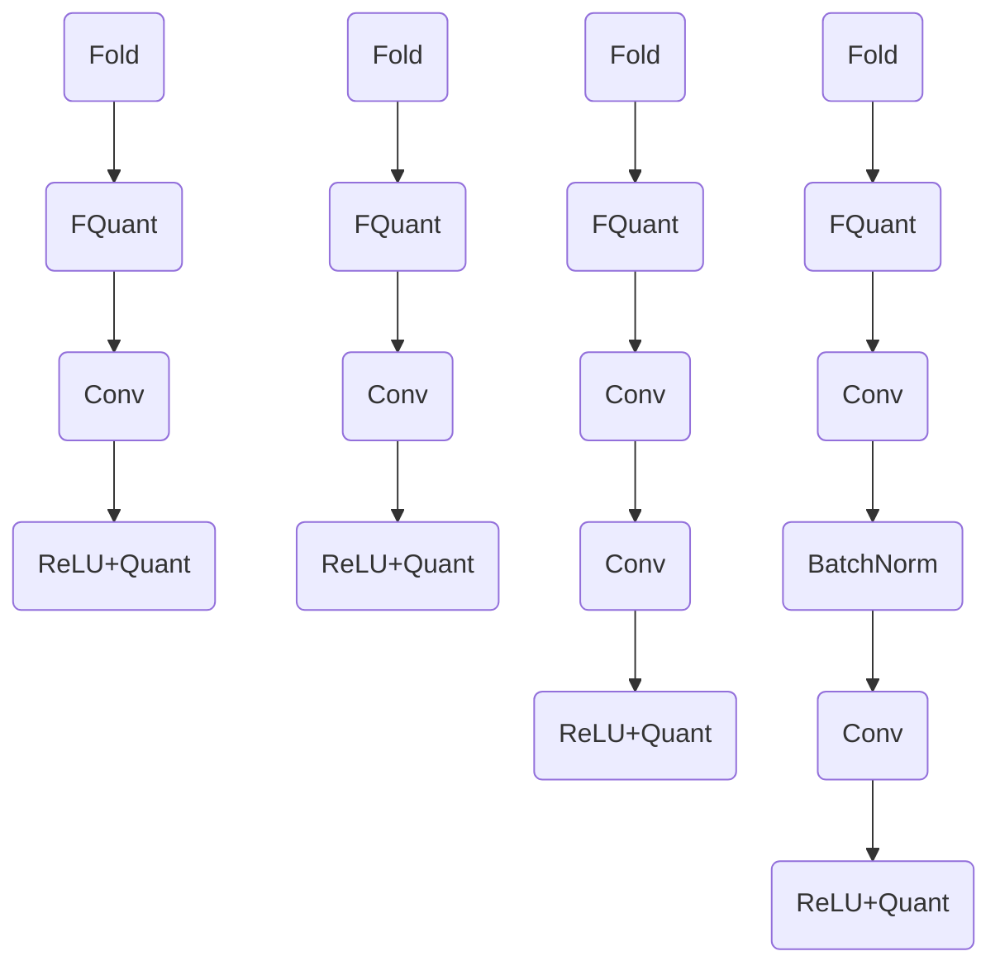


针对批标准化层折叠的量化感知训练处理策路示意图

（1）将批标准化层的统计信息和权重折叠入卷积权重，移除批标准化层的参数表示。按照式2.12，将批标准化层折叠进前序卷积层权重，并完全移除批标准化层。需要注意的是，这种折叠方式完全移除批标准化层，可能会导致训练过程中梯度爆炸，需要谨馍设置训练超参数。

（2）将批标准化层的统计信息和权重折叠入卷积操作，在量化感知训练阶段不更新批标准化层的统计信息 A，o2，即保持浮点预训练模型的统计值，只更新7，B。Li等人发现，在搭配可学习步长量化（Learned Step size Quantization, L.SQ）方法时，即使不更新统计信息，仍可取得与更新统计信息的训练相差无几的性能。

（3）引入两次卷积，浮点卷积用于更新批标准化层的统计信息，模拟量化卷积则折叠卷积权重和批标准化层的批统计信息与权重、输出结果进入下一层。该策略由 Jacob 等人提出，在推理时需执行两次卷积操作，所以有额外开销。第一次卷积使用全精度权重，计算结果用以统计当前批的均值与方差 Ai，a2；随后，当前批上的均值与方差将先和卷积权重折叠，然后被量化，得到折叠量化后的权重Wfold。训练结束后，导出量化模型时，将滑动统计的均值与方差折叠进相邻卷积层的权重并量化得到最终权重。

（4）引入两次卷积，浮点卷积用于更新批标准化层的统计信息，模拟量化卷积则折叠卷积权重和批标准化层的滑动统计信息与权重、输出结果进入下一层。本策略的第一次卷积操作与策略（3）相同；不同之处在于第二次卷积时，本策略选择将滑动统计值折叠入卷积层，以避免批统计值的波动对训练过程带来影响；第二次卷积后，本策略使用滑动统计方差和当前批方差的比值g放缩卷积输出。

（5）显式地保留批标准化层，其基于模拟量化卷积结果更新统计信息180。无论在训练还是部署推理阶段，此策略都将批标准化层中的滑动统计信息与权重折叠入前序卷积层的权重并量化。与不再更新统计信息的策略（2）不同，此策略在训练阶段仍显式地保留卷积后的批标准化层，以更新统计信息。具体来说，如图 5.13（e）所示，由于批标准化层对前向计算结果的变换已被折叠入前序卷积层，所以其需要起到的作用仅为更新统计信息。因此，我们将卷积计算结果与系数TBD相乘，以近似抵消后续批标准化层对前向传播过程中的计算结果的作用。在推理阶段，由于，系数乘法与批标准化层对前向计算结果的作用相抵消，可直接移除该 ；系数乘法和批标准化层。此时，计算图将转变为与策略（1）一致。该策略相比策略（3）和策略（4）的优势是，统计信息是基于量化卷积结果更新的，而不是基于浮点卷积结果更新的。

MQBench 测试了上述策略并给出了一些经验，例如，不同的量化方法对批标准化层折叠策略有不同的偏好，不同的批标准化层折叠策略对训练效果和效率有不同影响等，感兴趣的读者可以阅读参考文献 以获取更多细节。

##### 5.6.3量化器设计的技巧

本节将介绍改进量化器的常用技巧，包括不改变量化函数形式，仅改变量化参数确定方法的技巧，可学习的量化参数以及使用更复杂的量化函数，例如使用非均匀可学习的量化函数随机舍入等技巧。

1. 可学习的量化参数

尽管基于均方差等准则计算出的量化参数可最小化局部量化误差或重建误差。但其全局任务性能往往是次优的。将量化参数设置为可学习变量并在量化感知训练中使用。任务损失对其梯度进行更新有希望改善全局任务性能。有人提出在激活函数中添加可学习截断阈值的方案参数化激活值截断阈值。Pact将relu函数替换为以下带有截断的激活函数。

$x\_{act} = \text{ReLU}\_{PACT}(x) = 0.5 \left( |x| - |x - \alpha| + \alpha \right) = \begin{cases} 0, & x \in (-\infty, 0) \\ x, & x \in \[0, \alpha) \\ \alpha, & x \in \[\alpha, +\infty) \end{cases}$

$激活值的输出范围被限制在 \[0, \alpha\]，范围可以近似由 2^b 中的可学习参数确定。$

与激活值量化常使用的轴承量化力度一致pact使用层内共享的阿尔法参数。阿尔法的取值越大越接近普通。R el u函数未取得限制动态范围的效果。Pact在交叉上损失函数的基础上增加了对阿尔法的L2约束项。

$= \left \{ \begin{matrix}- \frac{x}{s}+ \left\[ \frac{x}{s} \right\]&q\_{ \min}< \frac{x}{s}<q\_{ \max} \\ q\_{ \min}& \frac{x}{s} \leq q\_{ \min} \\ q\_{ \max}& \frac{x}{s} \geq q\_{ \max} \end{matrix} \right.\begin{split} x\_{\texttt{act}}=\texttt{ReLU}\_{\texttt{PACT}}(x)=0.5(|x|-|x-\alpha|+\alpha)=\begin{cases}\texttt{0},&\bm{x\in(-\infty, 0)}\\ \bm{x},&\bm{x\in\[0,\alpha)}\\ \bm{\alpha},&\bm{x\in\[\alpha,+\infty)}\end{cases}\\ \text{截断后},\ \text{激活函数的输出被限制在}\ \[0,\alpha\]\ \text{范围并被近似为}\ \texttt{2}^{b}\ \text{个可能值}\texttt{:}\\ \hat{x}=Q(x)=\left\[x\_{\texttt{act}}\cdot\frac{2^{b}-1}{\alpha}\right\]\cdot \frac{\alpha}{2^{b}-1}\\ \texttt{PACT}\ \text{认为},\ \hat{x}\ \text{相对于截断阔值}\ \alpha\ \text{的梯度可计算为}\\ \frac{\partial\hat{x}}{\partial\alpha}=\frac{\partial\hat{x}}{\partial x\_{ \texttt{act}}}\frac{\partial x\_{\texttt{act}}}{\partial\alpha}=\begin{cases} \texttt{0},&\bm{x\in(-\infty,\ \alpha)}\\ \texttt{1},&\bm{x\in\[\alpha,\ \infty)}\end{cases}\end{split}$

     Pact为激活函数增加了可学习的截断阈值。等价于自适应的调节激活值的缩放系数。Ls扣方法则更进一步的将权重与激活值的缩放。系数都作为优化变量引入训练过程。且修正了pact的梯度计算求得模拟量化的结果x等于cos。X关于缩放系数s的梯度为：

$\frac{ \partial \widehat{x}}{ \partial s}= \frac{ \partial}{ \partial s} \left\[ s \cdot{clip} \left( \left\[ \frac{x}{s} \right\];q\_{ \min},q\_{ \max} \right) \right\]$

$= \left \{ \begin{matrix}- \frac{x}{s}+ \left\[ \frac{x}{s} \right\]&q\_{ \min}< \frac{x}{s}<q\_{ \max} \\ q\_{ \min}& \frac{x}{s} \leq q\_{ \min} \\ q\_{ \max}& \frac{x}{s} \geq q\_{ \max} \end{matrix} \right.$

其中，［］舍入函数的导数为1（直通梯度估计）。直观理解此式，待量化数值越接近两个相邻量化间隔的过渡点（Transition Point ），其量化后数值越可能随着缩放系数和过渡点的微小变化而发生改变。放缩后浮点值 e跟舍入后整型值［罗］的差距越大，企关于。的梯度绝对值越大。

由式5.34 中的-3+［与图5.14（b）可见，式5.34 推导的缩放系数的梯度符合这一直观认识。


```mermaid
flowchart TD
  QuantizationValue1("量化值 1")
  QuantizationValue2("量化值 2")
  QuantizationValue3("量化值 3")
  TransitionPoint1("转变点")
  TransitionPoint2("转变点")
  TransitionPoint3("转变点")
  LSQ("LSQ")
  LACT("LACT")

  QuantizationValue1-->TransitionPoint1
  TransitionPoint1-->QuantizationValue2-->TransitionPoint2
  TransitionPoint2-->QuantizationValue3-->TransitionPoint3
  LSQ-->QuantizationValue1
  LSQ-->QuantizationValue2
  LSQ-->QuantizationValue3
  LACT-->QuantizationValue1
  LACT-->QuantizationValue2
  LACT-->QuantizationValue3
```

图 5.14 图中取 s=1,9min = 0, gmex =31244）

2．量化函数的没汁

本节将介绍调整量化函数的工作，包括将均匀的量化间隔替换成可学习的量化间隔LQ-Nets 、将舍入函数随机化的技巧、将量化函数软化并随着训练逐渐逼近“硬量化”的可微分软量化（Differentiable Soft Quantization, DSQ）。

量化函数非均匀化：可学习量化间隔。如5.3.2节所述，一些研究者指出，手工设计的量化格式（如均匀量化或对数量化）不能很好地适应数据的分布，量化效果不理想。为此，研究者提出量化间隔可学习的量化函数。注意，前节所述的量化参数可学习的量化函数保留了均匀量化格式，通过训练确定缩放系数、量化零点等量化参数，而这里介绍的可学习量化函数打破了均匀量化的限制。

如式 5.35 所示，n-bit 无符号量化值 q 可表示为一个包含 2 的幂次的基向量与二值编码向量 $e = \[e\_1, e\_2, \ldots, e\_n\], e\_i \in \{0, 1\}$ 的内积：

$q= \langle \left\[ \begin{matrix} 1 \\ 2 \\ \cdots \\ 2^{n-1} \end{matrix} \right\], \left\[ \begin{matrix} e\_{1} \\ e\_{2} \\ \cdots \\ e\_{n} \end{matrix} \right\] \rangle$

二值编码向量 $e$中的每个元素有两种可能的取值，携带 1-bit 信息，可表示 $\{-1, 1\}$或 $\{0, 1\}$。这两种编码的计算都可用于 $\{0, 1\}$机器数的位操作实现。读者可参考二值化神经网络工作例如 6.2 节了解如何使用 $\{0, 1\}$机器数的位操作实现逻辑上 $\{-1, 1\}$编码的计算。LQ-Nets 使用 $\{-1, 1\}$编码权重，$\{0, 1\}$编码激活值。为方便讨论，本节将权重与激活值的编码方案统一为 $\{-1, 1\}$。

LQ-Netsl使用基向量与二值编码向量的内积形式来表示量化水平，把基向量的元素从2的幂次推广为可学习的浮点数。通过量化感知训练确定基向量（表示为心）后，数值的各个量化间隔就确定了。此时，落在第1个量化间隔的 对应的量化水平 9 可表示为式 5.36：

$Q\_{LQ-Nets} \left( x,v \right)=q\_{l}=v^{T}e\_{l}, \text{如果}x \in \left( t\_{l},t\_{l+1} \right\]$

式中，l= 1,2，，20为量化间隔的编号，每一个量化间隔对应一个 n-bit 二值编码 el e｛-1，1｝”。通过判断待量化数值落入哪一个量化间隔内，得到该间隔的二值编码，进而可由基向量与二值编码计算出量化水平。量化间隔的端点 t为两个相邻量化水平的中点：女=（9-1+90）/2。图5.15 给出了2-bit 时，量化水平集合｛9｝=1.2.2n如何用可学习的基向量的元素组合而成：可学习的基向量为 =［e1，02］，共有 22=4个量化间隔，二值编码分别为［-1，一1，

［1，一1）【-1,4）【1，1，対立的量化水平91.94分別方-01-02,01-023-01+02,01+02


```mermaid
flowchart TD
  OneBit("1-bit")
  TwoBit("2-bit")
  V1V2("v1 + v2")
  NegV1V2("-v1 + v2")
  V1NegV2("v1 - v2")
  NegV1NegV2("-v1 - v2")
  Neg1("-1")
  Pos1("1")
  StepV1V2("v1 + v2")
  StepNegV1V2("-v1 + v2")
  StepV1NegV2("v1 - v2")
  StepNegV1NegV2("-v1 - v2")
  
  %% Matrix representation
  OneBit --> Pos1
  OneBit --> Neg1
  TwoBit --> Pos1
  TwoBit --> Neg1
  Pos1 --> V1V2
  Pos1 --> V1NegV2
  Neg1 --> NegV1V2
  Neg1 --> NegV1NegV2
  
  %% Stepwise representation
  StepNegV1NegV2 --> StepV1NegV2 --> StepNegV1V2 --> StepV1V2
```

图 5.15 2-bit LQ-Nets 的量化水平和量化函数

总的来说，为了实现可学习、非均匀的量化函数，LQ-Nets对量化函数进行参数化的方式如下。首先，利用基向量和二值编码向量的内积来表达量化水平；然后，将基向量从固定的1，2.，2-1 向量（均匀量化）推广到可学习的向量。使用这种参数化方式（对于 no-bit仅有几个可学习参数）来实现非均匀间隔的好处是最化后问录的内积可由位操作高效实现。假设二个N 维权重向量为心 ER”，其经过 LQ-Nets最化兩数得到線码向量 eY E（-1.1｝”，1一1,2..7，其中，7w表示权重的量化位宽，辅明向藏e、中的元業为心中各权重第 个比

$Q\_{LQ-Nets} \left( \omega,v^{ \omega} \right)^{T}Q\_{LQ-Nets} \left( a,v^{a} \right)= \sum\_{i=1}^{n\_{ \omega}} \sum\_{j=1}^{n\_{a}}v\_{i}^{ \omega}v\_{j}^{a} \left( e\_{i}^{ \omega} \odot e\_{j}^{a} \right)$

舍入随机化。如果使用确定性的舍入函数，那么量化函数就是确定性的，即对于每一个待设化数值，都会唯一输出一个确定的量化值。然而，确定性量化在一些情况下是次优的。例如，在低比特训练中（可参考5.10节），反向传播的梯度会被量化至低位宽表示，若选择较低量化位宽，梯度几平总会被量化为0，导致训练失败180。与之相对，随机舍入（Stochastic Rounding）可以提升优化过程的探索性，让模型有可能逃离局部最优值。在低比特训练中，对梯度使用随机舍入尤其重要，这一点也被后续工作23 进一步验证。式5.38 给出了随机舍入的定义：$\left\[ x \right\]\_{stochastic}= \left \{ \begin{matrix} \left\[ x \right\], \text{以概率} \left\[ x \right\]-x \\ \left\[ x \right\], \text{以概率}x- \left\[ x \right\] \end{matrix} \right \}$式中，［istehastie 表示随机舍入，L」与「.1分别表示向下与向上舍入。随机舍入在量化操作中引入了随机性，待量化数值被量化到它的两个相邻量化水平的概率与其至对应格点的距离成反比。

即使待量化数值非常接近某一格点，它仍有一定概率被量化至较远的另一格点，从而避免训练陷入局部最优。需要注意的是，随机舍入要求在每次再量化时都生成相应数量的随机数，需要特殊的硬件支持并会带来额外的计算开销。

量化函数软化。如5.6.1节所述，由于舍入函数不可导，量化感知训练里常使用直通梯度估计器估计舍入函数的梯度。虽然直通梯度估计器的计算方式简单、实用性强，但由于与前向传播过程存在差距，其估计梯度与实际的数值梯度之间存在误差。尤其是在量化位宽较低时，梯度估计误差较大，可能导致优化过程不稳定。降低量化神经网络训练过程中的梯度估计误差有两种主要思路。一种思路是使用其他梯度估计器，这类方法在极端量化的二值化神经网络里更为常见，例如，将直通梯度估计器中反向的单位线性函数替换成与前向的离散量化函数更接近的非线性函数，参见 6.-4.2 节。另一种思路是将前向传播过程的量化函数软化（Soften），反向传播过程中直接使用该软化量化函数的梯度。虽然第二种方法的前后向传播过程不存在差距，但是其前向过程和真正量化的前向过程存在差距、不能得到离散的量化值。因此，会通过设计方法在训练过程中逐渐调墼量化函数的软化程度，使其在训练结束时逼近离散量化函数。这里，我们介绍的可微分软量化101 属于第二种，其提出了一种软化量化函数，将阶梯形状的离散量化函数分段替换成形状可调鳖的双曲正切函数。式5.39给出了一个量化间隔上可微分软量化函数

$\varphi(x) = s \tanh(k(x - m\_i)), \quad \text{if } x \in P\_i \\ where: \\ m\_i = l + (i + 0.5)\Delta, \quad s = \frac{1}{\tanh(0.5k\Delta)}$

式中，P。表示不同的量化间隔，ms确定各个间隔的位置，A= 当步一” 表示量化间隔的长度（Uhmax 和 vmin 为量化区间的浮点上下界）。参数。的设置保证此分段双曲正切函数在量化间隔邻接处连续且平滑。参数 k 可控制此量化函数的软化程度，k 越大，此量化函数越接近阶梯状的离散量化函数。DSQ 的整体函数形式如式5.40所示。

$Q\_{soft} \left( x \right)= \left \{ \begin{matrix} v\_{ \min},&x<v\_{ \min} \\ v\_{ \max},&x>v\_{ \max} \\ v\_{ \min}+ \Delta \left( i+ \frac{ \varphi \left( x \right)+1}{2} \right),&x \in{P}\_{i} \end{matrix} \right.$

由于 DSQ的软化量化函数处处可导，反向传播过程可直接依赖该函数的自动微分进行梯度回传，不需要梯度估计。DSQ 会使用损失函数的梯度指导k的更新，其中用到了一个可反映 DSQ量化与标准量化差距的特征变量（Characteristic Variable）作为中间变量，具体细节请读者参考文献 。如图 5.16 所示，随着 DSQ训练的推进，DSQ量化函数逐渐逼近阶梯函数的形状，因此在训练结束时将其替换成离散量化函数不会引入太大误差。


图 5.1 周期2 DSQ 的软化量化函数示意图

对于量化位宽较高的情形（如 4bit 及以上），梯度估计误差对任务性能的影响较小；对于估计误差的研究也更为丰富，感兴趣的读者可参考6.4.2 节。极端量化情形（如二值或2-bit 量化），梯度估计误差可能对任务性能产生较大影响，校正梯度

##### 常用的训练技巧

分阶段训练

从头开始使用量化感知训练一个随机初始化的模型可能会导致收敛速度较慢，并且可能无法找到较优的收敛点。为了解决这一问题，可以采用分阶酸训练的方法。这种方法设立了一些更容易优化的中间阶段，逐步实现不同程度的量化，最终得到所需的量化模型。阶段间的变化可以是位宽逐渐降低，也可以是被量化的张量类型和个数逐渐增多等。分阶段训练的技巧在训练极端量化的二值化网络时更常用，感兴趣的读者可以参考6.4.3节。在非极端量化的情况下，也可以看到分阶段训练思想的应用。例如，为了加速训练，可以从全精度模型出发，先对全精選模型应用训练后量化方法确定量化参数和量化值的初始值，然后在后续的量化感知训练中逐步更新量化参数和量化值。这种以全精度模型的训练后量化结果作为中间阶段，为量化感知训练阶段提供合适的初始量化参数的做法可以看作一种分阶段训练技巧。关于量化感知训练中量化参数初始化的讨论细节，读者可参考 Nagel等人所著的量化白皮书161。

还有一些研究工作使用知识蒸馏的技巧，在不同阶段的模型之间传递知识，例如，以全精度模型作为“老师”指导低位宽“学生”模型的训练，以改善学生模型的性能。Polino 等人提出使用知识蒸馏的方法，训练低位宽学生模型时在普通的交叉熵损失之外引入蒸馏损失项，即学生模型输出的软标签和老师模型输出的软标签的交叉熵。

#### 5.7 混合位宽量化

量化位宽是一种可配置的量化参数。早期的量化方法通常对整个模型使用相同的量化位宽。然而，神经网络模型的不同层具有不同的量化敏感度。在给定平均位宽限制的情况下，使用统一的量化位宽会导致量化后模型的性能受到对量化敏感的算子的限制。为了解决这一问题，混合位宽量化方法（也称为混合精度量化方法）对模型的不同部分使用不同的量化位宽，以权衡“性能一效率”；给对量化更敏感的层分配较高的量化位宽，以降低该层量化所带来的性能损失；同时，给对量化不敏感的层分配较低的量化位宽，以降低存储和计算需求。

TBD： 为什么混合位宽量化可以提高精度？

5.7.1基于敏感度指标的混合位宽量化

基于敏感度指标的混合位宽量化（Hessian-AWare Quantization,HAWQ） 是较早被提出的混合位宽量化方法之一。该方法认 損失函數对模型权置的 Hlesdtan 短降信息可以用于衡圍EAWQ给出了混合位宽量化问题的基本定义：以最优化“性能一效率”权衡为目标，确定模型每层的量化位宽。然而，由于位宽的优化空间巨大，如果采用简单的选代搜案方法探索该变间，且每个送代都需要训练一个量化模型，则模型量化过程会消耗大量计算资源。幸运的是，我失函数对各张量的梯度仅需要单次前向传播与反向传播就可以得到，其中包含了丰富的信息。一个直接的想法是：梯度越大的张量对量化越敏感。然而，HAWQ1280 指出，仅仅使用一阶信息并不能很好地反映量化敏感度，而由 Hessien矩阵表征的二阶信息可以更好地反映量化敏感度。具体来说，Hessian 短阵的特征值越大，损失函数曲面在当前权重取值处的曲率越大，即较小的权重量化误差可能导致更大的损失函数变化。此时，这部分权重数值需要更大的位宽表示，以避免较大损失。因此，Hessian 矩阵的特征值可以作为各张量的敏感度指标，并作为混合位宽分配的依据。然而，完全计算 Hessian 矩阵及其特征值代价过大。因此，Dong 等人在 HAWQ 中提出了一种近似算法，以快速获得 Hessian 矩阵的特征值作为量化敏感度指标，并基于该指标手工设计了位宽分配方案。与非混合位宽量化方法相比，HAWQ取得了更好的“性能一效率”权衡。

HAWQ 提出了使用 Hessian 矩阵的最大特征值来描述量化敏感度，这可以指导高效的混合位宽量化。然而，HAWQ存在三个问题：首先，它没有考虑除了最大特征值的其他 Hesian信息；然后，虽然相对敏感度可以指导位宽在不同层之间的相对大小关系，但具体的位宽设置仍需要手动分配；最后，HAWQ 没有对激活值进行混合位宽量化。为了解决这些问题，Dong等人在 HAWQ 的基础上提出了HAWQ-V2151。该工作提出使用所有 Hessian 矩阵的特征值的平均值，即平均迹（Average Trace），作为更好的敏感度指标。此外，他们提出了一种自动化位宽分配的方法，即按照式5.41 对所有满足相对大小关系的位宽分配方案计算各层的量化敏感度和量化误差的乘积之和 2，并选择最小化52的位宽配置：

$\Omega= \sum\_{i=1}^{L}Tr \left( H\_{i} \right) \cdot \left \| Q \left( W\_{i} \right)-W\_{i} \right \|\_{2}^{2}$

其中，工表示模型层数，9（0）表示難化后权事，35（社）表示该层的 Hesian 平均迹。最后，财微活信进行 Hlesten短降分析和混合位還藏代。并发现这讨于目标检测任务非常有益。

上述两个版本的 EANQ均采用深点維效系数的逐化存式。HANQ-valsn则针对全擊数证化格式（Inrteger-only）的混合位宽量化展开了研究。全整数量化格式的计算只涉及整数乘法、加法及静态位毯，对硬件更友好。为确定混合量化位究，EAW9.V3仍采用式541作为优化目标。与 EAWG.12来朋一评估射有满及相对大小关无理服防备限右器、造择最小化 ”的方樂木間

$\begin{split}&\min\_{\{\bm{b\_{i}}\}\_{\bm{i=1},\cdots,L}}\sum\_{\bm{i=1 }}^{L}\Omega\_{\bm{i}}(\bm{b\_{i}})\\ \text{s.t.}&\quad\sum\_{\bm{i=1}}^{L}M\_{\bm{i}}(\bm{b \_{i}})\leqslant\text{Model Size}\\ &\quad\sum\_{\bm{i=1}}^{L}G\_{\bm{i}}(\bm{b\_{i}})\leqslant\text{BOPS }\\ &\quad\sum\_{\bm{i=1}}^{L}Q\_{\bm{i}}(\bm{b\_{i}})\leqslant\text{Latenc }\end{split}$

5.7.2基于搜索的混合位宽量化

HAWQ 系列工作基于 Hessian 矩阵的特征值快速评估各层的敏感度，并基于各层量化误差影响独立的假设，使用各层敏感度指标计算整体优化目标，再针对此优化目标运行网格搜索或规划算法完成位宽分配。除了这类工作，也有一些工作不借助敏感度分析指标，直接使用迭代搜索的方法，针对整体模型的性能、效率等优化目标和限制来确定位宽分配。

ReLeQ来用強化学方法近端策略代化（Proximal Policy Optimization,PPO来完成混合位宽分配。其状态空间为不同的量化位宽，奖励则为量化准确率与浮点准确率的比率。与此类似，硬件感知自动量化153（Hardware-aware Automated Quantization, HAQ）也采用强化学习算法 Actor-Critic195l。 HAQ 的状态空间同样为每层的位宽，奖励函数为任务性能和硬件仿真性能的加权和。值得一提的是，HAQ针对不同硬件平台进行了实验，包括 Intel CPU、NVIDIA GPU 及智能手机等。

与其他离散搜索方法一样，以上基于强化学习的搜索方法依赖反复的迭代测试，资源消耗大。为解决这一问题，DNAS借鉴了可微分搜索相关工作，采用基于梯度的方法来优化位宽决策。后续的工作 HMQ 通过在硬件模型中添加实测硬件延时等数据，提高硬件性能建模的准确性。表5.3 展示了在 ImageNet 数据集上对 ResNet-50 进行量化时各方法的性能。采用混合位宽的量化方法比使用单一量化位宽的量化方法获得更好的性能一效率权衡。


| 工作 | 类型 | 压缩率 | 性能 |
| --- | --- | --- | --- |
| LQ-Nets | 非混合位宽 | 10.67× | 74.20% |
| HAQ | 混合位宽（自动化） | 10.57× | 75.30% |
| HAWQ | 混合位宽（人工准则） | 12.28× | 75.50% |
| HMQ | 混合位宽（自动化） | 15.70× | 75.00% |

5.8 量化方法的经验性选择

本节将介绍量化方法选型的经验。量化方法选型时，应综合考虑以下三方面的情况和需求。

（1）模型生产周期和数据获取情况：应根据此场景的情况决定使用何种量化流程。

（2） 算法性能目标的需求：应根据此场景的需求决定使用何种量化流程，并设计和决定合适的数据表示、算子与计算图调整方法。

（3）任务负载情况、硬件平台能力的情况和硬件效率目标的需求：应根据此场景的情况和需求分析效率瓶颈，并设计和决定合适的数据表示、算子与计算图调整方法。

本节的组织安排如下，5.8.1 节将介绍不同量化流程的特点和选择思路。5.8.2 节将介绍数据表示的设计和决定，从量化格式、量化参数和量化值这3个方面给出建议。5.8.3 节将介绍算子的选择与处理和计算图的调整。5.8.4 节将提供针对典型任务的前沿量化性能分析（截至2023年）供读者参考。

5.8.1量化流程的选择

量化流程的选择，即量化感知训练或训练后量化，与模型生产周期、数据获取情况、任务性能要求等应用场景的情况和需求紧密相关。

（1）量化流程的时间开销：量化感知训练方法需要执行模型训练任务，所需时间较长（数小时乃至数天）；训练后量化方法的执行速度取决于缩放系数、量化零点等量化参数的确定方法，基于统计数值的量化参数求解15］ 速度较快，仅需秒量级；而基于误差最小化准则显式优化量化参数的训练后量化方法则根据模型规模、校正数据规模，以及优化算法的不同，可能需要数分钟乃至数小时的运行时间。

（2）量化流程的数据开销：量化感知训练通常需要大量数据，在难以获得训练数据的场景下并不适用；训练后量化可分为需要校正数据与不需要校正数据（Data-free） （L55） 两种类型。前者通常需要几百至上千个训练样本以辅助量化参数的确定，而后者常借助模型中批标准化层的参数来辅助确定量化参数，因此不需要真实数据。

（3）量化模型的任务性能：一般而言，在同样位宽下，可以期待量化感知训练方法比训练后量化方法取得更高的任务性能。

5.8.2 数据表示的设计和决定

本节讨论数据表示的设计和决定经验及用什么格式表示量化后的。市值数值，如何将全精度数值转化成量化后数值？

1）量化格式的设计

（1）根据带量化张量的分布选择对称或非对称量化，格式对于数值在数轴上近似以零点为中心的对称分布的张量，如模型权重，可选择有符号的对称量化格式，对于Relu激活值等单尾分布的量化对象，可选择无符号的对称量化格式，在数据分布难以事先确定的情况下，也可尝试更一般的非对称量化格式。

（2）选择均匀或非均匀量化格式时，应充分考虑硬件平台的支持情况，均匀量化的模型更容易在通用计算平台上取得加速。而一些非均匀量化方法则需要配合定制硬件取得实际加速。

（3）采用逐张量的量化粒度，当无分支结构时，可直接将相邻各层的浮点缩放系数单独垒成模型的量化推理效率最高。而采用逐通道的量化粒度时，虽然可以带来任务性能的收益，但其在每层计算后需要进行再量化推理开销一般更大。

2） 待量化操作类型和张量类型的选择

当决定量化哪些操作类型或哪些张量类型时，需要考虑任务性能和硬件效率两类目标。在任务性能方面，通过分析给定任务和模型的数据分布，若发现某些操作类型或张量类型对量化特别敏感，可以选择不对其进行量化，例如大语言模型中的 LayerNorm 层。在硬件效率方面，应基于硬件效率目标、任务负载和硬件平台的能力，分析效率瓶颈并据此选择合适的待量化张量类型。以大语言模型的推理或训练为例，考虑不同硬件平台和工作场景：在云端大批次推理场景中，硬件平台往往工作在计算瓶颈的状态。这一场景重点关心吞吐率这一效率指标。若硬件平台有低精度计算单元，可以采用权重激活量化方案，并利用低精度计算单元来加速计算。在端侧小批次推理场景中，硬件平台往往工作在访存瓶颈的状态。由于端侧硬件平台的存储能力和带宽较小，这一场景需重点关注模型存储开销、运行峰值显存和延时等效率指标，此时可考虑使用仅权重量化方案，仅量化权重，量化推理时将权重去量化成高精度表示，再使用高精度计算单元计算。训练阶段，为了优化存储开销和训练吞吐率两个指标，可以对激活值进行低位宽量化，减少存储需求和通信开销。

3） 量化参数和量化值的决定

（1）设定位宽参数时，需要考虑任务性能和硬件效率两类目标。在任务性能方面，应避免格敏感的操作和张量的位宽设置得过低。针对此问题，混合位宽量化方法提出了多种敏感性分有技术和自动化位宽决定技术，读者可参见5.7节。在硬件效率方面，应基于硬件效率目标、任务负载和硬件平台的能力，分析效率瓶颈并据此决定采用何种位宽。例如，某些硬件平台没有4比特计算，单元这意味着无法通过将模型的权重和量化积量化值量化成四比特。已在此平台上实现计算加速。若将权重量化为四比特，将激活值量化成8bit。量化推理过程需要在权重和激活值的矩阵矩阵乘法前对权重进行去量化。乘法后对激活值再进行再量化。若将权重和激活值均量化成8bit，则量化推理过程仅需要在乘法后对激活值进行再量化。此时将权重从8bit进一步量化成斯比特虽然能。降低权重缓存开销，但会引入额外的去量化操作，这两个代价需要在决定位宽配置时进行平衡。当硬件平台处于计算瓶颈的状态，例如大批次推理场景时，将权重从8bit量化成斯比特可能不能降低时间延迟。

（2） 选取缩放系数和零点参数的决定方法时，需要考虑任务特性和模型数据外布特性。每如，对于超分辨率、图像去嗓等底层视觉任务，中间特征的准确表示对任务性能至关重要，因时可能需要采用更先进的激活值量化参数选取策略。例如，选取基于训练的量化参数策略，1kg以降低任务性能锁失。再例如、对于大语言模型，SmoothQuant对其权重和激活值的数据分布进行了分析，发现激活值中的离群数值较多，且分布在少数几个通道中，因此其采用重参化策略将激活值中的离群通道和权重中对应通道进行通道均衡。

（3）读者可由简入繁地尝试各种方法，直到取得满意的量化效果。可以先尝试图 5.8所示的训练后量化的流程（深色部分），如果不能满足应用性能的要求，再考虑引入量化值调整策略。如果仍然不能满足应用性能的要求，则考虑采用量化感知训练方法。在应用量化感知训练方法时，可以先尝试基于最值的量化参数确定方法，再尝试使用可学习的量化参数14。

5.8.3 算子的选择与处理和计算图的调整

本节讨论如何根据任务、模型和硬件平台的特点进行算子选择和处理，以及进行计算图的调整。

1. 算子的选择与处理

量化后的模型需要实际部署到目标硬件平台，因此量化仿真时就需要考虑硬件算子的支持情况，对算子进行调整或替换。常见的调整和替换规则如下。

（1） 许多专用深度学习加速硬件不支持特妹算子，因此在量化部署之前可能需要替换这些算子，并可能需要进行额外的训练。例如，双线性上采样层（BilinearUpsample） 常需要通过反卷积实現，再重新训练模型。

（2）一些复杂的激活函数，例如sigma的swish等的实现需要额外的硬件支持。例如在定制化硬件设备上可利用查找表将输入数值应设置激活后数值。若硬件无额外支持，则需要在高精度下完成非线性运算，并。在其后插入量化节点以实现模型的全定点化。此类复杂激活函数不一定能给量化模型带来性能提升，因此读者也可以尝试将其替换成rllu。等硬件友好的激活函数。

（3）在进行量化仿真时，需要考虑算子的输入/输出的量化参数的对齐情况。以常见算子为例，对于最大池化层。池化后的特征图可以使用池化前特征图的量化参数和量化值，无须对其进有再做化：然而，对于平均池化层，池化操作可能引入新的非整型值，因此可能需要在该层后插人畫化书点进行再量化，考感到平均池化操作对数值范围影响较小，一般可以选用与池化前特证图一致的量化参数做再量化A0N。眺酥连接涉及张量的逐元素相加（Element-wise Addition）或者特征拼接（Concatenation），读者应注意两个操作张量的量化参数是否一致：逐元素相加时，读者需要对并加数的量化参数，或者将加数去量化成高位宽、高精度格式，并使用高位宽、高精度的格式完成加法；类似地，特征拼接操作也需要保证所拼接的特征图量化参数一致，或者去量化成高精度、高位宽格式，再重新计算整体的量化参数1600。

（4）可以根据任务特点对算子做处理以降低量化损失。以常用的目标检测模型 YOLOv3为例，原始的 YOLOv3模型将分类结果与回归结果合并在同一个卷积层后输出，两者的数值尺度不同，直接量化会导致严重的检测性能损失。因此，可以考虑将输出卷积层拆分为两个独立卷积层并分别量化以扩散模型为例，DDPM 扩散模型中 U-Net 的跳跃连接将浅层和深层特征拼接在一起，再进行卷积计算，而这两部分特征的数值尺度不同120m，直接量化会导致较大量化误差，因此可考虑将输入的浅层和深层特征和后续卷积计算在通道维度拆分，分别进行量化计算，计算后再相加。

2. 计算图的调整

（1）为了匹配量化仿真结果和实际硬件量化推理结果，量化仿真过程需考虑到模型的后续编译和量化推理过程中的“算子融合”。算子融合是深度学习模型编译中常用的计算图优化策略，指的是将一些低计算强度的算子融合至相邻层以减少模型运行的存储开销和访存开销。例如，激活函数、批标准化层等算子常会被融合至相邻线性层。一个关于激活函数融合的例子如下，DTs 格式的权董与激活值计算后，中间结果在 32 位聚加體中积聚并存至内存中。将此策果存入内存再读出以应用激活函数会造成额外的存储和访存开销，因此许多硬件平台支持在算出中间结果后直接应用激活函数并量化至 8-bit 后再存入内存。量化仿真时应该考虑算子融合，避免在这些被碳合的算子间插人额外的量化节点。关于批标准化层融合的介绍已在 363节给出。必要时，可以调整某些算子的位置以方便后续的算子融合，减少存储开销、访存开销及再意化操作的插人。例如，若原模型中特征拼接层后有激活函数，可以考虑将激活函数移动至特征拼接层前与线性计算层融合。

（2）在量化位宽、格式与量化方法已确定，但任务性能无法满足应用需求的情况下，读者可以考患將模型加宽或加深，以骄补量化造成的任务性能越失。

5.8.4 关于任务性能的经验

本节以图像分类、目标检测与底层现觉等应用为例，讨论典型量化方法可取得的效果。需要注意的是，量化效果受应用任务、数据集、模型大小等因素影响，难以精确预测。出于任务通用性和硬件支持性的考虑，工业界常采用成熟的8-bit 量化。在这个位宽下，量化模型基本上可以达到接近全精度模型的性能）。最新的量化方法则可以取得以下效果。

1. 图像分类

相比早期的量化方法，目前的前沿方法 已经取得了显著的进步。较新的量化感知训练方法可在 ImegeNet 数据集上将模型权重和激活值量化至4-bit 并维持任务性能，甚至还在向更低的位宽挑战（在将权重与激活值均量化至 2-bit 的情况下，得到2% 以内的准确率损失）。先进的训练后量化方法可以将权重量化至4bit，同时保持激活值的全精度，在这种情况下，保持 ImageNet 的分类性能，或者在将权重与激活值均量化至4-bit 的情况下，得到约1% 的准确率损失。完全不需数据的训练后量化方法1210的性能相对受限，在5-bit 的量化位宽下仍会产生较明显的准确率损失（约2%）。

2. 目标检测

目标检测领域的量化前沿工作AQD首次将全模型（包括骨干网络、特征金字塔网络、检测头）量化至 4-bit，同时在 COCO 数据集12121上将任务性能损失控制在1%以内。AQD论文的作者 Chen 等人还展示了按模型组件的量化结果，将骨干网络与特征金字塔网络的权重与激活值量化至2-bit，保证检测头为全精度时，性能损失在1%以内。

3. 底层视觉

底层视觉模型通常通过大量计算换取微小的性能提升1218，因此模型的效率问题非常突出1214,215。底层视觉模型的量化相对困难，这可能是因为底层视觉任务要求准确保持特征值的缘故。前沿的底层视觉量化方法1210）能够在图像超分辨率任务上将模型无损地量化至8-bit（权重及激活值），但将模型量化至 4-bit 时，任务性能损失约为 3%。

5.9拓展：低比特推理硬件实现

5.9.1 定点计算的硬件效率

冯诺依曼体系结构中计算数据都需要通过保存从内存中得到。而低比特数的保存总量少，因而具有能耗优势。如图所示，以三级存储和计算d ram s ram register计算电路的典型ac可设计为例。单位数据的缓存能耗可达计算能耗的数。百倍通过量化将数据位宽降低，可以直接降低保存量，从而降低能耗。相比高位宽数据相同大小的片上s ram可以缓存更多低位宽数据，这。使得从更慢和功耗更高的低ram中访问数据的需。求大大减少具有能耗和性能的优势，此外低比特的计算效率也更高。如表所。示低。位宽定点数的计算单元相比单精度浮点数的计算单元具有功耗和面积的优势。综上所述相比于全精度数据格式的神经网络量化神经网络的效率提升大部分来自保存功耗的减少。也有一部分来自计算的优化。


| 操作 | 能耗 (MUL / pJ) | 能耗 (ADD / pJ) | 面积 (MUL / µm²) | 面积 (ADD / µm²) |  |
| --- | --- | --- | --- | --- | --- |
| 8-bit INT | 0.2 | 0.03 | 282 | 36 |  |
| 16-bit FP | 1.1 | 0.4 | 1640 | 1360 |  |
| 32-bit FP | 3.7 | 0.9 | 7700 | 4184 |  |

| 操作 | 能耗 / pJ | 相对能耗 |
| --- | --- | --- |
| 32位整数加法 | 0.1 | 1 |
| 32位浮点加法 | 0.9 | 9 |
| 32位寄存器 | 1 | 10 |
| 32位整数乘法 | 3.1 | 31 |
| 32位浮点乘法 | 3.7 | 37 |
| 32位SRAM缓存 | 5 | 50 |
| 32位DRAM内存 | 640 | 6400 |

45nm CMOS 工艺下各类操作的能耗，访存的能耗比简单算数计算的能耗高三个数量级

#### 浮点计算转定点计算的原理

1.最基本的量化方案

通过量化，可以将神经网络中原本的浮点数表示为定点数。在实际部署时，我们希望将原本的浮点计算简化为定点计算，这一过程中有两个关键细节需要考虑：

一个是如何通过定点计算得到正确的结果；

另一个是如何将位宽变大的计算结果再量化。

（1）定点数在量化神经网络中并不表示其通常意义下的整数值。例如，一个8位数，作为有符号整数时一般认为其表示-128~127 的整数，但在神经网络中，浮点变量不会总是恰好符合这个花围，因此会使用一个缩放系数，使8位数表示特定范围内的256个量化值，而不是一般意X的-128~127 这256个整數。在这种情况下，浮点數总是可以避化为一个定点数表示，但原本多个浮点数之间的浮点计算能否顺利转化成定点计算，则有一定的限制条件，需要看该浮点计算公式能否顺利通过恒等变形，转化为用定点计算得到定点输出的公式。以最简单的量化方案举例，即采取逐层的量化粒度、对称量化、采用2的幂次作为缩放系数且在量化前离线确定数据分布范围（而不是在计算中动态统计）18。对于神经网络的基本操作，矩阵乘法加偏置，浮点数的乘然后通过恒等变换得到式 5.43。

$\left. y\_{int}= \left( \omega\_{int}x\_{int}+ \frac{b}{2^{p\_{ \omega}+p\_{x}}} \right) \cdot 2^{p\_{ \omega}+p\_{x}-p\_{y}} \right.$

$y\_{int}= \left( \omega\_{int}x\_{int}+b\_{int} \right) \cdot 2^{p\_{ \omega}+p\_{x}-p\_{y}}$

式5.43解释了在实际计算中，输出结果 ？的定点数表示 ghnt 是如何计算得到的。可以看到，whnt zint 是两个输入变量的定点数表示的乘法计算，是定点计算，其结果也是定点数。在再量化之前，为了保持乘累加精度没有损失，wint@int 的位宽会比输入的 wint 和aint 更高（如果4imt和 sint 不是矩阵，则乘法结果位宽就是输入的两倍）。与之相加的2p0午。在此公式中是浮点数，实际操作中需要舍入为定点数 bint。值得注意的是，因为对6 进行舍入的缩放系数 2Pw+p=是由w 和 决定，并非匹配 bint 的分布范围而选取的最合适缩放系数，所以缩放结果 Bint = 2Pu2+pm通常会较大。为了保持精度，同时匹配 wintaeint结果的位宽，进行量化时网络中的偏置的量化结果 bint 可以采用和wint a int 结果位宽一样的位宽，而不是与量化权重wint 一样。或者，可以选择让 bnt 的有效数字与wint 一样，但附带一个移位值进行对齐（类似浮点格式）。经过上述公式变换，原浮点计算被转换为wint aint +bint 这一定点计算。

（2）定点数计算产生的结果是高位宽的，需要截取回低位宽，对应式5.43 中的“-2Pw+Pa P。”这一操作。在笔者列举的离线量化方案中，Pw,Pa.Py的值都是离线确定的。权重w 在训练后保持不变，根据一层的权重矩阵的数值范围确定其量化参数 pw是很容易理解的。对于输入心和输出z，需要明确的一个概念是在最基本的量化神经网络推理实现中，其量化参数也是推理前离线确定的，即在网络训练后（或训练中），统计一部分输入数据的分布，以此分布范围为依据确定每一层的输入 … 和输出 z的量化參數，或借助批标准化层中的统计数值确定量化参数，无须使用校正数据。进行某次量化推理时，实际的输入数据 心和输出数据 ？的范围可能与离线时统计的不完全相符，但仍然按照推理前离线确定的权重进行量化。

以短阵乘法加偏置运算为例，uan和 Tan选择 &-bit 定点数格式，两个这样的标量定点數的乘法结果应为 16-bt，为了保证矩阵乘法中聚紧加的结果不因溢出丽损失棉变，设置累加位说和 bom 的位宽为 32-bt。该 32-b1t 计算结果爾選語酸射为&加t 数才能得到論出 30m.。回顾这一公式。其揭示了浮点数表示、定点教数不、縮放系数造三者的关系，即辣糖，式5.48 中 3mt -（e0wu2mn + bimn）- 2Pu-+7e-Pn 其实已经表示了该 32-bit 的结果如何映射为&b输出，即将其左楼 （po +Pe 一P）位，然后取低8位即可。

至此，对原本的浮点矩阵乘法加偏置，才完全转換成了定点表示和定点计算：8-bit 的乘法、10ai的乘法结果在 32-bit 累加器中的果加、累加结果与 32-b元t的拉化的偏置相加、移位后被取低8位输出。

2. 带有高精度缩放和偏移的量化方案

上述例子是最基本的量化方案：以层为单位对称量化，采用2的幂次作为缩放系数，在量化推理前统计数据分布范围，离线确定量化参数。在实际应用中，这种方案能满足大部分需求。如果想进一步提高精度，可以将上述方案进行调整。GEMMLOWPI4l 是谷歌的研究人员在2017年提出的一种量化格式，改变了最基本的量化方案中“对称量化”“采用2的幂次作为缩放系数”这两个特点，引入高精度缩放系数和零点偏移，使得经过变换的浮点值范围能够更契合定点数的表示范围。以一组分布范围是 -3~2的浮点数进行3-bit 量化为例（3-bit 有符号整数表示的是-4~3这8个整数），图5.18为两个方案的对比。采用普通量化时，最符合分布范围的缩放系数为2的0次幂（不缩放），采用高精度缩放和偏移方案时，则可将浮点数乘1.4加0.2，即分布范围变成 -4～3，完全符合 3-bit 定点数的表示范围。采用这样的浮点和定点映射关系有助于降低量化误差，但只有通过类似基本量化方案的式5.43 中的公式变换，将原本的浮点计算转换成定点计算，且量化方案里引入的其他计算开销较少（或可以提前离线计算，或计算量小，或单位计算成本低）时，才能在实际部署中真正带来高效率。


带有高精度缩放和偏移的量化方案和最基本的简单量化方案的对比示意图

同样，分析矩阵乘法加偏置计算，以具有高精度缩放系数的量化格式进行表示的计算公式

$y\_{int}= \left( \omega\_{int}x\_{int}+ \frac{b}{s\_{ \omega}s\_{x}} \right) \cdot \frac{s\_{ \omega}s\_{x}}{s\_{y}}$

$y\_{int}= \left( \omega\_{int}x\_{int}+ \frac{b}{s\_{ \omega}s\_{x}} \right) \cdot \frac{s\_{ \omega}s\_{x}}{s\_{y}}$

考察这里的第2个公式，一点。这一项可以类比上面的处理方法，进行离线量化得到bm-

二，且献化为软多的位宽。此时，uaimu Pmn + On 完全是定点计算，但“产”这一项仍需要解决，此处给出两种处理方法。

第一种方法并不复杂，是一种工程实践中的有效方案，但没有明确的公开研究工作发表：保持“.swsz”必须是一个移位操作（2 的幂次）的限制，即在离线确定 Sw,8z，8y时，不能独立地按照最适合w，t，y的数据分布来选取它们，还必须满足“2gg”是2的幂次这一限制，在此限制下找最适合分布的一组缩放系数值。设 2wg =2-P，一种简单可行的方法是在输入 2 和权重

w 的缩放系数已经确定后，按式 5.45 计算输出数据y的缩放系数：

$\begin{split}\bm{s}&=\frac{\bm{y\_{\max}}}{\bm{s\_{ \omega}}\bm{s\_{x}}}\\ \bm{p}&=\text{round}\left(\log\_{2}\left(\bm{s} \right)\right)-\bm{7}\\ \bm{s\_{y}}&=\bm{s\_{\omega}}\bm{s\_{x}}\cdot\bm{2^{p} }\end{split}$

其中，3max 是离线统计中？的最大值，当进行 8-bit 有符号量化时，2的最大值和缩放系数8之间应该相差2的7次方倍，所以式中有“\_7”操作。这种方法的优势是实际的计算复杂度与最简单的基本量化策略是一样的，仅在量化参数选取中引入了一些限制条件，这种方法的劣势是不能同时选择最适合 w，z， 数据分布的缩放系数。

第二种方法即 GEMMLOWP，在离线确定量化参数时分别按照各变量的分布，分别独立地取缩放系数的最优值，优势是量化误差更低，劣势是硬件实际执行的定点计算会变得复杂。具体来说，采用这种方法，需要将 2g 这一浮点缩放系数的值进行量化，设为 SwuSa = Sint - 29，其中，Sint 作为定点数表示可以根据硬件的具体能力设置为8-bit、16-bit 或 32-bit，定点矩阵乘累加 wint aiant +bint 的结果需要与 Sint 相乘，再左移q位后截取8位，相比于原方法多出一个与 simt 相乘的操作。因此，原本的矩阵乘法加偏置计算会转化成 8-bit 的乘法、16-bit 的乘法结果在 32-bit 累加器中的累加，累加结果与 32-bit 的量化的偏置相加、再与定点的缩放系数 Sm相乘、移位后截取低 8位输出。

更复杂的情况是进一步增加偏移值的量化格式。对于具有高精度縮放系数和偏移值的格式，浮点数矩阵和其量化的定点数表示矩阵之间的对应关系是

$x=s\_{x} \left( x\_{int}-z\_{x} \right)$

其中，z 是量化输放系数，是一个浮点标限，3。是孤化要点修猪位，是一个定点数矩阵，与2a 的形状和格式都一致，其中每个元茶都相等。每于定点杯區 子。这个参数表示 如a 攝化數位半，哪个數表示其正的寒点（例如 3bt有符時長伐。因为具有临 。00不一定表示。，问體因方被表示淨点教的分布中负值区同更长，如分布在一5~2，期1001 裴示0，000表示一工，a即偏毯值）。此时，分虾矩阵乘法加偏盤计算。原本的淨点计算可以表示为

$\begin{split} s\_{y}\left(\bm{y}\_{\text{int}}-\bm{z}\_{y}\right)& =\bm{s}\_{\omega}\left(\bm{\omega}\_{\text{int}}-\bm{z}\_{\omega} \right)\cdot\bm{s}\_{x}\left(\bm{x}\_{\text{int}}-\bm{z}\_{x}\right)+\bm{b}\\ \bm{y}\_{\text{int}}&=\bm{z}\_{y}+\left(\bm{\omega}\_{ \text{int}}\bm{x}\_{\text{int}}-\bm{z}\_{\omega}\bm{x}\_{\text{int}}-\bm{\omega} \_{\text{int}}\bm{z}\_{x}+\bm{z}\_{\omega}\bm{z}\_{x}+\frac{\bm{b}}{\bm{s}\_{\omega }\bm{s}\_{x}}\right)\cdot\frac{\bm{s}\_{\omega}\bm{s}\_{x}}{\bm{s}\_{y}}\\ \bm{y}\_{\text{int}}&=\bm{z}\_{y}+\left(\bm{\omega}\_{ \text{int}}\bm{x}\_{\text{int}}-\bm{z}\_{\omega}\bm{x}\_{\text{int}}-\bm{\omega} \_{\text{int}}\bm{z}\_{x}+\bm{z}\_{\omega}\bm{z}\_{x}+\bm{b}\_{\text{int}}\right) \cdot\bm{s}\_{\text{int}}\cdot 2^{q}\end{split}$

其中，2，2，2名e利 Gamn 都可以通过离线计算得到，不用考虑计算量。对于其他运行时所需的计算，设w为m行 列的短阵，z为k行n列的矩阵，则 wmt Ceianr 为与原矩阵乘法计算量一样的定点数矩阵栗法，计算最为 monk。Zuahont 和wamu名e也是短降票法的形式，不过其中2和xe是所有元素都为相同值的矩阵，所以运行时实际需要计算的量并非矩阵乘法计算量，而是nek+mck。通过上述变换，原本矩阵乘法的 mnk 个浮点乘累加及加偏置的 mn 个浮点加法，技变换成 monk + nk + mk 个定点乘累加、5mn 个定点加法、mn 个定点乘法和移位截取。单从计算操作的数量分析来看，这种方法增加了计算量。但根据 5.9.1节介绍的定点数计算优势，低比特定点数计算的能耗比浮点计算更低。更重要的是，ASIC 中大部分能耗来自访存，而上述公式变换后得到的定点数计算方法，片外访问和存储的数据仍保持与简单量化方法同样的位宽，只增加了一部分片上计算量和一部分片上缓存的位宽。总体上，这种方法不会增加特别多的功耗。同时，因为数据分布范围更符合定点数表示范围，所以模型性能一般会比最简单的量化方案更好。

3. 分组量化方案和动态量化方案

带有高精度缩放和偏移的量化方案与最基本的量化方案都是以层为单位进行量化，离线确定量化参数，而这两点在某些应用场景下可能需要为了更高的模型任务性能而改变。

采用分组量化的动机很容易理解，在神经网络中，每层的权重和输入/输出数据都是多维张量，这些张量不同维度之间的分布并不是非常均衡的。图5.19 是神经网络训练中统计的，将激活值特征图和反向传播的误差特征图分别按通道或样本分组，每组的最大值排序后的曲线。可以看到，大部分组的最大值都没有达到整层最大值，如果以层为单位量化，大部分值的分布范得是不符合定点数表示范围的，即存在精度浪费。权重的分布情况也是如此。如果有可能实现外塑量化，即将一层的整个张量拆分为多组，对每组分别统计数值分布并决定量化参数，是否可份呢？答案是分组量化在大多数情况下都存在限制，或者会引入一定量的额外开销，需要仔与设汁。向题来自上述分析中将浮点计算转换成定点计算的公式推导，要求将短阵以，五利3作为爱体，所有元素使用相同的量化参数，而不能分组。如果分组，则同一短降中不同元教存在个同的服化参数，公式就会发生改变。分组后，原矩阵乘法等效于多个作为整体、所有元茶使用相同量化参數的小短阵乘法结果的和。若需要使用定点计算进行分组间的求和，不同分组不能独立、任意地选择缩放系数，原因在于具有不同浮点缩放系数的两个短阵求和的结果无法直接转化为量化表示的定点计算。这一情况与神经网络中常见的逐元案（Element-wise）採作商

临的量化计算问题一致。


图6.18，在神经网络训练中统计的，将激活值特征图和反向传播的误差特征图分别按通道或样本分组后，每组的最大值排序后的曲线123

两个具有不同浮点缩放系数的矩阵求和，其浮点计算公式可表达为其量化表示的计算

$x+y=s\_{x}x\_{int}+s\_{y}y\_{int}$

$=s\_{x} \left( x\_{int}+ \frac{s\_{y}}{s\_{x}}y\_{int} \right)$

其中，当 TBD 不是定点计算，所以，与 GEMIMLOWP 方法将高精度缩放系数进行量化的做法类似，需要在离线量化时，将 兰量化为 Sint × 29，其中 Sint 和q均为整数。这样，当可用Bint 和 Sint 的定点乘法计算与移位计算得到。因此，具有不同浮点缩放系数的两个矩阵求和的浮点加法计算，可以转换成相同数量的定点乘法、移位和定点加法计算。计算结果的缩放系数与 atmt 相同。在实际操作中，可以不失一般性地选择8z ＞8w，这样 当＜1，有利于保持数据精度。ResNet 等网络结构中常见的逐元素加法、GoogLeNet 等网络结构中常见的 concat 操作，都可能遇到具有不同浮点缩放系数的矩阵需要相加的问题，也可以采用式 5.48 所示的上述方式解决。在对大短阵进行分组量化而产生的“具有不同缩放系数的结果矩阵需要相加”这一场景中，可以采用类似的方式解决，不过因为分组往往会分很多组，引入的额外开销也会比两个矩阵相加更大，很难达到理想的量化神经网络的能效，需要仔细评估和设计。

此外，还有些情况可以采用动态确定量化参数的方案，即对于输入和每层的输出（由输入动态计算出），不采用离线时统计的数据分布范围，而是在推理运行时统计数据分布。在推理时，动态统计数据分布的方案通常用于输入变化敦大的情况。在这种情况下，使用离线统计

数据具有最小量化误差的定点表示，但代价较大，需要更为仔细地评估是否需要采用。一方面，有更精加球計数据我有的殺作、如来一组数報的殿大做、分站容期平。超百研彩来提在高有限：

5.9.3非均匀量化格式的计算

上述分析主要面向均匀量化，实际上，非均匀量化也可以用在实际部署中。其中，低比特浮点格式就是一种常见的非均匀量化。5.9.1 节介绍了定点计算的好处，其中，低比特定点数据能够减少占硬件功耗较大部分的访存功耗，这一点，低比特浮点格式也能做到。不过，在数据计算时，低比特浮点的计算单元要比定点计算单元更复杂。采用低比特浮点时，通常具有与常见单精度浮点格式217相同的表示映射关系1218，计算方式也基本相同，因此，此处不再赘述浮点计算单元的具体硬件实现。因为映射关系与一般的浮点格式相同，所以不需要像上述对定点格式的分析一样进行公式变换来确定如何转化为定点计算，直接计算即可。不过，低比特数据进行计算后的结果位宽会增加这一情况仍然存在，需要考虑如何将计算后的高位宽数据量化回低比特。为了保持神经网络的性能，一般不是每一个乘法或加法后都进行量化，而是在高精度累加器中，累加出矩阵乘法计算结果或部分和，然后进行再量化。为了保持这些操作尽量无损及设计的简单，很多情况下会选择单精度浮点累加器1219。这也使得浮点累加成为数据计算的主要功耗来源。还有一些工作通过分块累加的方式降低累加器所需位宽，将累加器简化为 16-bit浮点或 32-bit 定点。

还有一类非均匀量化格式具有特别的硬件实现，即二幂次量化，又称为对数量化（Logarithm Quantization），该量化格式将待量化数值表示为 2的幂次与缩放系数的乘积，量化后的定点数为2的幕数。对数量化格式可以看作一种包含1个符号位、若干个指数位、不包含尾数位的特殊浮点格式。对数量化格式的数进行乘法计算时，只需要将其定点指数表示相加。不过，当同为对数量化格式的数相加时，以及缩放系数不相等的数相乘或相加时，仍需要类似浮点格式的硬件计算单元进行操作。还有一类常见的情景是对数量化的数据与均勻量化的数据进行计算。这时，对于均匀量化的数来说，将其乘以2的开次相当于对其二进制表示进行程位，師以在硬件上可以用務位单元实现乘法器的功能，其计算结果是均匀量化格式的，可以进行正常的累加和再量化虽然对数量化本身赢的误差通常较大，但是在一些低比特场景下，由于其具有较大的表示范围，对数量化也成为一种可选的非均匀量化格式，尤其是最近的一些工作显示了这种方法在低比特训练任务上的应用潜力。

对于其他的非均匀量化方法，其量化格式与真实数值之间的对应关系复杂或没有规律，在实际计算时，无法将原本的浮点计算替换为低比特计算，而是只能将每个量化数恢到为其所表示的浮点数（或高精度定点数），然后进行高位宽的计算，计算出结果后，再通过同样的规则进行再量化，即在计算前后，对数据进行解码和编码。一般来说，可以使用码本的方式存储低比特格式与原数值之间的对应关系，在付出一定的片上存储代价的情况下，计算前的解码通常开销不大。不过，在量化时，就需要逐一比较结果属于码本中的哪个值，开销较大。因此，需要仔细权衡量化后访存减少带来的收益与计算电路变得更复杂带来的额外开销。一些情况下，还需要特设计的硬件来支持，因此，这一类非均匀量化方法在通用硬件加速器上较少被使用。

不过，这类非均匀量化方法可在一些存内计算的新兴硬件平台上较好地发挥作用，这是由于存内计算平台上的计算发生在模拟域，其计算平台在计算前需要通过数字一模拟转换器将数償转化为模拟量，计算后通过模拟一数字转换器转换回量化数值。通过将这两次转换的转换器按照非均匀量化映射函数进行设置，即可自动解码正确的数值，给出正确的计算结果，不需要添加额外电路。

##### 5.9.4 典型的计算单元和加速器架构

如5.9.2 节所述，不同的量化格式下，浮点计算转定点计算的原理不同，硬件具体执行的操作也不同，具体硬件架构也没有统一设计。下面介绍几种公开论文中的方案。

1. Angel-Eye

Angel-Eyel2221 是在 FPGA 平台上实现卷积神经网络推理加速的研究工作，是早期量化神经网络实际部署的代表性方案，其量化方案与文献一致，是以层为单位对称量化，采用2的每次作为缩放系数且在量化前离线确定数据分布范围。与文献一致，该工作的硬件结构分为控制器、输入/输出模块、计算单元阵列三大部分。其中，计算单元阵列由多个处理单元（Processing Flement, PE）构成，负責完成计算，每个FE负责卷积计算输出的一个位置。PE的内部结构如图 5.20所示，每个 “Conv” 单元负责一个通道的乘法计算。在卷积神经网络中，每个通道的卷积计算需要乘累加，多个通道的卷积结果也要累加。该工作采用“Conv”单元计算乘法，使用加法树结构将多个通道结果相加，加法树的输出结果再进行累加、加偏置、池化等操作，得到最终输出。根据前面的分析，“Conx单元输入的数据是董化数据，经过乘法计算后位宽翻倍，在加法树中累加逐渐增加位宽，最终输出结果在较大位宽的果加寄存器中累加。


2. TPU

TPU 是谷歌开发的张量处理单元（Tensor Processing Unit） 的简称，谷歌在 2015 年就开发了这种专用于神经网络任务加速的专用集成电路（Application Specific Integrated Circuit，ASIC），目前已经公开了第四代，本节以第一代和第二代为例，简要介绍其基本结构和量化方案。第一代 TPU 只支持神经网络推理，且只支持8-bit 定点数数据输入，其量化方案即前面章节外绍的 GEMMILOWP 方案。量化神经网络的计算模式可以分解成定点矩阵乘法、向量计算等操作的组合，这些计算操作及数据的读取写回被抽象成几个复杂指令，TPU 以这些指令集为目标进行设计。TPU 的整体架构如图 5.21 所示，除了控制模块、数据搬运模块、片上缓存，其主要计算功能分布在矩阵乘法单元（图中“矩阵乘法单元”）和向量计算单元（图中“激活”和“ -化/池化™）。其中，矩阵乘法单元是256 ×256 的脉动阵列结构。脉动降列是一种经典的硬件架构设计方案，其具体原理和细节本书不再赘述。脉动阵列结构进行矩阵计算时，数据从阵列的一侧依次输入，输入和部分和在阵列单元间传递，进行乘法计算和累加，最终传递到下方输出，经过累加寄存器继续累加后得到输出。对于每个计算单元乘法的输入数据为巴，比特乘法结果翻倍与更高位宽的部分和累加得到部分和结果作为输出传递出去。整个阵列得到的高精度数据还需要经过如图的成缩放系数及移位截取。


3. MSFP

MSFP 是微软提出的一种量化格式，被部署于基于 FPGA 的可配置张量加速器 Brain-wavel。MSFP 是一种分组量化方案，实际计算中定点操作和浮点操作混合，其架构图如图5.22所示。MSFP 的基本结构也是一个二维阵列，与脉动阵列不同的是，每个处理单元内计算并行度较大，可负责一对 MSFP 格式向量的内积计算。量化时，每个张量被划分为多个匹配硬件计算并行度的向量，每个向量以一个共享的指数位和各元素的符号、尾数位表示，当两个向量求内积时，尾数位和符号位进行定点乘法和累加计算，两个共享指数进行相加运算，得到结果向量的指数，然后将累加后的尾数和指数转为浮点形式进行后续累加。笔者已经介绍过神经网络进行分组量化不得不应对的一个问题是要对不同分组的乘法结果求和，本工作对此问题的解决方案是将部分和结果转为浮点格式，用浮点加法器累加向量乘法结果。值得注意的是，因为本工作采用的量化分组较为箱细，每个分组数据较少，使得离线统计的量化参数不准确，所以每次计算后还需要一个浮点转 MSFP的模块，它将根据当前这组数据的范围进行在线的动态量化。


拓展：低比特训练简介

5.10.1 应用背景

本书介绍的很多在训练阶段使用的技术，都是为了提高神经网络推理场景下的能效，而训练过程本身的能效并不在优化目标中。本章介绍的量化技术也是如此，无论是在训练中考虑量化的量化感知训练还是训练后量化，都是为了优化推理阶段。但实际上，还有一些工作关注训练过程本身的能效问题。本节将简要介绍一些低比特训练技术相关的研究。

神经网络的训练阶段相比推理阶段需要更多的资源，其能效的优化能带来可观的成本降低和环保效应。笔者已经介绍了低比特数在计算和访存中的能效优势，因此，在云端服务器中部署的低比特训练算法有希望大幅减少计算时间和能量消耗。一方面，低比特训练可以用于云端训练的能效优化：神经网络的训练需要前向和反向计算，需要在大量数据上反复迭代，相比推理任务计算量更大，对存储空间和带宽的需求也更高。而且，随着神经网络模型规模的持续增大，新兴的大模型在超大规模数据上的预训练任务需要大量的计算设备和时间，消耗大量能量，给数据中心带来较大成本。另一方面，低比特训练可用于端侧训练。在智能设备不断发展的趋势下，由于云计算网络延时的限制，带宽的成本，用户隐私的担忧，很多智能任务需要在终端具备一定的模型训练或微调能力，这部分训练任务如果与数据中心一样使用浮点数据和算法运行，將劝端侧计算设备提出极高的供能需求，进而严重影响设备成本，甚至导致部署失败。引入高能效的低比特训练方案有可能解决这些问题。

根据你提供的内容，我将其整理成关键章节，具体如下：

**5.10.2 挑战分析**

**神经网络低比特训练的挑战**

• 低比特训练比低比特推理更具挑战性。

• 目前的通用神经网络训练算法基于梯度下降，通过反向传播算法优化损失函数求解权重的导数。

• 训练过程中的梯度更新对高精度表示要求较高，如果精度不足，会导致求导方向偏离最优方向。

• 低比特训练在精度不足时，可能会收敛到次优解，难以保持模型性能。

• 研究表明，反向传播中的误差动态范围比权重激活值张量的数据动态范围更大，这使得低比特训练中量化方案对训练准确率的影响更大，增加了设计统一量化方案的难度。

**5.10.3 相关工作**

**1. 量化格式的发展**

• 训练算法中位宽的逐渐降低：最初的训练采用单精度浮点格式，后来发展到 BF16 格式（16-bit Brain Floating Point）。

• **BF16 格式特点**：与 FP32 保持相同的 8 位指数位宽，保证动态范围与 FP32 一致，同时使用 8 位有效数字来保证算法性能，并兼容 FP32 格式的累加及计算。这种格式在谷歌 TPU 和 NVIDIA GPU 中得到广泛应用。

• **进一步降低位宽**：Intel 和 IBM 的研究人员提出了 8-bit 和 4-bit 的低比特训练方案，其中 4-bit 是当前训练的最低位宽，但其量化规则不同，硬件需要专门设计。

• **定点格式的应用**：一些研究提出了低比特定点训练方案，例如共享指数格式（Flaxpoint），该格式可以通过 16-bit 定点数实现训练中的大部分计算。其他研究甚至将权重量化为 2-bit，展示了在端侧设备上低功耗训练的可能性。

**2. 训练技巧的发展**

• **梯度缩放（Gradient Scaling）**：通过自适应缩放小梯度数据，更好地使用半精度浮点格式来统一计算，减少误差。

• **权重平均（SWALPPN）**：通过在训练后期对低比特模型权重进行多组平均，提升模型的最终准确率。

• **累加缩放技术（Accumulation Scaling）**：分析了低比特训练中累加器的位宽需求，给出不同累加长度和输入位宽情况下的最低累加位宽理论公式，指导设计最低硬件需求的量化方案。

**5.11 本章小结**

**模型量化的综述**

• 本章介绍了模型量化作为模型压缩方法中的一种。

• 简述了模型量化的定义、优化问题及相关子领域的概览图。

• 详细介绍了离线量化与在线量化推理的过程，模型量化的核心概念、量化格式、量化操作及相关的参数。

• 重点讨论了训练后量化与量化感知训练两种量化流程范式。

• 除基础的量化方法外，还介绍了混合位宽量化、定点计算硬件单元及低比特训练等内容，并总结了量化方法选择与效果的经验。

**未来值得探索的方向**

1\. **理论与收敛性**：低比特训练的收敛性理论与方法改进。

2\. **低比特训练与硬件系统**：开发高效且通用的低比特训练算法和系统。

3\. **新模型与新任务**：针对新任务和模型架构调整并应用量化方法。

### (3) Q-PEFT

参数高效微调（PEFT）是大型语言模型（LLMs）中的一个重要议题。其中，低秩适应（LoRA）Hu等人；Valipour等人是一种非常流行的方法，其核心思想是将适配器权重分解为两个低秩（因此参数效率高）矩阵的乘积。LoRA声称在使用远少于完全微调所需的学习参数的同时，能够达到可比的性能表现。

除了明确的量化范式之外，针对大型语言模型效率的一个新型范式是：面向参数高效微调的量化（Q-PEFT）。这种方法将量化集成到LLMs的微调过程中，提供了一种独特而高效的方法，特别是在大型模型时代尤为重要。该范式的先驱工作，如PEQAKim等人、DFT Li等人和QLORA Dettmers等人证明了这种方法的可行性和有效性。PEQA采用双阶段过程，第一阶段将全连接层的参数矩阵量化为低比特整数矩阵，并配以标量向量；第二阶段专注于针对特定下游任务微调这些标量向量，从而实现更高效的任务特定调整。DFT利用高效的Lion优化器，该优化器仅跟踪动量并为每个参数保持一致的更新幅度，这对于稳健量化是一个固有优势；同时，它还对所有模型状态进行量化并存储为整数值，并提出了一套针对量化权重的梯度流动和参数更新方案。另一方面，QLORA引入了新数据类型、双重量化及分页优化器等概念，旨在高效节省内存同时保持LLM的微调性能。值得注意的是，QLORA使得在单个GPU上对大型模型进行微调成为可能，并在Vicuna基准测试中达到了最先进的结果，证明了其在平衡内存效率与模型性能方面的有效性。

然而，QLoRA的一个局限性在于微调期间最多只能支持4位量化；更低位的量化（如2位）可能会显著降低性能。为应对这一挑战，一些研究已进入Q-PEFT领域，探索允许更低位量化的方法。LQ-LoRA Guo等人提出了一种迭代算法，将每个预训练矩阵分解为高精度低秩组件和内存高效的量化组件。在微调期间，仅更新低秩组件，保持量化组件固定。该方法为量化组件提供了一个整数线性规划方法，允许在给定的内存预算内动态配置量化参数，如位宽和块大小。另一个值得注意的方法Loft-Q Li等人同时对LLM进行量化并为LoRA微调建立合适的低秩初始化。这一策略有效弥合了量化模型与全精度模型之间的差距，显著增强了在下游任务中的泛化能力。QA-LoRA  Xu等人利用将LLM权重量化为低比特整数的优势，促进了高效的微调阶段，并生成了一个轻量级的微调模型，绕过了通常与后训练量化（PTQ）相关的精度损失。

### 大模型量化

[https://mp.weixin.qq.com/s/RMZc-GRNktlbJw-\_uh8IZA: https://mp.weixin.qq.com/s/RMZc-GRNktlbJw-\_uh8IZA](https://mp.weixin.qq.com/s/RMZc-GRNktlbJw-_uh8IZA)

## 3. Knowledge Distillation (Sec.3.3)

知识蒸馏技术是一种促进大型模型（称为“教师”）与小型模型（称为“学生”）之间能力转移的技术，使得小型模型能够以相似的熟练度执行任务，如同大型模型一样，但减少了计算资源的需求。对于大规模语言模型（LLMs）的压缩，知识蒸馏主要有两大类别：白盒和黑盒蒸馏。在这两大类别下，研究人员已经开发了一系列针对LLMs定制的蒸馏方法，具体细节如下所述。此外，还有一项关于LLMs知识蒸馏的更详细和具体的调查研究也已开展。

### 知识蒸馏的定义和分类

利用本书第3章～第7章介绍的模型设计和压缩方法可以得到计算、访存、存储各方面开销更少的轻量化模型。虽然这些轻量化模型在推理阶段消耗了较少的资源，但使用相同的训练方法时，许多轻量化模型在算法性能上弱于大容量模型。知识蒸馏是一类用于提升模型算法性能的训练方法，其核心思想是使用一个教师模型（Teacher）指导学生模型（Student）的训练，让学生模型学习教师模型的“知识”。知识蒸馏被广泛应用于模型压缩领域。在人工或自动设计、模型压缩（剪枝、量化）得到小模型之后或过程中，使用高算法性能的大模型指导小模型训练，以提升小模型的算法性能。这种利用教师模型指导学生模型的思想早在2006年就已被使用，其用教师模型标注无标签数据以扩充数据集来训练学生模型。而 Hinton 等人于2014年对图像分类任务提出了知识蒸馏方法，利用教师模型的软标签来指导学生模型训练，取得了优异的效果。

为让知识蒸馏更好地发挥作用，研究人员在方法设计上的探索可以被分为知识来源、知识类型和知识分量三个方面（如图8.1 和图8.2所示）。知识来源指如何构建教师模型，知识类型指学习教师模型的什么映射，知识分量指学习映射里哪些分量。


```mermaid
graph LR
    A[知识来源] --> B[教师模型]
    B --> C[知识传递的方向]
    C --> D[学生模型A]
    C --> E[学生模型B]
    D --> F[自学习]
    E --> G[自学习]
```
```mermaid
graph TD
    A[知识类型和知识分量] --> B[特征提取器]
    A --> C[输出层]
    B --> D[关系知识]
    B --> E[特征知识]
    C --> F[响应知识]
    E --> G[高频]
    E --> H[低频]
    D --> I[分量的分解与赋权]
```

图 8.1 知识蒸馏的方法框架


```mermaid
flowchart TD
  subgraph KnowledgeSource["Knowledge Source"]
    KD_Google["KD (NIPS14) - Google"]
    DML["DML (CVPR18) - DUT, QMUL, Edin"]
    BYOT["BYOT (ICCV19) - THU, IIISC, HiSilicon"]
    OKDDip["OKDDip (AAAI20) - ZJU, ZJUT"]
  end
  subgraph LearningTypes["Learning Types"]
    KD_FitNets["KD (NIPS14) - Google"] --> MutualLearning["Mutual Learning"]
    FitNets["FitNets (ICLR15) - UB, UdeM, UAB"] --> MutualLearning
    RKD["RKD (CVPR19) - POSTECH, Microsoft"] --> SelfLearning["Self-Learning"]
    IOD["IOD (ICLR21) - THU"] --> SelfLearning
    Wavelet["Wavelet (CVPR22) - THU, Intel, Kuaishou"] --> MutualLearning
  end
  ImpactKnowledge["Impact Knowledge"] --> KD_FitNets
  RelationshipKnowledge["Relationship Knowledge"] --> RKD
  FeatureKnowledge1["Feature Knowledge"] --> FitNets
  FeatureKnowledge2["Feature Knowledge"] --> Wavelet
  FeatureKnowledge3["Feature Knowledge"] --> IOD

```

```mermaid
graph TD
    A[知识蒸馏]
    A -->|方法| B[离线蒸馏]
    A -->|方法| C[互学习]
    A -->|方法| D[自蒸馏]
    A -->|知识类型| K[响应知识]
    A -->|知识类型| L[特征知识]
    A -->|知识类型| M[关系知识]


```

图 8.2 知识蒸馏相关的有代表性的工作时间轴

1.知识来源

早期方法使用“离线”预训练好的教师模型，被称为离线蒸馏。Zhang 等人 在论文“DeepMutual Learning” 中提出了互学习（Mutual Learning），即同时学习多个模型，并互相进行知识蒸馏。Zhang 等人在论文 “Be Your Own Teacher: Improve the Performance of ConvolutionalNeural Networks via Self Distillation”中提出自蒸馏（Self Distillation），让模型指导其内部子模型的训练。互学习和自蒸馏都属于“在线”蒸馏，不需要离线预训练的教师模型。根据是否有预训练模型及整体资源限制等因素，可以选择使用离线蒸馏或在线蒸馏的方法。

2. 知识类型

在知识蒸馏中，教师模型向学生模型“展示”的“知识”是输入到输出的映射。根据输入、输出的选择不同，知识可以分为多种类型。Hinton 等人让学生模型模仿教师模型最后一层的输出，这类知识称为基于响应（Prediction）的知识。Romero 等人在 FitNets 工作中让学生模型模仿教师模型的中间层特征，这类知识称为基于特征（Feature）的知识。而在RKD和FSP (Flow of Solution Procedure) 作者们提取教师模型对不同输入的多个特征，或对同一输入的多层特征之间的多元关系，作为指导学生模型训练的知识，这类知识称为基于关系（Relation）的知识。

3. 知识分量

基于特征的知识 Y（.）可以按照一定方式被分解为多个分量Y(.) =$EY(.)$ TODO。一方面，不同知识分量对任务性能的重要性可能不同。例如，在目标检测任务中，准确模仿前景物体的特征比准确模仿背景特征更重要。另一方面，轻量级模型相对大模型所欠缺的能力在不同知识分量上也会有所不同。例如，在图像转换任务中，相对于大模型，轻量级模型对高频信息的生成能力最为薄弱134。由于轻量级模型容量有限，导致拟合能力有限，学生模型可能很难完美模仿教师模型的知识。因此，为了更有效地提升特定任务的性能，不一定要让学生模型均一地学习所有知识分量，而是应该着重学习更重要的知识分量。如图8.1 左下所示，对于特定任务，需要分析并验证其特点，设计合适的知识分量分解方式（例如，空间域、时间域、频域等），并为分解后的多个分量分配合适的权重。已有工作针对多种任务采取了这种思路，取得了较好的蒸馏效果，包括 2D 目标检测1873、3D 点云目标检测137、图像转换B374|等。

本章将按照上述框架介绍知识蒸馏的主流方法：8.2 节将关注知识类型和知识分量（“学什么”），介绍基于响应、特征和关系的知识类型，并在介绍基于特征的知识类型时，简介几个针对特定任务做知识分量分解和赋权的工作。8.3 节则关注知识来源（“向谁学”），介绍选取教师模型的3类策略所对应的方法：离线蒸馏、互学习、自蒸馏。

### 知识类型和知识分量：“学什么”

#### 8.2.1 基于响应的知识

基于响应的知识指模型输入到模型最后一层的输出的映射。Hinton 等人在2014年提出的软标签蒸馏方法使用的就是基于响应的知识。图像分类模型的最后一层一般为 Softmax 层，其输出值f(x)示样本2属于各类别的概率。传统的分类模型训练目标为最小化 Ea,g~DrL（f（z），g），式中损失函数L()•衡量模型输出的预测值f（z）与真实标签（Ground-truth Label）y 的接近程度。y为独热形式，其中真实类别所对应的位置为1，其他位置为0，又被称为“硬标签（HardLabel）”。与之相对，教师模型 Softmax 层的输出则是用于指导学生模型的“软标签（SoftLabel）”。软标签中所有位置不严格为0，包含教师模型的更多隐式知识，常被称为“DarkKnowledge”。图8.3以 MINIST 手写数据集分类任务为例介绍软标签和硬标签。对于一个像“7”的手写数字“2"’，教师模型输出的软标签可能会在类别7位置处有比其他负类别更大的概率。而对于另一个更像“3” 的手写数字“2”，教师模型输出的软标签则可能会在类别3位置有更大的概率。从此例中可直观地看到，一个合理的教师模型提供的软标签比硬标签蕴含更多信息，可以给学生模型提供更丰富的知识。

如图8.4所示，分类任务中，基于响应的知识蒸馏方法先通过 Softmax函数提取教师模型秋标签 $q\_{i}^{T}= \frac{ \exp \left( z\_{i}/T \right)}{ \sum\_{j} \exp \left( z\_{j}/T \right)}$其中名是Softmax 的输入 Logits, 9 是 Softmax 在第讠类上的输出概率，工是正数，被称为 Softax 的温度（Temperature）。T越大，Softmax 输出的概率分布（软标签）越平滑、熵越大，包含更多信息以指导蒸馏训练。此软标签与数据集原有的硬标签共同指导学生模型学习，损失函数由分类损失（与硬标签对应）和蒸馏损失（与软标签对应）组成：$L= \alpha L\_{soft}+ \beta L\_{hard}$，Q,8加权超参数。


```mermaid
flowchart TD
    输入["输入 (x)"] --> 教师模型["教师模型"]
    输入 --> 学生模型["学生模型"]
    教师模型 --> 教师Softmax_T_tau["Softmax (T=τ)"]
    教师Softmax_T_tau --> 软标签["软标签"]
    学生模型 --> 学生Softmax_T_tau["Softmax (T=τ)"]
    学生Softmax_T_tau --> 预测分布["预测分布"]
    软标签 --> 蒸馏损失["蒸馏损失"]
    预测分布 --> 蒸馏损失
    学生模型 --> 学生Softmax_T_1["Softmax (T=1)"]
    学生Softmax_T_1 --> 预测分布_T1["预测分布 (T=1)"]
    预测分布_T1 --> 分类损失["分类损失"]
    硬标签["硬标签 (真实标签)"] --> 分类损失
```

图 8.4 软标签知识蒸馏

学生模型 Softmax 层在温度为T时，第i类上的输出概率为p，蒸馏损失是p含与教师模型软标签的交叉熵$\mathcal{L}\_{soft}=- \sum\_{i=1}^{C}q\_{i}^{T} \log \left( p\_{i}^{T} \right)$；而传统分类损失是学生模型在温度工=1时的输出与硬标签y的交叉熵$\mathcal{L}\_{hard}=- \sum\_{i=1}^{C}y\_{i} \log \left( p\_{i}^{1} \right)$，其中C为类别数。

T较低时，软标签所对应的概率分布较“硬”（接近独热形式），软标签的负类别信息较少，对学生模型训练影响小。工较高时，软标签所对应的概率分布较“软”（平滑），提供教师模型在负类别上的更多预测信息，与此同时，也包含更多噪声。例如，Tang 等人1376l 发现只有少数与真实类别强相关的负类别概率对知识蒸馏有用，而其他类别的概率则是随机噪声。若这些噪声被高温工 过度放大，可能会影响训练的效果。因此，实际应用中，T的选择应权衡信息量和噪声对知识蒸馏效果的影响。T的典型取值常在［2.5,8］ 区间。

在其他计算机视觉任务中，“基于响应的知识”指代模型最后一层的输出。例如，目标检测任务的边界框偏移量、语义分割任务的输出分类图、人体姿态估计任务的位姿置信图等。

#### 基于特征的知识

1. FitNets

除了模型最后一层的输出响应，模型中间层的特征也包含着重要知识。输入到模型中间层特征的映射被称为基于特征的知识，传递基于特征的知识蒸馏方法被称为特征蒸馏。相比于基于响应的知识，基于特征的知识更灵活，适用的任务和场景更多，可以使学生模型学习不同层次的知识。Romero等人170 于 2014 年首次提出特征蒸馏方法—FitNets，并用其指导比教师模型更深、更窄、参数量更小的学生模型的训练。

如图 8.5（a）所示，FitNets 在教师模型中选择一个提示层（Hint Layer）来指导学生模型学习，在学生模型中选择一个被引导层（Guided Layer）。如图 8.5（b）所示，由于提示层与被引导层的输出特征图的空间尺寸和通道数均可能不同，FitNets 在学生模型的被引导层后加了一层卷积回归层来对齐教师模型提示层的空间尺寸和通道数。FitNets 训练学生模型和卷积回归层的参数以最小化对齐后特征图之间的平方误差：

$\mathcal{L}\_{\textsc{HT}}(\bm{\omega}\_{\text{Guided}},\bm{\omega}\_{r}) =\frac{1}{2}\left\|u\_{\textsc{h}}(x;\bm{\omega}\_{\text{Hint}})-r(v\_{ \textsc{g}}(x;\bm{\omega}\_{\text{Guided}});\bm{\omega}\_{r})\right\|^{2}\qquad \qquad\qquad\text{\text{\text{(8.1)}}}$

其中，wn 与0g分别表示教师模型与学生模型从第一层到所选择的中间层的函数，r是用于匹配尺寸的卷积回归层，其权重为wro2n与r需采用相同的非线性激活函数。

FitNets 的训练分为两个阶段，第一阶段用上述损失函数训练学生模型被引导层及之前所有层的权重 wGuided，第二阶段用基于响应的蒸馏损失（见8.2.1节）和分类损失共同训练整体学生模型（如图 8.5（c）所示）。


2. 后续扩展

式8.1的提示损失函数可看作对学生模型的一种正则化，文献中指出应恰当地选取提示层和被引导层的位置以防止过度正则化。具体来说，被引导层位置越深，给学生模型的灵活性就越小，更可能导致过度正则化。针对如何选择教师模型层和学生模型层这一问题，Jang等人1200使用元学习申常用的双层优化方法（Bi-level Optimization）来学习一个元网络（MetaNetork），并用该元网络决定教师和学生模型的各层配对权重。

另外，有研究尝试使用其他形式的特征作为知识。例如，因为梯度更大的位置为模型更加关注的区域，所以、Zagoruyko 等人将中间特征图梯度作为模型的注意力知识。Heo 等人提出以特征经过ReLU后激活与否的情况作为知识，这样可以降低对特征具体数值的关注度，而更关注特征是大于还是小于 O；Sun 等人在蒸馏 Transformer 模型时，将 Transformer 模型特有的注意力图作为重要知识进行蒸馏。

对于特定任务，不同特征分量对于任务性能的重要性不同，轻量级模型相对大模型欠缺的能力在不同知识分量上也可能不同。因此，为了提升蒸馏效果，一个常见的做法是根据任务特性将特征知识按某些维度分解，并分解后的多个分量分配合适的权重。这样，可以在对任务性能重要且对轻量级模型来说较难掌握的知识分量上加强对学生模型的监督，同时减少对其他知识分量的监督。一些例子如下。

（1）在空间维度上，不同位置的特征可能有不同的重要性。例如，在目标检测任务中，前景物体特征比背景特征更重要。对所有空间区域均匀地使用知识蒸馏可能会淹没对前景特征的重要监督信号。如图8.6所示，Wang 等人只对目标附近的特征点进行知识蒸馏，Zhang等人173则通过注意力机制自适应控制前景与背景特征蒸馏的程度。类似地，在3D 点云目标检测任务中，偏重关键点的加权蒸馏可提升知识蒸馏的效果137。


图 8.6 针对目标检测任务的空间域知识分解和赋权

（2）在频率维度上，Zhang 等人对图像转换任务中的生成对抗网络（Generative Adver-Sarial Network, GAN）进行了分析，发现相对于容量大的 GAN模型，容量较小的GAN模型主要损失的是生成高频信息的能力。因此，蒸馏过程应更注重对高频信息的知识迁移。如图8.7所示，其对教师模型生成的图像进行离散小波变换，将其分解头频率不同的条带，然后只对高频条带进行知识蒸馏。


图 8.7 针对图像转换任务的频域知识分解和赋权

（3）在时间维度上，针对视频目标检测任务，Bajestani 等人138 提出了一种只蒸馏关键帧特征的方案。这是因为视频数据帧间信息的冗余性较大，对所有视频数据进行知识蒸馏效率低下，且容易误导学生模型。

除了使用教师特征和学生特征之间的欧氏范数作为损失函数，也有工作B386,387尝试用其他损失函数来衡量教师和学生特征的差距。Tian 等人提出对比表征蒸馏方法（ContrastiveRepresentation Distillation,CRD），将教师和学生的输出特征看作随机变量，并以最大化教师和学生特征的互信息为蒸馏目标。为达到此蒸馏目标，Tiam 等人引入了一个可近似推理“某组给定的教师和学生特征对应同一输入”的概率的 Critic 模型，并以该模型与学生模型的互信息的下界作为损失函数，联合训练 Critic 模型和学生模型以最大化该互信息下界。直观上，经过上述推导所得到的CRD 损失函数把学生模型特征 fS（z：）和针对相同样本的教师模型特征f「（zs）“拉近”，和针对其他样本的教师模型特征f「（2g）， “拉远”。

3. 小结

自 FitNets 提出使用原始特征的数值作为知识后，许多后续工作着力于设计损失函数或将变换后的特征作为知识。后者包括对知识进行分量分解与赋权1873-375，3894，.39），或对特征做特定映射（B8L，382。这些方法背后的共同逻辑有以下儿点：首先，不同特征对任务性能的影响不一定一样1B373，375，384,385），即不同特征的重要性不同。其次，特征对任务性能的影响并不是独立的JB8T4，385引，即特征数值的差异不一定能用欧氏范数刻面874382.387。特征值之间的欧氏距离并不总能准确地反映任务损失的变化。因此，根据任务特点，着重监督重要的特征分量或数值区间，同时放松对不重要的特征分量或数值区间的监督，可让学生模型更有效地学习有益知识，同时保持灵活性。

#### 8.2.3 基于关系的知识

基于特征的知识指的是模型中特定层的特征或其变换，而基于关系的知识指的是多个特征之间的关系。这里的“多个特征”可能对应不同输入样本在同一层的多个特征，同一输入样本在不同层的多个特征，以及同一层不同空间位置的多个特征等等。采用这类知识定义的工作的出发点是，相比于特征数值，多个特征间的“多元”关系对任务性能更加重要，因而蒸馏过程应着重保持特征间关系，放松对特征数值本身的约束。这一思想与很多将变换后的特征作知识的工作有相似之处。本节将使用“不同输入样本的特征间关系”和“同一输入样本在不同层的特征间关系”作为两个代表性工作展开介绍。

基于关系的知识蒸馏的常见做法为先对教师和学生模型分别提取多元特征关系，将其作为知识；然后，计算教师和学生的知识差距，将其作为蒸馏损失，从而鼓励学生模型的特征关系与教师模型一致。值得注意的是，8.2.2 节介绍的使用CRD损失函数的特征蒸馏与基于关系的知识蒸馏有一定关联，不过本书仍将该工作视为使用基于特征的知识。这是因为，虽然CRD在损失函数里考虑了学生特征与教师特征的多元特征关系，但其并没有直接提取这种关系信息作为知沢。

1. 不同输入样本的特征间关系

不同输入样本特征间的关系蕴含着样本相似度知识。Paurk 等人于2019年提出的关系知识蒸馏（Relational Knowledge Distillation,RKD）利用不同输入样本的特征间关系进行知识蒸馏。如图8.8所示，输入一系列样本 21，22），教模型輸出特征，然

后提取不同輸人本特征之同的美系で＝（もった？，・・，tn）用以指学生模型。使用不同輸入样本的特征间关系作为知识的蒸馏损失函数的通用定义为

$\mathcal{L}\_{\textsc{RKD}}=\sum\_{(\bm{x}\_{1},\bm{x}\_{2},\cdots,\bm{x}\_{n})\in \mathcal{X}^{N}}\mathcal{L}(\psi(\bm{t}\_{1},\bm{t}\_{2},\cdots,\bm{t}\_{n}),\psi (\bm{s}\_{1},\bm{s}\_{2},\cdots,\bm{s}\_{n}))\hskip 56.905512pt(8.2)$

其中，是用提取特征n系的美系函数、み（なった2。・・・，tn），2（81,82，・・・，8n）分別是教

和学生模型输出特征的特征关系，是惩罚教师和学生模型所得到关系的区别的损失函数。


图 8.8 使用不同输入样本的特征间关系作为知识的蒸馏

Park 等人提出了两种关系函数4的实例。

（1）距离（Distance）度量提取特征二元组的关系。此时，蒸馏会尽量保持输入样本特征两两之间的距离，可以是欧氏距离、余弦距离190等。以欧氏距离为例，关系函数可写作 （ ）lt t l2，其中 为一个归一化因子，Park 等人将其设置为一个训练批次里所有样本对的特征距离的平均。

（2）角度（Angle）度量提取特征三元组的关系。此时，蒸馏会尽量保持三个输入样本的特征所形成的角度。关系函数可写作 A（t t 、tk）=cos t tjtk。Park等人使用Huber损失函数作为C 搭配角度度量关系函数 4A。

2. 同一输入样本在不同层的特征间关系

对于同一输入样本，不同层的特征间关系蕴含着与模型推理过程相关的知识。Yim 等人在2017年提出将这类知识用于蒸馏。如图8.9所示，Yim 等人计算两个特征图的格拉姆矩阵（Gramian Matrix）来表示层间关系，并称之为求解过程信息流（Flow of Solution Procedure，FSP）。Yim 等人在教师模型中选择多对中间层提取 FSP，并用教师模型和学生模型的求解过程信息流的平方误差（Squred L2 Norm）作为损失函数，指导学生模型训练。相比于使用特征图的绝对数值作为知识，使用特征图间的 FSP 关系作为知识具有以下优势。

（1）加速训练，在训练初期，学生模型可能没有充分训练，其深层的输入特征不够准确。此时，让学生模型模仿深层特征图可能会对其优化带来负面效果。相对地，FSP 挖掘的是层间关系，因此每一层都可以在其余层未充分训练的情况下，依赖层间关系学习。这使得在训练初期也能高效训练。

（2）提升最终性能：相比于特征蒸馏，使用 FSP 的蒸馏可以看作松弛了对学生模型的约束。若两层特征一致，则其层间关系也一致。然而，层间关系一致不一定要求两层特征一致。FSP的这种松驰约束赋予学生模型更大的灵活性，使其能够学习更多样的特征。


图8.9 使用不同层的特征间关系作为知识的蒸馏 全连接层

#### 知识来源：“向谁学”

本节将介绍教师模型的选择，即“向谁学”。根据场景需求，已有工作中存在许多种教师模型选择。教师模型可以是单个模型，也可以是多个模型的集成（Ensemble）；可以是预训练好的模型，也可以是需要和学生同时更新的模型；可以是同一个领域的模型，也可以是其他模态和数据集上训练的模型。本节将介绍离线蒸馏、互学习和自蒸馏三种蒸馏流程。本书不展开介绍使用其他领域的模型作为教师模型的跨领域蒸馏工作。

##### 离线蒸馏

知识蒸馏领域的早期工作通常采用离线蒸馏流程，即使用预训练好的教师模型。在没有预训练好的教师模型的情况下，离线蒸馏流程包含两个阶段：教师模型的预训练和学生模型的蒸馏训练。一方面，教师模型的预训练开销对于一些场景可能无法接受。另一方面，教师模型的容量会影响蒸馏效果。选择合适的教师模型架构也是离线蒸馏的一个难点。例如，Mirzadeh等人发现，给定一个学生模型，若采用容量太大的教师模型反而会损害蒸馏效果。他们提出使用一个中等大小的助教模型（Teacher Assistant）来协助大容量教师模型和小容量学生模型之间的知识传递。

##### 互学习

与两阶段的离线蒸馏流程不同，互学习的流程只包含一个阶段，即教师模型和学生模型互相蒸馏、同时学习。在互学习方法中，教师与学生的身份不再有严格的界定。互学习方法可以省去预训练开销并提升分布式训练的扩展性，因此有望加速整体训练流程。Zhang 等人1868 于 2017 年提出了深度互学习技术（Deep Mutual Learning,DML.）。如图8.10所示，模型 ◎」和 ◎2使用相同的图片作 输入，分别输出 Logits 21,22，经过 Softmax层分别输出 P、和 PP2。模型 e」的训练损失函数为Ce， =Co， + DkL（P2llpP」），模型⑥2的训练损失函数为 Lo。=Lcs + Dki（P.lIP2），其中 DxL 为KL 散度，Ccu,Kca为模型与真实标签的交叉熵。Q1和 ©2根据上述损失函数交替进行权重更新。深度互学习可被扩展到K＞2个模型的互学习上：给定 K 个模型 ©1，©2，，OK，模型 Ok 的训练损失函数为 Lek= LC。 +二11#k Dkz（p.l2x）。互学习方法能够提升模型性能的原因与模型集成有类似之处：由于每个模型的初始化权重或结构不同，它们在训练过程中能够学习到不同的特征。因此，在互学习中，每个模型能够从更多样的特征中学习，这有利于其输出更鲁棒的响应。


Anil 等人提出的 Co-distillation 方法与深度互学习类似。他们验证了该方法能够提升大规模分布式训练的扩展性，有效提高训练速度，提升训练效果。为了进一步提高各模型的多样性以提升最终性能，Chen 等人提出的多同行在线蒸馏方案（Online Knowledge Distilation withDiverse peers, OKDDip）让每个模型使用不同的权重融合其他模型的知识作为其蒸馏目标。

##### 自蒸馏

相比于离线蒸馏，上述互学习方法能省去预训练开销并利用分布式训练有效地加速训练，但其训练效率仍有提升空间。Zhang 等人提出自蒸馏方法（Be Your Own Teacher, BYor）来进一步加速训练。顾名思义，“自蒸馏”指的是选择自己作为教师模型。如图 8.11 所示，目标模型 ResNet.50 被划分为4 个残差块（ResBlock）。BYOT 将浅层的残差块1至残差块 3视为学生模块，将残差块4 利网络末端的分类层视为教师模块。为了同时使用基于响应和基于特征的知识进行蒸缩，Zhang 等人在浅层的三个残差块后各外接一个瓶硕层和分类层。学生模块之的训练损失函数为L =led +li +l，其中le为模块 外接分类层输出与真实标签的交叉熵，1m1为模块。外接分类层输出与模型最终分类层较标签的蒸缩损失为模史主外接瓶领层的输出特征与线差块4输出特征之间的L2 损失。


图 8.11 自蒸馏

此外，由于在训练过程中模型浅层受到深层特征的监督，该方案不仅能够缓解梯度消失（Gradient Vanishing）现象，还能提高模型的训练效率。在推理阶段，用户可以根据推理速度的需求选择分类层的位置：位置越深，推理速度越慢，但精度越高。

除了选择模型在不同深度上的模块进行自蒸馏，也有工作从其他维度选择自蒸馏模块。例如，快照蒸馏采用循环学习率（Cyclic Learning Rate），并在训练过程中选择上一个学习率周期的“快照”（Snapshot）指导当前训练；Lan 等人采用多个并行分支用以生成多个输出，并将其集成为知识蒸馏的目标 Logits。

8.4 本章小结

本章介绍了一类利用模型压缩提升小模型任务性能的方法—知识蒸馏。8.1 节介绍知识蒸馏的定义，并给出了知识蒸馏的方法框架。8.2节和8.3节以一些代表工作为例，介绍了在这两个维度上的方法设计。

除了被应用在模型压缩里以提升小模型的性能，知识蒸馏还被广泛应用在其他场景。

（1）用在迁移学习里以在不同领域间（如不同模态、不同数据集）迁移知识。

（2）用在持续学习里以保持原有的模型知识、避免灾难性遗忘。

（3）用在神经网络架构搜索里以提升超网络训练效果。

笔者推荐读者阅读 2021年发表的知识蒸馏综述 “Knowledge Distillation: A Survey”，以获得更全面的领域认识。

### (1) Black-box

白盒蒸馏中，教师模型的架构和权重是完全可访问的。这种透明性使得学生模型不仅能够学习教师模型的输出，还能学习其内部表示和决策过程。MiniLLM 等人批评了标准知识蒸馏目标的局限性，并提出逆卡卢斯-莱伯勒散度在捕获生成任务复杂性方面更为有效，这可以增强学生模型响应的质量和可靠性。MiniLLM还引入了单步正则化、教师混合采样和长度规范化来应对训练中的挑战，从而在标准基准上展示了强大的性能潜力。与MiniLLM相对，GKD 等人提供了一个更直接且稳定的方法。它更接近监督训练，避免了通过学生模型采样的反向传播。GKD不是使用预设定的输出序列进行训练，而是利用教师模型的概率作为指导，基于学生模型自创的序列进行训练，这显著提高了学生模型的性能。同伦蒸馏  Liang等人旨在促进学生模型在广泛的开放领域数据上与教师模型预测的一致性。它从使用教师模型的配置初始化学生模型开始，逐步减少学生模型的神经元数量以达到指定的模型复杂度。此外，Liang等人提出了一种逐层蒸馏方法，该方法涉及为教师模型和学生模型的每一层创建独特的任务感知滤波器。这些滤波器本质上是装备了任务特定头部的神经网络，旨在从各自模型的隐藏层蒸馏并捕捉预测知识。AD-KD  Wu等人通过综合梯度分析教师模型的token级推理依据，并将归因知识转移给学生模型，使学生模型能够模仿教师模型的基本推理逻辑，而不仅仅是其行为表现。

### (2) White-box

与白盒蒸馏不同，黑盒蒸馏并不需要访问教师模型的内部信息。相反，它侧重于复制教师模型的输出行为。学生模型仅从教师产生的输入-输出对中学习，而不了解其内部操作。Multitask-ICT  Huang等人引入了在上下文学习蒸馏，该方法将上下文学习的目标与语言建模的目标相结合，旨在将理解上下文示例的能力以及执行特定任务所需的知识都蒸馏到更小的模型中。LaMini-LM 等人创建了一组258万个指令，并使用GPT-3.5 Turbo来对这些指令做出响应。随后，它利用这些指令作为基础来微调一系列的学生模型。类似地，通过创建实例，Sahu等人提出了PromptMix，这是一种基于提示的两步方法，用于为文本分类生成带标签的实例。在PromptMix中，边界实例可以增强从像GPT-3.5这样的教师模型到学生模型的知识转移。与传统的单向知识蒸馏不同，Lion  Jiang等人引入了一个对抗性蒸馏框架，鼓励教师模型识别“难”的指令，并随后为学生模型生成新的“难”指令，形成一个动态的三步对抗循环。

黑盒蒸馏也被认为是将链式思考（Chain-of-Thought, CoT）提示的强大功能从更大模型转移到更小模型的有前景工具。Fu等人观察到语言模型在其多样能力之间存在权衡，并专注于将教师模型的能力从一般能力转移到增强学生模型在目标数学CoT方面的专业能力。SCOTT 等人使用对比解码以获得更好的理由监督，并采用反事实推理目标以实现忠实的蒸馏，从而产生更忠实的CoT推理。Distilling Step-by-Step  Hsieh等人介绍了一种针对较小模型的新训练方法，使用较少的数据超越大型语言模型。它在一个多任务框架中将LLM的理由作为额外的训练材料，与标准微调和蒸馏相比减少了数据需求。类似地，Li等人提出了符号CoT蒸馏，他们从教师模型获取未标记数据集实例的CoT推理，并随后训练学生模型根据这些实例预测理由和标签。为了在对话情境中促进复杂、多步骤的推理，即对话CoT推理，Chae等人利用LLMs作为不一致的教师，并通过一致性过滤器策略性地蒸馏出有价值且逻辑合理的推理。

## Factorization 低秩分解因式分解

低秩矩阵分解技术 Kishore Kumar and Schneider\]作为一种压缩深度神经网络(DNNs)的直接而有效的方法，在科学计算和机器学习领域内引起了广泛关注。近年来，如何高效地通过低秩方法压缩和加速大规模神经网络成为了研究的重点。这推动了针对DNN量身定制和优化低秩分解策略的显著进展 Schotth。

激活感知奇异值分解(Activation-aware Singular Value Decomposition, ASVD) Yuan et al., 2023是首次使用分解技术来压缩大型语言模型(LLMs)的工作。ASVD通过根据激活分布调整权重矩阵来有效管理激活异常值，从而提高了分解的准确性和效率。它还解决了不同LLM层对分解的敏感性差异问题，采用了一种迭代校准过程以实现各层最佳的特定分解。同时，LAyer-SElective Rank reduction (LASER) Sharma et al., 2023\]展示了一个令人惊讶的结果，即通常可以通过选择性地移除语言模型权重矩阵的高阶成分来显著提升其性能。除了针对LLMs的权重外，TensorGPT Xu et al., 2023还通过张量列车分解(Tensor-Train Decomposition, TTD)来压缩LLMs的嵌入层，以此将大型嵌入存储在低秩张量格式中，大幅减少了参数数量。

近似低分解方法通过张量分解并只保留少量分解后的分量来简化计算。在本节后续的内容中，有时会省略“近似”一词。低秩分解可以看作在张量分解后的空间进行结构化剪枝，删除冗余分量。其得到的等效计算矩阵是对原矩阵的低秩近似。

奇异值分解（Singular Value Decomposition,SVD）是一种常用的矩阵分解方法，它可以将一个 mxn 的矩阵A 分解以下形式：

$\boxed{\bm{A}=\bm{U}\bm{\Sigma}\bm{V}^{\top}\quad}$

其中，矩阵U是一个mxm 的方阵，包含m. 个相互正交的左奇异向量；短阵工是一个mxn的对角矩阵（除了对角线上的元素，其余元素均内0，对角线上的元素为矩阵A的奇异值）；矩阵V是一个n n的方阵，包含n个相互正交的右奇异向量。

使用截断奇异值分解（Truncated SVD）8T,LL2） 可以压缩模型。如图4.9所示，该方法只保留了最大的，个奇异值及其对应的左右奇异向量来近似表示原矩阵，其中7小于m 和n。这种近似表示方式类似于对原矩阵在分解后的空间进行“结构化剪枝”，利用奇异值作为敏感度判断依据来保留 个特征向量。截断奇异值分解的数学表达式如式4.15：

$\bm{A}\_{\bm{m}\times\bm{n}}\approx\bm{U}\_{\bm{m}\times\bm{r}}\bm{\Sigma}\_{\bm{ r}\times\bm{r}}\bm{V}\_{\bm{r}\times\bm{n}}^{\top}$

$m \left\[ \begin{matrix} n \\ \\ A \\ \\ \end{matrix} \right\]=m \left\[ \begin{matrix} n \\ \\ U \\ \\ \end{matrix} \right\] m \left\[ \begin{matrix} n \\ \\ r \\ \\ r \\ \end{matrix} \right\] n \left\[ \begin{matrix} n \\ \\ r \\ \\ \end{matrix} \right\]$

图 4.9 截断奇异值分解示意图


被断奇异𠊿分解可以直接应用于压缩金连接层的二维权重矩阵，将计算复杂度从O（nm）除低至 O（mr +7%）。此外，它也适用于卷积层权重短阵的分解B7。假设某卷积层的权重为三维矩阵 Ww E Rmxnxk，可以将其展开为二维矩阵Wn ERmx（mxk），然后使用SVD 将其分解为多个子矩阵的乘积，并只保留一部分特征向量，近似表示为W，~USVT。

上述截断奇异值分解是低积分解中最经典的方法之一。除了截断奇异值分解，还有一些常用的张量分解方法，例如 CP 分解（88 和 Tucker分解B80l，这些方法也可以用于分解并近似权重张量。这里仅对 CP 分解进行简要介绍。

矩阵的奇异值分解可被表示为多个秩为1的矩阵（对应的左右奇异向量外积得到的矩阵的加权和。而CP 分解，如图4.10所示，是奇异值分解的一种高阶扩展。它通过多个（而不是两个）一维向量的外积矩阵的加权和来分解原矩阵B87，以最小化以下表达式：

$\|\bm{W}-\bm{\alpha}\otimes\bm{\beta}\otimes\bm{\gamma}\|\_{\mathrm{F}}$

其中，Q ERm、BER”、YER\*，8表示外积操作。对于一个三维权重矩阵 W，通过交叉最小二乘法（Alternating Least Square, ALS）找到最小化式 4.16 的（Q, B,7）后，更新矩阵Wlh+I） 个 Wh- a8B8Yo重复该操作 K次后，可以得到原权重矩阵W的K秩近似

W~ZA」 Qn 8B 8Y。在实际应用中，一般需要预先设定K值阳。


图 4.10 CP 分解示意图

一些研究者采用逐层分解模型的方法进行压缩，这种方法不仅操作复杂，而且难以实现全局最优的任务性能。因此，Kim 等人 提出通过全局贝叶斯矩阵分解1431一次性确定每个层分解后的秩，随后使用 Tucker分解（39 对整个模型进行全局压缩，而不是单独对每一层进行压缩。

基于低秩分解的压缩方法也启发了一些高效结构设计的工作，如 MobileNet［621 等，详见本书第3章的介绍。

## NAS 神经网络搜索

### 神经网络架构搜索的定义和分类

神经网络模型的性能和部署效率与其模型架构密切相关。早期，专家通过人工试错的方式设计了高效的模块和一些有代表性的架构（详见第3章）。然而，对于特定的应用和硬件平台，如何选择模块、调整模块参数或设计新的模块来优化性能和效率，仍需要算法侧和硬件侧的专家经验和人工调优。为了减少对专家经验的依赖，在真实世界的多样任务和硬件平台上实现更优和更快速的架构调优，研究人员开始使用自动化算法来设计神经网络架构。

从优化问题定义和求解的视角来看，神经网络架构自动化设计的优化问题被定义如下：优化空间主要包括神经网络架构，通常，优化空间可以被进一步分解成若干种不同的决策，例如架构的层数、每一层使用的卷积核大小、不同层之间的连接方式等。优化空间可以用这些决策的集合的笛卡儿积来表示。有关优化空间和决策的详细介绍，参考7.2节。优化目标是提升神经网络架构在特定任务上的性能；而优化约束可以是对实际运行的硬件性能指标约束，例如对模型的运行延时或功耗的约束，也可以是对硬件效率相关的代理指标的约束，例如对模型的参数量或计算量的约束。该优化问题可以用公式7.1表示，其中c表示模型架构参数，A表示优化空间，w表示架构的权重，Rval表示模型的任务性能，Ctrai 表示模型在训练数据集上的损失函数，F 表示硬件相关指标的获取函数，B表示对应的硬件限制。待优化的目标函数不存在显式的函数解析式，即此优化问题是一个黑盒优化问题，因此一般考虑使用搜索的方式求解该黑盒优化问题，神经网络架构搜索（Neural Architecture Search,NAS）方法应运而生。

$\begin{array}{ll}\underset{\boldsymbol{\alpha}\in A}{\text{maximize}}&R\_{ \text{val}}(\boldsymbol{\omega}^{\*}(\boldsymbol{\alpha}),\boldsymbol{\alpha}) \\ \text{s.t.}&\boldsymbol{\omega}^{\*}(\boldsymbol{\alpha})=\underset{\boldsymbol{ \omega}}{\text{arg min}}\ \mathcal{L}\_{\text{train}}(\boldsymbol{\omega},\boldsymbol{\alpha}) \qquad\qquad\qquad\qquad\qquad\text{(7.1)}\\ &F(\boldsymbol{\alpha})\leqslant B.\end{array}$

神经网络架构搜索方法通常包含搜索空间、搜索策略和评估策略三个主要组成部分。搜索空间即优化空间，其定义了一个包含所有待探索架构的集合：搜索策略定义了在搜索空间中做探索的方式；而评估策略用于估计被探索到的架构的性能（如算法性能、时延等）。神经网络架构搜索方法的基本流程如图7.1所示，控制器按照搜索策略在搜索空间中采样架构送入评估器，评估器按照评估策略返回架构的评估性能，控制器利用该评估结果指导后续采样，选代上述过程直到获得符合要求的架构或达到预设的送代次数止。


图 7.1 神经网络架构搜索方法的基本流程

自 Zoph 等人于ICLR17 发表神经网络架构搜索领域的开山之作NASRL，相关研究工作不断涌现。图 7.2总结了神经网络架构搜索领域的几个细分研究方向的时间轴。


图 7.2 神经网络架构搜索领域的几个细分研究方向的时间轴图

神经网络架构搜索流程加速。为了加速神经网络架构搜索的流程，较早期的研究设计了高效的单次评估策略（One-shot Evaluation Strategy），并结合不同的搜索策略使用，包括基于强化学习，进化算法、梯度、预测器2r的搜索算法。沿着这些研究思路，最近的研究工作可以按照被优化的方法组件划分为以下两支。

（1）优化搜索策略，主要采用基于架构性能预测器的搜索策略，设计更先进的性能预测器的构建方式或训练方式，提升搜索策略的采样效率。7.3节将详细介绍这类基于性能预测器的神经网络架构搜索的搜索策略。

（2）优化评估策略，采用评估速度更快的单次评估策略，并对该策略进行优化改进。或设计速度更快的零次评估策略，下一章节将详细介绍单次评估策略和零次评估策略，并对这两种评估策略存在的问题以及相应的改进工作展开讨论。

搜索空间自动化设计。搜索空间的设计对神经网络架构搜索方法能否找到性能优秀的架构至关重要。在早期的神经网络架构的搜案工作中，研究者将专家设计架构的知识和经验融入搜界空间的设计中。一些研究工作指出，搜索空间设计的质量会影响神经网络搜索方法的效果。因此，验证、探索和分析现有搜索空间设计上的优劣势，适当减少一些设计先验的约束，并自动化地提取一些低维且可解释的设计规则，是目前值得研究的方向，FAIR团队的研究者于2019年在该研究方向上主导了一些有趣的研究，自此，相关的研究开始关注搜索空间的自动化缩减。7.2 节将介绍搜索空间自动化设计的工作。

神经网络架构搜索基准集。神经网络架构搜索领域涌现出许多优秀的研究工作，这些工作都从实验上证明了神经网络架构搜索方法的有效性。然而，这些工作的实验配置大多存在差异，主要表现在所使用的架构搜索空间、架构训练的超参数等方面。为了让不同的算法能公平地比较性能，同时增强算法的可复现性，各种各样的神经网络架构搜索基准集被提出。Yng等人构建了第一个基准集 NAS-Bench，该基准集基于一个微观架构搜索空间构建，其包含 4.23 × 105个架构及它们的真实性能。随后，Dong 等人基于另一个微观架构搜索空间构建了一个更小规模的基准集 NAS-Bench，该基准集包含 15625个架构及它们的真实性能。考虑到上述两个基准集所使用的搜索空间比常用的空间小得多，Siems 等人在一个包含约1018 个架构的微观架构搜索空间中构建了 NAS-Bench-301，他们实际训练了60 000个架构，并利用这些真实性能构建了一个性能预测器来预测空间中其他架构的性能。不同于上述基准集均基于微观架构搜索空间构建，Radosavovic 等人） 在非拓扑架构搜索空间 Reslvet 和ResNvext 中构建了新的基准集 NDS。其中，对应每个搜索空间的基准子集均包含 5000 个架构及它们的真实性能。

硬件感知神经网络架构搜索。2018 年起，硬件感知的神经网络架构搜索方法吸引了众多时究者的关注，不少研究工作相继开展。2019年年末，研究者开始关注并设计“算法一集译一硬件”“联合设计方法，自动化地在更大的跨层次搜案空间中深索设计方案，76节介绍几种常用的硬件感知神经网络架构瘦索方法。

前消任务场景。从神经网絲架构搜索的问题设定来看，架构的评估受到许多耦合因素的影响，包括对数据和标签的需求，以及具体的应居任务等。因此，和比于传统的充分监备下的单任务场景。研究者开始关注在更前沿的任务场景或约束条件更多的问题设定下应用神经网络架构搜索的方法。例如数据量更少，标签量更少或跨任务等场景下的神经网络架构搜索。    。

本章将按以下顺序展开：7.2节~7.4 节将介绍神经网络架构搜索方法的三个组件（搜索空间、搜索策略、评估策略）的定义、系统分类和代表性工作。7.5 节将介绍一种特殊的神经网络梁构搜索方法——可微分神经网络架构搜索。7.6 节将介绍如何针对模型最终在硬件上的部署效率进行搜索，即考虑硬件效率的神经网络架构搜索。

### 搜索空间

搜索空间是神经网络架构搜索方法的重要组成部分之一，它定义了神经网络架构搜索的搜索范围。更准确地说，搜索空间是包含所有待探索的候选神经网络架构的集合。对于神经网络架构搜索方法来说，搜索空间的设计质量会显著地影响搜索过程的效率和搜索到的架构的性能。

一方面，搜索过程的时间开销与搜索空间的规模正相关，越紧致的搜索空间需要的搜索轮次越少；另一方面，搜索空间限定了架构搜索的范围，在一定程度上决定了搜索结果的算法性能上限，规模越大的搜索空间潜力越大。因此，从搜索空间的角度来看，搜索效率与找到的神经网络模型架构的性能之间存在权衡：虽然使用规模较小的搜索空间有利于更快速地探索，但会限制搜索空间中最优架构的性能；相反，增加搜索空间的规模会增加搜索的计算开销。

搜索空间可以被表示为若干种搜索决策集合的笛卡儿积。搜索决策（Decision）定义了搜索空间中架构的可搜索参数，每种决策对应若干种选择（Choice），对每种决策确定它的选择后，就能得到一个唯一且确定的神经网络架构。以一个小规模的架构搜索空间为例，如图7.3所示，该搜索空间中的网络架构由 3个卷积层组成，其中，搜索决策分为拓扑决策和非拓扑决策。拓扑决策指的是与架构的拓扑结构有关的参数选择，在该例中，拓扑策为模型架构的第一层和最后一层之间是否存在跳跃连接（记作 do ），该决策的选择包括存在或不存在（do = ｛0, 1｝）；与之相对应地，非拓扑决策指的是架构中除了拓扑结构的参数选择，在该例子中，非拓扑决策包括每一层卷积的通道数（第i层记作dn）和卷积核大小（第；层记作di2 ），其中，通道数可选32、64或128（d1 =｛32,64, 128｝），卷积核大小可选1、3或5（di2 =｛1,3,5｝）。综上，该搜索空间S可以表示为

$S=d\_{0} \times \prod\_{i=1}^{3}d\_{i1} \times d\_{i2},$


图 7.3一个小规模的架构搜索空间的例子

目前，对搜索空间的相关研究主要分为人工设计的搜索空间和自动设计搜索空间两类。人工设计操作空间是指专家融合早期人工设计架构的经验来设计搜索空间本书。将人工设计搜索空间按其包含的搜索决策类型划分为两类。分别是拓扑架构搜索空间和非拓扑架构搜索空间。其中拓扑架构搜索空间又进一步可细分为。宏观架构搜索空间，微观架构搜索空间。和层次化架构搜索空间。人工设计搜索空间是神经网络架构搜索领域最早出现的搜索空间类型。对齐。研究较为完备，在主流神经网络架构搜索方法中占据主导地位。

自动设计搜索空间，是指基于对搜索决策的分析和子搜索空间的性能评估，通过算法自到化地设计出紧致且高性能的搜索空间。目前，该研究方向的代表性工作包括Radosavovic 等人提出的基于误差分布的搜索空间分析方法，以及半自动化设计的非拓扑搜索空间 RegNet从目前的工作来看，对搜索空间的自动化设计仍然处在半自动化阶段，设计过程仍然需要一定的专家经验指导。例如，RegNet的产生经过了人工设计和自动化验证这两个步骤的多次交替，即先由研究者提出搜索空间的缩减规则，再自动化地进行子空间的性能验证。从该角度看，搜索空间设计的自动化程度仍然有更进一步的可能。

本节将围绕上述两大类研究工作展开：7.2.1 节将详细介绍两大类（共4种）具有代表性的人工设计搜索空间，即拓扑搜索空间（宏观架构搜索空间、微观架构搜索空间、层次化架构搜索空间）和非拓扑架构搜索空间，并简要分析它们的优劣势和适配的应用场景。7.2.2 节将介绍搜索空间评估和自动化设计的研究方向，重点对Radosavovic 等人的工作展开讨论。

#### 7.2.1 人工设计搜索空间

##### 1.宏观架构搜索空间

宏观架构搜索空间是最早出现的一类搜索室间，其设计在一定程度上借鉴了早期手工设计神经网络模型的模式。传统的人工设计卷积神经网络模型通常包含多个卷积层，且具有特定的拓扑结构。因此，宏观架构搜索空间的搜索决策包括每一层的算子参数，以及层与层之间的前扑连接关系。这类搜索空间的代表是 Zoph 等人在 ICLR17 中提出的 NASRL。该搜索空间的搜索决策包括架构每一层中卷积盒的数量尺寸和步长。包括任意两层之间是否有跳跃。连接的存在，这样的决策设计使该搜索空间能覆盖多样化的架构，包括优秀的手工设计架构。例如 resnet， denseNet等等。

宏观架构搜索空间的设计融入了部分人工设计架构的先进经验，具有很高的性能潜力，但该搜索空间规模过大导致神经网络架构搜索方法的搜索速度非常慢。从相关结果来看，与当时性能最优秀的人工设计神经网络相比，在宏观架构搜索空间中搜索到了网络结构有统。同样优秀的性能。一方面。搜索空间规模和架构的层数乘指数及关系，而神经网络模型的层数通常在几十到上百层。另一方面模型层与层之间的拓扑连接方式非常多。庞大的搜索空间会导致神经网络架构搜索方法耗费大量的时间才能够找到性能最好的网络。这样巨大的计算开销使神经网络架构搜索方法难以得到广泛应用。

##### 2.微观架构搜索空间

微观架构搜索空间的出现很大程度上缓解了宏观搜索空间规模过大的问题，专家借鉴了人工设计神经网络模型堆叠可重复结构单元的设计模式，设计了一个仅包含重复单元架构的空间，即微观架构搜索空间。在微观架构搜索空间中，搜索决策仅涉及单个单元架构中算子的类型和它们之间的连接方式，因此决策的数量远少于宏观架构搜索空间中的决策数量，使得这类搜索空间的规模相对较小。微观架构搜索空间的代表工作是Zoph 等人在CVPR18 中发表的NASNet，下面以该工作为例，展开介绍微观架构搜索空间的构成。

一个完整的神经网络架构由两种不同结构的单元架构按照一定的排布方式堆叠而成，这两类单元架构分别被称为正常（Normal）单元与降采样（Reduction）单元，其中，正常单元的输入和输出特征图尺寸保持一致，降采样单元的输出特征图尺寸为输入特征图尺寸的一半。单元架构的堆叠方式一般人定义。降采样单元将整个神经网络模型划分为若干个阶段，每个阶段均包含 N个正常单元。借鉴 ResNet的跳跃连接结构，每个单元将排在前两个位置的单元的输出作为输入。需要强调的是，所有正常单元均采用相同单元架构，所有降采样单元也采用相同单元架构，这样的设计保证了搜索空间的规模不受模型层数的影响。单元架构的堆叠配置与具体的任务或数据集规模有关，例如在 NASNet 中，针对 CIFAR-10 数据集使用 N=4，针对ImageNet 数据集使用N=6。

单元架构定义了模型的最小可重复单元，通常采用有向无环图（Directed Acyclic Graph，DAG）的表示方式，图中每个节点（Node）代表一张特征图，每条边（Edge）代表一种计算操作（如卷积、池化等）。图7.4为 NASNet 单元架构的设计。该单元包含4个节点，其中1号和2号节点为输入节点，它们对应的特征图分别为前两个单元的输出。2号节点的特征图分别经过5×5 卷积操作和跳跃连接操作，在3号节点处聚合成一张新的特征图。接着，1号节点和3号节点的特征图分别经过3×3平均池化操作和3×3卷积操作，在4号节点处聚合成新的特征图，4号节点对应的特征图作为单元架构的输出。


图 7.4 NASNet 单元架构的设计

使用微观架构搜索空间可以显著降低神经网络架构搜索的成本，同时保持较高的任务性能一方面，其借鉴手工神经网络模型由可重复单元架构组成的设计模式，仅包含微型的单元架构，使本身的规模与模型层数无关，显著减小了搜索空间的大小；另一方面，其在单元架构中引入更灵活的连接方式，增加了模型拓扑结构的复杂性和多样性，使搜索空间能涵盖丰富的神经网络模型结构。例如，NASNet 在 CIFAR-10 数据集上花费2000个 GPU 小时，搜索到了准确率达 97.03% 的架构，相比于使用宏观搜索空间的 NASRL 提升了7倍的搜索效率。

微观架构搜索空间规模较小且性能优秀，是目前最常用的拓扑搜索空间。然而，微观架间搜索空间人为固定堆叠方式，且每一层的单元架构完全相同，因此在一定程度上牺牲了整体涼经网络模型结构的灵活性，以及架构的层间多样性。此外，单元架构过于复杂的拓扑结构使该搜索空间中的架构在硬件上的推理延时较长，难以满足移动端部署的需求。

##### 3. 非拓扑架构搜索空间

非拓扑（Non-topologieal）架构搜索空间的出现旨在提升神经网络模型的硬件效率。虽然微观架构搜案空间显著減少了搜索开销，但其单元架构的复杂拓扑结构在硬件上的推理速度求慢，并且每层相同的结构对模型的算法性能和时延产生了一定的负面影响。为了提升 模型的很件效率与算法性能，专家借鉴了轻量级神经网络架构的设计模式，设计了非拓扑架构搜索空间，非拓扑架构搜家空间的搜案决维包括网络每层所使用的模块类型，以及对应模块的参数（如度，瓶孤系数等），其中每层候选的模块通常为人工设计的轻畫级模块，相关介绍见第马前。

非拓扑架构搜索空间能帮助神经网络架构搜索方法。搜索到算法性能与效率同时优秀的模型架构。例如人类专家与2019年手工设计的轻量神经网络模型ShuffleNet，取得了当时最强的性能。在ImageNet的数据集上达到了74.9%的准确率推理时延为33.3毫秒。吴等人通过神经网络架构搜索方法设计的轻量神经网络fbNet同样获得了74.9%的准确率，且其推理时间延迟28.1毫秒。相比于微观架构搜索空间非拓扑架构设置空间的优势主要有以下3点：

（1） 摒弃了复杂的拓扑结构，转而使用简单的串行结构，使模型更适合硬件端的部署。

（2）大量使用深度可分离卷积代替传统卷积，减少了计算开销。

（3）不同的块可以有不同的结构，显著提升了层间多样性，实验证明，这样的设计更有利于提高架构的性能和效率。

非拓扑架构搜索空间包含大量低延时、高算法性能的模型架构，因此工业界通常使用该类型的搜索空间。特别地，在针对移动端设计轻量级架构时，非拓扑架构搜索空间占据主导地位。

##### 4.层次化架构搜索空间

层次化架构搜索空间沿用了微观架构搜索空间的设计思路，不同的是，在这类搜索空间中，单元架构的组成是层次化的，即高层次（High-level）的架构由低层次的架构（Low-level）组成。层次化架构搜索空间的代表性工作是 Linu 等人在 ICLR18 中发表的 HierNAS。

图7.5为层次化架构搜索空间中的单元架构的组成，第一层（底层）的架构是单个计算单元，如图中的o（1×1 卷积层）、og（3×3卷积层）和o号（3×3最大池化层）。第二层的架构由第一层的架构组成，如图中的oP）、o和0所示。第三层（高层）的架构以第二层的架构为基本组成单元进行构建，如图中的o（）所示。对于每一层构建的架构（如图中的Gf）和Gl），层次化架构搜索空间沿用了微观架构搜索空间中的表示形式，这样的设计使神经网络模型的拓扑结构更加多样。Liu 等人设计的层次化架构搜索空间，在单元架构的堆叠上与 Zoph 等人1275设计的微观架构搜索空间 NASNet 类似，不同点是降采样单元直接使用步长为2的卷积层代替，不再需要搜索。另外，架构的每个阶段仅包含一个正常单元（NASNet 需要堆叠两个单元）。


图 7.5 层次化架构搜索空间中单元架构的组成

层次化架构式的空间在架构中引入更多的灵活性，从堆叠重复单元架构的角度来看，层次化架构搜索空间，用更灵活的层次化设计代替了人工固定的对接方式。增加了搜索空间的多样性和复杂性，然而曾策划架构搜索空间在引入灵活性的同时，扩大了搜索空间的规模，导致搜索开销增加。此外层次化架构具有更加复杂的拓扑结构，硬件推理效率较差。

#### 7.2.2 自动设计搜索空间

人工设计搜索空间，尤其是微观架构设空间和非拓扑架构搜索空间。在神经网络架构搜索任务中取得了显著的效果，然而这类基于人工经验设计的搜索空间存在如下缺陷。

（1）空间规模依然庞大。例如，目前广泛应用的微观架构搜索空间 DARTS包含约109种网络架构。

（2）探索到的架构不具备很好的可解释性，其设计过程难以带来新的知识。

然而，要设计出紧致且可解释性强的优秀搜索空间并不容易，这需要研究者有充分的神经网络架构设计经验，也需要反复的试错和调优，这就导致搜索空间的人工设计周期长。例如，Zoph等人早在 2018年提出的 NASNet 仍然是最常用的微观架构搜索空间之一。

为了解决上述问题，研究者提出将自动化的思想应用到搜索空间的设计中，实现搜索空间的自动化设计，缩短设计周期。自动设计搜索空间是神经网络架构搜索领域中一个较为前沿的子领域，其中的开创性工作由Radosavovie 等人提出，包括首次提出了对搜索空间的准确评信方法，以及基于该评估方法设计的基于搜索决策间关系的自动化搜索空间设计流程，Lin 等人和 Chen 等人借鉴 Radosavovie 等人提出的评估方式，先后在卷积神经阿络搜索空间和 VIT 搜索空间中实现了逐搜索决策的自动化搜索空间设计流程，取得了显著的这果。本节将以上述代表性工作为例，介绍自动设计搜索空间领域的先进方法和研究成果。

##### 1. 搜索空间评估

搜索空间的性能评估是自动化搜索空间设计流理中核心的一环，评估的准确性将直接影响设计结果的好坏。传统的搜索空间性能评估方法大多利用点估计法，即用搜索空间中的算法性能最优的架构的性能作为该搜索空间的评价指标。但该评价方法容易受到搜索空间大小和架构本身大小的影响，导致评估结果出现偏差。为了缓解上述问题。有人设计了一种基于采样的误差经验分布函数。这种方法来评估搜索空间的性能。

##### 2.逐搜索决策的自动化搜索空间设计

相比于上述半自动化的设计流程，逐搜索决策的自动化搜索空间设计流程移除了设计过程中人工添加限制关系和人工判断搜索空间好坏的过程，完全由设计算法本身完成子空间的采样和评估过程。为了规范化优化问题，此类方法仅独立考虑每个搜索决策的取值，并未考虑搜索决策之间的关系。从优化问题定义和求解的视角来看，此类搜索空间设计流程与神经网络架构自动化设计有形式上的一致性，即该优化问题也包括优化空间、优化目标和优化约束。设S 表示子搜索空间，S+ 表示优化空间（最原始的搜索空间），V表示子搜索空间的性能评估，F表示相关指标（如子空间大小）的获取函数，B 表示对应的指标限制，则该优化问题可以表示如下：

$\begin{array}{ll}\underset{S\in S^{+}}{\text{maximize}}&V(S)\\ \text{s.t.}&F(S)\leqslant B\end{array}\qquad\qquad\qquad\qquad\qquad\qquad(7.4)$

Lin 等人12931 提出 MCUNet，其中首次使用全自动化的搜索空间设计流程来设计神经网络架构搜索方法的搜索空间。该工作基于 MobileNet 构建了一个包含108个子空间的超大搜索空间，每个子空间约包含 3.3×1025 个神经网络架构。为了提升自动设计流程的速度，该工作借鉴了 Radosavovie 等人提出的基于误差经验分布函数的评估方法。与此同时，作者观察到架构的算法性能与计算量呈较强的正相关关系，进而使用架构计算量作为架构性能的代理指标，进一步加速了搜索空间的性能评估速度。最终，作者通过实验证明，通过自动化设计流程得到的搜索空间能有效提升后续神经网络架构搜索方法做搜索的性能。

Chen 等人12961提出 S3NAS，首次将自动化搜索空间设计流程应用到 ViT 架构的搜索空间中。具体地，每一轮选代时，将上一轮得到的子空间按照搜索决策进行拆分（有关搜索决策的定义，见7.2 节开头部分），然后在各个决策维度上使用基于梯度的优化算法做联合优化，最后将优化后的决策合并成一个新的子空间。Chen 等人提出了一种新的搜索空间评估指标 E-TError，该指标与 Radosavovic等人提出的指标类似，均借助误差经验分布函数进行评估，并进一步将该分布的期望（分布曲线的线下面积）作为数值指标。TBD借助E-T Error,S3NAS 直接在签个便索试销输道上他開制道定收的方式进行决策们的亚新。

#### 3.基于决策间关系的自动化搜索空间设计

借助上述基于误差经验分布函数的搜索空间评估方法，有人进一步设计了一种半自动化的设计算法。成功设计了一个紧致且质量更好的搜索空间RegNet。它的核心设计思想是通过在较大的搜索空间中人为的加入一些搜索决策之间的限制关系，逐步获得较小规模的子空间，充分利用子空间的分布来评价其性能，保证子空间的整体质量更好。

     RegNet的设计流程采用逐步缩减的方式融合了人工判断和自动化设计的思想。通过在较大规模搜索空间中加入合适的参数限制保证。了在整体不影响性能的前提下，大幅缩减搜索空间的大小，得到一个紧致且质量更高的搜索空间，如下图所示，led搜索空间比其他原始搜索空间规模上降低了大约10个数量级。作者等人的工作是搜索空间设计领域一次新的尝试，其打破了传统的人工设计搜索空间的设计范式。提出了一种新颖的设计理念即采用半自动化的设计流程，并得到了一个优秀的搜索空间。


| 搜索空间名称 | 限制条件 | 搜索维度数目 | 决策组合 | 总候选架构数 |  |
| --- | --- | --- | --- | --- | --- |
| AnyNetXA | 无 | 16 | (16 × 128 × 3 × 6)^4 | ~ 1.8 × 10^18 |  |
| AnyNetXB | #NAME? | 13 | (16 × 128 × 6)^4 × 3 | ~ 6.8 × 10^16 |  |
| AnyNetXC | #NAME? | 10 | (16 × 128)^4 × 3 × 6 | ~ 3.2 × 10^14 |  |
| AnyNetXD | +wi+1 ≥ wi | 10 | (16 × 128)^4 × 3 × 6/(4!) | ~ 1.3 × 10^13 |  |
| AnyNetXE | #NAME? | 10 | (16 × 128)^4 × 3 × 6/(4!)^2 | ~ 5.5 × 10^11 |  |
| RegNet | 量化线性函数拟合 | 6 | 64^4 × 6 × 3 | ~ 3.0 × 10^8 |  |

7.2.3 总结

搜索全间作为神经网络架物搜索方法中不可或缺的部件，自 Zoph 等人于2017年提出网络架的搜索方法后，便要到了广远的关注和研究。总体上，搜索空间可以分为人工设计搜索空间和自动化搜案空间两大类，其中，人工设计搜索空间按照其包含的搜索决策，可以进一步划分为拓扑架构设置空间和非拓扑架构搜索空间。而拓扑搜索空间又可以进一步划分为宏观架构搜索空间。微观架构搜索空间和层次化收架构搜索空间，从算法研究的角度看，搜索空间的自动化设计是该研究领域的前沿方向之一仍具备充足的研究价值和。空间，从实际角度看。实际应用的角度看，人工设计的搜索空间得到了广泛的应用，特别在大多数硬件资源受限的任务场景中，为了取得任务性能和硬件开销，如延时功耗等的平衡，非拓扑架构的搜索空间，因其硬件友好的性质得到了大部分研究者的青睐。

### 搜索策略

搜索策略'定义了探索搜索空间的方式，即如何采样候选架构。其关键在于提高采样效率，即在实际评估的架构数目尽可能少的情况下，探索得到性能尽可能高的架构。搜索策略面临着深索与利用（Exploration-Exploitation）的权衡。一方面，它需要充分探索搜索空间，在一定程度上鼓励采样预期性能带有不确定性的架构，避免搜索过早地收敛到次优架构；另一方面，它需要充分利用已经掌握的架构及其性能信息，采样预期性能较高的架构，避免将过多的评估资源浪费在较差的架构上。

搜索策略的功能可以概括：根据已知的架构及其性能信息，从搜索空间中采样下一个（批）架构。具体而言，其功能可拆分为以下两点。

（1）挖掘，即根据已知信息挖掘该搜索空间中具有较高性能的架构模式。

（2）运用，即根据挖掘到的架构模式采样新架构。

基于实现上述两点功能的方式不同，研究者设计了不同的搜索策略。穷举法是最朴素并且最充分的探索搜索空间的搜索策略。然而，考虑到搜索空间的规模，穷举法的搜索开销往往是不可承受的。当前主流的搜索策略主要包含5类，分别是基于强化学习的搜索（Reinforcement Learn-ing Based Search）策略、基于进化算法的搜索（Evolutionary Search）策略 、随机搜索（Random Sampling）策略B14、基于架构性能预测器的搜索（Predictor-based Search）策略 与可微分搜索（Differentiable Search）策略。特别地，可微分搜索与基于权重共享的评估策略（见7.4.2 节）密不可分，而其他主流搜索策略则可以与评估策略解耦。

本节将围绕上述主流搜索策略展开：7.3.1 节将介绍基于强化学习的搜索策略；7.3.2 节将介绍基于进化算法的搜索策略；7.3.3 节将介绍随机搜索策略；7.3.4 节将介绍基于架构性能预测器的搜索策略。特别地，由于可微分搜索策略的独特性，7.5 节将单独对其进行介绍。

#### 基于强化学习的搜索策略

最早期的搜索策略应用强化学习算法求解神经网络架构搜索问题，这类策略被称为基于强化学习的搜索策略。这类搜索策略的核心在于利用强化学习算法挖掘具有高性能的架构模式，已生成的神经网络架构的性能分数作为奖励优化控制器，这也是与其他搜索策略最核心的区别。同时其实现运用功能的方式是使用控制器生成神经网络架构或对神经网络架构进行转换。

以NASNe搜索策略为例，其基于强化学习的搜索策略如图所示第1步应用控制器从搜索空间中以概率p采样候选架构参数阿尔法第。2步在训练集上训练该架构参数并以其在验证集上的性能作为奖励r。第3步根据p和r计算梯度更新控制器的权重，重复上述流程，直到满足迭代条件为止。


图 7.6 基于强化学习的搜索流程

这类搜索策略通常使用多层感知机或者循环神经网络来构建控制器，针对不同的搜索空间单独进行设计。例如，NASNet使用基于循环神经网络的控制器生成神经网经香积单元的架构。如7.21节所述，在 NASNet 所使用的搜索空间中，神经网络架构由卷积事元堆產而成，每个卷积单元包含 B个模块。每个模块从单元输入或之前模块的输出中选择两1状态（HNaen State）作为输入，然后选择两种操作分别应用于两个输入，最终选择一种方趟合计算结果作为输出。其控制器的具体架构如图7.7所示。控制器对每个单元架构的生成分为b个模块，每个模块有5个生成步骤，有5个不同的soft max分类器完成，对应于一个单元模块架构的离散搜索。


此类搜索策略之间的差异有以下两点。

（1）控制器架构。例如，Zoph 等人 使用循环神经网络顺序采样一个编码架构的字符串；Cai等人使用双向LSTM 将神经网络架构编码为固定长度表示，以处理变长的架构编码。

（2） 控制器优化方式。例如，Zoph 等人在 2016年的工作中使用强化策略梯度算法对控制器进行端到端优化，而在 NASNet 中使用 PPO优化控制器；Baker 等人使用Q学习方法学习一个对搜索决策的选择策略，其中搜索决策包括神经网络模型每一层使用的模块类型及对应模块的超参数。

#### 7.3.2 基于进化算法的搜索策略

基于进化算法的搜索策略通过维护一个种群（Population）来实现架构的挖掘功能。种群包含一组候选架构，搜索策略根据新采样的架构信息逐步更新并淘汰种群中较差的架构。该策略实现运用功能的方式是，从种群中按照一定规则采样部分架构作为父代（Parent），然后应用突变（Mutation）、交叉（Crossover）等操作生成一批后代架构（Child）”。

基于进化算法的搜索流程通常可以划分为两个阶段。第一阶段，从搜索空间中随机采样一定数目的神经网络架构进行评估，并作初始种群。第二阶段，对种群进行迭代。每一轮迭代可拆解为三个步骤。

（1）从种群中采样亲本：以某种方式从种群中采样一批性能较高的架构。

（2）从亲本产生后代：应用突变、交叉等操作从亲本生成一批后代架构并评估其性能。

（3）更新种群：以某种方式对种群进行更新。

最终，返回历史或种群中性能最佳的一个架构作为搜索结果。

为了更好地探索搜索空间，此类搜索策略主要有以下三方面设计。

（1）从种群中采样亲本的方式。大多数方法在产生下一代时会引入一定的随机性，从而避免种群收敛到一批次优解架构上。例如，Real 等人13L3提出竞赛选择的方式，Elsken 等人使用逆密度从多目标帕累托前沿（见7.6.3节）中采样亲本。

（2）从亲本生成后代的方式。进化算法通过突变、交叉等操作将多样性引入种群，防止种群中的个体过于相似，避免陷入局部最优。这一过程涉及架构与权重两个维度。在架构维度，例如，传统的进化算法仅使用突变产生后代架构，而CARS 同时使用突变与交叉操作。在权重维度，传统方法直接从头训练架构以获得其权重，引入了庞大的训练开销。Elsken 等人通过网络态射（Morphisms）将知识从亲本传递给后代，而Real等人1318则让后代继承其亲本中不受突变操作影响的部分的权重。

不同方法之间的差异性也主要在于上述三方面设计。

#### 7.3.3 随机搜索策略

随机搜索策略是最朴素的搜索策略之一，通常被用作各种研究工作的基准方法。顾名思义，该策略完全随机的采样架构，没有针对挖掘和运用功能做专门的设计，因此不会根据已知信息挖掘任何架构模式，随机采样架构。它往往不可避免地采用大量较差架构，采样效率较低。但从另一个角度来看，随机采样的方式也在一定程度上避免了搜索陷入局部最优的问题。典型的随机搜索策略的算法流程是，从搜索空间中随机采样并评估 C个神经网络架构，最终返回其中评估分数最高的架构作为搜索结果。

由于随机搜索的采样效率较低，Li 等人在搜索过程中应用基于权重共享的单次评估策略（见7.42节）来降低整体的搜索开销，并结合早停技巧 对随机搜索策略进行了改进。对这部分内容感兴趣的读者可以参考其原文。Li 等人提出的搜索方法在 CIFAR-10 与 PTB 数据集上可以达到甚至超过 ENAS（一种基于强化学习的搜索策略）的性能。而在 NAS-Bencd-21上，随机搜索得到的架构也被发现显著优于可微分搜索 DARTSII9| 得到的架构。

#### 7.3.4 基于架构性能预测器的搜索策略

基于架构性能预测器的搜索策略，其通过学习一个近似的架构性能预测器来实现搜索策略的挖掘功能。如图所示架构性能预测器。一般以架构表示如邻接矩阵，路径编码为输入，以预测性能分数为输出，由架构编码器与预测头两部分组成。前者将架构表示映射到连续空间中的引表征。上后者则基于银表针预测架构的性能分数。其实现运用功能的方式是利用架构性能预测分数进行快速评估，预测器通常可以在毫秒量级的时间内改出一个架构的近似性能评估结果极大地降低了整体搜索的开销。

该搜索策略的典型流程图如下所示，每轮迭代中先基于预测器的预测结果，从搜索空间中采样一定数量的架构，然后对其进行实际性能的评估。随后新采样的架构及其相应的评估结果被添加到训练架构集中以微调预测器迭代结束后返回历史中或当前预测器认为的搜索空间中的最佳架构作为搜索结果。


```mermaid
flowchart TD
  Sampling("采样")
  Architecture("架构")
  Encoder("编码器")
  HiddenFeatures("隐表征")
  PredictorHead("预测头")
  PredictedScore("预测分数")
  Optimization("调整架构性能对")
  Evaluation("评估策略")

  Sampling-->Architecture
  Architecture-->Encoder
  Encoder-->HiddenFeatures
  HiddenFeatures-->PredictorHead
  PredictorHead-->PredictedScore
  PredictedScore-->Optimization
  Optimization-->Evaluation
```

图7.9 基于架构性能预测器的搜索策略的典型流程

该类搜索策略可以基于采样新架构的方式分为以下两类。

（1）基于离散搜索的采样策略，如 GATES、BANANASB。这种策略以预测分数为奖励，在评估实际的架构性能之前（如图 7.9左侧框所示），进行离散搜索以找到预测分数较高的架构集合。常用的内部离散搜索方法包括穷举、随机搜索、进化算法等。

（2）基于梯度的采样策略。这种策略直接基于预测分数在连续空间对架构的表征进行梯度优化。例如，NAOP更新架构隐表征，然后使用架构解码器将更新后的架构隐表征映射到架构。Li等人 则直接对架构表征进行更新。

基于架构性能预测器的搜索策略面临的核心问题是，性能预测器需要依赖一定数量的架构及其真实性能数据进行训练，特别是在搜索初期，预测器对数据的需求更加明显。然而，获取架构的真实性能通常需要庞大的训练开销，因此在资源受限的条件下，难以获取充足的训练数据，这就导致预测器的预测精度下降，进而影响采样效率。既有研究主要从以下三个方面进行改进，以提高有限训练数据下预测器的泛化能力。

1.设计更好的架构编码器

架构性能预测器的预测能力与架构编码方式息息相关。合理的编码方式不仅可以充分提取架构表示中的有效信息，还能引入先验知识，进一步提升有限训练数据下的预测能力。如图7.10所示，现有的编码方式主要包括以下两类。


```mermaid
flowchart TD
  %% Non-graph-based encoding
  LSTM1("LSTM 1")
  LSTM2("LSTM 2")
  LSTM3("LSTM 3")
  LSTMN("LSTM N")
  EncoderVector("编码向量")
  RecurrentNeuralNet("循环神经网络")
  FullyConnected("全连接层")
  OutputNode("输出节点")
  
  LSTM1-->LSTM2-->LSTM3-->LSTMN-->EncoderVector
  EncoderVector-->RecurrentNeuralNet-->FullyConnected-->OutputNode
  
  %% Graph-based encoding
  Conv1("Conv 1x1")
  Conv3("Conv 3x3")
  MaxPool("Max Pool")
  FeatureEmbedding("特征嵌入")
  Output("输出")
  
  Conv1-->Conv3-->MaxPool-->Output
  FeatureEmbedding-->Conv1
```

图 7.10 神经网络架构编码方式示意图

（1）不基于图的编码方式。该方式先使用特定方法将神经网络架构转换为序列27,231.321.3或者图像1B21，然后将其输入 XGBoost、多层感知机、LSTM 或者卷积神经网络中进行综码。然而，此类编码方式不能有效地编码架构的拓扑信息，只能依靠预测器的训练隐式地对拓扑管息进行建模，一种直观的情况是，不基于图的编码方式无法将同构的架构映射到相同的隐表征上、（2）基于图的编码方式。该方式应用图卷积神经网络模型编码神经网络架构，但这类鋼方式也存在不合理之处 N。相关改进工作 G-ATES1278） 和 D-VAB（380 模拟架构实际处理数最时的信息流对架构进行编码。特别地，有研究1331,3821 尝试用Transformer 编码架构。

以.Ning 等人P日提出的架构编码器 GATDS为例，其核心思想是模拟架构的信息流动过对架构进行编码。如图7.11所示，GATBS 以 DAG 为输入，模拟輸人信息（Input Infosatios通过架构处理的过程。具体而言，虛拟信息传播至每个操作（如 Conv 3 ×3）时，都会虑藥示媒作对应的可学习龍膜，以此模拟中间特征通过该损作节点的计算。最终，经过所有操作“理”后的虚拟信息即为该架构的编码。


```mermaid
flowchart TD
  %% Simple unit architecture
  Input("输入")
  Conv1x1("Conv 1x1")
  Conv3x3("Conv 3x3")
  MaxPool("Max Pool")
  Output("输出")

  Input-->Conv1x1-->Conv3x3-->MaxPool-->Output
  
  %% Complex structure with gating
  Gates("GATES")
  InformationFlow("信息流")
  AttentionMap("注意力掩膜")
  ComplexConv1x1("Conv 1x1")
  ComplexConv3x3("Conv 3x3")
  ComplexMaxPool("Max Pool")
  ComplexInput("输入信息")
  ComplexOutput("架构嵌入")

  ComplexInput-->ComplexConv1x1-->ComplexConv3x3-->ComplexMaxPool-->ComplexOutput
  Gates-->AttentionMap-->ComplexConv1x1
```

图 7.11 神经网络架构编码器 GATES 示意图

由于 GATES模拟信息处理过程编码架构，同构架构自然可以得到同样的映射。相比于普通的图卷积神经网络模型，GATES 的设计思想使其更适合编码数据流图类型的数据，在这种设计模式下，操作被编码成了对节点传递信息的变换，而不是节点之间传递的信息本身。然而，神经网络架构不仅描述了正向传播中数据的流动与处理，还决定了模型训练时的动态学习过程。

GATES仅对前者进行了建模，没有考虑训练过程对架构性能的影响。因此，后续的改进方法TA-GATES在编码架构时进一步模拟了神经网络模型的迭代训练过程及权重随机初始化过程。感兴趣的读者可以阅读其原文。

#### 2. 改进架构性能预测器的训练过程

一些研究着眼于改进架构性能预测器的训练过程以提升预测器在有限数据下的预测能力，这类研究可以分为以下两类。

（1）改进训练损失函数。早期研究应用回归损失函数（如均方误差 MSE）最小化预测结果与真实性能间的差异。但是，性能预测的关键不在于预测结果与真实性能间的数值差异，而在于排序相关性。因此，后续研究设计了与优化目标更加贴合的排序损失函数，从而使预测器获得更高的排序相关性。此外，一些研究尝试将半监督、无监督等方法用于预测器训练。例如，SemiNAS以半监督方法训练预测器；arch2vec805） 应用无监督方法对预测器进行预训练以提升编码器的架构表征能力。

（2）引入额外信息，辅助架构性能预测器的学习。一些研究尝试引入了除架构真实性能的其他信息，进一步提高预测器的预测能力这些。信息包括单次评估指标0次评估策略以及硬件相关的指标。一方面额外信息中包含的架构排序信息可以帮助预测器获得更强的排序性能，另一方面学习拟合额外信息可以鼓励预测器提取更好的。架构表征。 D el e将这些易于获得的额外信息指标称为低保真。低保真度指标并提出了一套利用多种低保真度指标辅助预测器训练的框架。Gates加加则将0。次评估指标编码进架构表示。并在训练过程中以多任务学习的形式。同时拟合真实性能与零次评估指标。

### 7.3.5 总结

搜索策略是神经网络架构搜索系统的核心组件之一，需要在探索与利用之间进行权衡。一方面，它需要充分探索搜索空间，采样预期性能带有不确定性的架构；另一方面，它需要利用已有信息采样预期性能较高的架构。其功能可以总结根据架构及其真实性能信息从搜索空间中采样下一个（批）架构。研究者设计了不同的搜索策略以实现挖掘与运用功能。表7.2对常见的搜索策略进行了总结。

| 搜索策略 | 控制 | 运用 |
| --- | --- | --- |
| 基于强化学习的搜索 | 基于强化学习算法学习一个控制器，使用神经网络架构的性能分数来训练优化控制器 | 使用生成神经网络架构或对神经网络架构进行优化的控制器从搜索空间中采样 |
| 基于进化算法的搜索 | 维护并更新一个种群 | 从种群中采样部分架构作为亲本，并应用突变、交叉等操作生成后代架构 |
| 随机搜索 | — | — |
| 基于架构性能预测器的搜索 | 学习一个近似的架构性能预测器 | 用架构性能预测器给出的架构分数进行快速评估，并采样预测分数较高的架构 |
|  |  |  |

表7.2 不同搜索策略实现挖掘与运用功能的方式

不同的搜索策略拥有各自的特点。应结合具体的应用场景及预算选择合适的搜索策略。在一般的应用场景下，本书结合对已有方法的研究分析和工程经验，推荐读者优先考虑基于进化算法或架构性能预测器的搜索策略。在充足的开销预算下，这两种搜索策略通常都能找到搜索空间中性能优异的架构。

### 评估策略

在神经网络架构搜索的过程中，评估策略的作用是评估架构的性能表现，为搜索樂脂提供指导性信息。例如，在7.8.1节介绍的基于强化学习的搜索策略中，评估策略给出的架构性能将直接作为控制器的奖励 R；在7.32 节介绍的基于进化算法的搜索策略中，架构的性能将作为从种群中挑选优秀个体、产生后代的主要指标。在搜索过程中，若评估策略给出的架构性能并不准确，则控制器很可能偏离最优的搜索路径。换言之，评估略对架构性能评估的准确性，将直接影响最终搜索结果的性能好坏。

独立训练（Stand-alone Training）策略是最直接的评估策略，它通过完整地对模型架构进行训练和测试得到架构的性能。该评估策略具有较高的准确性，常被用来作为基准结果，但其效率非常低下，对GPU 资源和时间资源的需求量较大。对此，有研究工作设计规模较小的代理任务来减少巨大的资源开销，例如减小待训练模型大小、缩小训练数据集的规模、减少训练轮次或是通过权重继承的方式加速模型拟合B1。然而，这些研究结果表明，代理任务对独立训练策略的资源消耗优化有限，整体的评估开销依然很大，例如，NASNet将训练轮次降低为20次，但仍在 CIFAR-10 数据集上花费了2000个 GPU 小时完成搜索任务。

单次评估（One-shot Estimation）策略是一种较为高效的评估策略，相比于独立训练策略需要上千 GPU 小时来完成，单次评估策略将总训练时长降低到小时量级。单次评估策略主要有两种实现方式：一种是使用权重共享的超网络（SuperNet）'均摊模型架构的训练开销，该方式易于实现，且性能较为优秀，是目前最常用的方式；另一种是使用超网络（HyperNet）2为待评估架构直接生成权重，可以看作第一种实现方式的泛化方案。准确地生成模型权重是一个较为困难的任务，因此该方案的应用范围较小。尽管单次评估策略相比于独立训练策略有显著的效率提升，但其对架构性能的评估不够准确，一些研究1274,283，387-340 从不同角度分析了造成评估不准确的原因，并提出优化改进的方案。总体来说，单次评估策略在评估准确性和效率之间达到了很好的平衡，因此在学术界和工业界均得到了广泛使用。

零次评估（Zero-shot Estimation）策略是目前速度最快的评估策略，该策略完全或几乎不需要架构的训练，只需要对一个随机初始化的架构进行一次前向计算和一次反向梯度计算即可获取相应的评估指标，因此其对架构的评估开销仅在毫秒量级。然而，与单次评估策略相比，零次评估策略更大程度地牺牲了评估的准确性，因此，该策略目前仍处于研究阶段，还难以被应用在实际场景中。

7.4.1 独立训练策略

独立训练策略的流程如图所示，其在训练集上从头到尾训练模型架构至收敛，然后在验证数据集上对模型进行测试。最早期的工作使用了该策略，为了评估一个架构的性能研究人员将架构在 ci fa ir10数集上训练了50轮，并且整个搜索过程。中评估了上万个架构，最终消耗了48000个gpu小时才完成了搜索任务。


```mermaid
flowchart TD
  Data("数据")
  Architecture1("架构")
  Architecture2("架构")
  LadderUpdate("梯度更新")
  TrainingLoss("训练损失")
  ValidationPerformance("验证集性能")
  EvaluatorOutput("评估器输出")
  
  Data-->Architecture1
  Architecture1-->Architecture2
  Architecture2-->LadderUpdate
  LadderUpdate-->TrainingLoss
  LadderUpdate-->ValidationPerformance-->EvaluatorOutput
```

图 7.12 独立训练策略的流程

独立训练策略的时间开销十分庞大，最直接的原因是其在任务数据集上需要将架构从头训练至收敛。。针对这一问题，一些研究提出设计规模较小的代理任务，用代理任务的性能间接评估原始任务的性能。。具体来说，代理任务可以分为以下三种类型

（1）代理模型（Proxy Model）是指对原始模型架构按照某种规则进行缩小得到的模型，将对代理模型的评估性能用于评估原始模型。缩小后的模型更容易训练收敛，因此评估的开销得到缩减。Re al等人提出了代理模型的技巧减少。了评待评估模型包含的单元数量和网络模型每一层的输出通道数量。值得注意的是，代理模型往往会保留原始模型的拓扑结构，仅在非拓扑的维度上进行缩减。

(2)代理数据集

指对原始的任务数据集进行缩小得到的数据集，例如吴等人随机选取了ImageNet图像分类数据集中的100个类别。以此构建的一个规模较小的代理数据集进行模型架构的训练和评估。

(3)代理训练

是指通过改变原始训练的参数得到新的训练流程，例如zo pH等人采用了早停技巧，对每个架构只训练20个轮次，减了训练时长。

#### 基于权重共享的单次评估策略

基于权重共享的单次评估策略（以下简称权重共享策略）最早由 Pham 等人提出，其基本流程如图7.13所示。权重共享策略会构建一个过参数化的超网络，搜索空间中所有的架构都可以视作该超网络的子网络。将超网络在训练数据集上训练至收敛，就可以直接使用被评估架构对应的子网络模型权重进行性能测试，无须从头训练该架构。


```mermaid
flowchart TD
  Data("数据")
  Architecture1("架构")
  Supernet("超网络")
  LadderUpdate("梯度更新")
  TrainingLoss("训练损失")
  ValidationPerformance("验证集性能")
  EvaluatorOutput("评估器输出")

  Data-->Architecture1
  Architecture1-->Supernet
  Supernet-->LadderUpdate
  LadderUpdate-->TrainingLoss
  LadderUpdate-->ValidationPerformance-->EvaluatorOutput
```

图 7.13 基于权重共享的单次评估策略

超网络对应一个搜索空间中“最大”的模型结构。图 7.14展示了在一个包含6个节点的微观架构搜索空间（定义见7.2.1节）中构建和使用超网络的例子。其中，超网络包含了所有可能的连接方式，即任意一个搜索空间中的网络均为该超网络的子网络，权重共享机制便是通过超网络对所有可能的子网络进行权重共享。例如，图中所示的两个子网络 SubNet-1 和 SubNet-2均从该搜索空间中采样得到，它们共享了超网络的权重 w21,442,W63。


图7.14 超网络的共享权重机制

超网络的训练效果直接影响权重共享策略的准确性，下图展示了一个包含6个节点的微观架构搜索空间。中构建和使用超网络的例子，其中超网络包含了所有可能的连接方式，即任意。一个搜索空间中的网络均为该超网络的子网络。权重共享机制便是通过超网络对所有可能的子网络进行权重共享，例如图中所示的两个子网络 ne t1和ne t。2均从高该搜索空间中采样得到他们共享了超网络的权重w21，w42和w3。

尽管权重共享策略对神经网络架构搜索过程的加速效果显著，但其本身存在着准确性差的问题。准确地说，单次评估策略给出的架构性能与架构真实的性能之间排序不一致，这一问题会导致在搜索过程中可能会错误地排除优秀的架构，或是选择了性能次优的架构。相关研究通过充分的实验证明，权重共享策略的性能评估结果与真实性能间的排序相关性（以下简称评估相关性）较差，而相关性差的评估结果会使搜索路径发生偏差，导致最终搜索到的架构性能次优。接下来，本书将以两篇代表性的工作为例，展示权重共享策略存在的具体问题，分析导致问题的原因，介绍可行的改进方向和研究工作。

1. 问题与原因分析

本节以Ning 等人研究工作 EPBE 为例，展示和分析权重共享策略存在的问题。该工作在与个神经网络架构搜索基准集上验证了权重共享策略的评估质量，包括NAS-Bencl-10/e、NAS-Benci201（以下简称NB201）、NAS-Bench-301（以下简瓶NB301）， NDS- ResNetay和 NDS-Resex:200，使用7种评估指标对其进行分析，是目前分的维度最全丽的矿究工作之一。篇幅所限，本书仅选取三种具有代表性的评估指标进行介绍。为于才便或举理解。

（1）肯德尔排序相关性系数

$\sum\_{i<j}sign \left( y\_{i}-y\_{j} \right) sign \left( s\_{i}-s\_{j} \right)/ \left( \begin{matrix} M \\ 2 \end{matrix} \right)\_{0}$

（2）头部架构的评估准确率(Precision@topK,简称P@topK):

$\frac{ \left \{ i|r\_{i}<KM \wedge n\_{i}<KM \right \}}{KM}$

(3)尾部架构的评估准确率

$\frac{ \left \{ i|r\_{i}> \left( 1-K \right) M \wedge n\_{i}> \left( 1-K \right) M \right \}}{KM}$

通过对大量实验结果的观察，作者证实了权重评估策略存在严重的评估相关性差的问题，还总结了权重共享策略存在的两个关键现象。

（1）对超网络做更充分的训练能有效提升其评估相关性，但在大规模的搜索空间中相关性系数依然较低。

（2）权重共享策略对尾部架构（性能较差）的评估准确率高于对头部架构（性能较好）的评估准确率。例如，在 NB201 上P@top5% 显著低于 P@botto5%（如图7.15所示）。


图7.15 NB201 上 P@top5% 和 P@bottom5% 的对比840

针对上述问题，作者做了进一步的实验分析，从评估偏差（Bias）和评估波动（Variance）两个方面，总结了导致评估相关性差的三个原因。

（1）不合理的架构采样分布导致了评估偏差。具体来说，在超网络的训练过程中，搜索空间中的所有架构有相同的概率被采样训练。一方面，由于参数量较小的架构更容易被充分训练，在相同的采样概率下其评估性能往往比参数量大的架构更高，但通常，参数量大的架构实际性能更强大，训练不充分会导致它们被低估；另一方面，结构简单的架构通常有更多同质化架构，这些同质化的架构在训练时有非常相似的梯度更新方向，这就导致超网络的权重更新方向偏向于简单架构的方向，从而高估了简单的架构。

（2）随机地采样和训练策略导致了评估波动。一种典型的误差现象是多模型遗忘现象，即后被采样的架构，其对应在超网络上的权重更新，可能会覆盖先前被采样架构的权重更新，从而导致超网络“遗忘”了之前的权重信息。图7.16 展示了在三个神经网络架构搜索基准集上因遗忘现象导致的性能波动。其中，每一轮若干个架构会被采样并进行训练。一个架构的遗忘位被定义劣读检次内所有鄭构训熱后该察物的性能与其则酸训外局的性館之浴。对每一般特后有读果释奥构的签旅脆水平均，补到孩轮次的平均遗忘作。平均道忘信理路口超远，说時习忘现象越明递。间以看到，这一波动在超网络训练前中期尤为显著。此外，使用不同的路那系于训练，超闷络评估结果会有明显鏊昇，这同样说明随机地采样和训练策略对评估效果带来副波动。

图 7.16 权重共享策略导致的多模型遗忘现象

（3）造成评估偏差和评估波动的原因是权重共享策略共享了大量架构的权重，而这些架梅在独立训练时往往会得到差异很大的权重。

2. 改进方向和相关研究

针对上一节分析的原因，Ning 等人给出了以下三个改进权重共享评估策略的可行思路。

（1）针对评估偏差，设计更公平的架构采样策略，使得所有架构能以更合理的概率分布被采样和训练，缓解架构被高估或低估的现象。

（2）针对评估波动，采用集成的方式提高评估结果的稳定性，例如将训练超网络过程中不同轮次的结果进行集成，减小随机种子带来的评估误差。

（3）针对大量架构权重被共享导致的评估偏差和波动，适当调整超网络的权重共享程度，例如通过減小搜索空间的规模来减小共享程度，缓解多模型遗忘现象。

最新的研究工作大多关注通过调整超网络的权重，共享程度来改善共享权重策略的评估性能，本节以周等人的工作 close为例展示一个具体有效的改进方案，该工作在多个神经网络架构搜索基准集上获得了 sot a的评估相关性结果。下一行不同于以往研究认为较大的权重共享程度会导致评估性能不准确的问题，作者通过实验分析发现适当的增大共享权重能在训练前期明显的提升超网络的评估质量。如图所示超网络二比超网络1具有更大的共享程度。其评估结果的kd系数在训练前期更高。基于此，作者提出设计一种课程学习式的调整方案cos在超大网络的训练过程中动态调整超网络的权重共享程度，即在训练前期使用更大的共享，成更大的共享程度。其使评估相关性迅速增长在训练后期逐渐降低共享程度，使训练收敛时的评估相关性获得提升。


```mermaid
flowchart TD
  SuperNet["SuperNet\n node2: ω21\n node3: ω31, ω32\n node4: ω41, ω42, ω43\n node5: ω51, ω52, ω53, ω54\n node6: ω61, ω62, ω63, ω64, ω65"]
  SubNet1["SubNet-1\n ω21, ω42, ω33, ω41, ω63, ω51"]
  SubNet2["SubNet-2\n ω21, ω22, ω32, ω43, ω63"]

  SuperNet --> SubNet1
  SuperNet --> SubNet2

  %% Node connections
  subgraph SubNet1Connections
    A1["1"] --> B2["2"]
    B2 --> C3["3"]
    C3 --> D4["4"]
    D4 --> E5["5"]
    D4 --> F6["6"]
  end

  subgraph SubNet2Connections
    A1 --> B2
    B2 --> C3
    C3 --> D4
    D4 --> E6["6"]
  end
```

图 7.17 增大权重共享程度对评估相关性的影响

此外，作者还发现传统的权重共享模式存在问题。例如，图7.18所示的两个模型架构（a）和（b），它们是一对同质化的架构，在相同的训练环境下对应位置的计算符应当获得完全相同的权重，即（（a）架构中0到2号点之间的1×1卷积和（b）架构中0到1号点之间的1×1卷积权重相同。然而，传统的共享模式并不共享这两个计算符。为了解决该问题，作者设计了一种新型的超网络 CLOSENet。CLOSENet 将超网络的权重存储和权重分配解耦合，并设计了一个基于图架构编码器 GATES 278（详细介绍见 7.3.4节）的推理模块，为架构中的操作符合理地分配共享权重。该推理模块能根据架构中每个计算符的架构上下文信息决定权重的分配模式，通过理论和实验证明，该模块能使具有完全对称或相似的架构上下文的计算符具有相同或相似的权重。


```mermaid
flowchart TD
  %% SuperNet-1 structure
  MaxPool1["Max Pooling"]
  Conv1x11["Conv 1x1"]
  Conv3x31["Conv 3x3"]
  Conv5x51["Conv 5x5"]
  AvgPool1["Avg Pooling"]

  MaxPool1-->Conv1x11-->Conv3x31-->Conv5x51-->AvgPool1
  Conv3x31-->Conv5x51

  %% SuperNet-2 structure
  MaxPool2["Max Pooling"]
  Conv1x12["Conv 1x1"]
  Conv3x32["Conv 3x3"]
  Conv5x52["Conv 5x5"]
  AvgPool2["Avg Pooling"]

  MaxPool2-->Conv1x12-->Conv3x32-->Conv5x52-->AvgPool2
  Conv3x32-->Conv5x52

  %% Graph structure
  Supernet1["Supernet-1 on NAS-Bench-201"]
  Supernet2["Supernet-2 on NAS-Bench-201"]
  Supernet1Bench301["Supernet-1 on NAS-Bench-301"]
  Supernet2Bench301["Supernet-2 on NAS-Bench-301"]

  Supernet1-->Supernet2
  Supernet1Bench301-->Supernet2Bench301
```
```mermaid
flowchart TD
  %% Architecture (a)
  Node0a("0")
  Conv1x1a("Conv 1x1")
  Conv3x3a("Conv 3x3")
  Conv5x5a("Conv 5x5")
  SkipConnecta("Skip Connect")
  Node1a("1")
  Node2a("2")
  Node3a("3")
  Node4a("4")
  Node5a("5")

  Node0a --> SkipConnecta --> Node1a
  Node1a --> Conv3x3a --> Node3a
  Node3a --> Conv5x5a --> Node5a
  Node0a --> Conv1x1a --> Node2a --> Conv3x3a --> Node4a --> Conv5x5a --> Node5a

  %% Architecture (b)
  Node0b("0")
  Conv1x1b("Conv 1x1")
  Conv3x3b("Conv 3x3")
  Conv5x5b("Conv 5x5")
  SkipConnectb("Skip Connect")
  Node1b("1")
  Node2b("2")
  Node3b("3")
  Node4b("4")
  Node5b("5")

  Node0b --> SkipConnectb --> Node1b
  Node1b --> Conv3x3b --> Node3b
  Node3b --> Conv5x5b --> Node5b
  Node0b --> Conv1x1b --> Node2b --> Conv3x3b --> Node4b --> Conv5x5b --> Node5b
```

图7,18 CLOSENet 按照架构上下文信息共享操作符的权重

#### 基于权重生成的单次评估策略

权重生成超网络最早由Ha等人SED提出,其思想是利用一个模型(超网络)生成另一个模型的权重。如因719所示,该策略构建了一个超网络,该超网络的输入为一个架构,输出为该架构各个位置的权重。基于权重生成的单次评估策略相对于权重共享策略来说应用较少,可能的原因是该类策略对搜索空间的支持不灵活、导致超网络的调练不稳定、难收敛。


Brock 等人于 2017年首次将权重生成超网络引入神经网络架构搜索算法中，并基于此提出了 SMASH 算法，实现高效的架构评估和搜索。SMASH 算法预先训练好一个权重生成超网络，在搜索的过程中，将待评估网络架构的表征输入超网络，得到该模型的权重。评估架构性能时，直接利用生成的架构权重进行测试。SMASH 算法对网络架构的表征借鉴了存储器（Memory Bank）的工作过程，但该方法仅能建模架构的一部分参数，难以表征具有复杂拓扑結构的神经网络架构。为了得到更合理的架构表征，Zhang等人1845） 提出了基于图卷积神经网络的图超网络（Ciraph Hypernetwork, GHIN），并利用GHIN进行网络架构的评估和搜索。对于随机采样或待评估的网络架构，GEN 利用多层图卷积神经网络进行前向计算，得到架构的表征，随后将架构表征输入一个共享权重的多层感知机中进行权重预测。

7.4.4 零次评估策略

零次评估测验是目前评估速度最快的一种方式。其不需要依赖训练。仅需要花费相当于神经网络模型进行一次前向计算和一次梯度反传的时间开销总和。如图所示。对于改定的架构和任务数据集。名次评估策略先对架构的权重进行随机初始化。在一些方法中，甚至仅需要进行单次前向推理。最终根据某些中间结果计算评估指标。例如对架构中所有可能可训练权重的梯度求和。目前主流的零频次评估指标可以分为以下两类。


图 7.20 零次评估策略流程

一类主流的零次评估指标是基于模型剪枝领域的权重敏感度设计的，我们将这类指标称为参数级别（Parameter-level）的零次评估指标。将模型权重、计算特征和损失函数值分别记作w，2和人，则这些指标的公式可以写为

$\begin{split}\text{plain}:\mathcal{S}(\bm{\omega})=\frac{ \partial\mathcal{L}}{\partial\bm{\omega}}\odot\bm{\omega};\quad\text{ship}: \mathcal{S}(\bm{\omega})=|\frac{\partial\mathcal{L}}{\partial\bm{\omega}} \odot\bm{\omega}|; \text{grasp}:\mathcal{S}(\bm{\omega})=-\left(H\frac{ \partial\mathcal{L}}{\partial\bm{\omega}}\right)\odot\bm{\omega}\\ \text{synflow}:\mathcal{R}=\mathbb{1}^{\mathrm{T}}(\prod\_{\bm{ \omega}\_{i}\in\bm{\omega}}|\bm{\omega}\_{i}|)\mathbb{1},\mathcal{S}(\bm{\omega} )=\frac{\partial\mathcal{R}}{\partial\bm{\omega}}\odot\bm{\omega}; \text{ fisher}:\mathcal{S}(\bm{z})=\sum\_{\bm{z}\_{i}\in\bm{z}}\left(\frac{\partial \mathcal{L}}{\partial\bm{z}\_{i}}\bm{z}\_{i}\right)^{2}\end{split}\quad \text{ (7.6)}$

将架构中所有的权重敏感度求和，作评估架构性能的零次评估指标。

另一类主流的零次评估指标是基于评估架构对输入数据分辨能力的思想设计的，我们将这类指标称为架构级别（Architecture-level）的零次评估指标。这类指标的代表是由 Mellor 等人设计的 jacov\_cov/2a5） 和relu\_logdet/285。其中，jacob\_cov 的计算公式如式7.7所示。

$S=-\sum\_{i=1}^{N}\[\log(\sigma\_{J,i}+k)+(\sigma\_{J,i}+k)^{-1}\]$

其中01.1,01.21・・，9J.N是方差短上」＝cov（J,J）的特値、J=（、0・・・・是

模型对 N 个输入数据 21，22，••，2N的雅可比矩阵。relu\_lodget 通过架构中所有的 ReLU 层对不同输入产生的激活值差异来反映架构的分辦能力，其计算公式如式7.8所示。

$\begin{split} s&=\log||\bm{K}\_{\rm H}||\\ \text{其中}\ \bm{K}\_{\rm H}&=\begin{pmatrix}N\_{\rm A}-d\_{ \rm H}(c\_{1},c\_{1})&\cdots&N\_{\rm A}-d\_{\rm H}(c\_{1},c\_{N})\\ \vdots&\ddots&\vdots\\ N\_{\rm A}-d\_{\rm H}(c\_{N},c\_{1})&\cdots&N\_{\rm A}-d\_{\rm H}(c\_{N},c\_{N})\\ \end{pmatrix}\end{split}$

其中ci是一个二值掩码，表示架构中所有的 ReLU 层对于第i个输入数据产生的激活值是否大于零，dr（ci,cs））表示两个二值掩码间的汉明距离。

尽管零次评估策略具有非常优秀的评估效率，是目前最快的评估策略，但有研究工作通过实验发现了造评估相关性难以令人满意，仅在计算资源及其受限的场景中才会考虑使用该评估策略，您等人通过大量的实验观察。总结出了零次评估策略，存在严重的评估相关性差的问题如图所示。作者总结了4个以下关键现象。


图 7.21： 零次评估策略在神经网络架构搜索基准集上的性能对比

（1）零次评估指标比直接使用架构的参数量和计算量作指标更差。

（2）同一个零次评估指标在不同搜索空间中的表现不同。例如，jacob具有较高的相关性性能，在 NB301空间却完全失去了架构排序的能力。

（3）在所有搜索空间上，架构级别的零次评估指标相比于参数级别的零次评估指标均获得更高的相关性。

（4）所有的零次评估指标对头部架构的评估准确率（P@topK）均很低。

针对上述问题和现象，作者从架构层面和计算符层面分别分析并总结了原因。

（1）从架构参数量层面上看，一些零次评估指标（包括 synflow、snip、grad

norm, fisher和 grasp）对参数量较大的架构有明显偏好。导致它们的评估性能偏高。

（2）从架构拓扑层面上看，零次评估指标对特定的拓扑结构或计算符有明显偏好。倒如。一些参数级别的零次评估指标（包括 snip、grad\_norm 和 fisher）偏向于不包含跳跃连接的线性架构，原因是它们具有很大的梯度，但这类架构通常会产生梯度爆炸的现象，实际的性能较差，可架构级别的零次评估指标（包括 jacob\_cov和 relu \_Lodget ）更偏向于卷积核大小更小的1x卷积。在实际训练中，包含更多较大卷积核（如3×3 卷积）的架构往往性能更优。

表7.3给出了部分神经网络架构搜索领域的知名工作对应的搜索策略及评估策略。


| 工作 | 搜索策略 | 评估策略 | 研究工作 | 搜索策略\_2 | 评估策略\_2 |
| --- | --- | --- | --- | --- | --- |
| ENAS\[273\] | 强化学习 | 权重共享 | DARTS\[19\] | 可微分搜索 | 权重共享 |
| NASNet\[275\] | 强化学习 | 独立从头训练 | SGAS\[346\] | 可微分搜索 | 权重共享 |
| SPOS\[342\] | 进化算法 | 权重共享 | DRNAS\[347\] | 可微分搜索 | 权重共享 |
| AmoebaNet\[276\] | 进化算法 | 独立从头训练 | SDARTS\[348\] | 可微分搜索 | 权重共享 |
| Once-for-All\[300\] | 预测器 | 权重共享 | DARTS\[349\] | 可微分搜索 | 权重共享 |
| NAO\[277\] | 预测器 | 独立从头训练 | PC-DARTS\[316\] | 可微分搜索 | 权重共享 |
| SemiNAS\[328\] | 预测器 | 独立从头训练 | RDARTS\[339\] | 可微分搜索 | 权重共享 |
| BANANAS\[315\] | 预测器 | 独立从头训练 | DARTS+PT\[350\] | 可微分搜索 | 权重共享 |
| NEPNAS\[325\] | 预测器 | 独立从头训练 | Single Path NAS\[317\] | 可微分搜索 | 权重共享 |
| GATES\[278\] | 预测器 | 独立从头训练 | Fair DARTS\[351\] | 可微分搜索 | 权重共享 |

### 可微分神经网络架构搜索

2017年，Liu 等人 首次提出可微分神经网络架构搜索（简称可微分搜索）。这类搜索算法均使用共享权重评估策略，但是其搜索策略较为特殊—基于梯度更新优化架构决策。该类搜索算法的典型流程是为每个待搜索决策分配一组架构权重，在超网络训练过程中交替优化模型权重与架构权重，并根据架构权重得到最终的搜索结果。

本节将对可微分搜索进行介绍：以 DARTS为例，7.5.1 节和7.5.2 节分别介绍可微分搜索中的连续松弛方法与优化方法；7.5.3 节介绍可微分搜索面临的坍缩问题及相应的解决方案。7.5.4 节则以 PC-DARTS110、Single-Path NAS13I7 及 ProxylessNAS 352 为例，介绍更高效的可微分搜索算法。

#### 7.5.1 连续松弛方法

DARTS 设计了由正常单元与降采样单元堆叠而成的微观架构搜索空间。以卷积神经网络搜索空间为例，降采样单元位于模型总深度1/3和 2/3的位置，其余为正常单元。每个单元可以被表示为由7个节点组成的 DAG，包含两个输入节点（来自前序两单元的输出）、4个中间节点及一个输出节点。每个节点 z（0）代表一个特征图。每条有向边（i，g）上有一个操作。（6.3）作用于 20、將结果紧加于节点。0。每个中间节点的計錦过整如式79所示。输出节点为。

中间节点的特征在通道维度的拼接

$\boxed{x^{(j)}= \sum\_{i<j}o^{(i,j)}(x^{(i)})}$

神经网络架构决策本身是腐散的，不能直接应用梯度算法在连续空间优化。因此，DART）提出将离散架构决策松驰为连绫架构参数表示。具体而言，令◎表示候选操作集合，DARTy

将节点之到 边上的操作设计成一个“混合操作”，其计算为所有候选操作计算的加权融合，如式7.10所示。

$\overline{o}^{ \left( i,j \right)} \left( x \right)= \sum\_{o \in O} \frac{ \exp \left( \alpha\_{o}^{ \left( i,j \right)} \right)}{ \sum\_{o^{ \prime} \in O} \exp \left( \alpha\_{o^{ \prime}}^{ \left( i,j \right)} \right)}o \left( x \right)$

其中，节点之与；间不同操作的融合权重由a（w.o）表示。利用这种松弛方式，搜索过程可以转化为学习一套连续的变量 a=｛a（ao）｝。搜索结束后，DARTS用对应融合权重最大的操作替换原有的混合操作 o（s），即 $\bm{o^{(i,j)}}=\operatorname\*{arg max}\_{\bm{o}\in\bm{\mathcal{O}}}\bm{\alpha \_{o}^{(i,j)}},$即可得到最终的离散架构。

##### 7.5.2 优化方法

任意神经网络模型均可表示为 A（w, a），其中A为搜索空间，40为模型的权重，a为模型对应的架构参数。DARTS将神经网络架构搜索建模为二阶优化过程，并使用梯度算法求解，如式7.11 所示，其中Ctrain、Cval分别为训练集与验证集上的损失函数，并统一使用梯度算法求解。

$\min\_{\bm{\alpha}}\mathcal{L}\_{\text{val}}\big(\bm{\omega}^{\*}( \bm{\alpha}),\bm{\alpha}\big)\newline \text{s.t.}\quad\bm{\omega}^{\*}(\bm{\alpha})=\operatorname\*{arg min}\_{\bm{\omega}}\mathcal{L}\_{\text{train}}\big(\bm{\omega},\bm{\alpha} \big)$

获得准确的 w”（c），即模型权重，需要对模型架构进行从头训练，这一过程的计算成本软高。因此，DARTS 提出一步近似方案，将模型在训练集上进行一步梯度下降后的权重作为当前架构的最优权重，并用来更獅架构参数 Q。如式7.12所示，其中 为内部一步优化的学习

$\nabla\_{\bm{\alpha}}\mathcal{L}\_{\mathrm{val}}(\bm{\omega}^{\*}(\bm{\alpha}), \bm{\alpha})\approx\nabla\_{\bm{\alpha}}\mathcal{L}\_{\mathrm{val}}(\omega-\xi \nabla\_{\omega}\mathcal{L}\_{\mathrm{train}}(\bm{\omega},\bm{\alpha}),\bm{ \alpha})\quad$

应用链式法则化简式7.12，可以得到

$\nabla\_{\bm{\alpha}}\mathcal{L}\_{\text{val}}\left(\bm{\omega}^{ \prime},\bm{\alpha}\right)-\xi\nabla^{2}\_{\bm{\alpha},\bm{\omega}}\mathcal{L}\_ {\text{train}}\left(\bm{\omega},\bm{\alpha}\right)\nabla\_{\bm{\omega}^{\prime}} \mathcal{L}\_{\text{val}}\left(\bm{\omega}^{\prime},\bm{\alpha}\right)$

I中心-e-CTaAamcia）数不接活似后的模弱故顶。第二项包食一个计算代的经换的自味问感乘积，DABTS使用有限差分近似降低其计算复杂度。具体而言，记。为一个很小的标量，

$\nabla^{2}\_{\bm{\alpha},\bm{\omega}}\mathcal{L}\_{\mathrm{train}}(\bm{\omega}, \bm{\alpha})\nabla\_{\bm{\omega}^{\prime}}\mathcal{L}\_{\mathrm{val}}(\bm{\omega} ^{\prime},\bm{\alpha})\approx\frac{\nabla\_{\bm{\alpha}}\mathcal{L}\_{\mathrm{ train}}(\bm{\omega}^{+},\bm{\alpha})-\nabla\_{\bm{\alpha}}\mathcal{L}\_{\mathrm{ train}}(\bm{\omega}^{-},\bm{\alpha})}{2\epsilon}$

#### 搜索坍缩问题

DARTS 搜索到的架构在 CIFAR-10与ImageNet 数据集上分别达到 97.24%与73.3% 的准确率，比同时期的其他搜索算法性能更好。然而，可微分搜索在 NAS-Bench-1Shot1B53、 NAS-Bench-201 等基准集上的表现不尽人意，甚至被随机采样方法超越。例如，可微分搜索在 NAS-Bench-1 Shot 上得到的架构在 CIFAR-10 数据集上的测试集准确率仅54.30%，显著劣于随机采样得到的架构（93.70%）。

出现上述结果的主要原因是可微分搜索存在严重的坍缩现象，该现象表现为，当搜索进行到某个阶段时，虽然超网络的验证损失仍在下降，但是搜索得到的架构的性能却突然变差。Liang

等人发现随着搜索的进行，DARTS 越来越倾向于选择跳跃连接操作。然而，数量过多的跳跃连接对于架构性能是有害的。因此，搜索得到的架构的测试集性能随着跳跃连接的增多而大幅下降。下面介绍几种典型的坍缩现象产生原因的假说与解决方案。

（1）权重与架构参数间的优化竞争导致后者优化不充分。Liang 等人认为坍缩现象源于权重与架构参数在二阶交替优化过程中的竞争。架构与权重在搜索初期协同优化，使搜索到的架构的性能上升。

（2）超网络优化对于菜些操作存在偏见。超网络的训练过程与架构的独立训练过程不可避免地存在差距，前者的优化对于某些操作存在偏见。参数量较少的架构的优化往往更充（见7.42 节），因此跳跃连接等无参数或参数量较少的操作易被高估。Chu等人还指出跳跃连接本身也是辅助模型优化的技巧，能在一定程度上缀解梯度消失问题，具有不公平的代化优势。为此，他们提出在搜索过程中引入辅助跳跃连接进行平衡。

（3）架构松弛使得性能评估不准确。如式7.10所示，经典的可微分搜索用连续的参数表示架构。然而，最终的架构决策却是离散的0/1表示。对连续表示的架构进行评估的结果，与离散表示的架构的结果存在较大差异，这就导致对离散架构的性能评估不准确。不准确的性能评估干扰了架构权重的优化方向，导致推导出的“最优架构”实际是次优的。

一方面，架构权重经过 Softmax归一化后的值往往距离0/1较远。直觉上，越远的距离带来的性能差距越大。为此，Chu等人在FairDARTS 中专门设计损失函数以缩小距离。与此同时，他们还发现归一化后不同候选决策的值差异较小，因此转而使用 Sigmoid 函数来打破不同候选操作之间的直接竞争。此外，经典的可微分搜索在做出架构决策时仅保留对应架构灰重值最大的操作，使得不同的架构权重值（如［0.1,0.3,0.6］ 与10.1,0.-4,0.51）之间可能没有本质区别。因此，一些研究B30.350 提出基于归一化后的架构权重做概率采样，并引入重参数化技可（Gumbel Softmax），让该采样过程可微，从而应用基于梯度的方式来优化。

另一方面，验证损失函数对架构参数并不平滑。Zela 等人发现搜索得到的架构在週成集上的性能不断下降，在验证集上的性能却不断上升，即搜索到的架构具有较差的泛化性。首们发现 Heasian 短降准 V&Cwalin 随搜索不断变大。换言之，验证损失函数对Q并不平滑。因前离拟得到最终架构的过聲引入了不可忽视的性能差距。基于以上实验观察，他们提出以H2V短眸位作为评价指标进行单件。从该角度出发，Chen 等人在 Sn0othDARTS 中提出在菜将金数品中引入坚 米干消报失雨效。Wang 人50則N在DARISHPT 中提出用去除某料行带来的性能损失度量该操作的重要性。

| 假说 | 解决方案 |
| --- | --- |
| 超网络权重与架构参数存在优化竞争 | 控制单元中的跳跃连接数目\[354\] |
| 超网络优化对某些操作存在偏见 | 在搜索过程中引入辅助跳跃连接\[349\] |
| 架构松弛使得性能评估不准确 | 使用 Sigmoid 函数替代 Softmax 函数\[351\] |
|  |  |

表7.4 总结了以上经典假说及相应的解决方案。

#### 更高效的可微分搜索算法

可微分搜索大幅提升了搜索过程的效率，但是由于需要对所有候选操作进行更新，其所需的内存开销较大。本节以 PC-DARTS、Single-Path NAS 与 ProxylessNAS 为例，简要介绍降低搜索开销的研究工作。

1. PC-DARTS

PC-DARTSB的核心思想是对于 DARTS算法提出的“混合操作”，仅使用一部分通道作为输入，剩下的通道直接通过一个跳跃连接操作，与“混合操作”的输出做通道维度的拼接。以节点 2：到zj的连接为例，定义一个将0与1分别分配给选定与屏蔽的通道的采样掩码 Si,j。被选定的通道被送入混合操作。中进行计算，而被屏蔽的通道则通过跳跃连接直接进入输出。在实践中，PC-DARTS 将所选通道的比例设置为1/K，其中 K超参数。通过改变K 值，可以在架构搜索的准确性与效率之间进行权衡。

2. Single-Path NAS

Single-Path NASBT则进一步加大了权重共享程度。Stamoulis 等人观察到，只需将外层权重置零，一个大的卷积核就可以表示小的卷积核。因此，对于两节点间不同卷积核大小的候选卷积操作，在超网络中只需用其中最大的卷积核即可表示。Single-Path NAS 将这种最大的卷积核称为超级卷积核（Super Kernel）。基于此，超网络只需优化该超级卷积核即可。此外，跳跃连接本身不需要任何权值，因此该超级卷积核也能表示跳跃连接。

3. ProxylessNAS

ProxylessNAS的核心思想是减少超网络前馈过程需要保留的候选路径数目。原始的可微分搜索基于是定义的混合操作前进行前向计算。内存开销与候选操作数目成正比。


图7.22 ProxylessNAS： 学习权重参数与架构参数

#### 考虑硬件效率的神经网络架构搜索

考虑到神经网络部署在硬件设备上的资源限制，模型必须兼顾任务性能与硬件效率。因此实际应用中的神经网络架构搜索需要综合考虑任务性能和硬件效率，这一方法被称为考虑硬件效率的神经网络架构搜索（Hardware-aware NAS）。如前文所述，神经网络架构搜索由搜索空间、搜索策略与评估策略三个组件构成。与之对应，考虑硬件效率的神经网络架构搜索有以下三个主要研究问题。

（1）考虑硬件效率的搜索空间设计。如节所述，宏观搜索空间规模过大，微观搜案空间则因层间多样性的歐乏与拓扑结构的复杂不利于程动端的部署。因此，研究者主要通过划计非拓扑架构搜索空间与层次化架构搜索空间 提升模型的任务性能与硬件效率。

（2）硬件效率加速评估。硬件指标（如延时、峰值能耗）的获取是架构评估的重要组成部分传统方法1.29，将模型实际部署在目标硬件设备上进行测试，但是成本极高。因此，可究料遠向使用代理指有P、基于套找表的线性相加m（白盒仿真，黑盒预测等方法高效地评估候选架构的硬件效率。

（3）考虑多种硬件效率目标的搜索策略。考虑硬件效率的神经网络架构搜索不仅针对单一的任务性能指标进行搜索，还需兼顾多种硬件指标。这些指标间往往存在权衔，例如任务性能写避时往往不能同时达到最优。研究者将该条件下的搜索定义为约束优化问题或者多目标优化问题，并提出了标量化、帕累托搜索（③12.302］等方法进行求解。

此外，实际应用场景中存在多种多样的硬件设备。对于不同的硬件，同一个架构的硬件效率可能是不同的，因此使用神经网络架构搜索方法得到的最优架构也可能是不同的。为此，OFA等工作提出面向多种硬件设备及约束的神经网络架构搜索方法，高效地为多种硬件及约束提供架构设计。

本节将围绕上述 4 个研究问题展开。7.6.1 节将以 MINASNET为例，介绍考虑硬件效率的搜索空间设计；7.6.2 节将介绍硬件效率指标的加速评估方法；7.6.3 节将介绍考虑多种硬件效率目标的搜索策略；7.6.4 节将以 OFA为例，介绍面向多种硬件设备及约束的神经网络架构搜索方法。

#### 7.6.1 考虑硬件效率的搜索空间设计

如7.2.1节所述，微观架构搜索空间中的架构由可重复的结构单元堆叠而成，其搜索决策仅包括单元架构的算子种类及算子之间的连接方式。这种设计方式显著减小了搜索空间的规模，并增加了模型拓扑的复杂性与多样性，因此得到了广泛的应用。

然而，微观架构搜索空间并不适合考虑硬件效率的使用场景。首先，层间多样性对于考虑硬件效率的架构设计极其重要。同样的算子或者模块在不同的模型层对于延时等硬件指标的影响不同，因此需要对不同的模型层单独进行架构设计。而微观架构搜索空间人为固定了堆叠方式，且每一层的单元架构完全相同，使得搜索得到兼顾任务性能与硬件效率的架构变得极其困难。其次，简单的拓扑结构往往更适合硬件高效的神经网络模型。微观架构搜索空间单元架构过于复杂的拓扑结构使得架构在硬件上的推理延时较长，难以满足移动端部署的需求。

针对考虑硬件效率的神经网络架构搜索，研究者设计了非拓扑架构搜索空间与层次化架构搜索空间。相关内容在 7.2.1 节进行了介绍。本节将以 MNASNET设计的层次化架构搜索空间为例，从层间多样性角度介绍考虑硬件效率的搜索空间设计。

如图7.23所示，MNASNET 的搜索空间由7个预定义的模块（Block）堆叠而成。为了鼓励层间多样性，MNASNET允许不同模块拥有不同的架构。MINASNET 分别对7个模块的架构进行搜索，使其可以根据模块的输入分辦率专门对架构进行设计，从而达到更好的性能与效率间的权衡。具体地，每个模块讠的搜索空间包含层架构的卷积类型（ConvOp）、层架构的卷积核大小（TKameaSio）、层樂 的 SEIP 系數（SBRatio）、厚架构的現医造接类型（SkFn0o）输出通道数 乃（FilteuSize）、层数目 N：（#Layers）。在 MNASNET 搜索空间中搜索得到的架构以 78ms 的延时达到了 75.2% 的 ImageNiet 准确率，优于 Zoph 等人设计的微观架构搜索空间中得到的架构性能（100ms，72.0%）。此外，在消融实验中，MNASNET将层间多样性空间的搜索结果与非层间多样性（保持所有 block 的架构相同）空间的搜索结果进行了对比。在相似的延时下，在层间多样性空间中得到的前述架构，远优于在非层间多样性空间中得到的架构（79ms,72.5%）。这体现了搜索空间的层次多样性对于考虑硬件效率的神经网络架构搜索的重要性。此外，7.2.1 节提到的 FBNet（310|非拓扑搜索空间也是考虑硬件效率的神经网络架构搜索的经典设计，其实验结果充分体现了层间多样性与拓扑简单性的意义。


图 7.23 MNASNET 搜索示意图

#### 硬件效率指标的加速评估方法

如何高效准确地获得神经网络模型在硬件设备上的效率指标是考虑硬件效率的神经网络架构搜索的关键问题之一。最朴素的方法（B0，287.203 是将候选模型实际部署在目标硬件上进行测试，以此获得最为准确的硬件性能。然而，将候选模型部署到目标硬件上进行测试的流程 往往十分烦琐且耗时。因此，研究者诉渚其他方法对硬件效率进行加速评估。本节将分别对这些方法进行介绍。

1. 使用代理指标

这类方法使用参数量、Flops.MACs 等易于获得的指标作为硬件效率的代理更配。例如，用FLOPs 代理模型延时，用参数量代理内存开销。这些代理指标的获取开销往往可以忽略不计。然而，既有研究指出，代理指标往往不能真实地反映硬件效率。例如。 Flops小的架构并不一定具有更高的计算效率。因此其延时不一定小。

2.使用查找表进行线性相加这类方法将神经网络模型视为一系列基本模块的组合。将模型的计算过程看作组成它的基本模块依次计算的过程。从而将基本模块的硬件指标之和作为整体模型的硬件指标。例如 fb let.将每个基本模块的延时相加作为整体模块的延时估计。具体而言，这一方法会先建立一张基本模块的硬件指标查找表。然后依次便利模型中的基本模块，并哪家基本模块在查找表中对应的硬件指标。然而该类方法的误差较大。在有并行计算数据搬运能力的硬件平台上（如CPU 与 GPU），由于硬件平台的调度策略，每个基本模块的硬件指标总和可能会显著偏离整体模型的硬件指标。

3. 白盒仿真

在对硬件的计算架构及计算资源全面了解的前提下，研究者可以构建对应的计算模型，模拟神经网络模型在硬件设备上的计算过程，从而估算候选架构的硬件指标。例如，FNAS将计算任务分割为若干个子任务，并建立输入数据—计算单元 —输出数据的任务依赖图。其中，每个子任务所需计算时间可以直接根据公式计算而得。根据任务依赖图、数据复用策略及子任务所需的时间，FNAS 可以直接计算得到整个任务所需的计算时间。

4.黑盒预测

黑盒方法隐式地对神经网络架构与目标硬件间的关系进行建模，从而获取候选架构在硬件设备上的预期性能。这类方法通过拟合一定量的架构一硬件性能数据，获得对未知架构的硬件性能的估计。与7.3.4 节介绍的架构性能预测器类似，这些黑盒模型通常也以架构为输入、硬件指标输出，由架构编码器与预测头两部分构成。

本节以 BRP-NASB361|为例，介绍黑盒预测器的构建方法。BRP-NAS 应用图卷积神经网络模型对架构进行编码，使用黑盒预测器对 NAS-Bench-201 中架构的延时进行快速评估。该图卷积神经网络模型包含 4个由600个隐藏单元构成的模型层，其输出的架构隐表征通过一个全连接层映射到最终的延时预测值。

具体而言，记 NAS-Bench-201 搜索空间单元架构的节点个数为 N，每个节点的特征用一个长度为 D 的独热编码向量表示，则所有节点的特征可以构成 N× D 的特征矩阵X。与此同时，单元架构中的节点连接关系可以表示为 N ×N 的邻接矩阵A。该图卷积神经网络模型第1层的前向计算关系如下：

$H^{l+1}=f \left( H^{l},A \right)= \sigma \left( AH^{l}W^{l} \right)$

其中，ET！与W分别表示第1层的输入特征与权重，。为激活函数，F=X。

#### 考虑多种硬件效率目标的搜索策略

常规的神经网络架构搜索往往仅针对单一的任务性能指标进行搜索。在搜索过程中，搜索策略以该单一的任务性能为奖励进行采样。然而，在考虑硬件效率的神经网络架构搜索中，搜索算法不仅需要考虑任务性能，还需要考虑一种或多种硬件效率指标。并且，这些指标相互之间存在权衡，难以同时达到最优。例如，任务性能较高的架构可能有着更高的计算延时。

如何在搜索过程中考虑多种目标，是考虑硬件效率的神经网络架构搜索的重要研究问题。既有方法将考虑硬件效率的神经网络架构搜索定义为约束优化问题或者多目标优化问题，以下将分别进行介绍。

约束优化问题

考虑硬件效率的神经网络架构搜索可以被定义为约束优化问题。在此定义下，架构搜索旨在求解以下方程；

$\begin{split}&\min\_{ \alpha \in A}f \left( \alpha \right), \\ & s.t.h\_{i} \left( \alpha \right) \leq c\_{i}i \in \left \{ 1,2, \cdots,k \right\} \end{split}$

为了解决上述优化问题，已有方法大致可分为两类。

（1）搜索空间剪枝。这类方法在仅采样满足所有资源约束的架构的前提下最大化任务性能，料当于对搜索空间进行了剪枝。例如，OFA1B01 在搜索过程中仅采样满足延时约束的架构。

（2）标量化。这类方法人工设计计算规则，将多种搜索目标计算为单一的标量作为奖励。其计算规则往往会对不满足约束的指标进行惩罚。

本节以 MNASNET 为例，介绍标量化的具体方法。给定架构 cx，记其在分类任务上的准确率为 ACC（a），在目标硬件上的延时为 LAT（a）。MINASNET 将架构允许的最大延时T视为硬约束，并在延时限制下最大化正确率，如式7.17所示：

$\begin{split}&\max\_{\bm{\alpha}\in A} \mathrm{ACC}(\bm{\alpha}) \\ &\mathrm{s.t.}\quad\mathrm{LAT}(\bm{\alpha})\leqslant T\end{split}$

$\begin{split}\mathrm{MNASNET}\ \text{通过在奖励中加入延时项来考虑硬件效率},&\ \ \text{其定义的优化目标如下}\colon\\ \max\_{\boldsymbol{\alpha}\in A} \mathrm{ACC}(\boldsymbol{\alpha}) \times\left\[\frac{\mathrm{LAT}(\boldsymbol{\alpha})}{T}\right\]^{\boldsymbol{ \omega}}&\qquad\qquad\qquad\qquad\qquad\qquad\qquad(7.18)\\ \text{其中}\ \boldsymbol{\omega}\ \text{是权重因子} ,\ \text{如下式所示}\colon\\ \boldsymbol{\omega}=\begin{cases}a,\quad\mathrm{LAT}(\boldsymbol{ \alpha})\leqslant T\\ b,\quad\text{其他}\end{cases}&\qquad\qquad\qquad\qquad\qquad(7.19)\end{split}$

其中a 与6 是任务特定的常量。一般而言，当采样架构的延时 LAT（a）超过约東T时，式7.18的第二项会在原有准确率的基础上施加惩罚；反之，则施加奖励。施加惩罚或奖励的力度通过a 与b进行调节。通过这样的方式，MNASNET 鼓励搜索得到的架构在拥有接近或小于T的延时的同时有较高的任务准确率。

2. 多目标优化问题

考虑硬件效率的神经网络架构搜索也可以被定义为多目标优化问题。在此定义下，式7.16中每一种硬件约束指标均被视为单独的优化目标，与任务本身的优化目标一起进行优化，如下式所示

$\min\_{ \alpha \in A} \left( f \left( \alpha \right),h\_{1} \left( \alpha \right),h\_{2} \left( \alpha \right), \cdots,h\_{k} \left( \alpha \right) \right)$

标量化方法同样可以被用于求解该多目标优化问题。本节以基于可微分搜索策略的 FBNet

为例进行介绍。FBN入o 希望TBD到的顿豆有尽可能商的准前率与尽可能低的延时。为此，BFEntg在优化超网络的损失函数中同时考虑了分类任务的交叉熵与模型延时，如式721所示。

$\boxed{\mathcal{L}(\boldsymbol{\alpha},\boldsymbol{\omega}\_{\boldsymbol{ \alpha}})=\mathrm{CE}(\boldsymbol{\alpha},\boldsymbol{\omega}\_{\boldsymbol{ \alpha}})\cdot a\mathrm{log}(\mathrm{LAT}(\boldsymbol{\alpha}))^{\beta}\quad}$

其中，第一项CE（a.4o） 表示带有权堡 w。的架构参數Q的交叉縮损失。第一项中的LAT（e）表示架构的延时。其中，系数 。控制损失函数的整体大小，系数 B调节延时项的大小。FBNet使用基于查找表的方式获得架构的延时LAT（a）。BNet先测量各个操作的耗时，然后对于每个架构 Q，其延时按照式 7.22 进行累加计算，其中bn： 第1层的第；个候选模块，0n：为第1层的第之个候选模块被选择的概率。这样，不仅可以方便快速地获得架构的延时，并且延时对于日可导

$\boxed{\text{LAT}(\bm{\alpha})=\sum\_{\bm{l}}\sum\_{\bm{i}}\theta\_{\bm{l,i}} \cdot\text{LAT}(b\_{\bm{l,i}})}$

另一种常见的求解方法是帕累托搜索（Pareto Search），用于寻找一组帕累托最优解。如前文所述，考虑硬件效率的神经网络架构搜索中，不同优化目标往往相互冲突与影响，不能同时达到最优状态。一个候选架构 a 称之为帕累托最优解，当且仅当搜索空间中不存在一个完全优于a的架构。这些帕累托最优解经过目标函数映射后构成该问题的帕累托前沿（Pareto Frontier）。

具体地，现有方法 通常使用多目标进化算法搜索帕累托前沿。多目标进化算法维护神经网络架构的种群，通过进化当前种群来改进从当前种群获得的帕累托前沿。

#### 7.6.4 面向多种硬件设备及约束的神经网络架构搜索方法

不同硬件设备对于神经网络架构的偏好不同。即使是同一台硬件设备，在不同的电池条件及负载下的最优神经网络架构也存在显著差异。如果针对实际应用场景中的每种硬件设备及约束都从头进行架构搜索，则计算开销将是巨大的。因此，学术界与工业界均需要为多种硬件及约束提供架构设计的高效神经网络架构搜索方法。本节将以 OFA为例，介绍研究者当前的探索。

OFA 的核心思想是将架构训练过程与搜索过程解耦。该方法的核心是训练一个 Once-forAll 超网络。候选架构在超网络中的性能与独立训综后的性能相当或更高。因此，如图725（@）所示，OFA 直接使用候选架构在超网络中的权重进行性能评估及最终部署，无须任何训练或微调。为进一步提高搜索效率，OBA 基于候选架构在超网络中的性能训练“架构一性館“预鸿器以快速评估任务性能，并針对目标硬件建立延时查找表以快速评估延时。接着，针对该目标更件及不同的约東条件，OFA 可使用基于进化算法的搜索策略进行快速的架构搜索及最终部署。如国 725（））所示，整套搜系流幕的复杂度从O（N）降至O（）），十分高效。

OFA 基于 MobileNet-V3构建搜索空间。该搜索空间包含以下 4个搜索维度：输入分辨率、卷积核大小、模型深度与模型宽度。整个搜索空间包含的候选架构数高达2×1019，并且每种架构还对应着 25 种不同的输入分辨率。如此庞大的搜索空间为 OFA 超网络的训练带来了极大的挑战。一种训练方案是将其训练过程视为多目标优化问题，其中每一种目标对应一个候选架构的任务性能。每次迭代时遍历所有候选架构，然后用整体目标的梯度优化超网络。然而，这种训练方法只能应用于候选架构极少的搜索空间。另一种训练方案是在每次迭代中仅采样部分候选架构进行更新。然而，作者发现，不同候选架构在超网络的训练过程中互相干扰，任务性能显著下降。

为了解决 OFA 超网络的训练问题，OFA 提出渐进收缩（Progressive Shrinking）超网络训练策略，以提高所有候选架构在超网络中的任务性能。所谓渐进收缩，指的是以渐进的方式执行从容量较大的候选架构到容量较小的候选架构的训练顺序。具体而言，在超网络训练的每次迭代中，OFA 都会采样不同分辦率的图像作为模型的输入，并从采样空间中采样候选架构进行训练，更新相应的超网络参数。在超网络训练的起始阶段，采样空间仅包含搜索空间中卷积核最大、深度最深、宽度最大的候选架构。随着训练的进行，OFA按照卷积核大小、模型深度、模型宽度的顺序逐步将容量较小的候选架构加入采样空间，并不断地微调超网络以支持这些新加入的候选模型。特别地，OFA 在训练容量较小的候选架构时会将容量最大的架构的输出作为软标签进行蒸馏学习。

渐进收缩策略使得在训练容量较小的候选架构时，容量较大的候选架构已经得到了充分训练，因此可以避免前者干扰后者的优化。与此同时，渐进收缩策略用已经充分训练的容量较大的候选架型宽度进行调整，还洲熬丁卷积核大小、模现深隆及缩入分辨率。并且在训练过程中同时教日容量较大与容提较小的候选架构，因此可以获得一个性能更强。、更加适应不同硬件平台及约束的超网络。

OFA 的搜索基于 ImageNet 数据集展开，整体流程如下。

（1）实例化并应用渐进收缩策略训练超网络至收敛。

（2）从搜索空间中随机采样 16000个候选架构（包含输入分辨率），并将其在 10000號樂证集图像上进行任务性能评估。

（3）利用上述架构---性能数据训练一个架构性能预测器。

（4）针对目标硬件建立延时查找表。

（5）利用架构性能预测器给出的任务性能评估及查找表给出的延时评估进行基于进化算法的架构搜索。

如图 7.25（c）所示，OFA 搜索得到的架构可以达到更优异的性能与延时的权衡。

表7.5 对介绍过的考虑硬件效率的神经网络架构搜索方法进行了总结，以便读者进行学习与比较。构的权重初始化容量较小的架构，加速了训练流程。与剪枝相比，渐进收缩不仅对模

| Method (方法) | Search Strategy (搜索策略) | Hardware Efficiency Evaluation (硬件效率评价方式) | Evaluation Strategy (评价策略) |
| --- | --- | --- | --- |
| MNASNET | 基于强化学习 | 实际部署测量 | 独立训练 |
| FBNet | 可微分搜索 | 查找表线性相加 | 基于权重共享的评估 |
| BRP-NAS | 基于架构性能预测器 | 黑盒预测 | 独立训练 |
| FNAS | 基于强化学习 | 白盒仿真 | 独立训练 |
| OFA | 基于进化算法 | 查找表线性相加 | 基于权重共享的评估 |

[请至钉钉文档查看「AI 听记」](https://alidocs.dingtalk.com/i/nodes/QBnd5ExVEvmOwp6yIp9ZpYobJyeZqMmz?authCode=fae0c42676fd3ea889159337c8b53889&code=fae0c42676fd3ea889159337c8b53889&iframeQuery=anchorId%3DX02m0o0pl70e54pd0p3xpf&rnd=0.1375387047660751)

7.7 本章小结

本章介绍了自动化的架构设计方法——神经网络架构搜索。神经网络架构搜索方法通常由搜索空间、搜索策略及评估策略这三个核心组件构成。如何在尽可能少的资源开销下找到性能更加优异的神经网络架构是相关研究的核心。本章分别对以上三个组件及其代表性方法进行了介绍，并在最后两节介绍了可微分搜索和考虑硬件效率的神经网络搜索方法。

针对高效，硬件相关或受限制（例如，更少的数据与标签）的神经网络架构搜索，过佳的研究已经广泛探案了通用方法。尽管这些方法仍有改进空间，但目前的技术已经成为大多数实原的累的基线，滿足这些场照的脂求。截至目前，针对单一任务的神经网络奥构搜索已经成为一种标准化的工作流程。

相关研究团队开源了各自的神经网络架构搜索框梨或工具包。例如，AutoMI.Freiburg group棉出的 NASLi、微软推出的自动机器学习工具包 NNI与神经网络架构搜索平台 Archai.清华大学 NICSBFC实验室与超星未来科技有限公司联合开发的神经网络架构搜索框樂 aw\_n88，以及谷歌推出的 PyGlove 等。面向具体的应用场景，研究者或工程师需要先根据特定領域的知识设计合适的搜索空间，然后根据相应的约束条件（如搜索开销、目标架构的预算需求等）选择合适的搜索与评估策略，并根据实际情况对具体方法进行调整。利用上述框架或工具包，研究者或工程师可以快速搭建自己的神经网络架构搜索系统。

# 三、Compiler/System Optimization (Sec.5)

在对大型语言模型（LLMs）进行模型压缩和算法优化之后，接下来的步骤是在硬件设备上编译和部署它们。为了确保LLMs的有效推理，可以采用多种编译器优化技术。此外，鉴于LLMs规模的不断扩大，可能需要多个硬件设备来部署和执行，从而形成一个复杂的推理基础设施系统。因此，为了实现高效推理的系统级优化已成为一个热门话题。本节将探讨一些广泛使用的编译器优化和技术，包括运算符融合、内存管理、工作负载卸载以及并行服务。

## 1. Operator Fusion (Sec.5.1)

算子融合是深度学习框架中一种重要的编译时优化技术，旨在提升计算效率。它将计算图中直接相连的多个算子或层合并在一起，从而消除了冗余的数据移动和中间表示。例如，一个线性运算算子紧接一个SiLU（Sigmoid-weighted Linear Unit）运算算子可以融合成单一的运算算子。如图14所示，这样就避免了在每个运算算子之间存储和加载中间激活值的需求，减少了内存消耗和内存访问次数。

如图15所示，Roofline model（roofline model）表明，算子融合能增加算术强度，并在内存受限区域提高推理性能。然而，当算子已经处于计算密集型区域时，内存融合提供的益处就微乎其微了。


```mermaid
flowchart TD
  subgraph A[线性操作]
    LoadActivation1[加载激活] --> ComputeLinear[计算线性]
    ComputeLinear --> LoadWeight[加载权重]
    ComputeLinear --> StoreActivation1[存储激活]
  end
  subgraph B[SiLU操作]
    LoadActivation2[加载激活] --> ComputeSiLU[计算SiLU]
    ComputeSiLU --> StoreActivation2[存储激活]
  end
  A --> B
  subgraph C[融合操作]
    LoadActivation3[加载激活] --> ComputeLinearFused[计算线性]
    ComputeLinearFused --> ComputeSiLUFused[计算SiLU]
    ComputeSiLUFused --> StoreActivationFused[存储激活]
    ComputeLinearFused --> LoadWeightFused[加载权重]
  end
```

图14展示了线性运算符之后紧接SiLU运算符的操作融合演示。


图15. 运算融合中内存受限情况与计算受限情况的演示。


图16显示了FlashAttention在Nvidia A6000上的内存访问减少和推理时间减少情况。

尽管操作融合在很多情况下能带来显著的性能提升，但它并不适用于所有操作。对于某些操作而言，操作融合可能是不可行或无益的。具体原因包括：

1.  **操作融合要求被融合操作的中间结果不会被计算图中的其他部分所用**。如果后续操作依赖于某个中间操作的输出，那么在不引入额外复杂度或重复计算的情况下，融合就无法实现。
    
2.  **操作融合可能会增加融合后操作所需的片上缓冲区容量**。如果可用的片上缓冲区资源有限，可能就无法实现某些操作的融合。
    
3.  **一些框架或硬件架构可能对可融合的操作有限制或特定要求**，这取决于它们的实现细节。这意味着并非所有操作都能够自由地进行融合。
    

综上所述，尽管操作融合是一种有效的优化手段，但在实际应用中需要综合考虑上述因素，以确定其适用性和可行性。

一些编译工具，如TVM   Chen等人能够识别可以融合在一起的运算符并用融合运算符替换它们。然而，对于大型语言模型（LLMs），自动检测和融合运算符既不必要又复杂，因为LLMs具有固定的架构。相反，可以使用特定的融合模式来提高效率。例如，注意力机制是LLMs的一个核心组成部分。自动融合注意力机制对于编译工具来说可能是一项复杂的任务。FlashAttention  Dao, 2023, Dao等人和Flash-Decoding  Dao等人提出了将自注意力中的矩阵乘法和softmax运算融合为一个运算符的方法。这种融合技术免除了存储和加载中间注意力矩阵的需要，当序列长度或批次大小较大时，这个矩阵可能会非常大。如图16所示，将它们融合可以显著减少内存访问和推理时间。我们可以观察到prefill阶段和decode阶段之间存在差异。在decode阶段，内存访问减少与推理时间减少相当。然而，在refill阶段，推理时间的减少低于内存访问的减少。这是因为prefill阶段中的一些操作是计算密集型的，所以通过运算符融合减少内存访问带来的好处有限。

DeepSpeed推理  Aminabadi 等人引入了一种称为深度融合（Deep-Fusion）的技术。它专门融合了变换器层中的四个主要区域：QKV矩阵乘法与输入层规范化；转置与注意力操作；注意力后的层规范化与中间矩阵乘法；以及偏置添加与残差添加。xFormers  Lefaudeux 等人提供了多种融合内核，可以提升变换器的性能。这些包括融合的softmax、融合的线性层、融合的层规范化以及融合的SwiGLU。TensorRT-LLM  Vaidya 等人是另一个框架，提供了广泛的高性能融合内核。它包含了一个强大的模式匹配算法，能够检测各种大规模语言模型（LLMs）中的潜在融合机会。

除了内核融合之外，我们还可以通过进一步优化操作符的实现来增强LLM的性能。例如，FlashDecoding++  Hong等人提议使用异步softmax和带有双缓冲的扁平化GEMM优化来提高效率。


```mermaid
flowchart TD
  CPU("CPU")
  CPUDDR("CPU DDR (20-200GB)")
  GDDRHBM("GDDR/HBM (10-100GB)")
  Disk("Disk (HDD/SSD)")
  GPUChip("GPU Chip")
  Buffer("Buffer (5-30MB)")
  ComputationUnits("Computation Units")
  
  CPU-->CPUDDR
  CPU<-->Disk
  CPUDDR-->GDDRHBM
  CPUDDR-->Disk
  GDDRHBM-->Buffer
  Buffer-->ComputationUnits
  ComputationUnits-->Buffer
  
  CPU---|"50-200GB/s"|CPUDDR
  CPUDDR---|"10-30GB/s"|GDDRHBM
  GDDRHBM---|"400-2000GB/s"|Buffer
  Disk---|"~2GB/s"|CPUDDR
  Buffer---|"400-2000GB/s"|ComputationUnits
```

图17. 在典型的计算机体系结构中，内存系统由不同类型的内存空间组成。


图18. 不同卸载设置下的 Roofline model 

## 2. Memory Management (Sec.5.2)

当使用大型语言模型（LLM）生成响应时，每次输入和输出的令牌数量可能会有所不同。用户的输入提示长度可能变化，这会影响到预填充阶段序列的长度。此外，在解码阶段，随着令牌的生成，序列长度会逐步增加。这意味着激活的形状不像普通神经网络中那样固定。如何在张量大小变化时有效地管理内存是一个问题。PagedAttention Kwon等人通过将键值缓存（KV缓存）划分为块来高效处理这一问题。每个序列的KV缓存被分成多个块，每个块包含固定数量的令牌的键和值。为了管理这些块，使用了一个表来映射序列的逻辑块到GPU内存中的物理块。这种映射类似于CPU内存管理系统中虚拟内存的工作方式。

当图形处理器（GPU）的内存容量有限，而网络模型太大无法完全载入时，可能需要采取工作负载卸载策略，将网络存储在其他内存空间中。如图17所示，计算机系统包含多种内存类型，包括CPU的DDR内存、GPU的GDDR/HBM内存以及硬盘。然而，这些不同的内存空间具有不同的数据访问带宽。图18说明了这样一个情况：当数据被卸载到CPU的DDR内存中，并在需要时传输到GPU进行计算时，其表现优于直接在CPU上执行计算。当批次大小足够大时，算术强度显著增加，使GPU能够充分利用其计算能力，从而达到良好的性能效果。

DeepSpeed-Inference框架 Aminabadi等人引入了ZeRO-Inference技术，该技术将大型模型的权重卸载到CPU内存中。由于较大的批次大小增加了计算需求，使得计算延迟与模型权重加载的延迟重叠，因此在处理大批次时该机制表现优异，整体效率得到提升。Huggingface Accelerate工具 HuggingFace，2022\]也具备类似功能，如果GPU空间不足以存放整个模型，它能将某些模块移至CPU或磁盘上。FlexGen框架 Sheng等人提供了一种方法，可在考虑GPU、CPU和磁盘等硬件资源限制的情况下，探索不同的计算卸载方式。为了找到最高吞吐量的最佳策略，FlexGen采用基于线性规划的搜索算法。Alizadeh等人则利用了闪存相较于DRAM更大的容量优势，通过将模型参数高效地存储在闪存中，并在需要时转移到DRAM中来执行推理任务。

## 3. Parallel Serving (Sec.5.3)

并行服务处理同时到达服务器的多个用户请求。其目标之一是快速响应每个请求。为了实现这一目标，我们需要减少响应每个用户的耗时，即响应延迟。另一个需要考虑的重要因素是吞吐量，它是指服务器在规定时间内能够处理的请求数量。通过提高服务器的吞吐量能力，我们可以同时服务更多用户，从而提升整个系统的性能。增加服务器的吞吐量意味着可以更高效地服务用户，进而改善系统性能。服务系统应优化以最大化吞吐量，同时确保响应延迟保持在可接受范围内。批处理是一种基本方法，通过同时处理多个用户请求来提高吞吐量。

图19显示，在解码阶段增加批次大小显著提高了吞吐量。然而，增大批次大小可能会增加响应延迟和内存消耗。为此，已经提出了多种技术来优化批处理方法。例如，ORCA  Yu等人引入了连续批处理（也称为迭代或滚动批处理），将不同用户的推理合并。SARATHI  Agrawal等人则采用了分块预填充和解码最大化批处理。它将预填充块和解码请求组合成批次，这增加了算术强度并提升了吞吐量。同样，DeepSpeed-FastGen  和LightLLM也采用了分割与融合技术。


图19. 并行服务设置对Nvidia A6000 GPU（Llama-2-13b）的吞吐量、延迟和内存使用有影响。

## 4. Workload Offloading (Sec.5.2)

# 四、Hardware Optimization (Sec.6)

动态剪枝与量化 智能模型压缩技术,平衡性能与效率 硬件感知优化 针对特定硬件(如GPU、TPU或边缘设备)的深度优化 实时推理优化 如缓存中间结果、减少冗余计算等

设计硬件以高效支持LLMs（大型语言模型）的推理是一项艰巨任务，这主要是因为不同的推理阶段和工作负载条件下算术强度变化较大。具体来说，预填充阶段通常利用GEMM（通用矩阵乘法）运算符来处理批量化后的令牌，表现出较高的算术强度。相反，解码阶段则是逐个计算输出令牌，这就需要使用GEMV（向量与矩阵相乘）运算符或较为精简的GEMM运算符来处理注意力层和前馈网络（FFN）层。这些操作的特点是算术强度低。

深度神经网络模型在智能任务中取得了令人瞩目的成就，然而，这些优异的表现往往需要庞大的计算资源的支持。因此，神经网络模型的发展不仅依赖算法的不断革新，也离不开背后硬件平台的推动。例如，战胜李世石的 AlphaGo405| 背后使用了1920块 CPU 和280块 GPU进行计算。GPU 最初是作为辅助 CPU 进行图形计算的硬件。近十年来，由于其高度并行的特性与 AI 任务的天然契合，GPU 已经成为目前运行深度学习应用最流行的硬件平台。为了更加高效地运行深度学习任务，GPU 制造厂商 NVIDIA 专门在其 GPU上增加了针对深度学习任务的专用处理单元，如张量核等。

然而，如图 9.1所示，随着软件算法和硬件设计的不断发展，新的需求和挑战也随之而来，对软硬件的性能和可拓展性提出了更高的要求。硬件方面，现有的硬件逐渐难以处理日渐增长的数据和需求；软件算法方面，模型不断变大，任务数量逐渐增加，并且任务负载可能存在时变。面对这些全新的挑战，一方面，实际硬件计算平台中，算力、存储、带宽、功耗、成本都会受到限制，为了满足各种算法应用和硬件部署场景的极致性能优化需求，需要针对具体约束和实际应用需求进行软硬件协同设计，以期又快又好地实现符合设计指标的软硬件系统。另一方面，当前应用中需求的大模型、多任务和动态负载特性要求我们支持更大的计算量及动态的应用负载。因此，需要设计计算资源虚拟化系统，将实际物理资源抽象成虚拟化硬件资源池，在不同任务负载中动态分配，进一步提高软硬件的可拓展性和资源利用率。

### 硬件加速器设计和软硬件协同优化

9.2.1 从 CPU 到硬件加速器

神经网络模型的能力提升通常伴随着参数量的增加，这也导致所需的计算量和存储量的增加，给神经网络模型的高效部署带来了挑战。以一个典型的用于图像分类任务的卷积神经网络模型 VGG-16 为例，当输入图片像素为 224×224时，需要约390亿次浮点计算（单位为 FLOPs）。

如果需要处理更高分辨率的图片，那么所需的计算量将更大。

目前，新的神经网络模型算法仍然在不断增加模型大小和复杂度，带来了参数量和计算量的增大。因此，为了保证计算的延时和能耗在可接受的范围内，高效地部署神经网络模型，需要一个合适的硬件平台。当前的桌面级通用处理器的峰值性能约为 10~100 GFLOPS，即每秒

100亿到 1000亿次浮点计算。如果使用该处理器计算上述卷积神经网络模型，则完成一次推理大约需要几百毫秒。如果想要处理更高分辦率的图像，则需要更大的计算量，延时会更长。在对延时较为敏感的场景中，例如自动驾驶，需要及时对目标进行检测和识别，通常需要在毫秒级别完成计算，CPU 很难达到这样的算力。另一方面，如果是端侧的嵌人式 CPU，则性能通常只有高性能 CPU 的十分之一甚至百分之一，更难满足神经网络模型的实时处理需求。

相比于 CPU,GPU 具有高并行度的计算架构，峰值性能可达 10 TFLOPS。深度神经网络模型又具有计算流固定、计算量大、数据量大和高度可并行的特点，因此，GPU 可以很好地对神经网络模型的计算进行加速，并成了目前主流的神经网络模型计算平台。主流的深度学习框架，如PyTorcN0，TensoPlow o 等，都提供了使用GPU的接口。NWIDLA 也提供了深度学习计算的优化库 CuDNNAT，以加速神经网络模型在 GPU上的计算。然而，GPU 的功耗一般较高，以目前的项级桌面级 GPU RTX3030为例，其热设计功耗为350W。即使是移动端的谈人式GPU、如NVIDIA TX2 GIPU，其功耗也在 10W 左右，无法滿足猫侧物酸附（Intemetamhines.ToT）对低功耗（1uY~1N）的飛求。

除了 CPU 和 GPU 这类通用处理器，学术界和工业界已经研究和开发了许多基于现场可编程门阵列（Filed Programmable Gate Array, FPGA）或专用集成电路（Application SpecificIntegrated Circuit,ASIC）的专用AI 加速器。相比于通用处理器，专用加速器可以针对 AI任

务的数据流和控制流特点，设计特定的硬件架构，去除不必要的开销，以实现高并行度、高吞吐率、高能效的AI 计算，进而实现神经网络模型的高效部署。基于 FPGA 的 AI 加速器具有灵活的可编程性和更短的开发周期，功耗适中；基于 ASIC的 AI 加速器可以最大限度地实现高性能和低功耗的要求，代价是 ASIC 开发需要大量的人力和物力成本，时间周期也较长。

根据相关文献对基于 FPGA 和 ASIC 的AI加速器设计方案的总结，AI 加速器的设计方案可以大致分为两种：第一种是将某种神经网络模型直接“硬化”，即专门设计与该网络模型相对应的硬件架构；第二种是引入指令集和编译器，设计更通用的基于指令的AI加速器，将不同模型的推理过程编译为不同的指令序列，再在AI 处理器上执行。

第一种方案通常应用在基于 FPGA 的AI加速器中，原因在于ASIC 的开发成本和周期代价高，很难对持续发展的神经网络模型进行支持。由于 FPGA 具备灵活可编程的特点，fpga-ConvNet/409、DeepBurning/410| 等方案基于寄存器传输级（Register Transter Level,RTL）模板或高层次综合（High-Level Synthesis,HLS）实现神经网络模型到硬件结构的映射。神经网络模型具有层状的图结构，因此通常会将神经网络模型的每层或一部分子图映射成一个计算模块，完整的神经网络模型则由多个计算模块拼接而成。

第二种方案则面向神经网络模型的计算特点设计指令集（Instruction Set Architecture, ISA），使用指令来控制硬件的计算和访存。例如，5.10 节介绍的 Ange-Bye123） 和谷歌的TPUP使用的都是基于指令集的定制 AI 加速器设计方案。该方案为了生成对应的指令序列，需要引入软件编译器，实现神经网络模型到指令序列的转化。将神经网络模型的部署过程拆分成基于指令集加速器和软件编译器两阶段，硬件和神经网络算法可以较好地解耦，适用于 FPGA 和 ASIC实现。该方案的主要优势是可以使用相同的硬件架构在运行时支持多种神经网络模型，无须重新烧写 FPGA 或重新设计 ASIC的硬件架构。同时，软件编译器可以采用一些针对图或算子的优化策略来提高吞吐率和计算效率。由于软件编译器的开发代价远低于修改硬件结构，其可以快速地支持不同的神经网络模型。除了上述工作，目前主流的专用 AI 加速器还有中科院的DianNao、赛灵思的 DPU等。

9.2.2 AI 加速器中的软硬件协同优化

神经网络算法和硬件架构设计在整个部署流程中相互影响，因此，软硬件协同设计对神经网络模型应用的高效部薯至关重要。AI 系统的软硬件协同设计如图9.2所示，其中工作负载、峰值性能、计算效率这三点会影响神经网络模型的高效部署。


图 9.2 AI 系统的软硬件协同设计

工作负载代表神经网络模型的计算量和存储量，会影响AI 加速器的硬件设计。为了降低神经网络模型的工作负载，一种方式是采用变换域快速算法实现 2D 卷积，例如 FFT 4121 和

Winograd4a算法，这会改变乘法和加法的比例和访存模式。例如，文献［414］使用了 Winograd算法计算卷积，并且支持跨层调度。实验结果表明，该设计可以在相同 FPGA 平台上提供最高

7倍的加速。通过对模型进行剪枝，可以显著降低模型的工作负载。此外，一些神经网络模型可能具有稀疏性，可以利用其稀疏性，将稠密操作转换为稀疏操作，从而大帽降低计算量。然而、稀疏数据需要与稠密数据不同的存储格式，并且会影响整个计算流程的数据流。从算法的角度考虑，虽然存储量和计算量较小的轻量级模型便于高效部署，但这通常意味着泛化能力和算法准确率的降低。因此，需要结合硬件架构，合理地选择神经网络模型的架构和参数量、并且设计合适的快速算法和稀疏方案，从而保证部署的准确性和高效性。

峰值性能代表着 AI 系统的算力，通常与计算单元的数量和时钟频率成正比。峰值性能的提高通常伴随着功耗和成本的提高。一种降低成本的可行方案是简化计算时的操作，例如使用占用更少比特位的整型数据替代浮点计算。由于神经网络模型自身具有一定的鲁棒性，即使用

16 位或8位的定点数水替换原本的32 位深点计算，也可以几乎不引起算法准确度的损失。同时，可以针对神经网络模型不同的层使用不同的数据位宽，对不敏感的数据使用更低位宽的数据格式。峰值性能和数据表示精度之间的权衡会同时影响算法和硬件设计，因此需要软硬件协同优化。

计算效率代表硬件单元的利用率，优秀的存储架构设计可以计算单元提供足够的数据，保证计算单元一直在工作，不因为缺少数据导致停顿和计算单元利用率的降低。因此，需要合理设计片上和片外存储的架构、容量和连接方式。片上的高速缓存应该充分利用数据的局部性，尽可能增加数据的重用，减少片外访存的次数；当访问片外存储时，应该尽可能增加单次访存的大小，从而充分利用带宽。总数据量相同的情况下，单次大数据量的访问要比多次小数据量的访问更高效。当计算一些轻量级的网络模型时，片外访存常常会成瓶颈。特别是当多个核同时工作且共享同一块片外存储器时，带宽抢占会导致带宽瓶颈问题更加突出。另一个解决方案是增加片外存储的带宽，提升计算效率，但这也会导致功耗和成本的增加，需要设计人员在成本与性能之间进行折中。为了实现 AI 加速器的软硬件协同优化，通常需要事先确定模型负载在 AI 加速器上运行的效率瓶颈。首先，需要确定瓶颈是计算还是访存，只有针对瓶颈进行优化，才能最大限度地提升性能。当计算成为瓶颈时，访存单元有所空闲，应该通过降低模型计算量或增加计算并行度提高性能；当访存成为瓶颈时，计算单元有所空闲，此时应该通过降低模型参数量或者增加访存带宽提高性能。只有当计算和访存同时成为瓶颈，即计算单元和访存单元利用率均达到峰值，AI 加速器才发挥其全部实力。

Roofine 模型是识别性能瓶颈的常用分析手段之一4日。通过计算神经网络模型的总计算量和总内存访问量，得出模型的平均计算强度，然后，利用特定硬件的Roofine 模型确定该模型在该硬件上的理论性能上限。

## 1. Spatial Architecture (Sec.6.1)

LLM的解码过程涉及根据先前生成的单词逐个预测单词。然而，这一过程在长序列生成任务中可能成本高昂。这是因为模型在生成每个令牌时需要访问大量的权重和键值（KV）缓存，导致算术强度低。为了解决这个问题，已经开发了几种解决方案。其中一种解决方案是实现“空间架构”。与传统计算机架构不同，空间架构采用了计算的不同方法。它不是将计算过程折返成处理单元（PE）和主内存之间的多次交互，而是将计算分布在多个PE上。这种设计允许利用并行性，因为每个PE同时执行计算的一部分。此外，中间数据在PE之间流动，避免了每次都要写回DRAM的情况。

在空间架构中，每个处理单元（PE）负责计算的一个特定部分。为了促进高效通信，数据通常在相邻的PE之间移动。这不仅提升了性能，还实现了资源的高效利用。在这样的空间布局中，每个PE都有直接访问内存的权限。这使得多个处理单元能够同时访问内存，提高了信息进出内存的整体速度，从而增强了内存带宽和整体的大规模语言模型（LLM）推理性能。如图20所示，随着总内存带宽的增加，解码阶段线性层的性能可以显著提升。

以Groq为例，他们利用大规模处理单元（LPU） Abts等人构建了一个针对LLM推理的空间系统。该系统在Llama-2-70b模型上实现了每用户每秒超过300个标记的卓越速度 。另一个例子是Graphcore的智能处理单元（IPU），这也是另一种类型的空间架构，能高效执行大规模语言模型。

## 2. PIM and NMC (Sec.6.2)

关于PIM（Processing-in-Memory，存内计算）和NMC（Near Memory Computing，近存计算）在章节6.2中的中文解释，以下是相关信息的总结：

### PIM（存内计算）

1.  **定义与背景**：
    
    *   存内计算是一种将计算单元放置在主存（如DRAM）内部的技术，通过将计算单元和内存单元物理耦合在一起，减少数据在存储和处理器之间的传输，从而提高性能和能效比。
        
    *   该概念最初被称为存内处理（Processing In Memory, PIM），但为了避免与近存计算混淆，现在通常被称为存内计算。
        
2.  **技术实现**：
    
    *   **ReRAM架构**：ReRAM（Resistive Random Access Memory，电阻式随机存取存储器）是常用的PIM架构基础，其通过电流模式或电压模式进行计算。
        
    *   **电流模式**：通过流经单个ReRAM单元的电流来表示输入特征与权重的乘积，最终通过电流模数转换器（ADC）转换为数字值。
        
    *   **电压模式**：通过位线电容的放电速率与输入向量和权重矩阵的点积成正比，产生的位线电压通过ADC转换为数字值。
        
3.  **优势**：
    
    *   **带宽提升**：某些存算一体芯片能够提供TB/s级别的内存带宽，远超传统DRAM的几十GB/s。
        
    *   **功耗降低**：通过减少数据搬运，显著降低整个系统的总功耗。
        
    *   **响应速度提升**：减少数据搬运的延迟，使得实时数据分析和响应成为可能。
        
    *   **计算密集型任务的加速**：在深度学习等领域，通过在存储器附近执行矩阵乘法、卷积等运算，显著加速训练和推理过程。
        

### NMC（近存计算）

1.  **定义与背景**：
    
    *   近存计算是在靠近内存的逻辑中执行计算，通过将计算逻辑放置在靠近内存的位置，充分利用内存内部可用的巨大内存带宽。
        
    *   该架构通常使用高带宽电路集成技术（如2.5D和3D集成）来优化内存带宽和能效。
        
2.  **技术实现**：
    
    *   **3D堆叠内存**：如Micron的Hybrid Memory Cube (HMC)，在多DRAM层的堆叠下面合入了一个逻辑层，实现自定义逻辑。
        
    *   **硅中介层和硅通孔**：2.5D集成电路使用硅中介层或有机中介层连接内存芯片和逻辑芯片，3D集成电路使用硅通孔和微凸块技术来堆叠多个DRAM层。
        
3.  **优势**：
    
    *   **内存带宽提升**：通过高带宽电路集成技术，近存计算架构能够提供大的内部内存带宽。
        
    *   **能效提升**：减少数据在存储和计算单元间的传输，降低功耗。
        
    *   **响应速度提升**：减少数据搬运的延迟，使得实时数据分析和响应成为可能。
        

### 应用场景

*   **人工智能与深度学习**：在神经网络和深度学习模型的训练和推理中，PIM和NMC可以极大地提高计算效率和能效，减少训练时间和能源消耗。
    
*   **边缘计算**：在资源受限的边缘设备上，PIM和NMC能够实现低功耗、高处理能力的计算任务，适合物联网（IoT）、自动驾驶汽车、无人机等场景。
    
*   **高性能计算（HPC）**：在科学计算、工程模拟等领域，PIM和NMC有助于加速数据密集型任务的处理。
    
*   **数据库与数据分析**：PIM和NMC可以显著提高数据库查询速度和数据分析效率，特别是在处理海量数据时。
    

在大模型（LLM）推理的解码阶段，面临着所谓的“内存墙”问题，这主要是因为其算术强度较低。这一问题并不新鲜，计算机架构领域已经与“内存墙”问题斗争了几十年。在各种潜在解决方案中，近年来内存中处理（Processing-in-Memory, PIM）技术引起了极大关注。通过直接在内存芯片中放置计算单元，我们可以利用更高的内部内存带宽，减少数据在内存和CPU/GPU核心之间移动的开销。

近年来，基于DRAM的PIM技术已进入商业化阶段，有可能缓解LLM推理的内存带宽瓶颈。如表2所示，UPMEM的PIM-DIMM Devaux是首个商业化的DRAM-PIM产品，它在DDR4-DIMM中嵌入了通用RISC核心。然而，该产品并非为深度学习应用设计，因此峰值带宽和吞吐量难以满足LLM推理的需求。与UPMEM的PIM-DIMM相比，三星提议将MAC单元置于HBM内存中，实现了2TB/s的内部内存带宽，远高于传统HBM2（每个立方体307GB/s）的带宽。由于处理单元是针对深度学习负载定制的，HBM-PIM的峰值计算吞吐量可达到1.2TFLOPS。换句话说，HBM-PIM适合加速具有1-2 Ops/Byte算术强度的操作。

Choi等人提出使用HBM-PIM加速KV缓存处理，这在批处理的LLM推理中算术强度较低。根据他们的评估,GPU+HBM-PIM系统进行LLM推理可以比传统的单一GPU系统快3.24倍。与三星的HBM-PIM类似，SK-hynix也提出了一个基于GDDR6的PIM加速器Kwon等人称为AiM。如表2所示，AiM的计算单元采用BF16数据格式，这对于深度学习加速更为高效。通过优化的MAC单元，AiM每芯片提供1TFLOPS的计算容量，而峰值带宽为每芯片1TB/s。尽管AiM尚未报告其在LLM上的性能，但在LSTM任务上，它相对于GPU+HBM2系统可实现高达10倍的速度提升。

需要注意的是，尽管基于DRAM的PIM技术在展示加速LLM推理中内存密集型操作的潜力方面表现出了良好前景，但仍有一些限制需要在未来解决。

有限的计算能力。DRAM-PIMs在加速大型语言模型（LLMs）方面的主要限制之一是其计算能力受到约束。DRAM-PIMs利用采用DRAM工艺制造的计算单元，导致晶体管速度比同一技术节点下的CMOS慢3倍，逻辑密度也低数倍。更糟糕的是，DRAM芯片通常具有较少的金属层，这同时导致了较低的布线密度。由于这些技术限制，DRAM-PIMs很难整合强大的计算单元。因此，DRAM-PIMs仅适用于小批量推理或键值缓存处理。对于计算密集型的大批量推理，仍然需要一个强大的主机。

容量约束。DRAM-PIMs的另一个重要限制是其有限的容量。由于DRAM-PIMs需要分配部分内存容量来构建计算单元，因此总内存容量通常比标准内存少50%左右，如Kwon等人所述。对于大型语言模型（LLM）应用而言，由于需要大量内存容量来存储模型权重和KV缓存，DRAM-PIMs可能会遇到与容量相关的挑战。

内存内部通信不足。除了计算能力和容量的限制之外，DRAM-PIM（处理器内存储器）的另一个局限性在于它们欠佳的内存单元间通信能力。考虑到每个DRAM存储库附近都分布有计算单元，数据聚合和计算同步在这些单元之间是不可避免的。然而，DRAM-PIM缺乏强大的互连技术，如Jonatan等人和周等人2023d\]所述，它们通常依赖于主机的CPU或GPU来在PIM单元之间交换数据。这种依赖可能导致系统效率低下。因此，为了提升大型语言模型（LLM）的推理性能，DRAM-PIM的未来迭代应旨在增强其内存单元间的通信能力。

## 3. New Processing Element (Sec.6.3)

神经网络在训练中通常使用高精度浮点数（如16或32位）。虽然高精度浮点数既能保证表示的精确度又能涵盖广泛的数值范围，但实现浮点运算所需的复杂硬件不利于高效的推理。为了减轻硬件开销，统一量化将高精度浮点数转换为低精度的整数表示，用高效的整数逻辑替代昂贵的浮点逻辑。然而，统一量化难以同时平衡表示的精确度和范围，导致模型准确性大幅下降。此外，要保持模型准确性不降低，就需要精心设计的量化算法，这又引入了额外的转换工作。非统一量化试图通过非均匀地分配位数和离散参数的范围，在低比特条件下增强数据表示的精度。然而，非统一量化的一个主要缺点是它在通用计算硬件（如CPU和GPU）上的部署具有挑战性 Gholami等人。总之，现有的数据格式未能同时实现精细的精度、广泛的数据范围、高效率以及低成本的调整，这对于推理而言尤为关键。鉴于降低大型语言模型（LLMs）部署成本的重要性，大量研究工作致力于探索最适合LLMs的最平衡数据格式。

为了从原始浮点模型中换取更佳的硬件效率，一个自然的发展方向是减少高分辨率浮点格式中的指数和尾数位。近期的工作表明 如Micikevicius等人包括大型语言模型（LLMs）在内的多种类别模型，在FP16中预训练后，可以直接量化到FP8，而不会造成显著的精度下降。此外，在广泛的任务范围内，使用FP8进行训练能够有效达到与16位训练相当的结果质量。低精度浮点格式所带来的硬件效率的巨大提升及对用户最小化的额外要求，已经引起了AI硬件制造商的广泛关注。例如，NVIDIA在其最新的H100 GPU中实现了FP8张量核心 NVIDIA, 2022年\]。特斯拉也在其Tesla Dojo芯片中引入了可配置的浮点格式，即CFloat8 Tesla, 2023年\]。

除了产业界推出的创新架构，学术界也开始了探索低精度浮点格式在大型语言模型上潜力的努力。ZeroQuant-FP Wu等人提出了针对LLMs权重/激活量化的FP4和FP8。作者采用量化时的比例约束，实现了从FP4到FP8的有效权重转换，并更好地利用了FP8张量核心。ZeroQuant-(4+2) Wu等人和FP6-LLM Xia等人则提出了使用FP6对LLMs权重进行量化的方法，并分别在CUDA核心和张量核心上提供了高效的实现。LLM-FP4 Liu等人提出将LLMs的权重和激活同时量化到FP4。综上所述，这些努力证明了应用更低位宽的浮点格式进行量化是可行的，同时也展现了在现有或新硬件平台上实现更大效率提升的潜力。

另一方面，研究人员正在深入研究低精度量化格式的改进，以增强数据表示的适应性，同时保持硬件效率。一类研究工作提议探索单一数值表示内的新编码方案。与使用固定长度子字段来编码诸如指数和尾数等不同信息的INT和FP数字不同，这些新提出的基于规则的量化格式能够动态调整子字段的位宽。ALPS  Langroudi等人提出了一种广义的posit格式以及一个新的自适应量化算法，以最优地表示DNN参数的动态范围和分布。ANT  Guo等人a\]提出了一种新的数据格式称为flint，采用前导1编码用于指数域。Dybit  Zhou等人建议使用首次遇到的0作为分隔符来分离指数和尾数域。这些可变长度数据格式的灵活性提供了在范围和精度之间更有效折中的机会，并允许根据LLMs（大型语言模型）权重和激活的分布进行更紧密的定制。

另一系列工作利用数值之间的相似性和差异性。异常值感知量化技术基于这样的观察：具有较大绝对值的数值对模型性能有显著影响。在这种方法中，将重要数值识别为异常值，并区别于普通数值进行处理，以确保更准确的表示。OLAccel  Park等人和GOBO  Zadeh等人分别存储异常值并为其分配更高的位宽。OliVe  Guo等人通过引入异常值-受影响对编码方案来完善这一概念，确保了对齐的内存访问和更高的效率。比特共享编码着重于数值间的内在相似性，并在较粗的粒度上附加额外信息，从而在表示精度和硬件效率之间取得平衡。AdaptivFloat  Tambe等人提出最优地调整可用浮点数范围，采用一个公共的张量级指数偏移。MX  Darvish Rouhani等人将AdaptivFloat的观察扩展到更细的粒度，并提出了块数据表示（BDR）框架，以探索表示精度和硬件效率之间的最优权衡。

## 4. New Data Format (Sec.6.4)

除了对内存访问的高需求之外，近年来开发专门处理单元（PEs）以增强计算能力的兴趣日益增长。这些专用架构旨在针对与大型语言模型（LLMs）相关的特定操作，相比如CUDA核心这样的通用处理元素，提供显著的计算性能提升。英伟达已经开发了一种特殊的硬件加速引擎，称为Transformer Engine，集成在他们的H100 GPU中。该引擎利用统计分析确定模型每一层的最佳精度（FP16或FP8），从而在保持准确性的前提下实现最佳性能。

一些研究者设计了专门针对高效执行语言模型中注意力机制的加速器 Kao等人；Qin等人。多家公司和研究团队一直在探索使用现场可编程门阵列（FPGA）来加速LLM计算的研究。例如，DFX  Hong等人和LightLLM  Zeng等人，2024\]就是这一领域的实践案例。

**新型数据格式详解（Section 6.4）**

在现代计算和数据处理领域，高效、精确的数据表示方式至关重要。本节将详细介绍几种关键的数据格式，包括BFloat16、TFLOAT、FP\*、Fix8、Float32、Float16以及Int8，旨在为读者提供一个清晰的理解框架。

### 1. BFLOAT16 (Brain Floating Point Format)

*   **简介**：BFLOAT16，也称为Brain Float，是一种计算机科学中的半精度浮点数格式，专为机器学习和人工智能领域的高性能计算设计。它由Google开发，旨在平衡精度与计算效率。
    
*   **位表示**：16位，包括1位符号位，8位指数位，7位尾数位。
    
*   **应用场景**：深度学习模型训练和推理，尤其是在对内存带宽敏感的环境中。
    

### 2. TFLOAT

*   **简介**：TFLOAT没有标准定义，但可能指特定于某个实现或研究中的自定义浮点格式，特别是与TensorFlow或其他机器学习框架相关的优化。具体位布局依赖于具体实现。
    
*   **特点**：通常设计来优化特定硬件的计算效率和存储需求。
    
*   **应用场景**：根据具体实现，可能用于高效的神经网络运算。
    

### 3. FP (Flexible Precision Floating Point)\*

*   **简介**：FP\*是一种灵活精度的浮点数表示方法，允许根据需要调整精度。这并不是一个特定的标准格式，而是一种概念，表明可以根据不同应用场景调整浮点数的位数分配。
    
*   **特点**：动态调整精度，以达到计算效率和数值精度的最佳平衡。
    
*   **应用场景**：适应性强，适用于对精度和效率有动态要求的计算任务。
    

### 4. Fix8 (Fixed Point Format, 8-bit)

*   **简介**：Fix8是一种8位定点数格式，不使用指数表示法，所有位都直接贡献于数值表示，适合低成本、低功耗的嵌入式系统。
    
*   **位表示**：通常包括1位符号位和7位数值位，或者根据需要调整符号位和数值位的分配。
    
*   **应用场景**：物联网设备、传感器数据处理、基本的音频处理等对成本和功耗敏感的场景。
    

### 5. Float32 (Single Precision Floating Point)

*   **简介**：IEEE 754标准下的单精度浮点数格式，广泛应用于科学计算、图形处理等领域。
    
*   **位表示**：32位，包括1位符号位，8位指数位，23位尾数位。
    
*   **应用场景**：通用计算，特别是在需要较高精度的科学计算和图形渲染中。
    

### 6. Float16 (Half Precision Floating Point)

*   **简介**：同样遵循IEEE 754标准，是单精度浮点数的一半大小，用于节省内存和提高计算速度。
    
*   **位表示**：16位，包括1位符号位，5位指数位，10位尾数位。
    
*   **应用场景**：深度学习模型训练的中间结果存储、移动设备上的图形处理等对存储和带宽敏感的场景。
    

### 7. Int8 (8-bit Integer Format)

*   **简介**：8位有符号或无符号整数格式，是最基本和最常见的整数类型之一。
    
*   **位表示**：8位全部用于数值表示，最高位作为符号位（有符号时）。
    
*   **应用场景**：图像处理、机器学习算法中的权重量化、压缩存储等，尤其在深度学习推理中用于降低模型大小和加速计算。
    

这些数据格式各有特色，选择合适的格式需根据具体应用的需求来决定，如精度要求、计算资源限制、存储需求等因素。

## FP8

[https://docs.nvidia.com/deeplearning/tensorrt/developer-guide/index.html#quantization-schemes: https://docs.nvidia.com/deeplearning/tensorrt/developer-guide/index.html#quantization-schemes](https://docs.nvidia.com/deeplearning/tensorrt/developer-guide/index.html#quantization-schemes)

## 5.芯片工艺

### 3D Dram堆叠

### HBM

# 五、Algorithm Level (Sec.4)

大型语言模型（LLMs）在各种文本生成任务中已经取得了惊人的表现。它们通常包含一个解码阶段，该阶段按照与所有前导词的自回归关系逐个生成词元。在每个词元解码过程中，都需要反复将解码器权重加载到内存中。随着LLM参数规模变得庞大，解码过程变得严重受内存限制 导致硬件利用率低下，从而引发极长的延迟问题  Kim等人。这对于需要快速甚至实时响应的真实世界应用，如聊天机器人，尤为成问题。因此，迫切需要优化解码过程以提高这类应用中的性能。

本节专注于从算法角度讨论减少LLM推理成本的先前努力。具体而言，本节旨在从两个方向展开讨论：

• 在第4.1节中，针对解码每一个单独的词元（固定解码词元数量），如何使用最少的LLM参数。 • 在第4.2节中，对于LLM每一次的前向传播（使用固定数量的参数），如何解码最多数量的词元。

## Fast Decoding Algorithm (Sec.4.1)

#### 4.1. Minimum Parameter Used Per Token Decoded

有趣的是，Simoulin和Crabb已经表明，尽管语言模型往往具有大量的参数，但并非所有参数都是生成准确词汇所必需的。通过为每个输入词汇选择仅需的一部分参数进行加载，LLM（大型语言模型）的推理延迟可以减少，同时仍能保持解码词汇的准确性。在本节中，我们将从三个不同的角度探讨针对LLM的输入依赖型动态权重裁剪方案：4.1.1着眼于早期退出或动态地在层、深度、维度中选择权重；4.1.2介绍了一些方法，这些方法动态地检测LLM宽度维度中的稀疏性，剔除注意力头和MLP（多层感知机）列；4.1.3展示了混合专家（MoE）方法，该方法预先训练一个稀疏模型，并在运行时为不同输入选择正确的专家。

##### 4.1.1 Early Exiting

早期退出（或层跳过）是各种网络架构中一个被广泛研究的想法，特别是在编码器-only模型中Hou 等人对于解码器架构的早期退出需要在序列级别上保持一致性与质量，因为每个令牌依赖于前面的令牌，这是之前丰富的仅编码器早期退出文献中所缺乏的考虑。解码器包含结构相同的层。得益于这一特性，每一层的输出隐藏状态都可以用于传递到LM Head以获得下一个解码令牌的概率分布预测。Geva 等人 和 Simoulin 和 Crabbé 观察到，对于某些令牌，中间层的隐藏状态会饱和。换句话说，对某些令牌来说，在中途退出也能像完整模型运行那样，输出正确的顶级预测。这一观察为解码器早期退出方法的成功奠定了基础。

Elbayad 等人在高效机器翻译任务上进行了早期尝试，旨在解码器架构上使用早期退出。它提出了一种通用方法，如图12（b）所示，在前向传播过程中，每经过一层后，都有一个内部置信度函数，通常是固定的度量标准或具有少量层数的MLP，基于隐藏状态计算一个置信度分数，判断其在当前层是否可能达到饱和。该分数用于决定是否通过一些精心设计的标准来退出。然后，LM Head用于输出下一个令牌预测的概率分布。

由于后续工作的高度相似性，我们通过探讨为语言模型设计早期退出方案的关键挑战来扩展讨论，其中它们引入了不同的新颖技术。

##### 模型饱和信心的建模

CALM  Schuster 等人研究了三种不同的方法来输出退出的置信度分数：softmax响应，或softmax之后的前两个值之差；隐藏状态的饱和度，或当前层与最后一层的隐藏状态之间的余弦相似度；以及插入到每一层的线性分类器的输出。线性分类器通过简单地使用交叉熵损失来训练，目的是对输入隐藏状态时，分类器的输出与当前层退出时解码出的顶级令牌是否与完整模型解码出的顶级令牌匹配进行校准。实验表明，尽管线性分类器不总是最准确的预测器，但它在生成分数时达到了额外FLOPs开销与预测精度之间的最优平衡。基于CALM， Bae 等人观察到持续从浅层退出会导致异常长的序列长度。同时，每层的置信度计算注入了高开销，削弱了早期退出的好处。因此，它提议只提供两种早期退出的选择：要么从所谓的“浅模块”或一组浅层退出，要么一路走到全模型，即“深模块”，这大大减少了模型内部所需的分类器数量。这样的设计使其比CALM实现了更多的加速，在某些任务上达到了2倍。另一方面，ConsistentEE Zeng 等人 提出了一个不同的方法来预测何时退出。它使用了一个迭代训练的基于策略的网络，该网络带有每层输出分类器头。策略网络的目标是平衡效率（早期层接收奖励）和准确性（奖励函数中有一项是早期退出输出的交叉熵损失）的优化。

早期退出标准。Schuster等人在2022年的CALM工作中提出了一种分布无关的校准技术，该技术采用固定序列测试程序（家族错误率程序）来输出合适的阈值。这个阈值以指数方式递减，以便对序列中后面的令牌采取更积极的退出策略。另一方面，Bae等人在2023年的研究中观察到置信标准的模式类似于beta分布，并利用在线数据通过最大似然估计（MLE）更新beta分布模型，然后用这样的概率模型来指导其决策过程。Zeng等人在2023年则通过让策略网络直接输出退出决策来绕过这个问题。

隐藏状态传递。被跳过的层的隐藏状态可能带来技术挑战。如图12(b)所示，在"school"这个位置的令牌比前面的令牌更晚退出。然而，最后一层自注意力层并没有之前提前退出令牌的键值对。Elbayad等人在2020年和Schuster等人在2022年提出了“隐藏状态传递”技术。例如，存储在退出层l1的令牌"Max"的隐藏状态。当后来的令牌"school"到达更深的层l2时，从l1到l2之间的所有层都复制"Max"的隐藏状态，并基于这些复制的隐藏状态计算键值对。这基本上是用早期层的隐藏状态来近似深层数的隐藏状态。后来的工作，如Bae等人在2023年和Ding等人在2023年的研究发现，状态传递会导致性能下降。由于大型语言模型推理主要受内存加载的限制，计算相对而言是“免费”的。这两种方法提议直接即时重新计算后续的隐藏状态。Chen等人在2023b年提出并行运行完整的大型模型与早期退出流，以便高效地并行计算缺失的kv缓存。Din等人在2023年针对变压器架构使用线性网络跨层跳跃进行了系统研究，并表明可以添加线性层有效弥合直接复制和计算隐藏状态之间的性能差距，同时保持低内存和计算成本。SkipDecode Corro等人在2023年选择了一种激进的方法，优先考虑加速并放松性能保留的目标。利用观察到同一序列中后面出现的令牌平均需要较少的层数来解码正确令牌的现象，它完全绕过了状态传递的需要，强制最大使用的层数随位置加深而单调递减。此外，SkipDecode还引入了固定的退出点，以优化批处理的早期退出。

输出分类器训练。当从中间层退出时，中间的隐藏状态需要经过一个输出分类器头部，以输出下一个令牌概率分布的预测。输出分类器可以是共享的，如图12所示，也可以是每层独立的。这些分类器通常经过训练以便更好地适应早期退出模式。Elbayad等人提出使用所有层的交叉熵损失平均值作为分类器的训练损失。另一方面，Schuster等人采用加权平均，其中权重随着层数的增加而增加，给予更深的层次更多的贡献。Bae等人引入了一种动态知识蒸馏损失，该损失动态地为“浅层模块”分配来自“深层模块”的合适隐藏状态。Rotem等人和Ji等人都发现了在所有模型上使用相同损失进行联合训练时的“梯度冲突”问题：Rotem等人检测到语言模型中早期层与后期层之间的梯度冲突，而Ji等人则注意到提高语义意识的目标与改善早期退出决策目标之间的“正交梯度”。两种方法都提出了添加额外参数块和迭代训练来缓解这一问题。除了上述观点，Chen等人研究了在3D并行设置下高效运行大型语言模型（LLM）早期退出的系统级优化技术。

## Parameter Usage Reduction (Sec.4.2)

### (1) Early Exiting

### (2) Contextual Sparsity

早期退出技术旨在深度维度上选择参数，而一些技术也已提出以利用模型宽度维度上的动态稀疏性。《DejaVu》（刘等人c）对大规模语言模型（LLM）宽度维度上的动态稀疏性进行了全面研究。该论文揭示，上下文相关的稀疏性可以高达80%，这意味着大部分权重可以被舍弃而不影响模型的原始性能。然而，被选中的权重是动态的，针对不同的输入令牌各不相同。论文将此问题表述为一个近邻搜索问题，即对于来自前几层嵌入层的隐藏状态，如何找到与这些令牌最相似的注意力头和多层感知机（MLP）列。为了节省计算资源，论文提议在多头注意力（MHA）和前馈网络（FFN）的LLM前方训练一个小型的MLP网络作为“稀疏预测器”。通过仅使用一部分权重并减少内存I/O开销，DejaVu实现了超过2倍的LLM推理速度提升。

基于DejaVu的研究，PowerInfer（宋等人将上下文稀疏性发现应用到了跨异构设备（CPU和GPU）的LLM推理中。PowerInfer发现，很大一部分权重在输入无关的设置下被频繁使用和激活，因此存储在GPU内存中，而其他权重则存于CPU内存中。然后，为了特别找出给定输入令牌应使用的权重，它训练了一个比DejaVu更小的稀疏预测器。为了构建稀疏预测器，它初始化预测器具有动态结构，并进行迭代训练及调整。为了更好地在混合CPU和GPU环境下进行模型推理，它引入了一种新颖的内存放置方案并实现了一个基于向量的稀疏计算库。

同时，MatFormer（Devvrit等人）研究了在不同硬件能力的异构设备上部署LLM的问题。他们仅在占总权重60%的FFN上增加了动态结构。该模型经过专门训练，以便在推理时，根据目标硬件特性，在行维度上对MLP层进行采样，从而生成各种大小且性能合理的模型。为了丰富模型尺寸的选择，它采用了一种“混搭”方法，为不同层选择不同的设置，组合起来可提供更灵活的模型尺寸选择。

### (3) MoE

语言模型，尤其是基于变换器架构的模型，在训练数据集增大时展现出明显的幂律缩放特性（Kaplan 等人，Hoffmann 等人）。然而，尽管带来了显著的性能提升，大参数量使得模型的训练和推理效率低下。专家混合（Mixture of Experts, MoE）技术是一个被广泛研究的主题（Yukseke 等人），它有效地解耦了模型的参数数量与训练和推理所需的计算浮点运算次数（FLOPs），在特定条件下带来了巨大的效率提升。此外，MoE 已被证明能够无顾虑地扩大语言模型的规模并提高其性能，而不增加推理期间的计算量（Lepikhin 等人，Fedus 等人）。如图12(d)所示，专家网络被插入到变换器架构中以替换FFN层。同时，在多头注意力层和专家网络之间引入了一个门控函数，旨在为给定的输入令牌选择最合适的专家或专家组合。对于关于MoE缩放、泛化能力、路由算法、训练技术等的深入分析和讨论，我们推荐读者参考稀疏专家模型的综述（Fedus 等人）。虽然两者都依赖于输入令牌来决定稀疏结构，但我们特意将MoE和上下文稀疏技术分开，因为后者作用于预训练的密集型语言模型，并从密集神经网络中挖掘稀疏性，而前者从一开始就训练稀疏模型。最近，MoE技术已取得了重大成功。Sparse Mixer（Lee-Thorp 和 Ainslie）为BERT模型（Devlin 等人）在训练和推理上分别带来了89%和98%的速度提升。Du等人仅使用了49%的FLOPs，但性能上超过了GPT-3（Brown等人）。ST-MoE（Zoph 等人）将MoE应用到编码器-解码器模型中，甚至成为了许多推理和生成任务的最先进模型。ST-MoE在训练和推理中分别使用了比5400亿参数的PaLM（Chowdhery 等人）少20倍和40倍的FLOPs，但在性能上超越了它。Mixtral 8x7B（Jiang 等人）在推理时仅活跃使用130亿参数，但在各种评估基准上与Llama2-70B模型（Touvron 等人）表现相当。此外，针对MoE模型推理的优化也进行了多种尝试。Kossmann 等人 构建了一个高效的编译库RECOMPILE，为MoE模型引入了根据变化的推理批次大小动态重新编译和优化的功能。Rajbhandari 等人 将ZeRO分布式推理方法扩展到了MoE模型上。Jawahar 等人 在专家网络架构上进行了神经架构搜索（NAS）。Yi 等人 将大型MoE语言模型部署到了边缘设备上，围绕某些神经元在MoE模型中使用频率远高于其他神经元的发现进行优化部署。

### 4.1 .4 Roofline Model Analysis for Dynamic Parameter Reducing

最小参数每令牌解码方法同时减少了计算和内存访问的开销。从Roofline model的角度来看，这些方法导致每个操作的算术强度发生小幅度变化以及约束类型的改变。 对于早期退出或层跳过方法，整个Transformer层被跳过，从而成比例地减少了整体计算量、内存访问量和推理时间。换句话说，推理时间的减少与网络中跳过的层数成正比。然而，对于上下文稀疏性和专家混合这样的方法，算术强度在不同操作之间有所变化。因此，动态选择激活这些层会导致计算和内存访问的减少程度不一，进而对总体推理时间产生不同的影响。

## Maximizing Decoding Tokens (Sec.4.2)

减少大规模语言模型（LLM）推理延迟的另一个角度是放松模型受自回归解码的限制，使得一次模型前向传播能解码出多个令牌。我们从两个方面来探讨这一目标的实现：

4.2.1 **推测性解码方法**：这一方法引入了一个计算效率高的草稿模型，用于为接下来的几个令牌位置提出候选令牌，而LLM则用于评估草稿模型提出的这些草稿令牌，而不是直接生成下一个令牌。这样，草稿模型承担了快速预览和提案的角色，而LLM则专注于质量验证，从而可能加速整个解码过程。

4.2.2 **多令牌并行解码**：另一方面，这一类工作致力于使LLM能够直接从单次前向传播中解码出多个令牌。这类方法通常涉及到对模型架构或解码策略的根本性修改，以支持并行处理和输出多个令牌，从而显著减少解码序列所需的迭代次数和时间。

由于某些方法结合了上述两方面的优点，处于两者之间，为了命名上的清晰，我们人为地做出以下区分：这里提到的**推测性解码方法**特指那些草稿模型同样采用变换器架构的情况。这样的划分有助于更精确地区分不同策略的核心差异及其技术实现路径。

### (1) Speculative Decoding

由于大规模语言模型（LLMs）在推理过程中面临严峻的内存加载挑战及自回归特性，导致效率不高。然而，有研究表明（Kim等人e），只要对小型模型生成序列中的某些关键令牌进行修正，这些远小于LLMs的模型也能够解码出与LLM一样正确的序列。如图13（a）所示，当要求小型模型进行推测并输出一系列草稿令牌时，模型权重的内存加载不再是大问题，从而在硬件计算单元上实现了更高的利用率。为了确保小型模型生成文本的质量，LLM可以“定期”评估并修正来自小型模型草稿中的令牌。尽管大型模型有时需要评估错误的草稿令牌，这可能比LLM自回归解码带来更多的浮点运算（FLOPs）消耗，但权重的内存加载在令牌维度上实现了并行化，从而极大地减少了内存I/O开销。鉴于LLM推理主要受内存瓶颈限制，推测性解码有望大幅度降低LLM推理延迟。

在探索这个想法的早期阶段，出现了两条并行的道路。Kim等人提出了一种方法，让小模型进行推测并生成草稿token，直到解码出的token的置信度低于某个阈值。然后，小模型“回退”到大模型来评估已生成的草稿token，并交回给小模型处理。其中一些token会被拒绝，因此大模型要求小模型“撤销”这些错误的token并继续推测。论文中的所有解码都是“贪婪”的。该论文表明，大模型和小模型的组合能够生成与原始大模型自回归生成文本质量相当的文本。

然而，Leviathan等人和Chen等人基于小模型推测范式，指出了一个在LLM拒绝小模型预测的位置进行重采样的技术，这被证明能够使大模型和小模型的预测处于与大模型自回归生成相同的概率分布中。随后的技术通常遵循推测、评估和重采样的范式，以便在保持LLM自回归解码质量的同时实现加速。

在探索这个想法的早期阶段，出现了两条并行的道路。Kim等人提出了一种方法，让小模型进行推测并生成草稿token，直到解码出的token的置信度低于某个阈值。然后，小模型“回退”到大模型来评估已生成的草稿token，并交回给小模型处理。其中一些token会被拒绝，因此大模型要求小模型“撤销”这些错误的token并继续推测。论文中的所有解码都是“贪婪”的。该论文表明，大模型和小模型的组合能够生成与原始大模型自回归生成文本质量相当的文本。

然而，Leviathan等人和Chen等人基于小模型推测范式，指出了一个在LLM拒绝小模型预测的位置进行重采样的技术，这被证明能够使大模型和小模型的预测处于与大模型自回归生成相同的概率分布中。随后的技术通常遵循推测、评估和重采样的范式，以便在保持LLM自回归解码质量的同时实现加速。

构建草稿令牌树

由于LLM按自回归顺序生成，每个令牌都依赖于之前生成的所有令牌，且小型模型草稿中接受的令牌长度通常是适度且有限的。对更远未来的令牌进行推测难度呈指数级增加。例如，如果要求小型模型输出长度为m的草稿序列，而LLM仅接受其中的n个令牌（n < m），那么额外的(m - n)个令牌会自动被丢弃。因此，推测性解码的速度提升比率较为有限，因为每次LLM前向传播只能解码有限数量的令牌。

为了提高推测性解码的速度提升，有两种改进方式。首先，孙等人（Sun et al., 2023b）、苗等人（Miao et al., 2023b）以及许等人（Xu et al., 2023a）均提议从批量大小方向增强草稿，或者让小型模型并行地为LLM采样多个可能的草稿序列进行评估。具体而言，孙等人（2023b）提出了一种方法及其理论保障，使LLM能够批量验证从小型模型草稿中的多个样本重新采样，从而保持LLM分布不变，且不损失生成质量。该论文首先将推测性解码与离散最优传输这一更广泛的问题联系起来。小型模型被要求使用top-k采样来生成多个草稿序列。基于离散最优传输的性质，寻找最佳的评估与重采样方法转化为寻找最优的传输路径问题。

另一方面，除了保持草稿树的推测性解码一致性之外，Miao等人构建令牌树的方法并非基于小型草稿模型的顶级预测，而是基于多个经过多样性训练的小型草稿模型。每个模型并行运行，输出多样化但强大的草稿序列。该论文提出了一种新颖的草稿令牌树构建算法，通过预定义的扩展和合并策略，根据多样化的草稿序列建立候选令牌树。随后，大型模型被要求并行验证构建的树结构，采用精心设计的树注意力机制以最大化键值缓存的复用，并维持基于树的因果遮罩。Xu等人创新性地将推测性解码的好处应用于边缘设备。该论文为边缘设备构建了一个LLM服务引擎，其中较小的草稿LLM持续驻留在内存中，而较大的、健壮的LLM则偶尔加载到内存中进行验证。为了提高大型LLM的接纳率，它也利用top-k令牌构建树结构。为了适应边缘硬件特性，实现了一种基于树的并行验证解码器，配备了遮蔽功能，并定制了大小LLM计算管道以避免内存争用，从而优化了资源使用并提升了推理效率。

知识蒸馏与自我推测性解码另一种提升接纳率的方法是增强小型草稿模型与LLM生成分布的一致性，这可以通过在大型模型生成的语料上利用知识蒸馏对小型模型进行微调来实现。周等人建立了接纳率与小型模型与LLM之间自然分歧之间的数学联系：最小化这种分歧即最大化接纳率。该论文还研究了一系列不同的知识蒸馏损失函数，并表明添加知识蒸馏能带来持续10%-45%的延迟加速改进。然而，总体而言，论文发现最优的知识蒸馏损失选择因模型而异，应作为超参数进行调整。刘等人同样显示知识蒸馏能促进小型模型的训练。此外，该论文还将推测性解码引入云在线学习场景。LLM推理受内存瓶颈限制，这意味着总是存在计算资源过剩。这些额外的计算能力可以用来在服务器上持续训练草稿模型，带来两个好处：持续的知识蒸馏训练提升其接纳率，从而减少LLM推理延迟；2)服务输入领域不断变化，持续训练有助于草稿模型在不同领域保持强大性能。张等人通过从大型模型本身有选择地抽样出一个小型草稿模型来避免存储独立的草稿模型。部署前，论文利用贝叶斯优化方法在预训练的大型模型内部跳过中间层来搜索一个草稿模型。此外，针对从大型模型抽样的草稿模型解码，提出了适应性阈值选择技术。

### (2) Parallel Decoding

另一方面，大量工作已被提出以使大型模型能够直接进行并行解码，无需小型变换器模型的帮助。同时预测多个未来令牌 许多研究正在探索如何直接从大型语言模型的一次前向传播中实现对多个令牌的直接预测。Stern等人开创性地设计了在最后一个隐藏状态输出与语言建模头输入之间插入一个线性投影层的方法，使得可以仅基于当前令牌的最后一个隐藏状态作为输入来投射多个未来的令牌。随后由LLM进行评估，以决定是否接受或拒绝这些投射出的令牌。该提议的技术主要针对具有解码器结构的序列到序列模型。最近，Cai等人将先前的工作扩展到了仅有解码器的语言模型，如图13（b）所示。除了最后一层的投影外，为了进一步提高解码的接受率，论文建议增加一个基于树的解码结构及相应的注意力掩码设计，以便大型模型同时评估多个草案。同时，Monea等人提出在输入序列的末尾添加几个虚拟令牌，这些在工作中被称为“前瞻嵌入”。在每一层的前向传播过程中，以前的提示令牌和已解码令牌的信息可以用来并行解码几个连续的未来令牌。为了实现这一设计，该工作训练了一个单独的嵌入层，专门服务于这些前瞻嵌入。Li等人也旨在使用LLM评估进行并行解码。与之前的工作相似，它也添加了一个轻量级结构FeatExtrapolator。不同的是，该结构同时将前一个令牌的最后一层隐藏状态和实际解码的令牌嵌入作为输入，并输出下一层的隐藏状态预测。使用LLM的LM头，抽取几个令牌，然后用这些令牌构建一个解码树，供LLM并行评估。

除了直接利用LLM输出后续若干个令牌外，一些工作利用自然语言中频繁出现的n-grams来实现在大型模型的一次前向传播中生成多个未来令牌。LLMA（Yang等人）首先观察到生成任务往往要求LLM重复之前上下文中出现过的令牌。基于这一发现，该论文着手利用解码出的令牌和提示与一组参考文档进行前缀匹配，以便一旦发生重复，可直接将重复的令牌复制到当前位置。然后，LLM会评估从先前上下文中找到的这些候选令牌，决定是否使用它们。He等人进一步扩展了LLMA，提议首先基于LLM预训练或微调的数据集和语料库构建一个常用短语数据库。解码过程中，将之前的上下文提示或令牌作为查询，用于检索构建的数据库。检索到的候选短语被组织成前缀树结构或字典树（Trie），使得LLM能高效地进行评估。Lan等人同样沿用了检索方法加速推理过程，不同之处在于其在LLM末尾增加了一个额外的注意力层，利用当前令牌隐藏状态表示的当前上下文作为查询，关注从参考文档中检索到的相关短语，并基于注意力分数选择排名靠前的短语。这些方法共同展示了如何通过集成外部知识和数据结构优化，有效提升语言模型的生成效率与质量。

语言中的层次结构确实存在。在撰写长篇文章时，通常的做法是先概述文章的大纲，以要点的形式列出。然后，针对每个要点，可以扩展论据来充分表达该要点的全部意图。根据观察，不同要点之间的语义相对独立，因此提出了一些方法来并行处理不同要点的生成过程。

“思想骨架”（Skeleton-of-Thoughts，宁等人）提出首先让大型语言模型（LLM）生成文章的简洁要点，然后将这些要点在批量轴上收集起来，并再次作为提示输入到LLM中，要求模型并行地为每个要点展开论据。这种方法实现的大约2倍速度提升，但缺点是不易泛化到所有文本生成任务上。

最近，“APAR”沿着这一方向进行了扩展。该论文添加了特定的软性标记（soft tokens），在生成过程中明确告知LLM层次结构信息。LLM进一步接受了指令微调，以整合这些新增的特殊标记，并利用Medusa技术（蔡等人）增强了生成过程，实现了带有层次结构的文本生成速度4倍的提升。

Song等人率先研究了使用可并行化方法近似全连接网络或卷积神经网络（CNNs）迭代和顺序推理的结果。尽管看似不可行，该论文发现神经网络能够容忍数值近似误差，且神经网络学习的数据模式在一定程度上揭示了并行结构，这使得在某些场景下对神经网络的顺序推理进行并行化成为可能。雅可比（Jacobi）和高斯-赛德尔（Gaussian-Seidel）迭代算法此前被提出用于求解非线性方程组（Ortega和Rheinboldt ），并显示出能有效地并行化神经网络的顺序推理。

Santilli等人将雅可比和高斯-赛德尔算法扩展到机器翻译任务中的自回归解码并行化。具体而言，这项工作建立在先前的非自回归变换器架构之上，以利用GS-Jacobi算法增强并行解码。并行解码过程在解码文本中发现\[EOS\]（结束）令牌时停止。

同时，前瞻解码（Lookahead Decoding，Fu等人扩展了这种方法，以并行生成LLM的后续令牌。除使用基本的雅可比迭代算法外，它还通过基于检索的算法重用先前见过的n-grams来提升速度。此外，通过向原始LLM模型引入精心设计的注意力遮罩，它并行化了前瞻步骤和LLM验证步骤，进一步提高了解码效率。这些方法代表了对传统序列生成模型并行化处理的创新尝试，旨在解决长序列生成中的延迟问题，提升整体计算效率。

针对那些需要自回归解码序列到序列模型的任务，非自回归变换器（Non-Autoregressive Transformers, NAT）被提出以迭代地同时解码所有输出令牌，如图13（d）所示。NAT已被相对广泛地研究，并且我们引导读者参考专门针对NAT模型的综述论文Xiao等人,该文深入地回顾和分析了这一主题。粗略地说，文本解码速度的提升来自于使解码器的前向传播一次性处理多个令牌。输入序列首先被送入编码器，后者输出提取输入语义的隐藏状态。然后，编码器的输出隐藏状态被用作解码器传递的条件。为了加速文本生成，解码器端放松了自回归约束，以充满哑元标记\[pad\]的序列作为输入开始并行解码过程。在每次迭代中，基于编码器输出隐藏状态设置的条件，一些令牌可以被自信地预测并解除遮蔽。序列混合了解码的未遮蔽令牌和剩余的遮蔽令牌再次被送入解码器，直到每个令牌都被解码。送入解码器的序列长度，或称为生育率（fertility），通常要么在编码器内部作为特殊\[CLS\]标记学习，要么通过一个专门的生育率预测器在编码器和解码器之间学习。最近，Savinov等人将解码器视为一个扩散模型，并训练其根据给定的条件去噪初始的噪声序列。然而，由于需要使用编码器的隐藏状态作为并行解码的条件，NAT方法在直接扩展到仅解码器架构时面临固有的困难。

## Serving技术


O1:

低成本，算力增加；

### 投机采样（Speculative Sampling） 详细解释

投机采样（Speculative Sampling）是一种用于加速 **自回归模型（Autoregressive Models）** 推理的技术，特别适用于生成任务（如文本生成、图像生成等）。自回归模型的推理过程通常是逐 token 生成的，即每次生成一个 token 并将其作为输入用于生成下一个 token。这种逐 token 生成的方式导致推理速度较慢，尤其是在生成长序列时。

投机采样的核心思想是通过 **并行生成和验证** 来加速推理过程。它利用一个较小的“草稿模型”（Draft Model）快速生成多个候选 token，然后使用主模型（Large Model）并行验证这些候选 token 的正确性。通过这种方式，投机采样可以显著减少推理时间，同时保持生成质量。

---

### 1. 自回归模型的推理瓶颈

在传统的自回归模型中，推理过程是逐 token 生成的：

1.  输入 prompt \(x\)，生成第一个 token \(y\_1\)。
    
2.  将 \(y\_1\) 加入输入，生成第二个 token \(y\_2\)。
    
3.  重复上述过程，直到生成完整的序列。
    

这种逐 token 生成的方式导致：

*   **高延迟**：每个 token 的生成都需要等待前一个 token 的生成结果。
    
*   **低硬件利用率**：GPU/NPU 等硬件设备的并行计算能力未被充分利用。
    

---

### 2. 投机采样的核心思想

投机采样通过以下步骤加速推理：

1.  **草稿模型生成候选序列**：
    
    *   使用一个较小的草稿模型（Draft Model）快速生成多个候选 token（如 \(y\_1, y\_2, \dots, y\_k\)）。
        
    *   草稿模型的计算量远小于主模型，因此可以快速生成候选序列。
        
2.  **主模型并行验证候选序列**：
    
    *   使用主模型（Large Model）并行验证草稿模型生成的候选 token。
        
    *   主模型会计算每个候选 token 的概率分布，并与草稿模型的输出进行比较。
        
3.  **接受或拒绝候选 token**：
    
    *   如果主模型验证通过（即候选 token 的概率高于某个阈值），则接受该 token。
        
    *   如果验证失败，则丢弃后续候选 token，并使用主模型重新生成正确的 token。
        
4.  **重复过程**：
    
    *   将已接受的 token 加入输入，重复上述过程，直到生成完整的序列。
        

---

### 3. 投机采样的具体步骤

以下是一个具体的投机采样流程：

#### 步骤 1：草稿模型生成候选序列

*   输入 prompt \(x\)，草稿模型生成 \(k\) 个候选 token：\(y\_1, y\_2, \dots, y\_k\)。
    
*   草稿模型的计算量较小，因此可以快速生成候选序列。
    

#### 步骤 2：主模型并行验证候选序列

*   主模型接收 prompt \(x\) 和候选序列 \(y\_1, y\_2, \dots, y\_k\)，并行计算每个位置的条件概率分布： \\[ P(y\_i | x, y\_1, y\_2, \dots, y\_{i-1}) \\]
    
*   主模型会输出每个候选 token 的概率分布。
    

#### 步骤 3：接受或拒绝候选 token

*   对于每个候选 token \(y\_i\)，比较主模型和草稿模型的输出：
    
    *   如果主模型的概率分布与草稿模型的输出一致（或差异小于某个阈值），则接受该 token。
        
    *   如果不一致，则丢弃后续候选 token，并使用主模型重新生成正确的 token。
        

#### 步骤 4：更新输入并重复

*   将已接受的 token 加入输入，重复上述过程，直到生成完整的序列。
    

---

### 4. 投机采样的优点

1.  **加速推理**：
    
    *   通过并行生成和验证，减少逐 token 生成的延迟。
        
    *   草稿模型的快速生成和主模型的并行验证显著提高推理速度。
        
2.  **保持生成质量**：
    
    *   主模型的验证确保生成的 token 符合高质量标准。
        
    *   即使草稿模型生成错误，主模型也能及时纠正。
        
3.  **资源效率**：
    
    *   草稿模型的计算量较小，适合在资源受限的设备上运行。
        
    *   主模型的并行验证充分利用硬件设备的计算能力。
        

---

### 5. 投机采样的挑战与优化

#### 5.1 草稿模型设计

*   **挑战**：草稿模型需要快速且准确，否则会导致大量候选 token 被拒绝。
    
*   **优化**：
    
    *   使用轻量级模型（如蒸馏模型）作为草稿模型。
        
    *   通过训练使草稿模型的输出分布接近主模型。
        

#### 5.2 验证策略

*   **挑战**：如何高效地验证候选 token，避免过多的计算开销。
    
*   **优化**：
    
    *   使用概率阈值判断是否接受候选 token。
        
    *   设计高效的并行验证算法。
        

#### 5.3 错误恢复

*   **挑战**：当候选 token 被拒绝时，如何快速恢复生成过程。
    
*   **优化**：
    
    *   使用缓存机制保存已验证的 token。
        
    *   设计快速回退策略，避免重新生成整个序列。
        

---

### 6. 投机采样的应用场景

1.  **文本生成**：
    
    *   加速 GPT 系列模型的文本生成过程。
        
    *   适用于对话系统、内容创作等实时应用。
        
2.  **图像生成**：
    
    *   加速自回归图像生成模型（如 PixelCNN）的推理过程。
        
3.  **语音合成**：
    
    *   加速自回归语音合成模型（如 WaveNet）的推理过程。
        

---

### 7. 与其他技术的结合

#### 7.1 投机采样 + 量化

*   **方法**：对草稿模型和主模型进行量化，进一步减少计算量和内存占用。
    
*   **优点**：显著提高推理速度，适合端侧部署。
    

#### 7.2 投机采样 + 剪枝

*   **方法**：对草稿模型进行剪枝，减少其计算量。
    
*   **优点**：进一步提高草稿模型的生成速度。
    

#### 7.3 投机采样 + MoE

*   **方法**：使用 MoE 技术优化主模型的计算效率。
    
*   **优点**：在保持生成质量的同时，进一步加速推理。
    

---

### 8. 总结

投机采样是一种通过并行生成和验证加速自回归模型推理的技术。它利用草稿模型快速生成候选序列，并通过主模型并行验证候选 token 的正确性。通过这种方式，投机采样可以显著减少推理时间，同时保持生成质量。在实际应用中，投机采样可以与其他优化技术（如量化、剪枝、MoE 等）结合，进一步优化推理效率。

## 减少计算量

### D1.连接结构优化

### D2.卷积通道配置

### D3.通道间分组

### D4.维度间分解

### D5.通道间变换（激活通道间)

# 深度学习领域编译器

## 深度学习领域编译器 陈天奇 

## CUDA算子编写

### 提高硬件计算效率的方法有哪些

提高硬件计算效率的方法可以从多个层面入手，包括硬件设计、算法优化和模型压缩等。以下是几种主要的方法：

**1. 专用硬件加速器**

• **ASIC（专用集成电路）**：为特定应用设计的集成电路，比如 Google 的 TPU（Tensor Processing Unit），它们通常针对矩阵乘法和卷积操作进行了优化，适合深度学习任务。

• **FPGA（现场可编程门阵列）**：FPGA 能够提供可定制的硬件加速解决方案，通过配置使其支持特定运算，适用于小批量和灵活的应用场景。

• **GPU（图形处理单元）**：现代 GPU 是深度学习的常用加速器，能够高效地并行计算矩阵操作。

**2. 数据精度优化**

• **低精度计算**：使用低于 32 位的精度（如 16 位浮点数或 8 位整数），减少存储和计算的负担，从而提高运算速度并降低功耗。常见的低精度格式包括：

• **FP16（半精度浮点数）**：适合于训练和推理阶段，能在一定程度上保留模型精度。

• **INT8（8 位整数）**：用于推理阶段，特别适用于边缘设备或移动设备，能显著提高效率并节省内存。

**3. 模型压缩与优化**

• **剪枝（Pruning）**：通过移除不重要的连接或神经元来减少模型大小，从而降低计算需求。剪枝可以是结构化剪枝（针对特定层或通道）或非结构化剪枝（针对单个权重）。

• **量化（Quantization）**：将权重和激活值表示为低精度（如 INT8），减少计算开销和存储需求。

• **知识蒸馏（Knowledge Distillation）**：使用一个大型模型（教师模型）指导一个小型模型（学生模型）的训练，使小模型在保持相似性能的同时大大减少计算量。

• **低秩分解（Low-Rank Decomposition）**：将权重矩阵分解为两个低秩矩阵，从而降低矩阵乘法的计算复杂度。

**4. 硬件友好的网络架构**

• **轻量级网络架构**：设计具有较少参数和计算量的网络，例如 MobileNet、ShuffleNet 和 EfficientNet，它们通常使用分组卷积、深度可分离卷积和逐点卷积来减少计算需求。

• **神经架构搜索（Neural Architecture Search, NAS）**：通过自动化的方式寻找能够在特定硬件上达到高效性能的网络架构，例如 MnasNet 就是通过针对移动设备的搜索得到的高效架构。

**5. 并行计算与内存优化**

• **数据并行和模型并行**：通过将数据或模型分布到多个处理单元上并行计算，可以提高整体的计算效率。例如，数据并行在多个 GPU 上处理不同的数据批次，而模型并行在不同的设备上运行不同部分的模型。

• **内存优化**：减少内存带宽的消耗和访存次数，比如通过操作融合（Operation Fusion）来减少中间结果的存储，或者使用缓存和中间结果共享等技术提高内存访问效率。

**6. 稀疏化和稀疏矩阵操作**

• **稀疏表示**：通过剪枝等方法生成稀疏权重矩阵，配合稀疏矩阵乘法算法和硬件支持，可以减少计算量。例如，英伟达的 Ampere 架构支持稀疏张量核心计算，从而提高计算效率。

• **稀疏注意力**：在 Transformer 等模型中，通过稀疏化注意力矩阵减少全连接的注意力计算，使得计算复杂度从 O(n²) 降低到 O(n log n) 或更低。

**7. 编译器和库优化**

• **高效的深度学习框架和库**：使用经过高度优化的深度学习框架，如 TensorFlow、PyTorch，或者专用库如 cuDNN、MKL-DNN，这些库针对具体硬件平台的特性进行了优化，能够高效利用硬件资源。

• **图优化编译器**：使用 TVM、TensorRT 等深度学习编译器对计算图进行优化，自动将模型转换为特定硬件平台的高效实现。

通过以上这些方法，可以从不同的角度提高硬件计算效率，包括设计更高效的硬件、优化数据和模型、设计适合特定任务的网络架构，以及对编译器和计算过程进行优化。这些方法的结合能够显著提升神经网络模型在实际应用中的效率。

## 降低模型推理过程中内存的方法有哪些

在模型推理过程中，内存占用是一个关键问题，尤其是在资源受限的边缘设备或嵌入式系统中。以下是一些常见的降低模型推理内存占用的方法，涵盖了从模型设计到硬件优化的多个层面：

---

### 1. 模型压缩技术

#### 1.1 量化（Quantization）

*   **原理**：将模型中的浮点数权重和激活值转换为低精度表示（如INT8、INT4），从而减少内存占用和计算量。
    
*   **方法**：
    
    *   **后训练量化（PTQ）**：在模型训练完成后直接进行量化，无需重新训练。
        
    *   **量化感知训练（QAT）**：在训练过程中模拟量化效果，使模型适应低精度计算。
        
*   **优点**：显著减少内存占用（如FP32→INT8可减少75%内存），同时加速推理。
    
*   **适用场景**：适用于大多数深度学习模型，特别是卷积神经网络（CNN）和Transformer模型。
    

#### 1.2 剪枝（Pruning）

*   **原理**：移除模型中不重要的权重或神经元，减少模型参数量和计算量。
    
*   **方法**：
    
    *   **结构化剪枝**：移除整个卷积核或通道，适合硬件加速。
        
    *   **非结构化剪枝**：移除单个权重，适合进一步压缩模型。
        
*   **优点**：减少内存占用和计算量，同时保持模型精度。
    
*   **适用场景**：适用于CNN、RNN和Transformer等模型。
    

#### 1.3 知识蒸馏（Knowledge Distillation）

*   **原理**：使用一个大模型（教师模型）指导一个小模型（学生模型）训练，使小模型能够模仿大模型的行为。
    
*   **优点**：减少模型参数量和内存占用，同时保持较高的精度。
    
*   **适用场景**：适用于需要轻量化但精度要求较高的场景。
    

---

### 2. 模型架构优化

#### 2.1 使用轻量级模型

*   **原理**：设计或选择参数量少、计算量低的模型架构。
    
*   **方法**：
    
    *   **MobileNet**：使用深度可分离卷积减少计算量。
        
    *   **EfficientNet**：通过复合缩放方法平衡模型大小和性能。
        
    *   **Transformer变体**：如MobileViT、TinyBERT等，针对轻量化设计的Transformer模型。
        
*   **优点**：直接减少内存占用和计算量。
    
*   **适用场景**：适用于移动端或嵌入式设备。
    

#### 2.2 动态计算（Dynamic Computation）

*   **原理**：根据输入数据的复杂度动态调整模型的计算量。
    
*   **方法**：
    
    *   **早退机制（Early Exit）**：在模型的中间层提前输出结果，避免完整推理。
        
    *   **条件计算（Conditional Computation）**：只激活部分模型进行计算。
        
*   **优点**：减少平均内存占用和计算量。
    
*   **适用场景**：适用于输入数据复杂度变化较大的场景。
    

---

### 3. 内存优化技术

#### 3.1 内存复用（Memory Reuse）

*   **原理**：在推理过程中复用已分配的内存，避免频繁的内存分配和释放。
    
*   **方法**：
    
    *   **内存池（Memory Pooling）**：预先分配一块固定大小的内存，供多个算子复用。
        
    *   **算子融合（Operator Fusion）**：将多个算子合并为一个，减少中间结果的内存占用。
        
*   **优点**：显著减少内存碎片和分配开销。
    
*   **适用场景**：适用于计算图复杂的模型。
    

#### 3.2 分块计算（Chunked Computation）

*   **原理**：将大张量分块计算，避免一次性加载整个张量到内存中。
    
*   **优点**：减少峰值内存占用。
    
*   **适用场景**：适用于处理大尺寸输入（如图像、视频）的模型。
    

#### 3.3 梯度检查点（Gradient Checkpointing）

*   **原理**：在反向传播时重新计算部分中间结果，而不是存储所有中间结果。
    
*   **优点**：显著减少内存占用，适用于训练和推理中的大模型。
    
*   **适用场景**：适用于内存受限的大模型推理。
    

---

### 4. 硬件与框架优化

#### 4.1 硬件感知优化

*   **原理**：针对特定硬件（如GPU、NPU、FPGA）优化模型推理。
    
*   **方法**：
    
    *   **稀疏计算**：利用硬件支持的稀疏矩阵计算加速推理。
        
    *   **低精度计算**：利用硬件支持的INT8或FP16计算单元。
        
*   **优点**：显著减少内存占用和加速推理。
    
*   **适用场景**：适用于有专用硬件的场景。
    

#### 4.2 推理框架优化

*   **原理**：使用高效的推理框架优化内存管理。
    
*   **方法**：
    
    *   **TensorRT**：针对NVIDIA GPU优化，支持量化、算子融合等技术。
        
    *   **TVM**：支持跨平台优化，自动生成高效算子。
        
    *   **ONNX Runtime**：支持多种硬件后端，提供内存优化选项。
        
*   **优点**：减少内存占用并加速推理。
    
*   **适用场景**：适用于需要跨平台部署的场景。
    

---

### 5. 数据流优化

#### 5.1 流水线并行（Pipeline Parallelism）

*   **原理**：将模型分成多个阶段，每个阶段在不同的设备上并行执行。
    
*   **优点**：减少单设备的内存占用。
    
*   **适用场景**：适用于多设备协同推理的场景。
    

#### 5.2 数据分片（Data Sharding）

*   **原理**：将输入数据分片，分别在不同设备上推理。
    
*   **优点**：减少单设备的内存占用。
    
*   **适用场景**：适用于大尺寸输入数据的场景。
    

---

### 6. 其他优化方法

#### 6.1 模型分割（Model Partitioning）

*   **原理**：将大模型分割成多个小模型，分别加载和推理。
    
*   **优点**：减少单次推理的内存占用。
    
*   **适用场景**：适用于内存受限的大模型推理。
    

#### 6.2 缓存优化（Cache Optimization）

*   **原理**：优化数据访问模式，提高缓存命中率。
    
*   **优点**：减少内存带宽需求，间接降低内存占用。
    
*   **适用场景**：适用于计算密集型任务。
    

---

### 总结

降低模型推理内存占用的方法多种多样，通常需要结合多种技术来实现最佳效果。在实际应用中，可以根据具体场景选择合适的方法：

*   **模型压缩**：量化、剪枝、蒸馏。
    
*   **架构优化**：轻量级模型、动态计算。
    
*   **内存管理**：内存复用、分块计算。
    
*   **硬件与框架优化**：硬件感知优化、高效推理框架。
    

通过综合运用这些方法，可以显著降低模型推理过程中的内存占用，使其更适合在资源受限的设备上部署。

[https://github.com/Gary-code/MLC-Notes](https://github.com/Gary-code/MLC-Notes)


[https://dlsyscourse.org/](https://dlsyscourse.org/)

[https://www.youtube.com/watch?v=HIwsCzdW\_pw](https://www.youtube.com/watch?v=HIwsCzdW_pw)


# 六.自动驾驶行业大模型部署

# 1.内存模型是怎么样的

从描述来看，这是基于纯C语言实现深度学习模型推理的过程，以下分析内存分布及相关问题：

*   **内存分布层次**：
    
    *   **模型加载内存**：定义的一段空间用于加载二进制模型，这块内存主要存储模型的权重、结构等参数信息。模型规模越大，所需内存空间越大。
        
    *   **图像数据内存**：另外开辟空间存放输入图像数据，包括图像的像素值等信息，其内存大小取决于图像的分辨率、色彩通道数等。
        
    *   **运行时内存**：在执行`run`操作进行计算时，还会有临时的内存用于中间计算结果的存储，如卷积计算过程中的特征图等。
        
*   **PCIE总线与memory copy**：
    
    *   **涉及情况**：如果模型运行在CPU上，而数据存储在GPU显存或其他外部设备（如硬盘）中，那么数据传输很可能会经过PCIE总线。比如从硬盘读取二进制模型数据到内存，或者将图像数据从内存传输到GPU显存进行计算。
        
    *   **memory copy影响**：频繁的`memory copy`操作会带来额外的时间开销，降低整体运行效率。因为数据在不同存储介质（如内存和显存）之间传输需要时间，且会占用总线带宽。
        
*   **调用逻辑问题**：
    
    *   **数据一致性**：在将模型和图像数据拷贝到指定内存空间时，要确保数据的完整性和一致性。如果拷贝过程出现错误，会导致后续推理结果错误。
        
    *   **内存管理**：C语言需要手动管理内存，要注意内存的分配和释放。在模型和图像数据使用完毕后，及时释放内存，避免内存泄漏，影响程序的稳定性和性能。
        

# 1. 在加载数据后，经过推理引擎以及算法融合、内存复用等操作，最后生成plugin并执行的具体流程细节是怎样的？

# 2. 推理引擎加图优化这部分是安8做的，调用其SDK接口时，有哪些需要注意的要点？

# 3. 当遇到推理引擎不支持的算子时，通过plugin方式接入的具体实现方法和步骤是什么？

# 4. 该硬件上的编程模型是像后台那样的，还是类似CPU的？

# 5. 该硬件的API编程模型是多线程的吗？如果是，多线程是如何实现和管理的？

# 6. 该API会调用DSP或者GPU的资源吗？如果会，调用的机制和方式是怎样的？

# 7. 该硬件的内存模型是怎样的，其内存分布具体情况是怎样的？ 

## QAT 后还是差了 10 个点，车道线偏移了 10cm， 怎么定位问题

以下是基于您提供的案例模板，融合学术、工程、量产三维优势的简历优化方案（关键部分）：

---

### 核心优势摘要

**6年模型轻量化部署经验 | 3年自动驾驶领域深耕 | 4项车规级技术专利 | 顶会论文作者**

*   主导8+车载大模型全栈优化项目，覆盖视觉-语言多模态融合场景，最高达成**12B模型端侧推理延迟89ms**
    
*   构建**硬件-算法-安全**三重技术壁垒，方案通过ISO 26262 ASIL-B认证并搭载于量产车型
    
*   学术产业双线突破：CVPR/ICML发表论文3篇，主导制定AUTOSAR《车用大模型压缩规范》
    

---

### 精选项目经历

#### 车载多模态大模型全栈优化系统（2022.03-2023.12）

**技术架构**：动态稀疏MoE + 硬件感知量化 + 车规级验证

*   **算法突破**：
    
    *   提出温度补偿量化算法，-40℃环境精度波动<0.5%（对比基线方案提升4.3倍）
        
    *   开发分层蒸馏框架，视觉-语言模态联合优化压缩率提升37%
        
*   **硬件适配**：
    
    *   为地平线J5 NPU定制稀疏矩阵加速指令集，MAC利用率达91%
        
    *   设计算子自动融合工具，减少内存搬运次数72%
        
*   **量产落地**：
    
    *   通过10万公里实车路测，误触发率<0.001次/千公里
        
    *   获2023年中国汽车工业科学技术一等奖，搭载理想L8/理想MEGA车型
        

#### 自动驾驶模型轻量化工具链AutoOpt（2021.06-至今）

**技术亮点**：量化-剪枝-蒸馏联合优化 + 车云协同计算

*   **开源生态**：
    
    *   GitHub Star 2.3k，被理想/小鹏等6家车企集成至开发流程
        
    *   贡献者包括NVIDIA Jetson团队、华为昇思MindSpore核心开发者
        
*   **工程价值**：
    
    *   缩短车企模型部署周期从3.5周→6.2天
        
    *   工具链商业授权收入累计¥870万
        

---

### 学术与产业影响力

#### 学术创新

*   **顶会论文**：
    
    *   CVPR 2023《SparseMoE4AD: 面向自动驾驶的稀疏专家网络优化方法》（Oral）
        
    *   ICML 2023《Temperature-Aware Quantization for Automotive AI》（量化领域最高引用论文Top 10%）
        
*   **专利布局**：
    
    *   发明专利《车载多模态模型动态计算分配系统》（CN202310\*\*\*\*\*\*）
        
    *   PCT国际专利《抗电磁干扰的模型量化方法》（PCT/CN2024/\*\*\*\*\*\*）
        

#### 标准制定

*   AUTOSAR组织AI部署工作组副主席，主导《车用大模型压缩规范》第5章（硬件适配条款）
    
*   中国智能网联汽车产业创新联盟模型优化标准组核心成员
    

---

### 技术武器库

#### 芯片级部署

*   **嵌入式芯片**：Jetson Orin/Xavier、地平线J5/J6、TI TDA4 全栈优化经验
    
*   **部署框架**：
    
    *   深度定制TensorRT-LLM（贡献者排名Top 50）
        
    *   自研VLM加速引擎VLLM-Auto（支持动态早退+硬件感知调度）
        

#### 量产认证

*   ISO 26262 ASIL-B功能安全认证（2023）
    
*   ISO 21448 SOTIF预期功能安全认证（2022）
    
*   德国莱茵TÜV车载AI模型安全认证（2024）
    

---

### 行业赋能

*   **技术著作**：《自动驾驶模型部署实战》（机械工业出版社，2024预出版）
    
    *   首部系统阐述车规级模型压缩的专著
        
    *   配套工具链GitHub Star 1.1k，被16所高校选为教材
        
*   **黑客松荣誉**：
    
    *   2023 NVIDIA GTC大会边缘计算挑战赛冠军（模型能效比4.8 TOPS/W破赛会纪录）
        
    *   2022 全球自动驾驶算法极客赛金奖（唯一中国团队）
        

---

### 技能矩阵

| **领域** | **技术栈** |
| --- | --- |
| **模型压缩** | 量化(PTQ/QAT)、剪枝(结构化/非结构化)、蒸馏(响应/特征/关系)、NAS(Proxyless) |
| **硬件加速** | TensorRT-LLM、TVM、CUDA、OpenCL、Vitis AI |
| **车规验证** | ISO 26262/21448、MISRA C++、HIL测试、故障注入测试 |
| **多模态框架** | LLaVA、Flamingo、BLIP-2、3DGS |

---

### 简历设计策略解析

1.  **学术-工程-量产三位一体**：每个项目均包含算法创新（顶会论文）、工程实现（芯片适配）、商业价值（搭载车型/收入）
    
2.  **数据精准打击**：量化指标直击车企痛点（延迟/功耗/安全认证）
    
3.  **生态位卡位**：突出标准制定者身份，构建行业影响力护城河
    
4.  **技术领导力外化**：工具链开源+专著出版，彰显技术布道能力
    

建议使用「时间轴+雷达图」可视化呈现技术演进（如从算法研究→芯片适配→量产认证的发展路径），更易在简历筛选中脱颖而出。

## 第\*\* 章 车载模型部署的 SOP

### 模型部署规范

##### •导出onnx，分段

•模型和部署的对接文档格式

##### •Onnx 转bin

##### •写部署程序

调用5个API

##### •对数-单帧比对，可视化

•IO对齐，拿到run.sh pad 后的输入和APP 的输入对比，uint8 和fp16 输入问题

•输出对齐，Run.sh 拿到每个网络的输出和APP dump的结果比对---写一个辅助工具

•仿真的结果比对，数据位宽

##### •对数多帧对齐

##### •APP连接多个onnx

•共用的feature放到flexidag\_memblk\_t

•多batch问题

##### •混合精度量化，连接，

•位宽

##### •前后处理

•逻辑python和c++比对

##### •精度调优

•Int8 跑指标

•多帧可视化

#### 车端AI部署能力

| \*\*模型压缩算法\*\* | 实现基于敏感度的通道剪枝（类似LeetCode 698分割子集） | 资源约束下的最优决策能力 | 

 | \*\*硬件感知优化\*\* | 模拟NPU内存带宽约束下的算子融合策略（动态规划） | 端侧部署的工程化思维 | 

 | \*\*实时系统设计\*\* | 设计多模态模型流水线调度器（生产者-消费者模式） | 低延迟架构设计能力 | 

##### 传统网络结构

[https://github.com/ApolloAuto/apollo/blob/master/docs/06\_Perception/perception\_apollo\_5.0.md: https://github.com/ApolloAuto/apollo/blob/master/docs/06\_Perception/perception\_apollo\_5.0.md](https://github.com/ApolloAuto/apollo/blob/master/docs/06_Perception/perception_apollo_5.0.md)

apollo 系列


##### E2E 的结构


在我们的自主研发过程中，针对大模型推理性能的优化展现出了显著成效，特别是在自研投机采样技术的应用上。起初，模型的推理时间高达4秒，这对于自动驾驶场景而言是不切实际的。通过一系列精心设计的策略，我们成功地将这一时间大幅缩减至0.7秒，实现了超过13倍的性能提升。

首先，面对内存带宽成为推理速度瓶颈的问题，我们采取了量化技术来优化模型，特别是改进了GPTQ，在ROX平台上实现了性能接近翻倍的提升，推理时间由4秒缩短至1.9秒。

接着，我们与NVIDIA合作，在最新的硬件平台上进行了深度的运算符融合优化，特别关注于视觉处理部分，进一步将推理时间压缩至1.4秒，这一步骤中对视觉Transformer（ViT）的算子融合起到了关键作用。

尤为重要的是，我们自主研发的投机采样策略，在单次推理中使大模型能够连续输出多个预测，极大地提升了自回归推理的效率，直接将性能再次提升一倍，推理时间由1.4秒降低至0.7秒，这是优化过程中的一大突破。

最后，结合了流式视频编码技术，有效复用了计算资源，进一步减轻了计算负担，使得最终推理时间达到了惊人的0.3秒，整体性能提升至原先的近13倍。这一系列创新使我们成为行业先行者，成功地将视觉语言模型部署到了Orin-X芯片上，开创了高性能自动驾驶系统的新纪元。

总结而言，通过量化技术、算子融合优化、自研投机采样策略，以及流式视频编码的高效利用，我们不仅克服了大模型部署上的重重挑战，还显著提升了系统的实时性与效率，为自动驾驶技术的进步贡献了重要力量。

##### 芯片类型

##### ASIC

地平线 J6:

黑芝麻:

amba: 

爱芯元智:

芯qin:

arm:

##### GPU

orinx

##### FPGA

xilinx

# 七.LLM端侧大模型部署

 解决了五个关键的 ODML 限制：延迟（没有到服务器的往返）、隐私（没有个人数据离开设备）、连接性（不需要互联网连接）、大小（简化模型）和二进制大小）和功耗（高效推理和缺乏网络连接）。

[https://zhuanlan.zhihu.com/p/27181462601: https://zhuanlan.zhihu.com/p/27181462601](https://zhuanlan.zhihu.com/p/27181462601)

## 计算优化、通信加速和存储架构

这些优化手段，可以分为三类。分别是计算，通信，和存储。 一、计算：算力加速与硬件优化 FlashMLA：针对英伟达Hopper架构GPU优化的解码加速技术，通过动态内存调度和并行计算优化，显著提升大模型推理速度，在H800 GPU上实现3000GB/s内存带宽和580TFLOPS计算性能，支持变长序列处理，显存占用降低45%。 DeepGEMM：基于FP8（8位浮点）的通用矩阵乘法库，支持混合专家模型（MoE）训练与推理加速，在Hopper GPU上实现1350 TFLOPs计算性能，代码仅300行，小批量场景加速比达2.7倍结合即时编译（JIT）与CUDA核心优化，平衡速度与精度，减少显存占用。 二、通信：智算集群通信优化与并行计算 DeepEP：首个面向MoE模型的开源专家并行通信库，支持低精度（如FP8）数据传输，优化多GPU间通信效率。 DualPipe（双向流水线并行算法）解决传统流水线并行中的等待时间问题，通过双向调度实现计算与通信重叠，提升训练效率。 EPLB（专家并行负载均衡器） 动态分配专家模型任务至空闲GPU，避免资源闲置。支持冗余专家与动态调整高负载专家。 三、存储：智算集群存储与数据处理 3FS（高性能分布式文件系统）解决AI训练中TB/PB级数据的存储与访问瓶颈，支持SSD+RDMA硬件优化，实现超高吞吐（6.6 TiB/s）与低延迟。解耦计算与存储资源，支持强一致性，适用于模型检查点保存、向量搜索等场景。 Smallpond基于3FS的数据处理框架，简化数据清洗、转换与加载（ETL），支持大规模AI训练与实时分析。

## 大模型应用开发中如何降低 时间延迟，提高程序的反应速度到至少和人一样的速度

你希望我用具体的例子进一步解释**预填充阶段（Prefill）和解码阶段（Decode）**，并且探讨它们的计算瓶颈（计算带宽与内存带宽）以及时间复杂度是如何影响实际延迟的。下面我会通过具体的例子，详细解释这两个阶段的工作原理、瓶颈以及它们的计算复杂度。

### 1. 预填充阶段（Prefill）示例

假设我们有一个输入句子：“今天天气怎么样”，它分成 10 个 token（例如：“今天”，“天气”，“怎么样” 等）。我们使用一个具有 32 层的 Transformer 模型，预填充阶段会为这个输入计算所有 token 的 Key 和 Value（KV）缓存，为后续的解码阶段做准备。

*   **步骤**：在预填充阶段，模型需要一次性计算整个输入序列的 KV 缓存。由于注意力机制的自注意力性质，每个 token 都需要与其他所有 token 进行交互。因此，对于每个 token，它与其他所有 token 之间的关系需要计算并存储下来。
    
*   **计算量**：
    
    *   假设序列长度是 10，那么每一层需要计算一个 \(10 \times 10\) 的矩阵，每个矩阵中包含了每个 token 和其他 token 的关系。每一层的计算量为 \(10 \times 10 = 100\) 次操作。
        
    *   模型有 32 层，意味着总的计算量是 \(32 \times 100 = 3200\) 次操作。
        
*   **瓶颈：计算带宽**：
    
    *   这个阶段的计算密集度较高，主要瓶颈在于 GPU 的计算能力。每一层都需要执行大量的矩阵乘法操作，这需要大量的浮点运算（FLOPS）。如果 GPU 计算能力不足，预填充的时间就会增加。
        
*   **时间复杂度**：
    
    *   每一层的注意力计算时间复杂度为 \(O(n^2)\)，因为每个 token 与其他 token 的关系都要计算。若模型有 \(L\) 层，总的时间复杂度为 \(O(L \cdot n^2)\)，其中 \(n\) 是序列的长度（这里是 10），\(L\) 是层数（这里是 32）。
        

### 2. 解码阶段（Decode）示例

假设输入的句子已经经过预填充，现在进入解码阶段。模型开始根据输入逐个生成输出 token。假设我们要生成的输出是：“很好”。

*   **步骤**：每次解码时，模型根据已经生成的 token 以及输入序列中的 KV 缓存，生成下一个 token。例如，生成第一个 token 时，模型加载输入的 KV 缓存，然后计算当前 token 的注意力；生成第二个 token 时，模型加载新的 KV 缓存，这个缓存包含了第一个生成的 token。
    
*   **内存访问**：
    
    *   解码过程需要加载历史 token 的 KV 缓存。假设输入有 10 个 token，生成第一个输出 token 时，模型只需要加载这 10 个 token 的 KV 缓存；生成第二个输出 token 时，模型需要加载 11 个 token 的 KV 缓存（包括第一个生成的 token），以此类推。
        
*   **瓶颈：内存带宽**：
    
    *   每次解码时，虽然计算量相对较小（只需要计算当前 token 与历史 token 的关系），但需要频繁从内存中读取大块的 KV 缓存。内存带宽成为瓶颈，如果 GPU 的内存带宽不足，会导致解码速度变慢。
        
    *   举个例子，如果每层 KV 缓存占用 1MB，序列长度为 1000，模型有 32 层，那么总的 KV 缓存大小大约是 32GB。GPU 需要快速读取这些数据，而内存带宽通常低于计算带宽（比如 100 TFLOPS 的计算能力和 3 TB/s 的内存带宽），这就可能会导致解码阶段的瓶颈。
        
*   **时间复杂度**：
    
    *   每生成一个新的 token，计算的时间复杂度是 \(O(n)\)，因为它只需要关注当前 token 和所有历史 token 的关系。如果生成 \(m\) 个 token，总的时间复杂度为 \(O(m \cdot n)\)，其中 \(m\) 是生成的 token 数量。
        

### 3. 预填充与解码的对比

| **阶段** | **任务** | **瓶颈** | **时间复杂度** | **依赖资源** |
| --- | --- | --- | --- | --- |
| **预填充** | 计算所有 token 的 KV | 计算带宽 | \( O(L \cdot n^2) \) | GPU 计算能力 |
| **解码** | 逐个生成 token | 内存带宽 | \( O(m \cdot n) \) | GPU 内存带宽 |

### 4. 总结：为什么预填充与解码的瓶颈不同？

*   **预填充阶段**：需要进行大量的矩阵乘法，涉及全序列的计算，计算量大，随着序列长度的增加计算复杂度会急剧增加。这个阶段的瓶颈主要是计算带宽，即 GPU 计算能力，决定了预填充所需的时间。
    
*   **解码阶段**：每次生成一个 token 时，计算量相对较小，只需要关注当前 token 和历史 token 之间的关系。但是，由于需要频繁从内存加载 KV 缓存，内存带宽成为主要的瓶颈。如果内存带宽不足，解码的延迟就会显著增加。
    

通过这些例子，你可以看到预填充和解码阶段的瓶颈和计算复杂度是如何影响实际延迟的。预填充依赖于计算能力，而解码则受限于内存带宽。这两个阶段的瓶颈不同，优化时需要分别关注不同的硬件资源。

如果你有更多问题或想要更深入地探讨某个方面，随时告诉我！

## 移动端部署 LLM

andriod Gemini Nano 

AI core

[https://developer.android.com/ai/gemini-nano/experimental?hl=zh-CN: https://developer.android.com/ai/gemini-nano/experimental?hl=zh-CN](https://developer.android.com/ai/gemini-nano/experimental?hl=zh-CN)

[https://developer.android.google.cn/ai/gemini-nano: https://developer.android.google.cn/ai/gemini-nano](https://developer.android.google.cn/ai/gemini-nano)

# 优化大模型应用的时间延迟，提高反应速度

## 语音识别（ASR）优化

1.  **选择高效模型**
    
    *   使用轻量且快速的ASR模型（如Wav2Vec 2.0、Conformer等）
        
    *   选择针对特定领域训练过的语音识别引擎
        
2.  **流式识别技术**
    
    *   实现增量式/流式语音识别，边说话边转录
        
    *   实时传递已识别部分文本，无需等待完整语音输入
        
3.  **硬件与输入优化**
    
    *   利用GPU或专用AI加速器提升计算效率
        
    *   优化语音采集质量，减少环境噪音干扰
        
    *   应用降噪算法提高语音清晰度
        

## 大模型推理优化

1.  **模型架构简化**
    
    *   使用专为低延迟设计的模型变体（如Haiku类模型）
        
    *   减少层数、注意力头数或中间维度大小
        
2.  **模型压缩技术**
    
    *   **量化**：将FP32/FP16精度降为INT8、INT4甚至二值化
        
    *   **剪枝**：删除模型中不重要的参数，减小规模
        
    *   **知识蒸馏**：将大模型知识转移到更小、更快的模型
        
3.  **推理引擎优化**
    
    *   使用TensorRT、ONNX Runtime或vLLM等高性能推理引擎
        
    *   实现kernel fusion减少内存访问和同步点
        
4.  **并行与分布式计算**
    
    *   模型并行或数据并行方式分配到不同计算节点
        
    *   张量并行、流水线并行等技术
        
5.  **缓存与预计算**
    
    *   对相同或相似输入缓存推理结果，避免重复计算
        
    *   复用中间计算结果减少计算量
        
6.  **流式推理优化**
    
    *   逐步推理（Incremental Inference）：分段处理输入文本
        
    *   预填充与推理分离：将prompt处理与生成过程分离
        

## 文本转语音（TTS）优化

1.  **选择高效TTS模型**
    
    *   使用高效神经网络模型（如Tacotron 2、FastSpeech 2、WaveNet等）
        
    *   选择在特定领域优化过的TTS引擎
        
2.  **流式TTS技术**
    
    *   实现流式TTS，边接收文本边合成语音
        
    *   文本生成一部分就立即开始合成对应的语音
        
3.  **预生成与缓存**
    
    *   对常用文本内容预先合成并缓存
        
    *   并行合成：将长文本分割成小段并行处理
        

## 系统级优化

1.  **内存管理**
    
    *   实现连续批处理（continuous batching）
        
    *   优化KV缓存内存布局和管理策略
        
2.  **异步与管道化处理**
    
    *   将ASR、推理和TTS组成异步流水线
        
    *   各模块并发执行而非顺序等待
        
    *   中间结果流式传输，无需等待前一步骤完全结束
        
3.  **资源分配与负载均衡**
    
    *   合理调度CPU、GPU和内存资源
        
    *   通过负载均衡均匀分配请求，避免单点过载
        

## 网络与部署优化

1.  **边缘计算**
    
    *   将计算任务部署在靠近用户的设备或边缘服务器
        
    *   减少网络传输时间和延迟
        
2.  **网络传输优化**
    
    *   使用低延迟网络协议（如UDP代替TCP）
        
    *   减少模块间数据传输延迟，如使用内存共享或快速IPC
        
    *   采用CDN加速数据传输
        
3.  **混合架构部署**
    
    *   本地小模型 + 云端大模型协作
        
    *   简单请求由本地模型处理，实现毫秒级响应
        
    *   复杂请求路由至云端大模型
        

## 用户体验优化

1.  **流式响应机制**
    
    *   生成第一个token后立即返回给用户
        
    *   使用WebSocket或SSE实现高效前后端通信
        
2.  **渐进式UI更新**
    
    *   优先生成并展示最关键的信息部分
        
    *   让用户感知到系统正在处理，减少感知延迟
        
3.  **预测性加载**
    
    *   预测用户可能的下一步操作并预加载资源
        
    *   模型预热：系统启动时预先加载和初始化模型
        

## 高级优化策略

1.  **投机执行**
    
    *   实现并行解码，同时生成多个可能的后续token
        
    *   预测用户可能的后续查询并提前准备
        
2.  **端到端优化**
    
    *   通过性能监控工具找出流程中的瓶颈环节
        
    *   优化各环节之间的衔接和协同工作
        

通过综合应用这些优化技术，可以将大模型应用的响应时间降至200-500毫秒级别，达到或超过人类反应速度（约250毫秒），使交互体验更加流畅自然。

4.11-bit LLM的时代:BitNet

4.2 权重的量化Weight Quantization

4.3激活值的量化ActivationQuantization

4.4反量化过程Dequantization

4.5所有 LLMs实际上均为1.58-bit

4.5.1 The Power of 0

4.5.2Quantization量化过程

Gemma on-device with MediaPipe

LLM性能指标有

*   **Time to First Token (TTFT)**：prefilling阶段耗时
    
*   **Time-Per-Output-Token (TPOT)**：每次decoder阶段平均耗时
    
*   **Latency**：生成总耗时=TTFT+TPOT\*生成的token数目
    
*   **throughput**：生成的token数目/Latency
    
*   **Model memory**：模型内存
    
*   **Peak Momery**：峰值内存=模型内存+kvcache
    

[https://zhuanlan.zhihu.com/p/699776257?utm\_psn=1816789257005719552](https://zhuanlan.zhihu.com/p/699776257?utm_psn=1816789257005719552)

A Survey on Efficient Inference for Large Language Models

1、数据优化

2、模型级别优化

2.1、架构优化

2.2、量化

3、系统级别优化

Prefill vs decoding

DistServe多卡解耦prefill和decode优化

预测解码、多token解码等

KV Cache Compression

draft模型和原始模型联合推理

continues batching/In-Flight Batching

FlashAttention分析

代码逻辑

flash\_fwd\_kernel参数

attn的tile计算核心代码

FlashDecoding

PagedAttention

cuda代码实现

总结

相关文章

本文主要内容

介绍一篇大模型推理加速综述论文，简单说明了LLM推理加速的基本内容。

介绍了推理阶段的prefilling（主要方向：计算优化）和decoding（主要方向：内存优化）差异。

prefilling优化方面，针对流行的FlashAttention和PagedAttention和Lmdeploy等优缺点进行了详细讲解。

decoding优化方面，主要有多token预测、降低kv cache等方法。

## awq：

[https://mp.weixin.qq.com/s/7tPKmp-Z\_unsjl7n7lV89Q](https://mp.weixin.qq.com/s/7tPKmp-Z_unsjl7n7lV89Q)

https://www.doubao.com/thread/we1232d090f99babb

融合内核（Fused kernels）将这些计算步骤整合，减少中间结果写入和读取内存的次数。在内存受限的边缘设备上，频繁的内存访问会成为瓶颈，融合内核通过减少数据搬运开销，提升计算效率，使受内存限制的边缘 LLM 运行更高效


以下是关于AWQ量化技术的核心总结：

### AWQ量化技术概述

*   **定义**：AWQ（Activation-aware Weight Quantization）是一种基于激活值分布筛选显著权重进行量化的训练后量化（PTQ）方法。其核心思想是通过保留关键权重的精度，对其他权重进行低比特量化，在保持模型精度的同时降低内存占用和提升推理速度。
    
*   **应用**：已被集成至TensorRT-LLM、vLLM等主流推理框架，并被NVIDIA、Google等厂商采用，获MLSys 2024最佳论文提名。
    

---

### 核心观点

1.  **权重重要性差异**：
    
    *   仅0.1%~1%的显著权重对模型输出影响较大，需保留高精度（如FP16）。
        
    *   **筛选方法**：基于激活值分布（而非权重绝对值或随机选择）选择显著权重，显著降低量化误差（实验表明PPL指标接近FP16）。
        
2.  **缩放（Scaling）技术**：
    
    *   对显著权重通道进行放大，降低其量化误差；非显著通道缩小以减少关注。
        
    *   **实现方式**：统计激活值各列绝对值的均值（`Sx`）作为缩放系数，通过网格搜索优化平衡参数（`α`），最终确定最佳缩放系数。
        

---

### 技术细节

*   **通道级量化**：以权重矩阵的通道（行）为单位筛选显著权重，而非单个元素，简化存储和计算。
    
*   **Fast Grid Search**：在\[0,1\]区间均匀采样20个点，计算不同`α`下的量化误差（MSE），选择最优解。
    
*   **硬件友好性**：所有权重量化为低比特（如INT4），通过缩放系数反量化计算，避免混合精度存储的复杂性。
    

---

### 优势与误区

*   **优势**：
    
    *   精度损失极小（接近FP16），内存占用降低，推理速度提升。
        
    *   泛化性强，不过度依赖校准集，适用于多领域任务。
        
*   **误区澄清**：
    
    *   AWQ ≠ W4A16：AWQ支持多种量化配置（如W4A8、W3A16），W4A16仅为常用方案。
        

---

### 应用与争议

*   **部署**：支持W4A16、W4A4等配置，平衡精度与效率。
    
*   **争议点**：部分权重（如LLAMA的`W_o`）是否需量化，需参考具体实现。
    

---

### 总结

AWQ通过激活值感知的权重选择和缩放技术，在量化过程中智能保留关键信息，实现了高效、低损的模型压缩，成为大模型部署中的重要优化手段。

## [A Survey on Efficient Inference for Large Language Models](https://link.zhihu.com/?target=https%3A//arxiv.org/abs/2404.14294)

Transformer模块主要由Attention+MLP/MOE组成。

attention

prefilling：大模型计算全部的prompt，生成第一个token，并存储所有的KV缓存。

decoding：输入前面生成的单个token，利用KV缓存一起计算出下一个token，将当前token计算出的新kv值添加到kv缓存队列中。循环当前步骤，直至当前输出的token等于截至token或者生成的token总数目到达输出上限。

llm inference

存储kv cache是为了避免重复计算。


LLM性能指标有

Time to First Token (TTFT)：prefilling阶段耗时

Time-Per-Output-Token (TPOT)：每次decoder阶段平均耗时

Latency：生成总耗时=TTFT+TPOT\*生成的token数目

throughput：生成的token数目/Latency

Model memory：模型内存

Peak Momery：峰值内存=模型内存+kvcache

LLM推理时的Memory和Latency变化

问题：随着context的增加，内存消耗和计算速度都会平方级增加。

模型在小bs\*短seq情况下，会出现传输瓶颈，当数据量增大到一定程度，会碰到计算瓶颈。

[极市开发者平台-计算机视觉算法开发落地平台-极市科技](https://link.zhihu.com/?target=https%3A//www.cvmart.net/community/detail/8245)

推理优化

数据优化：prompt总结、压缩、检索

模型优化：1、GQA、GLA、MOE等；2、量化、蒸馏等

系统优化：vllm、lmdeploy、tensorRT等

### 1、数据优化

prompt总结、压缩、检索（RAG）。其中RAG用的最多，其他都用的很少。

[akaihaoshuai：从0开始实现LLM：4、长上下文优化（理论篇）](https://zhuanlan.zhihu.com/p/683731440)

### 2、模型级别优化

模型压缩方法总览

### 2.1、架构优化

架构上来说，主要是针对Attention和FFN进行优化。

Attention：MHA->MQA->GQA->MLA等。

FFN->MOE

模型的耗时分布如下图所示


推理耗时

FFN在大模型中贡献了很大一部分模型参数，这导致显著的内存访问成本和内存使用，特别是在解码阶段。例如，FFN模块在LLaMA-7B模型中占63.01%，在LLaMA-70B模型中占71.69%。

还有稀疏Attention、线性Attention，其他更大的架构变化还有[KAN](https://link.zhihu.com/?target=https%3A//arxiv.org/abs/2404.19756)、[megalodon](https://link.zhihu.com/?target=https%3A//github.com/XuezheMax/megalodon)、[mamba](https://link.zhihu.com/?target=https%3A//github.com/state-spaces/mamba)等

架构调整需要重新训练LLM，耗时耗力，只有头部公司在做。剩下99%的公司都在pretrained model上做SFT和RLHF，无法修改预训练模型的结构。  

剩下比较好用的就是量化、剪枝、蒸馏等。其中相对来说量化最成熟，用的最多的有GPTQ和AWQ。

### 2.2、量化

[akaihaoshuai：从0开始实现LLM：6、模型量化理论+代码实战（LLM-QAT/GPTQ/BitNet 1.58Bits/OneBit）](https://zhuanlan.zhihu.com/p/686161543)

量化可以大幅减少模型体积，但由于引入了反量化操作，计算量有所增加，在小bs+短token场景下（传输瓶颈），速度更快。在大bs和超长token场景下（计算瓶颈），反而比非量化更慢。  

其中vllm中的量化效果一般，Lmdeploy的量化速度很快。LMdeploy加速效果略好于TensorRT-LLM。底层都是基于[FasterTransformer](https://link.zhihu.com/?target=https%3A//github.com/NVIDIA/FasterTransformer)。


由图可看出，prefill阶段加速比基本在0.9~1之间，变化不大。decoding阶段加速比可在2倍左右。  

### 3、系统级别优化


系统级别优化是工程性优化，主要是算子合并、加速、多卡并行、内存管理等方面进行优化。主要有FlashAttention、PagedAttention、FlashDecoding和continues batching等。后面会详细讲解。  

### O1 推理

强化学习，算力提高


## Prefill vs decoding

以 Llama2-7B（4096 序列长度，float16精度）为例，计算一下 batch\_size = 1的理想推理速度。

Prefilling：假设 prompt 的长度是 350 token，那么预填充所需要的时间 = number of tokens \* ( number of parameters / accelerator compute bandwidth) = 350 \* (2 \* 7B) FLOP / 125 TFLOP/s = 39 ms（A10)。这个阶段主要是计算瓶颈。

decoding：time/token = total number of bytes moved (the model weights) / accelerato r memory bandwidth = (2 \* 7B) bytes / (600 GB/s) = 23 ms/token（A10)。这个阶段的瓶颈是带宽。

[大语言模型（LLM）推理性能优化以及推理框架、后端的评测 · Issue #107 · ninehills/blog](https://link.zhihu.com/?target=https%3A//github.com/ninehills/blog/issues/107)

prefilling阶段的计算效率要高很多。prefilling数据量较大，更容易遇到计算瓶颈，这时候的优化方向是算子合并、简化等，降低模型计算量。

decoding时query长度为1，数据量小，更容易遇到传输瓶颈，这时候的优化主要为kv cache的访问优化，比如tile计算和cache量化等。

[回旋托马斯x：FlashAttention:加速计算,节省显存, IO感知的精确注意力](https://zhuanlan.zhihu.com/p/639228219)

### DistServe多卡解耦prefill和decode优化

prefilling阶段对计算资源的需求量极大，哪怕是小批次的预填充任务，甚至单个较长的预填充任务，都足以使GPU的计算能力达到饱和。与此相对，解码任务则需要更大的批大小才能充分利用计算资源。


如上图所示，连续批处理任务中，prefill任务R2的加入，显著增加了decoding任务（R1）的时延，并略微增加了预填充任务（R2）的时延。处于解码阶段的请求在每次预填充请求进入系统时都会“卡住”，因此意外地增加了解码任务的时延。  

因此，将预填充和解码解耦到不同的GPU中，并为每个阶段定制并行策略。这自然解决了上述两个问题：

预填充和解码之间没有干扰，使得两个阶段都能更快地达到各自的SLO。

资源分配和并行策略解耦，从而为预填充和解码量身定制优化策略。


[Serving有效吞吐量的最大化实现](https://link.zhihu.com/?target=https%3A//my.oschina.net/oneflow/blog/11127355)

### 预测解码、多token解码等

既然decoding的多次迭代耗时，那么自然而然的一个想法就是减少迭代次数。所以有个下面这篇一次预测多个token的论文。（需要修改模型架构）

[next-token被淘汰！Meta实测多token训练方法，推理提速3倍](https://link.zhihu.com/?target=https%3A//www.toutiao.com/article/7376159248470655527/%3Fapp%3Dnews_article%26group_id%3D7376159248470655527%26req_id%3D20240604003754357885CCD4C954C5662D%26share_token%3D60fa138b-d713-461c-b951-99700c9f35ae%26timestamp%3D1717432675%26tt_from%3Dcopy_link%26use_new_style%3D1%26utm_campaign%3Dclient_share%26utm_medium%3Dtoutiao_android%26utm_source%3Dcopy_link%26source%3Dm_redirect)

根据模型参数越小，速度越快。prefill速度比多次decode更快的结论。也可以通过小模型对prompt生成结果（prefilling+decoding），再将prompt+结果一起输入大模型（prefilling），达到加速目的。（ps：这个不一定能快多少，但是用不好的话会慢不少。。。）

[Accelerating Large Language Model Decoding with Speculative Sampling](https://link.zhihu.com/?target=https%3A//arxiv.org/abs/2302.01318)

### KV Cache Compression

[https://github.com/opengear-project/GEAR/tree/main](https://link.zhihu.com/?target=https%3A//github.com/opengear-project/GEAR/tree/main)

[GEAR: An Efficient KV Cache Compression Recipe for Near-Lossless Generative Inference of LLM](https://link.zhihu.com/?target=https%3A//arxiv.org/abs/2403.05527)

GEAR通过三种互补技术来分解和压缩KV矩阵：

使用统一量化将大部分相似幅度的条目压缩到极低精度（如4位）。

使用低秩矩阵来有效近似量化残差。

引入稀疏矩阵来纠正异常条目的个别误差。

内存压缩可以降低kvcache内存，提高decoding效率。

### draft模型和原始模型联合推理

创建一个小的draft模型，借助draft模型快速推理初始结果，将prompt和初始结果一起输入原始大模型做判别，充分利用了小模型速度快，prefill阶段比decoding阶段计算效率高的特点，也可以对模型进行加速。

[Paper page - Distributed Speculative Inference of Large Language Models](https://link.zhihu.com/?target=https%3A//huggingface.co/papers/2405.14105)

## continues batching/[In-Flight Batching](https://zhuanlan.zhihu.com/p/679723881)


[Continuous Batching：一种提升 LLM 部署吞吐量的利器](https://link.zhihu.com/?target=https%3A//www.high-flyer.cn/blog/continuous-batching/)

现实情况比这个简化模型更复杂：因为预填充阶段需要计算，并且与生成阶段的计算模式不同，因此它不能很容易地与令牌的生成一起进行批量。 vllm的实现为：每次迭代前都会从request数据中查找还在运行的request和新收到的request，整理到一个大batch中。每次迭代结束会判断是否有request满足结束条件，若满足则标记为finished，不再处理。 由于不同batch的状态不同，为了减少pad的内存和计算浪费，最终处理时会将其整理成bs=1的超长total\_seq序列，因为根据矩阵乘法，无论是(bs, seq)还是(1, bs\*seq)，linear层结果均完全相同，LN层也是。

## FlashAttention分析

[GitHub - Dao-AILab/flash-attention: Fast and memory-efficient exact attention](https://link.zhihu.com/?target=https%3A//github.com/Dao-AILab/flash-attention)

通过tile计算降低attention模块的数据传输量，提高模块效率。其cuda实现针对大batchsize有明显提升，小bs场景下提升不明显。详细原理网上有很多教程，这里不再赘述。

主要在于矩阵的拆分和softmax的拆分。


[flash attention V1 V2 V3 V4 如何加速 attention](https://zhuanlan.zhihu.com/p/685020608?utm_psn=1747635933258833920)


GPU内存图如下。从共享内存中访问数据比从全局内存中访问要快很多。


具体计算公式推导可参考：[如何评价flashattention最新更新flash decoding，推理性能提升8倍？](https://www.zhihu.com/question/626100703/answer/3442383228)

### 代码逻辑

vllm只在所有的prompt都位于prefilling阶段时使用FlashAttention，在decoding阶段使用PageAttention（因为FlashAttention无法访问不连续的kvcache）。  

vllm输入时会将所有的seq合并到一起，并记录每一个prompt的起始位置、生成token的长度等状态。


这里判断当block\_tables为0，也就是全部数据都没有kvcache时，才能使用FlashAttention。  

在flash\_attn\_varlen\_func()->\_flash\_attn\_varlen\_forward()函数中，也有要求输入数据qkv的内存连续。


\_flash\_attn\_varlen\_forward调用flash\_attn\_cuda.varlen\_fwd()==mha\_varlen\_fwd()函数，参数备注上有说明，参数的第一个维度是total\_len，也就是合并seq的长度。

您好，您提到之前的解释“不够细致”，我理解您希望得到一个更深入、更详细的解答。为了满足您的需求，我将以一次性计算 KV 缓存的过程为例，尽可能拆解每个步骤，提供详细的解释，并结合数学公式和具体示例，让您对这个过程有更清晰的理解。以下是我的完整解答。

---

## 一次性计算 KV 缓存的详细过程

在 Transformer 模型中，尤其是自回归生成任务（如语言模型生成文本）中，一次性计算并缓存输入序列的 Key（K）和 Value（V）是一个重要的优化手段。这种方法通过预先计算和存储输入序列的 K 和 V，避免了在生成后续 token 时重复计算历史信息，从而显著提升效率。下面，我将逐步拆解这个过程，并提供详细的数学推导和例子。

### 1. 分词与嵌入（Tokenization and Embedding）

#### 1.1 分词

*   **过程**：假设输入文本是“今天天气怎么样”，我们需要将其分解成单独的 token。分词器根据预训练的词汇表，将文本拆分为以下 token：
    
    *   "今天"
        
    *   "天气"
        
    *   "怎么样"
        
*   **细节**：每个 token 会被映射到一个唯一的整数 ID。例如：
    
    *   "今天" → 1001
        
    *   "天气" → 1002
        
    *   "怎么样" → 1003
        
*   **输出**：一个长度为 3 的 token ID 序列：\[1001, 1002, 1003\]。
    

#### 1.2 嵌入

*   **过程**：通过嵌入层（Embedding Layer），将每个 token ID 转换为高维向量。假设模型的嵌入维度 \( d\_{\text{model}} = 512 \)。
    
*   **数学表示**：
    
    *   嵌入矩阵 \( E \in \mathbb{R}^{|V| \times 512} \)，其中 \( |V| \) 是词汇表大小（例如 \( |V| = 50,000 \)）。
        
    *   对于每个 token ID，嵌入向量为：
        
        *   \( x\_1 = E\[1001\] \in \mathbb{R}^{512} \)（“今天”的嵌入）
            
        *   \( x\_2 = E\[1002\] \in \mathbb{R}^{512} \)（“天气”的嵌入）
            
        *   \( x\_3 = E\[1003\] \in \mathbb{R}^{512} \)（“怎么样”的嵌入）
            
*   **输出**：输入序列的嵌入张量： \\[ X = \begin{bmatrix} x\_1 \\ x\_2 \\ x\_3 \end{bmatrix} \in \mathbb{R}^{3 \times 512} \\]
    

### 2. 加入位置编码（Positional Encoding）

由于 Transformer 模型本身无法感知 token 的顺序，我们需要为每个 token 添加位置信息。

*   **过程**：为每个 token 添加一个位置编码向量，表示其在序列中的位置（这里是 0、1、2）。
    
*   **数学表示**：位置编码通常使用正弦和余弦函数生成。对于位置 \( pos \)（从 0 到 2）和维度 \( i \)（从 0 到 255，假设 \( d\_{\text{model}} = 512 \)），计算公式为： \\[ P(pos, 2i) = \sin\left(\frac{pos}{10000^{2i / 512}}\right), \quad P(pos, 2i+1) = \cos\left(\frac{pos}{10000^{2i / 512}}\right) \\]
    
*   **具体计算**：
    
    *   对于 \( pos = 0 \)（“今天”），生成 \( p\_1 \in \mathbb{R}^{512} \)
        
    *   对于 \( pos = 1 \)（“天气”），生成 \( p\_2 \in \mathbb{R}^{512} \)
        
    *   对于 \( pos = 2 \)（“怎么样”），生成 \( p\_3 \in \mathbb{R}^{512} \)
        
*   **输出**：位置编码张量 \( P \in \mathbb{R}^{3 \times 512} \)，更新后的输入为： \\[ \tilde{X} = X + P = \begin{bmatrix} x\_1 + p\_1 \\ x\_2 + p\_2 \\ x\_3 + p\_3 \end{bmatrix} \in \mathbb{R}^{3 \times 512} \\]
    

### 3. 多头注意力机制中的 KV 计算

Transformer 使用多头注意力机制，每个注意力头独立计算 Query（Q）、Key（K）和 Value（V）。一次性计算 KV 缓存的核心就在这一步。

*   **参数假设**：
    
    *   注意力头数 \( h = 8 \)
        
    *   每个头的维度 \( d\_k = d\_v = 64 \)（因为 \( d\_{\text{model}} = 512 \)，\( 512 / 8 = 64 \)）
        
*   **权重矩阵**：
    
    *   \( W\_K^{(i)} \in \mathbb{R}^{512 \times 64} \)：第 \( i \) 个头的 Key 变换矩阵
        
    *   \( W\_V^{(i)} \in \mathbb{R}^{512 \times 64} \)：第 \( i \) 个头的 Value 变换矩阵
        

#### 3.1 计算 Key（K）

*   **过程**：对每个注意力头 \( i \)（\( i \) 从 1 到 8），将输入序列 \( \tilde{X} \) 转换为 Key 矩阵。
    
*   **数学表示**： \\[ K^{(i)} = \tilde{X} W\_K^{(i)} \in \mathbb{R}^{3 \times 64} \\]
    
*   **具体计算**：
    
    *   \( k\_1^{(i)} = (\tilde{x}\_1) W\_K^{(i)} \in \mathbb{R}^{64} \)（“今天”的 Key）
        
    *   \( k\_2^{(i)} = (\tilde{x}\_2) W\_K^{(i)} \in \mathbb{R}^{64} \)（“天气”的 Key）
        
    *   \( k\_3^{(i)} = (\tilde{x}\_3) W\_K^{(i)} \in \mathbb{R}^{64} \)（“怎么样”的 Key）
        
*   **输出**： \\[ K^{(i)} = \begin{bmatrix} k\_1^{(i)} \\ k\_2^{(i)} \\ k\_3^{(i)} \end{bmatrix} \in \mathbb{R}^{3 \times 64} \\] 对 8 个头，生成 8 个 \( K^{(i)} \)。
    

#### 3.2 计算 Value（V）

*   **过程**：对每个注意力头 \( i \)，将输入序列 \( \tilde{X} \) 转换为 Value 矩阵。
    
*   **数学表示**： \\[ V^{(i)} = \tilde{X} W\_V^{(i)} \in \mathbb{R}^{3 \times 64} \\]
    
*   **具体计算**：
    
    *   \( v\_1^{(i)} = (\tilde{x}\_1) W\_V^{(i)} \in \mathbb{R}^{64} \)（“今天”的 Value）
        
    *   \( v\_2^{(i)} = (\tilde{x}\_2) W\_V^{(i)} \in \mathbb{R}^{64} \)（“天气”的 Value）
        
    *   \( v\_3^{(i)} = (\tilde{x}\_3) W\_V^{(i)} \in \mathbb{R}^{64} \)（“怎么样”的 Value）
        
*   **输出**： \\[ V^{(i)} = \begin{bmatrix} v\_1^{(i)} \\ v\_2^{(i)} \\ v\_3^{(i)} \end{bmatrix} \in \mathbb{R}^{3 \times 64} \\] 对 8 个头，生成 8 个 \( V^{(i)} \)。
    

### 4. 存储 KV 缓存

*   **过程**：将所有注意力头的 \( K^{(i)} \) 和 \( V^{(i)} \)（\( i = 1 \) 到 8）存储到内存中，作为缓存。
    
*   **存储细节**：
    
    *   每层的每个注意力头都有独立的 KV 缓存。
        
    *   以 32 位浮点数（4 字节）为例，计算缓存大小：
        
        *   一个 \( K^{(i)} \)：\( 3 \times 64 \times 4 = 768 \) 字节
            
        *   一个 \( V^{(i)} \)：\( 768 \) 字节
            
        *   一个头的 KV 总大小：\( 768 + 768 = 1536 \) 字节
            
        *   8 个头：\( 8 \times 1536 \approx 12 \) KB
            
        *   若模型有 32 层：\( 32 \times 12 \approx 384 \) KB
            
*   **目的**：在后续生成阶段，直接复用这些缓存，避免重新计算历史 token 的 K 和 V。
    

### 5. 生成阶段：复用 KV 缓存

假设模型需要生成回答“很好”（2 个 token），我们来看如何利用 KV 缓存。

#### 5.1 生成“很”

*   **过程**：
    
    *   输入“很”的嵌入和位置编码，计算其 Query： \\[ Q^{(i)} = \tilde{x}\_{\text{很}} W\_Q^{(i)} \in \mathbb{R}^{1 \times 64} \\]
        
    *   使用缓存中的 \( K^{(i)} \in \mathbb{R}^{3 \times 64} \) 和 \( V^{(i)} \in \mathbb{R}^{3 \times 64} \)，计算注意力： \\[ \text{Attention}(Q^{(i)}, K^{(i)}, V^{(i)}) = \text{softmax}\left(\frac{Q^{(i)} (K^{(i)})^T}{\sqrt{64}}\right) V^{(i)} \\]
        
    *   输出用于预测“很”。
        
*   **更新缓存**：计算“很”的 \( K^{(i)} \) 和 \( V^{(i)} \)，追加到缓存中，更新为： \\[ K^{(i)} \in \mathbb{R}^{4 \times 64}, \quad V^{(i)} \in \mathbb{R}^{4 \times 64} \\]
    

#### 5.2 生成“好”

*   **过程**：重复上述步骤，计算“好”的 \( Q^{(i)} \)，利用更新后的缓存计算注意力，预测“好”。
    
*   **更新缓存**：追加“好”的 \( K^{(i)} \) 和 \( V^{(i)} \)，缓存扩展到 5 个 token。
    

#### 5.3 生成更长回答（例如 10 个 token）

*   **过程**：对于每个新 token，重复上述步骤：
    
    *   计算新 token 的 \( Q^{(i)} \)、\( K^{(i)} \)、\( V^{(i)} \)
        
    *   复用历史缓存计算注意力
        
    *   追加新 \( K^{(i)} \) 和 \( V^{(i)} \) 到缓存
        
*   **效率**：每次只需计算 1 个 token 的 Q、K、V，复用 \( n \) 个历史 token 的 KV，避免了 \( O(n^2) \) 的重复计算。
    

---

## 总结

一次性计算 KV 缓存的核心是通过预先计算并存储输入序列的 Key 和 Value，避免在生成阶段重复计算历史信息。无论是生成短回答（如“很好”）还是长回答（如 10 个 token），KV 缓存都能显著减少计算开销，提升推理效率。希望这个详细的解释能满足您的需求，如果还有任何疑问，欢迎进一步提问！

此处实验的模型head\_dims=128，因此由run\_mha\_fwd()->run\_mha\_fwd\_()->run\_mha\_fwd\_hdim128()


run\_flash\_fwd函数如下


# 低功耗技术

@张益新  芯片设计中常见的低功耗技术：

1. 门控时钟（Clock Gating）：在不需要时关闭某些部分的时钟信号，减少动态功耗。

2. 电源门控（Power Gating）：在不使用时关闭某些电路部分的电源，以消除漏电流功耗。

3. 电源管理技术•多电压域设计（Multi-Voltage Domains, MVD）：将芯片划分为多个电压域，不同区域可以根据需求动态调整供电电压。

4. 动态电压和频率调整（DVFS, Dynamic Voltage and Frequency Scaling）：根据工作负载动态调整处理器的电压和频率，以减少功耗。

芯片的低功耗技术是通用的技术，但在算法/应用层面进行优化效果是最显著的。大模型算法层面的优化我只知道大概的技术：

1. 模型量化（Model Quantization）

2. 稀疏化（Sparse Modeling）

3. 剪枝（Pruning）

4. 知识蒸馏（Knowledge Distillation）

5. 低精度计算（Low-Precision Computing）

6. 其他。。。

算法细节我就不懂了，这个你是专家@张益新 

# 八.具体疑问解答

###### 手机端侧降低内存的方案

在手机等边缘设备上进行推理时，降低内存占用是至关重要的。由于移动设备的硬件资源（如内存、计算能力和电池）有限，以下是一些在手机端降低推理内存的常用方法：

**1. 模型量化（Quantization）**

• **INT8 量化**：将权重和激活值从 32 位浮点数转换为 8 位整数，不仅降低了模型大小，还减少了内存的占用和计算开销。在移动设备中，INT8 是非常有效的量化方案，兼容性好并且对精度影响较小。

• **动态量化（Dynamic Quantization）**：在推理时对激活值动态量化，适用于那些难以进行静态量化的网络结构。

• **混合精度量化（Mixed Precision Quantization）**：根据模型各部分的灵敏度选择不同的量化精度。例如，将部分关键层保持高精度，其他部分使用低精度量化，从而在降低内存的同时维持模型性能。

**2. 轻量化网络架构（Lightweight Network Architecture）**

• 使用专门为移动设备设计的轻量化模型，例如 **MobileNet**、**ShuffleNet** 和 **EfficientNet-Lite**。这些网络通过设计优化减少参数数量和计算需求，使得内存占用较低。

• **深度可分离卷积（Depthwise Separable Convolution）**：将标准卷积分解为深度卷积和逐点卷积，显著减少参数量和内存占用，非常适合手机端。

• **组卷积（Grouped Convolution）**：将输入通道分组并分别进行卷积操作，减少参数和计算量，从而节省内存。

**3. 模型剪枝（Model Pruning）**

• **稀疏化剪枝（Unstructured Pruning）**：对冗余的权重进行稀疏化，去除不重要的连接以减少模型大小。可以配合稀疏矩阵存储，进一步降低内存需求。

• **结构化剪枝（Structured Pruning）**：剪掉整个通道或卷积核，使得网络结构变得更小、更高效，这种剪枝方式非常适合硬件加速和内存节省。

**4. 知识蒸馏（Knowledge Distillation）**

• 通过使用一个大型教师模型指导小型学生模型训练，使得学生模型能够接近教师模型的性能，而参数量和计算复杂度显著减少，适合在内存受限的移动设备上部署。

**5. 内存复用（Memory Reuse）**

• **激活值内存复用**：在前向推理中，尽可能复用不再需要的激活值内存。使用编译器工具进行内存分配优化，能够将内存复用率最大化，降低内存峰值。

• **逐层推理**：对每层的激活值进行计算并立即释放，只保留下一层需要的值，从而减少中间激活值的内存占用。

**6. 低秩分解（Low-Rank Decomposition）**

• 对权重矩阵进行低秩分解，例如 **SVD（奇异值分解）** 或 **CP 分解**，将大矩阵分解为多个小矩阵，以降低参数量和内存占用。虽然会增加计算复杂度，但适合在特定内存受限的场景中使用。

**7. 算子优化（Operator Optimization）**

• **操作融合（Operator Fusion）**：将连续的运算合并为一个运算，以减少中间结果的存储需求和访存次数，从而降低内存占用。

• **内存高效的计算模式**：例如使用 Winograd 算法优化卷积计算，减少中间激活值的大小并优化内存访问模式。

**8. 模型切片和逐步加载（Model Partitioning and Incremental Loading）**

• **模型分块加载**：将模型按层或块划分，推理时按需加载各部分，避免整个模型一次性加载到内存中。这在内存特别受限的设备上非常有效。

• **流水线推理**：将模型划分为多个模块并顺序进行推理，能够减少内存压力，因为在某一部分完成推理后内存可以立即释放。

**9. 图优化与编译器支持（Graph Optimization and Compiler Support）**

• 使用深度学习编译器，如 **TensorFlow Lite**、**TVM** 或 **TensorRT**，它们对模型计算图进行优化，包括算子融合、内存规划和常量折叠，从而降低内存占用并加速推理。

• **TensorFlow Lite 的 Delegate**：通过使用特定硬件（如 GPU、DSP）的加速实现，减轻 CPU 的内存压力，并充分利用设备的多核资源。

**10. 减少输入分辨率和通道数**

• 通过降低输入图片的分辨率或减少输入的通道数，可以在推理过程中减少激活值的大小，进而降低内存需求。这在精度要求不高的应用场景中特别有用，例如物体检测中适当降低图像分辨率不会显著影响效果。

**11. 动态批处理（Dynamic Batching）**

• 在推理时使用较小的批次进行推理，特别是在实时推理任务中，动态调整批次大小以减少激活值和中间存储需求。

**12. 使用高效的推理框架**

•使用为移动端专门设计的推理框架，如 **TensorFlow Lite**、**ONNX Runtime for Mobile** 或 **Core ML**，这些框架经过深度优化，能够高效地利用设备资源，显著减少内存开销。

通过以上这些方法，能够在手机端有效降低模型推理过程中内存的占用。在实际应用中，通常需要结合多个方法以在内存、计算效率和模型精度之间取得最佳平衡，确保模型在移动设备上能够高效地运行。

##### 四个 orin 如何跑 175B 的大模型

使用四个 NVIDIA Orin 模块来运行一个具有 175B 参数的大模型（例如 GPT-3 规模的大模型）是一项非常具有挑战性的任务，主要因为这种规模的模型需要极高的内存和计算资源。Orin 本身是一种边缘 AI 计算模块，虽然它具备较强的计算能力，但对于像 175B 这样的大型模型，还是需要采取许多特定的优化措施。以下是一些可能的策略和技术，可以用来让 Orin 集群跑 175B 规模的大模型：

**1. 模型并行化**

• **张量并行（Tensor Parallelism）**：将模型的权重矩阵在多个 Orin 上分割，每个设备负责一部分权重的计算。例如，对于 Transformer 中的自注意力层，计算可以在不同的 Orin 设备上并行进行，以分摊模型的计算负担。

• **流水线并行（Pipeline Parallelism）**：将模型的各个层分布到不同的 Orin 设备上，每个设备负责不同的层。当输入数据通过不同的层时，形成流水线工作流。例如，将 175B 模型按层划分，并将这些层顺序分配到各个设备，这样各个设备可以同时工作，减少延迟。

**2. 模型剪枝和压缩**

• **模型剪枝（Model Pruning）**：对大模型进行剪枝，通过去掉冗余的权重和神经元，降低模型大小。这样可以有效减少内存需求，使得 Orin 能够负担这些模型的计算。

• **量化（Quantization）**：将模型从 FP32 精度降低到 FP16 甚至 INT8，这样可以大大减少模型参数的内存占用。Orin 支持混合精度计算，可以用来处理这些低精度的数据类型，从而减少对显存的需求并提升效率。

**3. 激活检查点（Activation Checkpointing）**

• **激活重计算**：通过只保留部分关键激活值，其余的激活值在需要的时候再重计算，来降低内存需求。这种方法可以减少内存开销，但会增加一些计算成本。Orin 的计算能力相对较强，可以通过增加计算来换取内存的节省，这样可以在较小的内存资源下运行大型模型。

**4. 高效的分布式内存管理**

• **分布式张量存储**：使用分布式存储方案，将模型的权重存储在多个 Orin 上。这样每个 Orin 只需存储和计算一部分模型参数。通过高效的通信和内存管理，可以尽可能地将内存需求分散到多个设备中。

• **内存复用（Memory Reuse）**：尽量复用中间激活值的内存空间，减少内存占用的峰值。这可以通过编译器优化和手动管理内存来实现。

**5. 分布式训练与推理策略**

• **数据并行（Data Parallelism）**：在多个 Orin 上同时处理不同的输入数据批次，通过数据并行来提高推理速度。这需要一定的带宽来同步梯度和参数更新，尤其是在大模型推理时，可以将输入数据分成小块并行处理。

• **跨设备的分布式调度**：使用高效的分布式任务调度器（如 Horovod、Megatron-LM 等）来实现跨多个 Orin 的高效任务管理和参数同步，确保各个设备之间的计算和通信高效配合。

**6. 使用高效的推理引擎**

• **TensorRT 优化**：NVIDIA 的 TensorRT 是专为推理优化的编译器工具，可以对深度学习模型进行高度优化，使其适合在 Orin 上运行。通过使用 TensorRT，可以将模型的计算图进行裁剪、融合算子等优化，从而减少内存占用和提升计算效率。

• **精度混合**：TensorRT 支持混合精度推理，通过自动将一些权重和激活值转换为低精度（如 FP16 或 INT8），以减少内存占用。

**7. 分层存储与异构计算**

• **利用 Orin 的异构架构**：Orin 模块包括 CPU、GPU 和专用加速器，通过利用这些不同的计算单元，可以将计算和存储进行异构化安排。例如，可以将部分轻量的操作分配给 CPU，复杂的矩阵运算交由 GPU 来处理，以尽可能地优化资源利用。

• **使用 NVMe 进行参数交换**：在 Orin 的存储资源受限时，可以考虑将模型的一部分参数存放在外部 NVMe 存储中，按需加载。这种分层存储方案虽然增加了带宽开销，但可以有效减少 GPU 内存的负担。

**8. 模型蒸馏（Knowledge Distillation）**

• 通过知识蒸馏，将原始 175B 大模型的知识传递给一个较小的模型，得到的学生模型可以在保持相似性能的同时大大减少内存占用和计算需求。这样在手机等边缘设备上进行推理时就不需要完整的 175B 模型，而是使用经过蒸馏的小模型。

**9. 局部注意力与稀疏注意力**

• 在 Transformer 模型中，可以使用稀疏注意力机制，限制注意力的计算范围（如局部注意力），以降低内存占用和计算复杂度。这样在多设备之间计算时，也可以减少设备之间的通信开销。

**实施的挑战**

• **内存带宽和通信瓶颈**：四个 Orin 模块之间需要频繁地通信，这在运行大规模模型时会带来较大的带宽开销。因此，高效的通信方案和低延迟的互连技术是非常重要的。

• **编程复杂性**：在多模块环境下进行张量并行和流水线并行的实现，需要对并行计算、内存管理和任务调度进行精细的编程和优化。

**总结**

虽然四个 NVIDIA Orin 模块的计算能力是相对强大的，但要运行 175B 这样的大模型，仍然需要通过模型并行化、量化、剪枝等一系列优化手段来降低内存和计算的需求。此外，借助高效的推理引擎（如 TensorRT）和分布式存储与内存管理，可以最大限度地在有限的硬件资源上进行高效推理。通过这些技术手段，可以让 Orin 这样的边缘计算设备在资源受限的情况下实现大规模模型的推理应用。

###### 加速结构，cnn，transformer，maba，rkwv

# 九.参考资料

1.  **在线视频教程**[Bilibili视频](https://www.bilibili.com/video/BV1oT42117gL/?spm_id_from=333.337.search-card.all.click&vd_source=c5bdb0f48617ac846848b6be17c6f732)
    
    *   深入浅出介绍大规模语言模型（LLMs）推理技术及性能优化策略。
        
2.  **开源项目：SmoothQuant**[GitHub仓库](https://github.com/mit-han-lab/smoothquant/tree/main)
    
    *   麻省理工学院韩松实验室开发，专注于通过平滑量化技术提升LLMs推理效率。
        
3.  **开源项目：LLM InferenceAwq**[GitHub仓库](https://github.com/mit-han-lab/llm-aw)
    
    *   由韩松实验室提供，包含一系列针对LLMs推理流程的优化策略和算法。
        
4.  **学术论文LLM推理揭秘：调查与Roofline model洞察**
    
    *   详尽综述当前LLMs推理技术，并利用“Roofline model”分析性能。
        
5.  **官方文档：PyTorch量化指南**[PyTorch官方文档](https://pytorch.org/docs/stable/quantization.html)
    
    *   完整教程，涵盖模型量化从准备到实践的各个方面。
        
6.  **学术论文PDFLLM推理揭秘- 调查与Roofline model洞察**
    
    *   提供了论文的直接下载链接，便于深入研究。
        

# 相关工作要求

该职位要求候选人具备以下关键技能和经验：

1.  **深度学习网络**：熟悉Transformer、BEV等架构，掌握其在计算方面的优化方法。
    
2.  **SIMD编程技术**：能够有效利用单指令多数据流技术进行性能优化。
    
3.  **系统级调优**：拥有线性汇编或端侧系统的性能优化经验。
    
4.  **并发编程**：精通Linux环境下多进程与多线程应用程序的设计与实现。
    
5.  **计算机视觉库**：熟练使用OpenCV进行图像处理。
    
6.  **异构计算与优化**：了解并能实践异构计算、编译器优化以及模型量化技术。
    
7.  **高性能计算库**：熟悉TVM, MLIR, Tiramisu, nGraph等框架，并对oneDNN, cuDNN等高性能算子库有深入了解。
    
8.  **稀疏计算**：掌握稀疏矩阵运算及相关的编译优化策略。
    
9.  **服务开发**：具备构建和集成服务接口的能力，以支持外部服务对接。
    
10.  **推理引擎开发**：有参与或主导过推理引擎框架设计的经验。
    
11.  **大模型优化**：对于大规模模型中的常见算子如Attention机制、RoPE位置编码、GEMM等的优化方法有所研究。
    
12.  **NPU编译器**：熟悉TVM/MLIR/XLA等针对神经网络处理器（NPU）的编译工具链，特别是具有TVM实际开发经验者更佳。
    
13.  **硬件架构理解**：优先考虑对GPU、CPU、NPU、DSP等多种计算平台架构有深刻理解的人选。
    

此岗位寻求的是能够在深度学习领域内高效工作，并且能够跨越软件与硬件界限，从算法到实现全面优化的专业人才。

# 数学公式篇

$\bm{x}^{\*}=\operatorname\*{arg min}\_{\bm{x}\in A} f(\bm{x})\newline \qquad\qquad\qquad\qquad\text{s.t.}\quad g\_{i}(\bm{x})\leqslant 0, i=1,2,\cdots,K$